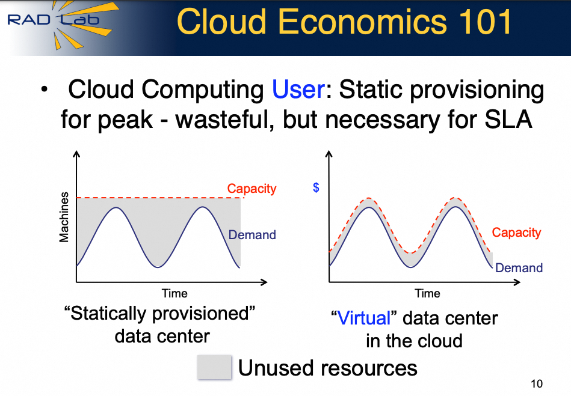
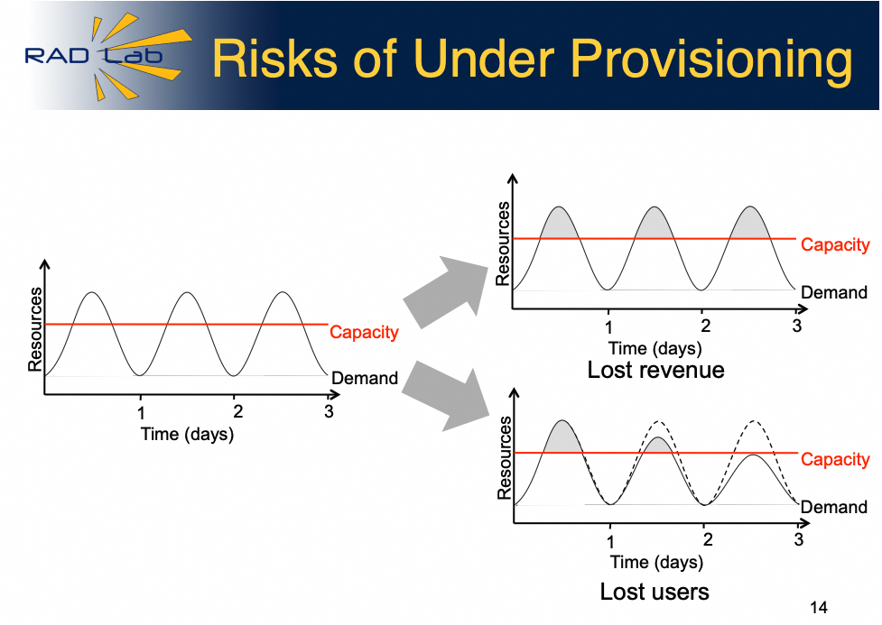

# 从金融的视角谈云计算
[从金融的视角谈云计算](https://mp.weixin.qq.com/s?__biz=MzUxNzQ5MTExNw==&mid=2247488712&idx=1&sn=c3ae48e1c0b3fe9bebfdf2b6d8d5bc0f&chksm=f996040acee18d1c86d93b9a44ad9de972f57e0c99086e04a7d20a342f9175ade81fb8e1b51d&scene=21#wechat_redirect) 

 TL；DR
-----

比尔盖茨曾说过："Banking is neccesary, Banks are not". 王坚博士讲过:"计算，为了无法计算的价值(Computing for Value Beyond Computation)". 本质上博士也是在阐述计算的价值，那么照着写一句:"Computing is neccesary, Computers are not". 

似乎这样来看更有云计算的味道，又有了几分Serverless，Datacenter as a computer的意境。

本文的内容是前几天和一位金融机构的副总闲聊云计算和公共云优先策略的时候一起谈论到的一些内容整理，特别是云计算弹性和金融机构的流动性管理，算力的证券化和结构化等有很多相似性，本文仅记录双方闲聊时的一些观点和双方任职的公司无关。

1\. 算力和货币的区别
------------

算力的杠杆在哪？换句话说算力如何能够像货币那样的流动性(弹性)供给?

货币扩张，也称作货币创造(英语：Money creation)，是中央银行、商业银行和非银行透过信贷关系共同作用，使得在银行体系内流通货币量扩大的金融行为。而算力和货币的本质区别是，算力背后是实实在在的服务器提供的，更通俗的说法是，货币是能上杠杆的，而算力的杠杆在哪？

对于一个企业，可以通过融资租赁，保付代理，短期借贷，股权融资等一系列金融手段实现资金对业务的按需供应。而Berkeley在2009年谈论云计算时，有一篇著名的论文：《Above the Clouds: A Berkeley View of Cloud Computing》\[1\], 还有一份在USENIX演讲的PPT\[2\]

也在算这样一笔金融账:

然后道出算力本身没有杠杆而应对业务弹性产生的两难问题：

而正是这一篇文章很好的诠释了云计算如何给算力带来的杠杆:

1.  可以按需使用无限量的计算资源
    
2.  消除云用户的预先承诺
    
3.  根据实际需要支付短期使用计算资源的费用
    
4.  通过超大规模的数据中心等规模经济显著降低成本
    
5.  通过资源虚拟化技术简化操作并提高资源利用率
    
6.  通过多路复用的方式运行来自不同组织的负载，提高硬件资源的利用率
    

从金融的角度来看，前两条讲的是算力要有刚性兑付，第三条讲的是算力的租赁关系，第四条到第六条讲的是类似于金融机构的云计算`算力机构`的经营管理。

2\. 私有云混布和企业司库
--------------

企业司库管理是指企业内负责资金管理职能的部门，主要负责现金管理，风险控制，资金划拨等职能。本质上是在企业内构建资金池，然后通过FTP(内部资金转移定价)等内部核算价格机制来划拨资金。同等在企业IT中的私有云管理和混布职能本质上和企业司库管理是相通的，但现阶段还没有根据业务需求对于算力使用的区分定价能力，更多的是时分复用来混布只是解决了私有云内无法获得外部算力借贷时的资源配置问题。

企业中的司库部门和金融机构正好构成交易对手。那么私有云的`算力司库`的管理者和公共云这些`算力金融机构`的交易机制是什么呢？如何让这些企业算力司库灵活的按需的上算力杠杆呢？

首先我们来看自建私有云存在一系列问题：1. IDC建设成本高昂，服务器/网络等硬件设施建设流程长成本高，对于业务的算力增长无法提前预测和规划。2. 后期运维复杂，私有云需要部署大量的运维团队，这对企业尤其是中小企业来说是一个不小的负担。3. 进一步的弹性伸缩能力有问题，向公共云要弹性需要一系列对接考虑。

关键是从金融的视角来看，和传统的金融司库还有不同的是，私有云建设属于固定资产投资，财务上的摊销折旧，实际上和金融机构常见的`借短贷长`的资产负债管理方式是相通的。

3\. 云原生是什么？
-----------

Banking is necessary,但为什么没有 Banking Native?因为货币 那么云原生的本质是什么?算力证券化的过程。

AWS对云原生的定义如下:

> 云原生是在云计算环境中构建、部署和管理现代应用程序的软件方法。现代企业希望构建`高度可扩展、灵活且具有弹性`的应用程序，可以`快速更新`以满足客户需求。为此，他们使用`现代工具和技术`，这些工具和技术本质上支持云基础设施上的应用程序开发。

它只是一个方法:

*   `目的`是高度可扩展/灵活且具有弹性，并能快速更新满足客户需求的方法。
    
*   `手段`是使用了现代的工具和技术，恰好这些技术和工具支持云基础设施上的程序开发。
    

那么我们再臆造一个词叫银行业原生，或者金融原生。那么金融业是如何服务好企业，让企业的业务具有高度可扩展性/灵活且具有弹性的呢？最有代表性的是保理业务和供应链金融业务。

`保理业务`:以债权人转让其应收账款为前提，集应收账款催收、管理、坏账担保及融资于一体的综合性金融服务。债权人将其应收账款转让给商业银行，由商业银行向其提供下列服务中至少一项的，即为保理业务：

1.  应收账款催收：商业银行根据应收账款账期，主动或应债权人要求，采取电话、函件、上门等方式或运用法律手段等对债务人进行催收。
    
2.  应收账款管理：商业银行根据债权人的要求，定期或不定期向其提供关于应收账款的回收情况、逾期账款情况、对账单等财务和统计报表，协助其进行应收账款管理。
    
3.  坏账担保：商业银行与债权人签订保理协议后，为债务人核定信用额度，并在核准额度内，对债权人无商业纠纷的应收账款，提供约定的付款担保。
    
4.  保理融资：以应收账款合法、有效转让为前提的银行融资服务。
    

`供应链金融`(Supply Chain Finance,SCF)，是商业银行信贷业务的一个专业领域（银行层面），也是企业尤其是中小企业的一种融资渠道（企业层面）。 指银行向客户（核心企业）提供融资和其他结算、理财服务，同时向这些客户的供应商提供贷款及时收达的便利，或者向其分销商提供预付款代付及存货融资服务。（简单地说，就是银行将核心企业和上下游企业联系在一起提供灵活运用的金融产品和服务的一种融资模式。）

但是为什么没有所谓的`金融原生`呢，而在算力交易的过程中有`云原生`呢?本质上就是一个`算力证券化`的过程，需要现代的工具和技术来实现算力证券化，即算力的标准交付，然后有了算力的标准交付后，才有后面的像货币那样的结构化交易等流程的出现。

容器也好，微服务也罢，本质上是算力标准化交付的手段，是工具和技术。但目的是`算力证券化`的过程，即Berkeley提到的第二条：根据实际需要支付短期使用计算资源的费用。本质问题是短期有多短的的问题，分钟级/秒级/微秒级? 通过什么手段实施，如何交易?国内又出现了一种非标的金融产品`算力券`，它需要类似于OTC的场外交易机制，合同签订政府补贴。如何能够按照分钟级别秒级别使用算力卷呢? 如何对不同的算力提供方定价呢?

实际上云原生不光是一个技术问题，本质上还是一个商业模式的问题，其核心是如何通过技术手段支持商业模式上的`算力证券化`交付，而交付算力又需要考虑? 更细粒度的计费自然就引出了Serverless, Berkeley又有一篇论文讲《Serverless Computing: One Step Forward, Two Steps Back》 在此就不多展开了.

4\. 算力证券化和公共云优先
---------------

算力本身不可创生，而算力证券化带来的交易本质上是一个流动性限制下的刚性兑付的问题

企业面对业务的弹性需求，需要对算力获取弹性能力，算力不可创生，那么典型的做法就是构建私有云在内部腾挪和按照时间兑付。而这样的机制下的经营弹性受制于IDC建设规模和投资周期，并且很难通过自建IDC获得算力杠杆。

任何金融产品交易我们都知道，只有标准化的交易所，标准化的仓单才能获得最大的流动性，降低交易成本，并且充分的价格发现机制。而算力的刚性兑付决定了向公共云租赁`算力`获取业务弹性成为必然。而规模越大的交易平台其交易成本和价格发现机制也会更加充分，所以这就是公共云优先的本质逻辑。

5\. 算力的结构化和衍生品
--------------

云计算的过程中的算力证券化过程涉及技术的演进，也涉及商业模式的变革，算力的计费方式来看，既有按量付费的标准现货交易模式，也有包年包月等类似于定期存款的业务模式，也有容量包等进一步补充的结构化存款模式，当然也有预留实例券这样的期权/期货交易模式。

回到本质上来看，如下图所示，实际业务诉求是Capacity高于Demand实现刚性兑付

当然刚性兑付主要是在线业务，离线业务并不那么需要刚兑，那么如何能够在企业算力司库和云计算厂商之间构建更合理的交易机制呢?

席间和这位金融机构的副总谈到这个问题时，她的建议是：结构化产品正好满足了这样的需求，对于在线业务等需要刚兑的购买优先级，而对于离线业务购买劣后级? 那么对应的技术上的交易如何执行?这又涉及了下一个问题

6.算力的流动性管理
----------

做大规模，公共云优先，标准化算力是提供高质量流动性的必然出路

流动性风险管理是指银行应避免各种业务品种在某一特定的时期风险过分集中和业务中产生的资金流量缺口风险。同时必须考虑自身财务状况恶化时，被交易对手要求提前终止安排或提高信用安排时所需要的融资来源。那么云计算机构的流动性管理和库存调度如何能够更好的匹配算力的弹性需求? 简而言之规模越大流动性越好，流动性成本越低。做大规模，公共云优先才是一条正路，简单的来说就像四大行对其它股份制银行或者农商行。

另一方面是来自于交易模式上，用户自服务的方式而不是线下议价合同的方式将会更好的释放流动性，当然短期内在流动性缺乏时也会存在一些做市商那样的去间接提供流动性，但最终充分的弹性用云和大规模的流动性供应上,会在双方提供大量的流动性。

### 参考

\[1\]

Above the Clouds: A Berkeley View of Cloud Computing: https://www2.eecs.berkeley.edu/Pubs/TechRpts/2009/EECS-2009-28.pdf,

\[2\]

PPT,Above the Clouds:A Berkeley View of Cloud Computing: https://www.usenix.org/legacy/event/lisa09/tech/slides/fox.pdf,