# 何恺明LeCun联手改造Transformer！9行代码替代归一化层，性能不减还加速
##### 梦晨 克雷西 发自 凹非寺  
量子位 | 公众号 QbitAI

何恺明LeCun联手：**Transformer不要归一化了**，论文已入选CVPR2025。

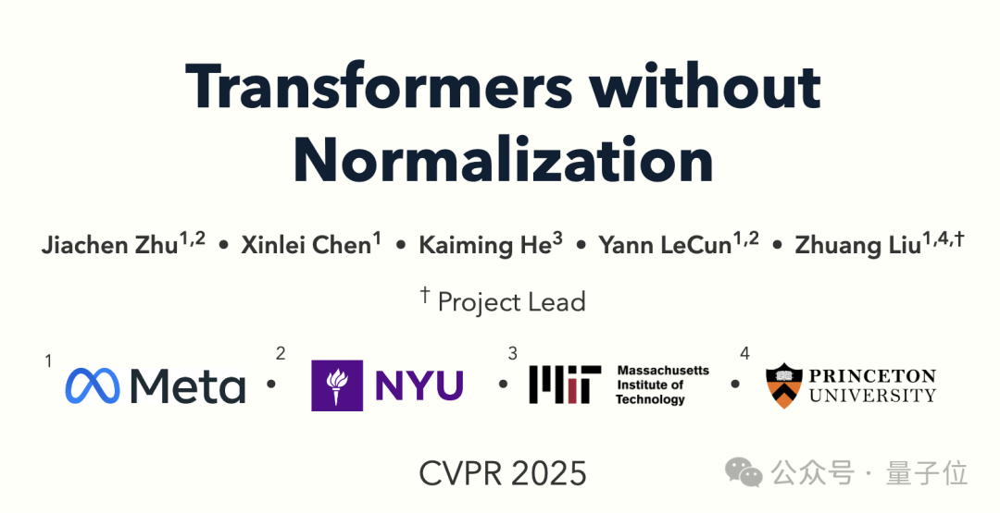

归一化长期以来一直被认为是必不可少的，在现代神经网络中无处不在。

但团队认为可以换用一种非常简单的技术，他们提出**DyT**（Dynamic Tanh)，直接替代Layer Norm或RMSNorm，性能达到或超过标准Transformer。

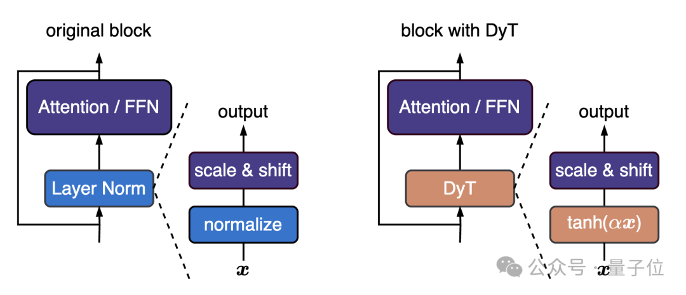

DyT模块可以用几行PyTorch代码实现：

```ruby
class DyT(nn.Module):
    def __init__(self, num_features, alpha_init_value=0.5):
        super().__init__()
        self.alpha = nn.Parameter(torch.ones(1) * alpha_init_value)
        self.weight = nn.Parameter(torch.ones(num_features))
        self.bias = nn.Parameter(torch.zeros(num_features))

    def forward(self, x):
        x = torch.tanh(self.alpha * x)
        return x * self.weight + self.bias
```

从视觉的ViT/MAE，到语言模型的LLaMA，再到语音、DNA系列等模态都可以用，完整代码库已开源。

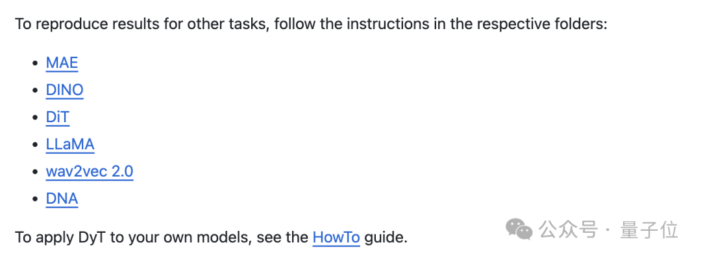

网友评价说，只要元素级运算就能实现和归一化一样的效果，这对于效率优化来说简直是免费的午餐。

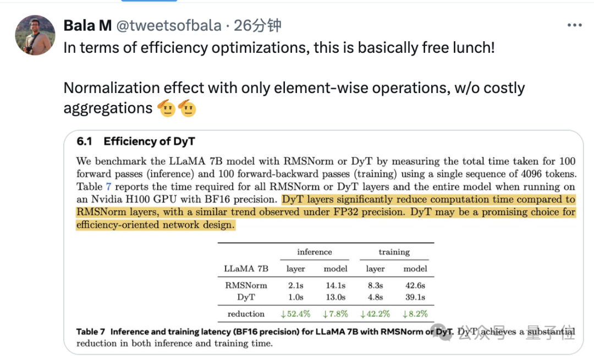

前Salesforce首席科学家、搜索引擎You的CEO Richard Socher也表示，这项成果加强了他之前的假设——原始的Transformer只是众多等效神经结构之中的一个。

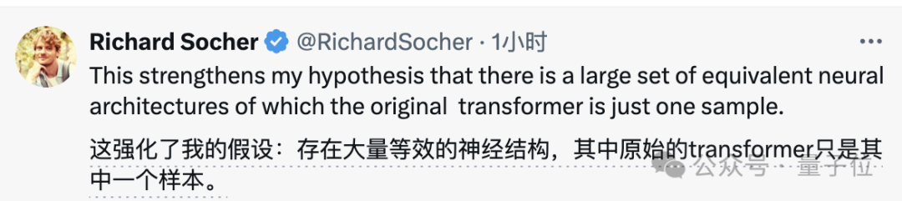

Transformer不要归一化了
-----------------

团队首先实证研究了训练网络中归一化层的行为。

选取ViT、wav2vec 2.0和DiT三种训练好的网络，对每个网络采样一个小批量样本进行前向传播，测量LayerNorm层在可学习仿射变换前的输入和输出，建立输入输出元素的一一对应关系，从而直接可视化两者关系。

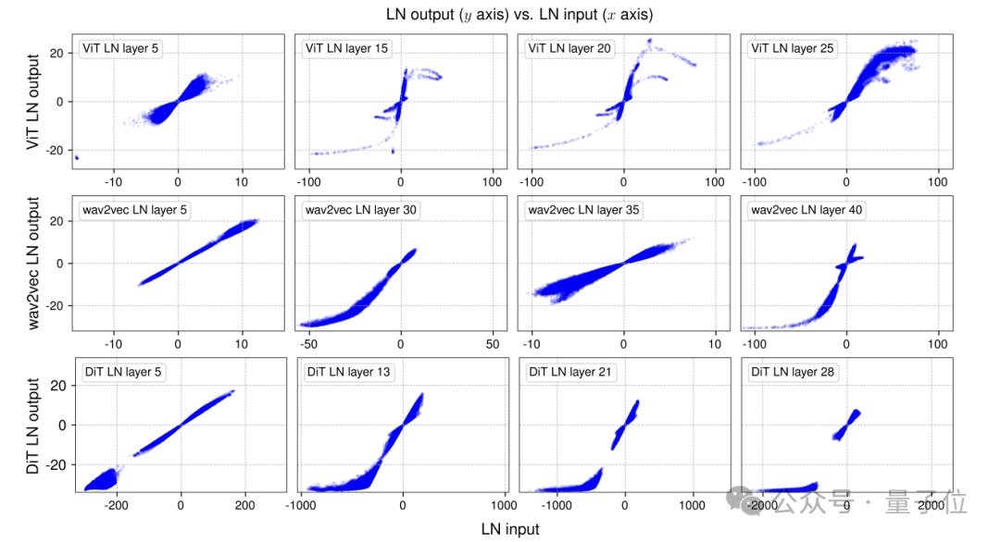

结果发现，LayerNorm传统上被认为是**线性变换**，但实际整体居然呈现出出类似tanh函数**非线性变换**效果。

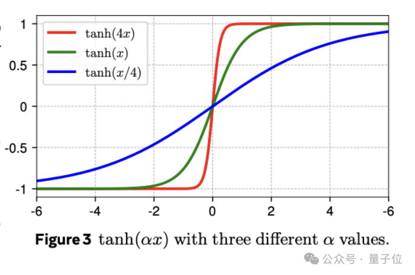

受到这一相似性启发，团队提出DyT作为归一化层的直接替代品， DyT 层定义如下：

**DyT(x) = γ \* tanh⁡(αx) + β**

其中α是可学习的标量参数，负责缩放调整输入；γ和β是可学习的per-channel矢量参数，将输出缩放回任何尺度。

DyT适用于注意力块、FFN块和最终归一化层，尽管它可能看起来像是激活函数，但在这篇研究中不会改变原始架构中激活函数的任何部分，网络的其他部分也保持不变。

同时团队还观察到，**几乎不需要调整原始架构使用的超参数**即可使DyT表现良好。

实验选用多种任务和模型架构，DyT在大多数情况下能达到与归一化层相当甚至更好的性能。

**视觉监督学习**，选用ViT和ConvNeXt，在ImageNet-1K分类任务中训练，DyT在两种架构的不同模型尺寸下，性能均略优于LayerNorm，且模型收敛行为高度一致，表明二者学习动态相似。

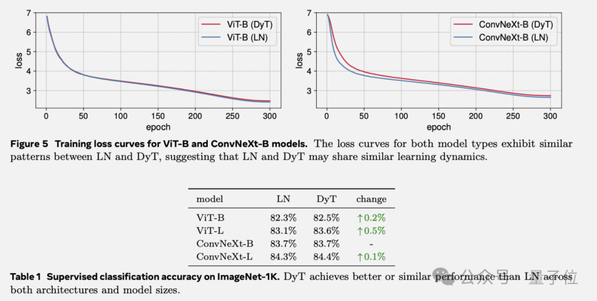

**视觉自监督学习，**选用两种训练目标不同的网络MAE和DINO，DyT的表现与LayerNorm相当。

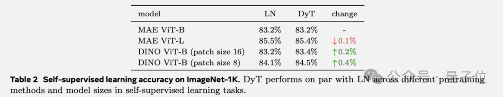

**扩散模型**实验中，训练了三个不同尺寸的DiT模型，用FID分数评估生成图像质量。

仅用 tanh (αx) 函数替换DiT中LN 层的归一化变换，保留其仿射参数（用于class conditionin），结果相差也不大。

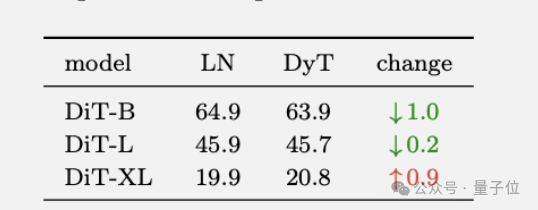

**语言模型**实验中，用DyT代替了LLaMA默认的RMSNorm，在所有四种参数规模上的性能与RMSNorm相当，在整个训练过程中，训练损失保持一致。

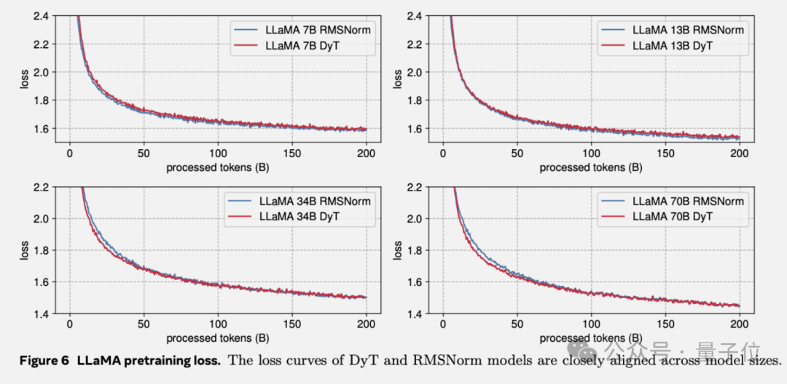

**语音、DNA序列模型**中的情况也类似。

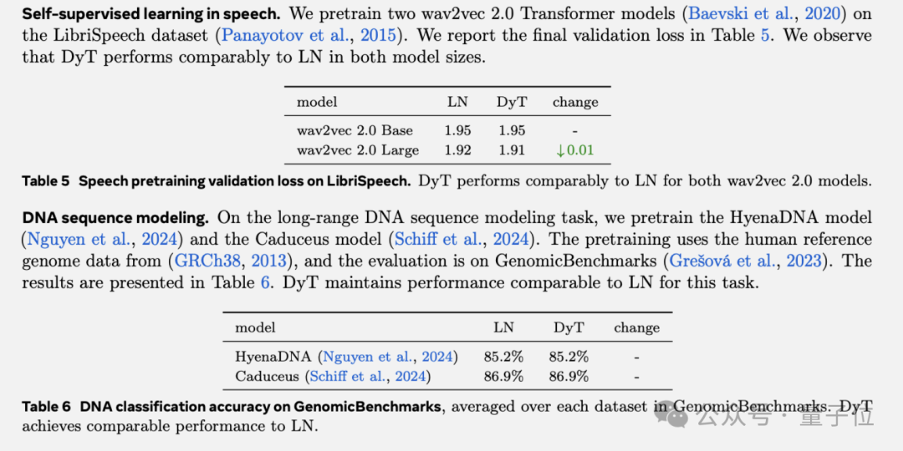

但DyT的作用不止于此，在训练效率方面也有很大提升。

以LLaMA 7B为研究对象，分别采用RMSNorm和DyT进行实验，测量在使用单个长度为4096 tokens的序列时，100次前向传递（推理）和100次前向-后向传递（训练）所需的总时间。

在BF16精度下，**DyT显著缩短了计算时间**，另外在FP32精度下观察到类似的趋势。

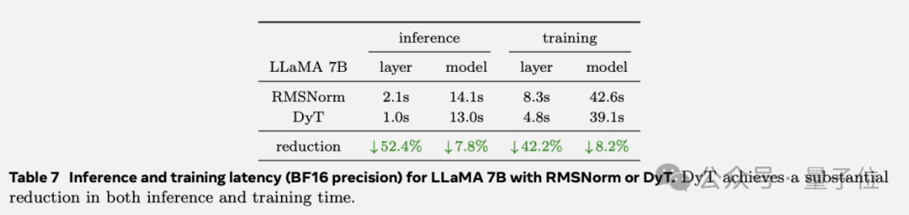

但DyT也有局限性，在非Transformer模型中，如**替换ResNet的Batch Norm时效果不佳**，是否以及如何适应其他类型归一化层的模型还需进一步研究

作者团队
----

包括何恺明和LeCun在内，本文的作者一共有五位，其余三位分别是第一作者、纽约大学博士生Jiachen Zhu，以及来自Meta FAIR实验室的刘壮和陈鑫磊。

虽然这是五人第一次聚在一起发表的论文，但其中部分成员之间的合作已经进行过多次。

项目负责人、Meta FAIR实验室科学家刘壮，就是何恺明的一位“老搭档”。

和何恺明一样，刘壮本科毕业自清华，并且也是CVPR最佳论文奖得主——他是CVPR2017最佳论文DenseNet的第一作者。

2017年，刘壮从清华姚班毕业，进入加州大学伯克利分校攻读博士学位，师从Trevor Darrell，是贾扬清的同门师弟。

博士毕业后，刘壮进入Meta AI Research工作。在此之前，他已经在Meta实习了一年多时间，期间和谢赛宁合作，发表了ConvNeXt。

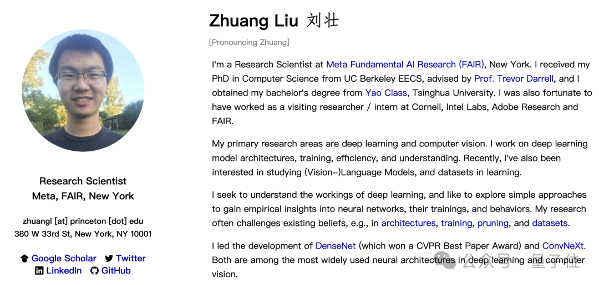

还有浙大校友陈鑫磊， 目前是Meta FAIR实验室的研究科学家，研究兴趣集中于预训练，特别是有自监督或是多模态视觉表示的预训练。

发表在CVPR上、目前谷歌学术引用量达8998次的MAE开山论文，陈鑫磊与何恺明是共同一作，谢赛宁也参与其中。

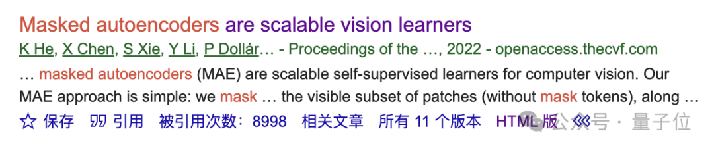

第一作者Jiachen Zhu，来自重庆，本科就读于香港理工大学，取得了计算机和工商管理双重学位。

本科毕业3年后，Jiachen Zhu重回校园，到纽约大学先后攻读计算机硕士和博士学位，目前仍然在读，博士生导师就是LeCun。

谷歌学术信息显示，除了本次的新成果之外，Jiachen Zhu自2022年至今一共还发表过5篇论文，其中3篇为一作或共同一作，每篇均有LeCun的参与。

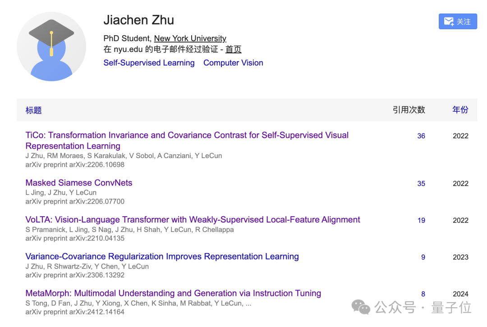

并且Jiachen Zhu去年以Meta实习生身份发表的一篇关于多模态理解与生成的论文，也与刘壮、陈鑫磊以及LeCun的参与。

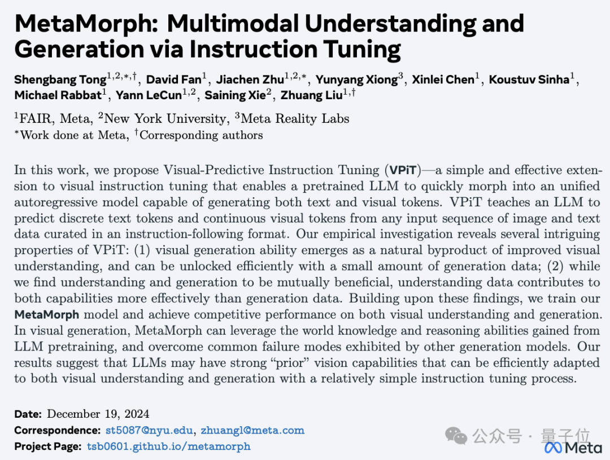

论文地址：  
https://arxiv.org/abs/2503.10622v1

GitHub地址：  
https://github.com/jiachenzhu/DyT

项目主页：  
https://jiachenzhu.github.io/DyT/

参考链接：  
\[1\]https://x.com/liuzhuang1234/status/1900370738588135805

— **完** —