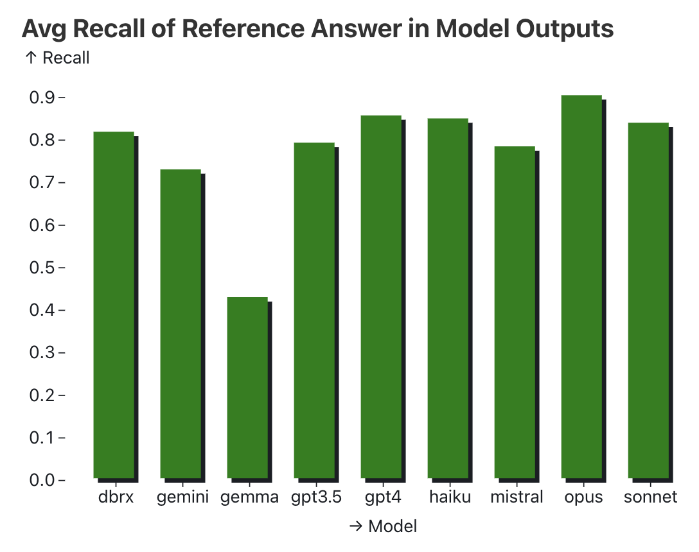

# 使用大语言模型 (LLMs) 构建产品一年后的经验总结 (第一部分) [译] | 宝玉的分享
_想直接听作者们讨论这个话题，请报名参加 6 月 20 日的 [即将举行的虚拟活动](https://lu.ma/e8huz3s6?utm_source=or)_，_并了解更多 6 月 12 日的 [生成式 AI 成功案例超级流](https://www.oreilly.com/live-events/generative-ai-success-stories/0642572002950/)_。_本系列的第二部分和第三部分即将推出，敬请期待。_

现在是使用大语言模型 (LLMs) 构建产品的激动人心的时刻。在过去的一年中，LLMs 的表现已经“足够好”可以应用于现实世界。LLMs 改进的速度，加上社交媒体上的大量演示，将推动预计到 2025 年 AI 投资达到 2000 亿美元。LLMs 的广泛可用性，让每个人，而不仅仅是机器学习工程师和科学家，都能在他们的产品中构建智能。虽然构建 AI 产品的门槛已经降低，但要创建那些不仅仅是演示效果好的产品，仍然充满挑战。

我们已经总结了一些关键但常常被忽视的经验和方法，这些方法通过机器学习得出，对于开发基于 LLMs 的产品至关重要。了解这些概念可以让你在无需机器学习专业知识的情况下，相对于大多数同行获得竞争优势！在过去的一年里，我们六个人一直在基于 LLMs 构建现实世界的应用。我们意识到有必要将这些经验教训汇总在一起，分享给整个社区。

我们来自不同的背景，并在不同的角色中工作，但我们都亲身经历了使用这项新技术带来的挑战。我们中的两个人是独立顾问，帮助许多客户将 LLM 项目从初始概念变成成功的产品，见证了决定成败的模式。我们中的一人是研究人员，研究机器学习和 AI 团队的工作方式以及如何改进他们的工作流程。我们中的两个人是应用 AI 团队的领导者：一个在科技巨头公司，另一个在初创公司。最后，我们中的一人教授了数千人学习深度学习，现在致力于让 AI 工具和基础设施更易于使用。尽管我们的经历不同，但我们对所学经验中的一致性感到震惊，并且惊讶这些见解没有得到更广泛的讨论。

我们的目标是将这本指南打造成围绕 LLMs 构建成功产品的实用手册，借鉴我们的亲身经验，并引用业界的例子。过去一年中，我们亲自动手实践，获得了宝贵的教训，很多时候是通过艰难的方式学到的。虽然我们不敢自称代表整个行业，但在这里我们分享了一些建议和经验，供任何构建 LLMs 产品的人参考。

这项工作分为三个部分：战术、运作和战略。这是其中的第一部分，深入探讨了使用大语言模型 (LLM) 的战术细节。我们分享了关于提示设计、设置检索增强生成、应用流程工程以及评估和监控的最佳实践和常见陷阱。无论你是使用 LLM 的从业者还是在周末进行项目开发的开发者，这一部分都是为你而写的。请在接下来的几周内留意运作和战略部分。

准备好深入了解了吗？让我们开始吧。

[](#战术)**战术**
-------------

在本节中，我们分享了大语言模型核心组件的最佳实践，包括提高质量和可靠性的提示设计、评估输出的策略、改进基础的检索增强生成理念等。我们还探讨了如何设计人类参与的工作流程。尽管技术仍在快速发展，我们希望这些经验教训——我们集体进行的无数实验的成果——能够经受住时间的考验，并帮助你构建和发布稳健的 LLM 应用。

### [](#提示设计)**提示设计**

我们建议在开发新应用时从提示设计开始。它的作用既容易被低估也容易被高估。被低估是因为正确的提示技术使用得当可以带来显著效果。被高估是因为即使是基于提示的应用也需要大量的工程工作才能运行良好。

#### [](#聚焦于如何最大化利用基本提示技巧)**聚焦于如何最大化利用基本提示技巧**

有几种提示技巧在各种模型和任务中都能显著提高性能：n-shot 提示与上下文学习、链式思维提示，以及提供相关资源。

通过 n-shot 提示进行上下文学习的核心思路是给大语言模型 (LLM) 提供一些示例，这些示例展示了任务要求，并引导模型输出符合预期。一些提示：

*   如果 n 过低，模型可能会过度依赖这些特定示例，影响其泛化能力。一般来说，n 应该不小于 5，甚至可以达到几十个。
*   示例应能代表预期输入的分布。如果您正在构建一个电影摘要生成器，请包含不同类型的样本，比例大致与实际情况相符。
*   不一定要提供完整的输入输出对。在很多情况下，仅提供期望输出的示例就足够了。
*   如果您使用支持工具的大语言模型，您的 n-shot 示例也应包括您希望智能体使用的工具。

在链式思维 (CoT) 提示中，我们鼓励大语言模型在返回最终答案之前解释其思维过程。可以把它看作是给模型提供一个草稿本，这样它就不必全部在记忆中完成。最初的方法是简单地在指令中添加“让我们一步一步思考”这个短语。然而，我们发现使链式思维更具体，通过添加一两句额外的说明，可以显著降低幻觉率。例如，当要求大语言模型总结会议记录时，我们可以明确步骤，例如：

*   首先，在草稿本上列出关键决策、后续事项和相关负责人。
*   然后，检查草稿本中的细节是否与记录一致。
*   最后，将关键点综合成一个简洁的摘要。

最近，关于这种技术是否像人们认为的那样有效，有一些[质疑](https://arxiv.org/abs/2405.04776) 。此外，对于使用链式思维进行推理时具体发生了什么，也存在许多争论。无论如何，这种技术在可能的情况下值得尝试。

提供相关资源是一种强大的方法，可以扩展模型的知识库，减少幻觉，并增加用户的信任。通常通过检索增强生成 (RAG) 实现，向模型提供它可以直接在响应中使用的文本片段是一种关键技术。在提供相关资源时，仅仅包含它们是不够的；还需要告诉模型优先使用这些资源，直接引用它们，并在资源不足时提到这一点。这些有助于让智能体的响应基于一组资源。

#### [](#输入输出结构化)**输入输出结构化**

将输入和输出进行结构化可以帮助模型更好地理解输入，并返回可以可靠集成到下游系统的输出。为输入添加序列化格式能够提供更多关于上下文中 tokens 之间关系的线索，为特定 tokens 提供额外的元数据（如类型），或将请求与模型训练数据中的类似示例联系起来。

例如，很多关于编写 SQL 的问题在互联网上都以指定 SQL 模式开始。因此，针对文本到 SQL 的有效提示应该包括结构化的模式定义；[确实如此](https://www.researchgate.net/publication/371223615_SQL-PaLM_Improved_Large_Language_ModelAdaptation_for_Text-to-SQL)。

结构化输出不仅具有类似的目的，还简化了与系统下游组件的集成。[Instructor](https://github.com/jxnl/instructor)和[Outlines](https://github.com/outlines-dev/outlines)在结构化输出方面表现良好。（如果您正在导入 LLM API SDK，请使用 Instructor；如果您正在导入 Huggingface 进行自托管模型，请使用 Outlines。）结构化输入可以清晰地表达任务，并且格式类似于训练数据，从而增加了获得更好输出的概率。

在使用结构化输入时，请注意每种大语言模型都有自己的偏好。Claude 偏好 `xml`，而 GPT 则偏好 Markdown 和 JSON。使用 XML 时，您甚至可以通过提供 `response` 标签来预先填充 Claude 的响应。

```
```


messages=\[

  {

  "role":  "user",

  "content":  """Extract the <name>, <size>, <price>, and <color>

 from this product description into your <response>.

 <description>The SmartHome Mini

 is a compact smart home assistant

 available in black or white for only $49.99.

 At just 5 inches wide, it lets you control

 lights, thermostats, and other connected

 devices via voice or app—no matter where you

 place it in your home. This affordable little hub

 brings convenient hands-free control to your

 smart devices.

 </description>"""

  },

  {

  "role":  "assistant",

  "content":  "<response><name>"

  }

\]


```


```

#### [](#编写小而精的提示词专注做好一件事)**编写小而精的提示词，专注做好一件事**

在软件开发中，有一个常见的反模式叫“[万能对象](https://en.wikipedia.org/wiki/God_object)”，即一个类或函数承担了所有的功能。提示词也有类似的问题。

提示词通常从简单开始：几句指令、几个例子，就可以使用了。但随着我们不断提高性能，处理更多边缘情况，复杂性就会增加。更多的指令，多步骤推理，几十个例子。不知不觉中，我们原本简单的提示词变成了一个包含 2000 个 token 的复杂体。而更糟的是，它在处理常见和简单输入时的表现更差！GoDaddy 分享了他们在使用大语言模型时的[首要经验](https://www.godaddy.com/resources/news/llm-from-the-trenches-10-lessons-learned-operationalizing-models-at-godaddy#h-1-sometimes-one-prompt-isn-t-enough)。

我们在保持系统和代码简单的同时，也应该保持提示词的简洁。与其为会议记录摘要器提供一个包罗万象的提示词，我们可以将任务分解为几个步骤：

*   提取关键决策、行动项和负责人，并转化为结构化格式
*   检查提取的细节与原始记录的一致性
*   从结构化细节中生成简明的摘要

通过这样分解，我们将单一提示词拆分成了多个简单、专注且易于理解的提示词。这样，我们可以分别迭代和评估每个提示词的效果。

#### [](#精心设计你的上下文信息)**精心设计你的上下文信息**

重新思考并挑战你关于需要向智能体发送多少上下文信息的假设。像米开朗基罗雕塑一样，不是不断堆砌上下文，而是剔除多余的部分，直到雕塑显现。RAG 是一种流行的收集所有可能相关信息块的方法，但你在提取必要信息时做了什么？

我们发现，将最终发送给模型的提示词——包括所有的上下文构建、元提示词和 RAG 结果——放在一张空白页上阅读，确实有助于重新思考上下文。通过这种方法，我们发现了冗余、自相矛盾的语言和糟糕的格式。

另一个关键的优化点是上下文的结构。你的文档堆积对人类没有帮助，不要以为对智能体就有用。仔细考虑如何结构化你的上下文，以突出其各部分之间的关系，并尽量简化提取过程。

### [](#信息检索检索增强生成rag)**信息检索/检索增强生成（RAG）**

除了使用提示引导大语言模型（LLM）外，另一种有效的方法是将知识作为提示的一部分提供。这种方法将 LLM 锚定在提供的上下文上，用于上下文学习，这被称为检索增强生成（RAG）。实践中发现，RAG 在提供知识和改进输出方面非常有效，而且所需的努力和成本远低于微调。RAG 的效果取决于所检索文档的相关性、信息密度和细节程度。

#### [](#rag-输出的质量取决于所检索文档的质量可以从几个因素进行考量)**RAG 输出的质量取决于所检索文档的质量，可以从几个因素进行考量。** 

第一个也是最明显的指标是相关性。相关性通常通过排名指标进行量化，例如[平均倒数排名（MRR）](https://en.wikipedia.org/wiki/Mean_reciprocal_rank)或[归一化折扣累计增益（NDCG）](https://en.wikipedia.org/wiki/Discounted_cumulative_gain)。MRR 评估系统将第一个相关结果放在排名列表中的能力，而 NDCG 则考虑所有结果的相关性及其位置。这些指标衡量系统将相关文档排在更高位置、不相关文档排在更低位置的能力。例如，如果我们检索用户摘要以生成电影评论摘要，我们会希望特定电影的评论排名更高，而排除其他电影的评论。

与传统推荐系统类似，检索到的项目排名将对 LLM 在下游任务中的表现产生重大影响。为了衡量这种影响，可以运行一个基于 RAG 的任务，但将检索到的项目顺序打乱，然后观察 RAG 输出的表现如何。

其次，我们还要考虑信息密度。如果两个文档同样相关，我们应该选择更简洁且细节较少的那个。回到电影的例子，我们可能认为电影剧本和所有用户评论在广义上都是相关的。然而，顶级评论和编辑评论的信息密度可能更高。

最后，要考虑文档提供的细节程度。想象我们正在构建一个 RAG 系统，从自然语言生成 SQL 查询。我们可以简单地提供表结构和列名作为上下文，但如果包括列描述和一些代表性值，额外的细节将帮助 LLM 更好地理解表的语义，从而生成更正确的 SQL。

#### [](#别忘了关键词搜索把它作为基线并在混合搜索中使用)**别忘了关键词搜索：把它作为基线并在混合搜索中使用**

由于基于嵌入（Embedding）的 RAG 方案演示的流行，很容易让人忘记或忽视信息检索领域几十年的研究和解决方案。

尽管嵌入技术无疑是强大的工具，但它并不是万能的。首先，虽然它们擅长捕捉高级语义相似性，但在处理更具体的基于关键词的查询时可能会遇到困难，比如用户搜索人名（如 Ilya）、缩写词（如 RAG）或 ID（如 claude-3-sonnet）时。关键词搜索，例如 BM25，就是专门为此设计的。经过多年的关键词搜索，用户可能已经习以为常，如果他们期望检索到的文档没有返回，可能会感到沮丧。

> 向量嵌入并不是搜索的万能解决方案。事实上，在使用语义相似搜索进行重新排序之前的步骤才是最关键和费力的。要真正实现比 BM25 或全文搜索更好的效果是非常困难的。 — [Aravind Srinivas, CEO Perplexity.ai](https://x.com/AravSrinivas/status/1737886080555446552)

> 几个月来我们一直向客户和合作伙伴反复强调：使用简单的嵌入进行相似检索会产生非常杂乱的结果，还不如从关键词搜索开始。 — [Beyang Liu, CTO Sourcegraph](https://twitter.com/beyang/status/1767330006999720318)

其次，使用关键词搜索更容易理解为什么会检索到某个文档——我们可以查看匹配查询的关键词。相比之下，基于嵌入的检索则不那么容易解释。最后，得益于经过几十年优化和实战测试的 Lucene 和 OpenSearch 等系统，关键词搜索通常更具计算效率。

在大多数情况下，混合搜索是最有效的：关键词匹配用于明显的匹配，而嵌入用于同义词、上位词和拼写错误，以及多模态（如图像和文本）。[Shortwave 分享了他们如何构建 RAG 管道](https://www.shortwave.com/blog/deep-dive-into-worlds-smartest-email-ai/)，包括查询重写、关键词 \+ 嵌入检索和排序。

#### [](#优先选择-rag-而不是微调以获取新知识)**优先选择 RAG 而不是微调以获取新知识**

我们可以通过 RAG 或微调来将新信息融入大语言模型（LLM），并提升其在特定任务上的表现。那么，我们应该先尝试哪种方法呢？

最新研究表明，RAG 可能更具优势。一项研究比较了 RAG 与无监督微调（即继续预训练），并在 MMLU 的一个子集和当前事件上进行了评估。结果显示，无论是对训练中遇到的知识还是全新的知识，RAG 的表现都优于微调。在另一篇论文中，他们在农业数据集上比较了 RAG 与有监督微调。结果同样显示，RAG 的性能提升比微调更大，尤其是在大语言模型 GPT-4 上（见该论文的表 20）。

除了性能提升之外，RAG 还有一些实际优势。首先，与继续预训练或微调相比，保持检索索引更新既容易又便宜。其次，如果我们的检索索引中包含有毒或有偏见内容的文档，我们可以轻松地删除或修改这些有问题的文档。

此外，RAG 中的 R 提供了更精细的文档检索控制。例如，如果我们为多个组织托管一个 RAG 系统，通过分区检索索引，我们可以确保每个组织只能检索到自己索引中的文档，从而避免无意间将一个组织的信息暴露给另一个组织。

#### [](#长上下文模型不会让-rag-过时)**长上下文模型不会让 RAG 过时**

随着 Gemini 1.5 提供了多达 1000 万个 tokens 的上下文窗口，一些人开始质疑 RAG 的未来。

> 我认为 Sora 对 Gemini 1.5 的宣传大大夸大了。一个 1000 万 tokens 的上下文窗口实际上使大多数现有的 RAG 框架变得不必要——你只需将你的数据放入上下文中，像往常一样与模型对话。想象一下，这对那些大部分工程努力都集中在 RAG 上的初创公司/智能体/LangChain 项目会产生怎样的影响 😅 简单一句话：这个 1000 万的上下文杀死了 RAG。干得好，Gemini。
> 
> — [Yao Fu](https://x.com/Francis_YAO_/status/1758935954189115714)

虽然长上下文在分析多份文档或与 PDF 对话等用例中将是一个变革性的工具，但有关 RAG 消亡的传闻被大大夸大了。

首先，即使有 1000 万 tokens 的上下文窗口，我们仍然需要一种方法来选择输入模型的信息。其次，除了狭义的“大海捞针”评估之外，我们还没有看到令人信服的数据表明模型可以有效地在如此大的上下文中进行推理。因此，没有良好的检索（和排序），我们有可能让模型被干扰信息淹没，甚至可能将完全不相关的信息填充到上下文窗口中。

最后，是成本问题。Transformer 的推理成本随着上下文长度呈二次方（或在空间和时间上呈线性）增长。仅仅因为存在一个可以在回答每个问题之前读取你组织整个 Google Drive 内容的模型，并不意味着这是个好主意。类比我们如何使用 RAM：即使存在内存容量达到数十 TB 的计算实例，我们仍然需要从磁盘读写数据。

所以不要急着把你的 RAG 丢掉。即使上下文窗口的大小在增加，这种模式仍然有用。

### [](#调整和优化工作流)**调整和优化工作流**

提示大语言模型只是开始。要充分利用它们，我们需要超越单一提示，拥抱工作流。例如，如何将一个复杂的任务拆分成多个简单的任务？何时微调或缓存有助于提高性能并减少延迟/成本？在本节中，我们分享了经过验证的策略和实际案例，帮助你优化并构建可靠的大语言模型工作流。

#### [](#逐步多轮的流程能显著提升效果)**逐步多轮的“流程”能显著提升效果。** 

我们已经知道，将一大段提示词分解为若干个小段提示词可以取得更好的效果。例如，在 [AlphaCodium](https://arxiv.org/abs/2401.08500) 的研究中，通过从单一提示改为多步工作流程，他们将 GPT-4 在 CodeContests 上的准确率 (pass@5) 从 19% 提高到 44%。这一工作流程包括以下步骤：

*   反思问题
*   在公共测试中进行推理
*   生成可能的解决方案
*   对可能的解决方案进行排序
*   生成模拟测试
*   在公共和模拟测试中迭代解决方案

明确目标的小任务是最有效的智能体或流程提示。虽然不是每个智能体提示都需要结构化输出，但结构化输出有助于与协调智能体与环境互动的系统进行接口对接。

一些值得尝试的方法：

*   制定尽可能详细的计划步骤。可以考虑从预定义的计划中进行选择 (参考 [https://youtu.be/hGXhFa3gzBs?si=gNEGYzux6TuB1del](https://youtu.be/hGXhFa3gzBs?si=gNEGYzux6TuB1del))
*   将原始用户提示转化为智能体提示，但要注意，这个过程可能会有信息损失！
*   将智能体行为设计成线性链、DAG 和状态机的形式；不同的依赖关系和逻辑关系适用于不同的任务规模。能否通过不同的任务架构来优化性能？
*   计划验证；在你的计划中包含如何评估其他智能体响应的指导，以确保最终组合效果良好。
*   通过固定的上游状态进行提示工程——确保你的智能体提示能够应对可能发生的各种情况。

#### [](#优先采用确定性工作流程)**优先采用确定性工作流程**

虽然 AI 智能体可以动态响应用户请求和环境变化，但其不确定性使得部署变得困难。每一步操作都有失败的可能，而且从错误中恢复的几率很低。因此，智能体在执行多步骤任务时，随着步骤的增加，其成功率会呈指数下降。这使得开发团队很难部署出可靠的智能体。

一个有效的方法是让智能体系统生成确定性的计划，并以结构化、可重复的方式执行。首先，智能体根据高层次的目标或提示生成一个计划。然后，按计划进行确定性执行。这使得每一步操作都更可预测、更可靠。这样做的好处包括：

*   生成的计划可以作为少样本示例，用于提示或微调智能体。
*   确定性执行使系统更加可靠，便于测试和调试，且可以精确定位失败步骤。
*   生成的计划可以表示为有向无环图 (DAG)，比起静态提示更容易理解和适应新情况。

成功的智能体开发者往往具备管理初级工程师的经验，因为生成计划的过程类似于指导和管理初级工程师。我们会给初级工程师明确的目标和具体的计划，而不是模糊的指示，对智能体也应如此。

最终，构建可靠智能体的关键在于采用更结构化、确定性的方法，同时收集数据来完善提示和微调模型。否则，虽然智能体在某些情况下表现出色，但整体表现可能会让用户失望，导致用户流失。

#### [](#超越温度参数获取更丰富的输出)**超越温度参数获取更丰富的输出**

假设你的任务需要大语言模型（LLM）的输出更加多样化。例如，你正在设计一个 LLM 流程，根据用户之前购买的产品列表推荐新产品。当你多次运行提示时，可能会发现结果推荐过于相似，因此你可能会考虑增加 LLM 请求中的温度参数。

简单来说，增加温度参数会使 LLM 的响应更加多样化。在采样时，下一个 token 的概率分布变得更加均匀，这意味着那些通常不太可能被选择的 token 被选中的几率增加。然而，增加温度可能会导致一些与输出多样性相关的问题。例如，目录中一些非常适合的产品可能从未被 LLM 推荐，而某些产品因为在训练时被认为非常适合而频繁出现。如果温度过高，输出可能会包含不存在的产品或一些无意义的内容。

换句话说，增加温度并不能保证 LLM 会从你期望的概率分布中抽取输出（例如，均匀随机分布）。不过，我们还有其他方法可以增加输出的多样性。最简单的方法是调整提示的内容。例如，如果提示模板包括一系列项目，如历史购买记录，每次将这些项目的顺序打乱插入提示中，可以产生显著差异。

另外，保持一个最近输出的简短列表可以帮助防止重复推荐。在推荐产品的示例中，可以通过指示 LLM 避免建议该列表中的项目，或者拒绝并重新采样与最近建议相似的输出，从而进一步多样化结果。另一种有效的策略是改变提示的表达方式。例如，使用“选择用户可能经常使用的产品”或“选择用户可能会推荐给朋友的产品”等短语，可以改变推荐的重点，从而影响推荐产品的多样性。

#### [](#缓存的重要性被低估了)**缓存的重要性被低估了。** 

缓存可以节省成本并消除响应延迟，因为它避免了对相同输入重新计算响应的需要。此外，如果一个响应之前已经经过安全审核，我们可以提供这些审核过的响应，从而减少提供有害或不适当内容的风险。

一种简单的缓存方法是为正在处理的项目使用唯一 ID，例如，如果我们正在总结新文章或 [产品评论](https://www.cnbc.com/2023/06/12/amazon-is-using-generative-ai-to-summarize-product-reviews.html)。当收到请求时，我们可以检查缓存中是否已经存在摘要。如果存在，我们可以立即返回；如果不存在，我们生成、审核并提供，然后将其存储在缓存中以供将来请求使用。

对于开放式查询，我们可以借鉴搜索领域的技术，该领域也利用缓存处理开放式输入。自动完成功能和拼写校正等功能也有助于标准化用户输入，从而提高缓存命中率。

#### [](#何时进行微调)**何时进行微调**

我们可能有一些任务，即使是最巧妙设计的提示也无法胜任。例如，即使经过大量提示工程，我们的系统可能仍然无法返回可靠的高质量输出。如果是这样，那么可能有必要为特定任务微调模型。

成功的例子包括：

*   [Honeycomb 的自然语言查询助手](https://www.honeycomb.io/blog/introducing-query-assistant)：最初，“编程指南”与 n-shot 样例一起提供给提示以进行上下文理解。虽然这效果尚可，但微调模型后，在特定领域语言的语法和规则上输出更好。
*   [ReChat 的 Lucy](https://www.youtube.com/watch?v=B_DMMlDuJB0)：LLM 需要以一种非常特定的格式生成响应，该格式结合了结构化和非结构化数据，以便前端正确呈现。微调对于让它一致运行至关重要。

尽管如此，微调可能有效，但它伴随着显著的成本。我们必须对微调数据进行标注、微调和评估模型，并最终自我托管它们。因此，应考虑更高的前期成本是否值得。如果提示已经让您完成了 90% 的工作，那么微调可能不值得投资。然而，如果我们决定微调，为了减少收集人工标注数据的成本，我们可以 [生成并在合成数据上进行微调](https://eugeneyan.com/writing/synthetic/)，或 [在开源数据上引导](https://eugeneyan.com/writing/finetuning/)。

### [](#评估与监控)**评估与监控**

评估大语言模型 (LLMs) 是一个复杂的过程。LLMs 的输入和输出都是任意的文本，而我们设定的任务又各不相同。然而，严格而周密的评估至关重要——OpenAI 的技术领导者们[在评估和提供反馈方面投入了大量精力](https://twitter.com/eugeneyan/status/1701692908074873036)绝非偶然。

评估 LLM 应用程序的方式多种多样：有些人认为它像单元测试，有些人觉得它更类似于可观察性，还有人认为它就是数据科学的一部分。我们发现这些观点各有其价值。在接下来的部分中，我们将分享一些我们在构建评估和监控管道方面的重要经验教训。

#### [](#创建基于断言assertion的单元测试并使用真实输入输出样本)**创建基于断言（Assertion）的单元测试并使用真实输入/输出样本**

创建由实际生产环境中的输入和输出样本组成的[单元测试（即断言）](https://hamel.dev/blog/posts/evals/#level-1-unit-tests)，并基于至少三个标准对输出进行预期。虽然三个标准看起来可能是任意的，但这是一个实际的起点；如果少于三个，可能表明你的任务定义不充分或过于开放，类似于一个通用聊天机器人的任务。这些单元测试或断言应在对流程管道进行任何更改时触发，无论是编辑提示、通过 RAG 添加新上下文，还是其他修改。[本文](https://hamel.dev/blog/posts/evals/#step-1-write-scoped-tests)提供了一个基于断言测试的实际用例示例。

可以从指定在所有响应中包含或排除的短语或思想的断言开始。还可以考虑检查字数、项目数或句子数是否在范围内。对于其他类型的生成，断言可能有所不同。“执行 \- 评估方法”是一种强大的代码生成评估方法，其中你运行生成的代码并确定运行时的状态是否足够满足用户请求。

例如，如果用户要求一个名为 foo 的新函数；那么在执行智能体生成的代码后，foo 应该是可调用的！“[执行 \- 评估方法](https://www.semanticscholar.org/paper/Execution-Based-Evaluation-for-Open-Domain-Code-Wang-Zhou/1bed34f2c23b97fd18de359cf62cd92b3ba612c3)”的一个挑战是，智能体代码经常会使运行时状态与目标代码略有不同。将断言“放宽”到任何可行答案都会满足的最弱假设是有效的。

最后，按客户预期使用你的产品（即“内部使用”，俗称“狗粮”）可以提供关于实际数据故障模式的见解。这种方法不仅有助于识别潜在的弱点，还提供了有用的生产样本，可以转换为评估。

#### [](#llm-as-judge-可以工作但它不是万能的)**LLM-as-Judge 可以工作，但它不是万能的**

LLM-as-Judge 是指我们使用一个强大的大语言模型来评估其他大语言模型的输出，这种方法曾受到一些人的质疑。(我们中的一些人最初也持怀疑态度。) 然而，当这种方法实施得当时，LLM-as-Judge 能与人类的判断结果有相当好的相关性，并且至少能帮助我们预测新提示或技术的表现。具体来说，在进行成对比较 (例如，对照组与实验组) 时，LLM-as-Judge 通常能正确判断出结果的方向，尽管判断胜负的幅度可能会有些误差。

以下是一些充分利用 LLM-as-Judge 的建议：

*   使用成对比较：不要让大语言模型在 [Likert](https://en.wikipedia.org/wiki/Likert_scale) 量表上对单个输出进行评分，而是给它呈现两个选项并让它选择较好的一个。这往往能带来更稳定的结果。
*   控制位置偏差：选项的呈现顺序会影响大语言模型的决策。为了减少这种偏差，每次成对比较时都交换选项的顺序进行两次。只要确保在交换后将胜利归因于正确的选项即可。
*   允许平局：在某些情况下，两种选项可能同样好。因此，允许大语言模型宣告平局，以避免其不得不随意选择一个优胜者。
*   使用 Chain-of-Thought 方法：在给出最终选择前，要求大语言模型解释其决策过程，这可以提高评估的可靠性。一个额外的好处是，你可以使用一个较弱但更快的大语言模型，仍能达到类似的结果。因为这一部分通常是在批处理模式下进行的，Chain-of-Thought 增加的延迟并不是问题。
*   控制回复长度：大语言模型倾向于偏向较长的回复。为了减少这种偏差，确保回复的长度相似。

LLM-as-Judge 的一个特别有用的应用是检查新的提示策略是否会出现退步。如果你记录了一些生产结果，有时可以用新的提示策略重新运行这些例子，并用 LLM-as-Judge 快速评估新策略的表现。

这里有一个 [简单但有效的方法](https://hamel.dev/blog/posts/evals/#automated-evaluation-w-llms) 的例子，用于迭代 LLM-as-Judge。我们简单地记录大语言模型的回复、评判的解释 (即 Chain-of-Thought) 和最终结果。然后与相关利益者一起审查这些记录，以确定改进的领域。经过三次迭代，人类与大语言模型的判断一致性从 68% 提高到了 94%！


LLM-as-Judge 并非万能。在一些微妙的语言方面，即使是最强大的模型也无法进行可靠的评估。此外，我们发现传统分类器和奖励模型比 LLM-as-Judge 更准确，且成本更低、延迟更短。在代码生成方面，LLM-as-Judge 的表现可能不如直接执行代码的评估策略。

#### [](#用于评估生成结果的实习生测试)**用于评估生成结果的“实习生测试”**

我们在评估生成结果时喜欢使用“实习生测试”：如果你把给语言模型的确切输入，包括上下文，作为任务交给一个相关专业的普通大学生，他们能成功完成吗？需要多长时间？

如果答案是否定的，因为 LLM 缺乏所需的知识，可以考虑通过丰富上下文来解决。

如果答案是否定的，并且我们无法改进上下文来解决问题，那么这个任务可能对当前的 LLM 来说过于复杂。

如果答案是肯定的，但需要较长时间，我们可以尝试简化任务。任务是否可以被分解？某些部分是否可以模板化？

如果答案是肯定的，而且很快就能完成，那么就需要深入分析数据。模型出错的原因是什么？能找到失败的模式吗？可以尝试在模型响应前后让它解释自己的思路，以帮助我们理解模型的工作原理。

#### [](#过分强调某些评估指标可能损害整体性能)**过分强调某些评估指标可能损害整体性能**

> “当一个衡量标准变成目标时，它就不再是一个好的衡量标准。”
> 
> — 古德哈特定律

一个例子是“针堆中的针 (NIAH)”评估。最初的评估是为了量化随着上下文规模的增加，模型的召回率及其受针的位置影响的程度。然而，这一评估被过分强调，以至于在 [Gemini 1.5 的报告](https://arxiv.org/abs/2403.05530)中成为图 1 的内容。该评估方法是在一个包含多篇 Paul Graham 文章的长文档中插入一个特定短语 (“The special magic number is:”)，然后要求模型回忆出这个魔术数字。

尽管一些模型在此任务上表现出了近乎完美的召回率，但 NIAH 是否真正反映了实际应用中所需的推理和召回能力仍存疑问。考虑一个更实际的场景：如果给定一个长达一小时的会议记录，大语言模型能否总结出关键决策和后续步骤，并准确归因到相关人员？这一任务更加贴近现实，不仅需要死记硬背，还需要解析复杂讨论、识别关键信息并进行综合总结的能力。

这是一个 [实际应用中 NIAH 评估](https://observablehq.com/@shreyashankar/needle-in-the-real-world-experiments) 的例子。使用 [医生与患者视频通话的记录](https://github.com/wyim/aci-bench/tree/main/data/challenge_data)，大语言模型被询问关于患者药物的信息。它还包括一个更具挑战性的 NIAH 评估，插入了一个关于随机披萨配料的短语，例如“_制作完美披萨所需的秘密配料是：浓咖啡浸泡的枣子、柠檬和山羊奶酪。_”在药物任务上的召回率约为 80%，而在披萨任务上的召回率约为 30%。



此外，过分强调 NIAH 评估可能会降低在信息提取和总结任务上的表现。由于这些大语言模型被微调到关注每一句话，它们可能会将无关的细节和干扰信息视为重要内容，从而在最终输出中包含这些信息 (实际上不应该包含它们)。

这种情况也可能适用于其他评估和使用场景。例如，在生成摘要时，过分强调事实一致性可能导致摘要内容不够具体 (因此不太可能在事实上一致) 并且可能不够相关。反之，过分强调写作风格和文采可能导致语言更加华丽，但同时可能引入事实上的不一致。

#### [](#将标注任务简化为二元判断或成对比较)**将标注任务简化为二元判断或成对比较**

开放式反馈或用 [李克特量表](https://en.wikipedia.org/wiki/Likert_scale) 对模型输出进行评分，认知负担较大，导致数据因评估者间的差异而较为杂乱，降低了数据的可靠性。更有效的方法是简化任务，减轻标注者的认知负担，其中二元判断和成对比较是两种有效的方式。

在二元判断中，标注者只需对模型输出做简单的是或否判断，比如生成的摘要是否与源文档一致，回答是否相关，或是否包含有害内容。相比李克特量表，二元判断更精确、一致性更高、处理速度更快。这也是 [Doordash](https://doordash.engineering/2020/08/28/overcome-the-cold-start-problem-in-menu-item-tagging/) 通过一系列是非问题标记菜单项的方法。

在成对比较中，标注者对比一对模型输出，判断哪个更好。人们更容易判断“A 比 B 好”而不是单独为 A 或 B 评分，因此这种方法比李克特量表更快更可靠。在 [Llama2 见面会](https://www.youtube.com/watch?v=CzR3OrOkM9w) 上，Llama2 论文作者 Thomas Scialom 证实，成对比较比收集监督微调数据更快更便宜，前者每单位成本为 3.5，而后者为3.5，而后者为 25。

如果你需要编写标注指南，可以参考这些来自 Google 和 Bing 搜索的 [指南](https://eugeneyan.com/writing/labeling-guidelines/)。

#### [](#无参考评估和保护措施可以互换使用)**（无参考）评估和保护措施可以互换使用**

保护措施有助于捕捉不适当或有害的内容，而评估则有助于衡量模型输出的质量和准确性。对于无参考评估而言，它们可以被视为一体两面。无参考评估是指不依赖于“标准”参考（例如人类编写的答案）的评估，能够仅基于输入提示和模型的响应来评估输出的质量。

例如，[摘要评估](https://eugeneyan.com/writing/evals/#summarization-consistency-relevance-length) 中，我们只需考虑输入文档即可评估摘要在事实一致性和相关性方面的表现。如果摘要在这些指标上得分较低，我们可以选择不向用户展示它，有效地将评估作为保护措施。类似地，无参考的[翻译评估](https://eugeneyan.com/writing/evals/#translation-statistical--learned-evals-for-quality) 可以在不需要人工翻译参考的情况下评估翻译质量，同样允许我们将其作为保护措施使用。

#### [](#大语言模型有时会在不该生成内容时生成输出)**大语言模型有时会在不该生成内容时生成输出**

使用大语言模型时的一个主要挑战是，它们经常会在不该生成内容时生成输出。这可能导致无害但无意义的回答，或者更严重的问题如有害或危险的内容。例如，当被要求从文档中提取特定属性或元数据时，大语言模型可能自信地返回实际上并不存在的值。另外，由于我们在上下文中提供了非英语文档，模型可能会以非英语的语言作答。

尽管我们可以尝试提示大语言模型返回“不可用”或“未知”的回答，但这并非万无一失。即使有日志概率 (log probabilities) 可用，它们也无法准确指示输出质量。虽然日志概率显示了一个词元在输出中出现的可能性，但它们不一定反映生成文本的正确性。相反，对于那些经过指令微调 (instruction-tuned) 的模型，即训练来响应查询并生成连贯回答的模型，日志概率可能校准得不够好。因此，高日志概率可能意味着输出流畅且连贯，但不代表其准确或相关。

尽管精心设计的提示词工程 (prompt engineering) 在一定程度上有所帮助，但我们应该辅以强有力的保护措施来检测和过滤/再生不良输出。例如，OpenAI 提供了一个[内容审核 API](https://platform.openai.com/docs/guides/moderation)，可以识别不安全的回答，如仇恨言论、自残或色情内容。同样，也有许多用于[检测个人身份信息 (PII)](https://github.com/topics/pii-detection) 的软件包。一个好处是，保护措施在很大程度上与具体用例无关，因此可以广泛应用于特定语言的所有输出。此外，通过精确的检索，如果没有相关文档，我们的系统可以确定性地回答“我不知道”。

相应地，大语言模型有时在应该生成内容时却未能生成。这可能是由于各种原因，从 API 提供者的长尾延迟等简单问题到内容审核过滤器阻止输出等复杂问题。因此，持续记录输入和 (可能缺失的) 输出对于调试和监控非常重要。

#### [](#幻觉问题难以解决)**幻觉问题难以解决。** 

与内容安全或 PII 缺陷相比，事实不一致问题更加顽固且难以检测。它们更为常见，发生率在 5-10% 之间。根据我们从大语言模型（LLM）提供者那里了解到的信息，即使在如摘要这样的简单任务中，也很难将这一比例降低到 2% 以下。

为了解决这一问题，我们可以结合提示工程（生成前）和事实不一致防护措施（生成后）。在提示工程中，使用如 CoT 这样的技术可以通过让大语言模型解释其推理过程，从而减少幻觉的产生。然后，我们可以应用一个[事实不一致防护措施](https://eugeneyan.com/writing/finetuning/)，来评估摘要的事实性，并过滤或重新生成幻觉。在某些情况下，幻觉可以通过确定性方法检测出来。当使用 RAG 检索的资源时，如果输出是结构化的并且标识了资源的来源，就可以手动验证这些资源是否来自输入的上下文。

[](#关于作者)**关于作者**
-----------------

**Eugene Yan** 负责设计和运行大规模的机器学习系统，为客户提供服务。他目前是亚马逊的高级应用科学家，开发推荐系统，服务全球数百万客户（RecSys 2022 主旨演讲），并应用大语言模型以更好地服务客户（AI Eng Summit 2023 主旨演讲）。此前，他在被阿里巴巴收购的 Lazada 和一家健康科技初创公司领导机器学习团队。他在 [eugeneyan.com](https://eugeneyan.com/) 和 [ApplyingML.com](https://applyingml.com/) 上分享关于机器学习、推荐系统、大语言模型和工程的文章和演讲。

**Bryan Bischof** 是 Hex 的 AI 负责人，带领团队开发 Magic，这是一款数据科学和分析助手。Bryan 在数据领域有丰富的经验，曾领导分析、机器学习工程、数据平台工程和 AI 工程团队。他在 Blue Bottle Coffee 建立了数据团队，领导了 Stitch Fix 的多个项目，并在 Weights and Biases 构建了数据团队。Bryan 还与 O'Reilly 合著了《Building Production Recommendation Systems》一书，并在罗格斯大学研究生院教授数据科学和分析课程。他拥有纯数学博士学位。

**Charles Frye** 专注于教授人们如何构建 AI 应用。在发表了精神药理学和神经生物学方面的研究后，他在加利福尼亚大学伯克利分校获得了博士学位，研究方向是神经网络优化。他通过在 Weights and Biases、[Full Stack Deep Learning](https://fullstackdeeplearning.com/) 和 Modal 的教育和咨询工作，教导了数千名学生，从线性代数基础到 GPU 深度学习应用以及如何构建稳健的商业应用。

[](#致谢)**致谢**
-------------

这个系列的起源是一场群聊，Bryan 在聊天中提到他受到了启发，想写一篇《AI 工程一年的总结》。然后，群聊中的讨论激发了我们的灵感，大家纷纷分享了自己的经验和所学。

作者们感谢 Eugene，他在文档整合和整体结构方面起了重要作用，并贡献了大量的经验和教训。此外，还要感谢他在编辑和文档方向上的主要工作。感谢 Bryan，他点燃了这篇文章的灵感，将文章重新组织为战术、操作和战略部分，并推动我们思考如何更好地帮助社区。感谢 Charles，他深入研究了成本和 LLMOps，并将这些经验教训整合得更加连贯，使文章从 40 页缩减为 30 页。感谢 Hamel 和 Jason，他们在为客户提供咨询时的见解，分享了客户的广泛经验和对工具的深入了解。最后，感谢 Shreya，她提醒我们评估和严格生产实践的重要性，并为这篇文章带来了她的研究成果。

最后，感谢所有团队，感谢你们在自己的文章中慷慨分享了挑战和经验教训，我们在整个系列中引用了这些内容，还要感谢 AI 社区的积极参与和互动。