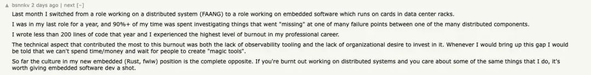
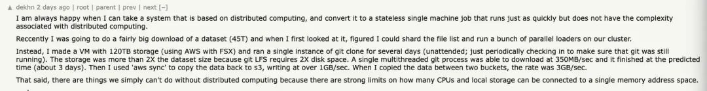
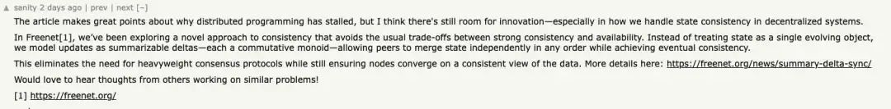

分布式系统编程已停滞？！
===============
                                                                          

             

  

分布式系统编程已停滞？！
============

[InfoQ](javascript:void(0);)

InfoQ

极客邦控股(北京)有限公司

为一线互联网公司核心技术人员提供优质内容。科技圈的观察者，前沿技术的传播者。

2785篇原创内容

_2025年03月03日 06:05_

作者 | Shadaj Laddad

译者 | 核子可乐

编辑 | Tina

随着 DeepSeek 等大模型的快速发展，人们开始意识到我们可能正处于新计算时代的开端。通用 x86 CPU 在数据中心的主导地位正加速衰退，分布式 GPU 集群和专用加速器正在崛起，这一转变速度甚至超出了许多人的预期。

在此背景下，GPU 编程的重要性日益凸显，不少业内人士认为它将成为工程师必须掌握的核心技能。与传统的分布式系统编程不同，GPU 编程更注重在硬件资源受限的环境下优化计算和图形渲染，其开发模式与嵌入式或单机系统类似。还有观点认为，这与 20 多年前 PlayStation 1/2 和 GBA 上的编程方式颇为相似。

就在最近，伯克利博士生 Shadaj Laddad 发表了一篇关于“分布式系统编程”的文章。在文中，他犀利指出当前的分布式编程模型正陷入停滞，并提出应构建以语义局部性为优先、可被机器推理的新一代编程模型。Shadaj 师从研究分布式计算和机器学习的 Joe Hellerstein，具有跨学界 / 工业界背景。

而在这个技术演进节点上，这篇文章也激发了不少讨论。

过去 50 年里，行业在集中化和分布式架构之间经历了多次反复切换。当我们在集中化架构的极限上遇到瓶颈时，分布式架构成为了必然选择。有激进的观点认为，最近这次突然转向分布式的行为“简直就像整个行业同时集体疯狂了一样。”

实际上，有人分享了他上个月从做分布式系统转向嵌入式软件的个人经历，表示这两者的工作方式差异很大。比如，有人提到，他在前一份工作中，90% 以上的时间花在了排查分布式组件之间的各种故障上，那一年的代码量少得可怜（一年只写了 200 行代码），并且经历了严重的职业倦怠。

还有人表示，有些场景下，确实可以将任务转化为一个无状态的单机任务，既能保持同样的运行速度，又避免了分布式计算所带来的复杂性。

也有人认为，文章很好地阐述了分布式编程停滞的原因，但这并不意味着创新的空间已经消失。

分布式系统编程是许多人职业生涯的核心所在，从职业发展的角度来看，这篇文章为我们提供了一个全新的思考视角。你是否认同“编程模型停滞论”？欢迎在评论区分享您的见解与观点。

**_以下是原文翻译：_**

聊聊停滞不前的

分布式系统编程

过去十年之间，我们见证了分布式系统的巨大进步，但其编程方式却几乎没有根本性改进。虽然我们有时可以把分布式抽象出来（Spark、Redis 等），但开发人员仍需要挣扎应对并发性、容错性和版本控制等现实挑战。

虽然人们也在努力研究这个问题，但几乎全部精力都集中在使用工具帮助分析如何用经典（顺序）编程语言来编写分布式系统。Jepsen 和 Antithesis 等工具已经推动了能够验证正确性与容错性的最新技术，但仍无法与原生呈现基本概念的编程模型相提并论。以 Rust 为例，它所提供的提供内存安全保障就远比 C++ 加 AddressSanitizer 的组合更为丰富。

如果在网上搜索，我们会找到大量关于编写分布式代码的框架。在本文中，我们将通过探讨证明这一切都只是在三大固定底层范式之上做出的修修补补，即：**external-distribution**、**static-location** 和 **arbitrary-location**。换言之，我们仍缺少一种面向分布式系统的原生编程模型。我们将介绍这些范式，并反思建立真正的分布式编程模型还需要些什么。

**External-distribution 架构**代表着绝大多数“分布式”系统的表现形式。在这套模型中，软件被编写为顺序逻辑，并针对具有顺序语义的状态管理系统运行：

*   具有分布式数据库的无状态服务（Aurora DSQL、Cockroach）；
    
*   服务会使用基于 Gossip 协议的 CRDT 状态（Ditto、ElectricSQL、Redis Enterprise 等），尽管这类系统常被宣传为分布式系统的"银弹"，但值得注意的是，有观点认为 CRDT 本质上只是加速了分布式事务的执行——运行其上的软件仍然保持着顺序语义，并未实现真正的分布式计算；
    
*   工作流与 Step Functions。
    

这些架构在易用性方面确实表现突出，因为它们将网络通信、数据同步等分布式细节完全隐藏在开发者视野之外（至少在理论层面如此）。但这种抽象也带来潜在风险：由于可序列化往往并非默认设置（快照隔离才是），因此偶尔也会出现 bug 暴露的情况。本质上，这类架构虽然构建了分布式系统，但却不涉及任何分布式编程模型。

由于只需要保证选择正确的 CRDT 一致性级别，而不再需要关注容错或者并发错误，因此开发人员明显更青睐这个选项。很明显，它能够将分布式的混乱隐藏在干净、顺序的语义之下，但由此付出的则是性能和可扩展性的现实代价。

对一切内容进行序列化，相当于在模拟非分布式系统，只是需要昂贵的协调协议。数据库可能在系统当中形成单点故障；因此我们要么祈祷 us-east-1 永远不会发生故障，要么就得切换到像 Cockroach 这样具有自身性能影响的多写入器系统。虽然多数应用程序的规模都不大，完全可以容忍这样的情况，但数量积累得多了终究会出问题。

**Static-location 架构**是编写分布式代码的经典方式。我们会编写多个单元——每个单元均被编写为本地（单机）代码，并使用异步网络调用与其他机器进行通信：

*   服务使用 API 调用通信，可能使用 async / await (gRPC, REST)。
    
*   Actors (Akka、Ray、Orleans)。
    
*   服务轮询并推送至共享发布 / 订阅（Kafka）。
    

这些架构都为我们提供了完整的底层控制，同时也让我们编写出一大堆带有网络调用机制的顺序单机软件。其好处在于性能和容错性都很出色，我们可以灵活控制在何时何地运行什么。

但各联网单元之间的边界却相当僵化且不够透明。开发人员必须就如何拆分自己的应用程序做出单向决策，决策又将对正确性产生广泛影响；重试和消息排序均由发送者控制，接收者完全不知情。此外，语言和工具对单元的组成方式亦了解有限。Jump-to-definition 通常无法起效，而服务间也经常出现序列化不匹配的问题。

最重要的是，这种分布式系统方法从根本上消灭了语义共现与模块化的可能性。在顺序代码中，一个个按序发生的事件会以文本形式一个个按序旋转，函数调用则封装起整个算法。但对于 static-location 架构，开发者却被迫在机器边界、而非语义边界上进行代码模块化。换言之，在这样的架构中根本没办法将分布式算法封装为单个统一的语义单元。

尽管 static-location 架构为开发人员提供了对其系统底层的控制能力，但在实践当中，如果没有分布式系统的专业知识，稳健实现也将极其困难。实现和执行之间存在根本性的错配：static-location 软件是作为单机代码被编写而成，但系统的正确性却需要对整个机器集群进行推理。因此，构建这类系统的开发团队往往会担心并发 bug 和故障，并留下大量因过于关键而无法修改触碰的遗留代码。

**Arbitrary-location 架构**作为大多数"现代"分布式系统的基础范式，其核心承诺是允许开发者**像编写单机程序一样编写分布式代码**。这种架构通过运行时动态调度代码到多台机器执行（但即便具备迁移能力，Actor 框架仍无法彻底解决这一问题，因为开发者依然需要明确定义 Actor 的边界，并指定消息传递的发生位置）：

*   分布式 SQL 引擎。
    
*   MapReduce 框架（Hadoop、Spark 等）。
    
*   流处理（Flink、Spark Straming、Storm）。
    
*   持久执行（Temporal、DBOS、Azure Durable Functions）。
    

这些架构可以优雅地处理共现问题，因为语言 /API 中没有明确的网络边界来拆分代码。但是，这种简单性也需要付出巨大的控制性代价。由于是运行时决定着代码的分布方式，我们也就无法把控应用程序的扩展方式、故障域的位置以及何时通过网络发送数据。

与 external-distribution 模型一样，arbitrary-location 架构往往会造成性能成本。持久执行系统通常会在每个步骤之间将其状态快照至持久存储当中。流处理系统可以动态保存数据，并且自由地跨步骤引入异步性。SQL 用户完全受到查询优化器的支配，最多只能对分布决策作出“提示”。

我们通常需要对单个逻辑的旋转位置进行底层控制，以确保性能与正确性。比如考虑采用 Two-Phase Commit。此协议能够将广播提案的 leader 和确认提案的 worker 提供明确且不对称的角色。为了正确实施这样的协议，特准需要为这些角色明确分配特定逻辑，因为法定人数必须由单一 leader 来确定，且每个工作者必须自动决定接受或拒绝提案。因此要想在 arbitrary-location 架构中实施这样的协议，也就必然要引入不必要的网络和协调开销。

无法回避的大模型问题

如果大家一直在关注“代理式”大模型领域，可能会好奇：“既然我们的软件越来越多由大模型来编写，那这些问题还重要吗？”既然 static-location 模型已经足够丰富、能够表达所有分布式系统，干嘛还要在乎编程过程是否煎熬？

在我看来，大模型反而是我们需要一种全新编程模型的绝佳论据。众所周知，大模型往往很难处理上下文信息分散在大量文本的开发场景。相反，当语义相关信息都集中在同一位置时，大模型的表现才是最好的。

Static-location 模型迫使我们将语义连接的分布式逻辑拆分到多个模块当中。而大模型在单一机器上的正确性表现就不够好，而编写出多个能够正确协同工作的单机程序更是远远超出其能力上限。此外，大模型仍然是在按顺序做出决策，而将分布式逻辑拆分到多个联网模块当中，对于 AI 模型的自身结构来说本就是个重大挑战。

如果使用保留“语义局部性”的编程模型，大模型倒是可以做得更好。在这样一个假设的编程模型中，跨多台机器的代码可以共现，从而有效解决上述问题。分布式算法的所有相关逻辑都将互相相邻，而大模型则可直接生成分布逻辑。

另一个难点在于正确性。大模型会犯错，所以我们最好是把大模型跟自动排查工作配合起来使用（Lean 就是个很好的例子。包括谷歌和 DeepSeek 在内，不少团队长期以来一直在用它）。顺序模型无法推理分布式执行可能造成哪些问题，而足够丰富的分布式编程模型则可以揭示由网络延迟和故障引起的问题（类似于面向分布式系统的借用检查器）。

我们能从这些系统中

得到什么启示？

尽管我们讨论的每种编程模型都存在一定局限性，但这也从反方向展示了分布式系统的原生编程模型应当支持的理想特性。那么，我们能从这些系统中得到什么启示？

首先跳过 external-distribution，正如前文提到，这其实并不能算真正的分布式架构。对于能够容忍此模式性能和语义限制的应用程序，external-distribution 当然也可以考虑。但对于通用的分布式编程模型，我们绝对不能接受把网络和并发都隐藏在开发者的视野之外。

Static-location 模型似乎是个不错的起点，因为它至少能够表达我们想要实现的所有分布式系统类型，最大的问题也只是这种编程模型在分布推理方面提供不了多少帮助。具体来讲，这里缺失了 arbitrary-location 模型所能提供的两大要素：

*   在单一函数中编写跨多台相邻机器的逻辑；
    
*   跨网络边界展示分布式行为的语义信息，例如消息重新排序、重试和序列化格式。
    

但在这两点背后，又对应着 static-location 相较于 arbitrary-location 的两大重要优势：

*   明确控制机器上逻辑的放置，并能够执行本地原子计算；
    
*   丰富的容错保证和网络语义选项，同时保证语言不会将我们锁定在全局协调和恢复协议当中。
    

总之，现在是时候打造一套真正的原生编程模型了——比如说 Rust 版本的分布式系统开发模型。也只有这样，我们才能解决一切难题、纵享一切优势。

**参考链接：**

https://www.shadaj.me/writing/distributed-programming-stalled

https://news.ycombinator.com/item?id=43195702

_**声明：本文为 InfoQ 翻译整理，不代表平台观点，未经许可禁止转载。**_

今日好文推荐

[Curl 之父：我是如何枕着18万行C代码还能安稳入睡的](https://mp.weixin.qq.com/s?__biz=MjM5MDE0Mjc4MA==&mid=2651237325&idx=1&sn=2d6a0dd46a8b288ea0c147e6c354cf28&scene=21#wechat_redirect)  

[刚刚，DeepSeek 突然公布成本利润率高达545%！做 AI Infra 的该慌了？！](https://mp.weixin.qq.com/s?__biz=MjM5MDE0Mjc4MA==&mid=2651237296&idx=1&sn=fe59d778a87be29b9061282ec46026e4&scene=21#wechat_redirect)  

[“前端已死”是危言耸听吗？](https://mp.weixin.qq.com/s?__biz=MjM5MDE0Mjc4MA==&mid=2651237123&idx=2&sn=c62df762c5ed094e5299e19ce3dde70d&scene=21#wechat_redirect)  

[英伟达“赚钱机器”更强了！盈利创纪录，黄仁勋：DeepSeek 为 GPU 降本，但下一代模型还离不开我](https://mp.weixin.qq.com/s?__biz=MjM5MDE0Mjc4MA==&mid=2651236923&idx=1&sn=48ab8201464113c93160a71b3ae7bed9&scene=21#wechat_redirect)

会议推荐

在AI大模型重塑软件开发的时代，我们如何把握变革？如何突破技术边界？4月10-12日，QCon全球软件开发大会· 北京站 邀你共赴3天沉浸式学习，跳出「技术茧房」，探索前沿科技的无限可能。

本次大会将汇聚顶尖技术专家、创新实践者，共同探讨多行业AI落地应用，分享一手实践经验，深度参与DeepSeek主题圆桌，洞见未来趋势。

预览时标签不可点

Close

更多

Name cleared

**微信扫一扫赞赏作者**

Like the Author[Other Amount](javascript:;)

Articles

No articles

Like the Author

Other Amount

¥

最低赞赏 ¥0

OK

Back

**Other Amount**

更多

赞赏金额

¥

最低赞赏 ¥0

1

2

3

4

5

6

7

8

9

0

.

Close

更多

搜索「」网络结果

​

暂无留言

已无更多数据

[Send Message](javascript:;)

  写留言:

Close

**Comment**

Submit更多

[表情](javascript:;)

Scan to Follow

继续滑动看下一个

轻触阅读原文

InfoQ

向上滑动看下一个

当前内容可能存在未经审核的第三方商业营销信息，请确认是否继续访问。

[继续访问](javascript:)[Cancel](javascript:)

[微信公众平台广告规范指引](javacript:;)

[Got It](javascript:;)

 

 Scan with Weixin to  
use this Mini Program

[Cancel](javascript:void(0);) [Allow](javascript:void(0);)

[Cancel](javascript:void(0);) [Allow](javascript:void(0);)

× 分析

 : ， ， ， ， ， ， ， ， ， ， ， ， .   Video Mini Program Like ，轻点两下取消赞 Wow ，轻点两下取消在看 Share Comment Favorite 听过            

**InfoQ**

分布式系统编程已停滞？！

,

,

选择留言身份
