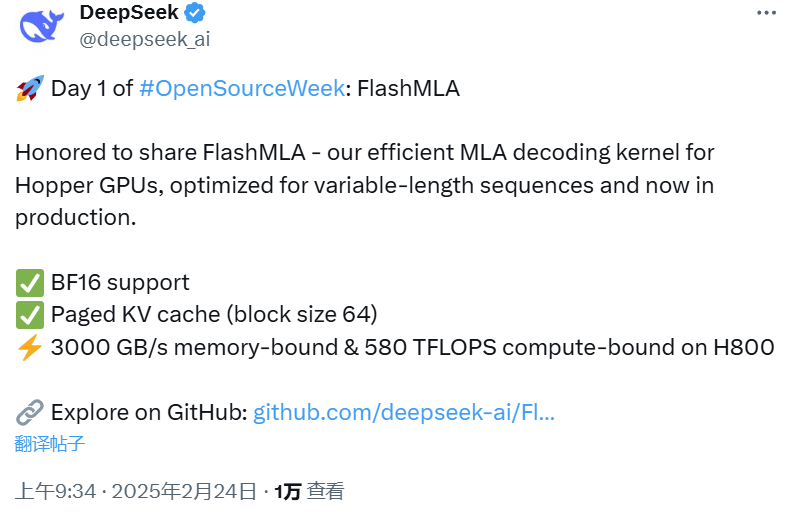
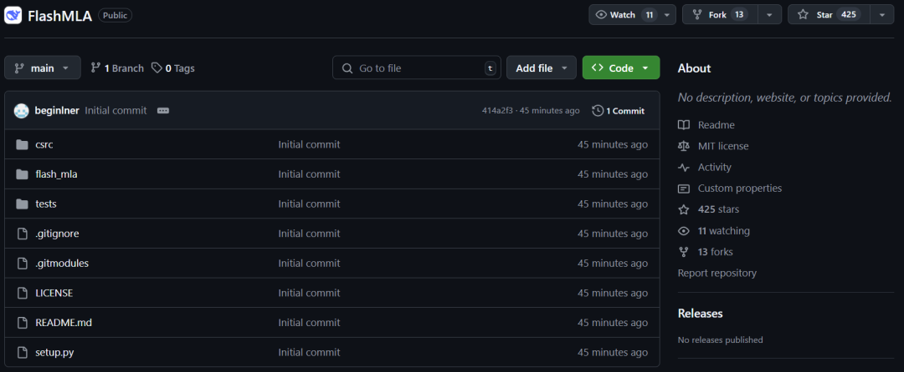
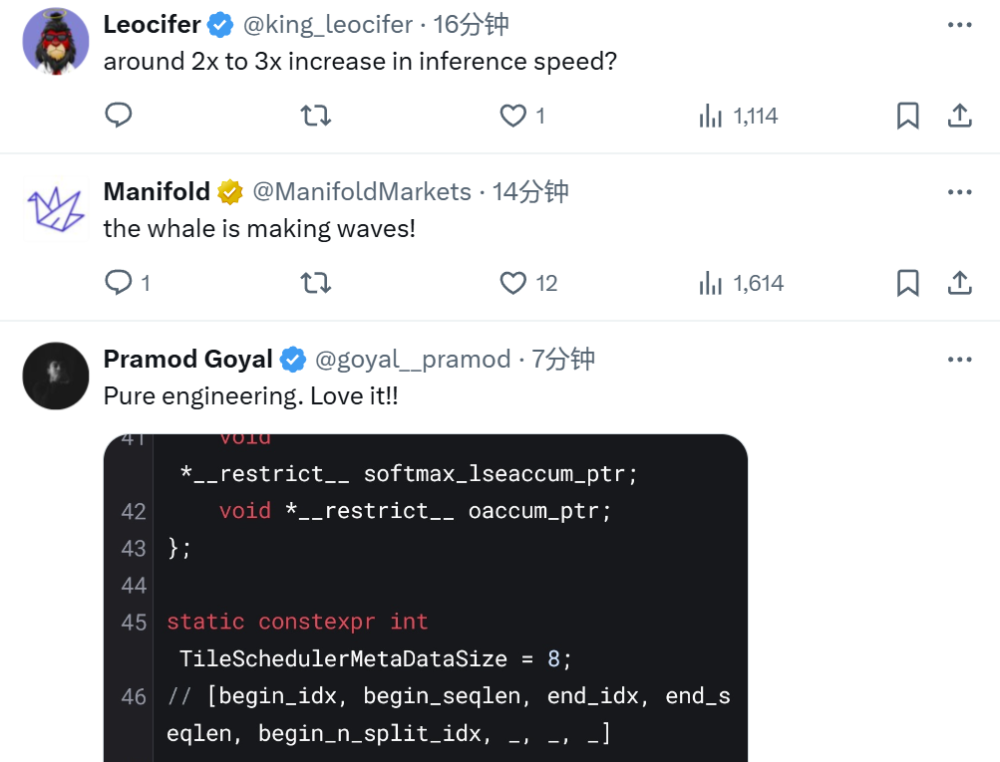

Title: 刚刚，DeepSeek开源FlashMLA，推理加速核心技术，Star量飞涨中

URL Source: https://mp.weixin.qq.com/s/n5Hn6b3Lg48ClRbVHcKhBw

Markdown Content:
机器之心报道

**机器之心编辑部**

上周五，DeepSeek 发推说本周将是开源周（OpenSourceWeek），并将连续开源五个软件库。

第一个项目，果然与推理加速有关。

北京时间周一上午 9 点，刚一上班（同时是硅谷即将下班的时候），DeepSeek 兑现了自己的诺言，开源了一款用于 Hopper GPU 的高效型 MLA 解码核：FlashMLA。



该项目上线才 45 分钟就已经收获了超过 400 star！并且在我们截图时，Star 数量正在疯狂飙升。



项目地址：https://github.com/deepseek-ai/FlashMLA

众所周知，MLA是DeepSeek大模型的重要技术创新点，主要就是减少推理过程的KV Cache，从而实现在更少的设备上推理更长的Context，极大地降低推理成本。

此次 DeepSeek 直接开源了该核心技术的改进版本，可以说是诚意满满。

接下来，就让我看下这个开源项目的核心内容。

据介绍，FlashMLA 是适用于 Hopper GPU 的高效 MLA 解码内核，针对可变长度序列服务进行了优化。

目前已发布的内容有：

*    BF16
    
*    块大小为 64 的分页 kvcache
    

其速度非常快，在 H800 SXM5 GPU 上具有 3000 GB/s 的内存速度上限以及 580 TFLOPS 的计算上限。

在部署这个项目之前，你需要的有：

*    Hopper GPU
    
*    CUDA 12.3 及以上版本
    
*    PyTorch 2.0 及以上版本
    

**快速启动**

*   安装
    

`python setup.py install`

*   基准
    

`python tests/test_flash_mla.py`

使用 CUDA 12.6，在 H800 SXM5 上，在内存绑定配置下实现高达 3000 GB/s，在计算绑定配置下实现 580 TFLOPS。

*   用法
    

`from flash_mla import get_mla_metadata, flash_mla_with_kvcache````
  
``````
  
````tile_scheduler_metadata, num_splits = get_mla_metadata (cache_seqlens, s_q * h_q //h_kv, h_kv)````
  
``````
  
````for i in range (num_layers):``...``o_i, lse_i = flash_mla_with_kvcache (``q_i, kvcache_i, block_table, cache_seqlens, dv,``tile_scheduler_metadata, num_splits, causal=True,``)``...`

该项目发布后也是好评如潮。



甚至有网友打趣地表示：「听说第五天会是 AGI」。


最后，还是那句话：这才是真正的 OpenAI


© THE END 

转载请联系本公众号获得授权

投稿或寻求报道：liyazhou@jiqizhixin.com
