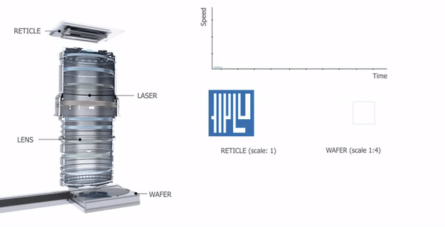
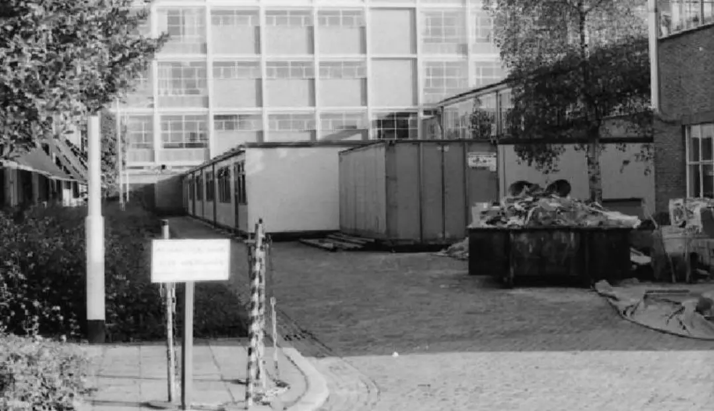
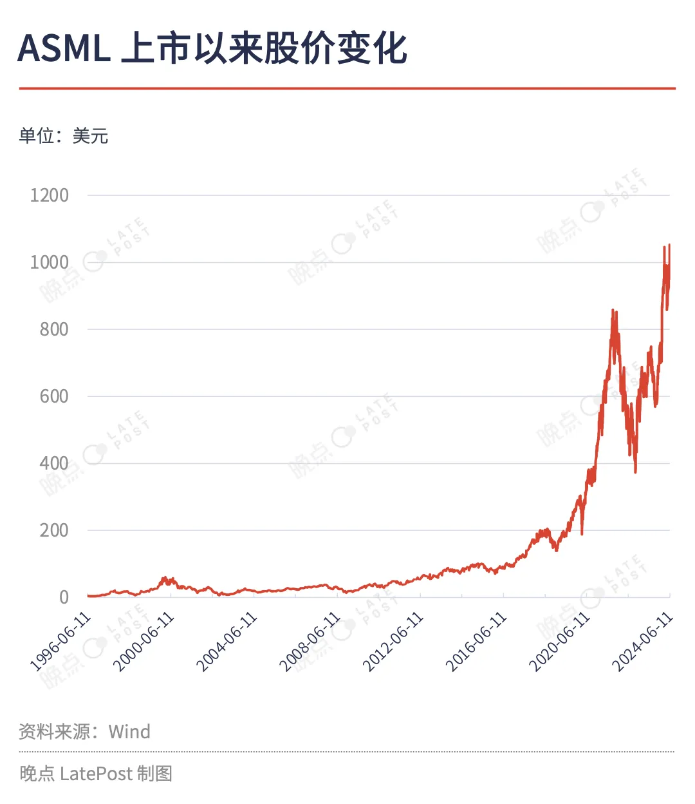
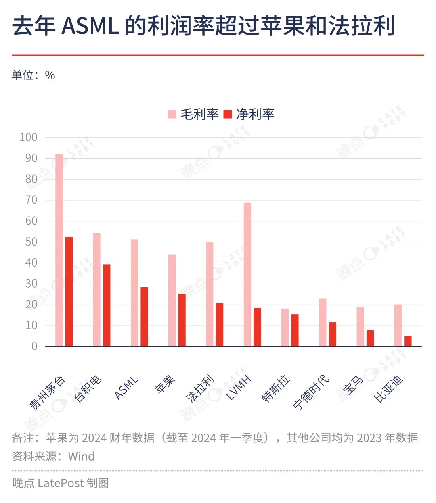
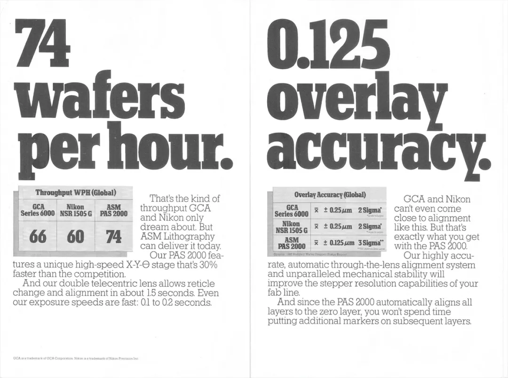

# 制造光刻机 40 年，一本新书重新发现了 ASML 成功的秘密
关于后来者能不能造出光刻机和先进芯片，业界盛传比亚迪董事长王传福的一个说法：“这些是人造的，不是神造的。”

最赞成王传福的可能包括光刻机巨头 ASML 总部的人。跟踪 ASML 超过十年的荷兰记者马克·希金克（Marc Hijink）对我们说，“我在 ASML 问这个问题，他们总说，自然力量在北京与荷兰是一样的。没有任何物理定律阻止其他人制造类似的机器”。

现在全球卖出的光刻机有九成来自 ASML。其独家的 EUV 极紫外光刻机几乎是生产先进芯片的唯一选择，一台卖两三亿美元，可以称得上欧洲最贵的奢侈品。ASML 的市值也在今年首次超过奢侈品巨头，路易威登的母公司 LVMH。

上周，ASML 创始人维姆·特罗斯特（Wim Troost）去世，享年 98 岁。40 年前，是特罗斯特费尽全力，飞利浦才没有彻底砍掉亏损的光刻机业务，愿意让他们独立创业。ASML 成立之时，特罗斯特已经年近六旬。第一批员工也是在飞利浦承诺失败后回来工作，才同意加入。这不是今天风险投资人看得上的创业团队。

多年采访后，希金克相信最终还是一种敢于冒险的基因和极致专注让 ASML 走到今天。“如果一件事没被证明是不可能的，他们就会觉得自己或许可以做”，他在与我们的视频对话中说道。

去年底，希金克的新书《专注：ASML 之道》（Focus：The ASML Way，中文版译名未定，将于今年 10 月发布）以荷兰语出版。此前的 ASML 传记《光刻巨人》只讲到 1996 年，当时 ASML 还不是尖端芯片的唯一选择。

希金克的《专注》补全了 ASML 千禧年之后的成长史，在管理层的支持下，得以一种更整体的视角，呈现 ASML 如何用 40 年从初创公司发展成行业垄断者：一个前景存疑的小公司，在创业之初就选择最难的技术路线，并且持续 40 年专注在一个目标，最终成为当代最尖端技术的制造商，造出的机器可以在硅片上刻出只有新冠病毒几分之一大小的电子元件。

买杯咖啡就可能破产的小公司，选了最难的路

1984 年 4 月，47 名员工从飞利浦的混凝土总部大楼搬入一处紧挨垃圾堆、下雨漏水的临时棚屋。ASML 就此成立。

同一年，苹果发布 Mac 电脑的时候，计算机 CPU 已经复杂到无法以机械加工。英特尔的工厂要用光刻机让精细光线透过薄膜，将肉眼不可见的图案投射到硅片上，形成微小的电路结构。

ASML 光刻机的成像原理：通过投射光束，穿过印有电路图的掩模及光学镜片，将电路图曝光在带有光刻胶的硅片上。

此时飞利浦已投入光刻机研发十多年，发明出了业内领先的对准系统和独一无二的电动晶圆台，但在和其他十家厂商激烈竞争中不占优势，始终没有订单。

赶上日本家电横扫欧美市场，时任飞利浦 CEO 明确要求尽快结束包括光刻机在内 “所有不赚钱的爱好”——要么出售，要么合资。

当时担任飞利浦科学与工业部（S&I）董事的特罗斯特是公司上下少有力挺光刻机研发的人。科学与工业部的一些项目为飞利浦带来了非常可观的利润，在财务上相对独立。飞利浦不愿意继续投钱，特罗斯特一度绕过集团高层，动用部门小金库支持光刻机研发。

ASML 首批员工则大多因为飞利浦工会答应的丰厚养老金和几年后可以返回飞利浦的承诺，才不情愿地到被飞利浦拆出、很可能 “买杯咖啡就会破产” 的新公司上班。

ASML 成立初期的办公棚屋，紧挨垃圾堆、下雨漏水。

光刻机当时不是特别赚钱的生意，甚至芯片对世界的影响也才刚刚开始。很难讲特罗斯特比集团管理层乃至整个业界看得更远。但也许就是一些直觉、几分固执加上足够的话语权，让他几乎以一己之力拯救了这个危在旦夕的前沿项目。

没有芯片从业经验的特罗斯特接手光刻机项目后，很快开始寻找合资对象。在跟美国同行 Cobilt、Perkin-Elmer 和 Varian 的谈判接连碰壁后，他和一家当时同样没什么名气的荷兰芯片设备公司 ASM 国际合作。按照双方的合资协议，飞利浦和 ASM 国际按 50:50 的股权比例各自注资 210 万美元。

当时年营收超过 140 亿美元、研发投入超过 12 亿美元的飞利浦，只愿意为这个合资项目拿 30 万美元现金，余下的靠 17 台滞销的 PAS 2000 抵账。据特罗斯特估算，即使加上抵账的机器，420 万美元还不够新机器研发成本的 1/10。为此他让自己的 S&I 部门依旧承担了新公司最初的大部分采购成本。

保住项目只是开始。新公司没有订单，市场份额为零，连名字都不好听——它一开始的简称是 ALS，也是渐冻症（Amyotrophic Lateral Sclerosis）的缩写。后知后觉的管理层到 1996 年才将公司改名为 ASML。

ASML 在创业之初就遇到行业周期性疲软，但反倒帮了它。1985 年，全球芯片市场低迷，芯片制造商们削减了设备采购订单，这让需要提前数个季度采购和生产的头部光刻机厂商遇到库存和现金流挑战，削减甚至搁置新产品研发投入。

没有订单和庞大团队的 ASML 没有这些包袱。希金克告诉我们，经济危机帮助 ASML 在激烈竞争市场里凿开条缝隙，“没什么可以失去” 的文化让他们更勇敢地面对风险。

ASML 首任 CEO 贾特·斯密特（Gjalt Smit）了解到芯片制造商们希望两年后开始生产超大规模集成电路（Very Large Scale Integration，VLSI），这需要能够投射约一微米精度光线的光刻机，超出了当时所有光刻机的极限。如果 ASML 能在两年内造出这样革命性的新产品，就能抓住新的芯片周期。缺钱、缺时间、缺名气的他们选了条最难的路。

想要快速拼完一整套有数千个零部件的乐高，最好的方法是找几个朋友一起拼。ASML 提高光刻机研发效率的方式也差不多，工程师们从设计阶段开始，就将光刻机拆分为 5 个模块，由不同的专业团队并行研发，最后再将独立的模块组装成完整的系统。

但是光刻机只有在全部组装完成后，才会暴露问题，而且为了找出症因，每个模块得挨个测试，非常耗时。项目负责人理查德·乔治（Richard George）想出解决方案，同时开发 5 个原型机器，每个团队独立测试不同的模块，进一步将测试和组装的周期从两年半缩短到半年。

最终，ASML 做出代号为 PAS 2500 的光刻机，也是全球第一台模块化光刻机。得益于模块化设计，工程师可以在安装和使用过程中快速关闭或者更换镜头、光源以及其他重要模块，为晶圆厂节省大量资金。这样的灵活性让 PAS 2500 在发布 30 多年后，仍然在一些晶圆厂的产线上 7*24 小时不间断工作。

ASML 面临的另一个挑战是它缺乏先进生产工艺，竞争对手尼康和佳能都有当时顶尖的光学镜头生产线。仅靠自己，ASML 造不出光刻机这样的复杂机器。它必须集结所有脑力、资金和灵巧的手。

斯密特热爱航空，大学时主修航天工程、爱好之一是开滑翔机，还曾在 NASA 和欧洲航天局工作。他觉得可以借鉴飞机制造商，把零部件生产外包出去，将全部精力集中在复杂的机器设计上。

但当时的 ASML 自己都没有订单，而且一上来就要最高规格的工艺，很多零部件甚至需要定制，供应商们很难被说服。比如 ASML 和德国镜头商蔡司的合作就很坎坷——已经在为当时头部光刻机公司 GCA 供货的蔡司看不上 ASML。

也是因为芯片下行周期，其他客户取消订单让 ASML 有机会分到蔡司的产能。合作中，ASML 帮助蔡司发现了镜头漂移问题，进而打开了后续合作的窗口。2007 年，二者签订了一份分担风险和利润的新合同，芯片市场经常发生剧烈动荡，ASML 同意预支 1/3 的镜头订金，减少蔡司提前购买原材料的风险。

由于光刻机的出货量很少，ASML 的每个核心零部件可以只选择一家供应商，并通过独供协议绑定双方利益。这样的合作关系一直维系至今。

截至 2023 年，ASML 一共注册了超过 16000 项专利，其中许多都是与它的 5100 家供应商合作开发的，蔡司是当中最重要的合作伙伴。蔡司前 CEO 赫尔曼·格林格（Hermann Gerlinger）形容两家公司是机器和光学的终极结合，“ASML 向我们透露了所有的秘密，我们也向它们分享了一切”。

第一次盈利和第一次引领行业，都是因为找到了风格一致的大客户

ASML 的光刻机最快每小时可以生产 200 至 300 块晶圆，每块晶圆切成芯片后的终端产品价值可能高达数十万美元，这效率比印钞机还高。只要能帮芯片制造商节约生产芯片的成本，光刻机无论多贵都有客户抢着买单。

2023 年，ASML 的毛利率超过 51%、净利率超过 28%，均高于同期卖高端消费品的苹果和法拉利。工业设备公司没什么品牌溢价，如此夸张的利润率只能来自技术的绝对领先。

但这个利润建立在绝对的技术领先和绝对的市场占有率上，做不到，光刻机也可能是一门赔钱的生意。直到 1980 年代末，ASML 还是家亏损的公司。甚至 20 年前，它也算不上什么科技巨头，市值只有今天的千分之一左右。

在公司还很小的时候，斯密特只能贴着客户找需求、求订单。1985 年的 SEMICON West 展会上，ASML 印了宣传册，挑了最强对手 GCA 和尼康的标杆产品，只比自己有优势的参数。

展会期间 ASML 的广告册，着重宣传自家产品拥有更好的效率和精度，只字不提没有竞争力的镜头。

在这场展会的晚宴上，芯片制造商 AMD 创始人杰里·桑德斯（Jerry Sanders）抱怨说美国芯片设备商的质量和服务太差，AMD 不得不向日本公司购买设备。斯密特得知后立刻奔赴美国，去和自己聘请的营销专家商量对策。

很快，一则标题为 “我们听见你了，杰里” 的广告出现在新闻媒体和行业期刊上，宣称 ASML 的光刻机可以应对 AMD 的可靠性要求。他们会在交付后和客户一起在工厂里发现问题、改进问题。这则广告没能帮 ASML 立即获得 AMD 的订单。但靠着更深入的服务，ASML 敲开了 AMD 的大门，为后续的合作打下了基础。

通常情况下，维护良好的光刻机可以确保在 98%-99% 的时间里正常工作，大部分故障来自人为——比如松动的电缆和螺栓、镜头上的指纹和划痕。但光刻机非常复杂、芯片产线片刻不能停，任何细小的问题都会产生影响。

英特尔的一家芯片工厂曾经每晚都有几个小时良率莫名下降，四处寻因无果的工程师们最后发现问题来自工厂附近奶牛放的屁：每天凌晨 1 点到 2 点间，风向会改变，牛排放的甲烷通过空气净化器进入洁净室，污染了芯片生产。英特尔最终不得不花钱请牧场搬走。后来每家晶圆厂在选址时多了一个注意事项——尽量避开养牛场。

所有客户里，和 ASML 合作规模最大、对芯片制造工艺推进最多的是一家比它还小三岁的公司。

1987 年，张忠谋创立台积电，他希望与一家有经验的芯片制造商合作，但日本厂商不感兴趣，与英特尔和德州仪器的谈判也破裂。最终张忠谋联系了飞利浦，后者同意用芯片生产技术换取台积电 27.5% 股份。这样的股权关系也让 ASML 顺利地成为台积电供应商。

台积电和 ASML 很像。它们都比竞争对手更加专注地投资某个细分领域的前沿技术，并同样快速且混乱地迎接挑战。在台积电之前，没有一家只做代工服务的芯片商，芯片巨头都像英特尔一样既设计芯片也建厂制造芯片。ASML 与台积电的工程师经常在一起研究和解决难题。往往在新机器的研发和试验阶段，ASML 就获得了台积电工程师宝贵的反馈意见。

很快，台积电就帮 ASML 首次盈利——虽然只是暂时的。1988 年底，一场大火吞噬了台积电的芯片工厂，数十台光刻机受损，台积电向 ASML 紧急下单了 17 台新机器。这笔意外订单帮助 ASML 在财务困难的早期解了燃眉之急。

1990 年代末，晶体管架构继续迭代，但光刻机的光源波长卡在 193 纳米，没法刻出更精细的电路。当时业界的主流方案是想办法将光源波长缩短至 157 纳米。尼康和 SVG 都为此投入巨资。

2002 年，时任台积电研发副经理的林本坚在一次技术研讨会上提出，不用替换光源，只要在镜头和光刻胶之间加一层水，通过光的折射，达到更短波长的效果，解析度提升效果几乎是耗资巨大的 157 纳米方案的两倍。这种取巧的方案被称为浸没式光刻。

不过当时主流光刻机厂商已经为 157 纳米投资数亿美元，不愿意接受一个重新调整的新方案。甚至有大厂高管找到时任台积电首席运营官蒋尚义，希望他 “管管手下，不要搅局”。

同样投入了数亿美元研发 157 纳米方案的 ASML 是个例外，它果断止损，选择了更好的浸没路线。2004 年，等到尼康终于研发出 157 纳米干式光刻机样机时，ASML 和台积电合作开发的浸没式光刻机已经非常成熟。

同期 ASML 另一项重要发明——双扫描工作台 TwinScan 也获得巨大成功。为了确保图层对齐，晶圆必须在曝光之前先测量，TwinScan 是第一个拥有双晶圆工作平台的光刻系统。当一个平台上的晶圆正在曝光时，另一个平台上的晶圆则在对准和测量，然后两个平台交换位置，原来在二号平台的晶圆继续曝光，一号平台则更换下一片晶圆进行对准和测量。

这种并行方案能够极大提升光刻机生产效率，而且与浸没式光刻非常契合——如果依然使用传统的单平台方案，原先的测量系统会因为水的干扰而无法正常工作，但 TwinScan 本就将测量和曝光分开，完美避开了这个问题。

浸没式光刻和 TwinScan 让 ASML 逐渐超过尼康。这两项技术出现之前，ASML 的市场份额只有不到 10%，而到了 2007 年，ASML 已经拿下近六成市场份额。

不计成本地追逐单一目标，成为最难以替代的公司

2023 年一季度，奉行长期主义的伯克希尔哈撒韦，罕见卖出只持有数月的台积电股票。副董事长查理·芒格（Charles Munger）后来解释说，台积电是一家好公司，但自己不喜欢芯片生意，因为 “芯片不断迭代，每次迭代升级，厂商就得把上一轮赚的所有钱砸进去”。

ASML 如今的垄断地位，正是建立在一项耗费 20 年和上百亿美元的关键技术——EUV（极紫外）光刻之上。

1990 年代末，芯片行业寻找下一代光刻解决方案时，波长只有 13.5 纳米的极紫外光（EUV）也是潜在选择之一。但想要获得 EUV 光太难了，它无法穿过包括空气在内的任何物体，自然界中离我们最近的 EUV 光在太阳里。光刻机厂商必须自己生产 EUV 光，并将其准确引导至光刻机中。

日本公司最早开始相关实验，美国和荷兰公司也紧随其后。1997 年，意识到下一代光源有多难的英特尔和美国能源部牵头成立了 EUV LLC 联盟，拉来当时的手机巨头摩托罗拉、老对手 AMD 以及美国三大国家实验室，试图攻克 EUV 难题。

几家头部光刻机厂商也在英特尔邀请之列，但美国政府担心技术外泄，将日本公司尼康和佳能排除在外。ASML 则靠着对美国的投资承诺，在英特尔的帮助下挤进 EUV LLC 联盟。这让它有机会花 16 亿美元买下了拥有 EUV 及反射镜技术专利的美国公司 SVG。

这次合作和 SVG 的交易为 ASML 的 EUV 研发奠定了基础。

由于 EUV 光无法穿过任何物体，光刻机中所有的透镜都要换成反射镜，而且只能在真空环境下运行。ASML 和蔡司为此花巨资建立了全球最大的真空腔体实验室，模拟真空环境下可能出现的问题。

反射镜片的制造工艺也非常复杂，需要使用镀膜工艺，将不同的材料堆叠数十个纳米层，以此增强镜片的反射强度。每一层的表面凸起不能超过 0.01 纳米，其成像精度相当于用手电照到月球，出现的光斑不能超过一枚硬币大小。

即便如此，经过多次反射之后，EUV 光的能量会损失至原来的 1%，第一台 EUV 验证机每小时只能曝光 30 片晶圆。想要提高产能，必须增强光源功率。

光源供应商 Cymer（又一家拥有 EUV 专利的美国公司）对于这样一个难度极高、且只有 ASML 一家客户的技术有所保留，多年过去仍进度迟缓。2012 年，失去耐心的 ASML 以 19.5 亿美元收购 Cymer。

为了筹集收购资金和额外的研发费用，ASML 再次大冒险，用 23% 的公司股份向三家大客户英特尔、台积电和三星换来 53 亿欧元——这比它当年的销售额还要多，如果研发失败，将损失巨大。

接管 Cymer 之后，ASML 一边大幅改进其工作效率，一边继续投入大量人力和财力，终于将 EUV 光源的功率提升到商用标准。

这期间连一向合作紧密的台积电，也一度宣布放弃 EUV，转向采用电子束技术路线的另一家厂商 Mapper。ASML 不得不去拜访正在和台积电谈合作的苹果，通过这位潜在的大客户说服台积电采购 EUV。

无限追求精密光刻设备的 ASML、坚定推动芯片制造工艺的台积电，再加上坚决每年升级一次处理器以追求竞争优势的苹果，三家公司成了完美的组合，每年将 iPhone 用户支付的数百亿美元费用投资尖端芯片制造技术。

在这个合作里，ASML 凭借 EUV 彻底垄断了全球光刻机市场，只留下一些相对低端和小众的领域给尼康和佳能。苹果、台积电和 ASML 也借由 EUV 技术生产出的先进芯片，形成良性利润循环。

专注、无保留的继续投资最先进技术是 ASML，也是台积电或者英伟达甩开所有对手，在各自领域遥遥领先的共同点。另一个不可或缺的要素是，他们都在计算机芯片行业——一个存在大约 80 年，每一年都比上一年往前跃一步的罕见行业。随着计算机将人类工作、生活一点点搬入虚拟空间，巨大的利润也在期间产生，推动芯片公司继续投资改进技术。

大约 15 年前，英伟达 CEO 黄仁勋在参加一档电视节目时说，只是跑得快还不够，只有当跑道足够长，最好还足够蜿蜒时，跑得快才是一个好的战略。如果在其他一些行业，没有这样的进步空间和商业循环，一个公司持续投资技术未必就能脱离同质化竞争。

ASML 赶上了这样一个当初不被看好的跑道，以没什么来由的信心，持续投入 40 年，在一个曾经开放、自由、充分竞争的全球化市场，集结大量供应商和客户的脑力、资金和灵巧的手，以及一些运气，走到了今天。

这有点像巴里·沃思（Barry Werth）在《十亿美元分子》里对药界黑马福泰制药的总结那样，大众经常认为科学突破是很戏剧性的，但大多数情况下恰恰相反 —— 有所突破仅是因为一点调整，一些小事，一个沮丧的科学家靠着略有苗头的数据坚持走下去。一切都源于那个选择了一种试剂、一项实验、一个方法的瞬间，那个微小而关键的节点。

题图来源：极盗者