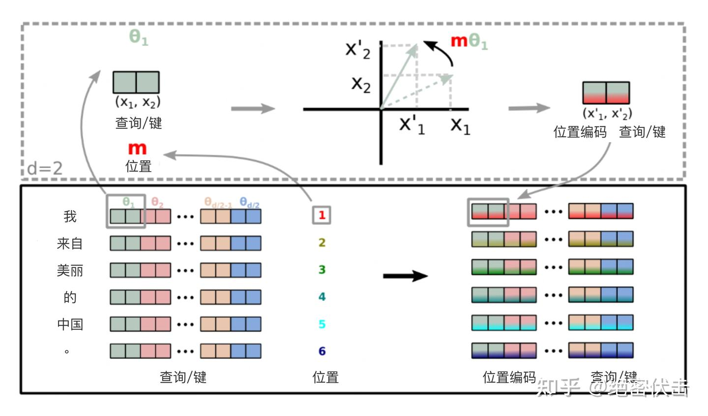
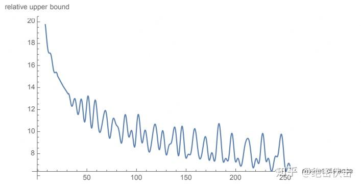
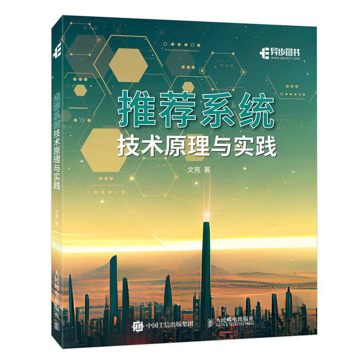

# 十分钟读懂旋转编码（RoPE） - 知乎
[十分钟读懂旋转编码（RoPE） - 知乎](https://zhuanlan.zhihu.com/p/647109286) 

 旋转位置编码（Rotary Position Embedding，RoPE）是论文[Roformer: Enhanced Transformer With Rotray Position Embedding](https://link.zhihu.com/?target=https%3A//arxiv.org/pdf/2104.09864.pdf) 提出的一种能够将相对位置信息依赖集成到 self-attention 中并提升 [transformer](https://zhida.zhihu.com/search?content_id=231932826&content_type=Article&match_order=1&q=transformer&zhida_source=entity) 架构性能的位置编码方式。而目前很火的 LLaMA、GLM 模型也是采用该位置编码方式。

和[相对位置编码](https://zhida.zhihu.com/search?content_id=231932826&content_type=Article&match_order=1&q=%E7%9B%B8%E5%AF%B9%E4%BD%8D%E7%BD%AE%E7%BC%96%E7%A0%81&zhida_source=entity)相比，RoPE 具有更好的**外推性**，目前是大模型相对位置编码中应用最广的方式之一。

**备注：什么是大模型外推性？**

外推性是指大模型在训练时和预测时的输入长度不一致，导致模型的泛化能力下降的问题。例如，如果一个模型在训练时只使用了512个 token 的文本，那么在预测时如果输入超过512个 token，模型可能无法正确处理。这就限制了大模型在处理长文本或[多轮对话](https://zhida.zhihu.com/search?content_id=231932826&content_type=Article&match_order=1&q=%E5%A4%9A%E8%BD%AE%E5%AF%B9%E8%AF%9D&zhida_source=entity)等任务时的效果。

**备注：下一篇文章将详细介绍如何基于RoPE提升大模型的外推能力（2k推8k，甚至更长）**

1\. [旋转编码](https://zhida.zhihu.com/search?content_id=231932826&content_type=Article&match_order=1&q=%E6%97%8B%E8%BD%AC%E7%BC%96%E7%A0%81&zhida_source=entity) RoPE
------------------------------------------------------------------------------------------------------------------------------------------------------------------

### 1.1 基本概念

在介绍 RoPE 之前，先给出一些符号定义，以及基本背景。

首先定义一个长度为 NN 的输入序列为：

(1)SN\={wi}i\=1N\\mathbb{S}\_{N}=\\{ w\_i \\}\_{i=1}^{N} \\\\\\tag1

其中 wiw\_i 表示输入序列中第 ii 个 token，而输入序列 SN\\mathbb{S}\_N 对应的 [embedding](https://zhida.zhihu.com/search?content_id=231932826&content_type=Article&match_order=1&q=embedding&zhida_source=entity) 表示为：

(2)EN\={xi}i\=1N\\mathbb{E}\_{N}=\\{ \\bm{x}\_i \\}\_{i=1}^N\\\\\\tag2

其中 xi\\bm{x}\_i 表示第 ii 个 token wiw\_i 对应的 dd 维[词嵌入](https://zhida.zhihu.com/search?content_id=231932826&content_type=Article&match_order=1&q=%E8%AF%8D%E5%B5%8C%E5%85%A5&zhida_source=entity)向量。

接着在做 [self-attention](https://zhida.zhihu.com/search?content_id=231932826&content_type=Article&match_order=2&q=self-attention&zhida_source=entity) 之前，会用词嵌入向量计算 q,k,v\\bm{q,k,v} 向量同时加入位置信息，函数公式表达如下：

(3)qm\=fq(xm,m)kn\=fk(xn,n)vn\=fv(xn,n)\\bm{q}\_m=f\_q(\\bm{x}\_m,m) \\\\ \\bm{k}\_n=f\_k(\\bm{x}\_n,n) \\\\ \\bm{v}\_n=f\_v(\\bm{x}\_n,n) \\\\\\tag3

其中 qm\\bm{q}\_m 表示第 mm 个 token 对应的词向量 xm\\bm{x}\_m 集成位置信息 mm 之后的 query 向量。而 kn\\bm{k}\_n 和 vn\\bm{v}\_n 则表示第 nn 个 token 对应的词向量 xn\\bm{x}\_n 集成位置信息 nn 之后的 key 和 value 向量。

而基于 transformer 的位置编码方法都是着重于构造一个合适的 f(q,k,v)f\\left( \\bm{q},\\bm{k},\\bm{v} \\right) 函数形式。

而计算第 mm 个词嵌入向量 xm\\bm{x}\_m 对应的 self-attention 输出结果，就是 qm\\bm{q}\_m 和其他 kn\\bm{k}\_n 都计算一个 attention score ，然后再将 attention score 乘以对应的 vn\\bm{v}\_n 再求和得到输出向量 om\\bm{o}\_m ：

(4)am,n\=exp(qmTknd)∑j\=1Nexp(qmTkjd)om\=∑n\=1Nam,nvna\_{m,n}=\\frac{\\text{exp}(\\frac{\\bm{q}\_m^{\\textbf{T}}\\bm{k}\_n}{\\sqrt{d}})}{\\sum\_{j=1}^N\\text{exp}(\\frac{\\bm{q}\_m^{\\textbf{T}}\\bm{k}\_j}{\\sqrt{d}})} \\\\ \\bm{o}\_m=\\sum\_{n=1}^Na\_{m,n}\\bm{v}\_n \\\\\\tag4

### 1.2 绝对位置编码

对于位置编码，常规的做法是在计算 query, key 和 value 向量之前，会计算一个位置编码向量 pi\\bm{p}\_i 加到词嵌入 xi\\bm{x}\_i 上，[位置编码向量](https://zhida.zhihu.com/search?content_id=231932826&content_type=Article&match_order=2&q=%E4%BD%8D%E7%BD%AE%E7%BC%96%E7%A0%81%E5%90%91%E9%87%8F&zhida_source=entity) pi\\bm{p}\_i 同样也是 dd 维向量，然后再乘以对应的变换矩阵 W\\bm{W} ：

(5)ft:t∈{q,k,v}(xi,i):=Wt:t∈{q,k,v}(xi+pi)f\_{t:t\\in\\{q,k,v\\}}(\\bm{x}\_i,i):=\\bm{W}\_{t:t\\in\\{q,k,v\\}}(\\bm{x}\_i+\\bm{p}\_i) \\\\\\tag5

而经典的位置编码向量 pi\\bm{p}\_i 的计算方式是使用 Sinusoidal 函数：

(6)pi,2t\=sin(k/100002t/d)pi,2t+1\=cos(k/100002t/d)\\bm{p}\_{i,2t}=\\text{sin}\\left( k/10000^{2t/d} \\right)\\\\ \\bm{p}\_{i,2t+1}=\\text{cos}\\left( k/10000^{2t/d} \\right)\\\\\\tag6

其中 pi,2t\\bm{p}\_{i,2t} 表示位置 dd 维度向量 pi\\bm{p}\_i 中的第 2t2t 位置分量也就是偶数索引位置的计算公式，而pi,2t+1\\bm{p}\_{i,2t+1}就对应第 2t+12t+1 位置分量也就是奇数索引位置的计算公式。

### 1.3 2维旋转位置编码

论文中提出为了能利用上 token 之间的相对位置信息，假定 query 向量 qm\\bm{q}\_m 和 key 向量 kn\\bm{k}\_n 之间的内积操作可以被一个函数 gg 表示，该函数 gg 的输入是词嵌入向量 xm\\bm{x}\_m ， xn\\bm{x}\_n 和它们之间的相对位置 m−nm-n ：

(7)⟨fq(xm,m),fk(xn,n)⟩\=g(xm,xn,m−n)\\left<\\bm{f}\_q(\\bm{x}\_m,m),f\_k(\\bm{x}\_n,n)\\right>=g(\\bm{x}\_m,\\bm{x}\_n,m-n) \\\\\\tag7

接下来的目标就是找到一个等价的位置编码方式，从而使得上述关系成立。

假定现在词嵌入向量的维度是两维 d\=2d=2 ，这样就可以利用上2维度平面上的向量的几何性质，然后论文中提出了一个满足上述关系的 ff 和 gg 的形式如下：

(8)fq(xm,m)\=(Wqxm)eimθfk(xn,n)\=(Wkxn)einθg(xm,xn,m−n)\=Re\[(Wqxm)(Wkxn)∗ei(m−n)θ\]f\_q(\\bm{x}\_m,m)=\\left(\\bm{W}\_q\\bm{x}\_m\\right)e^{im\\theta} \\\\ f\_k(\\bm{x}\_n,n)=(\\bm{W}\_k\\bm{x}\_n)e^{in\\theta} \\\\ g(\\bm{x}\_m,\\bm{x}\_n,m-n)=\\text{Re}\\left\[(\\bm{W}\_q\\bm{x}\_m)(\\bm{W}\_k\\bm{x}\_n)^{\*}e^{i(m-n)\\theta}\\right\] \\\\\\tag8

这里面 Re 表示复数的实部。

进一步地， fqf\_q 可以表示成下面的式子：

(9)fq(xm,m)\=(cos⁡mθ−sin⁡mθ)sin⁡mθcos⁡mθ)(Wq(1,1)Wq(1,2)Wq(2,1)Wq(2,2))(xm(1)xm(2))\=(cos⁡mθ−sin⁡mθ)sin⁡mθcos⁡mθ)(qm(1)qm(2))\\begin{align} f\_q\\left( \\bm{x}\_m,m \\right) &= \\begin{pmatrix} \\cos m\\theta & -\\sin m\\theta) \\\\ \\sin m \\theta & \\cos m \\theta \\end{pmatrix} \\begin{pmatrix} W^{(1,1)}\_{q} & W^{(1,2)}\_{q} \\\\ W^{(2,1)}\_{q} & W^{(2,2)}\_{q} \\end{pmatrix} \\begin{pmatrix} x\_m^{(1)} \\\\ x\_m^{(2)} \\end{pmatrix} \\\\ &= \\begin{pmatrix} \\cos m\\theta & -\\sin m\\theta) \\\\ \\sin m \\theta & \\cos m \\theta \\end{pmatrix}\\begin{pmatrix} q\_m^{(1)} \\\\ q\_m^{(2)} \\end{pmatrix} \\end{align}\\tag9

看到这里会发现，这不就是 query 向量乘以了一个旋转矩阵吗？这就是为什么叫做旋转位置编码的原因。

同理， fkf\_k 可以表示成下面的式子：

(10)fk(xm,m)\=(cos⁡mθ−sin⁡mθ)sin⁡mθcos⁡mθ)(Wk(1,1)Wk(1,2)Wk(2,1)Wk(2,2))(xm(1)xm(2))\=(cos⁡mθ−sin⁡mθ)sin⁡mθcos⁡mθ)(km(1)km(2))\\begin{align} f\_k\\left( \\bm{x}\_m,m \\right) &= \\begin{pmatrix} \\cos m\\theta & -\\sin m\\theta) \\\\ \\sin m \\theta & \\cos m \\theta \\end{pmatrix} \\begin{pmatrix} W^{(1,1)}\_{k} & W^{(1,2)}\_{k} \\\\ W^{(2,1)}\_{k} & W^{(2,2)}\_{k} \\end{pmatrix} \\begin{pmatrix} x\_m^{(1)} \\\\ x\_m^{(2)} \\end{pmatrix} \\\\ &= \\begin{pmatrix} \\cos m\\theta & -\\sin m\\theta) \\\\ \\sin m \\theta & \\cos m \\theta \\end{pmatrix}\\begin{pmatrix} k\_m^{(1)} \\\\ k\_m^{(2)} \\end{pmatrix} \\end{align}\\tag{10}

最终 g(xm,xn,m−n)g(\\bm{x}\_m,\\bm{x}\_n,m-n) 可以表示如下：

(11)g(xm,xn,m−n)\=(qm(1)qm(2))(cos⁡((m−n)θ)−sin⁡((m−n)θ)sin⁡((m−n)θ)cos⁡((m−n)θ))(kn(1)kn(2))g(\\bm{x}\_m,\\bm{x}\_n,m-n) =\\begin{pmatrix} \\bm{q}\_m^{(1)} & \\bm{q}\_m^{(2)} \\\\ \\end{pmatrix} \\begin{pmatrix} \\cos((m-n)\\theta) & -\\sin((m-n)\\theta) \\\\ \\sin((m-n)\\theta) & \\cos((m-n)\\theta) \\end{pmatrix} \\begin{pmatrix} k\_n^{(1)} \\\\ k\_n^{(2)} \\end{pmatrix} \\\\\\tag{11}

关于上面公式（8）~（11）的具体推导，可以参见文章最后的**附录**，或者参考文章：[一文看懂 LLaMA 中的旋转式位置编码（Rotary Position Embedding）](https://zhuanlan.zhihu.com/p/642884818)。

### 1.4 扩展到多维

将2维推广到任意维度，可以表示如下：

(12)f{q,k}(xm,m)\=RΘ,mdW{q,k}xmf\_{\\left\\{ q,k \\right\\}}\\left( \\bm{x}\_m,m \\right)=\\bm{R}^d\_{\\Theta,m}\\bm{W}\_{\\left\\{ q,k \\right\\}}\\bm{x}\_m\\\\\\tag{12}

内积满足[线性叠加性](https://zhida.zhihu.com/search?content_id=231932826&content_type=Article&match_order=1&q=%E7%BA%BF%E6%80%A7%E5%8F%A0%E5%8A%A0%E6%80%A7&zhida_source=entity)，因此任意偶数维的RoPE，我们都可以表示为二维情形的拼接，即

(13)RΘ,md\=(cos⁡mθ0−sin⁡mθ000⋯00sin⁡mθ0cos⁡mθ000⋯0000cos⁡mθ1−sin⁡mθ1⋯0000sin⁡mθ1cos⁡mθ1⋯00⋮⋮⋮⋮⋱⋮⋮0000⋯cos⁡mθd/2−1−sin⁡mθd/2−10000⋯sin⁡mθd/2−1cos⁡mθd/2−1)⏟Wm\\bm{R}^d\_{\\Theta,m}=\\begin{equation}\\scriptsize{\\underbrace{\\begin{pmatrix} \\cos m\\theta\_0 & -\\sin m\\theta\_0 & 0 & 0 & \\cdots & 0 & 0 \\\\ \\sin m\\theta\_0 & \\cos m\\theta\_0 & 0 & 0 & \\cdots & 0 & 0 \\\\ 0 & 0 & \\cos m\\theta\_1 & -\\sin m\\theta\_1 & \\cdots & 0 & 0 \\\\ 0 & 0 & \\sin m\\theta\_1 & \\cos m\\theta\_1 & \\cdots & 0 & 0 \\\\ \\vdots & \\vdots & \\vdots & \\vdots & \\ddots & \\vdots & \\vdots \\\\ 0 & 0 & 0 & 0 & \\cdots & \\cos m\\theta\_{d/2-1} & -\\sin m\\theta\_{d/2-1} \\\\ 0 & 0 & 0 & 0 & \\cdots & \\sin m\\theta\_{d/2-1} & \\cos m\\theta\_{d/2-1} \\\\ \\end{pmatrix}}\_{\\boldsymbol{W}\_m}}\\end{equation}\\\\\\tag{13}

Θ\={θi\=10000−2(i−1)/d,i∈\[1,2,...,d/2\]}\\Theta=\\left\\{ \\theta\_i=10000^{-2(i-1)/d}, i \\in \[1,2,...,d/2\] \\right\\} \\\\

将 RoPE 应用到前面公式（4）的 Self-Attention 计算，可以得到**包含相对位置信息的Self-Attetion**：

(14)qmTkn\=(RΘ,mdWqxm)T(RΘ,ndWkxn)\=xmTWqRΘ,n−mdWkxn\\bm{q}^{\\textbf{T}}\_m\\bm{k}\_n=\\left( \\bm{R}^d\_{\\Theta,m}\\bm{W}\_q\\bm{x}\_m \\right)^{\\textbf{T}}\\left( \\bm{R}^d\_{\\Theta,n}\\bm{W}\_k\\bm{x}\_n \\right)=\\bm{x}\_m^{\\textbf{T}}\\bm{W}\_q\\bm{R}^d\_{\\Theta,n-m}\\bm{W}\_k\\bm{x}\_n\\tag{14} 其中， RΘ,n−md\=(RΘ,md)TRΘ,nd\\bm{R}^d\_{\\Theta,n-m}=\\left( \\bm{R}^d\_{\\Theta,m} \\right)^{\\textbf{T}}\\bm{R}^d\_{\\Theta,n} 。

值得指出的是，由于RΘd\\bm{R}^d\_{\\Theta}是一个正交矩阵，它不会改变向量的模长，因此通常来说它不会改变原模型的稳定性。

### 1.5 RoPE 的高效计算

由于RΘ,md\\bm{R}^d\_{\\Theta,m}的稀疏性，所以直接用矩阵乘法来实现会很浪费算力，**推荐通过下述方式来实现 RoPE**：

(15)RΘ,mdx\=(x0x1x2x3⋮xd−2xd−1)⊗(cos⁡mθ0cos⁡mθ0cos⁡mθ1cos⁡mθ1⋮cos⁡mθd/2−1cos⁡mθd/2−1)+(−x1x0−x3x2⋮−xd−1xd−2)⊗(sin⁡mθ0sin⁡mθ0sin⁡mθ1sin⁡mθ1⋮sin⁡mθd/2−1sin⁡mθd/2−1)\\bm{R}^d\_{\\Theta,m}\\bm{x}=\\begin{equation}\\begin{pmatrix}x\_0 \\\\ x\_1 \\\\ x\_2 \\\\ x\_3 \\\\ \\vdots \\\\ x\_{d-2} \\\\ x\_{d-1} \\end{pmatrix}\\otimes\\begin{pmatrix}\\cos m\\theta\_0 \\\\ \\cos m\\theta\_0 \\\\ \\cos m\\theta\_1 \\\\ \\cos m\\theta\_1 \\\\ \\vdots \\\\ \\cos m\\theta\_{d/2-1} \\\\ \\cos m\\theta\_{d/2-1} \\end{pmatrix} + \\begin{pmatrix}-x\_1 \\\\ x\_0 \\\\ -x\_3 \\\\ x\_2 \\\\ \\vdots \\\\ -x\_{d-1} \\\\ x\_{d-2} \\end{pmatrix}\\otimes\\begin{pmatrix}\\sin m\\theta\_0 \\\\ \\sin m\\theta\_0 \\\\ \\sin m\\theta\_1 \\\\ \\sin m\\theta\_1 \\\\ \\vdots \\\\ \\sin m\\theta\_{d/2-1} \\\\ \\sin m\\theta\_{d/2-1} \\end{pmatrix}\\end{equation}\\\\\\tag{15}

其中⊗\\otimes是逐位对应相乘，即计算框架中的∗\*运算。从这个实现也可以看到，RoPE 可以视为是[乘性位置编码](https://zhida.zhihu.com/search?content_id=231932826&content_type=Article&match_order=1&q=%E4%B9%98%E6%80%A7%E4%BD%8D%E7%BD%AE%E7%BC%96%E7%A0%81&zhida_source=entity)的变体。

总结来说，RoPE 的 self-attention 操作的流程是：对于 token 序列中的每个词嵌入向量，首先计算其对应的 query 和 key 向量，然后对每个 token 位置都计算对应的旋转位置编码，接着对每个 token 位置的 query 和 key 向量的元素按照 **两两一组** 应用旋转变换，最后再计算 query 和 key 之间的内积得到 self-attention 的计算结果。

论文中有个很直观的图片展示了旋转变换的过程：



### 1.6 远程衰减

可以看到，RoPE 形式上和前面公式（6） Sinusoidal 位置编码有点相似，只不过 Sinusoidal 位置编码是加性的，而 RoPE 可以视为乘性的。在 θi\\theta\_i 的选择上，RoPE 同样沿用了 Sinusoidal 位置编码的方案，即θi\=10000−2i/d\\theta\_i = 10000^{-2i/d}，它可以带来一定的[远程衰减性](https://zhida.zhihu.com/search?content_id=231932826&content_type=Article&match_order=1&q=%E8%BF%9C%E7%A8%8B%E8%A1%B0%E5%87%8F%E6%80%A7&zhida_source=entity)。

具体证明如下：将 q,k\\boldsymbol{q},\\boldsymbol{k} 两两分组后，它们加上 RoPE 后的内积可以用[复数乘法](https://zhida.zhihu.com/search?content_id=231932826&content_type=Article&match_order=1&q=%E5%A4%8D%E6%95%B0%E4%B9%98%E6%B3%95&zhida_source=entity)表示为：

(16)(RΘ,mdWqxm)T(RΘ,ndWkxn)\=Re\[∑i\=0d/2−1q\[2i:2i+1\]k\[2i:2i+1\]∗ei(m−n)θi\]\\begin{equation} \\left( \\bm{R}^d\_{\\Theta,m}\\bm{W}\_q\\bm{x}\_m \\right)^{\\textbf{T}}\\left( \\bm{R}^d\_{\\Theta,n}\\bm{W}\_k\\bm{x}\_n \\right)= \\text{Re}\\left\[\\sum\_{i=0}^{d/2-1}\\boldsymbol{q}\_{\[2i:2i+1\]}\\boldsymbol{k}\_{\[2i:2i+1\]}^\* e^{\\text{i}(m-n)\\theta\_i}\\right\]\\end{equation}\\\\\\tag{16}

记 hi\=q\[2i:2i+1\]k\[2i:2i+1\]∗,Sj\=∑i\=0j−1ei(m−n)θih\_i = \\boldsymbol{q}\_{\[2i:2i+1\]}\\boldsymbol{k}\_{\[2i:2i+1\]}^\*, S\_j = \\sum\\limits\_{i=0}^{j-1} e^{\\text{i}(m-n)\\theta\_i}，并约定hd/2\=0,S0\=0h\_{d/2}=0,S\_0=0，那么由**[Abel变换（分部求和法）](https://link.zhihu.com/?target=https%3A//zh.wikipedia.org/wiki/%25E5%2588%2586%25E9%2583%25A8%25E6%25B1%2582%25E5%2592%258C%25E6%25B3%2595)**可以得到：

(17)∑i\=0d/2−1q\[2i:2i+1\]k\[2i:2i+1\]∗ei(m−n)θi\=∑i\=0d/2−1hi(Si+1−Si)\=∑i\=0d/2−1Si+1(hi+1−hi)\\begin{equation}\\sum\_{i=0}^{d/2-1}\\boldsymbol{q}\_{\[2i:2i+1\]}\\boldsymbol{k}\_{\[2i:2i+1\]}^\* e^{\\text{i}(m-n)\\theta\_i} = \\sum\_{i=0}^{d/2-1} h\_i (S\_{i +1} - S\_i) = \\sum\_{i=0}^{d/2-1} S\_{i+1}(h\_{i+1} - h\_i)\\end{equation}\\\\\\tag{17}

所以

(18)|∑i\=0d/2−1q\[2i:2i+1\]k\[2i:2i+1\]∗ei(m−n)θi|\=|∑i\=0d/2−1Si+1(hi+1−hi)|≤∑i\=0d/2−1|Si+1||hi+1−hi|≤(maxi|hi+1−hi|)∑i\=0d/2−1|Si+1|\\begin{equation}\\begin{aligned} \\left|\\sum\_{i=0}^{d/2-1}\\boldsymbol{q}\_{\[2i:2i+1\]}\\boldsymbol{k}\_{\[2i:2i+1\]}^\* e^{\\text{i}(m-n)\\theta\_i}\\right| =&\\, \\left|\\sum\_{i=0}^{d/2-1} S\_{i+1}(h\_{i+1} - h\_i)\\right| \\\\ \\leq&\\, \\sum\_{i=0}^{d/2-1} |S\_{i+1}| |h\_{i+1} - h\_i| \\\\ \\leq&\\, \\left(\\max\_i |h\_{i+1} - h\_i|\\right)\\sum\_{i=0}^{d/2-1} |S\_{i+1}| \\end{aligned}\\end{equation}\\\\\\tag{18}

因此我们可以考察 1d/2∑i\=1d/2|Si|\\frac{1}{d/2}\\sum\\limits\_{i=1}^{d/2} |S\_i| 随着相对距离的变化情况来作为衰减性的体现：



从图中我们可以看到**随着相对距离的变大，内积结果有衰减趋势**的出现。因此，选择 θi\=10000−2i/d\\theta\_i = 10000^{-2i/d}，确实能带来一定的远程衰减性。论文中还试过以 θi\=10000−2i/d\\theta\_i = 10000^{-2i/d} 为初始化，将 θi\\theta\_i 视为可训练参数，然后训练一段时间后发现 θi\\theta\_i 并没有显著更新，因此干脆就直接固定θi\=10000−2i/d\\theta\_i = 10000^{-2i/d}了。

2\. RoPE实验
----------

我们看一下 RoPE 在预训练阶段的实验效果：

| Stage | Max seq length | Batch size | Training steps | Loss | Accuracy |
| --- | --- | --- | --- | --- | --- |
| 1 | 512 | 256 | 200k | 1.73 | 65.0% |
| 2 | 1536 | 256 | 12.5k | 1.61 | 66.8% |
| 3 | 256 | 256 | 120k | 1.75 | 64.6% |
| 4 | 128 | 512 | 80k | 1.83 | 63.4% |
| 5 | 1536 | 256 | 10k | 1.58 | 67.4% |
| 6 | 512 | 512 | 30k | 1.66 | 66.2% |

从上面可以看出，增大序列长度，预训练的准确率反而有所提升，这体现了 **RoPE 具有良好的外推能力**。

下面是在下游任务上的实验结果：

| Model | Validation | Test |
| --- | --- | --- |
| [BERT-512](https://zhida.zhihu.com/search?content_id=231932826&content_type=Article&match_order=1&q=BERT-512&zhida_source=entity) | 64.13% | 67.77% |
| [WoBERT-512](https://zhida.zhihu.com/search?content_id=231932826&content_type=Article&match_order=1&q=WoBERT-512&zhida_source=entity) | 64.07% | 68.10% |
| [RoFormer](https://zhida.zhihu.com/search?content_id=231932826&content_type=Article&match_order=1&q=RoFormer&zhida_source=entity)\-512 | 64.13% | 68.29% |
| RoFormer-1024 | 66.07% | 69.79% |

其中 RoFormer 是一个[绝对位置编码](https://zhida.zhihu.com/search?content_id=231932826&content_type=Article&match_order=2&q=%E7%BB%9D%E5%AF%B9%E4%BD%8D%E7%BD%AE%E7%BC%96%E7%A0%81&zhida_source=entity)替换为 RoPE 的**[WoBERT](https://link.zhihu.com/?target=https%3A//github.com/ZhuiyiTechnology/WoBERT)**模型，后面的参数（512）是微调时截断的maxlen，可以看到 RoPE 确实能较好地处理长文本语义。

3\. RoPE代码实现
------------

Meta 的 LLAMA 和 清华的 ChatGLM 都使用了 [RoPE 编码](https://zhida.zhihu.com/search?content_id=231932826&content_type=Article&match_order=1&q=RoPE+%E7%BC%96%E7%A0%81&zhida_source=entity)，下面看一下具体实现。

### 3.1 在LLAMA中的实现

```python3
# 生成旋转矩阵
def precompute_freqs_cis(dim: int, seq_len: int, theta: float = 10000.0):
    # 计算词向量元素两两分组之后，每组元素对应的旋转角度\theta_i
    freqs = 1.0 / (theta ** (torch.arange(0, dim, 2)[: (dim // 2)].float() / dim))
    # 生成 token 序列索引 t = [0, 1,..., seq_len-1]
    t = torch.arange(seq_len, device=freqs.device)
    # freqs.shape = [seq_len, dim // 2] 
    freqs = torch.outer(t, freqs).float()  # 计算m * \theta

    # 计算结果是个复数向量
    # 假设 freqs = [x, y]
    # 则 freqs_cis = [cos(x) + sin(x)i, cos(y) + sin(y)i]
    freqs_cis = torch.polar(torch.ones_like(freqs), freqs) 
    return freqs_cis

# 旋转位置编码计算
def apply_rotary_emb(
    xq: torch.Tensor,
    xk: torch.Tensor,
    freqs_cis: torch.Tensor,
) -> Tuple[torch.Tensor, torch.Tensor]:
    # xq.shape = [batch_size, seq_len, dim]
    # xq_.shape = [batch_size, seq_len, dim // 2, 2]
    xq_ = xq.float().reshape(*xq.shape[:-1], -1, 2)
    xk_ = xk.float().reshape(*xk.shape[:-1], -1, 2)
    
    # 转为复数域
    xq_ = torch.view_as_complex(xq_)
    xk_ = torch.view_as_complex(xk_)
    
    # 应用旋转操作，然后将结果转回实数域
    # xq_out.shape = [batch_size, seq_len, dim]
    xq_out = torch.view_as_real(xq_ * freqs_cis).flatten(2)
    xk_out = torch.view_as_real(xk_ * freqs_cis).flatten(2)
    return xq_out.type_as(xq), xk_out.type_as(xk)

class Attention(nn.Module):
    def __init__(self, args: ModelArgs):
        super().__init__()

        self.wq = Linear(...)
        self.wk = Linear(...)
        self.wv = Linear(...)
        
        self.freqs_cis = precompute_freqs_cis(dim, max_seq_len * 2)

    def forward(self, x: torch.Tensor):
        bsz, seqlen, _ = x.shape
        xq, xk, xv = self.wq(x), self.wk(x), self.wv(x)

        xq = xq.view(batch_size, seq_len, dim)
        xk = xk.view(batch_size, seq_len, dim)
        xv = xv.view(batch_size, seq_len, dim)

        # attention 操作之前，应用旋转位置编码
        xq, xk = apply_rotary_emb(xq, xk, freqs_cis=freqs_cis)
        
        # scores.shape = (bs, seqlen, seqlen)
        scores = torch.matmul(xq, xk.transpose(1, 2)) / math.sqrt(dim)
        scores = F.softmax(scores.float(), dim=-1)
        output = torch.matmul(scores, xv)  # (batch_size, seq_len, dim)
  # ......
```

这里举一个例子，假设batch\_size=10, seq\_len=3, d=8，则调用函数precompute\_freqs\_cis(d, seq\_len)后，生成结果为：

```python3
In [239]: freqs_cis
Out[239]: 
tensor([[ 1.0000+0.0000j,  1.0000+0.0000j,  1.0000+0.0000j,  1.0000+0.0000j],
        [ 0.5403+0.8415j,  0.9950+0.0998j,  0.9999+0.0100j,  1.0000+0.0010j],
        [-0.4161+0.9093j,  0.9801+0.1987j,  0.9998+0.0200j,  1.0000+0.0020j]])
```

以结果中的第二行为例（对应的 m = 1），也就是：

(19)cos(1∗θ0)\=cos(1)\=0.5403,sin(1∗θ0)\=sin(1)\=0.8415cos(1∗θ1)\=cos(0.1)\=0.9950,sin(1∗θ1)\=sin(0.1)\=0.0998cos(1∗θ2)\=cos(0.01)\=0.9999,sin(1∗θ2)\=sin(0.01)\=0.0100cos(1∗θ3)\=cos(0.001)\=1.0000,sin(1∗θ3)\=sin(0.001)\=0.0010\\begin{align} cos\\left( 1\*\\theta\_0 \\right)&=cos\\left( 1 \\right)=0.5403,&sin\\left( 1\*\\theta\_0 \\right)=sin\\left( 1 \\right)=0.8415\\\\ cos\\left( 1\*\\theta\_1\\right)&=cos\\left( 0.1 \\right)=0.9950,&sin\\left( 1\*\\theta\_1 \\right)=sin\\left( 0.1 \\right)=0.0998\\\\ cos\\left( 1\*\\theta\_2 \\right)&=cos\\left( 0.01 \\right)=0.9999,&sin\\left( 1\*\\theta\_2 \\right)=sin\\left( 0.01 \\right)=0.0100\\\\ cos\\left( 1\*\\theta\_3 \\right)&=cos\\left( 0.001 \\right)=1.0000,&sin\\left( 1\*\\theta\_3 \\right)=sin\\left( 0.001 \\right)=0.0010 \\end{align}\\tag{19}

最终按照公式（12）可以得到编码之后的 q,k\\bm{q},\\bm{k} 。

**注意：** 在代码中是直接用freqs\_cis\[0\] \* xq\_\[0\]的结果表示第一个 token 对应的旋转编码（和公式12计算方式有所区别）。其中将原始的 query 向量 q\\bm{q} 转换为了复数形式。

```python3
In [351]: q_ = q.float().reshape(*q.shape[:-1], -1, 2)

In [352]: q_[0]
Out[352]: 
tensor([[[ 1.0247,  0.4782],
         [ 1.5593,  0.2119],
         [ 0.4175,  0.5309],
         [ 0.4858,  0.1850]],

        [[-1.7456,  0.6849],
         [ 0.3844,  1.1492],
         [ 0.1700,  0.2106],
         [ 0.5433,  0.2261]],

        [[-1.1206,  0.6969],
         [ 0.8371, -0.7765],
         [-0.3076,  0.1704],
         [-0.5999, -1.7029]]])

In [353]: xq = torch.view_as_complex(q_)

In [354]: xq[0]
Out[354]: 
tensor([[ 1.0247+0.4782j,  1.5593+0.2119j,  0.4175+0.5309j,  0.4858+0.1850j],
        [-1.7456+0.6849j,  0.3844+1.1492j,  0.1700+0.2106j,  0.5433+0.2261j],
        [-1.1206+0.6969j,  0.8371-0.7765j, -0.3076+0.1704j, -0.5999-1.7029j]])
```

**这里为什么可以这样计算？**

主要是利用了复数的乘法性质。

我们首先来复习一下复数乘法的性质：

(a+ib)⋅(c+id)\=ac+ibc+iad+i2bd\=(ac−bd)+i(bc+ad)(a+ib) \\cdot (c+id) = ac + ibc + iad + i^2bd=(ac-bd)+i(bc+ad) \\\\

因此要计算：

fq(xm,m)\=(cos⁡mθ−sin⁡mθsin⁡mθcos⁡mθ)(qm(1)qm(2))\=(cos⁡mθ∗qm(1)−sin⁡mθ∗qm(2),sin⁡mθ∗qm(1)−cos⁡mθ∗qm(2))\\begin{align} f\_q\\left( \\bm{x}\_m,m \\right) &= \\begin{pmatrix} \\cos m\\theta & -\\sin m\\theta \\\\ \\sin m \\theta & \\cos m \\theta \\end{pmatrix}\\begin{pmatrix} q\_m^{(1)} \\\\ q\_m^{(2)} \\end{pmatrix} \\\\ &= \\left( \\cos m\\theta \*q\_m^{(1)}-\\sin m\\theta \*q\_m^{(2)} ,\\sin m\\theta \*q\_m^{(1)}-\\cos m\\theta \*q\_m^{(2)} \\right) \\end{align}

可以转化为计算：

(cos⁡mθ+isin⁡mθ)⋅(qm(1)+iqm(2))\\left( \\cos m\\theta+i \\sin m\\theta \\right)\\cdot \\left( q\_m^{(1)}+i q\_m^{(2)} \\right)\\\\

所以可以将公式（12）转化为两个复数的乘法运算。

### 3.2 在ChatGLM中的实现

和 LLAMA 的实现方式相差不大。代码如下：

```python3
class RotaryEmbedding(torch.nn.Module):
    def __init__(self, dim, base=10000, precision=torch.half, learnable=False):
        super().__init__()
         # 计算 \theta_i
        inv_freq = 1. / (base ** (torch.arange(0, dim, 2).float() / dim))
        inv_freq = inv_freq.half()
        
        self.learnable = learnable
        if learnable:
            self.inv_freq = torch.nn.Parameter(inv_freq)
            self.max_seq_len_cached = None
        else:
            self.register_buffer('inv_freq', inv_freq)
            self.max_seq_len_cached = None
            self.cos_cached = None
            self.sin_cached = None
        self.precision = precision

    def forward(self, x, seq_dim=1, seq_len=None):
        if seq_len is None:
            seq_len = x.shape[seq_dim]
        if self.max_seq_len_cached is None or (seq_len > self.max_seq_len_cached):
            self.max_seq_len_cached = None if self.learnable else seq_len
            # 生成 token 序列索引 t = [0, 1,..., seq_len-1]
            t = torch.arange(seq_len, device=x.device, dtype=self.inv_freq.dtype)
            # 对应m * \theta
            freqs = torch.einsum('i,j->ij', t, self.inv_freq)
            # 将 m * \theta 拼接两次，对应复数的实部和虚部
            emb = torch.cat((freqs, freqs), dim=-1).to(x.device)
            if self.precision == torch.bfloat16:
                emb = emb.float()

            # [sx, 1 (b * np), hn]
            cos_cached = emb.cos()[:, None, :]  # 计算得到cos(m*\theta)
            sin_cached = emb.sin()[:, None, :]  # 计算得到cos(m*\theta)
            if self.precision == torch.bfloat16:
                cos_cached = cos_cached.bfloat16()
                sin_cached = sin_cached.bfloat16()
            if self.learnable:
                return cos_cached, sin_cached
            self.cos_cached, self.sin_cached = cos_cached, sin_cached
        return self.cos_cached[:seq_len, ...], self.sin_cached[:seq_len, ...]

    def _apply(self, fn):
        if self.cos_cached is not None:
            self.cos_cached = fn(self.cos_cached)
        if self.sin_cached is not None:
            self.sin_cached = fn(self.sin_cached)
        return super()._apply(fn)

def rotate_half(x):
    x1, x2 = x[..., :x.shape[-1] // 2], x[..., x.shape[-1] // 2:]
    return torch.cat((-x2, x1), dim=x1.ndim - 1)  
```

4\. RoPE的外推性
------------

我们都知道 RoPE 具有很好的外推性，前面的实验结果也证明了这一点。这里解释下具体原因。

RoPE 可以通过旋转矩阵来实现位置编码的外推，即可以通过旋转矩阵来生成超过预期训练长度的位置编码。这样可以提高模型的泛化能力和[鲁棒性](https://zhida.zhihu.com/search?content_id=231932826&content_type=Article&match_order=1&q=%E9%B2%81%E6%A3%92%E6%80%A7&zhida_source=entity)。

我们回顾一下 RoPE 的工作原理：假设我们有一个 dd 维的绝对位置编码 PiP\_i ，其中 ii 是位置索引。我们可以将 PiP\_i 看成一个 dd 维空间中的一个点。我们可以定义一个 dd 维空间中的一个旋转矩阵 R\\bm{R} ，它可以将任意一个点沿着某个轴旋转一定的角度。我们可以用 R\\bm{R} 来变换 PiP\_i ，得到一个新的点 Qi\=R∗PiQ\_i=\\bm{R}\*P\_i 。我们可以发现， QiQ\_i 和 PiP\_i 的距离是相等的，即 ||Qi−Pi||\=0\\left|\\left| Q\_i-P\_i \\right|\\right| = 0 。这意味着 QiQ\_i 和 PiP\_i 的相对关系没有改变。但是， QiQ\_i 和 PiP\_i 的距离可能发生改变，即 ||Qi−Pj||≠||Pi−Pj||\\left|\\left| Q\_i-P\_j \\right|\\right| \\ne \\left|\\left| P\_i-P\_j \\right|\\right|。这意味着 QiQ\_i 和 PjP\_j 的相对关系有所改变。因此，我们可以用 R\\bm{R} 来调整不同位置之间的相对关系。

如果我们想要生成超过预训练长度的位置编码，我们只需要用 R\\bm{R} 来重复变换最后一个预训练位置编码 PnP\_n ，得到新的位置编码 Qn+1\=R∗Pn，Qn+2\=R∗Qn+1，Qn+3\=R∗Qn+2Q\_{n+1} = \\bm{R} \* P\_n ，Q\_{n+2} = \\bm{R} \* Q\_{n+1} ， Q\_{n+3} = \\bm{R} \* Q\_{n+2} ，依此类推。这样就可以得到任意长度的位置编码序列 Q1,Q2,…,QmQ\_1, Q\_2, …, Q\_m ，其中 mm 可以大于 nn 。由于 R\\bm{R} 是一个正交矩阵，它保证了 Qi Q\_i 和 QjQ\_j 的距离不会无限增大或缩小，而是在一个有限范围内波动。这样就可以避免数值溢出或下溢的问题。同时，由于 R\\bm{R} 是一个可逆矩阵，它保证了 Qi Q\_i 和 QjQ\_j 的距离可以通过 R\\bm{R} 的逆矩阵 R−1\\bm{R}^{-1} 还原到 Pi P\_i 和 PjP\_j 的距离，即 ||R−1∗Qi−R−1∗Qj||\=||Pi−Pj||||\\bm{R}^{-1} \* Q\_i - \\bm{R}^{-1} \* Q\_j|| = ||P\_i - P\_j|| 。这样就可以保证位置编码的可逆性和可解释性。

总结而言：

**旋转编码 RoPE 可以有效地保持位置信息的相对关系**，即相邻位置的编码之间有一定的相似性，而远离位置的编码之间有一定的差异性。这样可以增强模型对位置信息的感知和利用。这一点是其他绝对位置编码方式（如正弦位置编码、学习的位置编码等）所不具备的，因为它们只能表示绝对位置，而不能表示相对位置。

**旋转编码 RoPE 可以通过旋转矩阵来实现位置编码的外推**，即可以通过旋转矩阵来生成超过预训练长度的位置编码。这样可以提高模型的泛化能力和鲁棒性。这一点是其他固定位置编码方式（如正弦位置编码、固定相对位置编码等）所不具备的，因为它们只能表示预训练长度内的位置，而不能表示超过预训练长度的位置。

**旋转编码 RoPE 可以与线性注意力机制兼容**，即不需要额外的计算或参数来实现相对位置编码。这样可以降低模型的计算复杂度和内存消耗。这一点是其他混合位置编码方式（如Transformer-XL、XLNet等）所不具备的，因为它们需要额外的计算或参数来实现相对位置编码。

总结
--

最近一直听到旋转编码这个词，但是一直没有仔细看具体原理。今天花时间仔细看了一遍，确实理论写的比较完备，而且实验效果也不错。目前很多的大模型，都选择了使用了这种编码方式（LLAMA、GLM等）。

附录
--

这里补充一下前面公式1.3.2节中，公式（8）~（11）是怎么推导出来的。

回到之前的公式（8），编码之后的 q,v\\bm{q},\\bm{v} 以及内积 ⟨q,v⟩\\left< \\bm{q},\\bm{v} \\right> 的形式如下：

fq(xm,m)\=(Wqxm)eimθfk(xn,n)\=(Wkxn)einθg(xm,xn,m−n)\=Re\[(Wqxm)(Wkxn)∗ei(m−n)θ\]f\_q(\\bm{x}\_m,m)=(\\bm{W}\_q\\bm{x}\_m)e^{im\\theta} \\\\ f\_k(\\bm{x}\_n,n)=(\\bm{W}\_kx\_n)e^{in\\theta} \\\\ g(\\bm{x}\_m,x\_n,m-n)=Re\[(\\bm{W}\_\\bm{q}x\_m)(\\bm{W}\_k\\bm{x}\_n)^{\*}e^{i(m-n)\\theta}\] \\\\

上面的公式为什么满足： ⟨fq(xm,m),fk(xn,n)⟩\=g(xm,xn,m−n)\\left<\\bm{f}\_q(\\bm{x}\_m,m),f\_k(\\bm{x}\_n,n)\\right>=g(\\bm{x}\_m,\\bm{x}\_n,m-n) 。

首先我们得先了解一下基本的复数相关知识。

首先看到上述 ff 和 gg 公式中有个指数函数： eix$$e^{ix} $$

这个其实是[欧拉公式](https://zhida.zhihu.com/search?content_id=231932826&content_type=Article&match_order=1&q=%E6%AC%A7%E6%8B%89%E5%85%AC%E5%BC%8F&zhida_source=entity)，其中 xx 表示任意实数， ee 是自然对数的底数， ii 是复数中的虚数单位，则根据欧拉公式有：

eix\=cos⁡x+isin⁡xe^{ix} = \\cos x + i\\sin x \\\\

则是上述指数函数可以表示为实部为 cos⁡x\\cos x ，虚部为 sin⁡x\\sin x 的一个复数，欧拉公式建立了指数函数、三角函数和复数之间的桥梁。

则上述 ff 和 gg 公式的

eimθ\=cos⁡(mθ)+isin⁡(mθ)einθ\=cos⁡(nθ)+isin⁡(nθ)ei(m−n)θ\=cos⁡((m−n)θ)+isin⁡((m−n)θ) e^{im\\theta}=\\cos (m\\theta) + i\\sin (m\\theta) \\\\ e^{in\\theta}=\\cos (n\\theta) + i\\sin (n\\theta) \\\\ e^{i(m-n)\\theta}=\\cos ((m-n)\\theta) + i\\sin ((m-n)\\theta) \\\\

然后我们看回公式：

fq(xm,m)\=(Wqxm)eimθf\_q(\\bm{x}\_m,m)=(\\bm{W}\_q\\bm{x}\_m)e^{im\\theta} \\\\

其中 Wq\\bm{W}\_q 是个二维矩阵， xm\\bm{x}\_m 是个二维向量，相乘的结果也是一个二维向量，这里用 qm\\bm{q}\_m 表示：

qm\=(qm(1)qm(2))\=Wqxm\=(Wq(11)Wq(12)Wq(21)Wq(22))(xm(1)xm(2)) q\_m= \\begin{pmatrix} q\_m^{(1)} \\\\ q\_m^{(2)} \\end{pmatrix} = \\bm{W}\_q\\bm{x}\_m =\\begin{pmatrix} {W}\_q^{(11)} & W\_q^{(12)} \\\\ W\_q^{(21)} & W\_q^{(22)} \\end{pmatrix} \\begin{pmatrix} x\_m^{(1)} \\\\ x\_m^{(2)} \\end{pmatrix} \\\\

然后首先将 qm\\bm{q}\_m 表示成复数形式：

qm\=\[qm(1),qm(2)\]\=\[qm(1)+iqm(2)\]\\bm{q}\_m = \[q\_m^{(1)}, q\_m^{(2)}\] = \[q\_m^{(1)} + iq\_m^{(2)}\] \\\\

接着

fq(xm,m)\=(Wqxm)eimθ\=qmeimθ\\bm{f}\_q(\\bm{x}\_m,m)=(\\bm{W}\_q\\bm{x}\_m)e^{im\\theta}=\\bm{q}\_me^{im\\theta} \\\\

其实就是两个复数相乘：

qmeimθ\=(qm(1)+iqm(2))∗(cos⁡(mθ)+isin⁡(mθ))\\bm{q}\_me^{im\\theta}=(q\_m^{(1)} + iq\_m^{(2)}) \* (\\cos (m\\theta) + i\\sin (m\\theta)) \\\\

然后就有：

qmeimθ\=(qm(1)+iqm(2))∗(cos⁡(mθ)+isin⁡(mθ))\=(qm(1)cos(mθ)−qm(2)sin⁡(mθ))+i(qm(2)cos⁡(mθ)+qm(1)sin⁡(mθ))\\bm{q}\_me^{im\\theta}=(q\_m^{(1)} + iq\_m^{(2)}) \* (\\cos (m\\theta) + i\\sin (m\\theta)) \\\\ =(q\_m^{(1)}cos (m\\theta) - q\_m^{(2)} \\sin (m\\theta) ) + i(q\_m^{(2)}\\cos (m\\theta) + q\_m^{(1)}\\sin (m\\theta)) \\\\

将结果重新表达成实数向量形式就是：

qmeimθ\=\[qm(1)cos⁡(mθ)−qm(2)sin⁡(mθ),qm(2)cos⁡(mθ)+qm(1)sin⁡(mθ)\] \\bm{q}\_me^{im\\theta}=\[q\_m^{(1)} \\cos (m\\theta) - q\_m^{(2)} \\sin (m\\theta), q\_m^{(2)}\\cos (m\\theta) + q\_m^{(1)}\\sin (m\\theta)\] \\\\

**这里不难发现就是 query 向量乘以了一个旋转矩阵**。

fq(xm,m)\=(Wqxm)eimθ\=qmeimθ\=\[qm(1)cos⁡(mθ)−qm(2)sin⁡(mθ),qm(2)cos⁡(mθ)+qm(1)sin⁡(mθ)\]\=(cos⁡(mθ)−sin⁡(mθ)sin⁡(mθ)cos⁡(mθ))(qm(1)qm(2))f\_q(\\bm{x}\_m,m)=(\\bm{W}\_q\\bm{x}\_m)e^{im\\theta}=\\bm{q}\_me^{im\\theta}\\\\ =\[q\_m^{(1)} \\cos (m\\theta) - q\_m^{(2)} \\sin (m\\theta), q\_m^{(2)}\\cos (m\\theta) + q\_m^{(1)}\\sin (m\\theta)\] \\\\ = \\begin{pmatrix} \\cos (m\\theta) & -\\sin (m\\theta) \\\\ \\sin (m\\theta) & \\cos (m\\theta) \\end{pmatrix} \\begin{pmatrix} q\_m^{(1)} \\\\ q\_m^{(2)} \\end{pmatrix} \\\\

**这就是为什么叫做旋转式位置编码的原因。** 

同理可得 key 向量 kn\\bm{k}\_n ：

fk(xn,n)\=(Wkxn)einθ\=kneinθ\=\[kn(1)cos⁡(nθ)−kn(2)sin⁡(nθ),kn(2)cos⁡(nθ)+kn(1)sin⁡(nθ)\]\=(cos⁡(nθ)−sin⁡(nθ)sin⁡(nθ)cos⁡(nθ))(kn(1)kn(2))f\_k(\\bm{x}\_n,n)=(\\bm{W}\_k\\bm{x}\_n)e^{in\\theta}=\\bm{k}\_ne^{in\\theta}\\\\ =\[k\_n^{(1)} \\cos (n\\theta) - k\_n^{(2)} \\sin (n\\theta), k\_n^{(2)}\\cos (n\\theta) + k\_n^{(1)}\\sin (n\\theta)\] \\\\ = \\begin{pmatrix} \\cos (n\\theta) & -\\sin (n\\theta) \\\\ \\sin (n\\theta) & \\cos (n\\theta) \\end{pmatrix} \\begin{pmatrix} k\_n^{(1)} \\\\ k\_n^{(2)} \\end{pmatrix} \\\\

最后还有个函数 gg ：

g(xm,xn,m−n)\=Re\[(Wqxm)(Wkxn)∗ei(m−n)θ\]g(\\bm{x}\_m,\\bm{x}\_n,m-n)=Re\[(\\bm{W}\_q\\bm{x}\_m)(\\bm{W}\_k\\bm{x}\_n)^{\*}e^{i(m-n)\\theta}\] \\\\

其中 Re(x)Re\\left( x \\right) 表示一个复数 xx 的实部部分，而 (Wkxn)∗ (\\bm{W}\_k\\bm{x}\_n)^{\*} 则表示复数 Wkxn \\bm{W}\_k\\bm{x}\_n 的共轭。

复习一下共轭复数的定义：z\=a+ibz∗\=a−ib z=a+ib\\\\ z^\*=a-ib \\\\

所以可得：

Wqxm\=qm\=qm(1)+iqm(2)Wkxn\=kn\=kn(1)+ikn(2)(Wkxn)∗\=kn∗\=kn(1)−ikn(2)ei(m−n)θ\=cos⁡((m−n)θ)+isin⁡((m−n)θ)\\bm{W}\_q\\bm{x}\_m = \\bm{q}\_m = q\_m^{(1)} + iq\_m^{(2)} \\\\ \\bm{W}\_k\\bm{x}\_n=\\bm{k}\_n= k\_n^{(1)} + ik\_n^{(2)} \\\\ (\\bm{W}\_k\\bm{x}\_n)^\*=\\bm{k}\_n^\*= k\_n^{(1)} - ik\_n^{(2)} \\\\ e^{i(m-n)\\theta}=\\cos((m-n)\\theta) + i \\sin((m-n)\\theta) \\\\

继续可得：

g(xm,xn,m−n)\=Re\[(Wqxm)(Wkxn)∗ei(mn)θ\]\=Re\[(qm(1)+iqm(2))(kn(1)−ikn(2))(cos⁡((m−n)θ)+isin⁡((m−n)θ))\]\=Re\[((qm(1)kn(1)+qm(2)kn(2))+i(qm(2)kn(1)−qm(1)kn(2)))(cos⁡((m−n)θ)+isin⁡((m−n)θ))\]\=(qm(1)kn(1)+qm(2)kn(2))cos⁡((m−n)θ)−(qm(2)kn(1)−qm(1)kn(2))sin⁡((m−n)θ)\\begin{align} g(\\bm{x}\_m,\\bm{x}\_n,m-n) &=Re\[(\\bm{W}\_q\\bm{x}\_m)(\\bm{W}\_k\\bm{x}\_n)^{\*}e^{i(m n)\\theta}\] \\\\ & = Re\[(q\_m^{(1)} + iq\_m^{(2)})(k\_n^{(1)} - ik\_n^{(2)})(\\cos((m-n)\\theta) + i \\sin((m-n)\\theta))\] \\\\ &= Re\[((q\_m^{(1)}k\_n^{(1)} + q\_m^{(2)}k\_n^{(2)}) + i(q\_m^{(2)}k\_n^{(1)} - q\_m^{(1)}k\_n^{(2)}))(\\cos((m-n)\\theta) + i \\sin((m-n)\\theta))\] \\\\ &= (q\_m^{(1)}k\_n^{(1)} + q\_m^{(2)}k\_n^{(2)})\\cos((m-n)\\theta) - (q\_m^{(2)}k\_n^{(1)} - q\_m^{(1)}k\_n^{(2)})\\sin((m-n)\\theta) \\end{align}

接下来我们就要证明函数 gg 的计算公式是成立的。

首先回顾一下 attention 操作， 位置 mm 的 query 和位置 nn 的 key 会做一个内积操作：

fq(xm,m)\=\[qm(1)cos⁡(mθ)−qm(2)sin⁡(mθ),qm(2)cos⁡(mθ)+qm(1)sin⁡(mθ)\]fk(xn,n)\=\[kn(1)cos⁡(nθ)−kn(2)sin⁡(nθ),kn(2)cos⁡(nθ)+kn(1)sin⁡(nθ)\]<fq(xm,m),fk(xn,n)\>\=(qm(1)cos⁡(mθ)−qm(2)sin⁡(mθ))(kn(1)cos⁡(nθ)−kn(2)sin⁡(nθ))+(qm(2)cos⁡(mθ)+qm(1)sin⁡(mθ))(kn(2)cos⁡(nθ)+kn(1)sin⁡(nθ))\=qm(1)cos⁡(mθ)kn(1)cos⁡(nθ)−qm(1)cos⁡(mθ)kn(2)sin⁡(nθ)−qm(2)sin⁡(mθ)kn(1)cos⁡(nθ)+qm(2)sin⁡(mθ)kn(2)sin⁡(nθ)+qm(2)cos⁡(mθ)kn(2)cos⁡(nθ)+qm(2)cos⁡(mθ)kn(1)sin⁡(nθ)+qm(1)sin⁡(mθ)kn(2)cos⁡(nθ)+qm(1)sin⁡(mθ)kn(1)sin⁡(nθ)\\begin{align} f\_q(x\_m,m)&=\[q\_m^{(1)} \\cos (m\\theta) - q\_m^{(2)} \\sin (m\\theta), q\_m^{(2)}\\cos (m\\theta) + q\_m^{(1)}\\sin (m\\theta)\] \\\\ f\_k(x\_n,n)& =\[k\_n^{(1)} \\cos (n\\theta) - k\_n^{(2)} \\sin (n\\theta), k\_n^{(2)}\\cos (n\\theta) + k\_n^{(1)}\\sin (n\\theta)\] \\\\ <f\_q(x\_m,m),f\_k(x\_n,n)> &= (q\_m^{(1)} \\cos (m\\theta) - q\_m^{(2)} \\sin (m\\theta))(k\_n^{(1)} \\cos (n\\theta) - k\_n^{(2)} \\sin (n\\theta)) \\\\ &+ (q\_m^{(2)}\\cos (m\\theta) + q\_m^{(1)}\\sin (m\\theta))(k\_n^{(2)}\\cos (n\\theta) + k\_n^{(1)}\\sin (n\\theta))\\\\ & =q\_m^{(1)} \\cos (m\\theta) k\_n^{(1)} \\cos (n\\theta) - q\_m^{(1)} \\cos (m\\theta)k\_n^{(2)} \\sin (n\\theta)\\\\ & - q\_m^{(2)} \\sin (m\\theta)k\_n^{(1)} \\cos (n\\theta) + q\_m^{(2)} \\sin (m\\theta)k\_n^{(2)} \\sin (n\\theta) \\\\ & + q\_m^{(2)}\\cos (m\\theta)k\_n^{(2)}\\cos (n\\theta) + q\_m^{(2)}\\cos (m\\theta)k\_n^{(1)}\\sin (n\\theta) \\ + q\_m^{(1)}\\sin (m\\theta)k\_n^{(2)}\\cos (n\\theta) + q\_m^{(1)}\\sin (m\\theta)k\_n^{(1)}\\sin (n\\theta) \\end{align}

接着进行推导，我们整理一下：

<fq(xm,m),fk(xn,n)\>\=qm(1)kn(1)(cos⁡(mθ)cos⁡(nθ)+sin⁡(mθ)sin⁡(nθ))+qm(1)kn(2)(−cos⁡(mθ)sin⁡(nθ)+sin⁡(mθ)cos⁡(nθ))+qm(2)kn(1)(−sin⁡(mθ)cos⁡(nθ)+cos⁡(mθ)sin⁡(nθ))+qm(2)kn(2)(sin⁡(mθ)sin⁡(nθ)+cos⁡(mθ)cos⁡(nθ))\=qm(1)kn(1)cos⁡((m−n)θ)+qm(1)kn(2)sin⁡((m−n)θ)−qm(2)kn(1)sin⁡((m−n)θ)+qm(2)kn(2)cos⁡((m−n)θ)\=(qm(1)kn(1)+qm(2)kn(2))cos⁡((m−n)θ)+(qm(1)kn(2)−qm(2)kn(1))sin⁡((m−n)θ)\=(qm(1)kn(1)+qm(2)kn(2))cos⁡((m−n)θ)−(qm(2)kn(1)−qm(1)kn(2))sin⁡((m−n)θ)\=g(xm,xn,m−n)\\begin{align} <f\_q(\\bm{x}\_m,m),f\_k(\\bm{x}\_n,n)> &= {q}\_m^{(1)}{k}\_n^{(1)}(\\cos(m\\theta)\\cos(n\\theta) + \\sin(m\\theta)\\sin(n\\theta) ) \\\\ &+ {q}\_m^{(1)}{k}\_n^{(2)}(-\\cos(m\\theta)\\sin(n\\theta) + \\sin(m\\theta)\\cos(n\\theta) ) \\\\ & + {q}\_m^{(2)}{k}\_n^{(1)}(-\\sin(m\\theta)\\cos(n\\theta) + \\cos(m\\theta)\\sin(n\\theta) ) \\\\ &+ {q}\_m^{(2)}{k}\_n^{(2)}(\\sin(m\\theta)\\sin(n\\theta) + \\cos(m\\theta)\\cos(n\\theta) ) \\\\ & = q\_m^{(1)}k\_n^{(1)}\\cos((m-n)\\theta) \\\\ &+ q\_m^{(1)}k\_n^{(2)}\\sin((m-n)\\theta) \\\\ &- q\_m^{(2)}k\_n^{(1)}\\sin((m-n)\\theta) \\\\ & + q\_m^{(2)}k\_n^{(2)}\\cos((m-n)\\theta) \\\\ &= (q\_m^{(1)}k\_n^{(1)} + q\_m^{(2)}k\_n^{(2)})\\cos((m-n)\\theta) + (q\_m^{(1)}k\_n^{(2)}- q\_m^{(2)}k\_n^{(1)})\\sin((m-n)\\theta) \\\\ & = (q\_m^{(1)}k\_n^{(1)} + q\_m^{(2)}k\_n^{(2)})\\cos((m-n)\\theta) - (q\_m^{(2)}k\_n^{(1)} - q\_m^{(1)}k\_n^{(2)})\\sin((m-n)\\theta) \\\\ &=g(x\_m,x\_n,m-n) \\end{align}

这就证明上述关系是成立的，位置 mm 的 query 和位置 nn 的 key 的内积就是函数 gg 。

把上面的式子用矩阵向量乘的形式来表达就是：

<fq(xm,m),fk(xn,n)\>\=((cos⁡(mθ)−sin⁡(mθ)sin⁡(mθ)cos⁡(mθ))(qm(1)qm(2)))T((cos⁡(nθ)−sin⁡(nθ)sin⁡(nθ)cos⁡(nθ))(kn(1)kn(2)))\=(qm(1)qm(2))(cos⁡(mθ)sin⁡(mθ)−sin⁡(mθ)cos⁡(mθ))(cos⁡(nθ)−sin⁡(nθ)sin⁡(nθ)cos⁡(nθ))(kn(1)kn(2))\=(qm(1)qm(2))(cos⁡(mθ)cos⁡(nθ)+sin⁡(mθ)sin⁡(nθ)−cos⁡(mθ)sin⁡(nθ)+sin⁡(mθ)cos⁡(nθ)−sin⁡(mθ)cos⁡(nθ)+cos⁡(mθ)sin⁡(nθ)sin⁡(mθ)sin⁡(nθ)+cos⁡(mθ)cos⁡(nθ))(kn(1)kn(2))\=(qm(1)qm(2))(cos⁡((m−n)θ)−sin⁡((m−n)θ)sin⁡((m−n)θ)cos⁡((m−n)θ))(kn(1)kn(2))<f\_q(\\bm{x}\_m,m),f\_k(\\bm{x}\_n,n)> \\\\ =\\begin{pmatrix} \\begin{pmatrix} \\cos (m\\theta) & -\\sin (m\\theta) \\\\ \\sin (m\\theta) & \\cos (m\\theta) \\end{pmatrix} \\begin{pmatrix} q\_m^{(1)} \\\\ q\_m^{(2)} \\end{pmatrix} \\end{pmatrix}^T \\begin{pmatrix} \\begin{pmatrix} \\cos (n\\theta) & -\\sin (n\\theta) \\\\ \\sin (n\\theta) & \\cos (n\\theta) \\end{pmatrix} \\begin{pmatrix} k\_n^{(1)} \\\\ k\_n^{(2)} \\end{pmatrix} \\end{pmatrix} \\\\ = \\begin{pmatrix} q\_m^{(1)} & q\_m^{(2)} \\\\ \\end{pmatrix} \\begin{pmatrix} \\cos (m\\theta) & \\sin (m\\theta) \\\\ -\\sin (m\\theta) & \\cos (m\\theta) \\end{pmatrix} \\begin{pmatrix} \\cos (n\\theta) & -\\sin (n\\theta) \\\\ \\sin (n\\theta) & \\cos (n\\theta) \\end{pmatrix} \\begin{pmatrix} k\_n^{(1)} \\\\ k\_n^{(2)} \\end{pmatrix} \\\\ = \\begin{pmatrix} q\_m^{(1)} & q\_m^{(2)} \\\\ \\end{pmatrix} \\begin{pmatrix} \\cos(m\\theta)\\cos(n\\theta) + \\sin(m\\theta)\\sin(n\\theta) & -\\cos(m\\theta)\\sin(n\\theta) + \\sin(m\\theta)\\cos(n\\theta) \\\\ -\\sin(m\\theta)\\cos(n\\theta) + \\cos(m\\theta)\\sin(n\\theta) & \\sin(m\\theta)\\sin(n\\theta) + \\cos(m\\theta)\\cos(n\\theta) \\end{pmatrix} \\begin{pmatrix} k\_n^{(1)} \\\\ k\_n^{(2)} \\end{pmatrix} \\\\ =\\begin{pmatrix} q\_m^{(1)} & q\_m^{(2)} \\\\ \\end{pmatrix} \\begin{pmatrix} \\cos((m-n)\\theta) & -\\sin((m-n)\\theta) \\\\ \\sin((m-n)\\theta) & \\cos((m-n)\\theta) \\end{pmatrix} \\begin{pmatrix} k\_n^{(1)} \\\\ k\_n^{(2)} \\end{pmatrix} \\\\

参考
--

[ROFORMER: ENHANCED TRANSFORMER WITH ROTARY POSITION EMBEDDING](https://link.zhihu.com/?target=https%3A//arxiv.org/pdf/2104.09864.pdf)

[梁德澎：一文看懂 LLaMA 中的旋转式位置编码（Rotary Position Embedding）](https://zhuanlan.zhihu.com/p/642884818)

[马梦之：一步一步，推导旋转位置编码 (Rotary Position Embedding, RoPE)](https://zhuanlan.zhihu.com/p/644585013)

[苏剑林：Transformer升级之路：2、博采众长的旋转式位置编码](https://zhuanlan.zhihu.com/p/359502624)

书籍推荐
----

[




](https://union-click.jd.com/jdc?e=jdext-1728873456207331328-0-1&p=JF8BAa4JK1olXDYCUV9YAUgRAF9MRANLAjZbERscSkAJHTRQRA1CCVkdDwtCWhVLHTdNTwcKBENeCVAfUg8bA2oJHlIWWwUVFFIpcStydxwIWSxKJV5mNzobfilNZQ0Jax1iFnZiMwclQT1lAj9qUj9VK3RYBDwUfA13eg9seygVCnJ7KDgqUUtXdAZSeCBzIXhVCzk2ajhwRg1DfwNiPmFeIwEpaz90VjB8QS8BX3MyVSglXBZRfxlreylFNHVUFCYiSzFcRWMEK1scXQQKVV9dD0gnA24JG18QXgUEVW5tCE4nVQEIGloUXAcHUFlaOEonA2kJHlMTWQIGV1ZeCXsXC2s4zfWBiI69je743uG51uK4ztK-ibiEZG5tC3tMVjtBXkcVWwULXVhfDU8QAG4OGVkVXwULSF9BCHsUAm0NGFIdWAEEOltdCUsUAm8KElp7XwYDVVdZDkoRA18IGGsWbVhsVQ1bC0kUBm1mRhgdWlELXQMzC0oVB20JH2sXXAcAVm5tOE8Rc2lsez4cCF4CViUFbx5wWjJYayxWXWgADwRVCAh1YCxdbCwRW1ZVCRht)