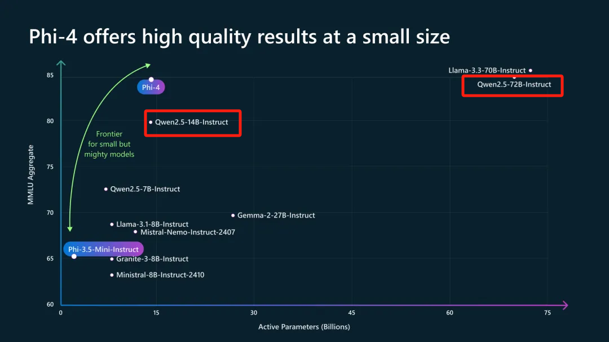
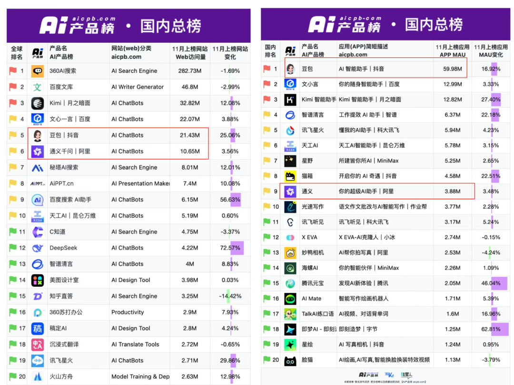
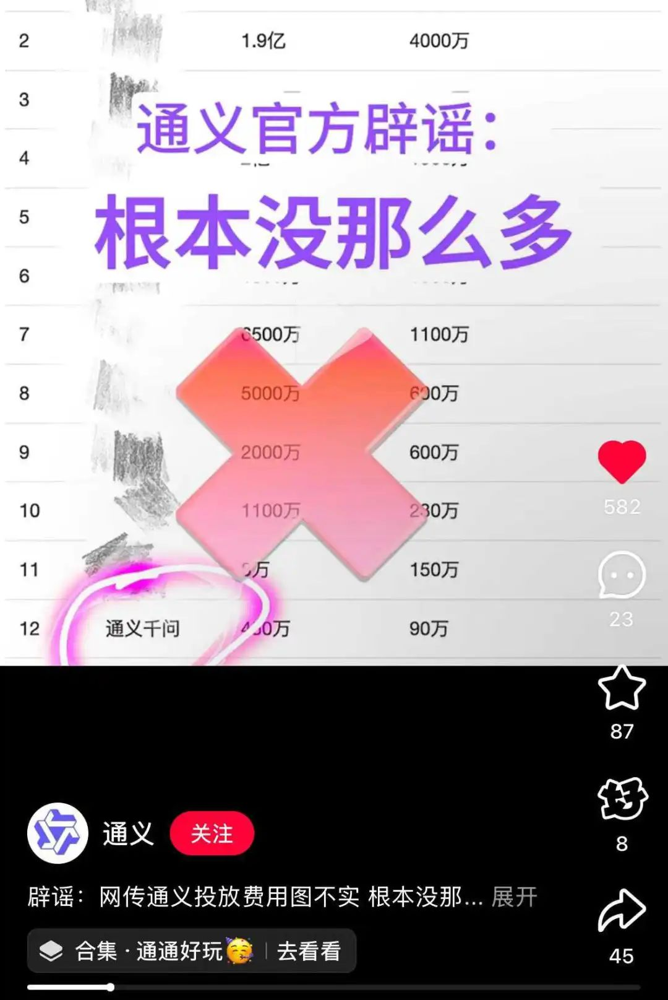
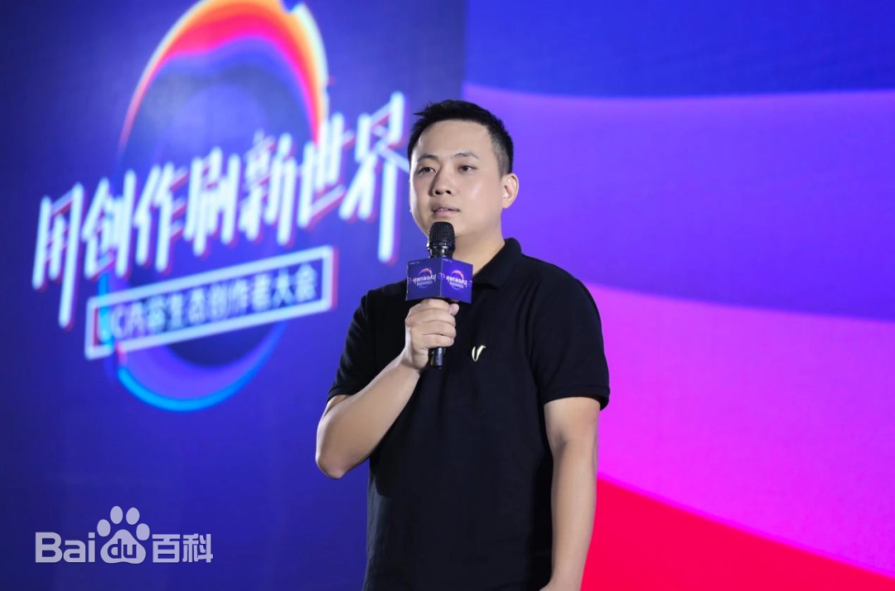

Title: 国产开源模型顶流「通义」，被曝应用团队已“离开”阿里云，并入阿里智能信息事业群！ 阿里吴嘉回归的第一把火，能燃起来吗？

URL Source: https://mp.weixin.qq.com/s/nxvnnNYfDseew3h2pntWLA

Markdown Content:

编辑 | 伊风

媒体爆料了阿里系大模型“通义”的大新闻：

近期，**AI应用“通义”已经从阿里云被分拆出来，并入到阿里智能信息事业群**！

乍一看有点懵，因为被分拆出来的不是全部的“通义”，而是 To C 的应用层“通义”。而模型层的“通义”大模型家族相关业务，仍然保留在阿里云体系内的通义实验室中。

**这显然是阿里系AI发力C端的强烈信号。**

有知情人士透露，此次调整包括通义To C方向的产品经理，以及相关的工程团队，一并调整至阿里智能信息事业群。调整后，通义PC及App团队与智能搜索产品“夸克”平级。而后者可能是目前阿里系最成功的AI To C产品。

此前，通义一直在默默地耕耘开源生态，现在终于有了发力C端的态势。然而，已经落后的“通义”还能迎头追上吗？

**通义：开源赢很大，To C 慢三拍**

通义是当之无愧的国产开源扛把子。

在各种模型发布时，Qwen系列模型都是会被作为标杆进行比对的。在微软最新发布的phi-4模型技术报告里，也能感受到通义有多能打。

但是在 To C 上，通义则明显不够看了。

如果说Web端，通义和豆包还只是一倍的差距。

那APP端就是豆包的单方面吊打了，目前两者的MAU差距快到足足20倍了！

图源：AI产品榜

大家都知道，Web端的AI产品体验其实大同小异，用户还会因为模型能力而更偏好通义。

而APP上的低月活，则更暴露了通义在To C方向上的劣势，从界面设计到相关功能的开发都有所欠缺。

而且，通义一直给人的印象，就没在To C方向上努力过——并非是空口白说，肉眼可见通义在AI产品疯狂的投流战中完全隐身了。在其他AI应用为了抢用户打的不可开交时，通义过分的“与世无争”。

之前，网传爆料称通义投流垫底，Q3只投放了450万（作为对比，网传豆包的季度投流2亿）。

结果，通义自己跑出来辟谣，说“根本没有那么多”，并官方玩梗“被自己穷笑了”。

到了年底，通义终于决定发力C端，是一件让人欣喜的事情。

毕竟，这么强的模型能力，可不能白白浪费了！

**阿里智能信息事业群：**

**一个月前吴嘉刚刚回归**

阿里在AI上的布局其实很早。

2019年6月，阿里就成立了阿里创新业务事业群，由85后的高管吴嘉挑头负责，旗下有UC事业部、书旗事业部、智能营销事业部等业务。

2021年，阿里进一步听到了AI的“风声”。在阿里创新业务事业群的基础上，成立智能信息事业群。

就成立了智能信息事业群，产品线包括UC浏览器、夸克、书旗小说等，主攻信息服务方向的智能化创新。

**而阿里最成功的AI产品——夸克，就是吴嘉一手孵化的。**

从公开数据来看，夸克累计用户量已经过亿，经常在苹果商店免费榜排第一。去年9月，夸克日活用户同比增长了35%，是阿里甚至整个互联网行业少见的、能保持双位数高增长的产品。

2023年起，夸克开始了一系列的新业务尝试，推出了包括“夸克扫描王App”、“健康助手”、“AI PPT”等新产品，逐渐向一站式AI办公平台的方向发展。

23年年底，吴嘉被调至负责淘天用户平台事业部与阿里妈妈事业部。

而明星产品夸克的增长之路还在继续：今年6月高考季，夸克高考AI搜索使用量超过了1亿次。7月，夸克升级“超级搜索框”，以AI搜索为中心，提供智能问答、智能写作、智能总结等AI能力。

11月吴泳铭再次点将，**吴嘉回归阿里智能信息事业群，并将专注探索阿里巴巴在AI To C端应用的业务。**

而通义应用层的这次调动，是吴嘉回归后的第一把火。

这位在AI产品上卓有成就的管理者，能否将夸克成功的经验，复用在通义上，探索出阿里AI产品的To C之路，还需留待时间验证。

**写在最后：To C产品交给专业的人**

阿里云作为To B业务，可能不适合开发和推广一款To C产品。待在阿里云的通义，也注定无法为自己争取到投流的经费。

字节则似乎更早的意识到，产品和模型团队的分离。

时间回到2023年8月，在首批AI大模型备案时，字节的云雀大模型还在To B的火山引擎之下。

同月，字节内测项目Grace改名“豆包”上线。此时，距离文心一言上线已经过去5个月之久，很多外界的声音认为字节在AI上的动作落后了。

不过，23年11月，字节迅速反应，组建了Flow部门，负责AI大模型应用的研发。

此后豆包奋起直追，呈现了后来者居上的态势。今年5月，火山引擎正式发布了自研的“豆包大模型”。实际上，火山引擎是豆包大模型to B的商业化业务的对外窗口，不做研发工作。

在被认为是AI应用元年即将结束的时候，通义终于“急了”。从豆包发家史来看，后发的AI产品应当还有许多机会，随着模型能力的跃升，还有一个个的“弯道”可以“超车”。但是，通义需要完成的转变很多、挑战也大。

调整团队的架构只是第一步，预计在不久的未来，更多通义的变化即将来到。

参考链接：

https://mp.weixin.qq.com/s/rXdwANt8Mfn7KHjSMZjjtQ

**——好文推荐——**  

[突发！TikTok或1月19日美国全面下架，曝苹果和谷歌已接到官方通知；CEO周受资紧急赴海湖庄园，特朗普曾暗示将撤销禁令！](https://mp.weixin.qq.com/s?__biz=MjM5ODI5Njc2MA==&mid=2655921136&idx=1&sn=10686145da3cd0a06104c27f0d319250&scene=21#wechat_redirect)  

[公开版 OpenAI Sora 震撼登场！独立产品，开服就被被挤爆！视频可控性拉满！奥特曼：视频的GPT时代开启](https://mp.weixin.qq.com/s?__biz=MjM5ODI5Njc2MA==&mid=2655920839&idx=1&sn=3db141e67b5b0cb7a43075ea77a8e2c6&scene=21#wechat_redirect)  

