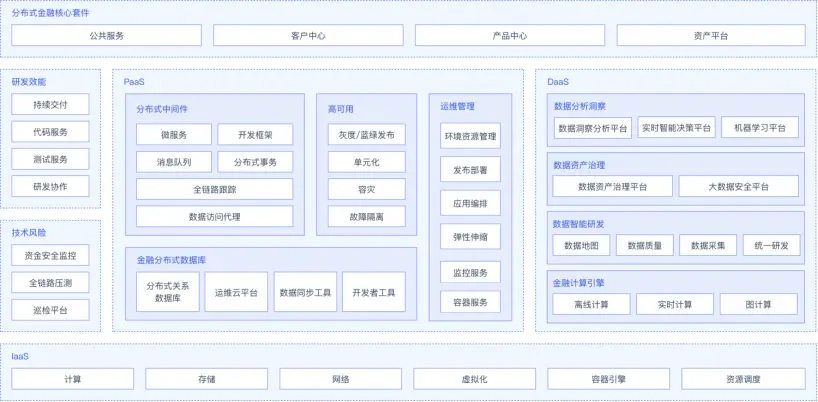
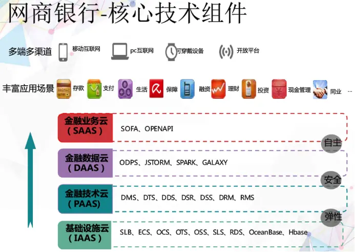
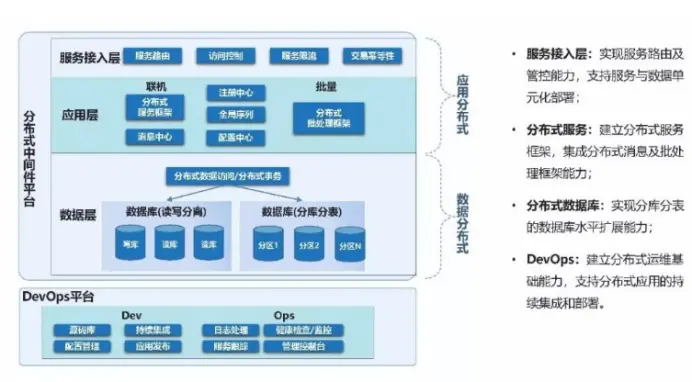
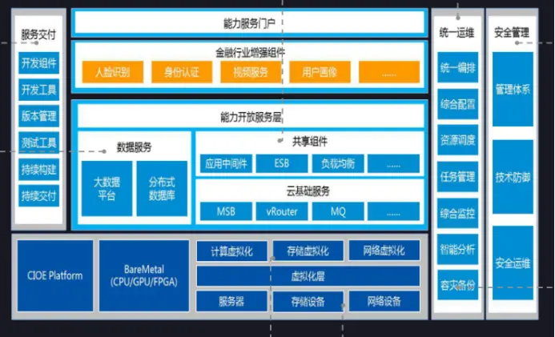

# 国内主流银行业金融系统分析 - 简书
[国内主流银行业金融系统分析 - 简书](https://www.jianshu.com/p/3efea60f03ba?utm_source=pocket_saves) 

 2018.12.28 18:59:45字数 1,774阅读 2,852

        互联网金融的兴起对传统金融业，特别对银行业产生了前所未有的影响，我搜集了目前几家互联网化的金融公司架构，做简要对比和分析。

**1、蚂蚁金服**

基于淘宝海量交易业务而产生的蚂蚁金服，拥有天然的金融属性，所以蚂蚁金服研发了自己的金融分布式架构系统SOFAStack。下图是针对银行的解决方案技术架构。

分布式银行核心架构主要分为四层：

SaaS分布式金融核心套件层提供支撑银行业务处理的核心应用组件。

DaaS层围绕大数据处理和计算，面向业务提供离在线一体化的风控和数据分析能力。研发效能提供敏捷的持续交付和持续发布能力。技术风险提供实时的技术风险保障能力，保障业务连续性和资金安全。

PaaS层提供面向金融场景的分布式技术框架、组件和运行环境，并提供运维平台进行服务和资源的管控。

IaaS层提供低成本的服务器、网络设备、存储等物理设施，通过虚拟化、容器化和云计算技术使得基础资源具备成本低廉、安全、可伸缩的特性。

公开资料显示蚂蚁金服使用的分布式数据库多为OceanBase、内部研发框架是基于spring boot框架的SOFABoot。

容灾：使用三地五中心多活架构。

**2、网商银行+蚂蚁金服**

网商银行、微众银行和百信银行是互联网银行的代表。由于网商银行主营小微企业和个人贷款，而微众银行定位个人消费金融，百信银行规模还小，所以网商银行更适合传统银行借鉴。

网商银行系统最早由蚂蚁金服团队研发，核心系统是SOFAStack架构。

图中基础设施云主要包括SLB接入层、ECS虚拟机、分布式数据库和OCS分布式缓存系统等。

金融技术云包括DRS分布式服务注册系统、DMS分布式消息文件等。

金融数据云包括ODPS开放数据处理服务等。

金融业务云提供开放接口。

容灾：采用两地（杭州+上海）两活的弹性架构，形成独立的业务单元，分布到各个机房上。异地多活多中心也是很多金融系统采用的容灾方式。

**3、民生银行+阿里**

民生银行发布了分布式核心金融云平台，该架构以分布式计算框架和分布式数据存储为基础。民生银行使用了阿里云Dubbo源码，根据业务需求进行了定制。

因为银行系统的业务在很多时候需要靠业务逻辑,需要保证应用的可靠运行,但是底层也需要分布式改造,所以民生银行系统的核心架构在应用层和数据库层都实现了分布式。

使用BASE原理最终一致性和基于冲正模型的反向处理实现分布式事务功能。

数据库方面选择巨杉SequoiaDB。

容灾：两地多机房，同城两活。

**4、中信银行+中兴**

中信银行与中兴通讯合作自研了GoldenDB分布式数据库，实现各种场景下在保证数据一致性前提下提供高性能，可扩展的数据服务。

这套架构也分为四层架构：

IaaS基础云平台、PaaS解决方案、数据服务为大数据及分布式数据库平台、DevOps交付。

容灾：两地双活三中心

**5、总结**

蚂蚁金服的技术架构，基本包括当前金融系统主流架构设计思想。分层云化、微服务、分布式事务、消息中间件、开放API，容灾采用异地多活多中心。网商银行和南京银行都是蚂蚁金服SOFAStack架构的应用案例。

但是蚂蚁金服的OceanBase是有缺陷的。根据官网文档显示OceanBase的UpdateServer是唯一能够接受写入的模块，关键还是单机。这点对于存在大量修改操作的银行系统来说，可能就会成为性能瓶颈，而解决办法又回到了传统的增加硬件。

网商银行的基础云提到了OceanBase和Hbase分布式数据库，而两者的应用场景不完全相同。我分析应该是针对不同业务选择不同数据库的策略。即：不需要事务，数据量很大时采用Hbase，而需要事务且数据量很大时用OceanBase。

民生银行是对阿里Dubbo源码二次开发的，自研了消息中间件。

银行是否应该套用阿里的框架？我有以下拙见：1），阿里基于淘宝业务，要去IOE，去ESB，阿里去IOE目标跟银行是一致的，但是是否应该去ESB有待商榷。即使是微服务，公共基础能力的调用依然可以通过总线BUS提高效率。2），阿里架构是按照 BASE 原理做到最终一致性，而银行传统上是采用 ACID 的强一致性，这个软状态期间的不一致性能否被容忍？有些场景不能接受。

中信银行联合中兴自研了分布式数据库goldenDB，背景就是解决传统小型机成本高、扩展差的问题，该数据库保证了一致性要求，集群性能4W TPS。

容灾分析：“两地三中心”是银行业传统容灾部署方式，备机闲置造成浪费。无论蚂蚁金服还是中信银行，都采用了多地多活多中心方式。主要为了增加资源的利用率和减少故障影响范围。当然对于小银行来说，多中心会带来成本增加问题。

**6、参考资料**

蚂蚁金服|金融科技：[https://tech.antfin.com/solutions/digitalbankdbc](https://tech.antfin.com/solutions/digitalbankdbc)

蚂蚁金服郑波-网商银行金融云的架构之路：[https://doc.huodongjia.com/detail-3904.html](https://doc.huodongjia.com/detail-3904.html)

分布式架构为民生银行科技金融战略打下坚实基础：[https://www.sohu.com/a/236748082\_672569](https://www.sohu.com/a/236748082_672569)

中兴通讯首席架构师钱煜明-打造金融级分布式数据库服务：[https://myslide.cn/slides/6434#](https://myslide.cn/slides/6434#)

