Title: 图解 DeepSeek-R1

URL Source: https://mp.weixin.qq.com/s/SyrGxr-3URQrGGJVNbvdZg

Markdown Content:
图解 DeepSeek-R1 
---------------

上一篇翻译的《图解推理型 LLMs》受到了很多小伙伴的关注。上篇 Maarten Grootendorst 的内容主要围绕推理型 LLMs 展开，对 DeepSeek-R1 的讲解有些简略。

这次我重新绘制了文章中的几个图示，以 DeepSeek-R1 论文为核心展开阐述。

感谢公众号“**机器学习实验室**”主理人鲁哥对本文中图示提出的宝贵意见。

* * *

论文核心贡献
------

### 在基础模型上的大规模强化学习

#### 1\. DeepSeek

验证了预训练后的基础模型无需经过任何的监督微调步骤（SFT），仅通过纯强化学习（RL) ，即可自主发展出诸如自我验证、反思、生成长思维链的复杂推理能力。这是在公开研究中，首次验证了纯 RL 可激发模型推理能力。

#### 2\. DeepSeek-R1

提出了两阶段 RL+两阶段 SFT 的 Pipeline。具体如下：

1.  1\. 冷启动 SFT：冷启动数据（CoT 示例）微调。
    
2.  2\. 面向推理的大规模的 RL： 推理专项优化，发现优质解题策略。
    
3.  3\. 全场景 CoT 增强 SFT：混合 RL 生成的高质量数据与通用数据，平衡推理与语言能力。
    
4.  4\. 全场景 RL：与人类偏好对齐，完善模型在推理能力和非推理能力方面的表现。
    

### 蒸馏，小模型也可以很强悍

大型模型中的推理模式可以被蒸馏 （distilled）到较小的模型中，这种方式得到的小模型，在推理质量上比直接用纯 RL 在小模型上获得的效果要好，并开源了开源了 1.5B、7B、8B、14B、32B、70B 参数的蒸馏模型（基于 Qwen2.5 和 Llama3 架构）。

* * *

DeepSeek-R1-Zero
----------------

### 基础模型

训练 DeepSeek-R1-Zero 所使用的基础模型为 DeepSeek-V3-Base (671B，37B Activated)。

### 训练过程

DeepSeek-R1-Zero 是从 DeepSeek-V3-Base 出发，直接通过强化学习，让模型自己不断尝试、获得奖励，再改进答案，训练出一个能够清晰展示推理过程、给出正确答案的模型。

具体流程如下图：

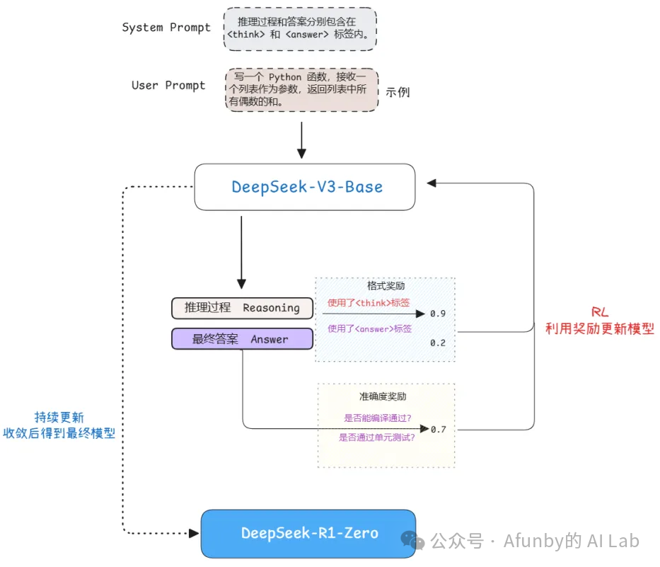

### 一些细节：

#### 1\. 奖励模型

奖励模型（Reward Model） 的主要作用是给每个候选输出打分，从而引导 DeepSeek-V3-Base 朝着“更好”的输出方向更新。如上图所示，DeepSeek-R1-Zero 采用了一种基于规则（Rule-based）的奖励系统，由两类奖励共同组成：

##### A-准确度奖励（Accuracy Rewards）

判断模型输出是否“正确”或“符合题意”。

比如对于一个数学问题，若是确定性答案（比如数值计算、方程求解等），就要求模型在约定的格式中提供最终结果，方便做自动或半自动的正确性验证。

##### B-格式奖励（Format Rewards）

督促模型在输出时遵循指定的格式要求。

在 DeepSeek-R1-Zero 的 RL 训练中，需要模型把推理过程放在 `<think>` 和 `</think>` 标签之间，把最终答案放在 `<answer>` 和 `</answer>` 标签之间。

如果模型输出符合此格式，就会得到相应的正向奖励；反之，如果格式错误或漏写标签，就会减少奖励。

这类奖励并不直接与“解题正确性”挂钩，但它能让策略模型学会按照规范输出，方便后续的可解释性分析或回答的结构化呈现。

#### GRPO：组内相对策略优化

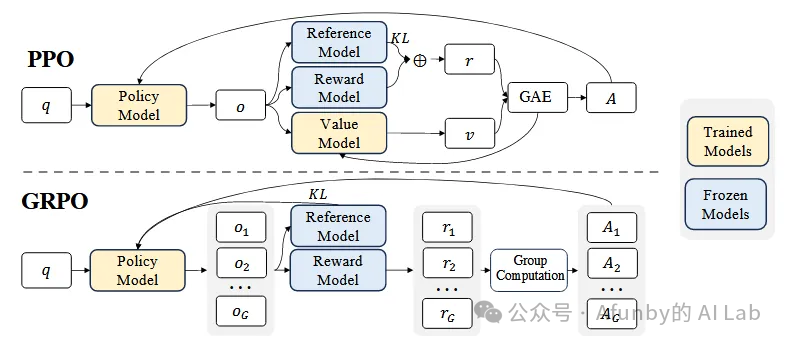

GRPO（Group Relative Policy Optimization） 算法的核心思想是：对每个输入提示，模型会生成一组候选回答，而不是只生成一个答案；然后，不再简单地使用单个回答的绝对分数来更新策略，而是对这组候选回答进行相对比较，从中判断哪个回答在这组中表现得最好，从而利用这种“组内相对优势”来指导模型改进。

**传统强化学习中，模型生成的每个答案都会获得一个绝对奖励分数，这个分数可能会因为外部环境噪声，或评估规则的不完美而波动很大，导致策略更新时不稳定。**

**而 GRPO 并不单独依赖某个答案的绝对分数，而是把一组候选答案放在一起比较，计算每个答案在组内的相对优势。**

就像在一次考试中，GRPO 不是只看某个同学的分数，而是把全班同学的成绩放在一起比较，哪个同学表现相对更好，就说明他的方法更有效。这种组内比较可以平均掉一些偶然因素，使得反馈更稳定，从而使策略更加平滑、高效。

在 DeepSeek-R1-Zero 中，由于候选答案是同时生成的，GRPO 能够利用它们之间的微小差异来判断哪些推理步骤更有助于得到正确答案。

比如，对于一道数学题，模型可能生成五个不同的解题过程，即使绝对分数相差不大，但通过比较，算法能识别出哪种思路更连贯、步骤更完整，从而在策略更新时更加偏向这种思路。

同时， 由于在 GRPO 中每个输入对应一组输出，因此即使某个答案的绝对得分较低，但如果在这一组中它的表现最好，模型也会被鼓励去学习这种生成方式。

模型在持续的强化学习的过程中，根据这些奖励信号的引导进行更新，在任务中的能力得到提升：

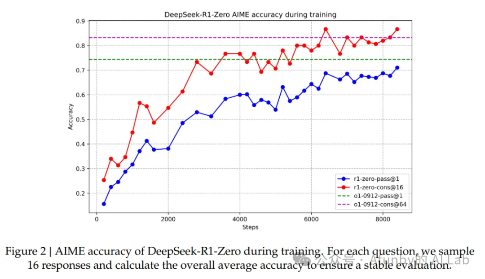

随着模型能力的提升，研究者们还观察到，模型自己学习到了通过更多思考时间和思考 token，来处理更复杂的任务。这一现象有意思的地方在于，模型这一能力的习得并非是通过显式编程，而是模型通过不断与强化学习环境交互的结果。

### DeepSeek-R1-Zero 的缺点

尽管 DeepSeek-R1-Zero 展现出强大的推理能力，但仍面临一些问题。比如可读性差和语言混合的问题。受 DeepSeek-R1-Zero 的启发，研究者们通过对以下两个问题的探索，训练出了 DeepSeek-R1：

1.  1\. 通过加入少量高质量数据作为冷启动，是否能进一步改善推理性能，或加快收敛速度？
    
2.  2\. 如何训练一个用户友好的模型，使其不仅能产生清晰连贯的思维链（CoT），还能展现出强大的通用能力？
    

* * *

DeepSeek-R1
-----------

### 基础模型

与 DeepSeek-R1-Zero 相同，DeepSeek-R1 也是以相同的 DeepSeek-V3 Base 为起点进行训练的。

### 训练过程

论文将 DeepSeek R1 的实现分为 4 个阶段。我们将 SFT 的数据生成与 SFT 训练这两个步骤拆开，按照 5 步理解：

1. **冷启动（Cold Start）**

2. **面向推理的强化学习（Reasoning-oriented Reinforcement Learning）**

3. **拒绝采样（Rejection Sampling）**

4. **监督微调（Supervised Fine-Tuning）**

5. **适用于所有场景的强化学习（Reinforcement Learning for all Scenarios）**

* * *

#### 1\. 冷启动(Cold Start)

在第 1 步，研究人员使用一个小型的高质量推理数据集，**约数千个样本**，对 DeepSeek-V3-Base 进行 SFT 微调。这样做是为了避免“冷启动”问题导致的可读性不佳。

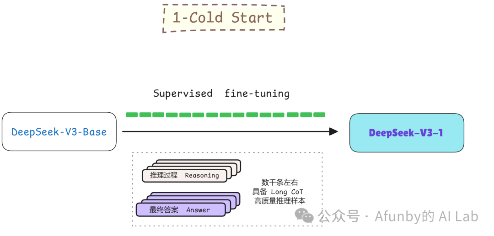

#### 2\. 面向推理的强化学习

在第 2 步，将上一步得到的模型（DeepSeek-V3-1)， 用与 DeepSeek-V3-Zero 类似的强化学习过程进行训练。

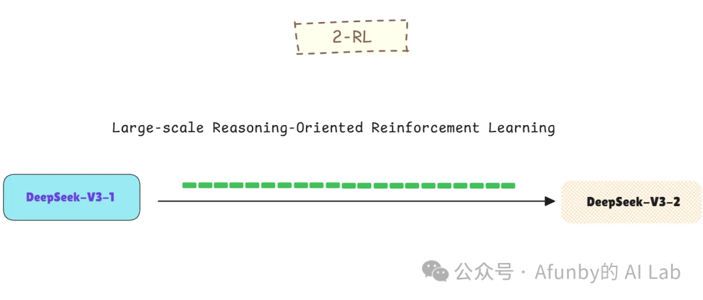

这一环节与 DeepSeek-R1-Zero 不同的地方在于， 这次在奖励机制中增加了一项新的 Language Reward，用来确保目标语言的输出保持一致性（解决 R1-Zero 语言混合的影响）。

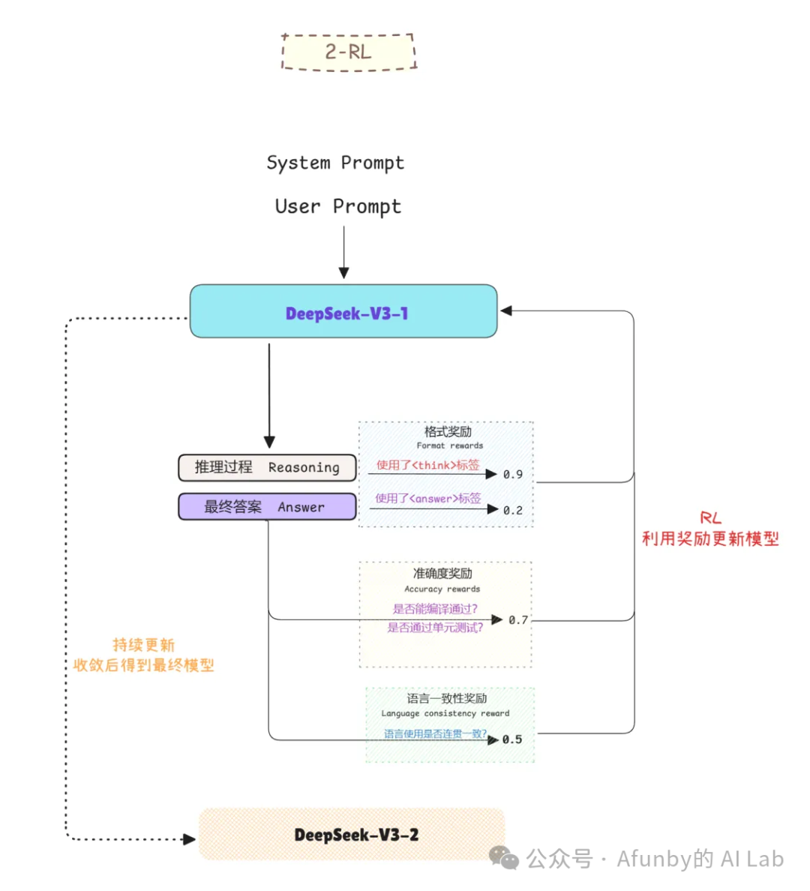

#### 3\. 拒绝采样（Rejection Sampling）

在第 3 步，研究人员利用上一步得到的模型，合成推理数据，用于后续的监督微调。

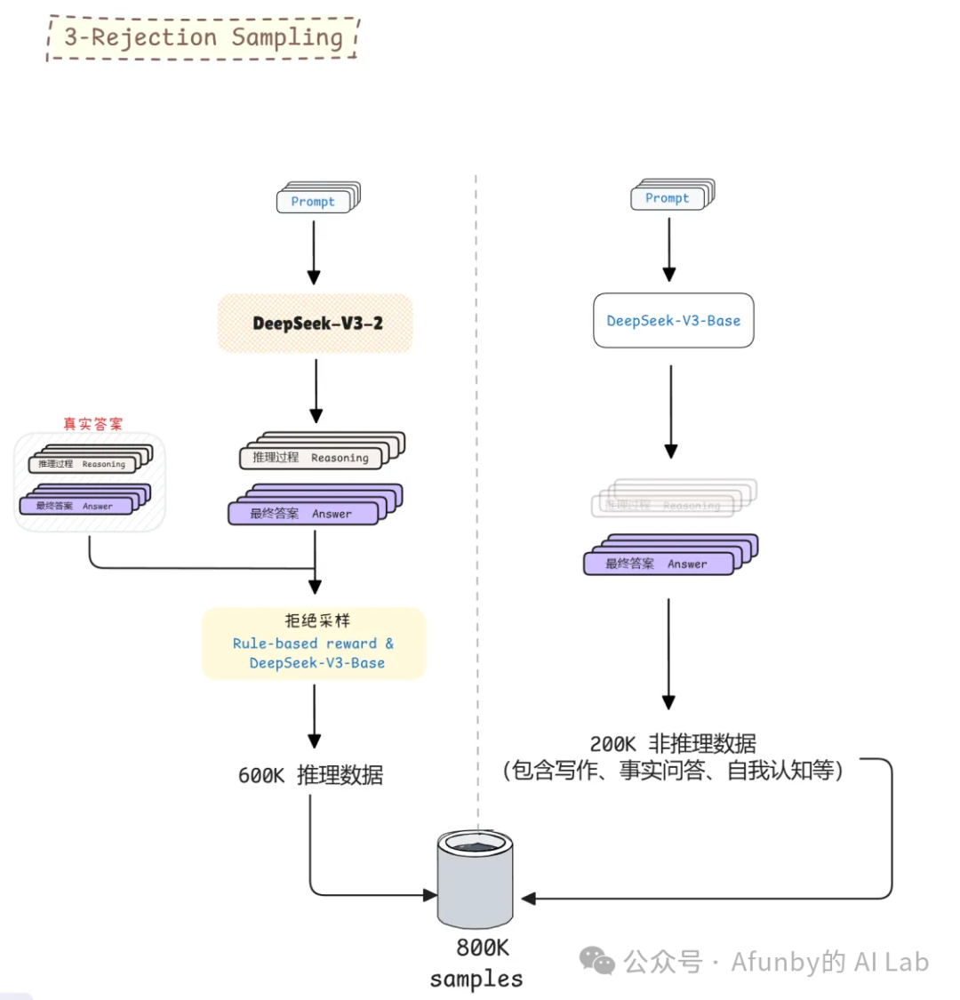

对于推理数据，首选使用上一步得到的 DeepSeek-V3-2， 针对给定的推理任务，生成含多个推理过程与最终结果的答案。

接下来，通过基于规则的奖励策略（Rule-based rewards）对答案进行筛选。只有那些达到或超过一定分数阈值的候选输出才会被保留下来，其余的不符合标准的候选就被“拒绝”（rejected）掉。这种方法称为拒绝采样，利用固定规则来快速筛选出符合条件的高质量样本。

除了简单的规则打分，论文还提出了另一种方式来评估候选输出的质量。

具体做法是，将真实答案（ground-truth）和模型生成的答案一起输入到 DeepSeek‑V3‑Base 模型中，让这个生成式奖励模型（Generative Reward Model）来判断输出的好坏，给出一个奖励分数。

这种方法更灵活，可以捕捉到人类在复杂情境下的偏好，因为奖励模型可以通过学习大量数据来反映更细腻的判断标准，不仅是基于简单的规则。

通过基于规则的奖励策略（Rule-based rewards）、生成式奖励模型（Generative Reward Model），生成了 600,000 份高质量的推理示例。

此外，还生成了 200,000 份非推理数据，这些非推理数据来自 DeepSeek-V3-Base 及其部分训练数据。

#### 4\. 监督微调（Supervised Fine-Tuning）

第 4 步，将得到的总计 800,000 条数据，用于对 DeepSeek-V3-2 模型的监督微调。

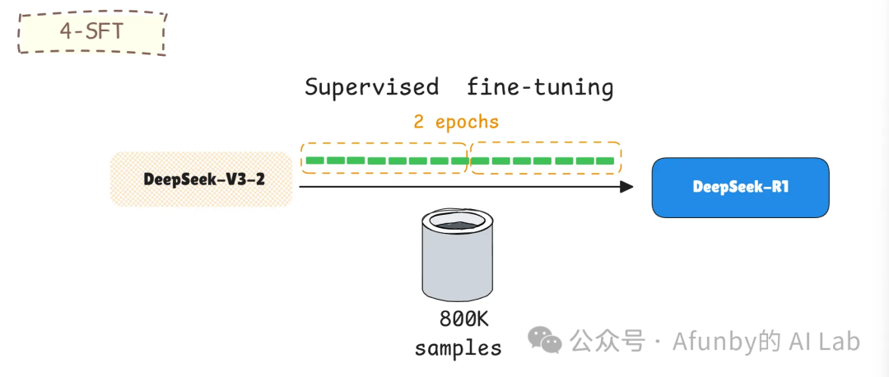

#### 5\. 适用于所有场景的强化学习

第 5 步，对 SFT 微调后得到的模型，再进行 RL 训练。

为了更好地对齐人类偏好（Human Preferences），这次 RL 中加入了包括“有用性“与“无害性”在内的奖励信号，这个为了对齐人类偏好的奖励模型也是基于 DeepSeek-V3-Base 构建的。

同时，为了避免推理结果的可读性问题，模型会被要求对推理过程进行适当总结与精简。

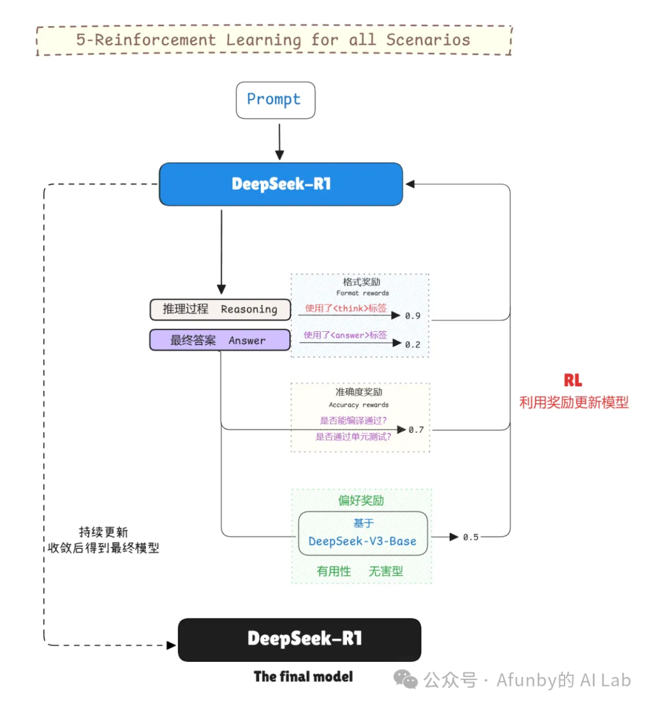

通过上述五个阶段，DeepSeek-R1 最终得以实现。可以说，DeepSeek-R1 是 DeepSeek-V3-Base 通过监督微调和强化学习得到的成果。

其中大量工作都集中在确保生成出高质量的训练示例上。

### 推理蒸馏

DeepSeek的研究人员还探索了如何将 DeepSeek-R1 的推理能力“蒸馏”到其他模型中，例如可以在消费级硬件上运行的 Qwen-32B。

具体做法是，让 DeepSeek-R1 作为教师模型（Teacher），而体量较小的模型则作为学生模型（Student）。两者在面对相同提示时，需要分别生成 token 的概率分布；学生模型会尝试在训练中逼近教师模型的分布：

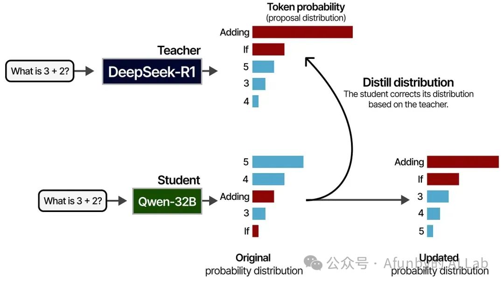

1.  1. 使用之前提到的 80 万高质量数据样本（其中 60 万条推理示例 + 20 万条非推理示例）进行训练。
    

1.  2. "学生模型"通过不断对比自己的输出分布和教师模型的输出分布，来学习 DeepSeek-R1 的推理方式。
    

这样“蒸馏”出来的小模型性能依旧出色，因为它不仅学到了 80 万条数据中的知识，还学到了 DeepSeek-R1 如何作答的思路。

* * *

Discussion
----------

### 蒸馏 v.s. 强化学习

在上述对蒸馏的讨论中，留下了这样一个问题：

模型是否可以通过论文中讨论的大规模强化学习训练，在不进行蒸馏的情况下达到相当的性能？

为回答此问题，研究者们使用数学、代码和 STEM 数据对 Qwen-32B-Base 进行了超过 10K 步的大规模强化学习训练，得到了 **DeepSeek-R1-Zero-Qwen-32B**。

表中的实验结果表明， Qwen-32B-Base 模型经过大规模强化学习训练后，达到了与 QwQ-32B-Preview相媲美的性能。

但是，从DeepSeek-R1 蒸馏得到的 DeepSeek-R1Distill-Qwen-32B 在所有基准测试中的表现都明显优于DeepSeek-R1-Zero-Qwen-32B。

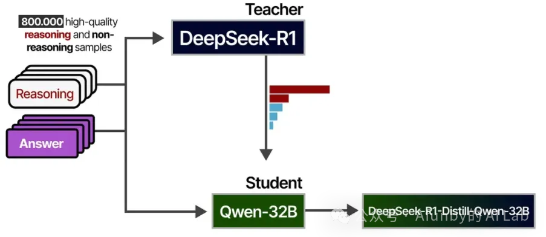

因此，论文得出了两个结论：

1.  1\.  将更强大的模型蒸馏到更小的模型中可以产生优秀的结果。而纯依赖 Large-scale RL 的小模型则需要巨大的计算能力，且可能无法达到蒸馏的性能。
    
2.  2\.  虽然蒸馏策略既经济又有效，但要突破智能的边界，可能仍然需要更强大的基础模型，和更大规模的 RL。
    

### 不太成功的尝试

在[上篇文章](https://mp.weixin.qq.com/s?__biz=MzIzMDc2Njc0MQ==&mid=2247487819&idx=1&sn=c95db9e48ab1a20efa74f658550bf28b&scene=21#wechat_redirect)中我们曾提到过程奖励模型（PRMs） 和 蒙特卡洛树搜索（MCTS）。DeepSeek 团队也曾试图用这些方法来培养模型的推理能力，但并未取得理想成果。

在 MCTS 中，由于搜索空间极其庞大，研究人员不得不大幅限制节点扩展。此外，训练一个能够细化评估推理过程的奖励模型本身就是一项困难的任务。

在结合 PRMs 的 Best-of-N 技术中，他们遇到的主要问题是计算开销过高，需要频繁地对奖励模型进行再训练，以防止出现所谓的 “reward-hacking”（对奖励函数的漏洞进行投机利用）。

这并不代表这些技术就完全不适用，但至少说明了它们在实际应用中面临着一些挑战。

* * *

R1 的局限及未来工作
-----------

### 通用能力

目前 DeepSeek-R1在函数调用、多轮对话、复杂角色扮演，以及 JSON输出等任务中的能力，**仍然不及DeepSeek-V3**。

研究者们计划在未来探索利用长链思维（long CoT）增强这些领域的表现。

### 语言混合

DeepSeek-R1目前针对中文和英文进行了优化，可能导致在处理其他语言的查询时出现语言混合的问题。比如，即使查询使用的是英语或中文以外的语言，DeepSeek-R1也可能使用英语进行推理和回应。计划在未来的更新中解决这个限制。

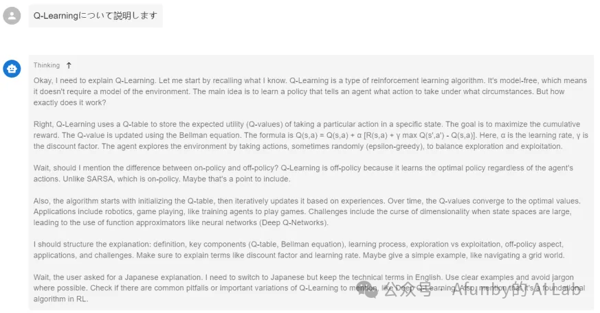

### 提示工程

在评估 DeepSeek-R1 时，发现它对提示比较敏感。少样本提示（Few-shot prompting）会持续降低其性能。因此，**建议用户直接描述问题，并使用零样本设置来指定输出格式，以获得最佳结果。**

### 4\. 软件工程

由于评估时间较长，影响强化学习过程的效率，大规模强化学习在软件工程任务中尚未得到广泛应用。因此，**相比 DeepSeek-V3，DeepSeek-R1 在软件工程的基准测试中并未表现出巨大的改进**。未来版本将通过在软件工程数据上实施拒绝采样，或在强化学习过程中引入异步评估来提高效率，解决这个问题。

* * *

总结
--

以上就是对于 DeepSeek-R1 论文中一些核心内容的阐述。

在阅读论文的过程中，我认为的 DeepSeek-R1 最核心的贡献是两个方面：

1\. 多阶段 RL+SFT 的流程创新，为后续整个大模型的开发提供了一条验证过的新范式。

1.  2\. 验证了利用 test-time compute 来突破 Train-time compute 瓶颈的重要性，从实践的角度，拓宽了我们对 Scaling Law 的理解。
    

* * *

补充 ：PTX
-------

补充一些关于 PTX 指令的内容。

最近，有很多人看到 DeepSeek 使用了PTX 指令，就认为 DeepSeek 打破了 CUDA 生态的垄断，以后模型的训练就可以完全基于国产化 GPU 就行了。

实际并不是这样。

### PTX

PTX（Parallel Thread Execution）是面向英伟达 GPU 的“并行线程执行”虚拟指令集，可被视作 CUDA 编译链中的中间表示（IR）。

它比通常编写的 CUDA C/C++ 代码更接近硬件，其语法类似汇编，直接描述线程的执行逻辑、寄存器操作、内存访问等。

### PTX 与 CUDA 的层级关系

通常，我们的 CUDA C/C++ 代码会先被编译器（NVCC）编译为 PTX，然后再根据目标 GPU 架构编译（或者 JIT 编译）为真正的硬件指令（SASS）。

从抽象程度来看，CUDA（尤其是 CUDA C/C++）是更高层次的语言；PTX 更像「可读的汇编」。

以深度学习的 Pytorch 框架为例，整个调用链是这样的：

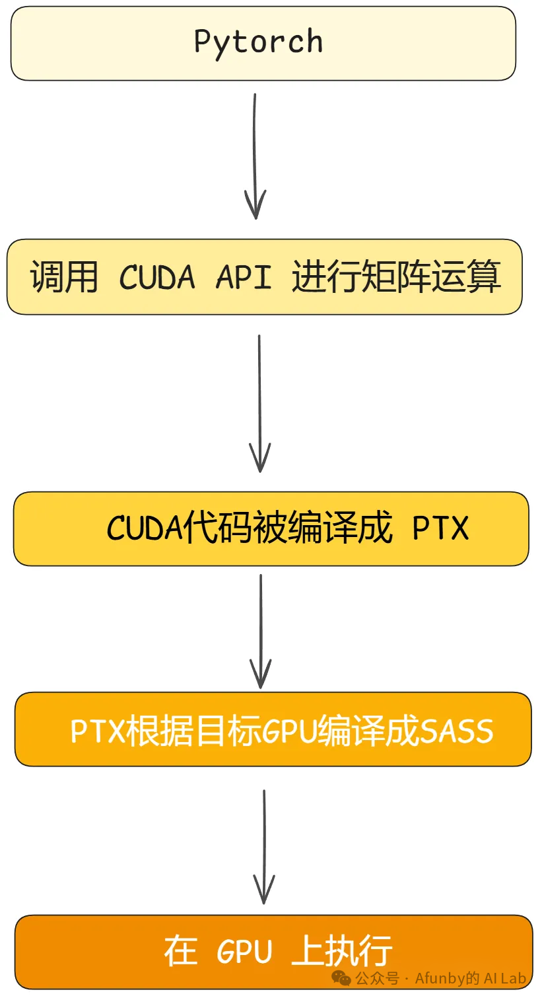

### PTX 和英伟达的绑定

**PTX** 只是一种为英伟达 GPU 定制的中间/汇编形式，也只能在英伟达的硬件生态下使用。PTX 只是更靠近底层，对 NVIDIA GPU 的硬件特性表述也更直接。

**所以，CUDA 和 PTX 都是 NVIDIA 专有，PTX与英伟达的绑定也很深，也很难在国产 GPU 上移植。**

* * *

补充： GRPO 算法的另一种解释
-----------------

**郭靖的“组内比武教学法”**

假设郭靖在桃花岛开设武馆，收徒传授降龙十八掌。某日，他让十名弟子同时演练同一招「亢龙有悔」，以选拔最优练法。此过程正暗合 GRPO 的组内对比机制。

* * *

#### 1\. 组内比武，择优而教（分组生成候选答案）

*   • **十人同练**：  
    十名弟子各自使出「亢龙有悔」，但发力姿势、步法细节略有不同。
    
*   • **郭靖观察**：
    

*   • 弟子甲：掌风刚猛，但下盘不稳（答案正确性高，但逻辑有漏洞）。
    
*   • 弟子乙：招式稳健，内力稍欠（步骤完整，但最终威力不足）。
    
*   • 弟子丙：身法轻灵，暗合九阴真经要诀（推理路径独特且高效）。
    

* * *

#### **2\. 相对评价，不唯绝对（GRPO 的相对优势计算）**

*   • **不设固定标准**： 郭靖不拘泥于“必须一掌断树”的死规矩，而是对比十人表现，选出组内最优者。
    

*   • 弟子丙虽内力不如甲，但招式衔接流畅，组内最优 → 相对优势突出。
    

*   • **淘汰投机取巧**： 弟子丁偷学西毒蛤蟆功，掌法虽强但偏离本门心法（答案正确但步骤错误）→ 组内对比暴露其异源缺陷。
    

* * *

#### **3\. 小步精进，稳中求胜（策略平滑更新）**

*   • **改良教学**： 郭靖将弟子丙的步法（高分答案特征）融入教案，但仅微调弟子们的原有招式（KL散度约束），避免走火入魔。
    
*   • **效果**： 十名弟子下次演练时，普遍吸收丙的轻灵身法，平均战力提升（模型参数稳定优化）。
    

* * *

#### **4\. 抗干扰妙用：组内互助破心魔（应对奖励波动）**

*   • **心魔试炼**： 某日暴雨倾盆，半数弟子因环境干扰发挥失常（噪声数据）。
    
*   • **郭靖策略**： 仍以组内对比评判——弟子戊在雨中最快稳住下盘（相对优势显著），郭靖令众弟子学习其“踏泥不陷”之法（抑制噪声影响）。
    

* * *

#### **5\. 终成绝学：自我一致性显威（Self-Consistency）**

*   • **终局考核**： 郭靖令众弟子对同一木人桩出招十次，取七次命中要害的招式（多数投票）定为标准解法。
    
*   • **结果**： 弟子丙的“九阴真经+降龙掌”因七次击中最优点位，被写入《桃花岛武典》（模型收敛至最优策略）。
    

* * *

**参考：**

1.  1\. 另外一篇很优秀的图解文章：https://newsletter.languagemodels.co/p/the-illustrated-deepseek-r1
    
2.  2\. 上篇图解文章的原文地址：https://newsletter.maartengrootendorst.com/p/a-visual-guide-to-reasoning-llms
    
3.  3\. 《DeepSeek-R1: Incentivizing Reasoning Capability in LLMs via Reinforcement Learning》，https://arxiv.org/abs/2501.12948
    
4.  4\. 《DeepSeekMath: Pushing the Limits of Mathematical Reasoning in Open Language Models》,https://arxiv.org/abs/2402.03300
    

* * *

欢迎各位加我个人微信，一起探讨数据科学、大模型相关知识与技术。个人微信二维码：

