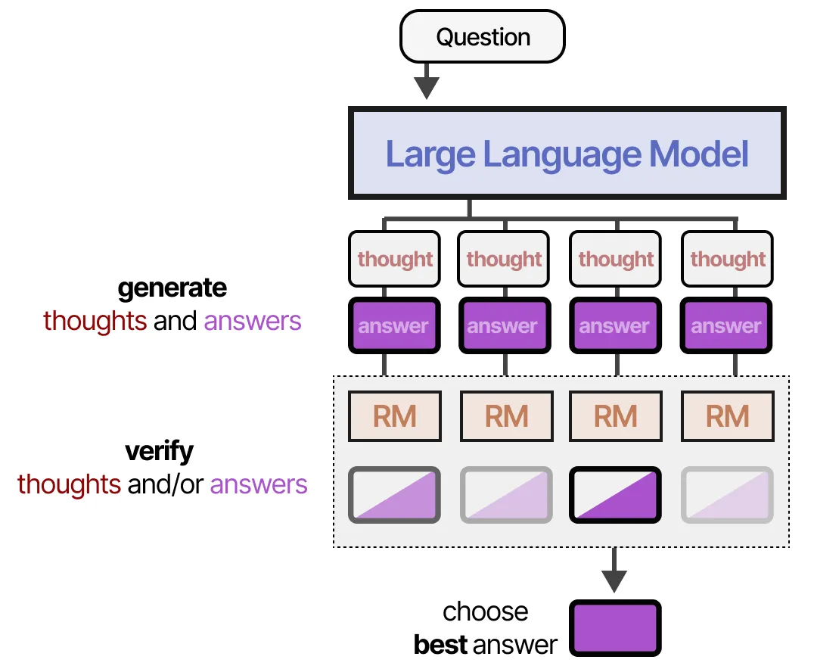
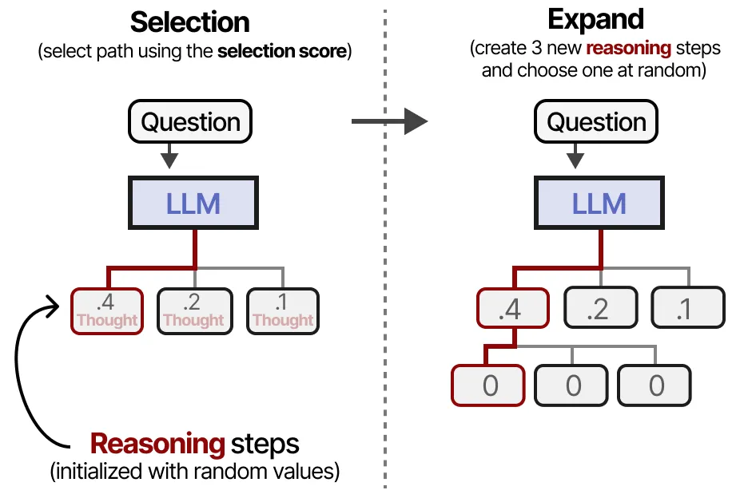

Title: 图解推理型 LLMs

URL Source: https://mp.weixin.qq.com/s/8DHjWUAIjfuIjqcoJYCotA

Markdown Content:
图解推理型 LLMs
----------

作者：Maarten Grootendorst

原文地址在这里,翻译及发布已获作者授权。

* * *

什么是推理型 LLMs
-----------

与常规 LLMs 相比，推理型 LLMs 在回答问题前，往往会先将问题拆解为更小的步骤（通常称为推理步骤或思考过程）。

那么，“思考过程”、“推理步骤”或“思维链”（**CoT**, Chain-of-Thought）究竟意味着什么？

虽然我们可以探讨 LLMs 是否真的能像人类那样思考，但这些步骤将整个过程拆解为更小，且结构化的推理。  

LLMs 不仅学习“回答什么”，更学习“如何回答”。

为了理解推理型 LLMs 的构建过程，我们首先需要探讨一个范式转变：

**从关注训练阶段的扩展（训练时计算）转向关注推理阶段（测试时计算）。**

* * *

训练时计算：Train-time compute
------------------------

在 2024 年上半年之前，为了提升 LLMs 在预训练阶段的性能，开发者通常会增加以下几个方面的规模：

*   • **模型**（parameters）
    
*   • **数据集**（tokens ）
    
*   • **计算量**（FLOPs ）
    

**这三者合称为训练时计算（train-time compute）**，它体现了预训练数据作为“ AI 之燃料”的理念。基本上，预训练投入越大，最终得到的模型就会越出色。

训练时计算不仅包括训练期间所需的计算量，还涵盖了微调时所需的计算量。

长期以来，这些因素一直是提升 LLMs 性能的关键。

### 规模定律 Scaling Laws

研究人员通过各种 Scaling Law 探讨模型规模（包括计算量、数据集大小和模型参数数量）与模型性能之间的关系。

这些定律属于所谓的“幂律”:某一变量（例如计算量）的增加会导致另一变量（例如性能）按比例发生变化。

通常，这些关系会在对数-对数坐标系下展示（呈现直线），以突出计算量的大幅增加。

最为知名的规模定律包括“Kaplan 定律”和“Chinchilla 定律”。这些定律能大致说明，随着计算量、token 数量和参数数量的增加，模型性能也会相应提升。

> （图片来自《Scaling laws for neural language models》）展示了模型性能如何随着不同计算指标（如更长的训练时间、数据集规模和参数数量）的增长而提高。

这些定律也表明，为了获得最佳性能，必须同步扩展这三个因素。

Kaplan 定律指出，在固定计算量的前提下，扩大模型规模通常比增加数据量更为有效；

而 Chinchilla 定律则认为，模型规模和数据量同样重要。

然而，在 2024 年期间，虽然计算量、数据集规模和模型参数数量持续增长，但其带来的性能提升却呈现出边际递减的趋势。

正如这些幂律所揭示的那样，随着规模的不断扩大，收益也会逐步递减。

这就引发了一个问题：

**“我们是否已经遇到了瓶颈？”**

* * *

测试时计算：Test-time Compute
-----------------------

**增加训练时计算的高昂成本促使人们转而关注另一种方法——即测试时计算（Test-time Compute）。**

与不断增加预训练成本不同，测试时计算允许模型在推理过程中“多思考一会儿”。

非推理型模型，通常只输出答案，省略“推理”步骤：

而推理型模型则会使用更多的 tokens，通过**系统性的思考过程** 推导出答案：

**这一思路的核心在于：要 LLM 花费更多计算资源来生成更好的答案。**

若所有增加的计算资源都用在生成最终答案上，实际效率不高；但若将新增的计算资源用在提前生成包含额外信息、关系以及新思路的 token 上，则模型最终答案的质量会高得多。

换句话说，**与其让模型直接把所有“算力”都投入到“一次性生成最终答案”，不如在生成答案之前先产生一些中间思考或辅助信息（tokens），再在此基础上输出答案**。

这样会带来更高质量、更准确的结果，尽管过程看似生成的文本更多、消耗的算力更大，但实际却更高效，因为减少了错误或浅层回答的概率，从而节省了后续反复验证或修改的成本。

### 规模定律

与训练时计算相比，测试时计算的规模定律相对较新。其中有两个有趣的研究方向，将测试时计算的规模定律与训练时计算联系起来。

首先，OpenAI 的一篇帖子展示了测试时计算可能遵循与训练时计算相同的扩展趋势。

> 图示中添加了红色虚线， OpenAI 认为这一新范式可能属于测试时计算。

**OpenAI 认为随着测试时计算领域的不断发展，可能会出现一种向测试时计算扩展的范式转变。**

其次，一篇题为《Scaling Scaling Laws with Board Games》的有趣论文，探索了 AlphaZero，并在不同的计算量下训练它以玩 Hex 游戏。

> 图示展示了他们如何构造不同程度的训练时计算和测试时计算。

其研究结果表明，训练时计算与测试时计算之间存在紧密联系。每一条虚线都展示了达到特定 ELO 分数所需的最小计算量。

随着测试时计算扩展得像训练时计算一样，一个新的范式正逐步形成，**即利用更多测试时计算来构建“推理”模型。**

通过这种范式转变，这些“推理”模型不再纯粹依赖训练时计算（预训练和微调），**而是在训练和推理之间取得平衡。**

测试时计算甚至可以在思考时间上实现扩展：

“长度扩展”也是我们在深入探讨 DeepSeek-R1 时将会探讨的一个内容。

### 测试时计算的类别

如 DeepSeek R-1 和 OpenAI-o1 这样推理模型的巨大成功表明，测试时计算不仅仅是“多思考一会儿”这么简单。

测试时计算可以涵盖多种技术，包括思维链、修正答案、回溯、采样等等。

大致而言，这些技术可以分为两大类：

1.  1. **Search against Verifiers：利用验证器进行搜索**（采样生成多个答案并挑选最佳答案）
    
2.  2. **Modifying Proposal Distribution：修改提议分布**（训练过的“思考”过程）
    

**利用验证器进行搜索侧重于输出，而修改提议分布则侧重于输入。**

我们将探讨两种类型的验证器：

*   • **结果奖励模型（Outcome Reward Models, ORM）**
    
*   • **过程奖励模型（Process Reward Models, PRM）**
    

正如其名称所示，结果奖励模型 ORM 只对结果进行评判，而不关心背后的过程：

相反，过程奖励模型 PRM 不仅评判结果，还会考量生成结果的过程（即“推理”过程）：

为了使 PRM 的推理步骤更具体，我们将推理展开看：

（注意：步骤 2 是一个坏的推理步骤，被过程奖励模型打了低分）

现在，你已经对 ORM 与 PRM 有了较为清晰的认识，接下来让我们探讨它们在各种验证技术中的应用。

* * *

Search against Verifiers
------------------------

测试时计算的首个主要方法是利用验证器进行搜索。这个过程通常包括两个步骤：

1.  1\. 生成多个推理过程及其对应的答案。
    
2.  2\. 然后，利用验证器（奖励模型）对生成的输出进行评分。
    

通常，验证器也是一个经过微调的 LLM，用于评判结果（ORM）或过程（PRM）。

使用验证器的一个主要优势在于，无需重新训练或微调用于回答问题的 LLM。

### 多数投票（Majority Voting）

最直接的方法其实是不使用任何奖励模型或验证器，而是采用多数投票。

具体做法是让模型生成多个答案，然后选取出现次数最多的那个作为最终答案。

这种方法也被称为 **自洽性（self-consistency）**，以强调需要生成多个答案及其推理步骤。

### Best-of-N 样本

第一种真正使用到验证器的方法被称为 **Best-of-N 样本**。它的核心思路是：生成 N 个答案样本，然后使用验证器（一般是结果奖励模型，ORM）来对每个答案进行判断。

1.  1. **生成多个答案**  
    通常由一个 LLM（称为“Proposer”）在较高或多种温度设定下生成多个答案样本。
    

1.  2. **评分并选取最佳答案**  
    将每个答案输入给结果奖励模型（ORM），为其打分，并选出分数最高的那个答案。
    

如果想评估的不只是答案，还包括推理过程，则可以使用 **过程奖励模型（PRM）**。它会判断每个推理步骤的质量，并选取具有最高总权重的候选答案。

基于这两类验证器，我们还可以让奖励模型（RM）分别对每个答案候选进行加权，然后选出综合得分最高的那一个，这种方法被称为 **加权 Best-of-N 样本（Weighted Best-of-N samples）**。

### 使用过程奖励模型的 Beam Search

在生成答案和中间推理步骤时，我们可以将上述过程进一步扩展到 **Beam Search**。

在 Beam Search 中，会对多个推理步骤进行采样，并由过程奖励模型（PRM）进行打分（类似于 Tree of Thought 的思路）。在此过程中，我们会追踪评分最高的若干条“beam”，例如前三名。

这种方法能让我们快速终止那些得分低、不太可能带来理想结果的推理路径，从而将计算资源集中在更有用的推理路线。

最终产生的答案，结合之前的 Best-of-N 方法进行加权或筛选，获得最高分答案。

### 蒙特卡洛树搜索（Monte Carlo Tree Search）

**蒙特卡洛树搜索（MCTS）** 是在搜索树中高效寻找最优路径的一种方法，通常包括以下四个步骤：

1.  1. **Selection**：根据特定公式（例如上置信界 UCB）选择当前树中的某个叶子节点。
    
2.  2. **Expand**：在该叶子节点处创建额外的子节点（新的推理步骤）。
    
3.  3. **Rollouts**：对新生成的节点进行若干次随机扩展，直到到达最终答案。
    
4.  4. **Backprop**：将模拟中获得的分数或奖励向上更新到父节点。
    

这四个步骤的目标是不断扩大最优推理路径的同时，兼顾对其他潜在路径的探索，即在“探索”与“利用”之间取得平衡。

> 可参考之前强化学习的文章[图解强化学习](https://mp.weixin.qq.com/s?__biz=MzIzMDc2Njc0MQ==&mid=2247485551&idx=1&sn=9df50d7ccbd8f08b817349254b0c7054&scene=21#wechat_redirect "图解强化学习")

节点的选择和评分通常可参考下图所示的公式或方法来执行：

在选择要进一步探索的推理步骤时，不一定总是选择当前看起来最佳的路径，这样有助于避免过早收敛。

具体实现中，**选中**一个节点后，可以对其进行**扩展**（生成新的推理步骤），再使用适当的温度采样来生成多个变体。

随后，我们会对某一分支进行多次模拟（rollout），直到生成完整的答案。

这些 rollouts 可依据推理过程（PRM）、结果质量（ORM），或两者结合来进行评估并得到分数。

最后，将这些得分回溯更新到父节点，然后继续进行新的选择（selection），周而复始，持续改进搜索过程。

* * *

修改提议分布 （Modifying Proposal Distribution）
----------------------------------------

让 LLM 进行推理的第二大类方法称为“修改提议分布”**。与利用验证器（着重输出）来搜索正确推理步骤不同，这种方法会训练模型主动生成更优质的推理步骤（着重输入）**。

换句话说，我们会对用于采样（Completion/Thought/Tokens）的分布进行修改。

试想，我们有一个问题，以及一个用于从中采样的 tokens 的分布。常见的策略是选取得分最高的 token：

但注意在上方示意图中，有些 tokens 被标记成红色——这些 tokens 会更倾向于带来推理过程：

尽管“贪婪”地选择得分最高的 token 并不一定错误，但如果某些 token 指向了更详细的推理步骤，往往可以得到更高质量的答案。

当我们修改提议分布（即 token 的概率分布）时，实质上就是对模型的 token 排序进行重新评估，使得“推理” token 被选中的概率更大：

从概念上说，修改提议分布的方法可以分成两类：

1.  1. **通过 Prompt Engineering 来更新提示**
    
2.  2. **训练模型更多地关注推理 token 或推理过程**
    

### Prompting

在 Prompt Engineering 中，我们通过更新提示来改善输出，同时也会引导模型显式或隐式地展示之前提到的“推理过程”。

要通过 Prompt 来改变提议分布，我们可以给模型提供示例（即“上下文学习”），从而诱导它生成更具推理倾向的回答：

如果不想提供完整示例，也可以通过简单的一句话来指示模型，例如“Let’s think step-by-step”，从而让模型在回答之前先做推理拆解：

不过需要注意：**模型本身并不一定“真正学会”遵循这个过程。此外，这种方法是静态、线性的，缺少自我修正机制**。一旦模型开始的推理过程出现错误，它往往会沿着这个错误的思路继续下去，而不进行修正。

### STaR

除了提示工程，另一个思路是让模型通过“学习”来进行推理，即让模型因生成相应的推理步骤而获得奖励。此类方法通常需要大量的推理数据和强化学习，以在训练中鼓励某些行为。

一个颇具争议的方法是 **STaR**，即 **Self-Taught Reasoner**。STaR 会让 LLM 生成自身的推理数据，并将这些推理作为微调的训练输入。

模型先在步骤 （1）中生成推理步骤和答案。

*   • 如果答案正确 (2a)，则将该推理过程和最终答案一起加入到三元组数据集中 (3a)，用于后续的监督微调 (5)。
    

*   • 如果模型给出的答案是错误的 (2b)，则为模型提供一个“提示”（正确答案 3b），让它去推理为什么这个答案才是正确的 (4b)。模型最终的推理过程同样会被加入到相同的三元组数据集中，用于监督微调 (5)。
    

在这一过程中（以及许多其他修改提议分布的方法中），**我们都会显式地教模型去“遵循”我们示范的推理步骤。**

换句话说，我们可以通过监督微调来决定模型“应该怎样”进行推理。

STaR 的完整流程相当有趣，因为它会**自动生成合成训练示例**。正如我们会在后续讨论 DeepSeek R1 时看到的，使用合成训练示例是将推理过程**蒸馏**给其他模型的一种绝佳方式。

* * *

DeepSeek-R1
-----------

在推理模型领域，一项重大的发布是 **DeepSeek-R1**。这是一个开源模型，与 OpenAI 的 o1 推理模型直接竞争，并在业界产生了重大影响。

DeepSeek 团队通过多种技术手段，成功地将推理能力巧妙融入到其基础模型（DeepSeek-V3-Base）中。

值得注意的是，在这一过程中并未使用任何验证器；与使用监督微调来提炼推理能力相比，DeepSeek 更加重视强化学习（RL）。

接下来，让我们深入探究他们是如何为模型训练出推理能力的。

### DeepSeek-R1 Zero 的推理机制

在通往 DeepSeek-R1 的道路上，有一个实验性模型作出了关键贡献，名为 **DeepSeek-R1 Zero**。

它基于 DeepSeek-V3-Base 而来，但并没有采用针对大量推理数据的监督微调，而是仅通过强化学习（RL）来激发模型的推理行为。

为此，他们设计了一个非常简单直观的提示（Prompt），类似于系统提示，贯穿于整个Pipeline：

可以看到，虽然提示中明确要求在 `<think>` 标签内写出推理过程，但并未对推理过程的具体形式做任何规定。

在强化学习阶段，他们基于规则设计了两类奖励：

1.  1. **准确度奖励（Accuracy rewards）**
    

*   • 通过测试答案的正确性来给予奖励。
    

3.  2. **格式奖励（Format rewards）**
    

*   • 对使用 `<thinking>` 和 `<answer>` 标签的行为给予奖励。
    

他们所使用的 RL 算法名为 **Group Relative Policy Optimization (GRPO)** 。其核心思路是：

对于那些导致答案正确的所有决策——无论是特定的 token 序列还是推理步骤——都会在训练中获得使其更有可能被采纳的权重调整。

而对于那些导致答案错误的所有决策，则会在训练中获得使其更不可能被采纳的权重调整。

有意思的是，该提示并没有给出 `<think>` 过程应当如何呈现的示例，只是要求在 `<think>` 标签内进行思考，无需更多细节。

通过向模型提供与思维链（Chain-of-Thought）相关的间接奖励，模型逐渐自主学会：当推理过程更长、更复杂时，答案更可能是正确的。

**这张图非常重要，因为它进一步印证了从训练时计算到测试时计算的范式转变。当这些模型生成更长的思考序列时，实际上就加大了测试时计算的投入。**

通过这样的训练流程，研究人员发现，模型能够自发地探索出最优的链式推理模式，并展现出如自我反思、自我验证等高级推理能力。

不过，这种做法仍存在一个显著缺陷：其输出的可读性不佳，而且有时会混用多种语言。为了解决这个问题，团队转而研究另一种思路，也就是 **DeepSeek-R1**。

让我们看看他们是如何稳定推理过程的吧！

### DeepSeek-R1

DeepSeek-R1 的训练大体可以概括为以下五个阶段：

1.  1. **冷启动（Cold Start）**
    
2.  2. **面向推理的强化学习（Reasoning-oriented Reinforcement Learning）**
    
3.  3. **拒绝采样（Rejection Sampling）**
    
4.  4. **监督微调（Supervised Fine-Tuning）**
    
5.  5. **适用于所有场景的强化学习（Reinforcement Learning for all Scenarios）**
    

以下是各个阶段的具体流程：

1.  1. **冷启动（Cold Start）**  
    在第一步中，研究人员使用一个**小型的高质量推理数据集**（约 5000 个样本）对 DeepSeek-V3-Base 进行微调。这样做是为了避免“冷启动”问题导致的可读性不佳。
    

1.  2. **面向推理的强化学习**  
    在第二步中，得到的模型采用与 DeepSeek-V3-Zero 类似的强化学习过程进行训练。但在奖励机制中增加了一项新指标，用来确保目标语言的输出保持一致性。
    

1.  3. **拒绝采样（Rejection Sampling）**  
    在第三步，研究人员利用上一步得到的模型合成推理数据，用于后续的监督微调。通过基于规则的奖励策略（rule-based rewards）、生成式奖励模型（Generative Reward Model），生成了 600,000 份高质量的推理示例。 此外，还生成了 200,000 份“非推理”示例，这些示例来自 DeepSeek-V3 及其部分训练数据。
    

1.  4. **监督微调（Supervised Fine-Tuning）**  
    第四步，将得到的总计 800,000 条示例数据用于对 DeepSeek-V3-Base 的监督微调。
    

1.  5. **适用于所有场景的强化学习**
    

第五步，他们使用与 DeepSeek-R1-Zero 类似的方法，对微调后得到的模型再次进行 RL 训练。

但为了更好地对齐人类偏好（Human Preferences），在奖励信号中额外加入了“有益性”与“无害性”的考量。

同时，为了避免推理结果的可读性问题，模型会被要求对推理过程进行适当的总结和精简。

通过上述五个阶段，DeepSeek-R1 最终得以成型。可以说，**DeepSeek-R1 是 DeepSeek-V3-Base 通过监督微调和强化学习得到的成果。**

**其中，大量工作都集中在确保生成出高质量的训练示例上。**

### 用 DeepSeek-R1 进行推理“蒸馏”

DeepSeek-R1 规模庞大，拥有 6710 亿（671B）参数。这对于普通硬件来说，运行成本极高。

因此，DeepSeek的研究人员还探索了如何**将 DeepSeek-R1 的推理能力“蒸馏”到其他模型**中，例如可以在消费级硬件上运行的 **Qwen-32B**。

具体做法是，让 DeepSeek-R1 作为教师模型（Teacher），而体量较小的模型则作为学生模型（Student）。两者在面对相同的提示时，需要分别生成 token 的概率分布；学生模型会尝试在训练中**逼近**教师模型的分布：

1.  1\. 使用之前提到的 80 万高质量数据样本（其中 60 万条推理示例 + 20 万条非推理示例）进行训练。
    

1.  2\. 学生模型通过不断对比自己的输出分布和教师模型的输出分布，来学习 DeepSeek-R1 的推理方式。
    

这样“蒸馏”出来的小模型性能依旧出色，因为它不仅学到了 80 万条数据中的知识，还学到了 **DeepSeek-R1** 如何作答的思路。

* * *

### 不太成功的尝试

还记得我们之前提到的 **过程奖励模型（PRMs）** 和 **蒙特卡洛树搜索（MCTS）** 吗？DeepSeek 团队也曾试图用这些方法来培养模型的推理能力，但并未取得理想成果。

在 MCTS 中，由于搜索空间极其庞大，研究人员不得不大幅限制节点扩展。此外，训练一个能够细化评估推理过程的奖励模型本身就是一项困难的任务。

在结合 PRMs 的 Best-of-N 技术中，他们遇到的主要问题是计算开销过高，需要频繁地对奖励模型进行再训练，以防止出现所谓的 “reward-hacking”（对奖励函数的漏洞进行投机利用）。

这并不代表这些技术就完全不适用，但至少说明了它们在实际应用中面临着一些挑战。

* * *

结语
--

以上就是关于推理型 LLM 的概念与 DeepSeek-R1 的完整探索。希望这篇内容能帮助你更好地理解 **“测试时计算扩展”** 的潜力所在！

* * *

欢迎各位加我个人微信，一起探讨数据科学、大模型相关知识与技术。个人微信二维码：

