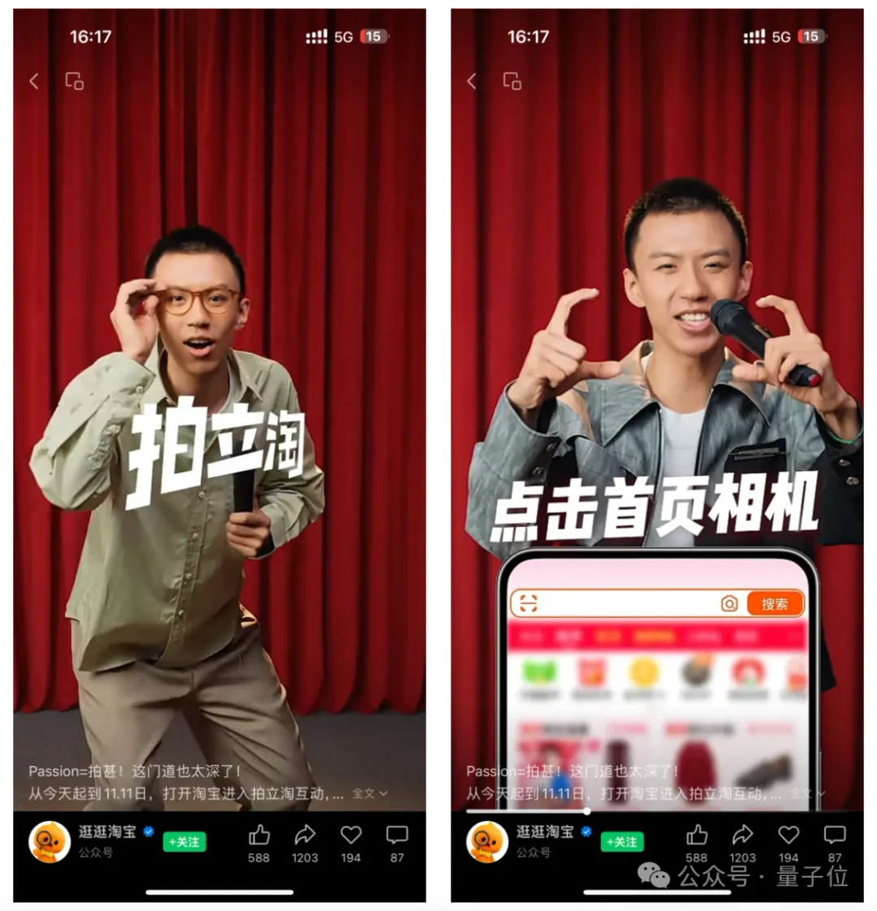
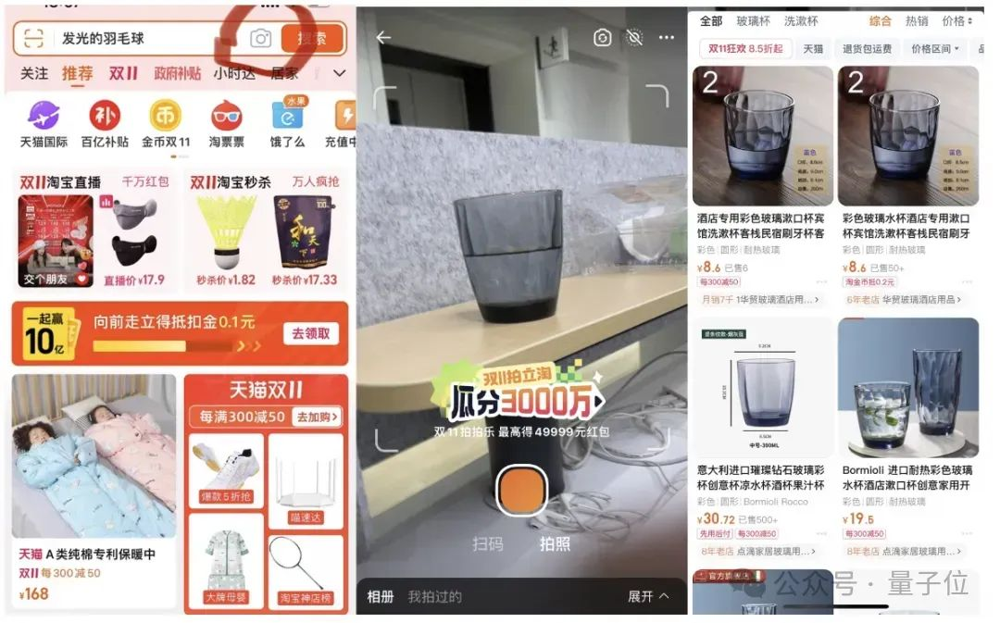
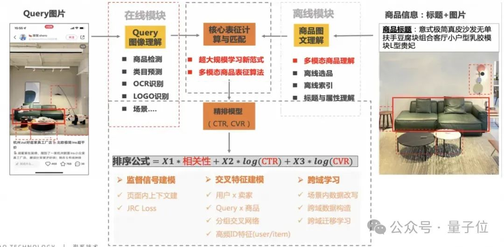
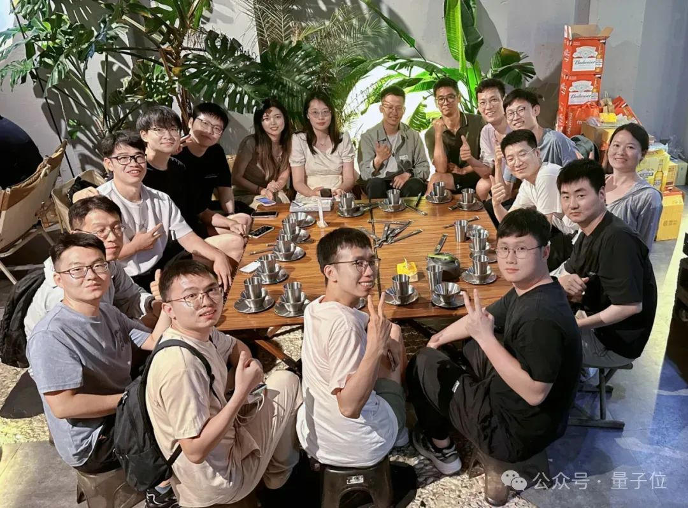
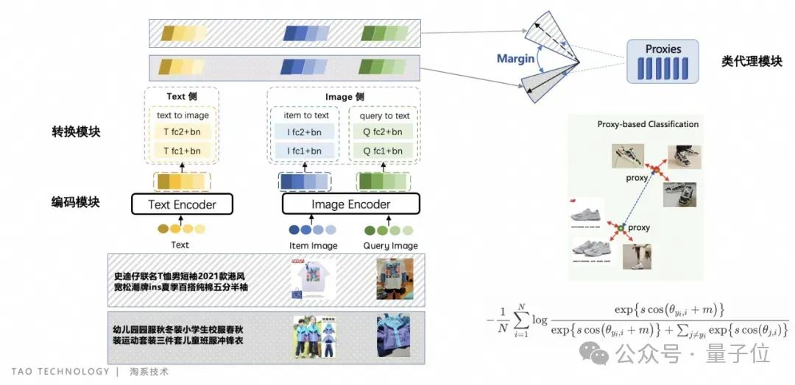
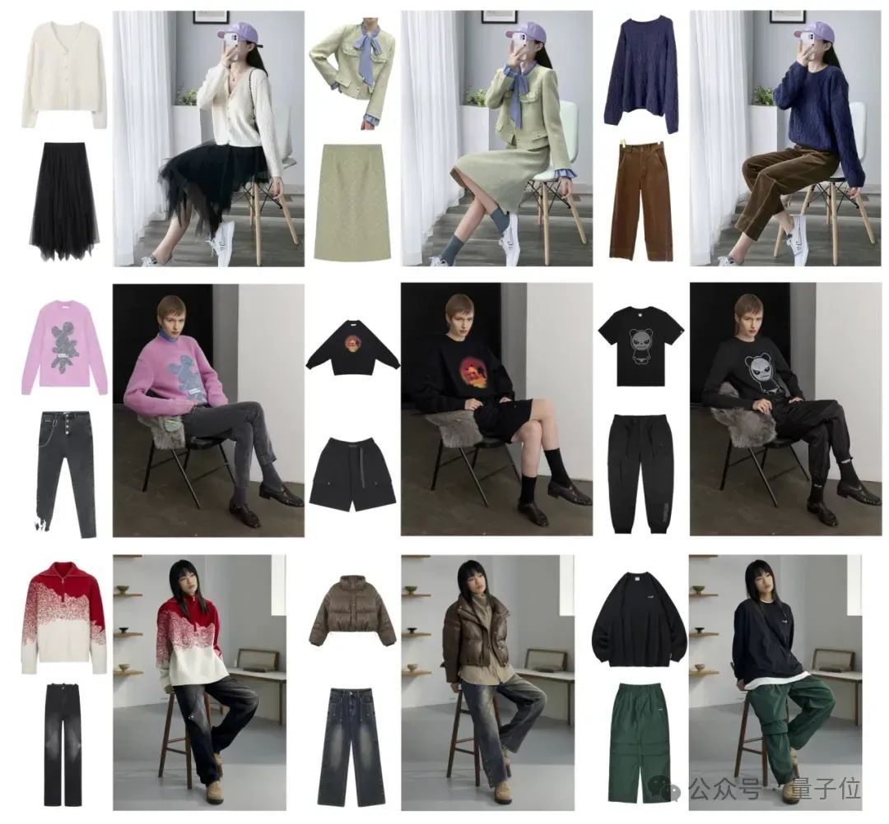
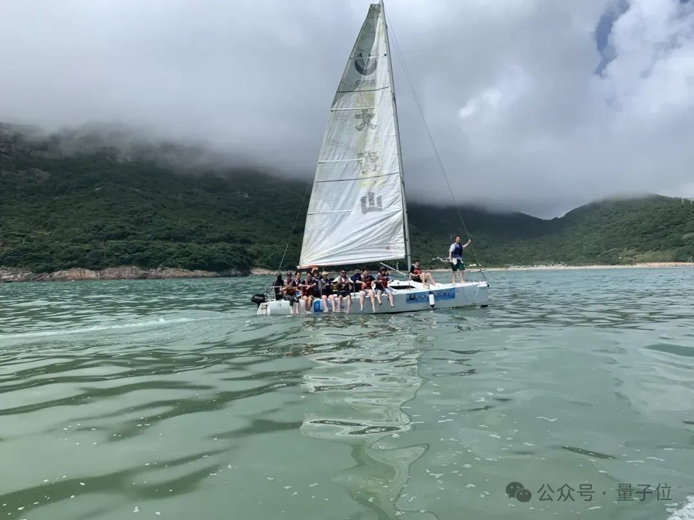

Title: 我在淘天做算法：十年拍立淘，一部视觉算法技术演变史

URL Source: https://mp.weixin.qq.com/s/vHI0uP7WRUoQJaS7yH9Iwg

Markdown Content:
> 编者按：提到“程序猿”，大家脑海中是不是立刻浮现出格子衫、不修边幅、呆滞的画面形象？这些刻板印象已经out啦，其实程序员们都是敬业又聪明的热血少年！他们不仅善于思考和洞察，还特别擅长发现和解决问题。当然i人确实比e人多是真的。为了让读者们更多了解淘天集团算法工程师们的故事，我们特意推出《我在淘天做算法》专栏，一起看看真正的“程序猿”是啥样。

在人类历史长河中，每一次技术革命无不成为产业升级的强劲推手。计算机视觉（Computer Vision）的工作原理与人类视觉类似，但需要机器依靠摄像头、数据和算法在很短的时间内完成任务。

从上世纪60年代起始，计算机视觉经历了以特征工程和传统机器学习方法为代表的技术发展。从2012年开始，以卷积神经网络（CNN）为代表的深度学习的广泛应用，更是给计算机视觉带来了突破性进展。

在**淘天集团**，依托于计算机视觉技术原理的拍立淘上线已整十年，恰好经历了视觉算法技术的发展演变。

> Passion！拍甚？只要你勇敢地拍立淘，什么都可以拍到。

脱口秀演员付航近日在短视频中所说的“拍甚”，正是刚刚过完十年生日的淘宝拍立淘产品。

###### ****

###### **△**拍立淘产品照片

回想起十年前的2014年，拍立淘在淘宝App首页上线，打开了人们通过图像搜索进行购物的窗口，带来了视觉搜索领域创新变化。

十年后的2024年，拍立淘深耕AI着力于用多模态技术升级，日均访客量突破5000万，视频虚拟试衣也即将上线，旨在让AI更好理解生活消费场景。拍立淘技术迭代的背后，离不开一群对技术不断追逐且精于探索的程序员——他们就是**淘天集团拍立淘算法团队**。

###### ****

###### **△**拍立淘的核心算法模块

> 罗马不是一天建成的，任何技术实现都不是一蹴而就的。

**柯思**，淘天集团拍立淘算法负责人，是身材瘦弱但却工作上“霸得蛮”的湖南人。在柯思看来，每一项技术从实验阶段走向产业阶段都并非易事，基于商品理解的拍立淘也不例外，不仅要具备深厚的技术积淀，还需要恰逢其时地遇到能够发挥技术潜力的应用场景。

> 拍立淘的技术启发，来源于深度学习教父Geoff Hinton团队在2012年大规模图像分类比赛以绝对优势获得冠军。

自嘲记性不好的柯思却清晰记得拍立淘技术原点——深度学习技术突破性进展。**早在2012年，阿里巴巴率先着手让深度学习在图像搜索上得以探索应用，比亚马逊早了整整5年。当年，阿里巴巴也成为全球电商领域第一个在图搜领域“吃螃蟹”的公司。**

在中国科学院大学就读期间，柯思就在深度学习技术领域钻研，特别是视觉算法领域，为日后在阿里巴巴从事拍立淘技术奠定了深厚的理论基础。

回想起拍立淘项目早期那段充满挑战的日子，柯思回忆说：“与侧重于广泛视觉应用场景下的图像检索方案不同，**拍立淘选择了一条更为专精的道路——专注于实现同款商品图片搜索功能。这就要求我们在算法设计上达到前所未有的精准度**。”

万事开头难，当时在工业界和学术界并没有图像搜索的应用先例，技术团队面临最大难题在于加快突破图像搜索技术逻辑。文本语言与视觉语言有着天然的区别，视觉符号往往比文字更能呈现出直观、形象的视觉体验效果。遇到无法用简短抽象的语言来描述的物理世界当中的物品，人们天然喜欢用画出来的形式来表达。

**为了推出图像搜索，当时的阿里巴巴iDST视觉团队在电商领域对图像分类、目标检测以及图像表征技术进行了深入且富有成效的研究。**图像分类技术使得系统能够准确识别出图片中的商品类别；目标检测则帮助定位并识别图片中具体商品的位置与边界；而图像表征技术则是通过学习高维特征向量来表达每一张图片的独特性，从而支持高效精准的相似度匹配。这三项核心技术相辅相成，共同构建了图像检索引擎。这些研究为拍立淘应用场景提供了技术基础。

**经过一系列严谨的研发、测试以及迭代优化，“拍立淘”终于在2014年正式面世。**在此之前，传统的文本搜索方式往往难以满足消费者对于特定外观或风格商品的需求，尤其是当他们不知道如何用文字准确描述想要寻找的商品时。

“拍立淘”的出现解决了这个问题：只需简单地拍摄或上传一张照片，拍立淘就能迅速从海量商品库中找到最接近该图片样式的商品信息，包括价格、评价等关键信息。

摸着石头过河
------

**在拍立淘刚起步那会儿，商品搜索信息的精准性，是图像搜索面临的最大挑战。然而，当时的深度学习领域仍处在一个在非常不成熟的发展状态。**

在巨大挑战面前，算法工程师们摸着石头过河。他们一边紧盯着最前沿的研究成果，一边又把最新知识和实际工作场景结合起来。通过不断的迭代优化与技术升级，拍立淘算法变得越来越“聪明”，也越来越贴近用户的需求。

2013年，主流搜索引擎公司推出了图像搜索产品，让用户们眼前一亮，但电商领域的图像搜索则需达到更高水平的精确度，以准确匹配用户心中所想购买同款商品的需求。据柯思回忆，那时候用户通过手机上传的照片质量真是五花八门。有的照片看起来就像是一团模糊的影子；有的背景复杂得像是在集市上拍的，各种杂物和人影乱入。

这些因素给图像数据的准确性带来了很大挑战。算法工程师们不仅要提升算法的“视力”，还要学会如何在各种奇怪的拍摄环境下保持冷静。有一次，一个用户上传了一张在夜市摊位前拍的照片，背景中有各种小吃、人群和霓虹灯，而商品却只占了照片的一小部分。为了准确识别出这个商品，团队成员们费尽心思，最终成功地解决了这个问题。团队成员们戏称自己是图像搜索界的福尔摩斯。

即便是在2014年，淘宝商品库也已拥有超过1亿件商品。在这样浩大的商品库中实现精准的图像搜索技术，无异于“大海捞针”。这不仅需要算法团队对计算机视觉、机器学习和深度学习这些尖端技术有深刻的理解，还得把这些高深的技术变得简单易用，化繁为简。比如，用户上传了一张在昏暗灯光下拍的鞋子照片，算法工程师们就要通过一系列复杂的计算和分析，从海量商品中准确地找出那双鞋。用柯思的话来说，这个过程就像是在“海底捞月”，但最终的目标是让用户感受到“心有灵犀一点通”的个性化推荐体验。

**面对重重挑战，算法工程师们攻克了一个又一个技术难关**：他们构建了一套深度学习训练与推理引擎，让复杂的算法得以高效运行；掌握了大规模数据训练的技巧，使其成为精准模型的滋养之源；为了确保算法能够稳定可靠地服务于广大用户，工程师们还实现了高性能在线服务部署布局；他们搭建起了大规模向量索引引擎架构，提高了信息检索的速度，使得内容匹配变得更加精准。

2017年，Facebook所开源的向量索引库FAISS，成为工业界向量搜索领域标杆，但是**拍立淘算法团队在内部开发了超越FAISS的向量索引库，不仅在速度上实现了对FAISS的十倍超越，实现了相较于前代技术四分之一的资源消耗，提升了能效比与成本效益，为推动向量计算领域的发展树立了新的里程碑**。

这件事让整个技术团队都感到十分振奋自豪。庆祝晚宴上酒过三巡，算法工程师们都感慨：“我们做到了想都不敢想的事情，像是定义了电商图像搜索新时代！”

2021年，多模态成为学术界、工业界的研究前沿热点。然而受限于数据与计算能力，当时拍立淘的核心模块依然是单图像模态模型，即针对商品分类构建多个模型，通过对比用户图片与数据库中的图片实现检索。随着用户对图搜需求的飞速提升与商品数据量的巨幅增长，单图像模态模型已然捉襟见肘。

**在多模态技术框架下探索算法创新，成为了摆在拍立淘算法团队面前的一道必答题**。“我们集中精力，全力以赴推动多模态算法在拍立淘平台上的落地应用。”**萧峰**说。

2018年，萧峰在上海交通大学完成硕博连读后，加入了阿里巴巴，热衷于对视觉算法技术和人工智能探索和实践。大学时期，萧峰曾多次研读美国物理学家理查德·费曼的书籍，“正如费曼教授所倡导的那样，事实和真相是科学绝对的要求。无论是面对科研还是日常工作中的挑战，力求从一个更加批判而富有创造性的视角出发，寻找问题的本质并寻求最优解。”

###### ****

###### **△**拍立淘多模态商品理解模型示意图

**为了能够让淘宝的图搜更快、更精准，萧峰等人对拍立淘图搜AI技术进行了全链路重构。这项算法技术被赋予了一个新的称谓：大规模多模态同款搜索AI技术**。2021年，算法团队在行业内率先将核心召回和相关性向量表征等模块由单模态升级到多模态，并置于图文对齐预训练的技术统一框架下。不同于文本搜索的关键词匹配和召回，图像搜索的唯一召回方式只能是通过将Query和商品映射到高维向量空间下，进行向量的近邻搜索。向量表征是图像搜索中最核心的技术。

**2021年双11年度大促活动前夕，算法工程师们决定以多模态相关性模型承接较大流量，同时提升搜索准确性**。“当时线上有六七个模型，我们尝试用一个模型进行替代，走了一条还未验证过的路。”萧峰说，“这个过程并非易事，需要不断反复实验验证。”

如何更高效地利用多种模态信息、建模淘宝数百亿图文数据是提升淘宝搜索准确性的关键。团队开创性地应用大规模多模态分类的方法，从离线验证到线上部署，一步步验证效果，最终成功地升级了线上的模型。**在2021年度的产品体验相关性评测中，同款率绝对值显著提升了12个百分点，这是拍立淘上线以来在商品匹配精准度方面提升幅度最大的一年。**

2022年底，多模态大模型惊艳亮相。多模态大模型虽然效果出众，但是资源消耗和运行耗时也是非常高。拍立淘算法团队通过应用知识蒸馏技术来解决这一瓶颈问题。在知识蒸馏过程中，通过技术手段，将教师模型的强悍能力迁移到学生模型身上，蒸馏过后，小模型即可以小很多的运行成本达到接近大模型的能力。算法团队首先将此应用到了Query和商品理解上。

业余时间，萧峰喜欢到杭州附近山区爬山。**他说：“爬山总能给我带来很多思考，就好像技术上的一座座山，总会有难度，但是爬过去就感觉不难了。”**

与AI碰撞出了新风口
----------

进入2024年， Sora的出现意味着视频生成初步成熟可用，拍立淘算法团队也感到触动并随之“神经敏感”起来。**迎着风口，团队开始尝试让AIGC在拍立淘中得到技术运用**。

林夕是团队当中为数不多的女孩子，生活中是喜欢跳舞、喜欢弹吉他、能打架子鼓的e人，工作敲代码时就变成沉稳内敛的i人。女孩子天生爱美，也善于敏锐发现拍立淘在服饰方面的微妙变化。

在多次调研中，林夕就发现，拍立淘已经能很好地满足用户搜索同款服饰的需求，但是该如何搭配服饰以及体验试穿效果依然是非常核心但未被完全解决的问题。受限于经济成本、知识成本和店铺商品数量，服饰商家们并不具备提供丰富多样且前沿的跨店搭配能力，个性化的试穿能力就更为困难。

林夕说：“我们团队长期以来在服饰类目积累的多模态理解能力和AIGC生成能力，恰恰为这两个痛点提供了解决方案。经过一番思考讨论，**团队一致认为通过AIGC低成本大规模制作个性化服饰内容具有可行性**。”

然而，现实很骨感，AIGC在电商服饰上的探索研究并不多，受限于以往的算法技术和有限的开源数据集，相关学术研究也都基本仅限于平铺图片输入，少量简单服饰款式和单一的模特动作以及场景，无法满足用户多样性需求。

###### ****

###### **△**试衣算法支持各种困难姿态以及实景拍摄的搭配上身

**基于商品理解感知体系和同款表征能力，背靠淘天内部海量业务数据加上自研算法架构，林夕等人很快设计完成了一套能真正支撑商业应用的试衣算法解决方案**。该方案不仅可以支持单件和搭配上身，适应简单和复杂背景及多种姿势，还能够保持服饰真实美观，精准控制穿法和上身状态，呈现搭配效果，突出服饰风格。

林夕兴奋地说：“试衣算法解决方案就好比让我们找到了指南针。”他们不断优化方案，不仅让衣服试穿更准确，还增加了配饰、脸部和身形的定制功能。现在，这些算法能力已经用在淘宝系搭配上，提升商品搭配多样性和美观度。他们即将推出的拍立淘搭配产品，用户只需要上传自己的照片和身材信息，系统就会根据选择的衣服推荐其他搭配，并展示出整体效果。基于这些成果，团队还在ECCV和ACM MM国际顶级会议上发表了两篇论文。

###### **△**视频试衣能在高运动幅度的场景保证高质量输出

###### **△**视频试衣能在不同运镜场景保证高质量输出

在之前的积累和经验之上，算法团队将图像试衣的能力也拓展到了视频上，并提出了业内第一个基于diffusion框架的视频试衣方案，将视频试衣的效果提升到了一个全新的水平，为其商业落地创造可能。不同于之前的算法方案，现有方案适用于所有服饰类目，支持复杂实拍场景，同时能处理各种拍摄运镜和人物在画面中的动作和空间变化，使得生成视频结果更加自然丰富且生动，符合头部商家对模特视频的质量要求。

###### ****

###### **△**拍立淘算法团队团建照片

从创建之初每天仅有数百位访客，到现在日均访问量突破5000万，这不仅仅是用户基数的增长，更是广大用户对拍立淘技术实力的认可。十年来，拍立淘算法团队坚持自研技术，与时间赛跑推陈出新，从最初的图像视觉搜索，到如今将视频作为信息传播的载体，团队用十年时间跑出了一部属于自己的演变史。

正如柯思所说，拍立淘虽然实现了从0到1的突破，但如果原地踏步就会被落下，要时刻保持技术创新，才是真的「拍甚」！

\*本文系量子位获授权刊载，观点仅为作者所有。

— **完** —

**量子位** QbitAI

վ'ᴗ' ի 追踪AI技术和产品新动态

**一键三连「分享」、「点赞」和「在看」**

**科技前沿进展日日相见 ~**

