# 探秘全球最大GPU集群，20万GPU超算在路上
[探秘全球最大GPU集群，20万GPU超算在路上](https://mp.weixin.qq.com/s/MbUtePBYNsHRs2aE9JU0LA) 

 今天，servethehome发布了 xAI Colossus 超级计算机之旅。对于那些听说过埃隆·马斯克的 xAI 在孟菲斯建造巨型 AI 超级计算机的人来说，这就是那个集群。这个价值数十亿美元的 AI 集群拥有 100,000 个 NVIDIA H100 GPU，不仅规模大，而且建造速度快。仅用 122 天，团队就建造了这个巨型集群。今天，我们将带您参观大楼内部。

Colossus 的基本构建模块是 Supermicro 液冷机架。它由 8 台 4U 服务器组成，每台服务器配备 8 个 NVIDIA H100，每台机架总共有 64 个 GPU。8 台这样的 GPU 服务器加上一台Supermicro 冷却液分配单元 (CDU)和相关硬件构成了一个 GPU 计算机架。

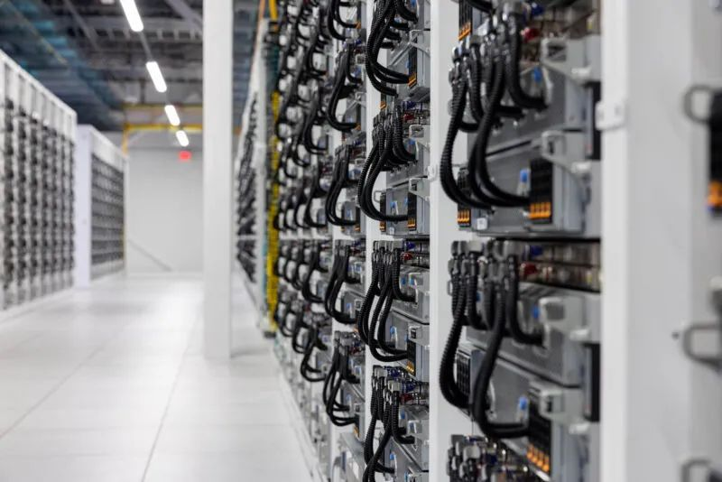

这些机架以八个为一组排列，共计 512 个 GPU，再加上网络，可在更大的系统内提供迷你集群。

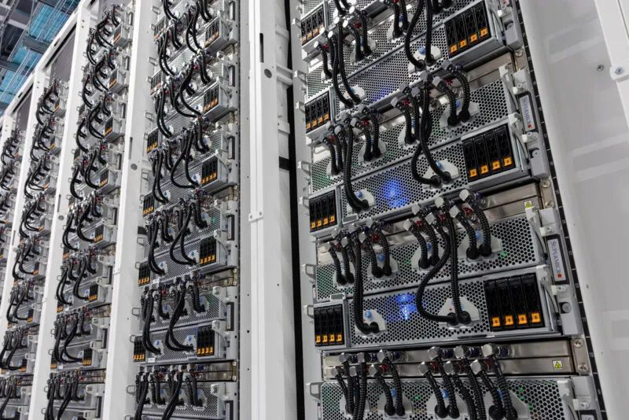

在这里，xAI 使用的是 Supermicro 4U 通用 GPU 系统。出于几个原因，这些是目前市场上最先进的 AI 服务器。一是液体冷却的程度。另一个是它们的可维护性。

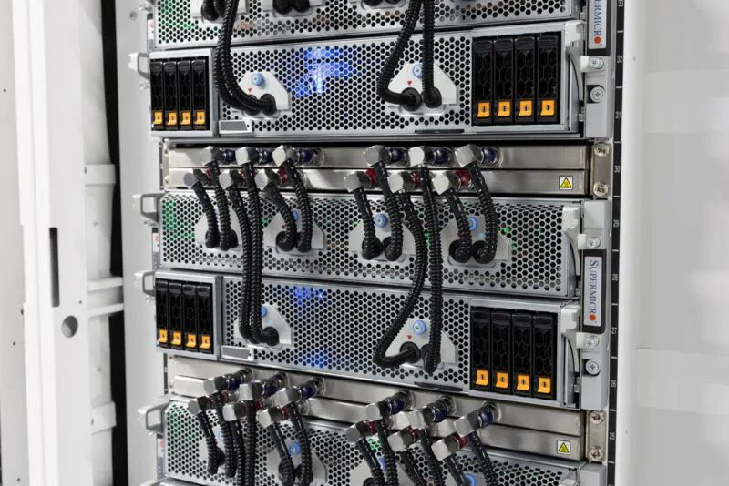

大约一年前，我们在丹佛的 Supercomputing 2023 (SC23)上首次看到了这些系统的原型。我们无法在孟菲斯打开这些系统之一，因为我们在那里时他们正忙于运行训练工作。其中一个例子是系统如何放置在托盘上，无需从机架上移除系统即可进行维修。1U 机架歧管有助于为每个系统引入冷液体并排出热液体。快速断开装置可以快速将液体冷却装置移开，我们去年展示了如何单手拆卸和安装它们。一旦移除它们，就可以拉出托盘进行维修。

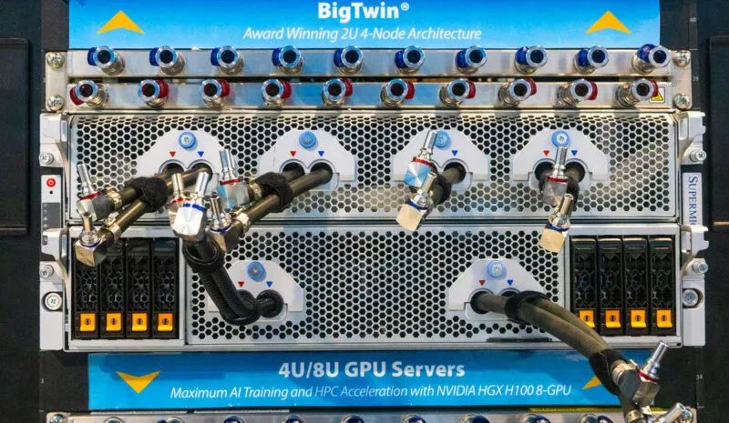

幸运的是，我们有这款服务器原型的图片，因此我们可以向您展示这些系统的内部结构。除了使用定制 Supermicro 液体冷却块的 8 GPU NVIDIA HGX 托盘外，CPU 托盘还展示了为什么这些是业内无与伦比的下一代设计。

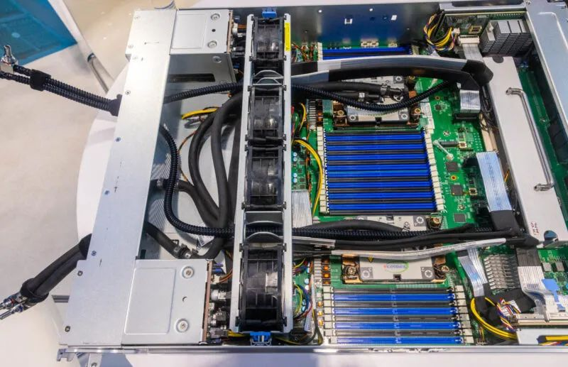

上图 SC23 原型中的两个 x86 CPU 液冷块相当常见。独特之处在于右侧。Supermicro 的主板集成了当今几乎每个 HGX AI 服务器中使用的四个 Broadcom PCIe 交换机，而不是将它们放在单独的主板上。Supermicro 随后有一个定制的液冷块来冷却这四个 PCIe 交换机。业内其他 AI 服务器都是这样构建的，然后在风冷设计中添加液冷。Supermicro 的设计从头到尾都是液冷，而且全部来自同一家供应商。

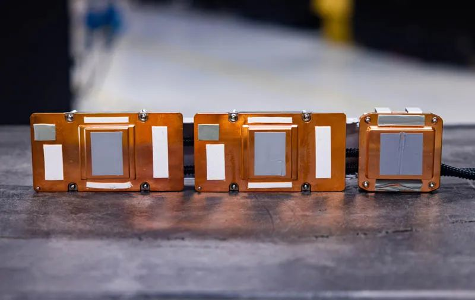

这类似于汽车，有些汽车首先设计为汽油驱动，然后在底盘上安装 EV 动力系统，而 EV 则从一开始就设计为 EV。这款 Supermicro 系统属于后者，而其他 HGX H100 系统属于前者。自推出以来，我们已经亲身体验了大多数公共 HGX H100/H200 平台以及一些超大规模设计。毫无疑问，这款 Supermicro 系统与其他系统之间存在很大差距，包括我们之前评测过的一些 Supermicro 其他可以采用液体或空气冷却的设计。

在机架的后面，我们看到了用于连接 GPU 和 CPU 的 400GbE 光纤，以及用于管理网络的铜线。这些 NIC 也位于自己的托盘上，无需拆卸机箱即可轻松更换，但它们位于机箱的后面。每台服务器有四个电源，它们也是热插拔的，并通过三相 PDU 供电。

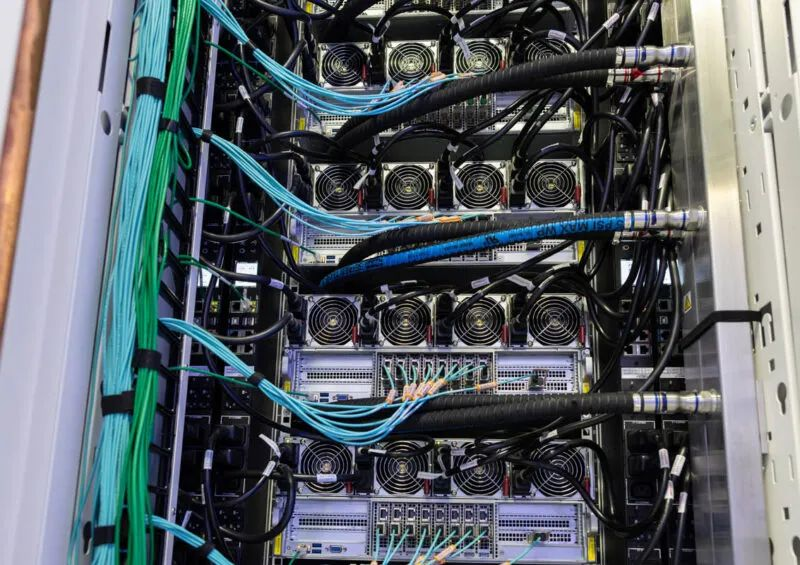

在机架底部，我们有 CDU 或冷却液分配单元。这些 CDU 就像巨型热交换器。在每个机架中，都有一个流体回路，为所有 GPU 服务器提供流体。我们在这里说的是流体，而不是水，因为通常这些回路需要根据液体冷却块、管道、歧管等中的材料调整流体。

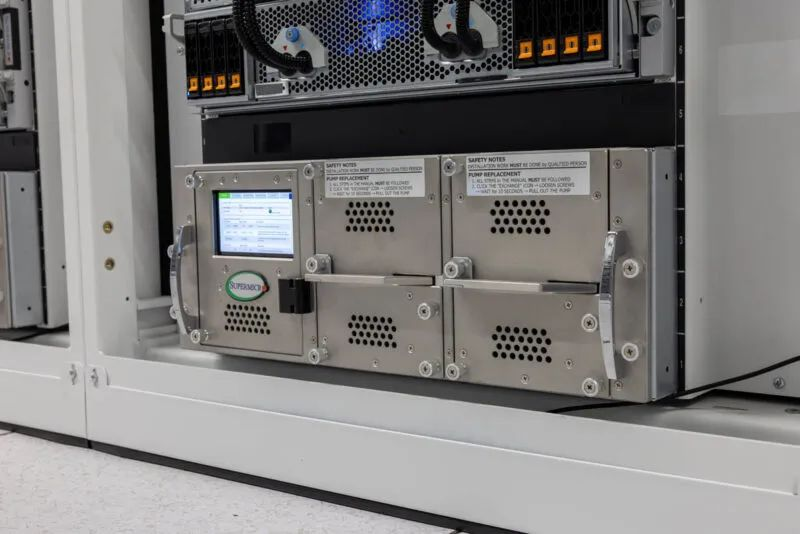

每个 CDU 都有冗余泵和电源，因此如果其中一个发生故障，可以在现场更换，而无需关闭整个机架。由于我之前曾更换过其中一个泵，所以我考虑在 Colossus 更换。后来我想这可能不是最明智的想法。

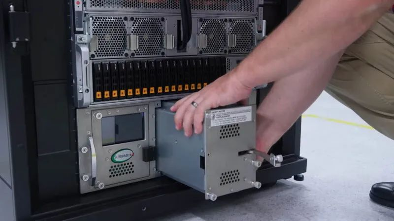

xAI 机架有很多事情要做，但在拍摄 2023 年的作品时，我们更清楚地拍摄了 Supermicro CDU。在这里，您可以看到设施水和机架歧管的输入和输出。您还可以看到每个 CDU 的热插拔冗余电源。

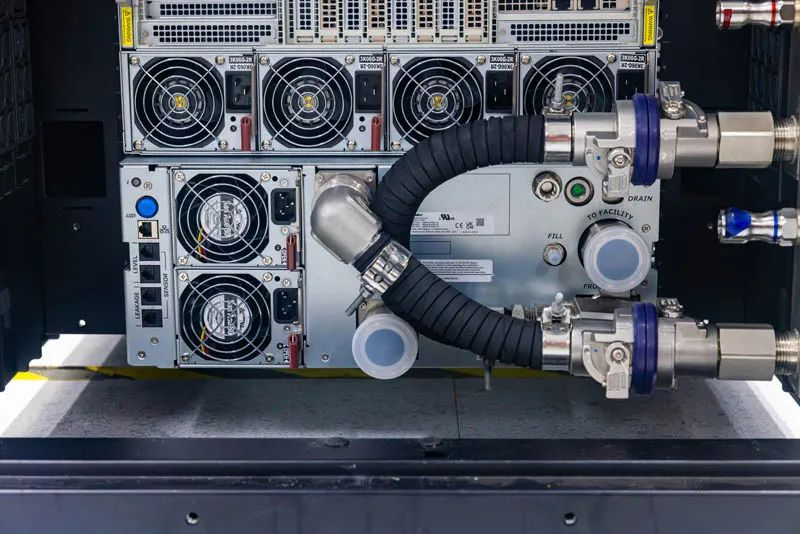

这是 Colossus 机架中的 CDU，被各种管子和电缆隐藏着。

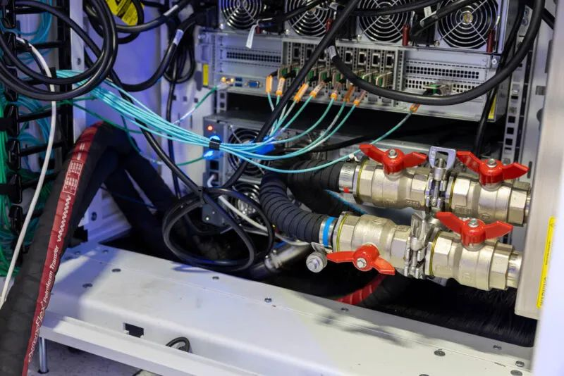

在 Colossus 机架的两侧，我们都有三相 PDU 以及机架歧管。每个前置 1U 歧管为 4U 通用 GPU 系统供电，而这些歧管又由连接到 CDU 的机架歧管供电。所有这些组件都标有红色和蓝色配件。幸运的是，这是一种熟悉的颜色编码方案，红色代表暖色，蓝色代表环路的较冷部分。

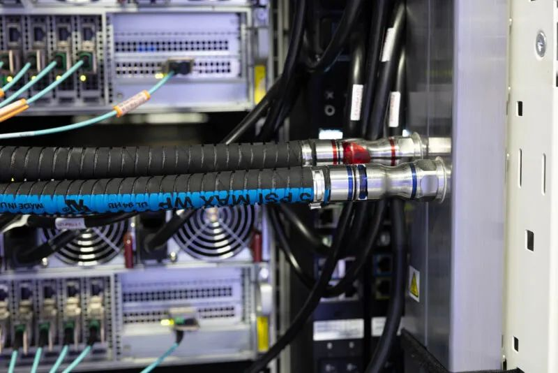

您可能已经从这些照片中注意到，这里仍然有风扇。许多液冷服务器都使用风扇来冷却 DIMM、电源、低功耗基板管理控制器、NIC 等组件。在 Colossus，每个机架都需要与数据大厅保持中性冷却，以避免安装大型空气处理器。服务器中的风扇从机架前部抽取较冷的空气，并在服务器后部排出空气。从那里，空气通过后门热交换器被抽出。

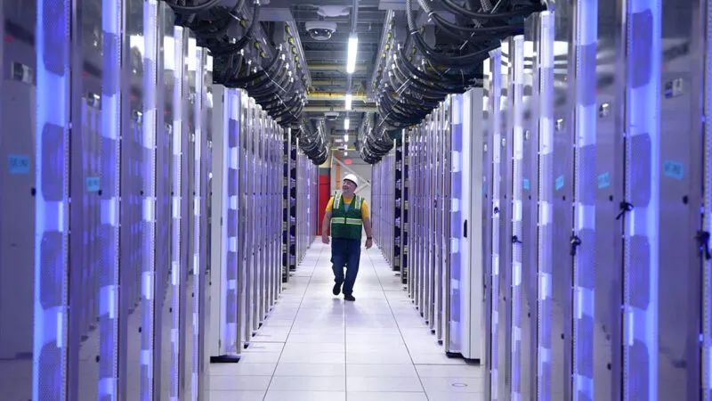

虽然后门热交换器听起来很花哨，但它们与汽车中的散热器非常相似。它们从机架中吸收废气，并将其通过带翅片的热交换器/散热器。就像服务器一样，该热交换器中也有液体流动，然后热量可以交换到设施水环路。空气通过设备背面的风扇被吸入。与大多数汽车散热器不同，这些散热器有一个非常巧妙的技巧。在正常运行时，它们会亮起蓝灯。它们也可以亮起其他颜色的光，比如如果出现需要维修的问题，则会亮起红灯。当我参观正在施工的现场时，我当然没有打开其中几个机架，但看到这些热交换器在打开时随着机架上线而改变颜色，真是令人赏心悦目。

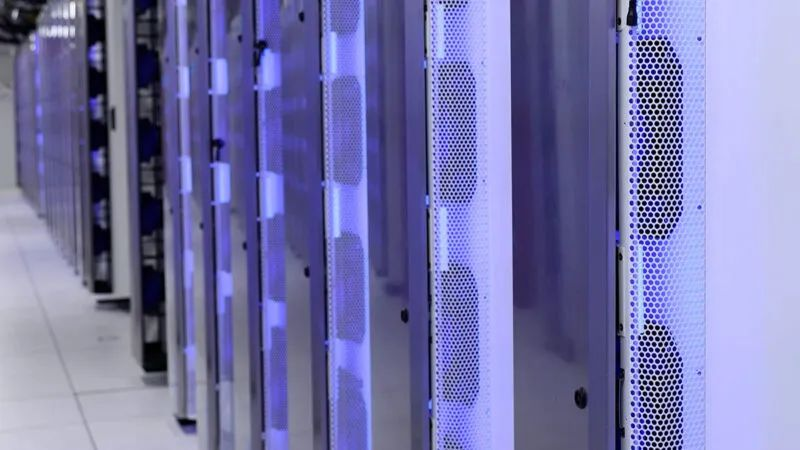

这些后门热交换器在数据大厅中还有另一个重要的设计用途。它们不仅可以消除 Supermicro 液冷 GPU 服务器产生的各种热量，还可以消除存储、CPU 计算集群和网络组件产生的热量。

这个急群众，存储也确实很有趣。

在 AI 集群中，您通常会看到大型存储阵列。在这里，我们运行着来自不同供应商的存储软件，但我们看到的几乎每个存储服务器也都是 Supermicro 的。这并不奇怪。Supermicro 是许多存储供应商的 OEM。

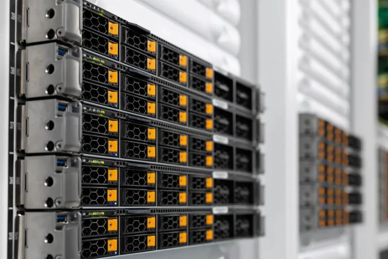

我们参观该设施时发现的一个非常有趣的现象是，一些存储服务器看起来与 CPU 计算服务器非常相似。

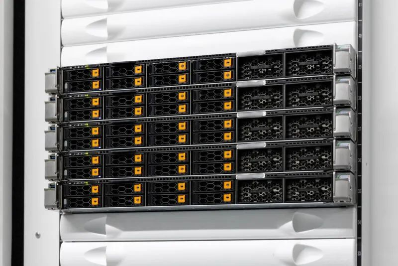

无论如何，在我们的照片和视频中，您都会看到很多 2.5 英寸 NVMe 存储托架。我们在 Substack 上介绍过，大型 AI 集群已从基于磁盘的存储转向闪存，因为它可以节省大量电力，同时提供更高的性能和更高的密度。闪存每 PB 的成本可能更高，但在这种规模的集群中，闪存往往在 TCO 方面胜出。

在所有这些集群中，您通常会看到大量传统 CPU 计算节点。处理和数据操作任务在 CPU 上仍然运行良好，而不是在 GPU 上。您可能还希望让 GPU 运行 AI 训练或推理工作负载，而不是其他任务。

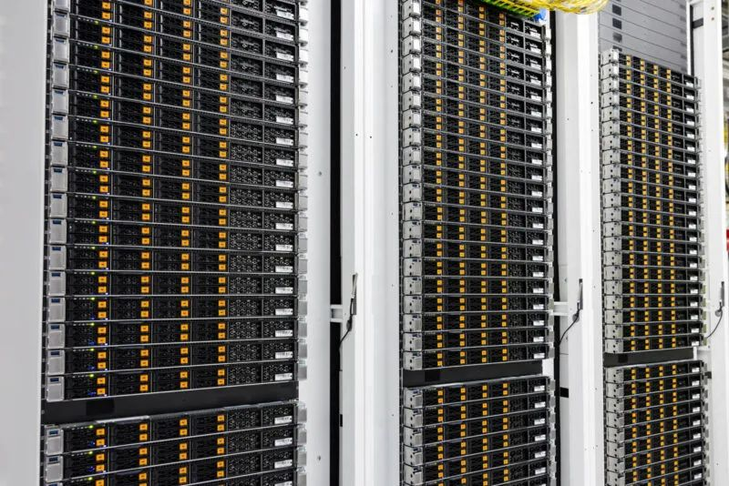

在这里，我们看到了 1U 服务器机架。每台服务器的设计都旨在平衡计算密度和产生的热量。一个很好的例子是，我们可以看到前面有 NVMe 存储托架的橙色标签，但面板的约三分之一专门用于将冷空气吸入系统。

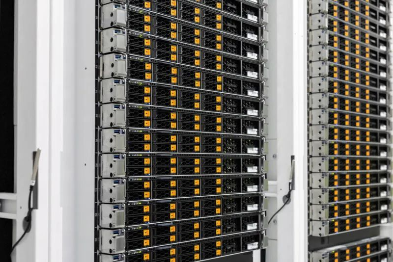

这些 1U 计算服务器可以通过风扇冷却，然后后门热交换器可以去除热量并将其与设施水环路交换。由于数据中心采用后门热交换器设计，xAI 可以处理液冷设备和风冷设备。

网络是该集群其中最吸引人的部分之一。如果您的计算机使用以太网电缆，那么它与此处的网络使用相同的基础技术。不同之处在于，每个光纤连接的速度是 400GbE，比我们在其他地方看到的常见 1GbE 网络快 400 倍。每个系统还有 9 个这样的链接，这意味着我们每个 GPU 计算服务器的带宽约为 3.6Tbps。

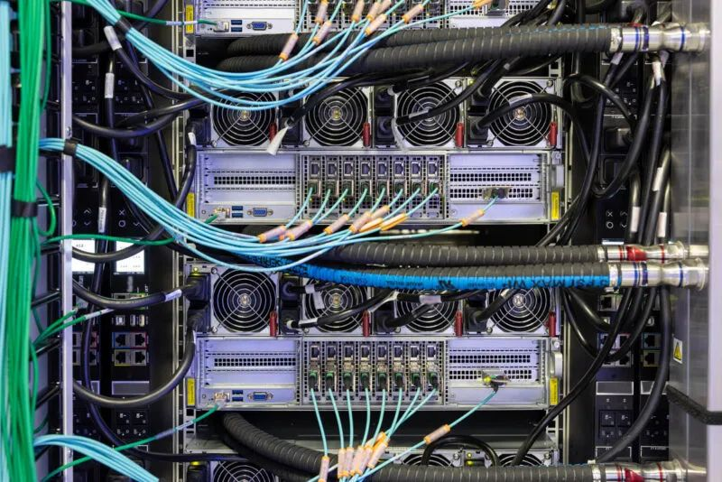

GPU 的 RDMA 网络占了该带宽的大部分。每个 GPU 都有自己的 NIC。在这里，xAI 使用 NVIDIA BlueField-3 SuperNIC 和 Spectrum-X 网络。NVIDIA 在其网络堆栈中有一些特殊的功能，可帮助确保正确的数据到达正确的位置，从而绕过集群中的瓶颈。

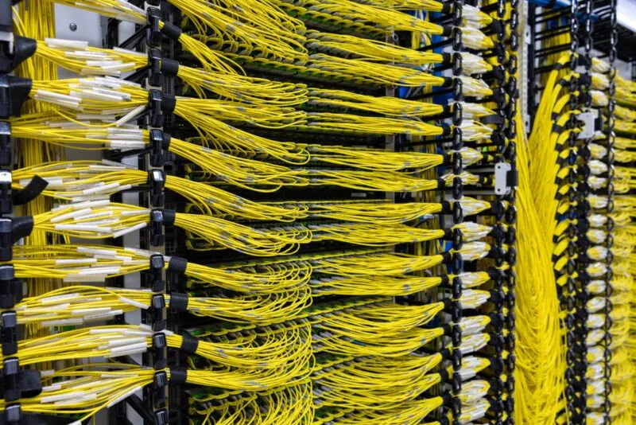

这是一件大事。许多超级计算机网络使用 InfiniBand 或其他技术，但这是以太网。以太网意味着它可以扩展。在 STH 上阅读本文的每个人都会在某个时候通过以太网传输页面。以太网是互联网的骨干。因此，它是一种可扩展性极强的技术。这些庞大的 AI 集群正在扩展到一些更奇特的技术在规模方面尚未触及的程度。这是 xAI 团队的一次非常大胆的举动。

除了 GPU RDMA 网络之外，CPU 还可以获得 400GbE 连接，它使用完全不同的交换结构。xAI 为其 GPU 运行一个网络，为集群的其余部分运行一个网络，这是高性能计算集群中非常常见的设计点。

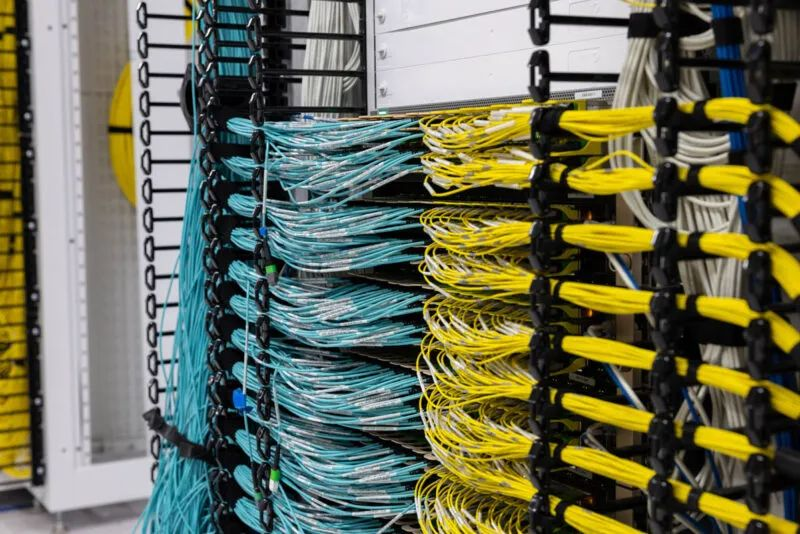

为了让大家了解 400GbE 的速度有多快，它比 2021 年初顶级 Intel Xeon 服务器处理器在其所有 PCIe 通道上处理的连接数还要多。这里每台服务器使用了九次这种级别的网络。

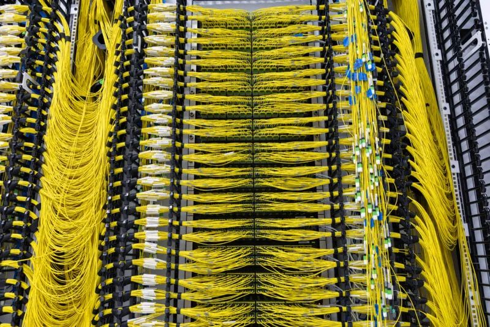

所有这些网络意味着我们拥有大量的光纤线路。每条光纤线路都经过切割和端接，长度正确，并贴上标签。

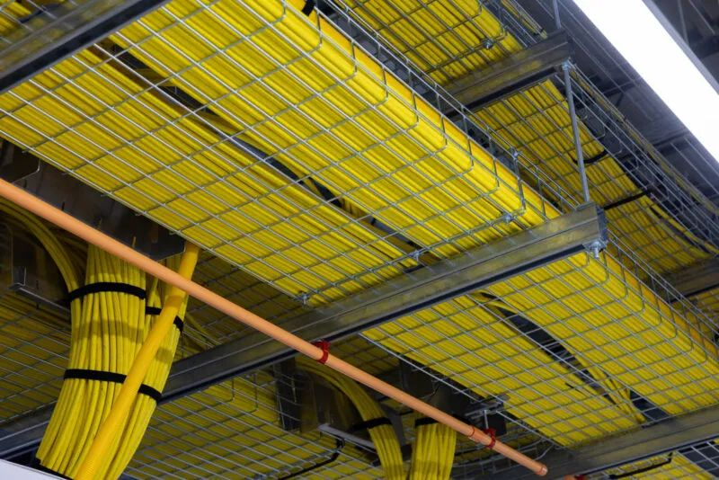

除了高速集群网络之外，还有低速网络，用于任何此类集群的各种管理接口和环境设备。

参观该设施时，可以明显看出液冷网络交换机是急需的。我们最近评测了一款 64 端口 800GbE 交换机，与许多 AI 集群中使用的交换机属于 51.2T 级别。业界需要解决的问题不仅是冷却交换机芯片，还有光学器件，因为现代交换机的功耗可能比交换机芯片高得多。也许像这样的大型安装可能会推动行业转向共封装光学器件，这样交换机的冷却就可以跟随计算到液体冷却。我们之前已经看过液冷共封装光学交换机演示，所以希望这次安装能帮助它们在未来从原型走向生产。

由于我们拥有液冷式 AI 服务器机架，因此电源和设施用水对于安装至关重要。下面是巨大的水管。有一组冷水和热水。冷水被带入设施并在每个机架的 CDU 中循环。热量从 GPU 和后门热交换器回路传递到 CDU 的设施水回路。然后，热水被带到设施外的冷却器中。当然，冷却器不是那种可以制作冰块的冷却器。相反，目标只是将水温降低到足够低，以便冷却到足以再次通过设施循环。

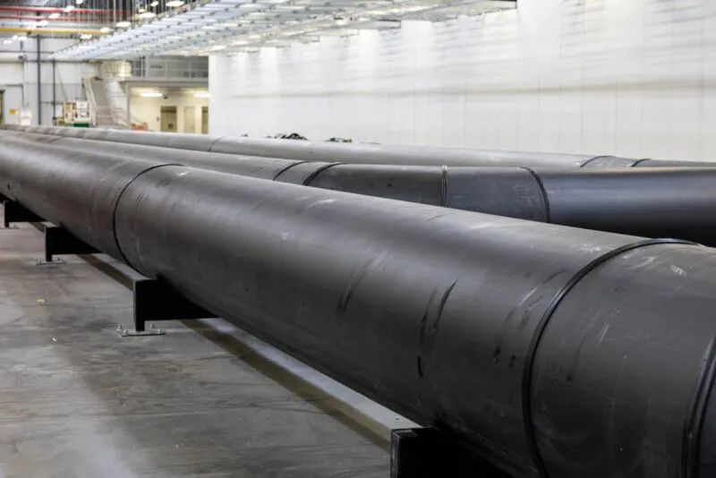

电力令人着迷。当我们在孟菲斯建设该系统时，我们看到团队正在将巨大的电力电缆移到位。

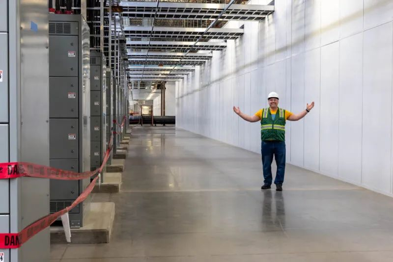

在设施外面，我们看到了装有 Tesla Megapacks 的集装箱。这是团队在构建这个巨型集群时真正学到的要点之一。AI 服务器并非 24×7 全天候以 100% 额定功耗运行。相反，它们的功耗有很多高峰和低谷。由于现场有如此多的 GPU，随着工作负载转移到 GPU，然后整理结果并分派新作业，功耗会波动。团队发现，毫秒级的功率峰值和下降已经足够让人紧张，因此将 Tesla Megapacks 放在中间以帮助缓冲这些功率峰值有助于使整个安装更加可靠。

当然，该设施才刚刚起步。我们参观时，四个 25,000 GPU 数据大厅的初始集群已启动并运行，可容纳约 100,000 个 GPU，但集群扩展工作正在迅速推进。

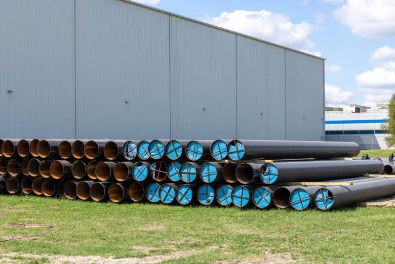

这似乎是一件真正令人敬畏的事情的开始。

在做这件事时，我学到的一个关键主题是，xAI 团队需要更多时间来处理供应商之间的细微分歧。实现这一目标的唯一方法是，大量专家齐心协力构建系统，并以前所未有的速度构建一个巨大的 AI 集群

与此同时，英伟达发布了一个新闻稿，透露xAI团队正在打造拥有20万GPU的超算集群。

NVIDIA 以太网网络加速由 xAI 打造的全球最大 AI 超级计算机

NVIDIA 今天宣布，位于田纳西州孟菲斯的 xAI 的 Colossus 超级计算机集群由 100,000 个 NVIDIA Hopper GPU 组成，该集群通过使用 NVIDIA Spectrum-X ™ 以太网网络平台实现了这一大规模，该平台旨在为使用基于标准的以太网的多租户、超大规模 AI 工厂提供卓越的性能，用于其远程直接内存访问 (RDMA) 网络。

Colossus 是世界上最大的人工智能超级计算机，用于训练 xAI 的 Grok 系列大型语言模型，并为 X Premium 用户提供聊天机器人功能。xAI 正在将 Colossus 的规模扩大一倍，总共配备 200,000 个NVIDIA Hopper GPU。

xAI 和 NVIDIA 仅用 122 天就建造了配套设施和最先进的超级计算机，而这种规模的系统通常需要数月甚至数年的时间。从第一个机架滚到地面到训练开始，一共花了 19 天。

在训练超大型 Grok 模型时，Colossus 实现了前所未有的网络性能。在网络结构的所有三个层级中，系统均未出现因流量冲突导致的应用程序延迟降低或数据包丢失。借助 Spectrum-X 拥塞控制，它保持了 95% 的数据吞吐量。

标准以太网无法大规模实现这种级别的性能，因为标准以太网会产生数千次流冲突，而数据吞吐量却仅为 60%。

NVIDIA 网络高级副总裁 Gilad Shainer 表示：“AI 正变得至关重要，需要提高性能、安全性、可扩展性和成本效益。NVIDIA Spectrum-X 以太网网络平台旨在为 xAI 等创新者提供更快的 AI 工作负载处理、分析和执行速度，从而加快 AI 解决方案的开发、部署和上市时间。”

“Colossus 是世界上最强大的训练系统，”埃隆·马斯克在X上表示。“xAI 团队、NVIDIA 以及我们的众多合作伙伴/供应商都做得很好。”

xAI 发言人表示：“xAI 已经打造出全球最大、性能最强的超级计算机。NVIDIA 的 Hopper GPU 和 Spectrum-X 使我们能够大规模突破 AI 模型训练的界限，打造基于以太网标准的超加速、优化 AI 工厂。”

Spectrum-X 平台的核心是Spectrum SN5600 以太网交换机，它支持高达 800Gb/s 的端口速度，并基于 Spectrum-4 交换机 ASIC。xAI 选择将 Spectrum-X SN5600 交换机与NVIDIA BlueField-3 ® SuperNIC配对，以实现前所未有的性能。

Spectrum-X AI 以太网网络具有先进的功能，可提供高效、可扩展的带宽，具有低延迟和短尾延迟，而这些功能以前是 InfiniBand 独有的。这些功能包括采用 NVIDIA Direct Data Placement 技术的自适应路由、拥塞控制以及增强的 AI 结构可视性和性能隔离 - 这些都是多租户生成 AI 云和大型企业环境的关键要求。

**原文链接**

https://www.servethehome.com/inside-100000-nvidia-gpu-xai-colossus-cluster-supermicro-helped-build-for-elon-musk/4/

https://nvidianews.nvidia.com/news/spectrum-x-ethernet-networking-xai-colossus