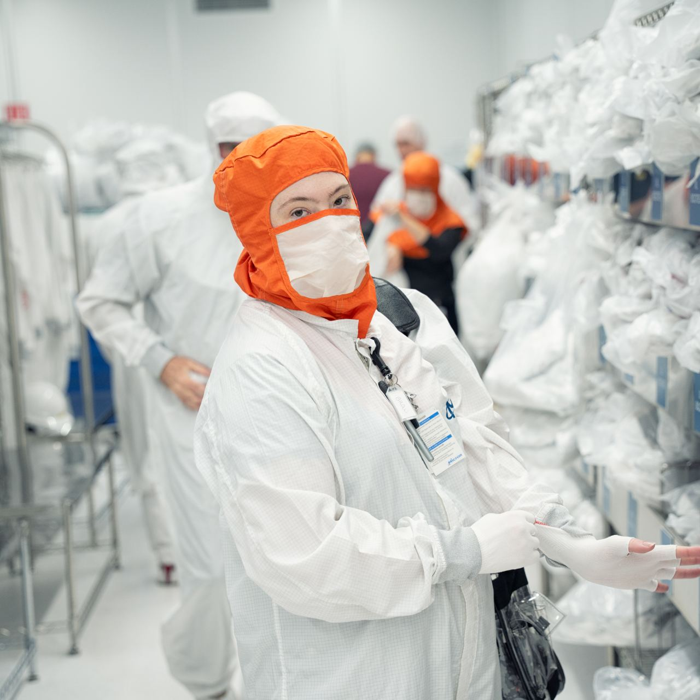

# 揭秘世界上最不可或缺的机器——以及维持它运转的这位女性 – Telegraph
[揭秘世界上最不可或缺的机器——以及维持它运转的这位女性 – Telegraph](https://telegra.ph/%E6%8F%AD%E7%A7%98%E4%B8%96%E7%95%8C%E4%B8%8A%E6%9C%80%E4%B8%8D%E5%8F%AF%E6%88%96%E7%BC%BA%E7%9A%84%E6%9C%BA%E5%99%A8%E4%BB%A5%E5%8F%8A%E7%BB%B4%E6%8C%81%E5%AE%83%E8%BF%90%E8%BD%AC%E7%9A%84%E8%BF%99%E4%BD%8D%E5%A5%B3%E6%80%A7-02-04) 

   

阿斯麦的工程师布里安娜·霍尔在一家芯片工厂准备上班。

[cn.wsj.com](https://cn.wsj.com/articles/%E6%8F%AD%E7%A7%98%E4%B8%96%E7%95%8C%E4%B8%8A%E6%9C%80%E4%B8%8D%E5%8F%AF%E6%88%96%E7%BC%BA%E7%9A%84%E6%9C%BA%E5%99%A8-%E4%BB%A5%E5%8F%8A%E7%BB%B4%E6%8C%81%E5%AE%83%E8%BF%90%E8%BD%AC%E7%9A%84%E8%BF%99%E4%BD%8D%E5%A5%B3%E6%80%A7-eb023b9c?mod=trending_now_news_5)

Ben Cohen | 摄影：Todd Meier for WSJ

5 - 6 minutes

* * *

布里安娜·霍尔(Brienna Hall)在一家你可能没听说过的绝顶重要的公司从事着最有价值的工作。

这家公司叫阿斯麦(ASML)。她从去年开始进入阿斯麦工作，在此之前对该公司一无所知。她也不知道自己作为客户支持工程师究竟要做什么工作——她管自己叫“炫酷的机械师”。

她完全没有想到，这份工作会在全球经济中发挥至关重要的作用。

当霍尔去芯片制造厂值班时，会先套上无尘服。她走进一个房间，房间里的空气极其纯净，比医院手术室的空气还要洁净100倍。然后，她会走到一台无比复杂的机器旁边。

她的工作是了解这台机器的方方面面——好让她能够进行维修。

“我觉得自己有一份史上最酷的工作，”霍尔说。“但我没有意识到，整个世界能够变成今天这样，与这份工作密不可分。”

这台全世界都依赖的设备叫“极紫外线光刻机”，她接受过专门培训，知道该如何驾驭这台机器。

这台机器可以生产出地球上最先进的芯片。制造这台机器所采用的科学技术听起来就像来自科幻小说——这些突破太过神奇，一度被视为天马行空的臆想。不起眼的硅片由此华丽变身为现代生活的引擎。

即使在今天，全世界也只有几百台这种极紫外线光刻机——而且价格贵得出奇。霍尔负责维护的这台设备价值1.7亿美元，而最新型号的设备售价约为3.7亿美元。

但这些天价机器最引人注目的地方可能是，它们都由同一家公司制造，这家公司便是阿斯麦。

阿斯麦就像是把芯片业粘合在一起的胶水。这是因为，这家荷兰公司负责所有的极紫外线光刻系统，这些系统生产出的芯片用于许许多多的设备，比如你的手机，你的电脑，你的平板电脑，你的电视，甚至可能还有你的汽车。

这些机器已经变得不可或缺，而它们的正常运转依赖布里安娜·霍尔那些幕后工作。

她是一名被派到阿斯麦客户的半导体制造工厂工作的工程师。霍尔的工作地点在博伊西的美光科技(Micron Technology)总部。我套上自己的无尘服，跟着她走进了芯片制造工厂。

然后，我利用这个千载难逢的宝贵机会，从幕后窥视了这台兴许是有史以来最重要的机器。

### 走向极致

极紫外线光刻机可谓人间奇迹。

它们的故事可以追溯到40年前，追溯到诞生在荷兰一个漏雨小棚子里的公司。这家公司名为先进半导体材料光刻技术公司(Advanced Semiconductor Materials Lithography)——现在仅使用缩写ASML。当时，用极紫外光来打印芯片还是一个天马行空的想法。要将其变为现实，所需的时间和金钱远远超出对这项神奇技术抱有憧憬的梦想家的预期。

这一过程包括让熔融的锡液滴蒸发，产生地球上无法自然产生的光线。

至少，这是理解极紫外线光刻技术这门极其复杂的科学的最浅显易懂的方法。

液滴被每秒发生50,000次爆破的激光双脉冲击碎。第一个脉冲使液滴变平。第二个脉冲让液滴彻底消失，变成发出极紫外光的离子体。随后，这些光被迄今为止发明的最平滑的反射镜收集起来，反射到硅晶片上，蚀刻出数十亿个微小的晶体管图样。

如何在芯片上置入越来越多的晶体管，使芯片速度越来越快，这是事关半导体行业命运的关键问题。答案是：让光的波长越来越短。阿斯麦的首批光刻工具可产生波长为436纳米的光。最新的机器已将波长缩短到13.5纳米。这样一来，它们就能制造出精度比人的头发丝还要细一万倍的芯片。

我对极紫外光刻技术了解得越多，就越觉得这项技术非同凡响。

我了解到我所见到的极紫外线工具的种种细节，其中有两处令我最为难忘：

这些异常复杂的机器从实验室步入制造厂，花费了长达几十年的时间。直到最近，人们还不确定该公司在极紫外线光刻领域的大胆下注能否获得回报。2012年，阿斯麦遇到资金短缺问题，向英特尔(Intel)、三星电子(Samsung Electronics)和台湾积体电路制造股份有限公司(Taiwan Semiconductor Manufacturing, 简称台积电)出售了23%的股权，这意味着，阿斯麦最大的几家客户为该公司的成功投下了真金白银。

阿斯麦很快就加快了生产进度，不过是龟速。该公司在2010年时就交付了第一套极紫外线光刻系统。 直到2020年，该公司才交付了第100套系统。去年是繁忙的一年：阿斯麦总共交付了42台极紫外线光刻机。

目前还只有六家公司拥有这些芯片制造设备。但许多其他公司间接依赖阿斯麦——其中包括有史以来价值最高的公司。

苹果(Apple)和英伟达(Nvidia)都自己设计芯片，并将生产外包给台积电的芯片厂，这意味着，从建设人工智能数据中心到制造iPhone，一切都要依靠阿斯麦的技术。

极紫外线光刻机已经变得至关重要，该公司现在有一支由1万名员工组成的客户支持大军，以保障机器的正常运转。

“他们是阿斯麦的前线部队，”该公司首席客户官吉姆·库门(Jim Koonmen)说。

阿斯麦的客户希望他们的光刻机日夜不停运转，但正如荷兰记者马克·希金克(Marc Hijink)在讲述该公司的《专注》(Focus)一书中所写的那样，干扰不可避免，也无法预测。

台积电担心地震。英特尔曾将光刻机出故障的原因归咎于另一种轰隆作响的事物——风向发生变化，带来附近奶牛场的甲烷气体。

“奶牛放屁，”希金克写道。

撇开奶牛排气带来的意外不谈，这些机器其实很少发生故障。但极紫外线光刻机是每一家工厂的瓶颈。如果它发生故障，整个工厂都会陷入瘫痪——因此，阿斯麦会聘用员工在世界各地全天候值班。

布里安娜·霍尔便是其中一员。

### 炫酷机械师的养成

早在她听说阿斯麦之前，就有迹象表明她很适合这份工作。

现年29岁的霍尔在西雅图长大，是一个痴迷于打出完美绳结的女童军。她在埃德蒙兹学院(Edmonds College)获得副学士学位，是该校火箭俱乐部部长。在华盛顿州立大学(Washington State University)，她主修材料科学与工程——并帮助一位写量子力学教科书的教授整理过笔记。她爱策划露营旅行，虽然她其实并不喜欢露营。业余时间，她会做手工，喜欢绗缝，还喜欢拼复杂的Ravensburger拼图。

这一切为她驾驭一台拥有10万多个零件的机器奠定了良好的基础。

“你总在解决问题，”阿斯麦的另一位工程师亚历克斯·乔丹(Alex Jordan)说。 “怎样才能提高效率？哪些地方可以优化？是否可以作出某种尝试？”

阿斯麦的客户支持岗位需要招聘认真、严谨、注重细节的工程师。霍尔拥有适合这份工作的技术头脑和特质。霍尔的一位教授听说一家半导体公司正在招聘，她请教授转递了一份自己的简历，很快收到阿斯麦发来的电子邮件，请她去应聘。

大多数大学生对阿斯麦(ASML)一无所知。事实上，他们对ASMR（译者注：自发性知觉经络反应，俗称颅内高潮）了解得可能更多一些。

当面试官问她能否适应在狭小的空间内身着无尘服工作时，她顿时产生了兴趣。然后，她发现这份入门级工作要求经常出差。只这一点，便足以让她接受阿斯麦的工作邀请。“我一直想去旅行，”她说，“我连西海岸都没怎么去过。”

她的第一次长途旅行是去台湾，她在台湾待了一个月，在阿斯麦的培训中心参加“Fab Ready 1”课程，熟悉极紫外线光刻机的各个部件：扫描仪（带有镜子的部件，这些镜子将光线聚焦到硅晶片上）、光源（产生光线的部件），还有驱动激光器（带有激光器的部件）。

她还了解到，每个部件都有自己的拟人化称谓。在美光的芯片工厂，扫描仪被称作“莫妮卡”——出自《老友记》(Friends)中的角色。

“因为一切都必须完美无缺，”霍尔说。“条件必须恰到好处，她才能正常工作。”

她回到博伊西接受在职培训时了解了“莫妮卡”的性情。此外，她还在台湾、圣地亚哥和德国（去德国的时候，她前往拼图圣地拉芬斯堡朝圣）参加了为期数月的“Fab Ready 2”课程，以发展专业技能。

她当了将近一整年的学徒，才获准独自从事极紫外线光刻机的维护工作。霍尔不在各大洲跑的时候，就在距离美光公司园区不远的阿斯麦办事处工作。她的工作是12小时轮班制，从早晨6点到晚上6点。在冬季，她不等天亮就上班，下班时早已天黑。

有时候，她会直接去工厂。另一些时候，她坐在办公桌前，看着多台屏幕上的数字，直到“我确定机器不会自燃，”她说。到这个时候，霍尔开始把注意力转向她打算在“计划内停机”期间执行的一系列操作。“计划内停机”是例行的停机预防性维护，目的在于尽可能降低“计划外停机”的风险。

毕竟，比修理机器更令人满意的事情莫过于拥有一台不需要修理的机器。

但她认为，跟机器打交道的任何工作都很有意思。她觉得，与人打交道让她很有压力。

“我们的机器很复杂，它有自己的个性，但它仍然是一台机器。只要你按对按钮，她就会相应地运转。你只需要弄清楚该按什么按钮。我能解决这个问题。我们可以解决这个问题，”霍尔说。“人比我所了解的任何机器都要复杂得多。”

### 芯片厂的前世今生

近半个世纪前，博伊西的四位创业者在一家牙医诊所的地下室里创立了美光公司，其中一位投资者是当地的土豆大亨。原来，在爱达荷州，甭说薯片(chip)了，就连微型芯片(microchip)都来自土豆。

如今，美光正在这儿建造一座投资150亿美元的工厂，要将尖端内存制造业务带回美国本土。正在建设的工厂有10个足球场那么大。其地基所需的混凝土量相当于帝国大厦的四倍。

美光公司园区的数十台巨型起重机旁边，是该公司已经建成的研发工厂。

工厂内有一台重量超过30万磅的机器，是用三架747货机从荷兰运来的。

布里安娜·霍尔每过几天就会到芯片厂里面看看那台极紫外线光刻机。

“没过几天，我就会心痒”，她说，“我会找个理由进去看看。”

于是，我们走了进去。

她每次进入无尘室，都会把自己从头到脚捂得严严实实，因为哪怕是一丁点灰尘都可能带来灾难性后果。她还确保自己不用上厕所。“我会有意识地少喝水——我也不喝咖啡，”她说。

这里灯光昏黄，又热又吵，让人有种手足无措的感觉。但对她来说并非如此。她在芯片厂里面如鱼得水。

霍尔讲起如何排除极紫外线光刻机的故障，就像篮球健将斯蒂芬·库里(Stephen Curry)谈论投篮一样兴奋。

“当我排除设备故障时，就好像周遭的一切都安静了下来——我只专注于完成这一件事，”她说。“没有什么比专注于解决这个问题更好的了。”

我们进入工厂底层时，这台机器已经退出了生产状态。

我们有两个小时——时间很紧张。

她瞥了一眼笔记本电脑，查看了这项服务计划的细节。然后，我们穿过迷宫般的厂房，直到霍尔停下脚步，移开一个柜子的门，钻到机器里面。当她在狭小的空间里摆弄纠缠不清的电缆时，我环顾四周，发现到处都是红色的紧急按钮。还没等我担心会不会撞上，霍尔就钻了出来。

“有一根水管没能正常工作，”她肯定地说。

水道堵塞意味着水管无法正常冷却——现在，水管出现了发热问题。当霍尔触摸软管时，能感觉到轻微的变形。这有可能成为一个大问题。即使是这种几乎察觉不到的变形也有可能造成水管破裂，进而导致整台机器瘫痪。水管破裂会激活泄漏传感器，使机器立即停机——相当于按下一个红色紧急按钮。

阿斯麦的工程师其实知道这个电路承受着压力，他们已经制定了一个计划，打算在下一次计划内停机时解决这个问题。不过还得等上三周时间。

他们可以等到那个时候。或者，她可以现在就解决问题。

霍尔向美光的一位管理人员说明了情况，他授权她当场进行维修。

于是，她找了两个家得宝(Home Depot)的水桶。

要修好一台售价数亿美元的机器，她需要先找到五金店那种售价3.98美元的橙色水桶。为了避免更换软管时水四处喷溅，霍尔先把水管里的水放干，直到两个桶差不多都接满为止。她小心翼翼地更换了特氟龙软管，装上用于监控的热传感器，然后关上身后的门。

现在该让机器继续工作了。

“从工程学的角度来看，这有点枯燥，”霍尔说。“但看到我的机器正常运转，为我们的客户生产芯片，我产生了一种自豪感。”

她完全按照自己应该遵循的方式，完成了自己应该做的事情。

这里发生的一切，外人永远不会知道。

频道推荐：[经济学人中文版](https://t.me/econo202)