Title: 新一代超级计算框架Ray在微信AI计算中的大规模实践

URL Source: https://mp.weixin.qq.com/s/RUp12f-5ErI9QX2RwitMEg

Markdown Content:


作者：微信Astra团队

### 一、背景

微信存在大量AI计算的应用场景，主要分为三种：流量分发、产品运营和内容创作。流量分发场景中的 AI 计算主要用于搜索、广告、推荐场景的核心特征生产，产品运营相关的 AI 计算主要用于产品功能相关和内容运营相关（低质、优质、生态建设），由于大模型的兴起，AIGC 相关的文生图、图生图、AI 特效等内容创作场景的 AI 计算也有了较多的落地。目前AI 计算几乎覆盖了微信的所有业务场景。

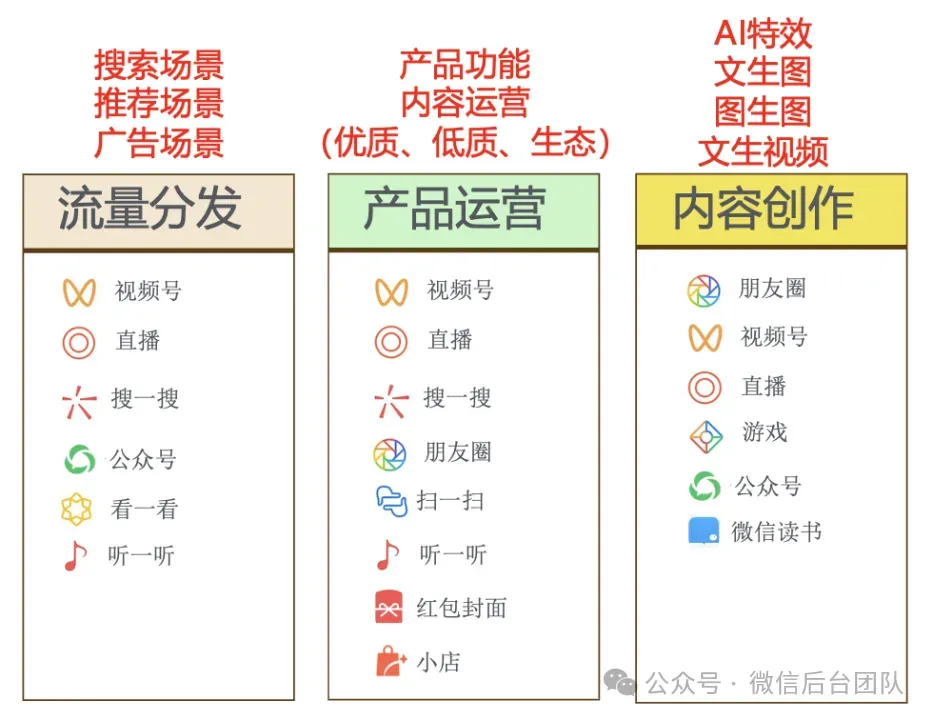

图 1：微信内 AI 计算应用场景

然而，我们在使用微信已有的后台基础设施实现AI应用时遇到各种问题。在资源层面，AI应用属于计算密集型，计算复杂度高，需要大量资源，直接使用在线资源会导致成本过高；在部署层面，微信后台常见的部署平台更适合部署I/O密集、高并发、高请求量的微服务，而AI应用则需要适配大量异构硬件和异构资源平台，部署复杂度呈指数级上升；在应用编排层面，直接通过消息队列等基础组件解决复杂特征依赖及相关异步过程，开发效率低，变更风险高，可观测性差；在平台层面，由于缺乏平台支撑，算法迭代速度慢，模型能力使用门槛高。因此，微信亟需一个低成本、高效率、低门槛的AI计算平台来解决上述问题。

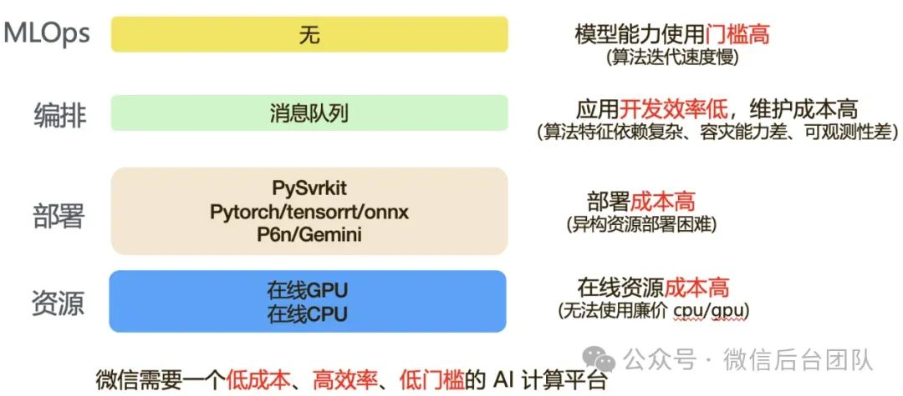

图 2：微信内原有基础设施

比如，OCR作为视频号推荐和视频号搜索依赖的一个重要特征，计算量非常大，需要超过100 万核的CPU计算资源，同时对实时性和可靠性的要求很高，需要在 1 分钟内完成特征生成。P6n平台适合做高实时(毫秒级响应)的在线任务，实时性上可以满足需求，但固定部署的资源成本较高，多模型部署复杂度高，不符合需求。Gemini 平台更适合做大规模长时间的离线任务，在实时性和可靠性上不满足需求。我们需要一个高实时（10 秒级响应），支持大规模异构资源部署，低成本和高可靠的近线任务平台。

### 二、为何在AI计算中引入Ray？


图 3：使用 Ray 构建 AI 计算的企业\[1\]

Ray是一个通用的分布式计算引擎，2016年开源于加州大学伯克利分校 RISELab，是发展最快的计算引擎之一。目前已经广泛应用于OpenAI、蚂蚁、字节和华为等公司，是新一代的明星计算框架。

首先，编写分布式计算既简单又直观。开发者不必了解所有通信和调度细节，也不必对此进行推理。借助 Ray 的简单原语，可以将任何 Python 函数或类转换为分布式执行：只需添加一个装饰器，就大功告成了。Ray 的分布式API 很简单，所有复杂性都由 Ray 的执行框架处理。函数将被安排为无状态任务执行，而类将是一个有状态的远程服务。

```
def detect(image_data):    model = load_detect_model()    return model(image_data)def recognize(det_result):    model = load_recognize_model()    return model(det_result)def ocr(image_data):    det_result = detect(image_data)    return recognize(det_result)image_data = load_image_data()ocr_result = ocr(image_data)
```

以上是一个图片ocr本地执行的 python 脚本，如果使用微服务部署，因为模型过大，单机显存不够，无法加载所有模型，则需要部署三个微服务模块：detect、recognize和ocr，应用部署的复杂度较高。

```
@ray.remote(num_gpus=1,num_cpus=16)def detect(image_data):    model = load_detect_model()    return model(image_data)    @ray.remote(num_gpus=2,num_cpus=16)def recognize(detect_result):    model = load_recognize_model()    return model(detect_result)    @ray.remote(num_cpus=4)def ocr(image_data):    det_result = detect.remote(image_data)    return recognize.remote(det_result)image_data = load_image_data()ocr_result = ocr.remote(image_data)
```

如果使用 ray 来做 ocr 推理，只需要添加装饰器@remote，指定模型使用的 cpu 和 gpu 资源数，通过一个python 脚本即可完成ocr应用的部署，效率提升至少一个数量级。

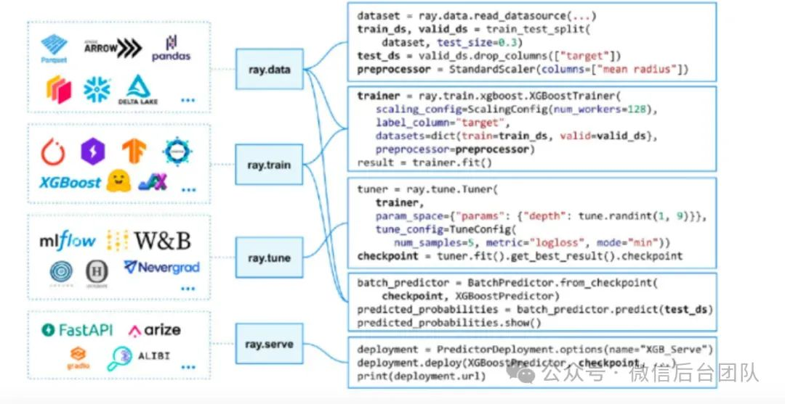

图 4：Ray AIR 如何以简单的方式统一 ML 库\[2\]

其次，大多数流行的 ML 库都与 Ray 有很强的集成性，而且 Ray 的原生库也整合了这些库。例如，开发者可以轻松地将 XGBBoost 与 Ray Train 结合使用，可以轻松地将 HuggingFace 与 Ray Serve 结合使用。或者，可以轻松地将 PyTorch 和 TensorFlow 与 Ray Train 结合使用。简而言之，它拥有丰富的集成生态系统，不仅与 ML 库集成，还与其他工具和框架集成。

第三，开发人员可以使用笔记本电脑进行开发。当你想将其扩展到 Ray 集群时，只需更改一行代码或不更改任何代码即可轻松完成。

```
RAY_ADDRESS=ray://<cluster>:<port> python your_script.py
```

总的来说，Ray提供了高性能的分布式框架和简单的分布式原语，提供了统一的分布式底盘。Ray融合不同计算范式，与众多开源组件便捷地结合从而实现对现有流程的提效。同时，Ray有完善的生态，数据处理、训练、推理和服务等AI基础设施需要的主流框架都可以很方便地在Ray上进行集成，大量知名企业选用 Ray开发 AI 计算。综上，我们选择了Ray 作为微信 AI 计算平台的分布式底座。

### 三、Ray在微信AI计算中的大规模实践

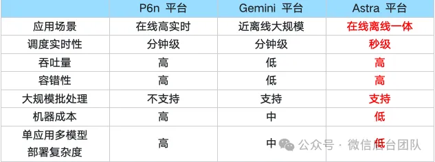

P6n是基于 Kubernetes微服务部署平台，通过自动化编排和弹性扩缩容机制，很好的解决了在线高实时的后台服务运维自动化问题，但不支持大规模的批处理服务，单应用多模型的部署复杂度较高，机器成本较高，不适合“在离线一体”的 AI计算场景。Gemini 是基于 kubernetes 的大数据平台，适合处理离线大规模的数据清洗和模型训练，但是由于调度的实时性不够，不适合高实时性、高吞吐的和高可靠的AI计算场景。Astra 平台要实现高实时、高吞吐、高可靠、低成本的 AI 计算平台，需要解决如下几个核心问题：1.为了低成本，需要支持各种异构资源扩展；2.为了高吞吐，支持超大规模资源调度；3.降低单应用多模型的部署复杂度；

我们基于 Ray 计算底座，解决了上述三个核心问题，构建出适合 AI 计算平台：AstraRay，在微信内进行了大规模 AI 应用部署的实践。AstraRay 相比社区版本Ray(KubeRay) 有以下改进：

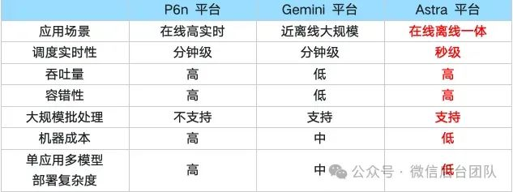

#### 3.1. AstraRay架构

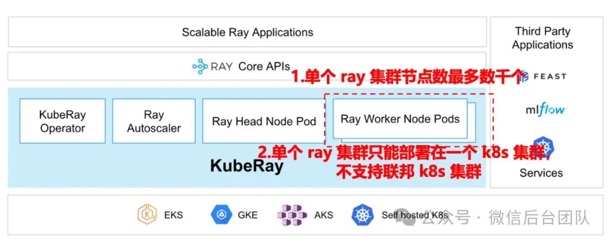

图 5：kuberay 架构\[3\]

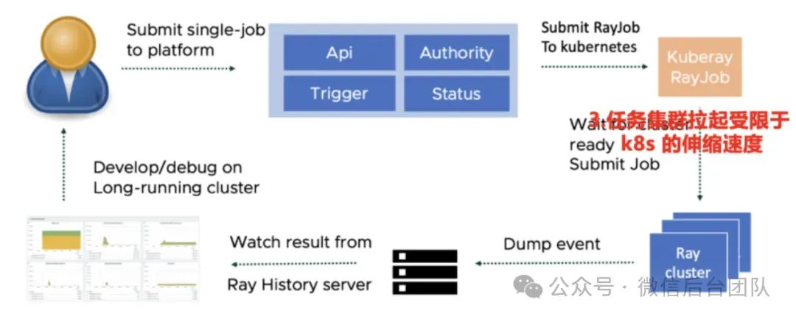

图 6：KubeRay 提交任务流程\[4\]

业界使用社区成熟的 KubeRay 方案，通过 Ray 和 K8s 结合，提供了易用、高可用、高伸缩的云原生 Ray 集群服务，可以满足中小规模 AI 应用的需求。但它有集群规模小（最大仅支持数千个节点），异构资源扩展困难（单个 ray 集群只能部署在一个 k8s 集群，不支持联邦k8s 集群）和伸缩慢（受限于 K8s 的扩缩容速度）的问题，不适合微信内超大规模 AI 应用的需求。

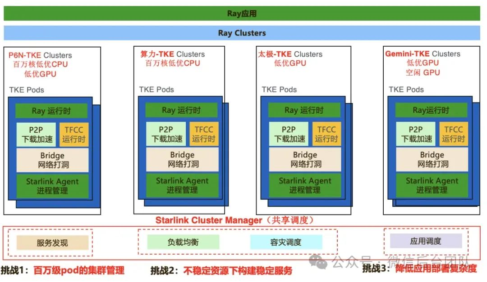

图 7：AstraRay 整体架构

我们在落地 Ray 的过程中遇到了三个核心技术挑战：1.百万级 pod 的集群管理：在视频号业务场景中，有超过百万核的超级应用，已经远超 K8s 集群上限，我们希望单个 Ray 应用能支持百万级别的 pod 的扩展。

2.不稳定资源下构建稳定服务：由于 AI 计算的资源消耗大，为了降低成本，我们大量使用了低成本、闲置，但稳定性差的计算资源。我们希望可以在不稳定资源上提供可靠稳定的服务。

3.降低应用部署的复杂度：微信内 AI 应用遇到模型、硬件、模块三种维度的异构问题，部署复杂度高。我们希望使用统一的应用维度来简化应用部署，即将 O(n^3) 复杂度降低为 O(1)。

Astra 的部署系统架构如上图，在 Poseidon/算力/太极/Gemini 等多个资源平台基础上扩展多个tke模块，组成拥有数百万核CPU、万卡GPU级别的超大集群。我们通过服务发现的架构设计，解决了百万级pod集群管理的问题，通过负载均衡和容灾调度解决了不稳定资源构建稳定服务的挑战，同时通过应用调度解决了多模型应用部署复杂度的问题。接下来详细介绍我们如何应对这三个技术挑战。

#### 3.2. 单集群支持百万级计算节点的挑战

##### 3.2.1 架构选择

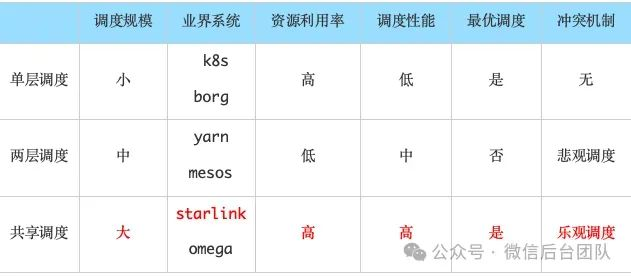

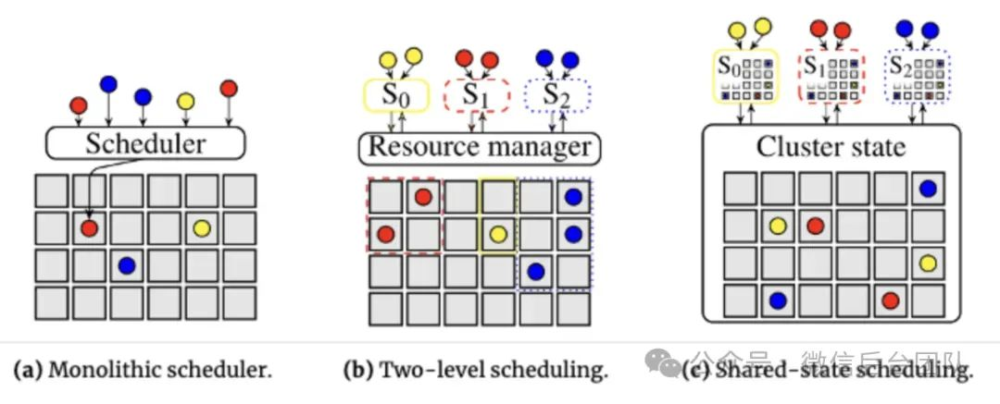

图 8：集群调度架构分类\[5\]

业界系统的调度架构主要分为四类：单体调度、两层调度、共享调度和混合调度。这些调度架构的本质区别其实只有两点：1.调度时调度器是否拥有全局的资源视图；2.不同的应用是否拥有多个资源调度器。

单体调度顾名思义，即只有一个调度器，调度器拥有全局资源视图的架构，Google Borg 和 K8s 都采用这个架构。单体架构的好处是，所有的任务都由唯一的调度器处理，调度器可以充分的考虑全局的资源使用情况，能方便的做出最优调度。但由于调度架构的限制，集群性能受限于单体的性能，无法支撑过大的集群。

两层调度拥有多个调度器，Apache Mesos 和 Hadoop YARN 都采用这个架构。两层调度中，每个应用的调度器首先向中心节点获取资源，再将其分配给应用中的各个任务。两层调度解决了单体调度的性能问题，但是调度器仅拥有局部资源视图，无法做出最优调度。

共享调度拥有多个调度器，每个调度器拥有全局资源视图，Omega 采用了这个架构。共享调度方案中，每个调度器都可以并发地从整个资源池中申请资源，解决了性能问题和最优调度问题，且可以支持较大集群。因此，AstraRay 选择共享调度来支持超大规模的资源管理。调度器间资源申请冲突可通过悲观锁或乐观锁来解决，AstraRay 实现了基于乐观锁的方案，出现冲突后再处理，无需中心节点，并发度更高。

3.2.2 Starlink调度 我们提出了一个新的调度系统 Starlink 来更好适配异构资源和硬件。Starlink采用共享调度架构，通过乐观并发调度处理冲突，支持部署在任何基础资源平台(K8s/Yard/CVM)之上，且允许单个应用运行于多种异构的资源节点上。

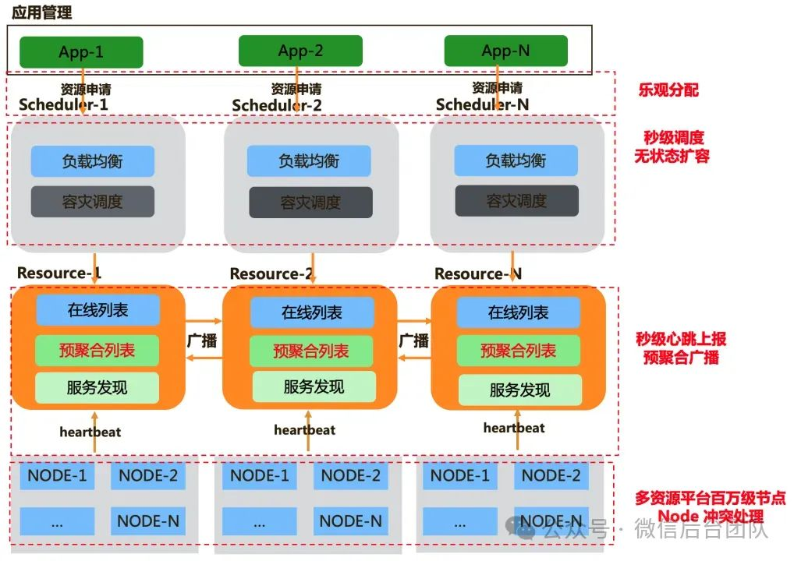

图 9：Starlink 调度架构

Starlink主要分为四个部分：Node：任意部署了 Starlink 的 Agent 节点都可以成为 Node，Node 每秒会向Resource 上报自己的状态，并处理APP部署的任务。

Resource：Resource 从 Node 接收心跳，并预聚合心跳后广播到其他 Resource 节点。Resource 整合所有 Node 组成在线列表，可像无状态服务一样水平扩容。为提供业务间隔离性和降低广播的扇出比，Resource集群数也会扩展。

App：App 是运行在 Starlink 上的应用，每个 App 都拥有独立的资源调度器，这些调度器都从 Resource 获取全局的资源视图，通过乐观并发抢占的方式分配资源。

Scheduler：Scheduler 负责应用的负载均衡和容灾，Scheduler 会根据不同的节点的性能和状态动态的调整节点的权重，并通过带权路由算法来分配请求。

在微信的后台服务中，每个微服务都是独立的模块。而面对超大规模的应用，由于 K8s 自身扩缩容性能的限制，往往需要部署多个模块才能满足一个AI应用，扩缩容速度受限。与K8s 不同的是，Starlink 使用预创建的 Pod，加快了扩缩容的速度，资源迁移变得非常简单。基于良好的设计，Starlink可以支持单应用百万节点，乐观调度也使得调度速度极快，每分钟可完成数万节点的调度。Starlink 还可以跨多个资源平台调度，支持异构机型，不必为每个应用创建多个模块进行部署，大幅提高了内部的资源利用率和资源的周转效率。

#### 3.3. 不稳定资源下构建稳定服务的挑战

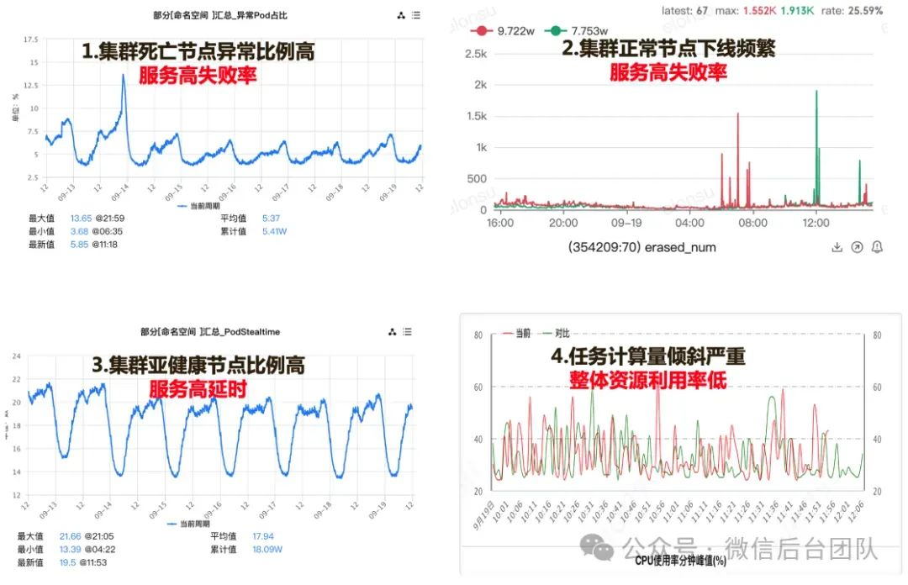

AstraRay 大量接入低价或免费资源，pod 稳定性较差，日常会出现较高的资源驱逐率和亚健康的情况，直接使用会导致服务失败率高、延时高。另外，用传统的调度方法调度 AI 计算任务很容易出现计算倾斜，从而导致整体资源利用率低。我们通过更快的容灾调度解决服务失败率高的问题，通过更优的调度算法来解决服务延时高和资源利用率低的问题。

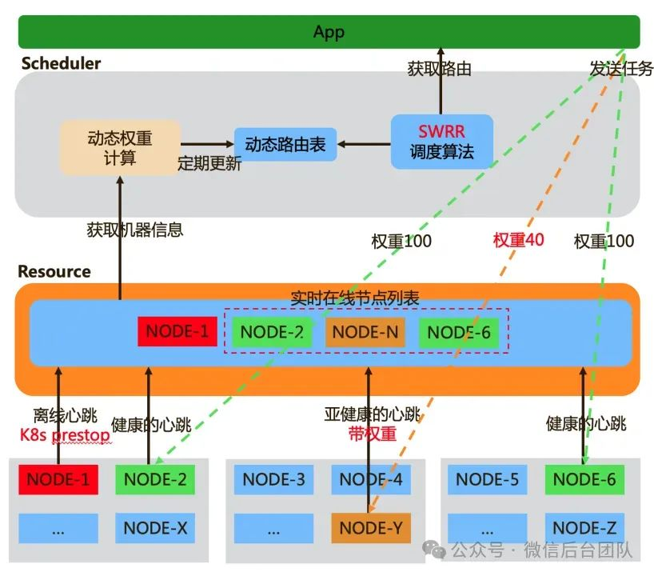

图 10：Starlink 调度流程

##### 3.3.1 快速容灾调度

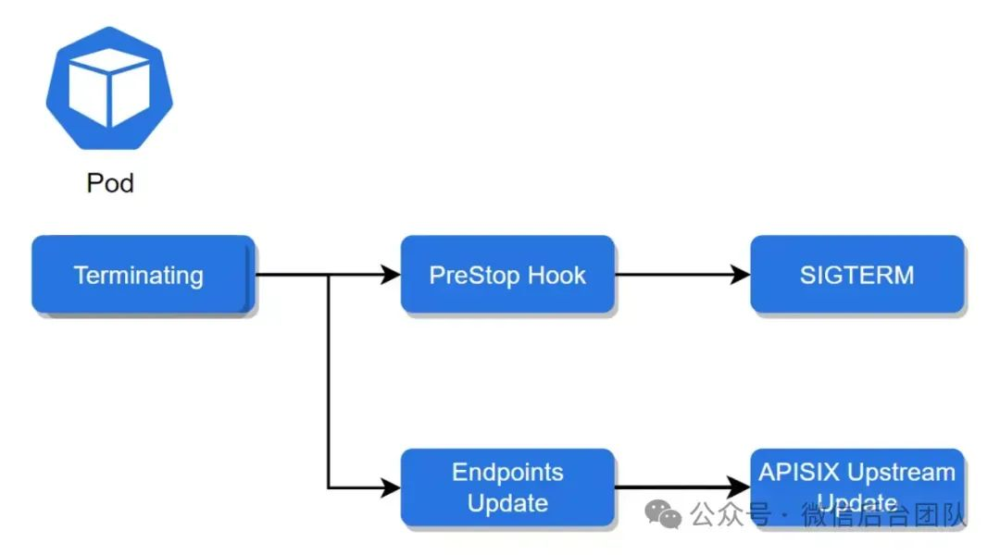

图 11：kubernetes PreStop Hook 机制\[6\]

我们通过两个手段来加速容灾调度：1. 在资源平台实际驱逐 pod 之前，通过 K8s 的 PreStop Hook 机制实现服务程序优雅退出，同时Node将自己标记为离线，并通过心跳上报到 Resource。2. Resouce 通过预聚合广播，快速将状态同步到整个 Resouce 集群，Scheduler 每隔 3s 通过拉取 Resouce 的在线列表来进行动态权重计算，定期更新路由表。最终可以实现在 4s 内将节点驱逐，从而大幅降低了应用的失败率。

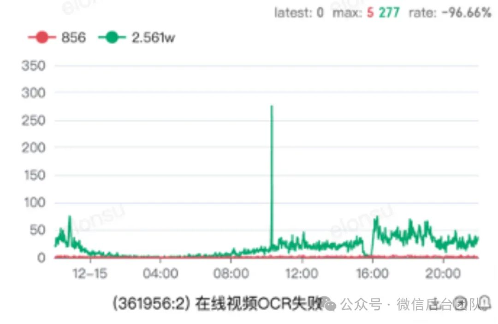

##### 3.3.2 动态权重SWRR路由算法

AI 应用往往具有计算量大，单机 QPS 低的特点。在这种服务场景下，微信后台常用的一致性哈希已经无法将请求均匀的分发了。除此之外，低优和免费资源因为经常被在线任务抢占，节点间性能往往参差不齐。我们选用 SWRR \[6\](Smooth Weighted Round-Robin)算法作为基座，并进行优化，首次应用到低 QPS 的任务调度系统中，实现请求分布的快速调整。算法步骤如下：

**1.更新节点权重(3s一次)**

对于每个节点：节点权重=节点核数或卡数∗log(剩余利用率)∗(当前利用率/节点当前并发)，这个公式构建了一个模型，简单的描述了请求量预期的分布，节点权重描述的是当前节点处理新增任务的能力，处理能力越高的节点应该分配到更多的请求。其中：1)节点核数或卡数是代表节点的资源总数，资源总数与处理能力成正比，对于不同的GPU，资源总数即不同卡的性能对比系数。2)log(剩余利用率)是节点当前剩余资源，剩余资源量与处理能力成正比。其中，log是一个经验值，在log后，算法在高负载时表现较好。3)(当前利用率/节点当前并发)本质上是机器性能的体现，假设大盘下每个任务同一时刻的消耗是接近的时，这个公式成立。

**2.选择节点流程**

这里是SWRR的标准流程，因为SWRR算法的复杂度是O(n)，我们的实现会对性能做一定的优化，比如分block，多算法实例等。1)对于每个节点：节点路由权重 = 节点路由权重 + 节点权重 2)选择当前路由权重最大的节点 3)被选择的节点的路由权重减去所有节点权重之和 算法流程样例，假设{A,B,C}节点权重为{5,1,1}

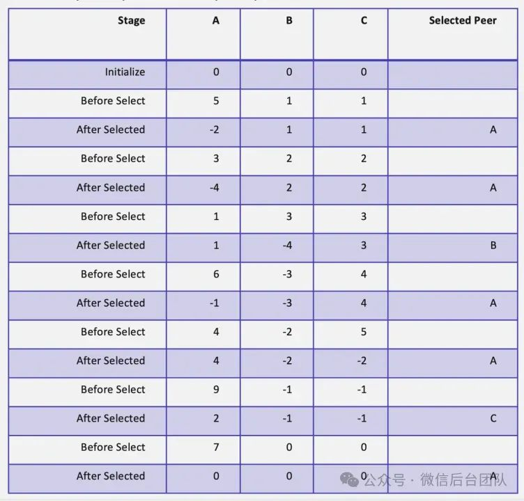

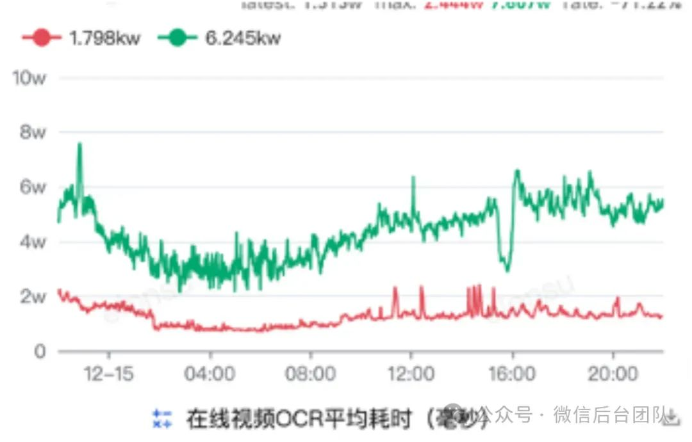

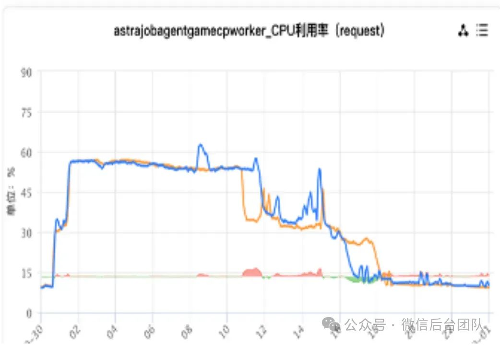

最终，我们使用自适应权重的 SWRR 算法，动态平衡请求分布，拉平利用率的同时，还降低了请求耗时。

#### 3.4. 降低应用部署的复杂度的挑战

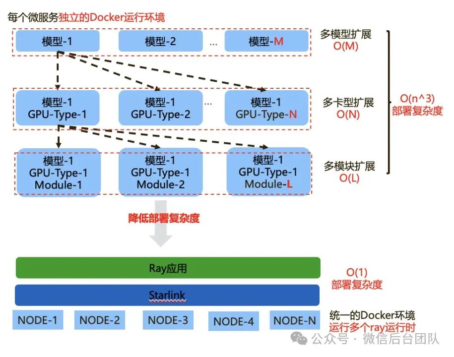

图 12：AI应用的部署复杂度

AI 应用的部署涉及三个方面：多模型扩展、多卡型扩展、多模块扩展（单模块超过 K8s 部署上限），一个超级应用的部署复杂度为 O(n^3)。AstraRay 的创新方案使得一个应用可实现三个维度的扩展，将复杂度降低为O(1)，极大提升了 AI 应用部署的效率。

##### 3.4.1. 多模型扩展挑战

多模型扩展问题的本质是模型运行环境的动态切换，这里包含两个问题：

1.运行时动态切换；2.模型的快速下发；动态切换运行时

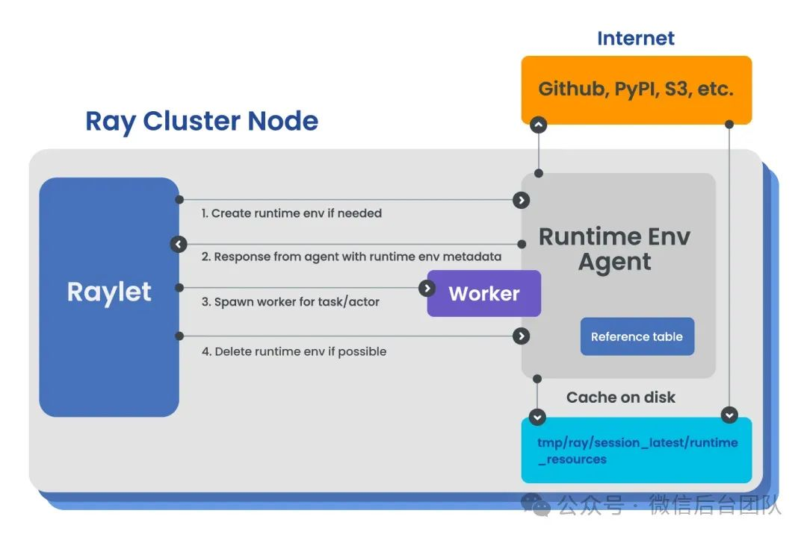

图 13：Ray动态运行时\[7\]

我们首先解决运行环境的问题。Ray自身提供RuntimeEnv作为运行环境管理，但Ray的RuntimeEnv无法切换Python版本，且Ray对于Python运行环境之外的依赖，只能依靠机器本身Docker环境，不够灵活。

我们支持了Conda作为Python运行环境的隔离和打包，与Ray本身的Conda不同在于：Ray的Conda要先拉起Ray，而 Ray 的worker节点要求和Ray的头节点使用相同的版本，导致应用无法切换Python版本。而我们通过在启动Ray之前初始化运行环境，使每个应用自定义不同的Python版本。

具体的操作为：在应用的代码打包上传之前，我们会根据用户填写的 requirement.txt，使用conda-pack打包对应的Conda环境，在启动Ray之前，分发到对应的节点上。其中提前打包可以避免大规模快速扩容对软件源带来下载压力。我们也支持用户自定义打包例如 TensorRT 等环境，提供更强大的环境自定义能力。

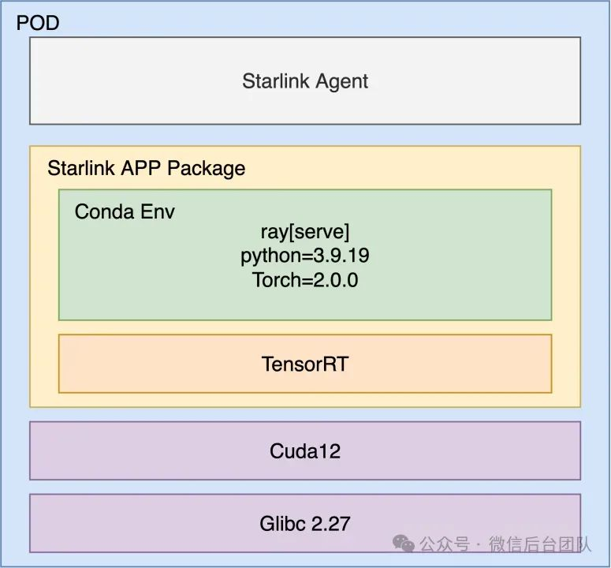

图 14：AstraRay 运行时

**快速的模型下发**

随着大模型时代的到来，模型文件变得越来越大，LLM模型有数十GB，下载一个模型需要数十分钟。Ray可以指定working\_dir来分发代码和模型，但是Ray单点依赖gcs节点，默认的大小限制也仅仅500MB，无法用于真正的生产环境。

为此，我们在Node上嵌入了P2P网络。P2P分为Server端和SDK接入端，server端通过心跳管理P2P节点，并维护集群中的种子信息。P2P节点则提供文件分片的缓存和传输能力。

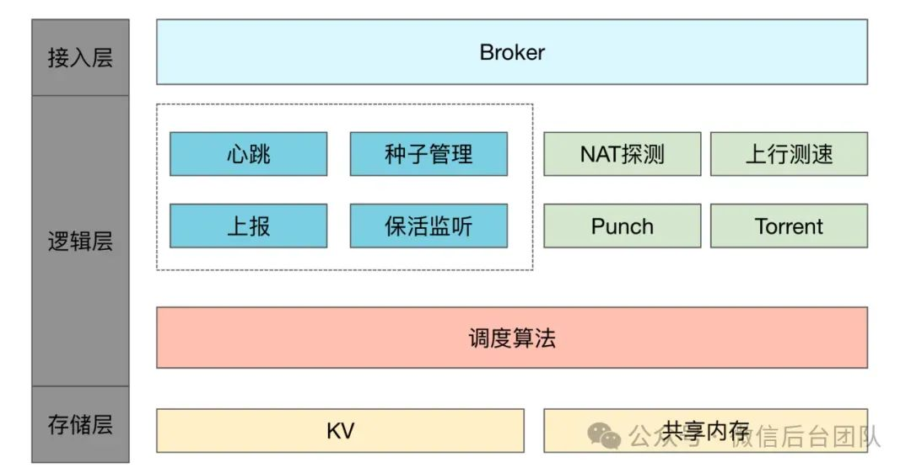

图 15：P2P server 端架构

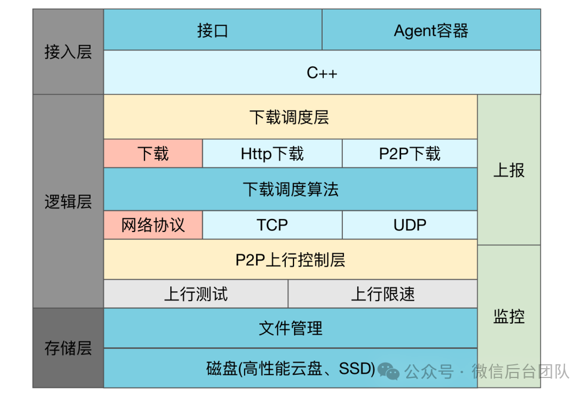

图 16：P2P sdk 端架构

我们还对P2P的网络和性能做了极致的优化：1.网络打洞能力：面对复杂的网络环境，P2P支持NAT探测打洞，尽最大努力避免网络不通的情况。

2.节点自动限速能力：P2P作为一个嵌入式的组件，要避免节点的带宽和CPU被P2P进程消耗完，所以节点加入P2P网络时，会对节点进行测速，并设定合适的阈值，避免影响正常服务。

3.全局限速：即使已经限制了单节点的速度，仍然有可能会因为上层交换机或核心网络带宽限制，影响到其他服务，支持从服务端下发全网限速，避免影响其他服务。

4.冷启动和热点下载加速：一个新的文件下发时，因为全网都不存在这个文件，如果按序下载，可能会导致下载缓慢，请求的节点分片集中。通过打乱分片下载的顺序，可以将请求分布到不同的节

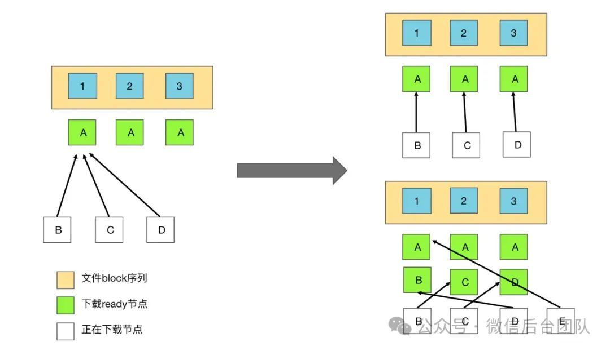

图 17：P2P下载加速

##### 3.4.2. 多模块扩展挑战

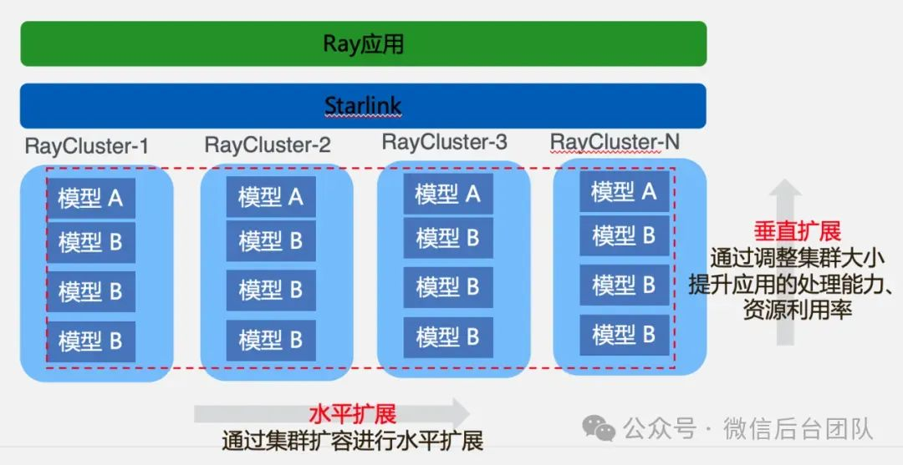

图 18：Ray 联邦集群架构

为了提升 Ray 应用的扩展能力，我们通过starlink实现了Ray联邦集群架构，每个Ray应用可以拥有多个Ray集群，单个Ray集群都拥有完整的功能。用户可以调整单个Ray集群的大小，在单个Ray集群内进行Actor的资源分配，提升应用处理能力，提升资源利用率，实现垂直扩展能力；可以通过扩容Ray 集群数量，实现水平扩展。

我们还在 Ray 联邦集群架构基础上，增强了 Ray集群的容灾能力，具体策略为：当head node下线，则水平重新扩容一个Ray集群。当worker node下线，则在这个Ray集群重新拉起一个worker。通过上述策略，我们使用不稳定的低优资源的情况下，Ray自身架构引起的失败影响可以降低到最低。

##### 3.4.3. 多卡型扩展

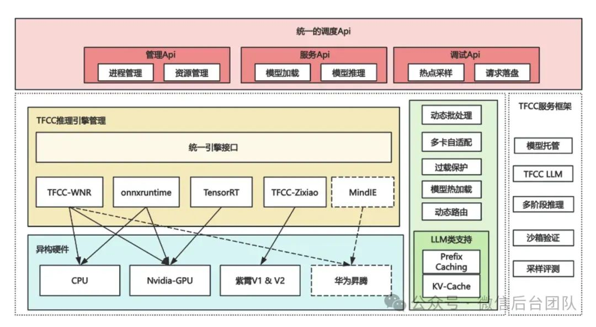

图 19：TFCC推理运行时

多卡型扩展的模型推理部署有三个比较大的挑战：

1.不同的推理业务形态多样：引擎种类多模型类型多（pytorch/onnx/tensorrt...） 2.异构卡型的适配工作繁琐且重复度高（英伟达/紫霄/华为） 3.多种引擎支持、模型切换引擎成本高。

我们基于TFCC框架提供标准服务框架，统一了接入模式，透明化了引擎实现，算法仅需声明模型，不再需要手写推理代码，同时内化异构卡型适配工作，屏蔽硬件细节，在应用层实现一份代码、多处推理，支持灵活多样的AI应用场景。

### 四、总结

AI 时代的来临对微信后台的基础设施带来了许多挑战。我们引入业界先进的Ray作为基座，适配了微信的基础环境，提供了方便快捷的AI应用开发范式。同时，在Ray的基础上，简化了Ray本身集群管理的难度，并使用低成本的闲置资源节省了大量的机器成本。AstraRay作为一个刚诞生一年的项目，为微信的AI应用的工程化提供了坚实基础，并且在持续不断的优化，为将来更多AI应用在微信落地做好了准备。

**参考资料**

\[1\].https://www.infoq.cn/article/vt4lewlrgumufibrulhz

\[2\].https://www.anyscale.com/blog/four-reasons-why-leading-companies-are-betting-on-ray

\[3\].https://docs.ray.io/en/latest/cluster/kubernetes/index.html

\[4\].https://juejin.cn/post/7313601254365691941

\[5\].https://www.cl.cam.ac.uk/research/srg/netos/camsas/blog/2016-03-09-scheduler-architectures.html

\[6\].https://api7.ai/blog/api7-cloud-integrates-kubernetes-service-discovery

\[7\].https://github.com/nginx/nginx/commit/52327e0627f49dbda1e8db695e63a4b0af4448b1

\[8\].https://www.anyscale.com/blog/handling-files-and-packages-on-your-cluster-with-ray-runtime-environments


