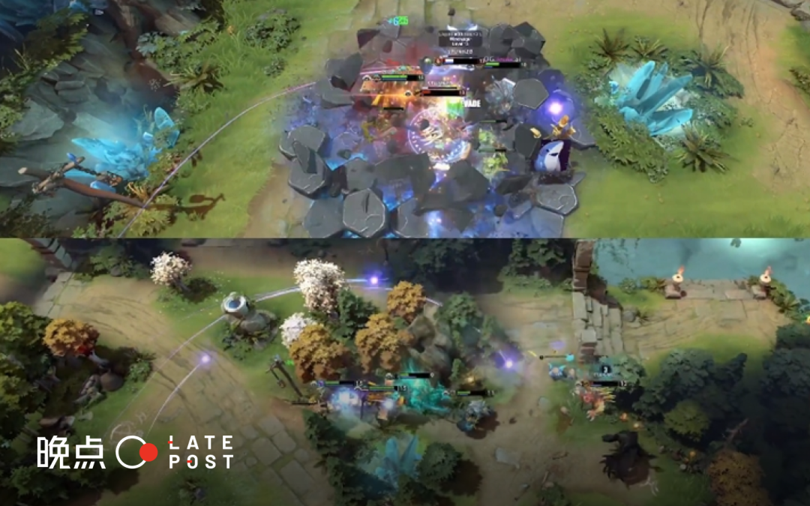
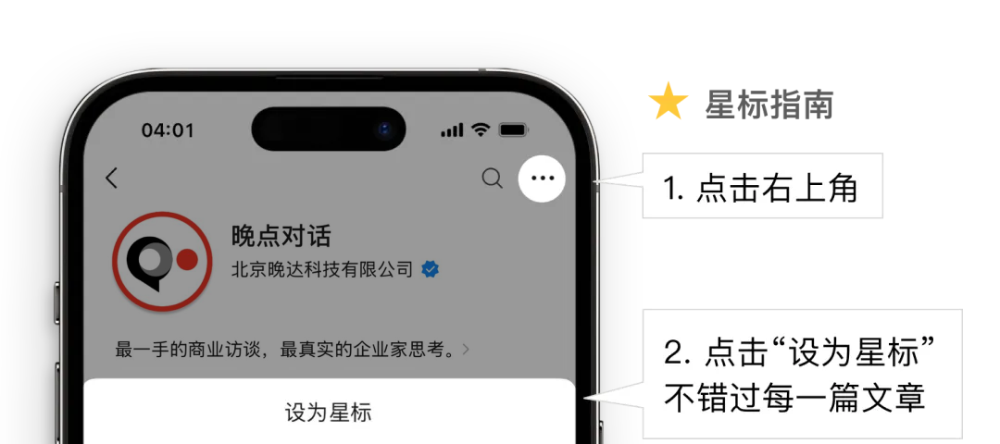

Title: 晚点对话 MiniMax 闫俊杰：创业没有天选之子

URL Source: https://mp.weixin.qq.com/s/VBnm3KCsYd4fuXcBpDgiaA

Markdown Content:

**MiniMax 创始人兼 CEO 闫俊杰**

“千万别套用移动互联网的逻辑来想 AI。”

**文丨程曼祺**

**编辑丨宋玮**

经过 “一切在加速” 的 2024 年，围绕中国大模型创业的讨论，从 “谁又融资了？” 变成 “谁会第一个倒下？”

行业分化时刻，我们与中国大模型六小龙之一，估值已超 30 亿美元的 MiniMax 创始人兼 CEO 闫俊杰访谈 3 小时，聊了 MiniMax 的新技术目标、新模型，去年一年的公司变化和人员调整，和他作为一个 “练习时长 3 年” 的初次 CEO 的自我复盘。我们也对他进行了 “信仰之问”。

10 个月前，[闫俊杰也接受过《晚点》访谈](https://mp.weixin.qq.com/s?__biz=MzU3Mjk1OTQ0Ng==&mid=2247515088&idx=1&sn=7080c5e13d99a6ca7f39044cb8f1eaf5&scene=21#wechat_redirect)，那时他提了 16 次字节、47 次 OpenAI，8 次 Anthropic。

这次再聊，他主动提字节少了，提 Anthropic 多了。这与行业风向形成微妙的反差。

闫俊杰更在意字节的 2024 年 3 月，中国大模型创业公司势头正盛，此前 6 个月里，各模型公司至少融了 20 亿美元。

而现在，重金投入 AI 的科技大公司力压一批明星创业公司，MiniMax 本来看起来相对 “安全”：它的 AI 社区产品 “星野”，其用户数、使用时长和留存率都高于字节旗下的同类产品。

闫俊杰却自己推翻了这些优势，在他现在的认知里，用户数等指标并非 AI 竞争的核心：

*   **“千万不要用上一代移动互联网产品方法论来思考新产品。”**
    
*   **“中国大部分公司，不管创业公司还是大厂，都还在用做推荐系统的方法来做大模型产品。”**
    

“推荐” 的逻辑是：用户越多，反馈越多，推荐引擎越聪明。而闫俊杰认为，AI 大模型和产品的真实关系是：

*   **“更好的模型可以导向更好的应用，但更好的应用和更多用户并不会导向更好的模型。”**
    
*   **“ChatGPT  的 DAU 是 Claude 的 50 倍到 100 倍，但它们的模型其实差不多。”**
    

在更明确 “智能水平的提升，没那么依赖很多用户” 后，闫俊杰说他做出了取舍，结束了整整半年多的焦虑。他说，现在 MiniMax 最重要的目标不是增长，也不是收入，是 “加速技术迭代”。

1 月 15 日 MiniMax 发布的首个开源模型——MiniMax-01 系列，也是这个目标的结果之一。

MiniMax-01 首次在 4000 亿以上参数的大模型中，使用了线性注意力机制新架构（标准 Transformer 是非线性注意力机制），能高效处理全球最长的  400 万 token 上下文。

闫俊杰认为 long-context（长上下文）是 Agent（智能体）的重要能力，它能增强 AI 的 “记忆”。提升单 Agent 交互质量和多 Agent 之间的通讯能力。

闫俊杰复盘了认知尚不足够清晰时的一些失误：

*   **“如果重新选，第一天就应该开源。因为开源能加速技术进化。”**
    
*   **海螺文本为何没做起来？——“就是没有坚持技术驱动。”**
    
*   **如何复盘 2024 年初定的增长目标未达到？——“年初定目标时，用的还是移动互联网的业务逻辑。其实这是两个行业。”**
    

说自己不再焦虑的闫俊杰，做了一些与众不同的技术选择：这次 MiniMax-01 使用的线性注意力机制，不是一个强共识方向；而在最热门的 OpenAI o 系列模型方向上，MiniMax 没有第一批跟进。

他的表达风格也比 10 个月前犀利了：

*   **“一年前最喜欢说信仰的那些人，信仰都兑现了吗？”**
    
*   **“其实做一个看上去像 o1 的东西没那么难……但我们不太需要说自己有个 o1，然后发个新闻稿。”**
    

1989 年出生的闫俊杰，年轻，但非 90 后；是人工智能博士，但不是欧美海归；他不是业界大佬，也不是 “技术天才”。“大部分做技术的人会觉得自己很牛，是天才。但我不是这么认识这个世界的。”

闫俊杰说，去年他反思最多的事是：为什么自己的认知不能提升更快？他找到的新方法是：放下 ego（自我），思考更深。

**“如果可以重新选，应该第一天就开源”**

**晚点****：你们发布 MiniMax-01 系列新模型后，得到了什么有意思的反馈？**

**闫俊杰**：技术人员比较关注的是，第一次有一个很大的模型没有完全用传统的 Transformer 架构，架构层也可以创新。

而一些非算法的合作伙伴和朋友说，觉得我们好像有点上道了，开始意识到要做技术品牌了，合作起来也少了不开源导致的各种限制。

**晚点****：那你们真的上道了吗？**

闫俊杰：这是我们第一个开源系列模型，本质上两个原因：第一是我们认为真正有价值的事，不是当前做得怎么样，而是技术进化速度。而开源会加速技术进化，做得好的地方有鼓励，不好的地方会有很多批评，外面的人也会有贡献，这是我们开源的最大驱动力。

第二是，过去两三年，我们做得特别不好的一件事儿是，对技术品牌没有很深的认知。技术品牌之所以重要，本质也是因为这个行业最大的驱动力是技术进化。这需要算力、数据、钱，也需要足够好的人。

**晚点****：DeepSeek-V3 在全球技术社区爆火，是不是刺激你们了？此前在 Hacker News 上搜 DeepSeek，有 470 多个帖子，而搜 MiniMax 很少。**

**闫俊杰**：我们意识到要做技术品牌时，DeepSeek-V3 还没有发布。

我和梁文锋 2023 年初认识后，他有两件事对我有启发：一是他们的品牌做得非常好，它的信誉和口碑是量化行业最好的之一。另一个启发是，DeepSeek 一开始没有产品，所以更聚焦。

**晚点****：为什么没有更早开源？**

**闫俊杰**：第一次创业，很多经验不具备。如果可以重新选，应该第一天就开源。

如果我是 OpenAI，我今天都应该开源，因为它的核心能力已经不是模型比 Claude 或 Gemini 好多少，而是 ChatGPT 的品牌与心智。

我们这次开源，也不会自己藏一个更好的东西，这没有意义，所有模型一年之后都会落后。我们的通用模型也会持续开源。

**晚点****：MiniMax 成立之初就是同时要做模型和产品。而 DeepSeek 梁文锋曾说现阶段不做产品，只做模型，你怎么看这个策略？**

**闫俊杰**：首先，DeepSeek 最近也有 App 了。

但反过来说，我觉得中国人工智能产业过去一两年一直有个巨大的误区：就是认为用户越多，模型能力提升越快。这个逻辑非常错。

你看 ChatGPT  的 DAU 是 Claude 的 50 倍到 100 倍，但它的模型并没有好 50 倍，二者其实差不多。这就反映，智能水平的提升，其实没那么依赖要有很多用户。

**晚点****：不是用户越多，模型能力就提升越快——去年这个观点几乎没人信。**

**闫俊杰**：这个事要分两层看：

一是模型是产品出现的驱动力。比如去年有很多视频产品，这是因为有了更强的视频模型。

但模型却不是基于用户反馈和数据迭代才变好的。Claude 3.5 Sonnet 的代码能力很好或市面上的视频模型很强，不是因为之前已经有了很大的编程或视频 AI 产品，而是先定了一个技术 benchmark，才做到的。

所以，更好的模型可以导向更好的应用，但更好的应用和更多用户并不会导向更好的模型。

这个现象的底层原理是，在日常使用中，模型比大部分用户更聪明，大部分用户的 query（查询）其实没有模型自己模拟得好。

**晚点****：这个误区让整个行业走了什么弯路？**

**闫俊杰**：为了有更多用户，就花大量的钱来买流量。更核心的是，中国大部分公司，不管创业公司还是大厂，都还在用做推荐系统的方法来做大模型产品。

比如一个内容产品，你没法明确知道什么会火，所以就要大量做 AB Test，这是高效的。但这个逻辑到了模型里，就变成不同研究员去尝试不同算法，在不同 feature（功能）上做不同实验，不行的话再累加。这不是做 AGI 的方式。

**晚点****：什么才是才是更合适的方式？**

**闫俊杰**：应该非常清晰地定义模型能力分级，然后搞清楚每一代提升，需要什么样的算法、数据和推理过程，通过技术手段来逼近定义好的指标。

**晚点****：你什么时候有了这个认知的？这和你们这次更新的关系是什么？**

**闫俊杰**：去年 3、4 月。 我们想清楚之后，就干了几件事儿。

第一是，技术和产品要分开，技术就是要不断提升上限，这需要定义好下一代能力。比如为什么这次用了全新架构，本质是因为我们认为 long context（长上下文）很重要。

第二是，不要认为有产品之后模型就会变好，产品的目的不是让模型变好，它就是一个商业化产品。真正需要思考的是怎么更好满足用户。

**晚点****：那么对你们来说，到底是技术更重要还是产品更重要？MiniMax 是一家技术驱动的公司，还是产品驱动的公司？**

**闫俊杰**：我们非常明确，自己是一家技术驱动的公司。它不是一个口号，实质是，当遇到冲突时谁说了算？

**晚点****：可以举一个技术说了算的例子吗？**

**闫俊杰**：比如海螺视频，按月访问量，现在是全球最大的视频生成产品了，但它页面还很粗糙，甚至我们刚上线时，有很多海外用户，却没有英文界面。

一定会有用户提，为什么 Runway 支持一个功能你没有，为什么可灵出了 App 你没有。但一旦你去解决这些简单问题，模型进步速度就会变慢，因为精力会分散。当时我们的选择就是听算法的，优先做算法上限高的功能。

再比如，上线一个比较大的算法变化，可能会影响用户数据时，怎么选？还是根据算法趋势来决策。2023 年时还会纠结，2024 年基本不纠结了。

**晚点****：经过去年，围绕大模型创业的讨论从 “谁又融资了” 变成 “谁会先倒下”。你觉得谁会先倒下？谁会活到最后？**

**闫俊杰**：我觉得其实不应该把创业公司分成一个单独类别。创业公司之间比其实意义不大，应该是整个行业一起。

以及我想说，我觉得 DeepSeek 和智谱是挺不错的。DeepSeek 很纯粹。智谱，他们是最早有 AI 路线图的，这点我很佩服。

**“一年前最喜欢说信仰的那些人，信仰都兑现了吗？”**

**晚点****：你描述的技术逻辑一以贯之，但一位投资人对 MiniMax 的观察是：你们 21 年融资时讲虚拟人，后面又做 Glow、星野这种类 Character.ai 产品；Kimi 火了之后，重启了生产力工具海螺；Sora 之后，放了更多资源做视频生成；接着是现在的开源。**

**你们好像一直在随热点而动。**

**闫俊杰**：这是一些误解。我们从来就不是想做一个数字人，只是我们三年前创业时，我们说要做无限接近图灵测试的智能体，有投资人理解为数字人，当时还没有大模型投资概念；而我们开始做 Glow 时还没有  Character.ai；海螺是两年前就推出了，只是前一年没有做起来，当大家意识到这个方向火时，Kimi 产品体验那会儿比我们好，所以可能认为我们是重启。

视频，是最开始做星野和 Talkie 时，我们想让角色动起来，所以立项的，Sora 出现后，我意识到这个事儿比我想得更大，所以把它做得更通用了。

为什么要开源？刚才讲了，最核心是为了加速技术进化。

**晚点****：你对 AI 的信仰到底是什么？看起来你们做过很多事。**

**闫俊杰**：本质上，现在没人能定义出什么是 AGI。能定义的只是，智能水平会不停进步。

它有点像长征，你不知道最终目的地具体在哪儿，但你知道更好的智能水平有意义。

**晚点****：所以很难基于一个明确的终点，步步为营地倒推？**

**闫俊杰**：创业不是说有个机会，你最合适，你就是天选之子。

创业的前提是你有独特的理解。第二是，你的资源很可能不是最多的，这也是好事，逼你一定要做出真正的创新。

这种情况下，路径是什么？能不能走到那个点？其实不是一开始可以规划的，是需要一步步去争取的。

**晚点****：李开复上周告诉我们，整个行业从信仰 Scaling Law 到怀疑  Scaling  Law 只用了一年时间。**

**闫俊杰**：我觉得作为一个创业者，这时我想的事，不是 Scaling Law 撞墙了，我就放弃了，而是我要做什么事能让它延续。

是算法、组织、业务层面的创新，还是方向上的取舍？至少在我们还有机会时，应该努力找方法。

**晚点****：在讨论对 AI 技术的态度时，你觉得信仰是一个合适的词吗？**

**闫俊杰**：一年前最喜欢说信仰的那些人，信仰都兑现了吗？

**晚点****：你指谁？**

**闫俊杰**：行业里所有最喜欢说信仰的人，不管中国的还是海外的。

**晚点****：信仰是一年就能兑现的吗？**

**闫俊杰**：但至少得朝那个方向做。

**晚点****：通向信仰的路是直线吗？不能走弯路吗？**

**闫俊杰**：但有些动作是相反的。比如前面提到的，花大量钱投放，但问题是，更多的用户并不会带来更快的模型能力提升。

**晚点****：如果不用信仰，你觉得更合适来描述对技术态度的词是什么？**

**闫俊杰**：（思考）我觉得是信念。

**晚点****：信念和信仰的区别是什么？**

**闫俊杰**：信仰，有点像描述一个很远的未来；信念是，自己想怎么做，并能坚持做下去。

**“做一个看上去像  o1  的东西没那么难，但我们不需要一个新闻稿”**

**晚点****：这次 MiniMax-01 系列更新，技术博客的标题用了 “新架构开启 Agent 时代”，为什么 Agent 是一个重要目标？你怎么定义 Agent？**

**闫俊杰**：有两个思考路径：一是，AI 该往哪个方向变得更强？二是，变强之后，对人类社会能产生哪些有益的变化？

那显然很重要的一件事是能处理复杂任务，一个标志可能是多步，它可以是 o1 这样单次输出多步，也可以是通过一个单 Agent 拆成多步，还可以像 Anthropic 定义的 workflow 那样，是更复杂的多 Agent 之间的协同。

如果再定义一下复杂任务，我的理解就是在专业领域能到专业人士的水平。

**晚点****：去年你说，当时没人做出成功的 Agent 应用，是因为大模型能力还不够强。现在 MiniMax-01 说 “开启 Agent 时代”，是哪里变强了？**

**闫俊杰**：这有两层，一是架构，二是能力。

架构层面，我们现在其实已经做到了，因为它是可以高效、快速地处理非常长的 context（上下文）。

Long context 重要，是因为 AI 很难像人那样感受到时间的流逝，这需要处理越来越长的记忆。对单 Agent，提升互动质量的一个核心是记更多东西。多 Agent 则涉及相互通讯，比如 Anthropic 定义了一个 Agent 间的通讯协议叫 MCP（Model Context Protocol，模型上下文协议），那个通讯量非常长，所以也需要处理长 context 的能力。

在能力层面，我们其实还有很多可以提升的地方，比如 AI 使用工具的能力、规划能力，我们这个模型还没打磨好。但这些能力都有很多标准 benchmark（基准），可以慢慢实现。

**晚点****：你最开始提到，这个架构不完全是 Transformer，那它是什么？**

**闫俊杰**：标准 Transformer 里有几个模块，我们是把其中一个最重要的 attention（注意力机制），从原来的平方复杂度的注意力变成了线性的注意力。

（注：标准 Transformer 里的注意力模块是非线性的，即 “平方复杂度”，线性注意力机制通过简化计算过程，提高处理长序列的效率，当文本非常长时，计算复杂度是线性增长，而非平方增长，所需算力更小；但线性注意力机制可能在捕捉复杂依赖关系上不如非线性注意力机制。）

**晚点****：它其实是 Transformer 一个比较大的变体?**

**闫俊杰**：可以这么理解。

**晚点****：Google 的 Gemini 之前就用到了线性注意力机制，MiniMax-01 和 Gemini 的线性注意力的异同是什么？**

**闫俊杰**：我认为 Google 今年会更强，因为它同时掌握 TPU（Google 自研的 AI 芯片） 、训练框架（TensorFlow）和算法，可以一起优化。所以 Google 做这件事相对简单一点。

而我们不能自己定制 GPU，只能在一个标准硬件上去做，这就会更复杂。

**晚点****：这是实现难度上，方法和效果呢？**

**闫俊杰**：Google 是闭源的，所以我并不精细知道他是怎么做的，但应该用了 sliding window attention，它是滑动窗口，一开始记忆可能没那么长，但可以分成很多段，然后一个滑窗滑过去。

我们不是滑窗，而是都计算，只是我们找了一些近似算法，让它算得更快。

（注：sliding window attention 是一种基于局部上下文的技术，它通过在输入序列上滑动一个固定大小的窗口来计算注意力。这种方法可以有效地捕捉局部依赖关系，同时减少计算复杂度。）

**晚点****：除了线性注意力带来的 long-context 和记忆能力，Agent 还需要提升什么能力？**

**闫俊杰**：就是一些 benchmark，它们大部分是学术界定义的，比如驱动代码能力进步的一个重要 benchmark 是 SWE-bench。

一年前，模型在这个 benchmark 上的解决率只有百分之十几，现在是 70% 多。多模态里也有一些 benchmark。

**晚点****：为什么你们这次没测 SWE-bench？**

**闫俊杰**：代码能力是我们下一版本要提升的能力。

**晚点****：在技术上，达到 benchmark 和优化计算架构是分开的两件事儿吗？**

**闫俊杰**：是一体的，你可以认为，架构指的是你的计算 pattern（形式）长什么样，能力是按这个 pattern 计算具体参数。

**晚点****：怎么判断你们选的计算 pattern 能支持更高的能力上限？**

**闫俊杰**：靠认知，也要靠实验。

决定不同公司研发效率的，首先是你的认知要对，但也有可能两种认知都对，这时实验设计和效率就很重要。

怎么评估我们的研发能力比 9 个月或一年前更强了？关键一点是，在框架和数据确定的情况下，我们的实验收益更高了。这是个核心能力，它很依赖于团队合作。

**晚点****：为什么 MiniMax-01 面向 Agent，却不是一个 o1 方向的模型？ o 系列被认为对提升 Agent 能力很有帮助。**

**闫俊杰**：因为我们需要把每一步做扎实。其实做一个看上去像 o1 的东西没那么难，蒸馏几千条 o1 数据就可以了。我们做过这样的实验，最近也有不少这样的学术论文，这是一个业内共识。

但我们不太需要说自己有个 o1，然后发个新闻稿，我们现在的业务也不依赖于 o1 这类模型。

**晚点****：你们下一版模型的编程能力提升，是用 o1 的方式来做吗？**

**闫俊杰**：不光是 coding，还有 planning（规划）。这件事也取决于，不同任务怎么用 benchmark 来衡量，找到衡量指标，就能优化。

即使是 o3，它在一些多模态 benchmark 上的分数也很低。

**晚点****：你怎么衡量优先级？阿里通义、Kimi、DeepSeek、智谱都已经发布了类似 o 系列的模型，而你们似乎认为多模态能力的优先级更高？**

**闫俊杰**：第一，一个公司的能力是有限的。

第二，我们思考先优化什么 benchmark，是基于这个领域是否足够收敛了，以及我们能在里面创造多大的独特价值。o 系列从模型进展到能看到比较清楚的产品形态还需要时间。

过去几年，最终在一个领域做得好的公司，不一定是第一个做这个方向的公司，而是最能充分发挥这个方向潜力的公司。不在于早一个月、晚一个月。

**晚点****：编程已经是 Agent 正在落地的场景，而 o1 显著提升了编程能力。你不认为这是一个要抢时间窗口的方向吗？**

**闫俊杰**：Cursor（AI 编程助手）是基于 Claude 3.5 Sonnet 做的，但 Claude 3.5 并不是一个 o 系列模型。

4 个月前，GitHub CoPilot（微软旗下 AI 编程助手）开始集成 o1，它也没有变成第一。

**晚点****：一个现象是，o1 之后，中国公司跟进比 Google、Anthropic 等美国公司更快，你觉得这说明什么？**

**闫俊杰**：因为中国公司可能认为蒸馏是可以做的事儿，而 Anthropic 或 Google 也许不会做。但我也不觉得蒸馏是错的。

**晚点****：蒸馏是一种捷径吗？**

**闫俊杰**：它肯定是一种路径。是不是捷径，见仁见智。

其实在文本模型里一直有 “对齐税”——就是如果一定要把模型去对齐一个别的模型，比如 GPT 的结果，会有一些能力受限。

**晚点****：除了 o1 带来的逻辑推理、数学和编程等能力提升外，怎么看它打开的 Inference-Scaling 新空间？这件事的技术意义是什么？**

**闫俊杰**：这个趋势之前就有了，比如最简单的，best of N，你采样十次，选最好的结果，准确度就会提升。

o1 的进步是把这种思路变成了一个端到端的模型，所以可以整体优化，效果提升了很多。

**“Agent 很快还会看到一类应用：信息的获取”**

**晚点****：你认为 Agent 最先落地的场景是什么？**

**闫俊杰**：Coding 肯定是，我觉得很快还会有一类应用，就是信息的获取。

**晚点****：我知道你们最近在低调测试一个信息获取的新产品。可以讲一讲用 Agent 来做这件事的思路吗？**

**闫俊杰**：现在信息获取主要是基于推荐，推荐的内容大概率是你想看的，但不能保证你想看的，都会推给你。

比如我想每天能看到这个领域里最好的十篇论文，现在的内容平台都不能满足这个需求。所以我觉得信息获取会发生一些变化。

**晚点****：这听起来像一个使用新技术方法的今日头条。**

**闫俊杰**：千万不要用上一代做移动互联网产品的方法论来思考新产品。

**晚点****：哪里不一样？**

**闫俊杰**：移动互联网产品，要思考有哪些供给、哪些消费。而 AI 产品其实不需要（人的）供给。AI 既有分发，也有供给能力，而且 AI 能力会不停变化。

一个移动互联网产品体验变好了，大概率是因为供给变了。而在 AI 产品里，它主要依赖于模型能力，或者说得到供给的方法发生了变化。

它们（移动互联网产品和 AI 产品）的周期、确定性都不一样，增长方式也不一样。

**晚点****：Agent 类产品，看到什么信号时，你们会更多投资源去做增长？**

**闫俊杰**：这可能不是一个对的问题。如果一个产品特别依赖推广，大概率就不太对。

**晚点****：星野之前也做了不少推广。**

**闫俊杰**：Glow 没有推广，星野和 Talkie 有一些推广，到海螺视频时，我们海外、国内都没有花钱推广。

**晚点****：为什么有这个从不推广，到推广，再到不推广的变化？是因为字节激进加入了战局？**

**闫俊杰**：不是，是因为认知升级——从没做过产品，做第一个产品；到开始学大厂的产品方法论，意识到有好处，也有局限；再到找到更适合自己的方法。

**晚点****：上个月我和小马智行 CTO 楼天成聊 L4，他觉得大模型应用里，MiniMax 做的星野比较像自动驾驶里的 L4，它是 AI 在和用户互动，是替代产生价值；而 ChatGPT、CoPilot 更像 L2，是辅助产生价值。你怎么看这两种方向的异同？**

**闫俊杰**：这个总结还挺有意思，确实非常不一样。

比如 ChatGPT 和 Claude，ChatGPT 更像一个助手，帮你完成任务，Claude 更有温度。

一个有趣的测试是，你先和模型说一个 1 到 100 间的数，比如 50，你又回他，那我就 50 天不和你说话了。Claude 会说，能不能再给我一次机会？然后他会说个非常小的数。而 ChatGPT 不会这样。

实质是，怎么来看待对齐这件事。Anthropic  有一套价值观，基于此，推出来一套宪法。这导致他的模型具备一些特点和能力。

这是一件上限比较高的事，就是清晰定义，你做的模型到底是什么。

我觉得中国跟美国模型的一个区别，就是缺少内部定义的 benchmark，一些自己的底层思考和设计，更多是在对齐 o1 等模型的输出。

**晚点****：MiniMax 的模型有自己内部的 benchmark，和路线图吗？比如 OpenAI 去年提出了一个 L1 到 L5 的 AI 能力分级（聊天机器人、推理者、智能体、创新者、组织者）。**

**闫俊杰**：这是我们要逐渐加强的一件事。

我们最开始的目标是 Intelligence with everyone，实现方式要跟用户在一起，但我们其实并没有精确定义每一步到底是什么。

这可能是一个 “逃出生天” 的逻辑，要一步一步走。我觉得对 OpenAI，目前最有意义的也是 L3（智能体），L4、L5 长什么样并不影响他们现在的行动。

**“人才密度最高的是字节，其他公司都差一档”**

**晚点****：你觉得去年到今天，你们实际上做得不错的技术成果是什么？**

**闫俊杰**：基础设施和算力相关的东西。因为我们每天生成的对话、图片、视频和音频量，都非常大、非常难。怎样能处理这么多计算，把它优化、调度好，还有一个合理的成本。这一点，我们应该是业内做得最好的。

然后算法上，我们的多模态比较领先，通用文本暂时不是最领先的，但开始有自己的特色。

**晚点****：这次 MiniMax-01 更新，首次大规模实现了线性注意力机制，你们描述这是 “非常大胆的创新”，有多大胆？**

**闫俊杰**：我们是第一个在这么大规模的模型上这么来做的。

**晚点****：其他人不这么做，是因为不认为这是一个好方向，还是因为难？**

**闫俊杰**：都有。这不是一个强共识的东西。

**晚点****：你们去年最受外界关注的进展，如你所说是多模态，尤其是海螺视频生成大模型，效果和访问量现在都是全球第一梯队，怎么做到的？**

**闫俊杰**：之前我们已经做过一遍文本（大模型）了，也做过文生图，有一些积累。

但真的开始做，会发现这些 Infra 其实没法完全复用到视频，算法和怎么做实验上也有很多变化，怎么做评价，就更不一样了。你可以认为，相当于又新长出了一家公司。

**晚点****：这些年开发这么多模型下来，你们技术团队沉淀的特点和方法论是什么？**

**闫俊杰**：我们还是相对客观。这是指，我们有时可能目标定得不对，但一旦能找到正确目标，我们的效率和能做到的深度都比较好。

还有扁平、灵活，沟通比较简单、直接，我们现在还是我、我的-1，我的 -2 这三个层级。

**晚点****：客观是一个特点吗？难道行业里很多公司不客观吗？**

**闫俊杰**：我觉得是的。非客观是指，评价技术结果时有一些别的考虑，比如士气是不是受影响，不同团队的 scope（范围） 等等。

**晚点****：你为什么没提人才密度？比如说我有多少竞赛获奖选手。**

**闫俊杰**：人才密度最高的是字节跳动，其他公司都差一个档，这是一个事实。而我们也没想把自己包装成什么样。

但是我想说，两位同样优秀的同学，假设一个去了字节，一个去了需要依赖技术和创新安身立命的创业公司。2 到 3 年后，那个去创业公司的人变得显著更优秀的概率更大。

**“大部分做技术的人觉得自己很牛，但我不是这么认识世界的”**

**晚点****：在 2024 年这么多行业变化，包括你自己更想清楚了模型和应用不是一个简单正向循环的关系后，同时做模型和应用，还有必要吗？为什么不聚焦其中一个？**

**闫俊杰**：首先不存在只做模型、不做应用的公司。DeepSeek、Anthropic 都不是。

再来说只做应用、不做模型的公司，这类公司显然很多，有些做得很好，比如 Perplexity 和 Cursor。

同时，也有既做模型、又做应用的公司，我们也是这样。我们每做出一个新产品，确实都是因为先做了模型，有了提升。

**晚点****：你们 21 年底成立时，大模型并没有很好的生态基础，所以你得自己做。如果你更晚创业，会做一个专注应用的公司吗？**

**闫俊杰**：不会。一是基于现有技术做产品，二是基于未来技术做产品，我想做后一种。

**晚点****：这是因为你想做一个价值更大的事？**

**闫俊杰**：不是。是基于怎样更能发挥出自己的潜力和公司的潜力。

**晚点****：那些更轻、更聚焦应用的公司，和 MiniMax 这样模型应用同时做的公司，2025 年会怎么竞争？**

**闫俊杰**：市场不是有 A，就不能有 B ，其实两个东西都对。

**晚点****：你怎么复盘去年你们面向生产力场景的海螺 AI（指聊天助手产品，不是海螺视频）做得不如预期？**

**闫俊杰**：我觉得就是没有坚持技术驱动。当你发现很多用户的不满时，解决思路不应该是去补这些 case，应该找到一些真正的提升方式。

而且到去年 5 月时，我就知道豆包会赢。豆包当时的体验已经比同类其它产品好了。

同时我也开始意识到，我最开始说的那件事，就是更多用户并不会导致模型能力提升。那就应该把海螺文本当一个产品，一个业务去思考，我们后来的决定就是不投放。

**晚点****：你之前说你 3、4 月就想清楚了这个事，为什么停止海螺文本投放的时间更晚？**

**闫俊杰**：都是创业中的成长，其实很多认知很简单，但执行时没那么坚定。

**晚点****：你被什么东西影响和干扰了？投资人？竞争对手？**

**闫俊杰**：我觉得是人，主要是考虑团队的感受。

**晚点****：你什么时候开始变得更无情了？**

**闫俊杰**：现在也没有。实际的变化是，我会非常明确得给大家讲我认为的对的东西。有些事没法妥协。

**晚点****：另一方面，你们的 AI 社区产品星野是中国表现最好的，比字节、美团等大公司的同类产品都好。暂时领先是为什么？**

**闫俊杰**：最关键的是，技术路线一定要选对。其次做业务决策时，我们更懂用户。

**晚点****：你怎么去懂他们了，你好像跟星野的用户画像并不是很像。**

**闫俊杰**：核心是同理心。

**晚点****：你认为自己是个同理心很强的人？**

**闫俊杰**：我觉得是。

实质是，大部分做技术的人会觉得自己很牛，是天才。但我不是这么认识这个世界的。

**“不要区分创业公司和大公司，不要套用移动互联网”**

**晚点****：从我们 2024 年初那一次聊到现在，你觉得中国大模型竞争格局最大的变化是什么？**

**闫俊杰**：24 年时，很多人认为 AI 是把移动互联网复制一遍，现在至少有一些人开始意识到，其实 AI 不适用移动互联网的逻辑，这是两件事。

**晚点****：这个认知变化怎么影响竞争格局呢？**

**闫俊杰**：大公司过去积累的优势，仍有意义，但不是唯一的。这还是因为，产品用户越多，模型并不会自然变好。而更好的智能，可能会导出新东西，新东西也会有新商业模式。

**晚点****：在全球我们看到，Google 花 25 亿美元收购了 产品形态跟你们有些相似的 Character.ai 的团队，这会是 MiniMax 的选项吗？**

**闫俊杰**：我没考虑过把公司卖一个什么价钱。

**晚点****：我去年把这个新闻发给你时，你说 “感觉是一个 happy ending”。**

**闫俊杰**：对他们来说是，本身创始人也没那么喜欢那个产品，他回去后，Gemini 2.0 里就有他很多贡献。

**晚点****：求证一个传闻，字节 24 年初是不是谈过以 40 亿美元估值收购 MiniMax?**

**闫俊杰**：没有这个事。

**晚点****：你和张一鸣交流过，有什么收获？**

**闫俊杰**：至少让我看到了一个非常顶级的企业家是什么样的。

**晚点****：什么样？**

**闫俊杰**：他希望能给这个社会带来很多正向价值。

**晚点****：到 24 年下半年，大模型的投资方已是国资轮、中东轮，后面还有多少人能接力？你们怎么持续获得充足资金？**

**闫俊杰**：我们没到这个地步。这还是取决于，怎么做出自己的好东西。

**晚点****：其实你去年说过，你不相信中国大模型创业公司能纯靠融资，真正的拐点会来自技术、产品或商业化效率的提升。但我了解到，你们 24 年的产品和收入都没有实现年初定下的目标，你怎么看这件事儿？**

**闫俊杰**：但我们是增长最快的，大概率也是收入最多的。

**晚点****：所以是目标定太高了？**

**闫俊杰**：核心是，24 年年初定目标时，用的还是移动互联网的业务逻辑，认知还没转变。其实这是两个行业。

**晚点****：现在你会怎么设立目标？2025 年的目标是怎么定的？**

**闫俊杰**：我觉得这个阶段，不应该定一个收入目标，就应该定技术研发目标。

**晚点****：到去年下半年，大家都看到了大公司，如字节、阿里等的强悍，尤其是豆包的产品表现。这出乎你的预料吗？**

**闫俊杰**：基本上都在预料之中，我预料的比这还更激烈一点。

我想说，如果你用移动互联网的思维来看，豆包确实很牛逼，但假定技术会长期发展，不同阶段会带来不同的产品和商业线，这真不一定是件好事。

**晚点****：你是指用户增长太快对豆包不是好事，还是指以移动互联网的思维来看豆包，对行业观察者是个干扰？**

**闫俊杰**：都不好。还是对比 OpenAI 和 Anthropic，前者用户规模是后者的几十倍，但它的估值、资金和人才都不过后者的三倍多。为了照顾那么多用户，OpenAI 要负担很多东西，有可能拖慢研发节奏。

**晚点****：所以用户多，不能直接提升模型能力，多到一定程度反而有可能影响模型发展的速度和灵活性。**

**闫俊杰**：至少看过去一年多，OpenAI 和 Anthropic 的对比就是这样。

**晚点****：你反复提到不要套用移动互联网的评判标准，那我们看 AI 产品，该看什么指标？**

**闫俊杰**：海外产品的一个重要指标是订阅数和付费，而移动互联网大产品过去主要依赖广告，这显然不一样。

国内产品，我猜也有指标，但我想跑得更好一点再说。

**晚点****：不和巨头正面竞争，比如不重投入做豆包类产品，是一个你们的竞争原则吗？**

**闫俊杰**：是。但本质是，我认为做 AGI 和做 ChatGPT 类产品是两件事。

而且当时也开始意识到，提升模型能力，不那么依赖最多的用户，那放弃就没太多心理压力。

**晚点****：一位大模型投资人对比过 MiniMax 和月之暗面的市场策略，他认为月暗是认准做 “生产力场景 + 中国市场”，当然这也是所有大公司投入最多的方向，而 MiniMax 看起来在不断适应环境，找到了巨头正面战场之外的空隙。你会怎么总结你们的定位策略？**

**闫俊杰**：我们希望自己一直在浪潮里。这有两个意思，一是能参与推动浪潮继续发生；二是我们能让公司持续发展下去。

**“不应该假定，一个公司不会有变动和流失。有才是合理的。”**

**晚点****：你怎么看去年有些中高层离开 MiniMax？**

**闫俊杰**：本质上是，这个事儿应该是技术驱动的，不是所有人都合适。

**晚点****：那你是劝退了一些人吗？会心理负担比较大吗？**

**闫俊杰**：必须得克服。

**晚点****：你做这些事儿拖延了吗？**

**闫俊杰**：拖延了，这还是属于认知不够强。

不应该假定，一个公司不会有变动和流失。有才是合理的。

**晚点****：实际上你们现在团队相比 24 年初有什么变化？**

**闫俊杰**：主要的变化不在于组织架构，而是对人的要求。

一是希望各方向的 leader 是提方案的人，而不要等着别人来提方案，应该更 hands on。

二是我发现，我们想要根据客观状态分析找到理性方案的人，而不是直接复制上一家公司经验的人。

**晚点****：你说 2025 年你们最重要的目标是技术迭代。这块你们现在的组织协作和分工方式是怎样的？资源怎么分配？**

**闫俊杰**：一方面做东西的资源是相对充足的，另一方面创业公司就得做取舍，但你不该假定所有取舍都是对的，一个关键是，怎么意识到错了，怎么及时改。

**晚点****：什么机制可以让你意识到你判断错了？**

**闫俊杰**：不 ego。不自我。

**晚点****：你觉得你是一个容易被说服的人吗？**

**闫俊杰**：不是

**晚点****：这和不要 ego 是矛盾的吗？**

**闫俊杰**：很多事都是矛盾的，MiniMax 这个名字就是矛盾的（MiniMax 作为技术术语指 “极小化极大算法”。）

还是有一些办法平衡，就是尽量深入思考，不要被表面、暂时的东西迷惑住。

**晚点****：MiniMax 现在哪些重要的决策是你来定夺，哪些是放权给其他人？**

**闫俊杰**：创业第一年，我觉得这件事很重要，后面发现其实不重要。

更重要的是，大家怎么有一个共同的思考基座。因为每个人做事方式不一样，如果分得特别清楚，会导致不同模块的逻辑完全不同，即使每个人都素质很高，一个公司也没法很好运行。

正确方式是，公司最底层认知能对上，谁来做决策，都会差不多，组织才会变顺。

**晚点****：大家都错到一起去了怎么办？**

**闫俊杰**：多样性也是一个很重要的指标了。但是我感觉，真正把公司拧起来的还是那个共同的东西。

**晚点****：这种不强调划分的分工方式，会不会让员工觉得公司的管理很乱？**

**闫俊杰**：让大家觉得公司管理得很好，其实不是一个目标。

**晚点****：有 MiniMax 员工说，24 年有段时间感到公司管理决策非常摇摆，这个月核心目标是收入，下个月是增长，下个月又是收入。**

**闫俊杰**：我们后来统一了，这两个事儿都不是目标，目标是技术迭代。

**晚点****：管理一个不能用以前的逻辑来套的新的 AI 公司，最大难题是什么？**

**闫俊杰**：持续招到更好的人。一个事实是，字节现在对人才吸引力最强。但去了字节的人，真正发挥出潜力的比例比创业公司低，字节人太多了。

**“最大的痛苦，是不知道要取舍”**

**晚点****：2024 这一年，你自己最大的变化是什么？**

**闫俊杰**：半年多以前，很多人觉得我有些焦虑，最近半年不再焦虑了。核心是开始意识到要做取舍。

**晚点****：这一年最大的痛苦是什么？**

**闫俊杰**：最大的痛苦是不知道要做取舍。当知道了，就不痛苦了。我现在把技术迭代作为我们最重要的目标。

**晚点****：你去年反思最多的问题是什么？**

**闫俊杰**：为什么自己的认知能力不能提升更快？

**晚点****：找到什么新的提升方法了吗？**

**闫俊杰**：还是要放下 ego，思考得更深。

**晚点****：你说过你很重要的一个学习方式，是和比自己强的人交流。去年你见过什么人，有什么学习？**

**闫俊杰**：是有的，但我觉得光这样不够，本质还是自己能思考得非常深入。

**晚点****：一个投资人分享了去年和你一起找算力的事。他说你非常极致追求便宜的租金、更短的租期。有一些供应商提出，可以给 MiniMax 一些当地 to B AI 订单，让你们考虑更贵的租金，你说你不需要订单。这是你强硬、不妥协的一面吗？**

**闫俊杰**：其实不要订单的原因是我们交付不了，答应了会分散自己的精力，也把别人坑了。

**晚点****：在 MiniMax，你一直被大家叫 IO，这是 Dota-2 里的一个英雄。MiniMax 海螺 AI 说：IO 是一个辅助型英雄，主要为队友提供增益和保护，在团队中扮演 4 号位或 5 号位。你为什么玩 Dota 2 选了 IO，而且一直叫这个名字？**

**闫俊杰**：其实他不是一直 4 号位、5 号位。TI9 时（Doat 2019 年国际邀请赛决赛），安娜（一位电竞选手）使用的上帝小精灵，就是把 IO 变成了 1 号位，非常强，这让他们战队得到了那年的冠军，当时就觉得这名字挺酷的。

**晚点****：所以 IO 跟你自己的特点没什么直接相关？**

**闫俊杰**：创业还是有很多随机行为的。

**晚点****：辅助型、输出型，你觉得自己更像什么类型的英雄？**

**闫俊杰**：其实不应该拆开看，如果一定要说的话，我是特别相信团队作战的人。

**晚点****：2025 年，你觉得可预见的变化是什么？**

**闫俊杰**：AI 在专业领域达到专业人士水平。这会是一个实质提升，虽然 2025 年不一定全部实现，但会实现一部分。

**晚点****：新的一年，对自己有什么新的要求吗？**

**闫俊杰**：希望自己的技术水平变得更高。刚开始创业时，我还考虑管理的事，后来发现其实没这么重要，真正重要的就是技术认知能否不停提升。

**晚点****：有时你看起来非常适应性，甚至有人会觉得是摇摆，有时非常坚决。哪个更接近真实的你？**

**闫俊杰**：这是一个进步过程。当在一个阶段变得更强后，会更坚决。

**晚点****：你创业时，既不是业界大佬，也不被认为是 “技术天才”。你认为自己是什么类型的创始人？**

**闫俊杰**：我觉得是简单。简单是指，知道有一件事，这事也很难，但做好的价值挺大，就坚持做。

题图：TI9中Ana使用IO作战夺冠

**晚点对话**

**最一手的商业访谈，最真实的企业家思考。**

\-  FIN  -

**晚点团队出品**

[

[

