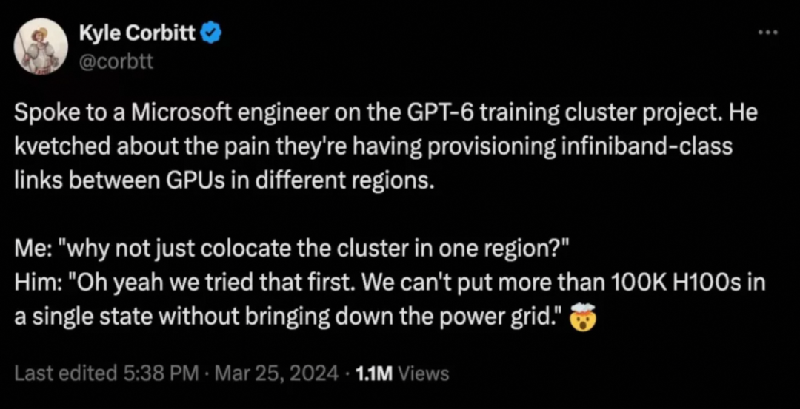
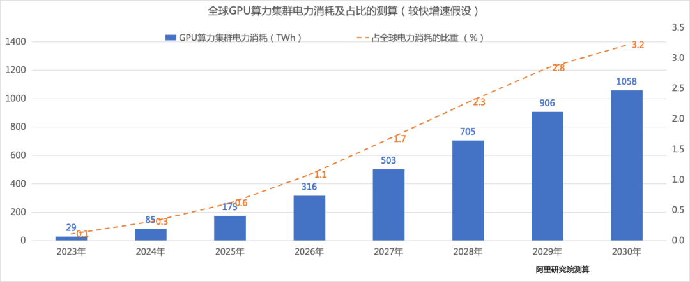
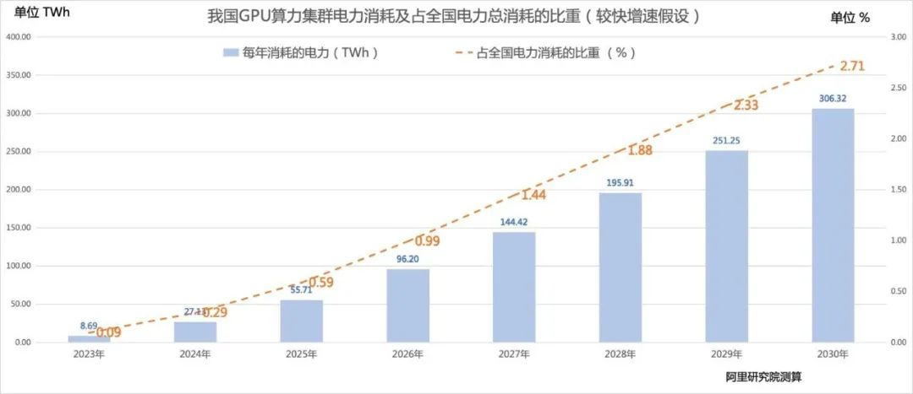

# 智能背后的电能保障：GPU算力集群能源挑战的全球视角与中国应对
**作者：** 

阿里研究院：杨军、周搏、袁媛

阿里云采购部碳管理与能源采购团队：毛宏举、黄光舟

**编者按：** 

● 随着人工智能大模型的迅猛发展，GPU算力集群的能源消耗正成为行业关注的热点。本文对2030年之前的全球及我国GPU算力集群的电力需求增长趋势做了测算，分析了其潜在影响，并探讨了部分应对策略。

  
● 本文认为，**GPU算力集群目前占全球整体电力消耗约为千分之一，短期内不会造成全球性电力供应短缺**，但是由于新建GPU算力集群主要集中在美国，会对其局部电力供给和传输带来相对严峻的挑战。与此同时，中国的GPU算力增长短期内不会导致电力短缺。不过，**预计2030年，GPU算力集群可能占全国电力消耗的2.7%，接近重点用能行业的规模，因此需要统筹规划和管理其用电政策，需要重点关注区域性电力缺口和跨区域新能源消纳的问题。** 本文提出，可以从提升AI算力的计算效率、推动GPU算力的合理布局和优化绿电交易政策、加强新型电力系统建设三方面着手，来应对AI大模型带来的能源挑战。

**GPU算力的快速增长引发人们对电力短缺的担忧。** AI大模型对算力的需求激增，使得行业面对“算不出”和“算不起”的双重挑战：一方面，传统CPU架构难以胜任大模型的训练和推理任务，以GPU（图形处理单元）为核心的算力集群建设正在快速增长；另一方面，大模型规模快速增大对训练资源的更高要求，以及出于降低单位推理成本的考虑，单体GPU算力集群的规模也在快速提升。电力供给正在成为新建GPU算力集群的制约因素之一。根据国际能源署IEA《电力2024》的报告，一次谷歌搜索需要0.3瓦时的电力，而一次ChatGPT请求则需要2.9瓦时的电力，如果利用ChatGPT处理每天90亿次的搜索，预计每年电力消耗将增加10太瓦时（1TWh=10亿度电）。近期，马斯克和黄仁勋等美国的人工智能企业家不断表达AI大模型会造成电力短缺的担忧，引发全社会对该问题的关注持续升温。

在此背景下，阿里研究院与阿里云采购部碳管理与能源采购团队进行了初步测算和分析，本文评估了全球和国内GPU算力集群的电力需求和比重，并探讨了应对AI大模型电力挑战的部分应对策略。需要说明的是，本文的测算对象特指服务于AI大模型训练和推理的GPU算力集群，不包含以CPU为主的传统数据中心。

“

**一、AI大模型的用电需求大幅增长，能源问题引发行业关注**

**GPU算力需求的激增给电网和供电带来了新的压力。** 随着AI大模型的兴起，GPU算力集群正日益成为新建IDC的主流。然而，GPU服务器的功率通常是CPU服务器的数倍，这意味着GPU服务器的高功率将显著增加数据中心的散热系统能耗和总体能耗。在大模型训练阶段，需要将超过万卡以上的GPU部署在同一地点，以实现芯片间和服务器之间的高速网络连接，这导致超大规模的GPU算力集群在扩建时受到电力供应的限制。3月底，一条社交媒体的消息在国内AI圈快速传播，凸显了GPU算力集群建设受限于电力供给并会对电网稳定性带来的影响。根据微软工程师的爆料，为了训练GPT-6，微软在试图搭建拥有10万块英伟达H100 GPU的训练集群，但是如果在同一个州部署这样规模的集群，可能会导致电网崩溃，因此不得不跨区域部署。

**随着AI大模型从训练阶段步入推理阶段，其推理算力需求会显著高于训练算力。** AI大模型的电力需求将进一步增加，对不同区域的总体电力供应将带来挑战。荷兰国家银行的数据专家Alex de Vries估计，类似ChatGPT这样的AI系统，每天处理约2亿个用户请求所消耗的电力，相当于1.7万个美国家庭的日常用电量。据第三方推测，文生视频应用Sora的训练算力需求大概是GPT-4的1/4左右，而其推理算力需求是GPT-4的1000倍以上，更多的算力需求将带来更严峻的电力挑战。上述现象凸显了在AI技术快速发展的同时，亟需关注和优化数据中心的能源问题。  

**美国人工智能企业家不断表达对“缺电”的焦虑，引发国内的关注升温。** 特斯拉CEO马斯克在博世互联世界2024大会上预言，“接下来陷入短缺的将是电力，到明年（2025年），我们就没有足够的电力来运行所有的芯片了” 。据报道，英伟达创始人黄仁勋在斯坦福大学演讲中表示：“AI的尽头是光伏和储能！我们不能只想着算力，如果只考虑计算机，我们需要烧掉14个地球的能源。超级AI将成为电力需求的无底洞” 。在瑞士达沃斯举行的世界经济论坛年会上，OpenAI的创始人奥特曼警告说，下一波生成型人工智能系统消耗的电力将远远超出预期，能源系统将难以应对，未来AI的技术取决于能源，我们需要更多的光伏和储能。

**不同研究报告对AI能源消耗的预测结果也各不相同，进一步加剧行业对GPU算力集群能耗的疑问。** 国际能源署IEA最近的《电力2024》报告中预计到2026年，AI数据中心的电力需求将达到90TWh（1TWh=10亿度电）。SemiAnalysis预测，2024年初Al数据中心的功率将超过10GW，2026年底将达到40GW。Alex de Vries预测到2027年，全球新制造的服务器与人工智能相关的能耗可能会增加到85TWh至134TWh的电力。

**我国GPU算力集群建设加速，能源优化成为关键问题。** 国内AI产业界的蓬勃发展推动AI算力的需求快速增长，各大领先公司正在投入巨资打造超过万卡级别的AI算力集群。2024年2月，国务院国资委举办了人工智能专题推进会议，明确提出了加快智能算力中心建设的战略目标。几乎同时，北京和上海等一线城市已投入巨额资金，打造先进的人工智能公共算力平台，以支持本地及周边地区的AI产业研究和商业应用。其他城市也在积极规划和筹建各自的AI算力平台，以期在未来的AI技术竞争中占据有利位置。如何提升新建GPU算力能效并满足其电力需求，特别是在国家双碳战略的背景下优化GPU算力集群的能源结构，更多的消纳绿色能源，成为一项复杂而紧迫的任务。

“

**二、GPU算力集群不会造成全球电力供应短缺，但是美国局部电力供给和传输挑战相对严峻**

我们的测算方法结合了GPU算力集群的能耗数据、不同型号GPU芯片的出货量、知名研究机构对市场增速的预测，以及来自国际能源署、国家能源局等机构对用电总量的预测，来推算GPU算力集群逐年的用能需求和比重。

**短期测算显示，截至2023年底，GPU算力集群占全球整体电力消耗约为千分之一，在接下来的1-2年内，GPU算力集群不会造成整体的电力供应短缺。** 

截至2023年底，全球GPU算力集群全年的电力消耗约为 29 TWh（1TWh=10亿度电），占全球电力消耗的0.1%。

预计至2024年底，全球GPU算力集群全年的电力消耗约为 85 TWh，占全球电力消耗的0.3%，占比约为2023年的3倍。

**长期测算来看，至2030年，全球GPU算力集群的电力需求会有几十倍的增长，以较快增长的假设计算，GPU算力集群耗电占全球比例将达到3.2%，成为一个重点关注的新兴用能行业。** 

*   预计至2026年底，全球GPU算力集群全年的电力消耗约为 316 TWh，GPU算力集群全年的电力消耗占全球电力消耗的1.1%。
    
*   预计至2030年底，全球GPU算力集群全年的电力消耗约为1058 TWh，GPU算力集群全年的电力消耗占全球电力消耗的3.2%。
    

根据上述测算，2024年至2030年，全球GPU算力集群年度总耗电量将增长约11倍，年复合增长率为52.2 %。

**新建GPU算力集群主要集中在美国，会对局部电力供给和传输带来显著挑战。** 

**从需求侧来看，新建GPU算力集群主要集中在美国本土。** 据第三方数据测算，英伟达独占全球90%的AI芯片市场。受美国商务部对中国高端芯片禁运政策的影响，美国公司已经成为英伟达芯片的最主要客户，再加上美国算力中心的平均电价在主要经济体中很低（平均约为0.083美元/度），新建的GPU算力集群在美国本土进一步集中，因此美国的GPU算力集群的单体规模和总体电力消耗的增长速度都遥遥领先于全球水平。据SemiAnalysis预测，人工智能热潮将会推动美国全部数据中心电力（GPU算力集群只是其中一部分）需求从2023年的23 GW 增长到2026年的52 GW， 占美国总发电量的比例从2023年的4.5%增加至2026年的10%。

**从供给侧来看，美国的电力系统相对脆弱。** 美国电力基础设施更陈旧，大面积停电的情况时有发生，且输电能力增长缓慢。以单体部署10万块英伟达H100 的GPU算力集群为例，其功耗超过13万千瓦（1GW=100万千瓦），约等于10万个美国家庭的用电量，将为区域电网的稳定性带来巨大的挑战。据外媒报道，美国能源部，微软和亚马逊正在考虑建设核聚变和核裂变发电厂来满足GPU算力集群快速扩张的需要，亚马逊以6.5亿美元买下了紧邻核电站的一处数据中心园区。

因此对美国而言，一方面是急剧增长的AI大模型用电需求，一方面是陈旧且脆弱的电力网络，美国AI产业界的众多大佬对电力供应的担忧是可以理解的。与之相比，我国的电网不仅采用了超高压输电等先进技术，而且相较于化工、金属冶炼和矿物制品等高能耗产业，为超过10万千瓦的GPU算力集群供电并不是一个重大挑战，因此对电网整体造成的压力并不像美国那样显著。

“

**三、****我国GPU算力集群用电需求将增长迅速，短期内不会导致**电力短缺**，但需提前统筹规划用电政策保障可持续发展**

**短期测算显示，我国GPU算力集群的电力消耗占比相对较小，短期内不会引发**电力短缺**。** 未来2-3年内，我国GPU算力集群的电力需求进入快速增长期，预计2024年GPU算力集群的电力消耗将是2023年的3倍。由于目前GPU算力集群占全国电力总消耗的比重仅为千分之一，因此短期内并不会对我国电力供应总量带来冲击，不会引起整体性电力短缺。

*   截至2023年底，我们测算国内GPU算力集群全年电力消耗约为8.7 TWh（1TWh=10亿度电），占全国电力消耗的0.1%。
    
*   预计至2024年底，我国GPU算力集群全年电力消耗将增长至27.1 TWh度电，占全国电力消耗的0.28%。
    

**长期测算来看，GPU算力集群接近重点用能行业的规模，需要提前进行用电政策的统筹规划和管理。** 我国的AI算力面临着国外高端芯片禁运和国内自主研发芯片产能受限等影响，未来2-3年，我国GPU算力集群建设的供给侧不确定性增加。但是一旦攻克产能问题，实现全产业自主可控，我国的GPU算力将会较快增长。预计至2030年，GPU算力集群的电力消耗将会逼近重点用能行业的规模。GPU算力集群的电力消耗距离高载能行业还有差距。据国家能源局数据， 2023年全年，占全社会用电量比例高于4%的行业依次有化工、黑色金属冶炼、有色金属冶炼、非金属矿物制品、电力热力等行业，其中前四大高载能行业占比约为26.3%。按照上述预计，2030年GPU算力集群的电力消耗虽低于2023年四大高载能行业占比，但也已经到了需要引起重视的规模，需要提前进行用电政策的统筹规划和管理。

*   以偏较快增速的假设测算，预计至2026年底，我国GPU算力集群全年的电力消耗约为96.2 TWh，GPU算力集群全年的电力消耗占全国电力消耗的0.99%。
    
*   预计至2030年底，我国GPU算力集群全年的电力消耗约为306.3 TWh，GPU算力集群全年的电力消耗占全国电力消耗的2.71 %。
    

根据上述测算，2024年至2030年，我国GPU算力集群年度总耗电量将增长约10倍，年复合增长率为49.8%。

**从总体供需关系看，新增的GPU算力集群功耗远低于我国新能源装机容量的增长。** 比对用电端和发电端的总体数据来看，持续扩大的新能源发电规模，结合正在推进中的新型电力系统建设，总体上能够满足高速增长的GPU算力集群用电需要。据国家能源局数据，2023年，全国发电装机容量约为2900GW，其中除火电外的清洁能源装机容量约为1500GW，占比为52.3%。其中风电和光伏近年来增长速度持续维持高位，2023年分别同比增长20.7%和55.2%。按照前述预测，2030年全国GPU算力集群功耗约为35GW，新能源新增装机规模将远超过GPU算力集群的功耗需求。

**当前面临的突出问题是如何解决GPU算力集群的区域性电力缺口，以及如何提高跨区域的新能源消纳能力。** 虽然总体供需上不会引起电力短缺，但是考虑到GPU算力集群具有单地点、全时段、大功率的用电特点，亟需建设的超大型GPU算力集群的选址可能因为区域性的能耗指标分配、电网网架结构、双碳政策等因素受到限制，因此需要为GPU算力集群的能耗指标、能源结构和用电政策等做统筹规划。此外，对于GPU算力集群密集分布的部分区域，用电需求的快速增长有可能会对局部电力供给和输配电设施建设造成短期压力，如何提升跨区域的风光电等新能源消纳比例是亟待解决的问题。

“

**四、应对AI大模型电力挑战的思考**  

应对AI大模型带来的能源挑战，可以从提升AI算力的能效、产业政策、智能电网和优化GPU算力集群能耗和能源结构等方面综合考虑。本文主要围绕前三个方面探讨应对策略。  

**○ 应对策略一：整体优化计算架构和计算服务的提供方式，提升AI算力的计算效率。** 

提升AI算力的计算效率是应对未来电力需求增长的关键策略，可以从AI芯片、服务器和服务提供方式三个层面，来引导和激励相关产业研发和应用计算效率更优的技术和产品。

*   **提升AI芯片的计算效率。** 目前行业通行的做法包括制程技术提升、架构创新、低功耗设计、软硬件协同等，涵盖了从工艺、架构、电路设计、系统层级优化等多个方面，此领域的创新正在不断演进。英伟达最新发布的GB200 GPU与上一代的H100 GPU相比，每瓦数的TFLOPS（每秒浮点运算次数）提高了47%。此外，业界正在探索设计大模型专用芯片等方式提升计算效率，例如美国初创科技企业Groq开发了专门面向大模型推理场景优化设计的LPU芯片。
    
*   **降低服务器能耗。** 可灵活配置、高密度、高兼容性的服务器架构设计也能够有效降低服务器能耗。例如基于方升架构的阿里云磐久服务器G系列，与传统架构相比，系统散热能力提升10%，散热能耗降低30%以上。越来越高的芯片和服务器密度也促使业界开始采用直接芯片（Direct-to-Chip）冷却等液冷技术，如英伟达最新发布的GB200 NVL72机柜可容纳72 个Blackwell GPU，并采用一体水冷散热方案，从而大幅降低能耗。
    
*   **提高资源利用效率。** 依托公共云来提供AI算力服务能够有效提升资源利用率，降低运营成本特别是用电成本。公共云通过资源分配和任务调度技术，可以提升GPU的负载利用率，从而降低单位算力的能耗成本，是提高GPU计算效率的最高效、最便捷的方式之一。
    

**○ 应对策略二：优先支持在八大枢纽数据中心集群建设GPU算力集群，探索跨区跨省的绿电和绿证交易，集中满足绿电需求。** 

根据《发改数据〔2023〕1779号文》的要求，到2025年，在八大数据中心国家枢纽节点中，新建数据中心的绿电使用比例需超过80%。建议考虑在新能源资源丰富的国家级算力枢纽节点出台鼓励措施，优先布局GPU算力集群，对于推动GPU算力的合理布局、优化供需和绿电集约发展等都具有重大意义。由于八大枢纽的新能源资源分布不均衡，对于枢纽集群内GPU算力在优先消纳本地新能源后的不足部分，建议探索通过跨区跨省的绿电、绿证交易来满足需求。

**○ 应对策略三：加强新型电力系统建设，增强电网敏捷调度能力。** 

大量新能源的接入对于电力系统稳定性的挑战已是确定性问题，而GPU算力作为一个快速增长且稳定的用电负荷，需要持续运行且不易调节，很难参与传统用电的需求响应。因此，加强新型电力系统建设显得尤为重要，通过智能化技术提升新能源发电量与工商业用电的源荷匹配度，增强电网的敏捷调度能力，既能保障对GPU算力集群的稳定供电，又能尽量增加新能源电量的本地消纳。

_**ENDING**_

**结语**

随着AI大模型时代的到来，GPU算力需求激增，不仅推动了云计算和能源管理技术的革新，也引发了对电力供应稳定性的广泛关注。尽管短期内GPU算力集群的电力消耗在全球范围内占比仍小，但预计至2030年其能耗将显著增长，成为重点关注的用能领域，尤其是美国面临局部电力供给和传输带来严峻挑战。

随着中国GPU算力集群建设的加速，短期内电力需求虽快速增长但整体可控；长期来看，则需要前瞻性的规划来应对局部用电缺口和绿电消纳的挑战。利用技术手段提升AI算力能效是应对电力挑战的关键策略，此外，合理布局GPU算力集群与绿电供应，加强新型电力系统建设，提升电网调度能力，对于确保AI技术的可持续发展至关重要。

总之，GPU算力集群的快速发展对全球能源体系提出新要求，需要技术创新、政策引导与行业协作，以实现AI算力的高效、绿色、可持续增长。希望通过本文抛砖引玉，促进更多业内专家投入对这一议题的深入讨论和持续研究，为行业内外的决策者提供数据支持，共同探讨如何解决可能的电力挑战。

**参考文献：** 

1.  《Electricity 2024  Analysis and forecast to 2026》，International Energy Agency，2024年1月。
    
2.  《AI Datacenter Energy Dilemma - Race for AI Datacenter Space》,SemiAnalysis，2024年3月。
    
3.  《耗电量将接近4000亿度电！》中国能源报，https://baijiahao.baidu.com/s?id=1779754313926096050&wfr=spider&for=pc
    
4.  《2023年全国分行业用电增长排行》国家能源局, https://news.bjx.com.cn/html/20240223/1362664.shtml
    

本文写作过程中还得到了**阿里巴巴集团公共事务部孙晓辉、万红杰，阿里云公共事务部丛杰、张影强、淘天公共事务部郝建彬**的大力支持和建议，特此感谢！

**END**

**\- 转载及合作请评论区或邮箱留言 -**

