Title: 本地部署DeepSeek-R1:70b的一些经验

URL Source: https://zhuanlan.zhihu.com/p/24356664924

Markdown Content:
本地部署DeepSeek主要有以下几个好处：

1.  **离线，且可以无限制使用；**
2.  **可以投喂数据，建立自己的知识库；**
3.  **熟悉大模型的部署流程；**
4.  **熟悉电脑配置；**


目前网上关于DeepSeek的部署教程多如牛毛，但在自己进行尝试的时候，还是发现了一些需要注意的细节。

这篇文章会介绍我在本地部署DeepSeek-R1:70b时，出现的一些问题，以及一些经验。


一、硬件需求
------

DeepSeek-R1模型的参数量越大，模型越智能，但对硬件要求也就越高。

配置需求网络上已经有很多人总结了，这里参考[\[1\]](https://zhuanlan.zhihu.com/p/24356664924#ref_1)：

| 模型版本 | 模型大小 | CPU | 显卡 | 内存 | 磁盘空间 |
| --- | --- | --- | --- | --- | --- |
| 1.5B | 1.1GB | 普通四核或六核处理器就行 | NVIDIA GTX 1650或RTX 2060这种中等性能显卡 | 16GB RAM | 至少50GB空闲空间 |
| 7B | 4.7GB | 6核或8核处理器 | NVIDIA RTX 3060或更强的显卡 | 32GB RAM | 至少100GB空闲空间 |
| 8B | 4.9GB | 6核或8核处理器 | NVIDIA RTX 3060或更强的显卡 | 32GB RAM | 至少100GB空闲空间 |
| 14B | 9GB | 8核以上处理器，像Intel i9或AMD Ryzen 9 | NVIDIA RTX 3080或更强的显卡 | 64GB RAM | 至少200GB空闲空间 |
| 32B | 20GB | 8核以上处理器 | NVIDIA RTX 3090、A100或V100显卡 | 128GB RAM | 至少500GB空闲空间 |
| 70B | 43GB | 12核以上处理器，推荐用高端Intel或AMD处理器 | NVIDIA A100、V100显卡，可能还得多个显卡一起用 | 128GB RAM | 至少1TB空闲空间 |
| 671B | 404GB | 高性能、多核CPU，建议多台服务器配置 | NVIDIA A100或多个V100显卡，甚至需要集群支持 | 至少512GB RAM | 至少2TB空闲空间 |

这里强烈建议大家先从1.5B的版本进行尝试，先把整个流程跑通，再尝试其他版本。

二、安装流程
------

DeepSeek最简单的方法就是通过Ollama进行部署：

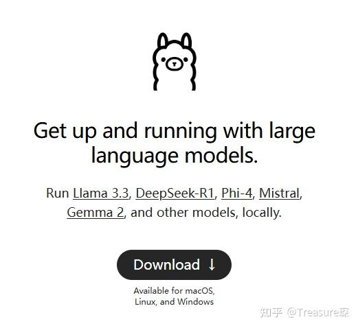

这里以Linux系统为例，讲解怎样进行安装。

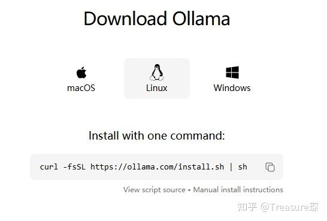

### 1、命令行安装Ollama

在Terminal中输入：

```
curl -fsSL https://ollama.com/install.sh | sh
```

Ollama大概有1.4G，在国内直接这么下载会非常慢。建议走全局代理之后再进行下载。

**注意：不建议手动安装Ollama，强烈建议在全局代理的情况下，用官网命令行安装。**

我在手动安装好Ollama后，可以正常下载模型，但在Run模型的时候会出现以下报错：

```
Error: llama runner process has terminated: exit status 2
```

下载过程：

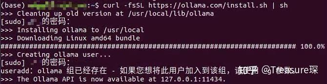

可以输入Ollama查看是否已经安装完成：

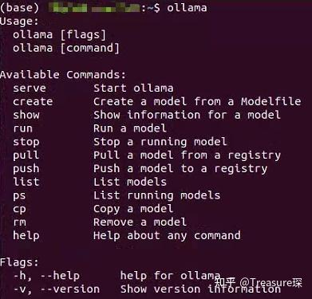

### 2、运行Ollama后下载模型

另开一个Terminal，然后输入：

这样Ollama就在系统中运行起来了。然后输入（这里展示的是1.5b）：

```
ollama pull deepseek-r1:1.5b
```

下载过程：

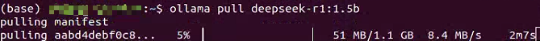

下载完成后

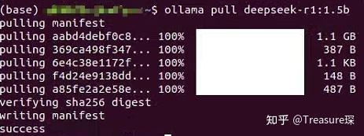

### 3、运行模型

输入：

```
ollama run deepseek-r1:1.5b
```

即可在Terminal中运行模型：

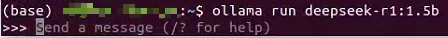

例子：

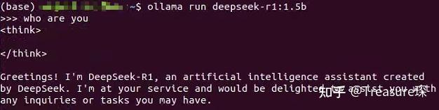

在Terminal中运行DeepSeek不太符合日常的工作习惯，而且不方便联网等操作。

我们可以把DeepSeek部署到网页中，在浏览器中运行DeepSeek：

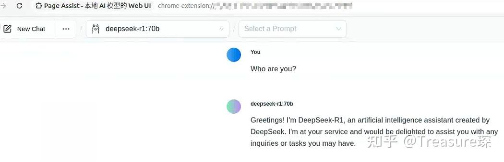

最简单的方法是使用Page Assist，这是一个为Ollama设计的Web UI：


点击Add to Chrome即可安装。

安装完成后，在扩展程序那里单击插件图标：


**注意：这个时候，Ollama需要在运行状态下。**

即可弹出网页，然后在红框中选择模型即可：

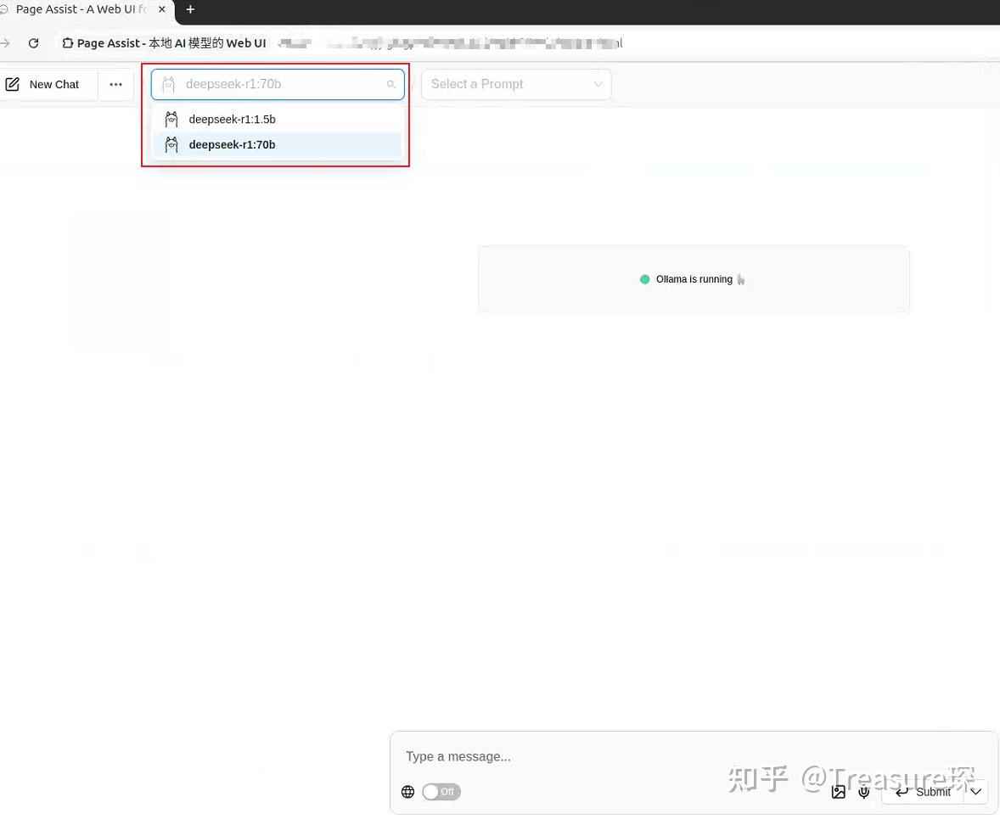

**注意：Page Assist是可以支持联网的。**

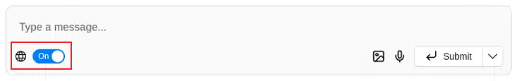

后续我会介绍怎样给DeepSeek投喂数据，通过自己的数据库，让DeepSeek更懂你。

参考
--

1.  [^](https://zhuanlan.zhihu.com/p/24356664924#ref_1_0)1 [https://www.cnblogs.com/GreenForestQuan/p/18711265](https://www.cnblogs.com/GreenForestQuan/p/18711265)
