# 波士顿动力40年，给移动机器人带来了哪些启示？ | 界面 · 财经号
> 文｜高工机器人

“人形机器人是ChatGPT的灵魂载体。”这种构想正在成为现实。

近日，某位工程师将 ChatGPT 和波士顿动力公司的机器狗Spot结合起来，使得Spot能够和人类进行语音交流，还能通过点头和摇头来回应问题。

当今最先进的人工智能，搭配顶尖的机器人载体。在爆火的ChatGPT之外，另一主人公——波士顿动力，同样值得关注。

事实上，波士顿动力是讨论“人形机器人”无法避开的传奇性企业，无论赛道怎样风起云涌，新星层出不穷，波士顿动力产品始终是行业的标杆。无数挑战者试图对比、超越、但充其量只是一场越级的“碰瓷”。

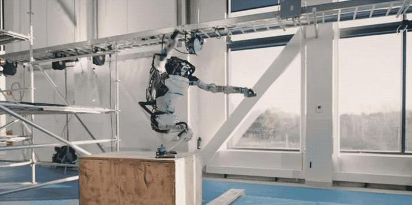

从1983年第一台蹦蹦跳跳的单腿机器人，到如今精通各种酷炫技能的“明星”Atlas。波士顿动力在40年发展中，将人类机器人梦想一步步照进现实，同时也屡屡挣扎在商业化困局，八年三易其身。

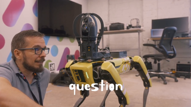

波士顿动力这家传奇企业究竟是如何诞生的？身为技术最领先的企业之一，却又为何屡屡被变卖？

在探寻答案的过程中，人形机器人甚至整个移动机器人产业，都能从其优势与困境中映射自身，获得启示。

#### 01、四十年潮起潮落

波士顿动力的发展历程中有四个重要节点，在早期其为军方服务，之后分别被谷歌、软银和现代汽车收购。

在不同的时间节点，波士顿动力持续推出了一代代惊艳的机器人作品。目前的核心产品有系统Pick、机器狗Spot、两足机器人Atlas、和手柄Handle。

**1、军方合作：BigDog与Atlas的诞生**

1992年，波士顿动力成立。

但早在1983年，创始人马克·雷伯特就造出了一台单足机器人。这台简易的机器人，虽然只有一条腿，只能在蹦跳移动，但平衡性极好，机动能力也很强。

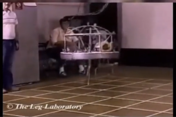

后来，雷伯特又做出一个四足机器人，即BigDog的雏形。不久，雷伯特将主要从事研究与机器人相关的控制、机器视觉方面技术的CMU leg实验室，从卡内基·梅隆大学搬到了麻省理工，逐渐孵化出波士顿动力的雏形。

起初，波士顿动力的主要服务对象是美国军方，并获得美国军方超千万美元的投资。在此期间，波士顿动力推出了许多产品，包括声名大噪的四足机器人BigDog、阿尔法狗LS3、四足机器人Cheetah（猎豹）和可自由跳跃旋转的Wildcat（野猫）等。

_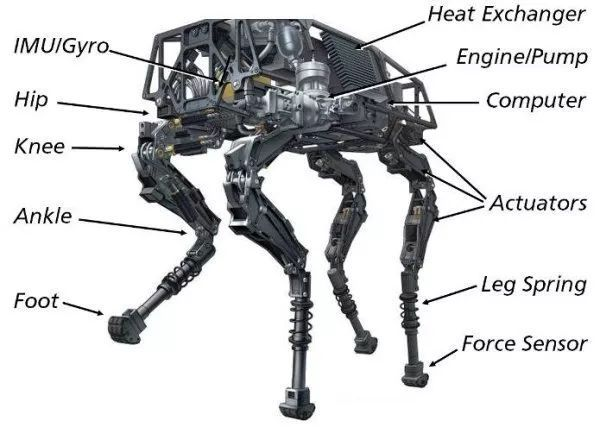
_

_BigDog_

BigDog在2005年左右面世，高度约为1米，重量约为109公斤，可以背负45公斤的重物进行自由行走或奔跑，最快移动速度可达6.4公里/小时。

在波士顿公司发布的宣传视频中，BigDog在装载着重物的情况下，仍能对人类从其侧面的脚踢做出灵敏的反应，不会被踹倒。在实际运用中，BigDog主要帮助美军背负装备、运输物资。不过因为BigDog噪音太大，无法在战斗中使用，项目只能中止。

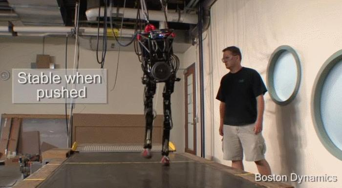

_petman_

尽管项目中止了，但在美国军方的支持下，波士顿动力开始重点投入对双足机器人的研究工作，并从BigDog中改进出了一款人形双足机器人Petman。经过一段时间研究后，2013年，由双足机器人Petman迭代而成的Atlas原型机亮相。

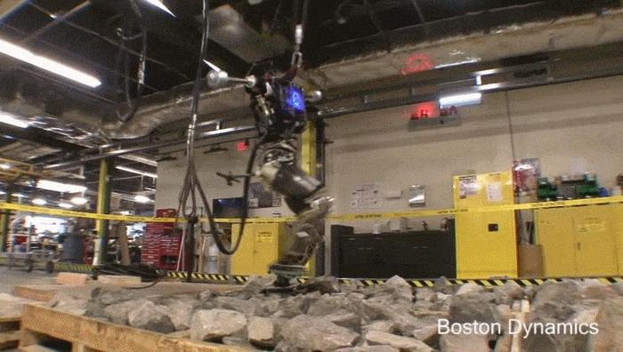

_Atlas初代机_

初代Atlas专为各种搜救任务设计，身高近1.9米，重150公斤，身上还缀着一条电缆来外接电源。但它已经可以实现走路和跳跃等基本动作，遭重击后能单腿站立。但当时的Atlas还要靠钢缆辅助才能完成一系列动作。

**2、谷歌阶段：Atlas和Spot机器人的进化**

2013年底，波士顿动力被Google以30亿美元收购。由此，波士顿动力也中止了与军方的合同。

进入Google 麾下后，波士顿动力继续完善两款重磅产品——人形机器人Atlas和Spot系列机器狗。

被收购第三年后，新一代Atlas终于正式亮相，但这一次大的改进是摒弃了传统的接线供电，采用激光雷达和机器视觉实现了自主导航、定位和行走。

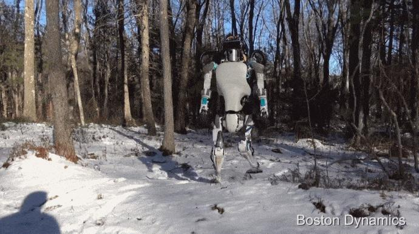

在此期间，波士顿动力推出了早期的Spot四足机器人。在公司发布的视频中，相较BigDog，Spot实现了低噪运行，可以借助两条肢体在原地跳跃而不摔倒，并且可以灵活上下楼梯。

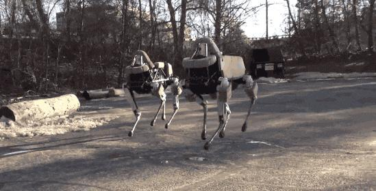

_Spot_

之后推出的Spot Mini，重量仅为25公斤，比Spot更加小巧轻便，并在头部增设了一幅机械臂，可以灵活操控物体。

尽管如此，本意强强联合的Google，在对波士顿动力持续投入研究资金与科技资源后，发觉其尖端技术依然离落地变现有不小距离，在3年之后还是选择将波士顿动力出售。

**3、软银阶段：商业化进程第一步**

2017年，软银集团以不公布价格的方式，从Google手里拿到了波士顿动力控制权。

尽管没有透露软银为公司提供了多少研发费用，但马克·雷伯特表示，无论是Google还是软银，都为公司提供了充足的资金。

在充足的资金支持下，波士顿动力开始着力将研究成果进行商业化。波士顿动力CEO马克·雷伯特曾在外媒论坛上表示，公司的发展有两个策略方向，一是通过长期的投资，打造出人类梦想中的机器人；同时致力于打造机器人商品。

在打造人类梦想中的机器人方面，从2016年至2020年间，站在机器人研究金字塔尖的Atlas飞速进化，外表越来越酷炫。Atlas改用了锂离子电池组，液压驱动系统的具有强悍的负载能力，在保持稳定性的同时，体积也更小。

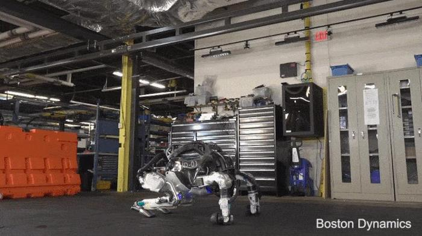

其技能的迭代肉眼可见，仅仅过去一年，比起在2016年走路还踉踉跄跄的样子，Atlas的动作明显流畅了很多，不仅能在台阶之间跳跃，甚至还能来个后空翻。2018年，Atlas学会了跑步，能跨越障碍物，一步步跃上宽阔的台阶。次年，它已经能连续跳跃、翻滚和倒立。

2020年6月，波士顿动力迈出了商业化的重要一步。Spot Mini 以74500美元，折合人民币约50万元的价格发售。在理想场景中，Spot Mini可应用于警署、石油公司、机场建筑工地、还能充当雪橇犬、牧羊犬。

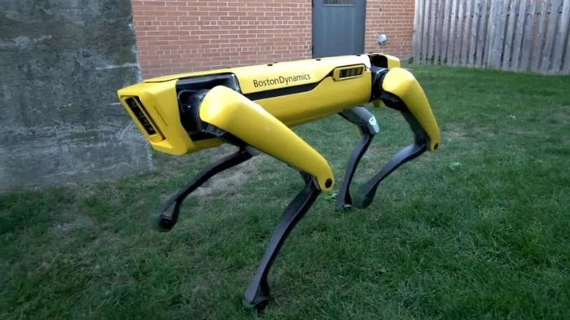

_Spot Mini_

下半年，波士顿动力宣布四足机器人Spot进入加拿大、欧洲市场。波士顿首席执行官Robert Playter曾透露，截至2020年9月份，其已经出售或者租赁了250个机器人，而且销售速度在增加。

**4、现代汽车阶段：人机协作的可能**

但历史在重复，同样在三年后，波士顿动力被软银出售。2020年底，现代汽车集团以9.21亿美元价格接手波士顿动力，直到2021年6月才完成收购。波士顿动力似乎受易主的影响不大，继续发布了Atlas跳舞的视频。

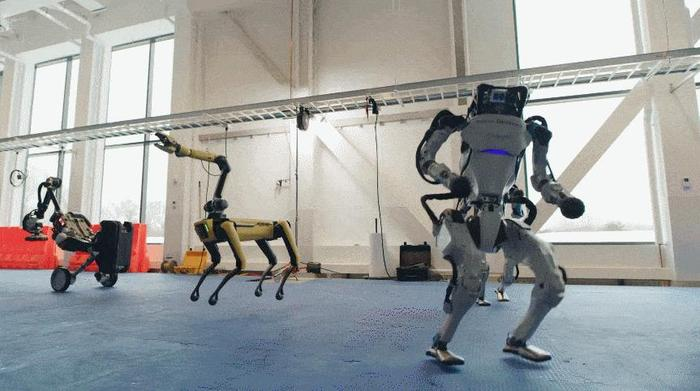

2022年9月，现代汽车和波士顿动力宣布初始投资超过4亿美元，启动新的波士顿动力人工智能研究所。这意味着波士顿动力或再将研发和产业化摆到同等位置。

如今，Spot已经正式走入现代汽车工厂，而Atlas也能靠自身传感器感知环境，自主行动。除跑酷、跳舞，持续穿越台阶、跑过斜坡外，还能在工厂场景中协助工人一同办公。 业界同样猜测，波士顿动力会与现代汽车的智能出行业务结合起来，创造出类似变形金刚的无人驾驶智能车。

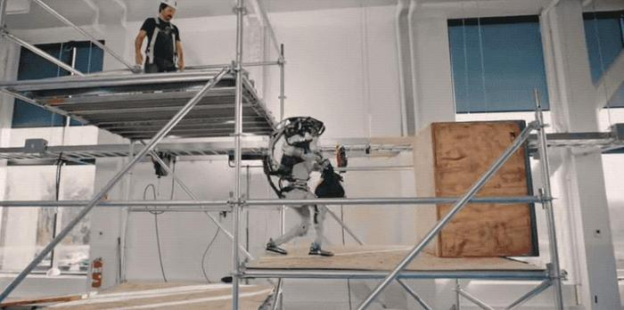

#### 02、波士顿动力机器人厉害在哪？

“我爱机器人，我的长期目标是机器人像动物和人一样运动自如。”

在雷伯特看来，要达到硬件、软件以及运动行为三者的协调，才能达成其理想的机器人。简而言之就是需具备三项能力：平衡性和动态运动能力、运动控制能力以及移动感知能力。

一个性能优越的足式机器人，能在任意地方、任何地形保持平衡，自由活动，并且可以灵活地操控物体，在移动的过程中轻松完成各项操作任务，同时可以感知空间中物体的稳定存在，有效避开障碍。

譬如从A点到B点的移动，机器人首先要对环境有一定的感知能力，从而规划出一条合理的路线，使用运动控制算法测算出合理的“关节”力量配比。当机器人开始移动时还需要“关节”快速响应，准确完成预期动作。

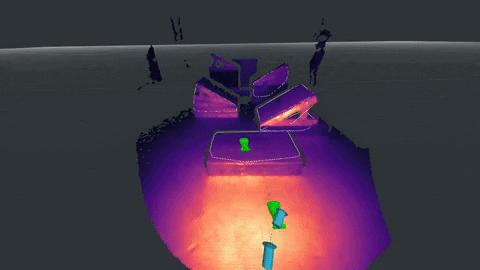

_Atlas第一视角的路线规划_

当遇到障碍物时，还需要理解并考虑障碍物的属性、质量和需要使用的“力”等。比如遇到一个塑料袋，不会将其判断成一个实体。

波士顿动力的技术领域主要涉及液压驱动和电液混合驱动、步态规划、平衡控制、复杂地形动态规划以及自我回正等运动控制技术，这些技术也保证了机器人具有较强的运动能力。

液压驱动的难度在于，使用液压系统的设备必须配备缓冲设备（蓄能器），加之整个液压系统工作介质的压缩性， 导致机器人模型的非线性程度陡然增加，仿真难度极大。

不过，液压驱动的显著优势是其功重比非常大，响应速度快、控制精度高且具备极高的负重能力和爆发力。在同样的空间内，用液压元件所做的功是电机的数倍甚至是数十倍。如果说几个电驱的机器人能拉动一辆卡车，那么一个液压的机器人就能拉动一架中型飞机。

此外，仅在步态规划方面，波士顿动力就曾申请许多专利。包括使用控制器控制阀适时进行开关动作，实现按需高功率或低功率模式切换；通过判断关节承受的载荷类型和大小，以选择适当的液压或电动驱动器，使得机器人的功率消耗最低。这一系列的专利，都有助于液压系统运行更加高效、减少功耗。

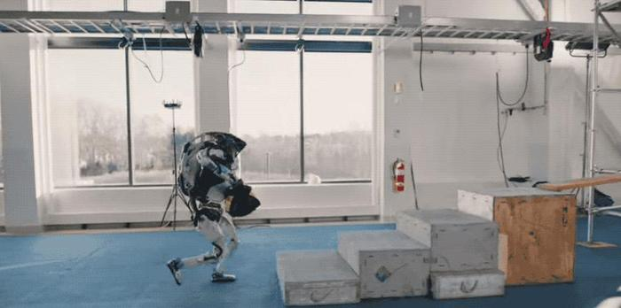

波士顿动力的产品先进性，除了依赖顶尖团队及创始人的热爱外，美国的机器人生态功不可没。

从上世纪六七十年代起，美国就占据着全球机器人技术的制高点。

世界上最早的工业机器人Unimate（尤尼梅特）、第一台带有触觉传感器的机器人、第一个智能移动机器人——夏克机器人、全自动六轴关节机械臂——斯坦福机械臂都诞生在美国。

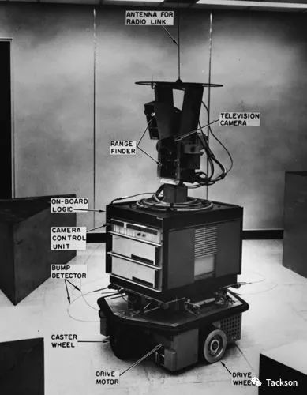

_第一台移动机器人Shakey_

在高精技术的引领下，形成了美国机器人的四个创业创新公司聚集区，分别是硅谷、波士顿、匹茨堡和底特律。

其中，波士顿被称为“人工智能”诞生地，其所在的马萨诸塞州自工业革命起，便是美国制造业中心，更聚集了麻省理工学院、哈佛大学、塔夫茨大学、波士顿大学等诸多知名院校、以及雷神公司、宝丽来等新兴科技制造公司。

在二战中，凭借MIT的创新力以及区域制造力，波士顿成为了二战期间美国最重要的军事研发、制造中心之一，128公路沿途遍布实验室，被称为“科研一条街”。

良好的产业生态以及人文环境，在某种程度上成就了波士顿动力。一家科技新星的冉冉升起，永远无法只靠单打独斗，而是要整个产业生态的奠基、整条产业链上的协同。

高工移动机器人在与多位行业人士的接触中，他们也都表达了对国内产业链不断完善、升级的期冀。往往生态优先，才会有企业领先。

波士顿动力沿袭了美国精研技术之风，也同样继承了其弊端：学术与产业脱离，导致机器人规模化落地缓慢。

美国技术领先，在早期却没能采取积极的措施推动技术的产业化，导致工业机器人在市场应用中处于劣势。

八十年代，随着日本及西欧国家在高新技术领域的崛起，美国与日本在以汽车为首的制造业短兵相接，最终日本更胜一筹，于1980年跃居世界最大汽车生产国宝座。这一年，也被业界称为“机器人元年”。

为扭转劣势，联邦政府抓住机遇出台了一系列政策法规，推动政府与大学的机器人研究成果向产业界转移，例如著名的《拜杜法案》，为期十年的“战略计算倡议”等系列法规。

这些政策成效显著。1986年美国机器人产量为1984年的17倍，1990年达1986年的10倍。

但随着全球化进程加速，中国、欧盟、日本、韩国等机器人技术崛起，美国的机器人地位也持续受到冲击挑战。

作为一个典型的学院派创业公司，波士顿动力也重技术发展而轻视了商业化落地，创始人雷伯特对研发机器人的追求胜于对盈利的渴望。他曾表示，“没有经历至少25年潜心研究的机器人产品，不足以商业化。”

因此，直到2020年，波士顿动力的商业化进程才正式起步。而商业化进程姗姗来迟是一方面，作为机器人技术的顶尖公司，波士顿动力的落地困境还有更深层次的原因。

#### 03、人形机器人困境

弗若斯特沙利文预测，到2026年，全球人形机器人市场规模将达到80亿美元；高盛预计，到2035年，在蓝海市场情景下，人形机器人市场能够达到1540亿美元的规模。

与未来广阔市场前景割裂的是，当前人形机器人公司的生存现状颇有些惨淡。

波士顿动力三次收购，身价从2013年被谷歌收购时的30亿美元，缩水至现在的9.21亿美元。去年4月份，著名的本田阿西莫（ASIMO）机器人便正式宣布退役，结束了22年的职业生涯 。

如何找场景、实现大规模落地？这是摆在所有移动机器人企业面前的难题。

首先是价格。波士顿动力正式开售的Spot Mini，售价为52万人民币左右，据称Atlas，售价则是200万美元。

价格居高不下，主要来自零部件成本。据报道，人形机器人整体的自由度/关节数量通常为20个至50个，一个自由度对应一台伺服电机，国外电机价格通常为5000至6000元，甚至上万元，国产电机价格也在2000元以上。因此一台人形机器人售价百万美元并不鲜见。

如此高昂的价格，注定无法在C端大面积铺开，因此波士顿动力主要的客户群还是集中在B端。但B端用户对于成本与价格的考量往往比C端用户更加理性且严格。

波士顿动力机器人功能多样，配置先进，堪称当下机器人技术的“顶配”。但对于建筑或能源开采行业的用户而言，他们所需要用到的只是其中的一个或几个功能，性价比并不高，并且还有更廉价的替代方案。

具体到落地方面，更为尴尬的是，人形机器人的续航相当差。人形机器人能耗较大，波士顿动力的Atlas和Spot Mini，续航时约为90分钟，而大部分双足的人形机器人连续工作时间都在2小时以内。这样的续航时间，显然不能支持机器人真正深入工业场景工作。

因此，尽管Spot已相对廉价，但据媒体报道，在出售半年后，Spot也仅被卖出了大约400台。而当机器人久久无法实现其商业价值，波士顿动力也只能迎来一次次被收购。

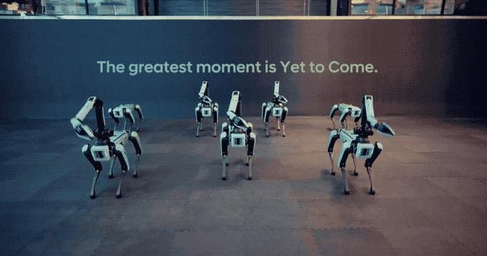

为促进人形机器人落地，近年来，声名鹊起的特斯拉“擎天柱”、小米“铁大”面向的都是C端个人消费者。“擎天柱”试图将人形机器人的售价打到2万美元以下，主要的措施就是以电驱替代液驱，实现人形机器人产品标准化、低成本和可量产。

不过电驱比起液驱，性能还有一定差距。有行业人士认为，只有将电驱提升至Atlas水平，并且机器人续航时间应达到3至10个小时。人形机器人商用才有望迎来爆发式成长。

只是市场注定会落后技术，而走在最前列的波士顿动力尤甚。放大来说，这是整个移动机器人行业的困境。

我国移动机器人尽管发展多年，市场广阔，但大部分公司仍未实现盈利。不少专业人士的共同感受是，移动机器人尽管性能稳定，功能多样，但放眼整个市场，还未找到它们合适的立足之地，距离市场放量还有一定差距。

尽管如此，波士顿动力无可替代的核心优势仍是尖端技术，如今“机代人”趋势不可逆转，机器人市场的爆发可见曙光。而唯有坚持技术创新，才能在未来的市场里掌控先机。

“在过去的40年里，机器人技术已经取得了长足的进步，但我们还有很长的路要走。”马克·雷伯特说道。

商业变现的危机仍在持续。但未来，波士顿动力仍致力让机器人更智能、敏捷灵巧，更易用，也更像人。