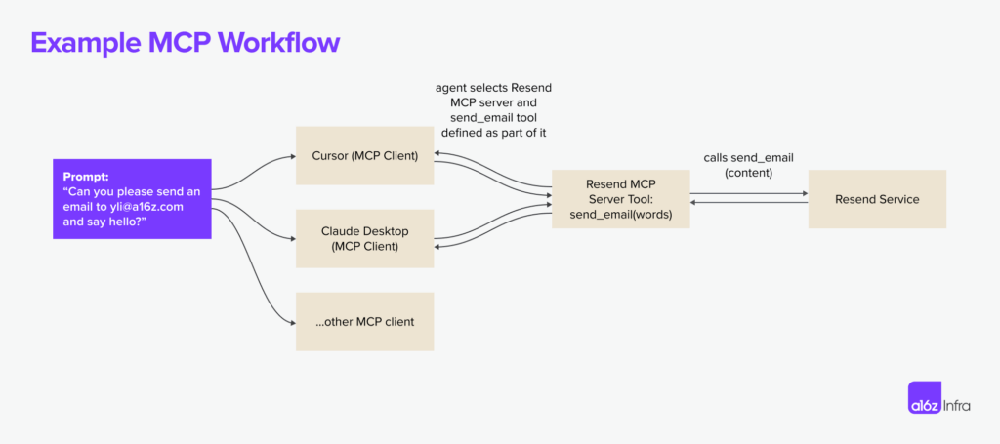
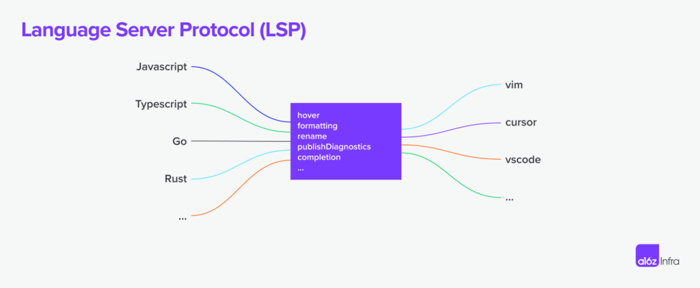

Published Time: 2025-03-20T16:01:33Z

A Deep Dive Into MCP and the Future of AI Tooling | Andreessen Horowitz
===============

**ABOUT US**

*   [News & Content](https://a16z.com/news-content/)
*   [Portfolio](https://a16z.com/portfolio/)
*   [Team](https://a16z.com/team/)
*   [About](https://a16z.com/about/)
*   [Jobs](https://jobs.a16z.com/)
*   [Connect](https://a16z.com/connect/)

**What we offer**

*   [AI](https://a16z.com/ai/)
*   [American Dynamism](https://a16z.com/american-dynamism/)
*   [Bio + Health](https://a16z.com/bio-health/)
*   [Consumer](https://a16z.com/consumer/)
*   [Crypto](https://a16zcrypto.com/)
*   [Enterprise](https://a16z.com/enterprise/)
*   [Fintech](https://a16z.com/fintech/)
*   [Games](https://a16z.com/games/)
*   [Infrastructure](https://a16z.com/infra/)
*   [Seed](https://a16z.com/seed/)
*   [Speedrun](https://speedrun.a16z.com/)
*   [Growth](https://a16z.com/growth/)
*   [Cultural Leadership Fund](https://a16z.com/clf/)
*   [Talent x Opportunity](https://a16z.com/txo/)
*   [Perennial](https://a16z.com/perennial/)

**FOLLOW a16z**

*   
*   
*   
*   
*   

[See More Results](https://a16z.com/search/)

###### TOP SUGGESTIONS

*   [AI](https://a16z.com/a-deep-dive-into-mcp-and-the-future-of-ai-tooling/#)
*   [Machine & Deep Learning](https://a16z.com/a-deep-dive-into-mcp-and-the-future-of-ai-tooling/#)
*   [Infrastructure](https://a16z.com/a-deep-dive-into-mcp-and-the-future-of-ai-tooling/#)
*   [Fintech](https://a16z.com/a-deep-dive-into-mcp-and-the-future-of-ai-tooling/#)
*   [Product, Design & Engineering](https://a16z.com/a-deep-dive-into-mcp-and-the-future-of-ai-tooling/#)
*   [Education](https://a16z.com/a-deep-dive-into-mcp-and-the-future-of-ai-tooling/#)
*   [Marketplaces](https://a16z.com/a-deep-dive-into-mcp-and-the-future-of-ai-tooling/#)
*   [Web3](https://a16z.com/a-deep-dive-into-mcp-and-the-future-of-ai-tooling/#)

A Deep Dive Into MCP and the Future of AI Tooling
=================================================

[Yoko Li](https://a16z.com/author/yoko-li/)

[share](https://a16z.com/a-deep-dive-into-mcp-and-the-future-of-ai-tooling/#)

*   [Copy Link](https://a16z.com/a-deep-dive-into-mcp-and-the-future-of-ai-tooling/)
*   [Email](mailto:?subject=A%20Deep%20Dive%20Into%20MCP%20and%20the%20Future%20of%20AI%20Tooling&body=https://a16z.com/a-deep-dive-into-mcp-and-the-future-of-ai-tooling/)
*   [X](https://a16z.com/a-deep-dive-into-mcp-and-the-future-of-ai-tooling/)
*   [LinkedIn](https://a16z.com/a-deep-dive-into-mcp-and-the-future-of-ai-tooling/)
*   [Facebook](https://a16z.com/a-deep-dive-into-mcp-and-the-future-of-ai-tooling/)
*   [Hacker News](https://a16z.com/a-deep-dive-into-mcp-and-the-future-of-ai-tooling/)
*   [WhatsApp](https://a16z.com/a-deep-dive-into-mcp-and-the-future-of-ai-tooling/)
*   [Flipboard](https://a16z.com/a-deep-dive-into-mcp-and-the-future-of-ai-tooling/)
*   [Reddit](https://a16z.com/a-deep-dive-into-mcp-and-the-future-of-ai-tooling/)

[Table of Contents](https://a16z.com/a-deep-dive-into-mcp-and-the-future-of-ai-tooling/#)

**Table of Contents**

*   [What is MCP?](https://a16z.com/a-deep-dive-into-mcp-and-the-future-of-ai-tooling/#section--1)
*   [Popular use cases](https://a16z.com/a-deep-dive-into-mcp-and-the-future-of-ai-tooling/#section--2)
*   [The MCP ecosystem](https://a16z.com/a-deep-dive-into-mcp-and-the-future-of-ai-tooling/#section--3)
*   [Future possibilities](https://a16z.com/a-deep-dive-into-mcp-and-the-future-of-ai-tooling/#section--4)
*   [Implications of AI tooling](https://a16z.com/a-deep-dive-into-mcp-and-the-future-of-ai-tooling/#section--5)
*   [The road ahead](https://a16z.com/a-deep-dive-into-mcp-and-the-future-of-ai-tooling/#section--6)

Posted March 20, 2025

Since OpenAI released function calling in 2023, I’ve been thinking about what it would take to unlock an ecosystem of agent and tool use. As the foundational models get more intelligent, agents’ ability to interact with external tools, data, and APIs becomes increasingly fragmented: Developers need to implement agents with special business logic for every single system the agent operates in and integrates with.

It’s clear that there needs to be a standard interface for execution, data fetching, and tool calling. **APIs were the internet’s first great unifier—creating a shared language for software to communicate — but AI models lack an equivalent.**

Model Context Protocol (MCP), introduced in November 2024, has gained significant traction within developer and AI communities as a potential solution. In this post, we’ll explore **what MCP is, how it changes the way AI interacts with tools, what developers are already building with it, and the challenges that still need solving.**

Let’s dive in.

What is MCP?
--------------

**MCP is an open protocol that allows systems to provide context to AI models in a manner that’s generalizable across integrations.** The protocol defines how the AI model can call external tools, fetch data, and interact with services. As a concrete example, below is how the Resend MCP server works with multiple MCP clients.

The idea is not new; MCP [took inspiration from the LSP (Language Server Protocol)](https://spec.modelcontextprotocol.io/specification/2024-11-05/#:~:text=MCP%20takes%20some%20inspiration%20from,the%20ecosystem%20of%20AI%20applications). In LSP, when a user types in an editor, the client queries the language server to autocomplete suggestions or diagnostics.

Where MCP extends beyond LSP is in its agent-centric execution model: LSP is mostly reactive (responding to requests from an IDE based on user input), whereas MCP is designed to support autonomous AI workflows. Based on the context, **AI agents can decide which tools to use, in what order, and how to chain them together to accomplish a task.** MCP also introduced a human-in-the-loop capabilities for humans to provide additional data and approve execution.

Popular use cases today 
------------------------

With the right set of MCP servers, users can turn every MCP client into an “everything app.”

Take Cursor as an example: Although Cursor is a code editor, it’s also a well-implemented MCP client. End users can turn it into a Slack client using the [Slack MCP server](https://github.com/modelcontextprotocol/servers/tree/main/src/slack), an email sender using [Resend MCP server](https://github.com/resend/mcp-send-email/tree/main), and an image generator using the [Replicate MCP server](https://github.com/deepfates/mcp-replicate). A more powerful way to leverage MCPs is installing multiple servers on one client to unlock new flows: Users can install a server to generate the [front-end UI](https://github.com/21st-dev/magic-mcp) from Cursor, but also ask the agent to use an image-generation MCP server to generate a hero image for the site.

Beyond Cursor, most use cases today can be summarized into either dev-centric, local-first workflows, or net-new experiences using LLM clients.

### Dev-centric workflows 

For developers who live and breathe in code every day, a common sentiment is, “I don’t want to leave my IDE to do _x_”. MCP servers are great ways to make this dream a reality.

Instead of switching to Supabase to check on the database status, developers can now use the [Postgres MCP server](https://github.com/modelcontextprotocol/servers/tree/main/src/postgres) to execute read-only SQL commands and the [Upstash MCP server](https://github.com/upstash/mcp-server) to create and manage cache indices right from their IDE. When iterating on code, developers can also leverage the [Browsertools MCP](https://github.com/AgentDeskAI/browser-tools-mcp) to give coding agents access to a live environment for feedback and debugging.

_An example of how Cursor agent uses Browsertools to get access to console logs and other real-time data and debug more efficiently._

Outside of workflows that interact with a developer tool, a new use that MCP servers unlock is being able to add highly accurate context to coding agents by either [crawling a web page](https://github.com/mendableai/firecrawl-mcp-server) or [auto-generating an MCP server](https://mintlify.com/blog/generate-mcp-servers-for-your-docs) based on the documentation. Instead of manually wiring up integrations, developers can spin up MCP servers straight from existing documentation or APIs, making tools instantly accessible to AI agents. This means less time spent on boilerplate and more time actually using the tools — whether it’s pulling in real-time context, executing commands, or extending an AI assistant’s capabilities on the fly.

### Net-new experiences

IDEs like Cursor are not the only MCP clients available, even though they have received the most attention due to MCP’s strong appeal to technical users. For non-technical users, Claude Desktop serves as an excellent entry point, making MCP-powered tools more accessible and user-friendly to a general audience. Soon, we will likely see specialized MCP clients emerge for business-centric tasks such as customer support, marketing copywriting, design, and image editing, as these fields closely align with AI’s strengths in pattern recognition and creative tasks.

The design of an MCP client and the specific interactions it supports plays a crucial role in shaping its capabilities. A chat application, for instance, is unlikely to include a vector-rendering canvas, just as a design tool is unlikely to provide functionality for executing code on a remote machine. Ultimately, the **MCP client experience defines the overall MCP user experience** — and we have so much more to unlock when it comes to MCP client experience.

One example of this is how Highlight implemented the [@ command](https://x.com/PimDeWitte/status/1899829221813334449) to invoke any MCP servers on its client. The result is a new UX pattern in which the MCP client can pipe generated content into any downstream app of choice.

_An example of Highlight’s implementation of Notion MCP (plugin)._

Another example is the [Blender MCP server](https://x.com/sidahuj/status/1901632110395265452) use case: Now, amateur users who barely know Blender can use natural language to describe the model they want to build. We are seeing the text-to-3D workflow playing out in real time as the community implements servers for other tools like Unity and Unreal engine.

_An example of using Claude Desktop with [Blender MCP server](https://github.com/ahujasid/blender-mcp)._

Although we mostly think about servers and clients, the MCP ecosystem is gradually shaping up as the protocol evolves. This market map covers the most active areas today, although there are still many blank spaces. Knowing MCP is still in the early days, _we’re excited to add more players to the map as the market evolves and matures._ (And we will explore some of these future possibilities in the next section.)

On the MCP client side, **most of the high-quality clients we see today are coding-centric**. This is not surprising, since developers are usually early adopters of new technology, but, as the protocol matures, we expect to see more business-centric clients.

**Most of the MCP servers we see are local-first and focus on single players. This is a symptom of MCP presently only supporting SSE- and command-based connections.** However, we expect to see more MCP server adoption as the ecosystem makes remote MCP first-class and MCP adopts [Streamable HTTP transport](https://github.com/modelcontextprotocol/specification/pull/206).

There is also a new wave of MCP marketplace and server-hosting solutions emerging to make MCP server-discovery possible. Marketplaces like [Mintlify](https://mintlify.com/)’s [mcpt](https://www.mcpt.com/), [Smithery](https://smithery.ai/), and [OpenTools](https://opentools.com/) are making it easier for developers to discover, share, and contribute new MCP servers — much like how npm transformed package management for JavaScript or how RapidAPI expanded API discovery. This layer will be crucial for standardizing access to high-quality MCP servers, allowing AI agents to dynamically select and integrate tools on demand.

As MCP adoption grows, **infrastructure and tooling will play a critical role in making the ecosystem more scalable, reliable, and accessible**. Server generation tools like Mintlify, [Stainless](https://www.stainless.com/), and [Speakeasy](https://www.speakeasy.com/) are reducing the friction of creating MCP-compatible services, while hosting solutions like Cloudflare and Smithery are addressing deployment and scaling challenges. At the same time, **connection-management platforms like [Toolbase](https://gettoolbase.ai/)** are beginning to streamline local-first MCP key management and proxy.

Future possibilities 
---------------------

However, we are only in the early stages of the evolution of agent-native architecture. And although there is a lot of excitement on MCPs today, there are also many unsolved problems when building and shipping with MCP.

Some things to unlock in the next iteration of the protocol include:

### Hosting and multi-tenancy 

MCP supports a one-to-many relationship between an AI agent and its tools, but multi-tenant architectures (e.g., SaaS products) need to support many users accessing a shared MCP server at once. Having remote servers by default could be a near-term solution to make MCP servers more accessible, but many enterprises will also want to host their own MCP server and separate data and control planes.

A streamlined toolchain to support at-scale MCP server deployment and maintenance is the next piece that can unlock broader adoption.

### Authentication 

MCP does not currently define a standard authentication mechanism for how clients authenticate with servers, nor does it provide a framework for how MCP servers should securely manage and delegate authentication when interacting with third-party APIs. Authentication is currently left up to individual implementations and deployment scenarios. In practice, MCP’s adoption so far seems to be on local integrations where explicit authentication isn’t always needed.

A better authentication paradigm could be one of the big unlocks when it comes to remote MCP adoption. From a developer’s perspective, a unified approach should cover:

*   **Client authentication:** standards methods like OAuth or API tokens for client-server interactions
*   **Tool authentication:** helper functions or wrappers for authenticating with third-party APIs
*   **Multi-user authentication:** tenant-aware authentication for enterprise deployments

### Authorization 

Even if a tool is authenticated, who should be allowed to use it and how granular should their permissions be? MCP lacks a built-in permissions model, so access control is at the session level — meaning a tool is either accessible or completely restricted. While future authorization mechanisms could shape finer-grained controls, the current approach relies on [OAuth 2.1-based authorization flows](https://github.com/modelcontextprotocol/specification/blob/5c35d6dda5bf04b5c8c76352c9f7ee18d22b7a08/docs/specification/draft/basic/authorization.md) that grant session-wide access once authenticated. This creates additional complexity as more agents and tools are introduced — each agent typically requires its own session with unique authorization credentials, leading to a growing web of session-based access management.

### Gateway

As MCP adoption scales, a gateway could act as a centralized layer for authentication, authorization, traffic management, and tool selection. Similar to API gateways, it would enforce access controls, route requests to the right MCP servers, handle load balancing, and cache responses to improve efficiency. This is especially important for multi-tenant environments, where different users and agents require distinct permissions. A standardized gateway would simplify client-server interactions, improve security, and provide better observability, making MCP deployments more scalable and manageable.

### MCP server discoverability and usability

Currently, finding and setting up MCP servers is a manual process, requiring developers to locate endpoints or scripts, configure authentication, and ensure compatibility between the server and the client. Integrating new servers is time-consuming, and AI agents can’t dynamically discover or adapt to available servers.

Based on [Anthropic’s talk](https://youtu.be/kQmXtrmQ5Zg?t=4927) at the AI engineer conference last month, though, **it sounds like a MCP server registry and discovery protocol is coming**. This could unlock the next phase of adoption for MCP servers.

### Execution environment 

Most AI workflows require multiple tool calls in sequence — but MCP lacks a built-in workflow concept to manage these steps. It’s not ideal to ask every client to implement resumability and retryability. Although today we see developers exploring solutions like [Inngest](https://www.inngest.com/) to make this work, promoting stateful execution to a first-class concept will clear up the execution model for most developers.

### Standard client experience 

A common question we’ve heard from the developer community is how to think about tool selection when building an MCP client: Does everyone need to implement their own RAG for tools, or is there a layer waiting to be standardized?

Beyond tool selection, there’s also no unified UI/UX patterns for invoking tools (we have seen everything ranging from slash commands to pure natural language). A standard client-side layer for tool discovery, ranking and execution could help create a more predictable developer and user experience.

### Debugging

Developers of MCP servers often discover that it’s hard to make the same MCP server work across clients easily. More often than not, each MCP client has its own quirks, and client-side traces are either missing or hard to find, making debugging MCP servers an extremely difficult task. As the world starts to build more remote-first MCP servers, a new set of tooling is needed to make the dev experience more streamlined across local and remote environments.

Implications of AI tooling
----------------------------

MCP’s dev experience reminds me of API development in the 2010s. The paradigm is new and exciting, but the toolchains are in the early days. If we fast-forward to years from now, what would happen if MCP becomes the de facto standard for AI-powered workflows? Some predictions:

*   **The competitive advantage of dev-first companies will evolve** from shipping the best API design to also shipping the best collection of tools for agents to use. If MCPs will have the ability to autonomously discover tools, providers of APIs and SDKs will need to make sure their tooling is easily discoverable from search and be differentiated enough for the agent to pick for a particular task. This can be a lot more granular and specific than what human developers look for. 
*   **A new pricing model may emerge** if every app becomes a MCP client and every API becomes a MCP server: Agents may pick the tools more dynamically, based on a combination of speed, cost, and relevance. This may lead to a more market-driven tool-adoption process that picks the best-performing and the most modular tool instead of the most widely adopted one. 
*   **Documentation will become a critical piece of MCP infrastructure** as companies will need to design tools and APIs with clear, machine-readable formats (e.g., [llms.txt](https://mintlify.com/blog/simplifying-docs-with-llms-txt)) and make MCP servers a de facto artifact based on existing documentation. 
*   **APIs alone are no longer enough, but can be great starting points.** Developers will discover that the mapping from API to tools is rarely 1:1. Tools are a higher abstraction that makes the most sense for agents at the time of task execution — instead of simply calling send\_email(), an agent may opt for draft\_email\_and\_send() function that includes multiple API calls to minimize latency. MCP server design will be scenario- and use-case-centric instead of API-centric. 
*   **There will be a new mode of hosting** if every software by default becomes a MCP client, because the workload characteristics will be different from traditional website hosting. Every client will be multi-step in nature and require execution guarantees like resumability, retries, and long-running task management. Hosting providers will also need real-time load balancing across different MCP servers to optimize for cost, latency, and performance, allowing AI agents to choose the most efficient tool at any given moment.

MCP is already reshaping the AI-agent ecosystem, but the next wave of progress will be defined by how we address the foundational challenges. If done right, MCP could become the default interface for AI-to-tool interactions and unlock a new generation of autonomous, multi-modal, and deeply integrated AI experiences.

If adopted widely, MCPs can represent a shift in how tools are built, consumed, and monetized. We are excited to see where the market takes them. This year will be pivotal: Will we see the rise of a unified MCP marketplace? Will authentication become seamless for AI agents? Can multi-step execution be formalized into the protocol?

If you are building in this space or have thoughts on how the space evolves, please reach out to yli@a16z.com. It’s time to build!

### Stay up to date on the latest from a16z Infra team

Sign up for our a16z newsletter to get analysis and news covering the latest trends reshaping AI and infrastructure.

First Name \*

Business Email Address \*

Subscribe

###### Thanks for signing up.

Check your inbox for a welcome note.

[MANAGE MY SUBSCRIPTIONS](https://info.a16z.com/Manage-Subscription.html) By clicking the Subscribe button, you agree to the [Privacy Policy](https://a16z.com/terms-of-use-privacy/).

**Contributor**

*   [ **Yoko Li** is a partner at Andreessen Horowitz, where she focuses on enterprise and infrastructure.](https://a16z.com/author/yoko-li/)
    *   Follow
    *   [X](https://twitter.com/stuffyokodraws)
    *   [Linkedin](https://www.linkedin.com/in/yokoli/)

**More From this Contributor**

*   [**Automating Developer Email with MCP and Al Agents** Zeno Rocha and Yoko Li](https://a16z.com/podcast/automating-developer-email-with-mcp-and-al-agents/)
*   [**From Prompt to Product: The Rise of AI-Powered Web App Builders** Justine Moore, Yoko Li, Gabriel Vasquez, Marco Mascorro, and Bryan Kim](https://a16z.com/ai-web-app-builders/)
*   [**Investing in Stainless** Jennifer Li and Yoko Li](https://a16z.com/announcement/investing-in-stainless/)
*   [**Investing in Resend** Yoko Li, Jennifer Li, and Martin Casado](https://a16z.com/announcement/investing-in-resend/)
*   [**Investing in Mintlify** Jennifer Li and Yoko Li](https://a16z.com/announcement/investing-in-mintlify/)

The views expressed here are those of the individual AH Capital Management, L.L.C. (“a16z”) personnel quoted and are not the views of a16z or its affiliates. Certain information contained in here has been obtained from third-party sources, including from portfolio companies of funds managed by a16z. While taken from sources believed to be reliable, a16z has not independently verified such information and makes no representations about the enduring accuracy of the information or its appropriateness for a given situation. In addition, this content may include third-party advertisements; a16z has not reviewed such advertisements and does not endorse any advertising content contained therein.

This content is provided for informational purposes only, and should not be relied upon as legal, business, investment, or tax advice. You should consult your own advisers as to those matters. References to any securities or digital assets are for illustrative purposes only, and do not constitute an investment recommendation or offer to provide investment advisory services. Furthermore, this content is not directed at nor intended for use by any investors or prospective investors, and may not under any circumstances be relied upon when making a decision to invest in any fund managed by a16z. (An offering to invest in an a16z fund will be made only by the private placement memorandum, subscription agreement, and other relevant documentation of any such fund and should be read in their entirety.) Any investments or portfolio companies mentioned, referred to, or described are not representative of all investments in vehicles managed by a16z, and there can be no assurance that the investments will be profitable or that other investments made in the future will have similar characteristics or results. A list of investments made by funds managed by Andreessen Horowitz (excluding investments for which the issuer has not provided permission for a16z to disclose publicly as well as unannounced investments in publicly traded digital assets) is available at [https://a16z.com/investments/](https://a16z.com/investments/).

Charts and graphs provided within are for informational purposes solely and should not be relied upon when making any investment decision. Past performance is not indicative of future results. The content speaks only as of the date indicated. Any projections, estimates, forecasts, targets, prospects, and/or opinions expressed in these materials are subject to change without notice and may differ or be contrary to opinions expressed by others. Please see [https://a16z.com/disclosures](https://a16z.com/disclosures) for additional important information.

#### Stay up to date on the latest from a16z Infra team

Sign up for our a16z newsletter to get analysis and news covering the latest trends reshaping AI and infrastructure.

First Name \*

Business Email Address \*

Subscribe

#### Thanks for signing up.

Check your inbox for a welcome note.

[MANAGE MY SUBSCRIPTIONS](https://info.a16z.com/Manage-Subscription.html) By clicking the Subscribe button, you agree to the [Privacy Policy](https://a16z.com/terms-of-use-privacy/).

**RECOMMENDED FOR YOU**

*   **[A Policy Blueprint for US Investment in AI Talent and Infrastructure](https://a16z.com/a-policy-blueprint-for-us-investment-in-ai-talent-and-infrastructure/)** [Matt Perault](https://a16z.com/author/matt-perault/) [Read More](https://a16z.com/a-policy-blueprint-for-us-investment-in-ai-talent-and-infrastructure/)
*   **[a16z’s Recommendations for the National AI Action Plan](https://a16z.com/a16zs-recommendations-for-the-national-ai-action-plan/)** [Jai Ramaswamy](https://a16z.com/author/jai-ramaswamy/), [Collin McCune](https://a16z.com/author/collin-mccune/), and [Matt Perault](https://a16z.com/author/matt-perault/) [Read More](https://a16z.com/a16zs-recommendations-for-the-national-ai-action-plan/)
*   **[The American Dynamism 50: Companies Shaping the Fight of the Future](https://a16z.com/american-dynamism-50-2025/)** [Katherine Boyle](https://a16z.com/author/katherine-boyle/), [David Ulevitch](https://a16z.com/author/david-ulevitch/), [Erin Price-Wright](https://a16z.com/author/erin-price-wright/), and [Ryan McEntush](https://a16z.com/author/ryan-mcentush/) [Read More](https://a16z.com/american-dynamism-50-2025/)
*   **[The Top 100 Gen AI Consumer Apps - 4th Edition](https://a16z.com/100-gen-ai-apps-4/)** [Olivia Moore](https://a16z.com/author/olivia-moore/) and [Daisy Zhao](https://a16z.com/author/daisy-zhao/) [Read More](https://a16z.com/100-gen-ai-apps-4/)
*   **[AI, Crypto, and Building the Next Internet with a16z’s Chris Dixon](https://a16z.com/ai-crypto-internet-chris-dixon/)** [David George](https://a16z.com/author/david-george/) and [Chris Dixon](https://a16z.com/author/chris-dixon/) [Read More](https://a16z.com/ai-crypto-internet-chris-dixon/)

[go to top](https://a16z.com/a-deep-dive-into-mcp-and-the-future-of-ai-tooling/#wrapper)

Software is eating the world

© 2025 Andreessen Horowitz

*   [Terms of Use](https://a16z.com/terms-of-use/)
*   [Conduct](https://a16z.com/conduct/)
*   [Privacy Policy](https://a16z.com/privacy-policy/)
*   [Disclosures](https://a16z.com/disclosures/)

© 2025 Andreessen Horowitz

*   
*   
*   
*   
*   

**Power User Menu**

*   [Home H](https://a16z.com/)

By navigating this website you agree to our [cookie policy](https://a16z.com/terms-of-use-privacy/).

*   [Accept](https://a16z.com/a-deep-dive-into-mcp-and-the-future-of-ai-tooling/#)
*   [Decline](https://a16z.com/a-deep-dive-into-mcp-and-the-future-of-ai-tooling/#)

 

