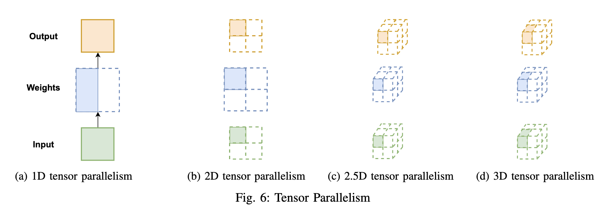

Title: 深度学习并行训练算法一锅炖: DDP, TP, PP, ZeRO

URL Source: https://www.cnblogs.com/marsggbo/p/16871789.html

Published Time: 2022-11-09T00:16:00.0000000+08:00

Markdown Content:
> 本文主要参考ColossalAI论文  
> Colossal-AI: A Unified Deep Learning System For Large-Scale Parallel Training  
> ColossalAI框架开源提供了本文介绍的所有并行训练: [https://github.com/hpcaitech/ColossalAI](https://github.com/hpcaitech/ColossalAI)

前言
--

本文会介绍几种流行的并行方法，包括

*   数据并行（data parallel）
*   模型并行（model parallel）
    *   tensor并行
    *   pipeline并行
    *   Sequence并行
*   Zero Redundancy Data Parallelism （ZeRO）

下图给出了这些并行方法的示意图，非常直观好懂。  

不过在介绍各种并行训练方法之前，我们首先对一些概念做一个声明，方便后面理解

模型训练过程中涉及到的参数主要包含两大类，_model data_ 和 _non-model data_，具体表示如下：

*   model data
    *   模型权重
    *   模型权重的梯度
    *   优化器的状态
*   non-model data
    *   模型逐层的特征向量（也叫作activations）

Data parallelism (DP)
---------------------

经典的数据并行算法是在多个设备上都拷贝一份完整的模型参数，彼此之间可以独立计算，所以每个设备传入的输入数据不一样​，这也是为什么叫数据并行。只不过，每隔一段时间（比如一个batch或者若干个batch）后需要彼此之间同步模型权重的梯度​。随着模型大小不断增大，单个GPU的内存已经无法容纳现如今的大模型，所以便有了后面会介绍的模型并行​。

DP下有很多优化算法，具体的可以看看我们实验室的相关综述

*   《[Communication-Efficient Distributed Deep Learning: A Comprehensive Survey](http://link.zhihu.com/?target=https%3A//arxiv.org/abs/2003.06307http:// "Communication-Efficient Distributed Deep Learning: A Comprehensive Survey")》
*   《[A Quantitative Survey of Communication Optimizations in Distributed Deep Learning](http://http//link.zhihu.com/?target=https%3A//ieeexplore.ieee.org/abstract/document/9275615/ "A Quantitative Survey of Communication Optimizations in Distributed Deep Learning")》

Model Parallelism (MP)
----------------------

Pipeline Parallelism (PP)
-------------------------

pipeline parallelism是比较常见的模型并行算法，它是模型做层间划分，即inter-layer parallelism。以下图为例，如果模型原本有6层，你想在2个GPU之间运行pipeline，那么每个GPU只要按照先后顺序存3层模型即可。

已经有很多Pipeline相关的研究工作了，例如PipeDream，GPipe，和Chimera。它们的主要目的都是降低bubble time。这里不做过多介绍。

Tensor Parallelism (TP)
-----------------------

前面介绍的Pipeline Parallelism是对模型层间做划分，叫inter-layer parallelism。那么另一种方式则是对模型层内做划分，即intra-layer Parallelism，也叫Tensor Parallelism。

### 1D Tensor Parallelism

Megatron-LM [\[1\]](https://www.cnblogs.com/marsggbo/p/16871789.html#fn1) 是最早提出1D Tensor并行的工作。该工作主要是为了优化transformer训练效率，把线性层按照行或者列维度对权重进行划分。如图4所示，原本线性层为\\(Y=W\_1W\_2X\\) ，这里将\\(W\_1\\)按列进行划分，将\\(W\_2\\)按行进行划分。这样，每个GPU只需要存一半的权重即可，最后通过All-reduce操作来同步Y的结果。当GPU数量为\\(N\\)时，每个GPU只需要存\\(\\frac{1}{N}\\)的权重即可，只不过每层输出需要用All-reduce来补全结果之后才能继续下一层的计算。

  
对于土豪公司，可以使用NVLink来连接GPU（如图5a），从而提供高带宽来降低通信开销。但是土豪终归是少数的，大部分公司和个人是没法承担这昂贵的硬件费用，因此比较常见的GPU连接方式是图5b，即节点内花点钱实现NVLink连接，节点之间通过PCIe连接。

1D Tensor并行对通信速度要求较高，不过1D在每层的输入和输出都有冗余的内存开销。以图4为例，我们可以看到虽然模型权重被划分了，但是每个GPU都有重复的输入\\(X\\),另外All-reduce之后每个GPU也会有重复的输出\\(Y\\)，所以后续一些工作尝试从这里做进一步改进,包括2D, 2.5D,和3D tensor并行。

### 2D Tensor Parallelism

2D Tensor Parallel [\[2\]](https://www.cnblogs.com/marsggbo/p/16871789.html#fn2) 基于SUMMA和Cannon矩阵相乘算法沿着两个不同的维度对 _输入数据_，_模型权重_，_每层的输出_ 进行划分。给定\\(N\\)个GPU，tensor会被划分成\\(N\\)个chunk（使用`torch.chunk`），每个GPU保存一个chunk。这\\(N\\)个GPU呈方形网络拓扑结构，即每行每列均为\\(\\sqrt{N}\\)个GPU。图6b展示了常见的4-GPU的节点划分示意图，假设tensor的维度大小是\\(\[P,Q\]\\)，那么划分后每个GPU上存的chunk大小即为\\(\[P/\\sqrt{N},Q/\\sqrt{N}\]\\)。至此，每个GPU都只会保存部分的输入输出以及部分的权重。虽然相比于1D Tensor并行，2D额外增加了模型权重的通信，但是需要注意的是当GPU数量很多的时候，每个GPU上分配的模型权重就会小很多，而且因为使用的All-reduce通信方式，所以2D也还是要比1D更高效的。

### 2.5D Tensor Parallelism

2.5D Tensor Parallel [\[3\]](https://www.cnblogs.com/marsggbo/p/16871789.html#fn3) 是受2.5D矩阵乘法算法 [\[4\]](https://www.cnblogs.com/marsggbo/p/16871789.html#fn4) 启发进一步对2D Tensor并行的优化。具体来说2.5D增加了 _depth_ 维度。当 _depth=1_ 时等价于2D；当 _depth\>1_ 时，

同样假设有\\(N\\)个GPU，其中\\(N=S^2\*D\\)，\\(S\\)类似于原来2D正方形拓扑结构的边长，而\\(D\\) 则是新增加的维度 _depth_ 。\\(D\\)可以由用户指定，\\(S\\) 则会自动计算出来了。所以一般来说至少需要8个GPU才能运行2.5D算法，即\\(S=2,D=2\\)。

### 3D Tensor Parallelism

3D Tensor Parallel [\[5\]](https://www.cnblogs.com/marsggbo/p/16871789.html#fn5) 是基于3D矩阵乘法算法 [\[6\]](https://www.cnblogs.com/marsggbo/p/16871789.html#fn6) 实现的。假设有 \\(N\\)个 GPU，tensor维度大小为\\(\[P, Q, K\]\\)，那么每个chunk的大小即为 \\(\[P/\\sqrt\[3\]{N},Q/\\sqrt\[3\]{N},K/\\sqrt\[3\]{N}\]\\)。当tensor维度小于3时，以全连接层为例，假设权重维度大小为 \\(\[P, Q\]\\) ,那么可以对第一个维度划分两次，即每个chunk的维度大小为 \\(\[P/(\\sqrt\[3\]{N})^2,Q/\\sqrt\[3\]{N}\]\\) 。3D Tensor并行的通信开销复杂度是 \\(O(N^{1/3})\\) ，计算和内存开销都均摊在所有GPU上。

### 小结

1D Tensor并行每一层的输出是不完整的，所以在传入下一层之前都需要做一次All-gather操作，从而使得每个GPU都有完整的输入，如图7a所示。

2D/2.5D/3D Tensor 并行算法因为在一开始就对输入进行了划分， 所以中间层不需要做通信，只需要在最后做一次通信即可。在扩展到大量设备（如GPU）时，通信开销可以降到很小。这3个改进的Tensor并行算法可以很好地和Pipeline并行方法兼容。

Sequential Parallelism
----------------------

Tensor parallelism主要是为了解决由 model data （模型权重，梯度和优化器状态）导致的内存瓶颈，但是 non-model data也可能成为性能瓶颈。比如像AlphaFold和NAS任务中会存在很多中间特征值（也叫activations）。

以DARTS算法为例，它的模型参数量其实并不多，但是它有很多分支，所以activations会消耗大量GPU内存，这也是为什么很多NAS算法只能在CIFAR-10上搜索到合适的模型结构后，再做人工扩展，最后应用到ImageNet上做性能验证。

同样地，在使用Transformer训练语言模型时，由于Transformer层中的Self-attention机制的复杂度是\\(O(n^2)\\)，其中 \\(n\\) 是序列长度。换言之，长序列数据将增加中间activation内存使用量，从而限制设备的训练能力。

Sequential Parallelism （SP） [\[7\]](https://www.cnblogs.com/marsggbo/p/16871789.html#fn7) 就为了解决non-model data导致的性能瓶颈而提出的。下图给出了SP在Transform并行训练上的应用，具体的原理可以查看原论文。

Zero Redundancy Data Parallelism (ZeRO)
---------------------------------------

训练过程中GPU内存开销主要包含以下几个方面：

*   模型状态内存（Model State Memory）：
    *   梯度
    *   模型参数
    *   优化器状态：当使用像Adam这样的优化器时，优化器的状态会成为GPU内存开销的大头。前面介绍的DP，TP， PP算法并没有考虑这个问题。
*   激活内存（Activation Memory）：在优化了模型状态内存之后，人们发现激活函数也会导致瓶颈。激活函数计算位于前向传播之中，用于支持后向传播。
*   碎片内存（Fragmented Memory）：深度学习模型的低效有时是由于内存碎片所导致的。在模型之中，每个张量的生命周期不同，由于不同张量寿命的变化而会导致一些内存碎片。由于这些碎片的存在，会导致即使有足够的可用内存，也会因为缺少连续内存而使得内存分配失败。ZeRO 根据张量的不同寿命主动管理内存，防止内存碎片。

ZeRO针对模型状态的三部分都做了对应的内存改进方法：

*   ZeRO1：只划分优化器状态(optimizer states, os)，即\\(P\_{os}\\)
*   ZeRO2：划分优化器状态和梯度(gradient, g)，即\\(P\_{os+g}\\)
*   ZeRO3：划分优化器状态和梯度和模型参数(parameters, p)，即\\(P\_{os+g+p}\\)

下图给出了三种方法带来的内存开销收益  

不管采用三种方法的哪一种，ZeRO简单理解就是给定\\(N\\)个设备，然后把一堆data等分到这些设备上，每个设备只存\\(1/N\\)的数据量，并且每次也只负责更新这\\(1/N\\)的数据。

因为对数据做了划分，ZeRO在每一层都需要有通信操作。我们考虑ZeRO在某一层的具体操作：

*   在forward的时候，会首先使用all-gather让每个设备拥有该层完整的模型权重，然后计算得到输出，最后每个设备会只保留原来的权重，即把all-gather过来的权重扔掉，这样可以节省开销。
*   在backward的时候，同样会先all-gather该层的所有权重，然后计算梯度，最后也会把梯度进行划分，每个设备上只会存1/N对应的梯度数据。

注意ZeRO对数据划分方式并没有什么具体的要求，可以是随意划分，因为最后反正会用all-gather使得所有设备商都有用完整的数据；当然，也可以使用前面提到的Tensor Parallelism的划分方式，这样一来可以有效降低通信开销，进一步提高效率。

> 关于ZeRO更详细的介绍可以查看原论文或者看看这篇博客 [\[8\]](https://www.cnblogs.com/marsggbo/p/16871789.html#fn8)

未完待续。。。

* * *

1.  M. Shoeybi, M. Patwary, R. Puri, P. LeGresley, J. Casper, and B. Catan-  
    zaro, “Megatron-lm: Training multi-billion parameter language models  
    using model parallelism,” arXiv preprint arXiv:1909.08053, 2019. [↩︎](https://www.cnblogs.com/marsggbo/p/16871789.html#fnref1)
    
2.  Q. Xu, S. Li, C. Gong, and Y. You, “An efficient 2d method for training  
    super-large deep learning models,” arXiv preprint arXiv:2104.05343,  
    2021 [↩︎](https://www.cnblogs.com/marsggbo/p/16871789.html#fnref2)
    
3.  B. Wang, Q. Xu, Z. Bian, and Y. You, “2.5-dimensional distributed  
    model training,” arXiv preprint arXiv:2105.14500, 2021. [↩︎](https://www.cnblogs.com/marsggbo/p/16871789.html#fnref3)
    
4.  E. Solomonik and J. Demmel, “Communication-optimal parallel 2.5d  
    matrix multiplication and lu factorization algorithms,” in Euro-Par, 2011. [↩︎](https://www.cnblogs.com/marsggbo/p/16871789.html#fnref4)
    
5.  Z. Bian, Q. Xu, B. Wang, and Y. You, “Maximizing parallelism  
    in distributed training for huge neural networks,” arXiv preprint  
    arXiv:2105.14450, 2021. [↩︎](https://www.cnblogs.com/marsggbo/p/16871789.html#fnref5)
    
6.  R. C. Agarwal, S. M. Balle, F. G. Gustavson, M. Joshi, and P. Palkar,  
    “A three-dimensional approach to parallel matrix multiplication,” IBM  
    Journal of Research and Development, vol. 39, no. 5, pp. 575–582, 1995. [↩︎](https://www.cnblogs.com/marsggbo/p/16871789.html#fnref6)
    
7.  S. Li, F. Xue, Y. Li, and Y. You, “Sequence parallelism: Long  
    sequence training from system perspective,” 2021. \[Online\]. Available:  
    [https://arxiv.org/abs/2105.13120](https://arxiv.org/abs/2105.13120) [↩︎](https://www.cnblogs.com/marsggbo/p/16871789.html#fnref7)
    
8.  [https://www.cnblogs.com/rossiXYZ/p/15782054.html](https://www.cnblogs.com/rossiXYZ/p/15782054.html) [↩︎](https://www.cnblogs.com/marsggbo/p/16871789.html#fnref8)
