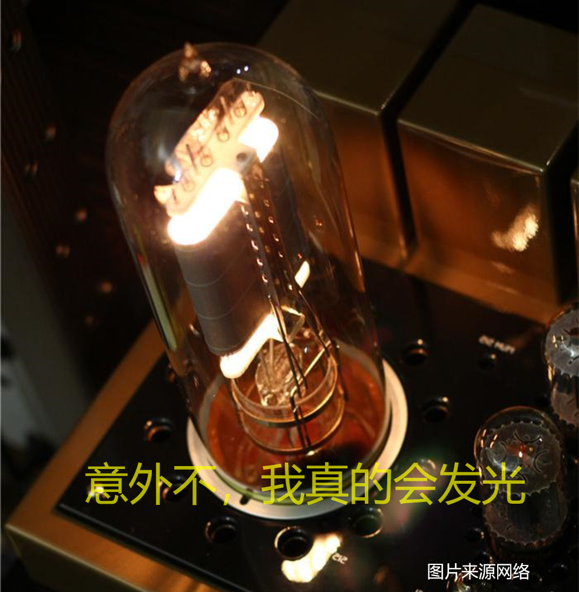
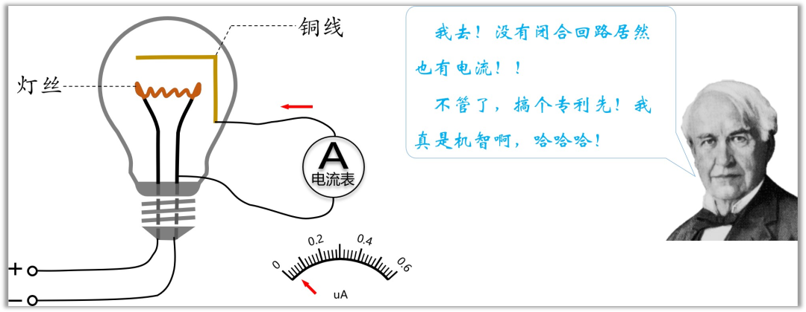
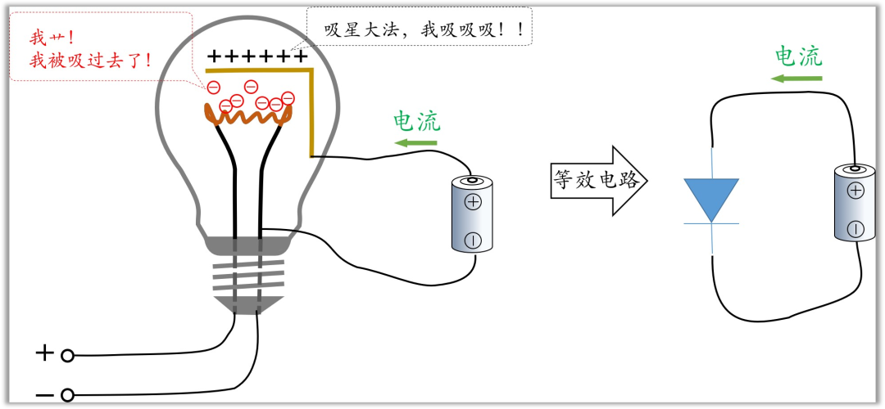
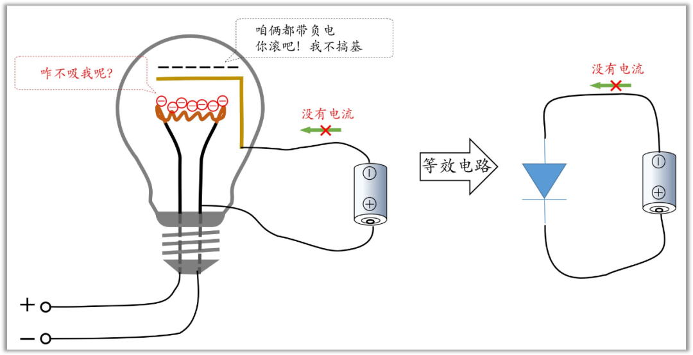
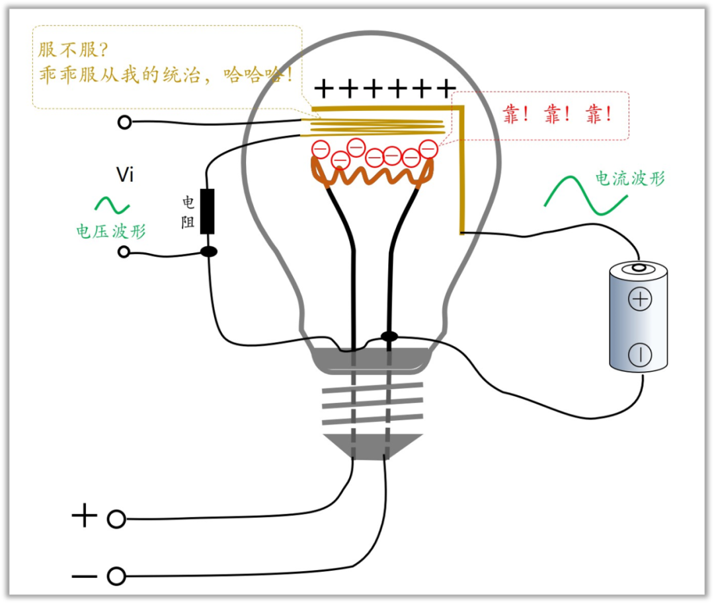
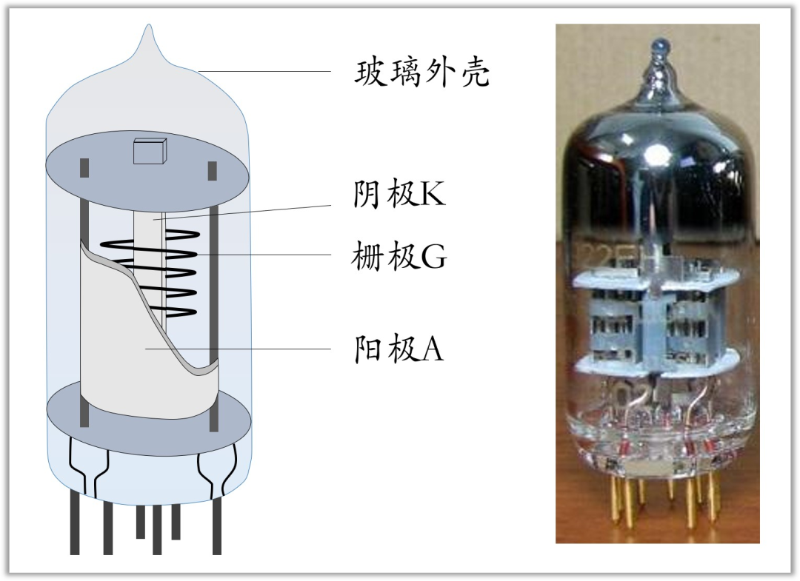

# 电子管工作原理，图文并茂，言简意赅_电子管原理-CSDN博客
先前我们了解到，电子管并没有完全淘汰，还在音频领域发光发热。

那么作为，作为技术人才，咱们还是需要了解一些基本的知识，比如简单的历史，工作原理，优劣势在哪里。

考虑只有很少的人会接触到电子管，本文也不会很深入的写（其实是因为我就知道皮毛）。仅供与人聊天使用，不至于是个“憨憨”。

**电子管是怎么发明的**

**爱迪生效应**

提到电子管的发明，首先需要提到爱迪生，就是发明电灯泡的那位。

要知道电灯泡刚发明的时候，灯丝很容易就烧断了，寿命很短。为了延长寿命，有一次爱迪生突发奇想：**在灯泡内另行封入一根铜线，放在灯丝的上面，想用来阻止灯丝蒸发，延长灯泡寿命**。

经过反复试验，灯丝虽然蒸发如故，但他却发现了一个稀奇现象，即灯丝加热后，铜线上竟有微弱的电流通过。铜线与灯丝没有物理连接，哪里来的电流呢？难道电流会在空中飞不成？

在当时，这是一件匪夷所思的事情。虽然爱迪生也不知道为什么，但是本着“不能放弃任何一个专利”的态度，他申请了专利，命名为“爱迪生效应”。

现在我们知道，这个电流的产生，是因为灯丝被加热到红炽状态后，灯丝上面会有非常活跃的电子，会脱离灯丝飞出去。正好灯丝上面有铜线，电子就飞到了铜线上面，因为有了电子的移动，自然就形成了电流（这个现象的专业名词应该是：零场热电子发射）

**电子二极管诞生**

不过呢，爱迪生搞了个专利之后就没再继续研究了。

十几年后，有个英国人，名字叫**弗莱明**。他发现了，如果在那个铜线上面加上正电，也就是在上图中电流表的位置加个电源，此时电流会大大增加。

这是因为加上电源之后，上面的铜丝带正电，而电子带负电，异性相吸，铜丝对电子有吸引力，就被吸过去了。

而如果加上负电，同性排斥，电子被排斥，到不了铜线，电流就没有了。

我去，这不是单向导电性吗，也就是二极管，世界上第一支二极管就这么出来了，这也使得了爱迪生效应有了真正的应用。

**电子三极管的诞生**

两年之后，有个美国人，叫德福雷斯特。他在这个灯丝与铜线之间，巧妙的伸进去一个线圈，然后给这个线圈通上电。发现，如果加上正电压，那么电流会增加，加上负电压，电流会减少，也就是说电流受这个线圈电压的影响。

这个装置其实就是电子管了——电子管被发明了。并且，那个夹在中间的线圈就叫栅极（是不是很熟悉？）

这个也很容易理解，中间的线圈加上正电，加强了对灯丝电子的吸引，而加上负电，就减小了灯丝对电子的吸引。

**电子管工作原理**

其实上面说的历史，已经把电子管的工作原理讲清楚了，这里再小结一下

电子管示意图如下所示，为了更好的理解，我把三极管也放上去了。

电子管也有三个极，阴极，栅极，和阳极，分别类似于晶体管的发射极e，基极b，集电极c 。

除此之外，电子管还有灯丝，工作的时候，给灯丝通上电，灯丝就会发热，然后灯丝把阴极烧热。阴极上面就会有比较活跃的电子，这时候如果在阳极上面加上正电，阳极就会把电子吸过去，形成电流。

在栅极上面加上正电压，那么对阴极电子的吸引力就会加强，电流增大。如果加上负电，那么吸引力就减小了，电流也就减小了。也就是说栅极能控制阳极到阴极的电流了，这也是晶体管的功能。

**电子管的结构**

电子管结构如图，左边是示意图，右边是实物。

需要注意的是，电子管里面是需要抽真空的。因为电子发射的时候，如果有空气，电子会撞到空气分子，这会大大降低电流。所以电子管也叫真空管。

正是因为电子管的这种结构，所以体积也做不小。

此外，绝对得真空是很难达到得，并且，使用时间久了之后，难免会漏气，所以电子管得寿命一般也短。

并且，灯丝需要加热，功耗自然很高。

正因为有上述这些缺点，晶体管代替了电子管，成为当今世界得主流。

不过呢，电子管也**没有完全消失**，在音频领域等少数领域还在使用。

**结尾**

本文就写到这里了。

同志们，怎么样？**我那几个电灯泡画得还不错吧**，还有最后面那个电子管示意图，都是**高清无码**的——要了我老命啊，来几个**赞**给我续口气吧。

**更多硬件知识，欢迎关注下方微信公众号**

****