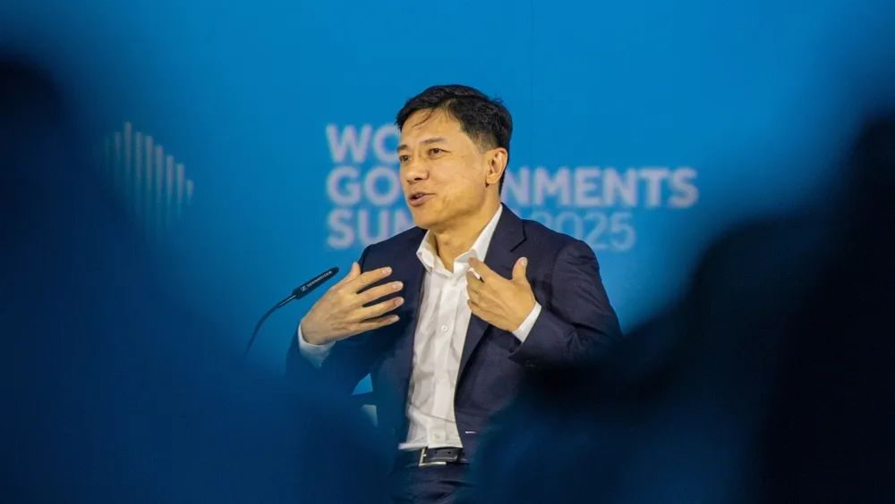
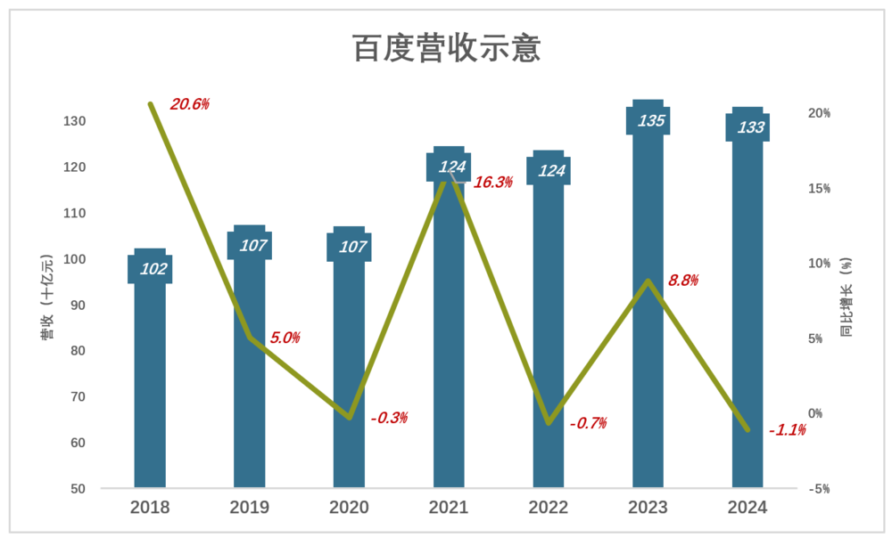
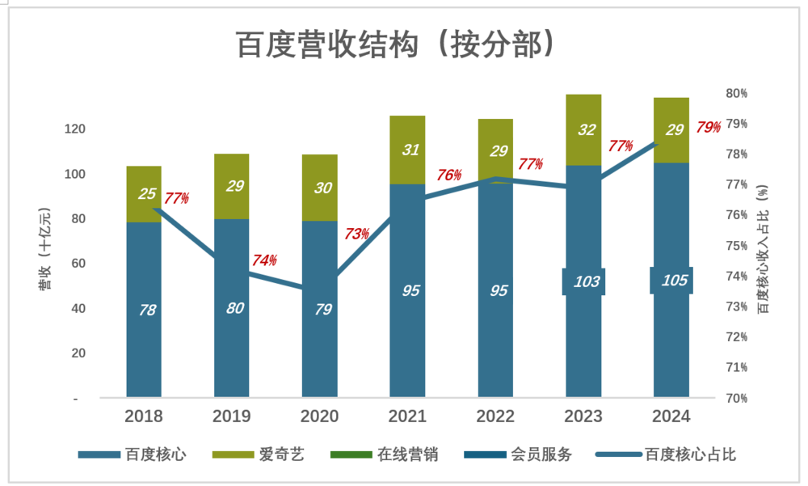
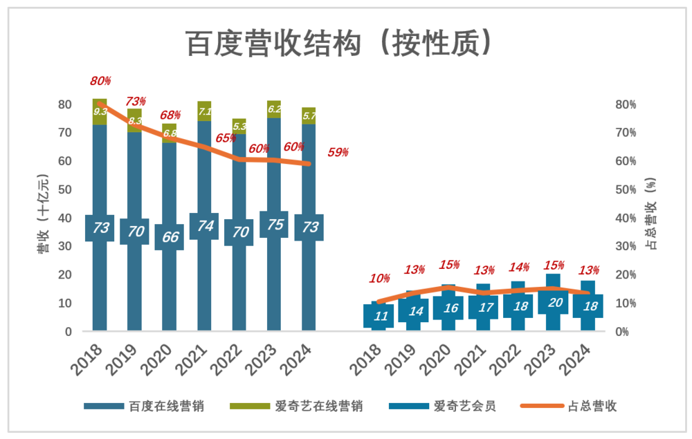
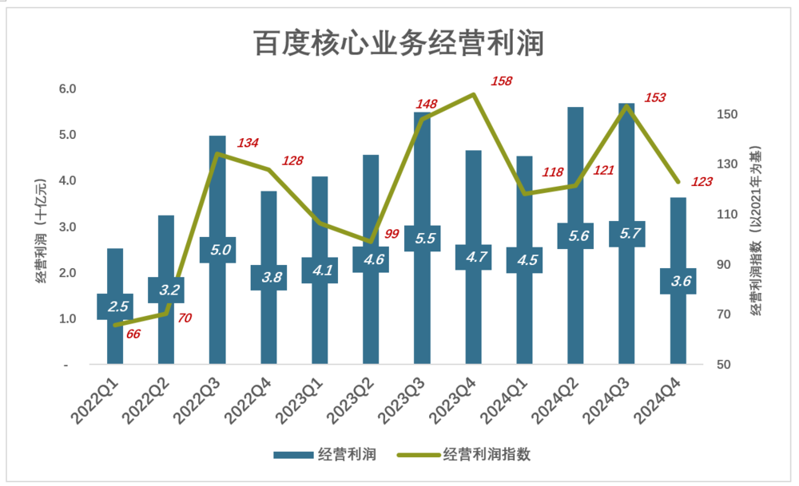
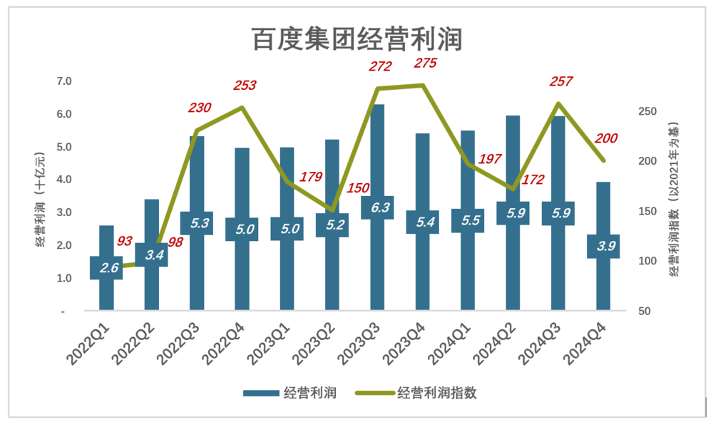
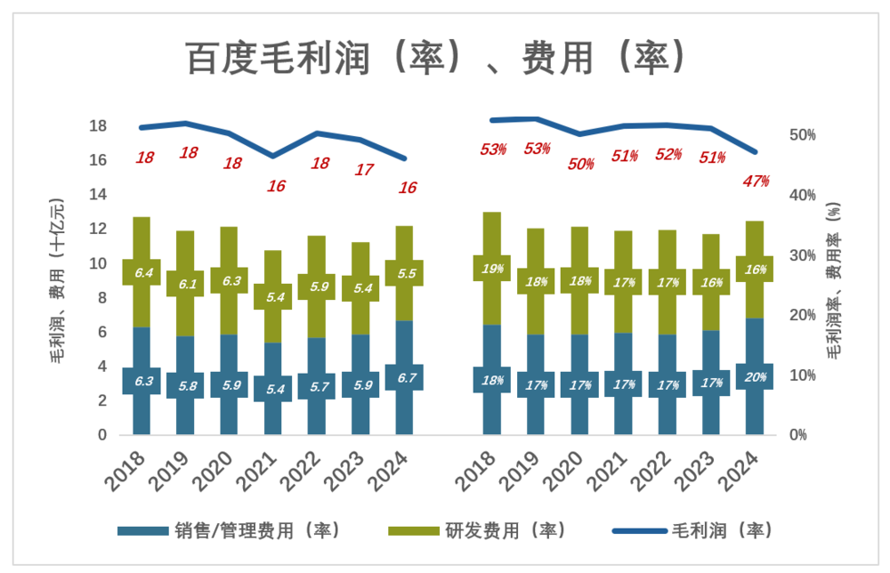
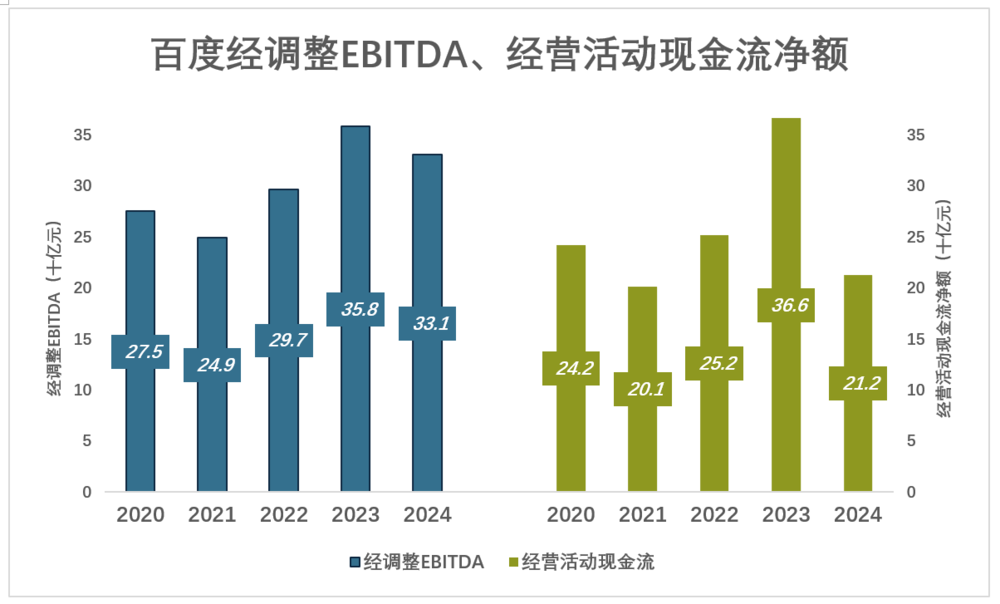

Title: 百度被看透了

URL Source: https://mp.weixin.qq.com/s/06dBPbLlcCRsNtmqxLBh1Q

Markdown Content:

作者｜Eastland  
头图｜视觉中国

2025年2月18日，百度（NASDAQ：BIDU；HK：09888）发布了《2024年第四季度及全年业绩》，公告显示：

> 2025年营收1331亿、同比下降1.1%；
> 
> 经营利润29.1亿、同比下降2.7%；
> 
> 经调整EBITDA为331亿、同比下降7.7%。

国内外资本正在对中国资产进行重估，以往过低的估值得到初步修正。“春江水暖鸭先知”，在港上市的中国科技公司表现尤为抢眼：

> 携程——最先得到认可。2024年涨幅达262.4%，进入2025年回调27.5%。从2024年初至2025年2月21日，累计上涨83.7%；
> 
> 小米——逆天改命。2024年上涨121.15%，进入2025年再涨49.86%。从2024年初至2025年2月21日，累计上涨231.4%；
> 
> 阿里——焕发新生机。2024年微涨11.35%，进入2025年大涨68.08%。从2024年初至2025年2月21日，累计上涨85.9%；
> 
> 美团、网易、京东未被充分重估，但进入2025年分别上涨7.38%、14.1%、18.82%。
> 
> 2024年，百度港股下跌28.77%；2025年“随大流”涨了8.22%。从2024年初至2025年2月21日，累计下跌24.2%；

阿里、百度的处境相似——主业面临挑战（负面）、在AI领域成果丰硕（正面）。但阿里、百度港股的动态市盈率分别为15.9倍、10.3倍。

**资本对百度的态度可以概括为三个字：看透了！**

收入结构固化

百度在2018年营收突破千亿大关后，增速放缓。疫情过后出现“振荡”：2022年跌0.7%、2023年涨8.8%、2024年跌1.1%。

1）爱奇艺贡献率下降

百度由两个分部组成：百度核心业务（主要包括搜索、云服务）、爱奇艺（主要包括在线营销、会员服务）。

2018年以来，百度核心在营收中的比重“先抑后扬”：

> 2018年，百度核心营收783亿、占营收的76.5%；
> 
> 2019年，百度核心营收增至797亿、占比却降至74.2%。原因是爱奇艺营收增长16%、达290亿；
> 
> 2020年，百度核心营收微降至787亿、占营收的73.5%；
> 
> 2021年起，百度核心业务收入稳步增长，爱奇艺增速放缓；
> 
> 2024年，百度核心营收1047亿、占营收的78.7%；

人口就那么多，每天就24小时，用户多刷1分钟抖音、B站、快手就少看1分钟“优爱腾”，爱奇艺营收回落与此有关。

搜索需求就那么多，豆包、通义、DeepSeek都在分流百度搜索的流量。百度搜索曾占90%的市场份额，天然处于守势——AI领域成果再大，只与市场份额下降的速度有关。

2）To B与To C两条腿一长一短

百度营收还可以从另一个维度划分：To B的“在线营销服务”、To C的“会员服务”。前者由百度搜索、爱奇艺提供，后者是爱奇艺的核心业务：

> 2018年，百度核心、爱奇艺在线营销收入分别为726亿、93亿，合计占百度总营收的80%；爱奇艺会员服务收入106亿、占百度总营收的10.4%；
> 
> 2019年，百度核心、爱奇艺在线营销收入分别降至700亿、83亿，合计占百度总营收的72.7%；爱奇艺会员服务收入144亿、占百度总营收的13.4%；
> 
> 2020年，受疫情影响，百度核心、爱奇艺在线营销收入分别降至663亿、68亿，合计占百度总营收的68%；爱奇艺会员服务收入增至165亿、占百度总营收的15.4%；
> 
> 2021年，百度核心、爱奇艺在线营销收入分别回升到739亿、71亿，合计占百度总营收的64.8%；爱奇艺会员服务收入167亿、占百度总营收的比例回到13.4%；
> 
> 2022年，百度核心、爱奇艺在线营销收入分别降至695亿、53亿，合计占百度总营收的60.4%；爱奇艺会员服务收入177亿、占百度总营收的14.3%；
> 
> 2023年，百度核心、爱奇艺在线营销收入分别冲高到751亿、62亿，合计占百度总营收的60.3%；爱奇艺会员服务收入突破203亿，占百度总营收的15.1%；
> 
> 2024年，百度核心、爱奇艺在线营销收入分别730亿、57亿，合计占百度总营收的59%；爱奇艺会员服务收入178亿、占百度总营收的比例回到13.3%；

不论百度核心业务还是爱奇艺，不论在线营销还是会员服务，都没有呈现强劲、持续的增长。由于缺乏推动力，百度这些年营收增长很吃力。

流量变现四大法门——广告、电商、游戏、增值服务，天花板等而下之。爱奇艺会员服务属于“付费增值服务”位于底层，至少在中国逆袭广告的可能性极小。#**“一条腿长、一条腿短”没治**#

大型互联网公司中，阿里、腾讯、美团基本盘较稳；小米逆天改命；京东四面出击涉足外卖、网约车业务，打造“第二增长曲线”。

**百度其实没少“折腾”，但至今只能“困守”两大主业，被投资者看得明明白白。**

经营利润三年翻倍

最近12个季度，百度核心经营利润呈现低开高走、稳步上升：

> 2022年Q1，经营利润25.2亿，利润指数66（相当于2021年Q1的66%）；
> 
> 2022年Q2，经营利润32.5亿，利润指数70（相当于2021年Q2的70%）；
> 
> 2022年Q3，经营利润49.8亿，利润指数134（相当于2021年Q3的134%）；
> 
> 2022年Q4，经营利润37.8亿，利润指数128（相当于2021年Q4的128%）；
> 
> ……
> 
> 2024年Q1，经营利润45.4亿，利润指数118（相当于2021年Q1的118%）；
> 
> 2024年Q2，经营利润56.1亿，利润指数121（相当于2021年Q2的121%）；
> 
> 2024年Q3，经营利润56.9亿，利润指数153（相当于2021年Q3的153%）；
> 
> 2024年Q4，经营利润36.4亿，利润指数123（相当于2021年Q4的123%）；

值得注意的是，To B的百度核心业绩与To C的爱奇艺业绩并非互补而是同频，结果令百度集团业绩“波幅”加大。例如：

2022年Q3，百度核心经营利润46亿、相当于2021年Q3的134%；而爱奇艺扭亏为盈、经营利润达3.1亿（2021年Q3，爱奇艺经营亏损13.7亿）。这样一来，百度集团经营利润就达到53.2亿，利润指数230（相当于2021年Q3的230%）；

2023年Q3，百度核心经营利润55亿、相当于2021年Q3的148%；爱奇艺经营利润达到创纪录的7.5亿。于是，百度集团经营利润冲高到62.7亿、相当于2021年Q3的272%。

经营利润更直接地反映企业盈利能力。

2021年，百度集团经营利润105亿。三年后的2024年，百度集团经营利润增至213亿，翻了1倍。

低估的蓝筹股

1）毛利润与费用

蓝色折线代表毛利润（率）、彩色堆叠柱代表费用（率），蓝色淹没彩色企业方能获得经营利润。

绩优蓝筹股的特征就是“蓝色高高在上”：

> 2018年，毛利润179亿，毛利润率52.5%；销售费用、研发费用合计127亿、总费用率37.2%：蓝色比彩色高52.1亿、15.3个百分点；
> 
> 2019年，毛利润182亿，毛利润率52.7%；销售费用、研发费用合计119亿、总费用率34.5%：蓝色比彩色高62.7亿、18.2个百分点；#这是百度表现最好的财年#
> 
> ……
> 
> ……
> 
> ……
> 
> 2023年，毛利润172亿，毛利润率51.1%；销售费用、研发费用合计111亿、总费用率33.5%：蓝色比彩色高59.3亿、17.7个百分点；
> 
> 2024年，毛利润161亿，毛利润率47.2%；销售费用、研发费用合计122亿、总费用率35.7%：蓝色比彩色高39.2亿、11.5个百分点；

2024年，毛利润率同比下降近4个百分点，销售费用率同比提高2个百分点，“蓝色与彩色之间有差距”一下减少6个百分点。**#苗头不好#**

2023年，百度EBITDA（息税折旧摊销前利润）冲高到358亿；2024年小幅回落到331亿，较2020年高20.3%。

2020-2024年，经营活动现金流净额保持在200亿以上。

无论从哪个角度看，百度都是绩优蓝筹股，10倍的市盈率偏低。

**2015~2024，十年间百度研发投入达1815亿，所谓Turn money into knowledge。但迟迟见不到百度turn knowledge into money，以完成闭环。**

**投资人失去耐心。**

\*以上分析仅供参考，不构成任何投资建议

如对本稿件有异议或投诉，请联系tougao@huxiu.com

End
