Title: 知乎日报 - 知乎

URL Source: https://daily.zhihu.com/story/9775617

Markdown Content:
文章比较长，不过我相信是值得花时间观看的，**一定能看到别处看不到的知识**，能对 CPU 有**更为深入**的**理解**。**第一部分**是补充背景知识的**综述部分**，我相信就算是外行耐下心来看也是可以读懂的；文章的第二部分深度会有增加，下面为第二部分的目录，有基础知识的建议直接跳到后面去阅读。

*   1，为什么 MOSFET 是 逻辑电路的最基本单元，为什么电路最基本的逻辑是‘非’，以及为什么逻辑是“与非’ ‘或非’而不是 ‘ 与’ ‘或‘
*   2，把‘电子’ 装进盒子里的各种储存单元：register（俗称寄存器，L0 cache），cache（SRAM），DRAM（俗称内存）， & Flash Drive （俗称‘闪存’）
*   3，TDP，主频，超频及其相关

欢迎大家指正错误！我会及时改正的。

如果大家还有感兴趣的话题在下方留言即可，答主一定会认真回复的， 谢谢支持！！！

* * *

**1 大致感受一下 CPU 是什么**

*   家用电脑里的 Intel ， AMD 处理器
*   手机里，高通的骁龙处理器，三星的 Exynos，华为的 麒麟，千元机的 MTK；苹果的 A 12。
*   商用电脑 Intel 至强（在文中这个不展开）

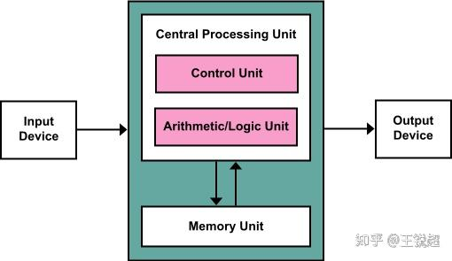

Major parts of a CPU

上图中，你可以看到，CPU 里有**两部分**：

*   一部分叫做 **Control Unit**，负责控制。比如计数器，指令寄存，等等。
*   一部分叫做 **Logic Unit**，负责运算。比如加法器，累加器，等等。有些也会把 ‘ 数据总线’ 归于逻辑运算单元里。
*   其实 CPU 里还有存储单元等其他单元，比如 L1，L2，L3 Cache 等等。

输入设备就是 鼠标，键盘，触控板，触摸屏等， 用户通过这些东西对电脑进行输入指令，CPU 识别指令后进行运算，进行输出，一般输出给了屏幕。 在这里举一个例子：用户通过触摸屏，对手机进行操作，比如说点击播放音乐，CPU 接收到指令后，命令 DAC 解码，扬声器接收到音频信号进行播放，屏幕显示歌词。

CPU 就类似于一个管理者，他不去做 ‘苦力’ 活，让更专业的人去做更专业的事。这样就能最大程度上的提高了 整个系统的效率。CPU 虽然叫做 中央处理器，所以它**不仅仅是处理**，而是对一些更基本的处理器进行**控制**：

‘苦力活‘指的是 CPU 并没有驱动大电流的能力，比如安装好‘驱动软件‘之后，CPU 就可以和显示屏上的处理器就行沟通，显示屏上的处理器再来控制显示屏的‘驱动电路’ （Driver），驱动电路驱动显示屏显示图案。在工业上，苦力活用 PLC\[1\]来控制。一般的，PLC 会受到更上层 CPU 的控制。

更为专业的工作指的是：比如图形处理会交给 GPU \[2\]来做；音频的解码交给‘声卡’ \[3\]AD/DA； 更为高级的音频处理，比如说‘降噪耳机’ 就需要一种叫做 DSP\[4\]进行处理；在为复杂一些的处理，比如说苹果笔记本上的触摸板会有一个专门识别触摸的芯片，叫 单片机\[5\]。新的 MAC PRO 加入了 FPGA \[6\]视频剪辑卡，可以做到 3 条 8K 视频同时剪辑。

（1.1 版本补充内容，等有空后会后续补充）

computer architecture 计算机的架构\[7\]（ISA）是一个非常宽泛的概念：

*   Instruction set architecture 指令集架构（ISA）\[8\]（精简指令集，复杂指令集）
*   microarchitecture 微架构 \[9\]（ 比如 L123 cache）

**2 CPU 的命名 --- 通俗易懂，商业目的**

最简单的例子就是苹果的 A（APPLE） 系列处理器，手机上用的就是 A10，A12；iPad 上用的就是 A12X\[10\]；手表上用的就是 S（Syetem in Package SiP）等等\[11\]

Intel 的稍微复杂一点，看下图\[12\]：

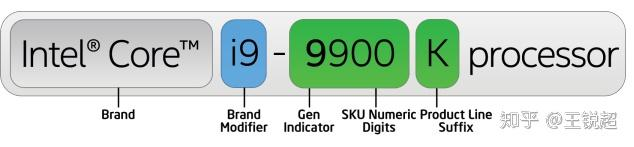

文中大量引用了 Intel core i9-9900K 的原因不是因为我收了因特尔的钱，而是由于它的相关信息比较全，比较容易拿过来讲解。

*   Brand -- 商标
*   Brand modifier， 产品型号，比如 i3, i5, i7, i9
*   Gen Indicator, 产品代，比如 2019 年是第九代产品，2020 年初就会更新第十代产品。这个代不仅代表了它的制程工艺，也代表了它的架构
*   SKU， 这个如果是小白就直接理解为越大越好。比如我可以负责任的告诉你，9980XE\[13\]，性能上是要比 9900K 要好很多的
*   Suffix，后缀，这里一般都是标明 芯片是否能够超频，电压是标压还是低压

**3 CPU 的外形，接口，封装\[14\]****3.1 封装**

整个芯片其实非常非常小，我们外界能看到的产品是对他进行封装好之后的效果，封装当然是主要为了保护芯片，但还有一个很重要的作用就是为了更好的和外界进行沟通（交换信息）。随着封装技术的发展，芯片引脚的密度越来越大，芯片集成程度越来越高。我放几张图，让大家看一下科技的进步把：

最经典的封装方法：Dual in-line package，DIP（双列直插封装）\[15\]，学过数电的都接触过这种封装的芯片，这种芯片一般都是 少引脚的。

Dual in-line package，这也是早期的芯片封装方式

芯片引脚插入电路，和这种封装配套的技术叫做：“Through-hole technology“\[16\]当然这个电路穿孔技术在集成电路里还有另一层意思，比如 3D NAND RAM 里面的穿层技术（这个讲到 Flash 的时候会讲）

DIP 封装是不能满足芯片引脚数目的提高的，此时就有了密度更大的封装方式。PC CPU 里，目前最为复杂的封装方法就是这样的：i9-9900K FCLGA-1151 (LGA) 封装方法\[17\]，每一个金黄色的点，都是 CPU 和外界进行联系的方式，每一个引脚的功能和使用方法可以查 data sheet 。

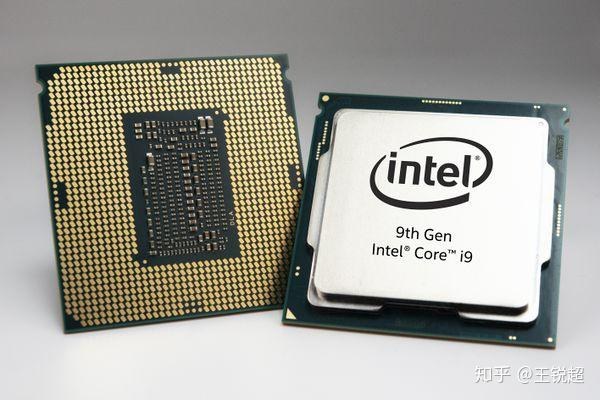

Intel core i9-9900K FCLGA-1151 (LGA)

随着系统的设计复杂，之前的封装结构已经不能满足了，于是就有了更为复杂的封装结构：System on a chip，SoC\[18\]，Soc 我会在下一小节的 芯片结构里面用 A12X \[10\]作为解释。追求更高电路密度的方法就是 Package on package ‘叠电路’\[19\]，但是由于散热问题反而效果并不特别好，举例就是 iPhone X 的双层电路板结构\[20\]。而目前追求电路复杂程度的极致，叫做 System in package， SiP\[21\]，把整块电路版想办法做到一起，比如 Apple watch 4 的 S4 芯片\[22\]。

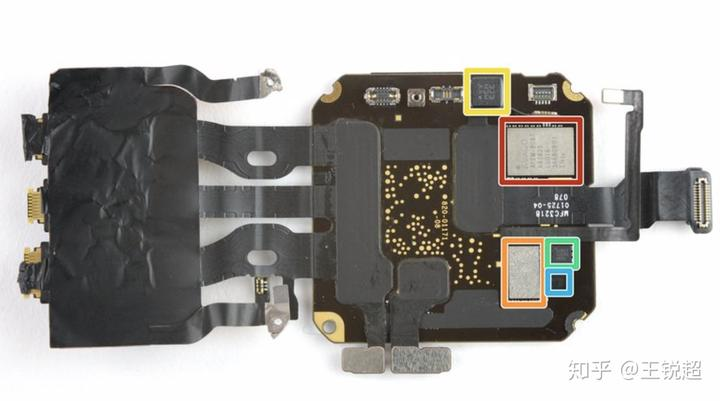

S4 来源 ifixit

**3.2 总线 ----CPU 与外部沟通**

想要理解 CPU 是怎么和外界进行沟通的，我们可以查看相对应的 CHIPSET ---Z390\[23\]来大概感受一下：

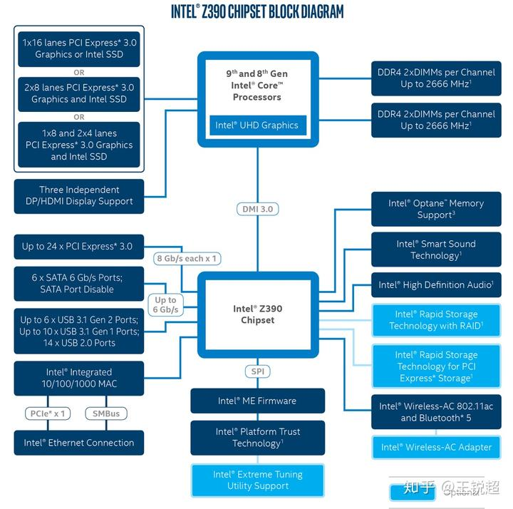

*   看图右上角，CPU 与 DDR4 是直接相连
*   图左上角，一共 16 条 PCIe，可以分给 SSD 也可以分给显卡（一般这里分给显卡，SSD 接在 Chipset 分出来的 24 条 PCIe）
*   左上往下看，3 个 DP 口（有一个很有趣的小知识，请问一共有多少条 PCIe 3.0 的线，以及为什么苹果 15 MBP 能分出来四个雷点三？？）
*   DMI 3.0 总线，接 Chipset，之后进行细分，比如直接与 Optane 存储相连，==不一一解释了。

额外小知识：雷电接口是怎么回事？戳这里\[24\]雷点三接口的全速半速是怎么回事？\[25\]

*   Double Port (DP) uses a PCIe 3.0 ×4 link to provide two Thunderbolt 3 ports (DSL6540, JHL6540, JHL7540)
*   Single Port (SP) uses a PCIe 3.0 ×4 link to provide one Thunderbolt 3 port (DSL6340, JHL6340, JHL7340)
*   Low Power (LP) uses a PCIe 3.0 ×2 link to provide one Thunderbolt 3 port (JHL6240).

**4 computer architecture 系统架构 -----（坑太大先不填了）**

4.1 架构到底是什么？\[26\]复杂指令集（CISC)和精简指令集（RISC）是什么？\[27\]

4.2 ARM（RISC）省电么？\[28\]\[29\]

4.3 性能差别大么？\[30\]

4.4 谁是未来？\[31\]（强烈推荐看 RIO 的回答）

**5 芯片结构**

设计芯片时会考虑到芯片的用途，根据用途而设计芯片。比如为了自动驾驶，那么肯定我们需要更多的神经网络处理 NPU，CPU 选取 Cortex-A72\[32\]\[33\]。下面我举几个例子，来感受一下内部结构的区别。

**5.1 ：X86，Intel Coffee Lake\[34\]\[35\]**

这个芯片，就是非常单纯的，性能至上的芯片。

Intel core i9-9900K

如果拿放大镜去看，就可以看到 CPU 内部长这个样子，当然图中的颜色都是为了方便大家看清楚是干啥的专门上色的哈。从图中可以看到，芯片中间紫色部分是 8 个 CPU 核心（俗称 8 核 i9），8 个核心 share 红色的 L3 cache；左边蓝色的是‘核显’ Intel® UHD Graphics 630，System Agent 是负责和外部进行沟通的。为了更方便的理解每一部分是做什么的，请看下面两张图：

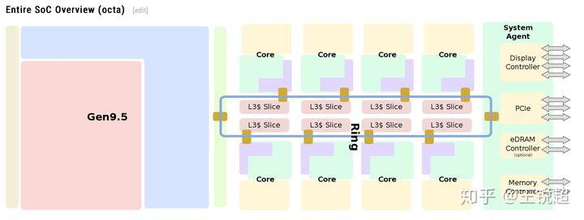

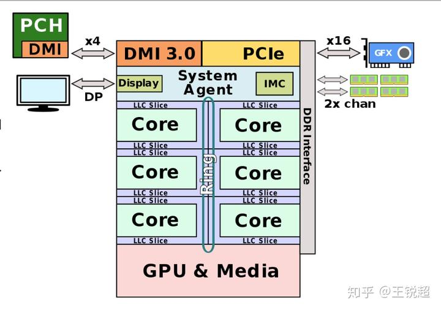

注：图中是一个 6 核心的展示图

每一个‘core‘内部结构我就不展示了，感兴趣戳这里\[36\]。

**5.2 ARM，A12X bionic\[37\]\[38\]\[39\]**

目前手机市场最强核心 apple A12X，架构 ARMv8.3 (ARM)， 制程工艺 7nm，这个芯片就是上文所提到的‘**高度集成**’其他功能的芯片。

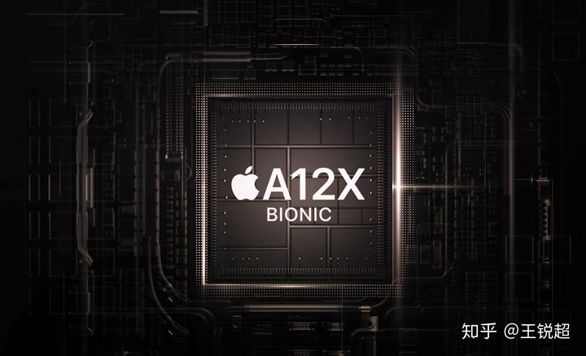

在 3.1 章节封装部分，我说 A12X 是 SoC 封装，在这里我就详细的解释一下：看下图，如果你把这张 A12 X 的图 和 9900K 的图进行对比你会发现：图中右侧，系统一共 8 核 CPU（4 大 Vortex，4 小 tempest）；神经网络处理器 NPU 在芯片中间；左上角系统 GPU ==，可以看到，系统左侧右下角，集成了很多很多‘CPU’之外的芯片，比如 ISP image signal Processor，景深 Depth Engine 等 ，详情戳引用。\[39\]

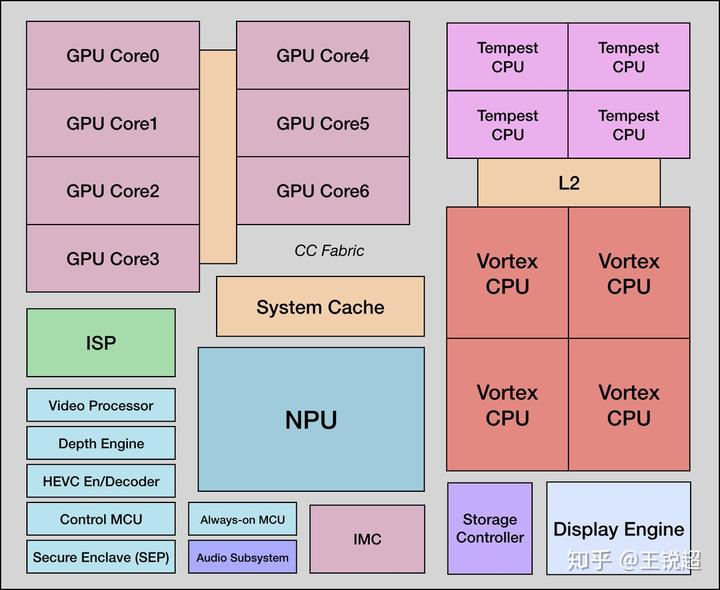

为了对比方便，我把 9900K 的图拿过来，可以看到，9900K 并没有上图中下面那么多其他的核心。

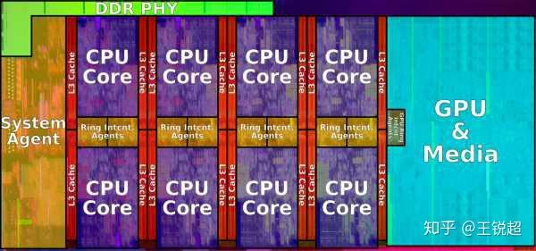

**5.3 **FSD Chip（特斯拉自动驾驶芯片）**\[40\]**

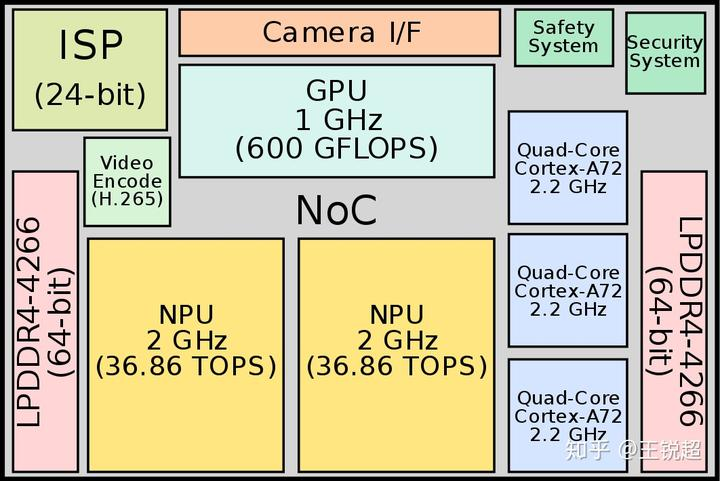

这个芯片，自动驾驶芯片，看一下内部结构就知道，2 个大大的 NPU 占据了系统的绝大部分空间，主要就是在算神经网络。

**6 芯片生产****6.1 生产工艺 Lithography**

> Lithography refers to the semiconductor technology used to manufacture an integrated circuit, and is reported in nanometer(nm), indicative of the size of features built on the semiconductor.

当系统架构，结构确定好了之后，就可以进行生产了。虽然我在这里写的，让你感觉可能是设计和生产是独立的两个过程，但其实不是，在芯片设计的第一个环节，打开芯片设计软件，建立工程的起始，就要选择生产的工艺。在芯片设计之初，我们要选择一个最小尺寸（举个例子），比如

，那么其他所有器件的尺寸都要是这个数的整数倍（一般是偶数倍），比如们宽度是

，比如导线宽度

这样。

而人们常说的 7nm 工艺指的就是这个

，对应在具体的电路图上：

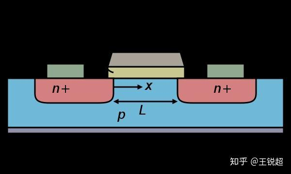

如果是 25nm 工艺之前。横截面，L 就是我们所说的制程工艺距离。——Behind the nanoscale process is the true and false: Intel invincible technology failed?

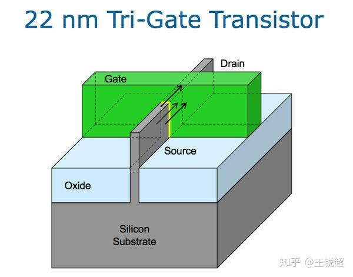

22 nm 后 finFET

**22nm 之前**，门是一个 2 维的门，之后为了更高的效率，需要用 3 维 的门，Intel 对这个称之为‘FinFET’。这里有个视频，Intel 官方讲解 Tri-gate 的具体原理，一看就懂了：[Intel 22nm 3D-Tri-Gate-Transistoren](http://link.zhihu.com/?target=https%3A//www.youtube.com/watch%3Fv%3Dv2gDMj42sIM)\[41\]，这里还有个文章解释：[先进工艺 22nm FDSOI 和 FinFET 简介](https://zhuanlan.zhihu.com/p/54292579)\[42\]

再往后，14nm 以下，还没有一种统一的方案，各个厂商走的方案都不一样（详情可以戳这里），不过可以上两张图\[43\]\[44\]来感受一下：

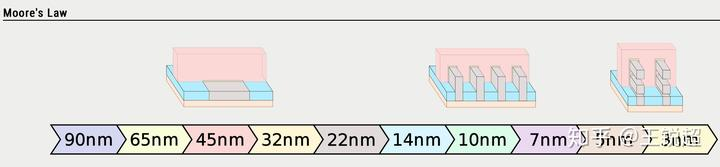

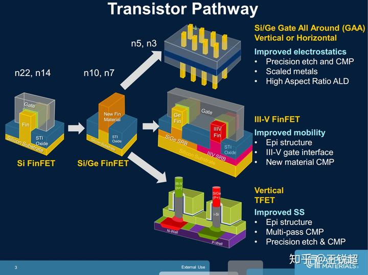

**6.2 工艺具体参数**

我相信所有人听到的对于 CPU 最多的描述就是 xx nm 工艺，比如今年最新的就是三星 /TSMC 的 7nm 工艺制成的的 CPU ，因特尔卡在了 10nm 止步不前，但是没有人告诉你，这是由于不同厂商对这个距离的定义不一样所造成的一个**巨大误会**，不过实在是太专业了，就不具体解释了，简单记住一件事就好 **Intel 10nm 等于 TSMC 7nm**）\[45\]\[46\]

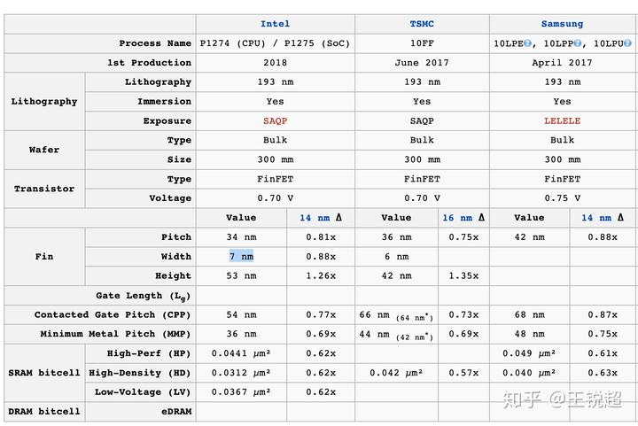

这张图是 10nm 工艺的三家对比，我们可以看出，Intel 的多项指标都是好于 TSMC 与 Samsung 的

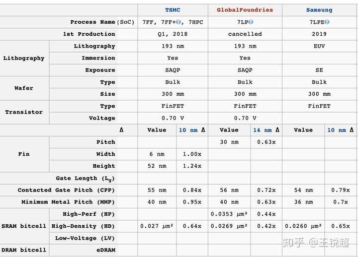

我们看指标，号称 7nm 的 TSMC 和 Samsung 和 10nm 的 Intel 的指标几乎是差不多的。

为了方便大家理解，放上一张渲染图吧\[47\]：

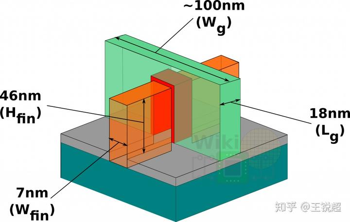

WikiChip’s Transistor Diagram (simplified)

**6.3 光刻印刷**

现在最先进的光刻机用的光是‘极紫光 EUV’ （波长 小于 紫光（193nm）），其实光刻印刷是一件非常神奇一的事情，在我看来最迷人的是这两件：

*   光印原理与流程，电路是怎么一层层的印刷上去的
*   光刻机怎么用波长这么大的光波刻蚀仅仅 7nm 的沟壑的。

把沙子提纯成高精度的 SI die，然后把它切成非常薄的片 wafer，光刻机就一层层的刻，下面我贴一张一个最简单的 Pmos 为底的 CMOS 刻蚀过程\[48\] ：

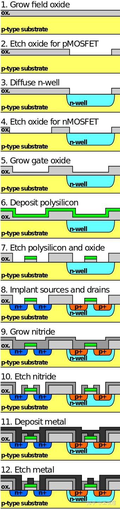

Simplified process of fabrication of a CMOS inverter on p-type substrate in semiconductor microfabrication.

整张 wafer 刻完后长这个样子：

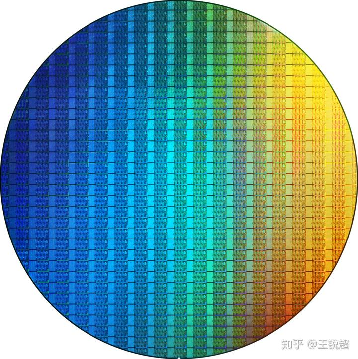

Coffee Lake silicon wafer with 8th generation core 6-core processor dies.（注，图上的颜色不是开玩笑加上去的，wafer 刻完之后真的是五彩斑斓的，由于微观结构反光）

之后芯片被切下来，然后封装，就成了我们市面上所见到的芯片了。更详细的过程可以点击这里：\[49\]\[50\]\[51\]

电路印刷，不是拿个刷子刷上去这么简单，每一层电路，每一层电路要刷 N 遍，都需要很多 mask，而每一个 mask 都非常之贵。现在电路电路越来越复杂，电路从最早的 2 面印刷（正反面），到现在的 7 层 10 层，导致设计与制造的难度与成本随之上升了。（在这里的层是内部结构，不是说苹果 iPhone X 所用的双层电路板，这是两个概念）

**6.4 下脚料与成本**

看到这里，你会很自然地想到，从圆形的 silicon wafer 上切正方形（长方形），那么边角肯定是且不出来的。对，没错，你放大看上面的图就会知道，几乎是 wafer 边上一圈全都是废了的。而且这个问题会随着我们需要生产的芯片的面积增大而更严重（里面芯片面积大了，边边废的更多）

所以**不是说生产芯片的厂商不想生产更大的芯片，而是说成本会急剧上升**，现在这么做是不经济实惠的。

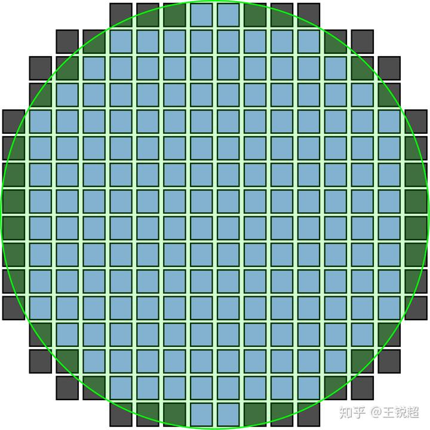

Wafermap showing fully patterned dies, and partially patterned dies which don&amp;amp;amp;amp;amp;amp;amp;amp;#39;t fully lie within the wafer.

为什么不能生产长方形的 wafer？非要生产圆形的？ 硅提纯的整个流程（Czochralski process）\[52\]就是会产生圆形的 SI 晶体，把它切成片就是 wafer。

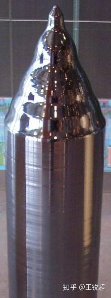

Crystal of Czochralski grown silicon.

OK。。。肯定你想到了，如果 wafer 直径越大，那么其实有效利用的面积相对增大了，现在的 wafer 主流是 300mm，厚度是 775um\[53\]。你是不是觉得非常小？为啥不生产更大直径的 wafer？？原因是由于用 Czochralski process 来生产 SI 晶体，直径越大，难度越高，成本已经不是线性增长，而是指数级增长。

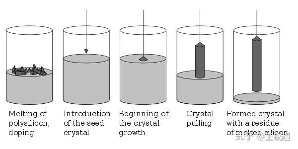

Czochralski process

那有没有更好的生产 Si 晶体的方法呢？目前还没有，其他的方法反而成本更高。

芯片产业虽然是最高科技，但是它本质还是‘产业’是以盈利为目的的。芯片制造与设计要考虑的非常重的一部分就是如何减少成本，而上面的晶元的问题只是冰山一角，真正的 cost 的大头根本不是晶元，生产过程中一个 mask 就要 millions $来计算，所有外行觉得买个光刻机再加一个设计团队不就能生产芯片了？？

真的并不是，它就算花重金做出来，它没有‘经济利益’，是个赔本赚吆喝的过程。

**6.5 芯片的‘体质’ Process variation\[54\] 以及市场细分**

OK，6.4 提到了芯片生产商其实是以经济利益为驱动的，但是芯片生产不是生产‘时尚快消品’，不是说要生产出来不同的型号，不同主频，不同缓存的 CPU 来进行‘市场细分’，以剥削消费者。事实上，芯片都是生产出来之后，根据体质的好坏再进行分类包装的。比如：

*   生产一个 6 核 i7，发现坏了一个核心，这时候就直接屏蔽掉两个核心变成 4 核 i7 卖；
*   目的是生产 16MiB 的 L3 cache，但是坏了 2M，那么就在屏蔽一点，按 12Mib 来卖；
*   设计主频是 2.6GHz 的，由于‘体质‘不好，达不到 2.6 的 就按 2.4 卖，再不好的就按 2.2 来卖。

更详细的请戳这里：[同型号同款 CPU 为什么会有「体质」之分？](https://www.zhihu.com/question/24622588)\[55\]

我还想补充一下：“wafer 边缘的芯片更容易体质不好，中心的体质会相对好的比例多一些”，这个是有争议性的。\[56\]\[57\]不过有一件事就是现代芯片设计过程，考虑到了大量的可能会出现偏差的过程，在设计过程中尽量的避免了。

除了上述市场细分之外，苹果和 Intel 有深度合作的排他协议，能拿到最上乘品质的芯片，其他厂商再分中上乘的品质芯片，最后散装的一般都是最差的。mac 里的 CPU 是没有散装卖的，虽然很多人会说苹果特供芯片就是普通芯片贴牌，其实准确的说是专门质检过的。

**7 CPU 的历史以及未来发展方向**

1946 年，人类历史上第一台由电子管组成的电脑 ENIAC \[58\]，但是你们肯定听说过它占地多么大，需要多么大的电能；现代电路的发展其实是从 1947 年 bell 实验室发明的第一个晶体管开始算起\[59\]，更准确的说是 1960 年的场效应管 FET\[60\]。

> 场效应管就是第六章里提到的最基本单元，但由于半导体物理实在是复杂，我并不想多去阐述具体运作原理，大家简单记得电路里最基本的东西就这个：

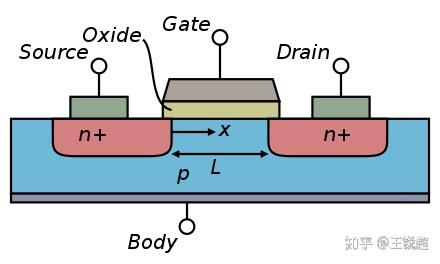

所有的 FET 都有栅极（gate）、漏极（drain）、源极（source）三个端；除了結型場效應管外，所有的 FET 也有第四端，被称为体（body）、基（base）、块体（bulk）或衬底（substrate）

有了 FET，有了 Si 芯片，有了光印刷，集成电路突飞猛进发展，摩尔这时候站出来说的摩尔定律就是在这个背景下提出的。

然而到奔腾四\[61\]后，CPU 的主频上限已经被卡住了。原因是‘现代’集成电路的能效比其实超级低，**大概 1%**，就是说大部分供电都会转化成热量散失掉了，只有 1% 的能量变成了我们运算用的。当我第一次接触各种‘漏电流’的时候，我都对这个世界充满了绝望，what？整个芯片所有地方都在漏，没有不漏的。。。

由于能效比这么低，造成的结果就是 CPU 非常的热，为了不让他烧坏，**CPU 有非常夸张的散热方式，一个大风扇的风冷，或者液冷（水冷）**。如果用液冷给他降温，奔腾四就能超频到 5GHz ；但是根本不经济实惠，所以从此集成电路在追求更高的**能效比**。但绝对不是简简单单的追求能效比，还有诸多考虑的问题。

至于未来的问题，强烈推荐阅读 矽说 的这三篇文章，以及相关问题讨论，在此我就不费口舌了：

*   [李一雷：摩尔定律何去何从之一：摩尔定律从哪里来？摩尔定律到极限了吗？](https://zhuanlan.zhihu.com/p/21262505)
*   [李一雷：摩尔定律何去何从之二：More Moore or More Than Moore?](https://zhuanlan.zhihu.com/p/21262704)
*   [李一雷：摩尔定律何去何从之三：Beyond CMOS](https://zhuanlan.zhihu.com/p/21262830)
*   [CPU 的摩尔定律是不是因为 10 纳米的限制已经失效了？10 纳米之后怎么办？](https://www.zhihu.com/question/26446061)

* * *

Ok，上面第一部分就是个综述，下面的内容会更加细节以及深度，正文部分：我觉得大部分领域相关的回答有一个通病就是他们并没有深入的思考芯片里的逻辑和它的物理结构之间的关系，也就是一个非常‘浮于表面’的回答，知其然，不知其所以然。

**1 为什么 MOSFET 是 逻辑电路的最基本单元，为什么电路最基本的逻辑是‘非’，以及为什么逻辑是“与非’ ‘或非’而不是 ‘ 与’ ‘或‘，我在[这篇文章](https://zhuanlan.zhihu.com/p/34974464)\[62\]中解释了一部分，就搬运过来了。**

**metal–oxide–semiconductor field-effect transistor** 是最最最基本的结构，根据掺‘杂’不同，分为 PMOS&NMOS，一个 PMOS + 一个 NMOS 组成了 CMOS\[63\]，而现代处理器的最基本运算单元就是这个 CMOS，看下图。

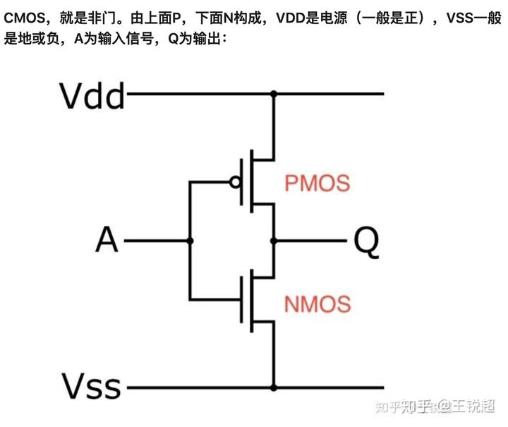

电路最基本逻辑结构 CMOS ---‘非门’，非逻辑

如果横过来看：

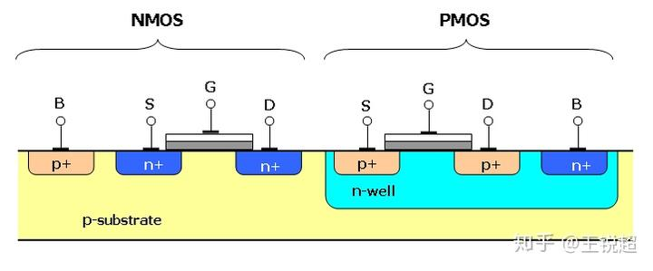

OK，之前我们是用一个 1 P + 一个 N 组成的一个 CMOS，我们稍加改变，让电路稍微复杂一点点，由两个 P 两个 N ，就会形成 “与非门”，“或非门”，NOR， NAND。下图是逻辑结构，如果你感兴趣，可以看看 N Pmos 的原理，以及为什么它们能形成这两个逻辑。

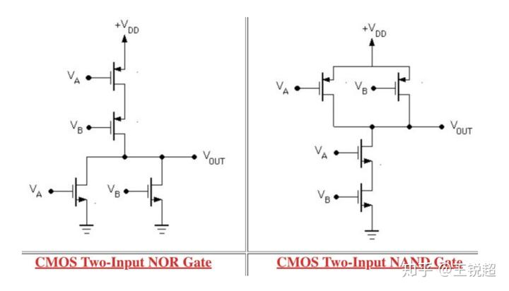

于是，‘**与’逻辑门的结构 就是一个 ‘与非’+ ‘非‘，组合起来得到**；同理，‘或’逻辑，就是‘或非’+‘非‘。同理，其它更复杂的逻辑运算都是通过最基本的 CMOS 组合起来得到的，比如：

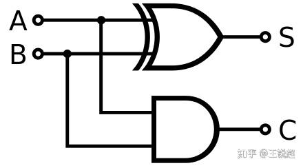

半加器，half ader

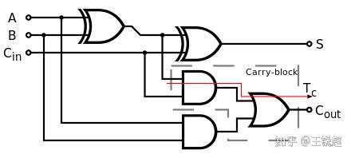

全加器，adder，ALU

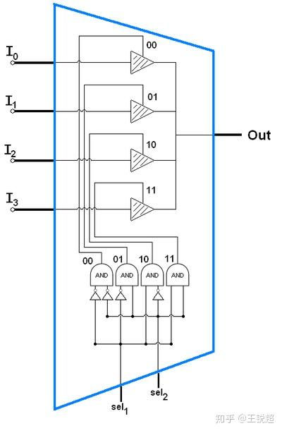

多路选择器，MUX，

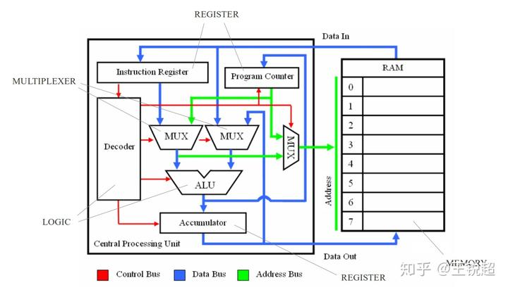

简单版 CPU

更复杂的结构我就不贴出来了，你感兴趣的话是可以查查相关的资料，但有一件事你要明白，这些复杂的功能，都是由最简单的 CMOS 组成的，而由于结构决定了最基本的逻辑单元是 非。

我说的肯定是不全的，这里有一个推荐阅读：[HTG Explains: How Does a CPU Actually Work?](http://link.zhihu.com/?target=https%3A//www.howtogeek.com/367931/htg-explains-how-does-a-cpu-actually-work/)，加了更多的最基本的单元，BUS，Memory，Clock， Stepper 等介绍。

**2 把‘电子’ 装进盒子里的各种储存单元：register（俗称寄存器，L0 cache），cache（SRAM），DRAM（俗称内存）， & Flash Drive （俗称‘闪存’）**

这一小节里的所有储存单元的基本原理都是，用一个容器来储存电荷，我们规定有足够多的电荷的时候，就为逻辑 1，没有足够多的时候，就为逻辑 0.

**2.0 Computer Memory Hierarchy\[64\]**

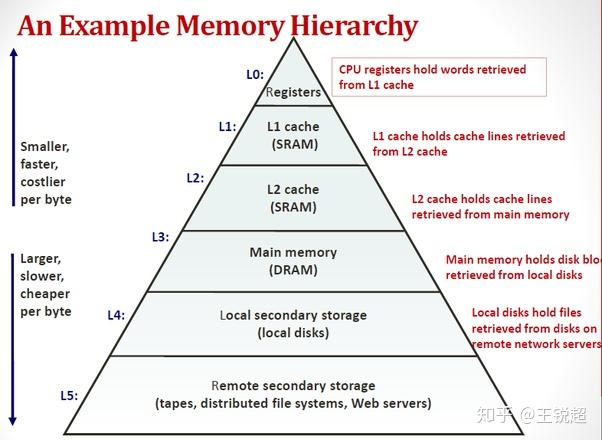

这张图老了 L3 cache 没有加上，不过不影响主要理解，

上面这张图解释了，和 CPU 关联的相关储存单元，CPU 先从 L0 搜寻有没有存在这里，没有就去 L1 搜，在没有就去 L2 搜，搜到后就送回运算单元。如果你对这部分有更深的兴趣，原图戳这里：\[36\]

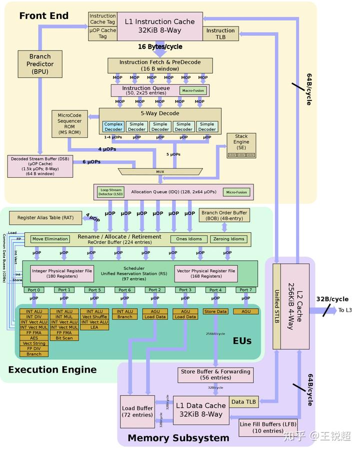

intel - Skylake

右边 L2 cache ，出去接 L3 cache（意思是所有外面的信息都会在 L2 停留），Front end 和 Memory subsystem 各有一个 32KiB 的 L1 cache，那些 Buffer 就是一些寄存器。 回忆之前第一部分的一张图\[36\]，CPU 的结构：

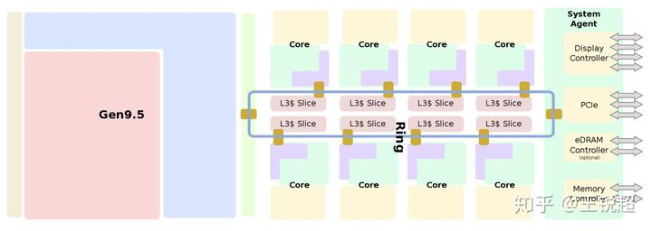

8 核 share 一个大 L3 cache，所以 L3 cache 的作用就是一个 CPU 内，多核心协同工作。

**2.1 Dynamic random-access memory，DRAM**

寄存器懒得讲了，感兴趣自己看维基百科\[65\]吧，DRAM 在结构上是所有存储单元里最简单的\[66\]：

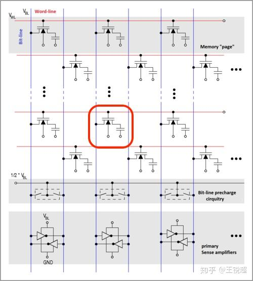

红色地方就是我标注的一个 memory cell，由一个 NMOS 接电容接地组成

看上面红色标记的部分，一个内存的基本单元是 由一个 NMOS 接电容接地组成的；看到这里有电路基础的人肯定能看出来，当门极通电时，NMOS 导通，如果供电，那么就会对电容进行充电；而电容接地了，电容的电不断的在散失。能坚持看到这里的人肯定知道 内存是在不断的‘刷新‘（一般来说，64 ms\[66\]），来维持电的稳定的，所以我们称之为 dynamic-RAM。

当电容里有足够多电荷时，就会有电压；电荷慢慢丢失，那么就会变成 0. （一般不会出现让它慢慢丢失的情况，都是不断的刷新给他加新的电进去）

**2.2 L123 cache， SRAM\[67\]**

SRAM 保存电压 / 电荷的方式十分巧妙，用四个三极管来控制‘保存’一个电荷。同样是一个 bit， Dram 只需要一个 NMOS+ 一个电容，而这个 SRAM 就需要 6 个三极管。高昂的制作成本，换取的是稳定性与速度。而这种 SRAM 只有 CPU 内部才有，外面也不会有，也买不到。

（ok，那为什么这样的结构会更快呢？答案戳这里\[68\]）

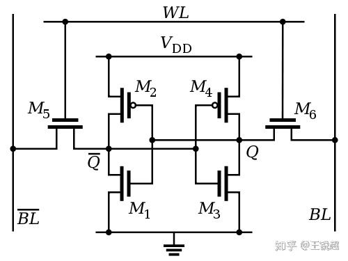

标准 6 个 transistor 组成的 6T SRAM

> A typical SRAM cell is made up of six[MOSFETs](http://link.zhihu.com/?target=https%3A//en.wikipedia.org/wiki/MOSFET). Each[bit](http://link.zhihu.com/?target=https%3A//en.wikipedia.org/wiki/Bit)in an SRAM is stored on four[transistors](http://link.zhihu.com/?target=https%3A//en.wikipedia.org/wiki/Transistor)(M1, M2, M3, M4) that form two cross-coupled inverters.

**2.3 Flash Drive**

2.3.1 flash drive 的命名\[69\]：

> the name "flash" was suggested by Masuoka's colleague, Shōji Ariizumi, because the erasure process of the memory contents reminded him of the flash of a camera.

2.3.2 Floating gate

Flash 的最基本单元和之前的 MOS 类似，但是多了一个 floating gate，在电路图中多了一个横线（下图中框框中的 mos）来表示。float gate 的目的就是存放电荷（电子）。

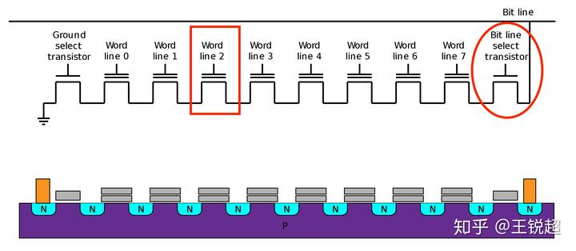

NAND Flash

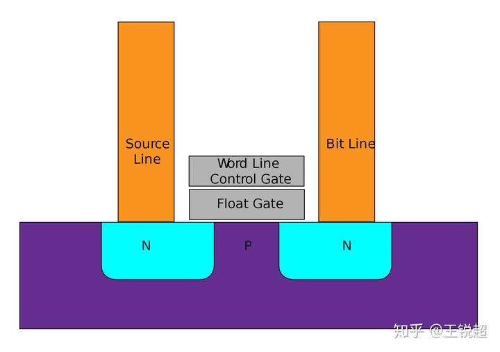

单纯拿过来一个放大了看，中间门极和衬底中间多了一个 float gate。

Float gate 里存的是电子，有电压就认为是逻辑 1，没有就是逻辑 0 。（SLC 状态下）

float gate 和衬底之间只有非常薄薄的一层隔绝层（隔离层就是下图中灰色的部分）。每次写入和读取都会对隔绝层有损害，日积月累，隔绝层就会坏，这时候内存就坏了。

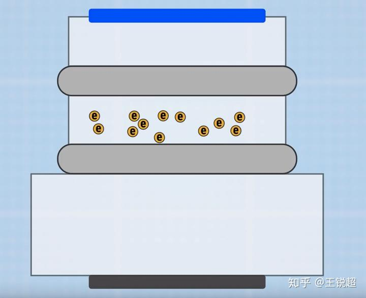

2.3.3 NAND/NOR Flash 都是 Toshiba 发明的，但是 Nor 死了（其实还是有的，但是并不普及），下图就是原因：

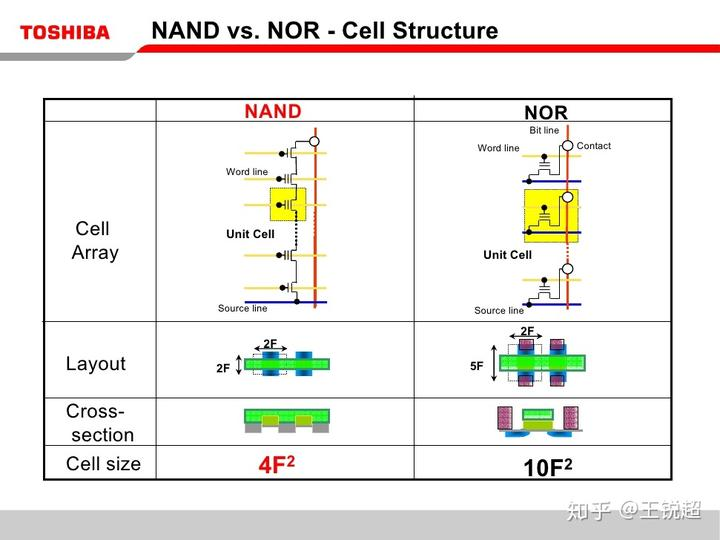

NAND 容量密度更大

2.3.4 2D 到 3D NAND\[70\]\[71\]（三星称之为 vertical， VNAND）

简单解释一下吧，之前的储存模式是一层，之后就跟叠积木，建摩天大楼一样盖高层。\[72\]

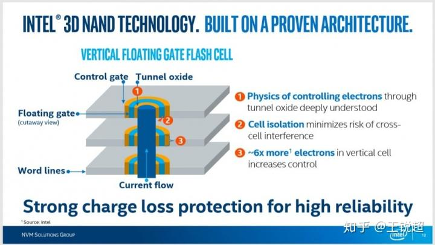

建议观看 Intel 官方介绍视频：[英特尔® 3D NAND 技术如何推动存储发展 - 英特尔® 官网](http://link.zhihu.com/?target=https%3A//www.intel.cn/content/www/cn/zh/architecture-and-technology/3d-nand-technology.html)\[70\]

叠出来效果是这样子的：

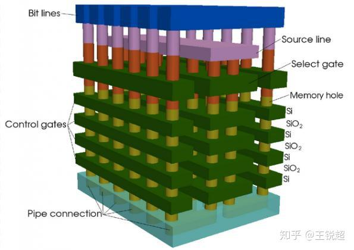

Toshiba takes 3D-NAND to 96-layers, 4 bits per cell

目前来说叠到了 intel 660P，64 层 3D QLC\[73\]，三星 970 EVO PLUS，96 层 V-MLC\[74\]\[75\]

2.3.5, SLC --- MLC---TLC----QLC

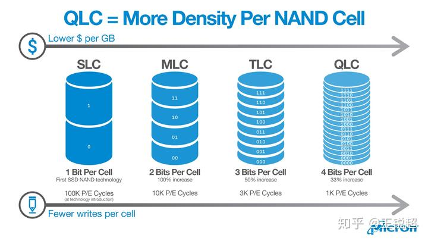

Micron QLC

以前，一个 memory cell 里有电压我们就认为是逻辑 1，没电压就认为是逻辑 0；科学家们发现这样虽然稳定，但是不经济实惠。于是我们把同一个 memory cell 根据电压水平的不同来确定不同的逻辑水平，MLC 就能有 2bit ，TLC 3bit，QLC 4bit 这样。

在此我就不扯到底好不好了，感兴趣戳这里看知乎讨论\[76\]\[77\]，反正事实上把：没人跟钱过不去。大部分人（我说的绝大部分人就是这篇文章都看不进去的那些，根本不可能在 5 年之内把 QLC 写死，谢谢，就算死了，Intel 5 年质保。同样的，这篇文章都看不懂的人，一年能几次把 flash 的 cache 给写完，从而把速度掉下去？）来说，又快又便宜就是好事啊。

推荐看这篇测评：[https://www.youtube.com/watch?v=OffzVc7ZB-o](http://link.zhihu.com/?target=https%3A//www.youtube.com/watch%3Fv%3DOffzVc7ZB-o)

2.3.6 '电子危机‘

如果给爱因斯坦说，我们打算做一个容器，装电子，大概就装几十个吧，爱因斯坦会直接怀疑人生的。。。

你是学物理的，知道电子有小，想把电子装进一个容易有多么不容易。而目前夸张到，每 100mv 只是由 15 个电子 来区分。（真的太不稳定了，不过还好，我们依旧可以通过 DRAM 的刷新方法来给 Flash 供电，省的存错了）

https://twitter.com/alt\_kia/status/1046448638199644160

2.3.7 SATA \[78\]OR PCIe\[79\] NVMe \[80\]，以及 M.2\[81\](可简单理解为尺寸）

最新几年的 CPU 及其 chipset，比如 Z370，虽然还提供 SATA，但几乎可以忽略，PCIe 占据了几乎全部总线（除了 DMI）的范式。

2.3.8 推荐阅读：

[纳米技术走到尽头？固态硬盘闪存如何跳出即将终结的摩尔定律](http://link.zhihu.com/?target=http%3A//www.sohu.com/a/311471171_615464)\[82\]

**3 TDP，主频，以及超频**

3.1 TDP \[83\]\[84\]

> Thermal Design Power (TDP) represents the average power, in watts, the processor dissipates when operating at Base Frequency with all cores active under an Intel-defined, high-complexity workload. Refer to Datasheet for thermal solution requirements.

i9-9900K 的 TDP=95W，但是官网是不提供具体损耗的，想知道细节只有前两个方法：1，查 datasheet（这个需要问 intel 要，而且普通人看不懂）；2，做测试\[85\]，发现极限瞬时功率已经到 204W ；3，功率计算器，比如 MSI 提供的\[86\]（TDP）。

而其实现在的芯片都在追求能耗比，即 更小的功率有更好的效率。

3.2 瞬时超频的 Turbo boost \[87\]

对于普通用户（非游戏玩家，非专业用户）来说，workload 并不是稳定的，大部分 workload 都是非常平稳（低的），在打开软件的瞬间才大。所以瞬时超频就能非常‘聪明’的解决这个问题。

3.3 低压处理器

**比如**超级本上，我们就限定 **功率 TDP = 15W 的基础上，CPU 运行速度越快越好！**

芯片里的功耗，最大的功耗就是‘**漏**’掉了，如果你深入研究会发现，几乎所有地方都在漏，没有不漏的，生产工艺 / 设计工艺里，有很大一部分都在研究如何减少‘漏电‘的情况。不过先抛开怎么减少的漏电，我们先直观的感受一下 CPU 的功耗是什么\[88\]：

，_C_ is capacitance, _f_ is frequency, and _V_ is voltage。

这个公式特别好理解，**CPU 的功耗和 电路运行的速度成正比，和电路运行的电压的平方成正比。**所以想要减少 CPU 的功率，就要想办法降低这三个值。

非常的巧：如果我们把 门做小， 电容 C 会随之变小（电路设计里，怎么制作大 C 是个非常大的问题）； f 我们想保持不变，减少电压 V 就是最好的办法。**这就是你所见到的那些‘超级本’ 用的 “低压处理器“的原因。**

如果你还感兴趣，可以继续看这个问题：[为什么计算机芯片大都采用低电压大电流的供电方案？](https://www.zhihu.com/question/303037255/answer/558630384)\[89\]

3.4 为什么低电压就很难高功率，为什么超频需要高电压？

有人告诉你说，**调高电压，就能超频**，但是没有告诉你为什么；在 1.2 章节里提到了，我们希望功率低，但频率高，那么唯一可行的办法就是降低 C 以及 降低 V。

你可能会想，V 为什么不能降低？**加载到门极上的电压低而运行在高频率（不断的开关）的的时候，CPU 会出错**。如果想要‘感性的认识’而不是直接拿过来公式给你展示出来的话就是：‘我们把电压类比成关门的时候用的力气，高电压就好像是用力关门，关门会关的很紧，而低电压的时候（门级电压不够高），关门关不紧，这个时候就会让**电子泄露**，导致 **0/1 混乱**。**（当然实际上，门级电压是怎么影响运行速度的不是这么计算的，在这里是为了让人更好理解。）**

同样的，我们高电压的时候，CPU 就更不容易出错，就可以在更高的速率上运行。这也就是俗称的‘体质’，我借用一下别人的图\[55\]来让你更好的理解一下：

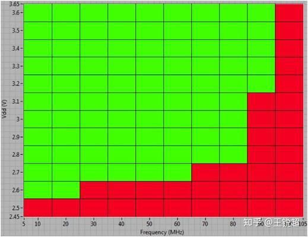

横坐标是 CPU 运行的频率，纵坐标是 CPU 运行电压，绿色表示 CPU 正常工作，红色表示 CPU 出现错误。从图上可以看清楚，为了保证 CPU 处于正常工作状态下更高的频率，就需要更高的电压。

所有些人说‘调高电压就会超频’ 是把**因果弄反**，不是说我们调高了电压 CPU 就会更高的主频，而是说，**想维持 CPU 正常工作的前提下，更高的主频需要更高的电压。**

* * *

**后记：**

希望能对看到文章的人有所帮助，如有不懂可以留言即可，我会补充细节进行解释的。

欢迎留言，指正错误，或者提供相关资料。答主还有好多想要分享给大家的有空一定会更新内容的（optane，PCIe 4.0；Zen2 ）。

谢谢！！！！
