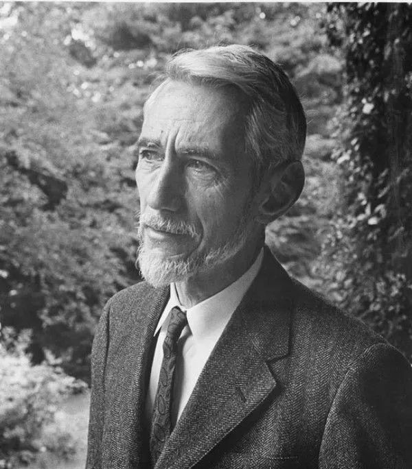

# 祖师爷香农，到底有多神？
1916年，第一次世界大战激战正酣。

  
在这一年的4月30日，远离战场的美国密歇根州佩托斯基（Petoskey），一个男婴呱呱坠地。这个男婴，就是我们这篇文章的主角——香农。

香农的全名，叫做**克劳德·艾尔伍德·香农**（ClaudeElwoodShannon）。他是美国著名数学家、发明家、密码学家，也是信息论的创始人。

换句话说，我们现在所有IT人和通信人的共同祖师爷，就是他。

帅哥香农

香农从小就在一个名叫盖洛德（Gaylord）的小镇生活。他的父亲，是这个小镇的法官，名字叫克劳德·艾尔伍德·香农（没错，他老爹给儿子取了和自己一毛一样的名字）。

香农的母亲，是小镇的中学校长，名叫梅布尔·沃尔夫·香农（Mabel Wolf Shannon）。

父亲是法官，母亲是校长，这样的知识分子家庭，教育氛围当然不会差。

读书时候的香农，已经表现出惊人的数学天赋。在8岁的时候，他就辅导他姐姐做高等数学作业。后来，他姐姐大学毕业，成为了数学教授。。。  

除了数学之外，小香农特别喜欢搞发明创造，其中就包括电报机、电动船，以及各自机械动物。

小时候的香农，看上去就很叛逆  

这个兴趣爱好，估计和他的爷爷有很大的关系。他爷爷是一位农场主兼发明家，发明过洗衣机和很多农用机械。

值得一提的是，香农还有一个远房亲戚，也很喜欢搞发明。这位亲戚的名字，叫爱迪生。

  
1936年，20岁的香农从密歇根大学本科毕业，顺利拿到了数学和电子工程双学位。随后，他进入麻省理工学院继续深造。

两年后，香农完成了他的硕士论文——《继电器与开关电路的符号分析》。

在论文中，他首次提出，可以用布尔代数来描述电路。他将布尔代数的"真"与"假"和电路系统的"开"与"关"对应起来，并用了数学中最简单的两个数字——“1”和“0”来表示。

乔治·布尔（1815-1864），英国数学家

1847年，他提出了布尔代数，这是一种计算命题真伪的数学方法。

香农的这篇论文，虽然仅仅是硕士论文，但具有划时代的意义。它奠定了**数字电路**的理论基础。后来出现的计算机等设备，都以此为设计思路。

后来，著名计算机科学家赫尔曼·哥尔斯坦评价这篇论文是“有史以来最重要的一篇硕士论文”，“从艺术到科学上改变了电路的设计。”

赫尔曼·哥尔斯坦

世界上第一台现代电子数字计算机ENIAC的研制者之一

因为这篇论文，香农获得了电子工程界的大奖——美国Alfred Noble协会美国工程师奖。

正当世人以为这位电子工程天才会继续大展拳脚的时候，他却没了下文。直到两年后，他发出了自己的博士论文——《理论遗传学的代数学》，并凭此获得了麻省理工的数学博士学位。

是的，这家伙玩了个跨界，竟然从电子工程学跨到了生物遗传学。。。

年轻时的香农（有点像福尔摩斯）  

此后，香农去普林斯顿高等研究院待了一年，与爱因斯坦、冯·诺依曼等大师级人物有过交集。他的研究方向，变成了机械模拟计算机。

1941年，香农发表了新的论文——《微分分析器的数学理论》，通过机械式计算机来求解微分方程。

当时的微分分析器  

同年，香农加入了著名的**贝尔实验室**（此后一直工作到1972年）。

最开始进入贝尔实验室的时候，香农是去的数学部，从事和战争相关的工作——研究火力控制系统和密码学。

他所在的密码破译团队，主要负责追踪纳粹德国的飞机和火箭。他还用数学手段，推导了X系统的安全性。这个X系统，就是指英国首相丘吉尔和美国总统罗斯福之间的专用电话线路。

1943年，英国著名数学家、密码学家**阿兰·图灵**访问贝尔实验室，并与香农共进午餐。

阿兰·图灵（1912-1954）

鉴于两人的特殊工作性质，他们并没有进行密码学的交流，反而更多的是讨论**人造思维机器**（也就是后来的AI人工智能）。

当时，香农告诉图灵，他不仅仅满足于向这台“大脑”里输入数据，还希望把文化的东西灌输进去。

这个想法震惊了阿兰·图灵，他感到非常不可思议，惊呼道：“他（香农）想给它来点音乐！”

后来，随着对密码研究的不断深入，香农逐渐形成了一套完整的密码学理论。与此同时，他开始思考有效通信系统的问题。现代信息论的思想雏形，逐渐在他的脑海里形成。

1945年，他向贝尔实验室提交了一份备忘录——《密码学的一个数学理论》。

1948年6月至10月，香农在《贝尔系统技术杂志》连载了那篇改变人类社会发展轨迹的论文——**《通信的数学理论》**。次年，香农又在该杂志发表了另一篇著名论文——**《噪声下的通信》**。

在这两篇论文中，香农给出了通信系统的基本模型，提出了**信息熵**的概念以及数学表达式。

计算信息熵H的公式

大家如果是工科出身且还记得通信原理的话，就知道，一条信息的信息量大小，和它的不确定性有直接关系。

举个例子：如果我告诉你，世界是圆的。这种非常确定的内容，信息量是0（等于一句废话）。如果我告诉你，XX树下埋了一百万美金，那这个信息量就很大。上面那个公式，就是根据确定性大小算信息量的，考研必考题。

香农指出，信息是可以被量化的，用数字编码可以代表任何类型的信息。信息进行数字化后，可以经压缩再传输，极大地减少传输时间和传输成本。

香农还推出了**比特**的概念（他将发明这个词的荣誉归功于自己的同事约翰·图基），将其称为“用于测量信息的单位”。

**bit**  

比特（bit），其实就是二进制数（binary digit）的缩写。

众所周知，比特后来成为了信息时代的基石。我们今天在互联网上所有的信息，都在用它来表达。

除了信息熵之外，香农还在论文中提出了大名鼎鼎的**香农公式**。  

香农公式

简单来说，信息熵讨论的是信息量及数据压缩的临界值。而香农公式，则是讨论通信速率的极限值。

具体细节我们就不讨论了哈，不然人都跑光了。

我们只需要知道，直到现在的5G，我们还没有逃脱香农公式的“魔爪”。有些人一辈子干的事，就是无限逼近香农公式的极限。

两篇论文的发表，奠定了信息论的基础，对学术界造成了巨大的震动，影响力丝毫不亚于1947年12月世界上第一个晶体管的发明（同样来自贝尔实验室）。

当时，因为信息论的观点非常超前，还引起了一些质疑和反对。后来，随着时间的推移，信息技术迅速发展，信息论的价值越发显现，香农也确立了自己**“信息和通信双料祖师爷”**的地位。

忘了说了，发表论文时的香农，才33岁。

1949年，香农在备忘录《密码学的一个数学理论》的基础上，又发表一篇重要论文——**《保密系统的通信理论》**。

这篇论文再次震惊学术界。波士顿环球报称：“这一发现将密码从艺术变成为科学”。

论文开辟了用信息论来研究密码学的新思路，奠定了现代密码理论的基础。香农也凭此成为近代密码理论的奠基者和先驱。

1949年3月27日，香农迎娶了自己在贝尔实验室的同事，玛丽·伊丽莎白·摩尔（Mary Elizabeth Moore），然后继续从事自己热爱的科学研究工作。

1952年，香农夫妇共同推出了著名的“会走迷宫的老鼠”——**忒修斯**。

香农和忒修斯

这是一只木制的、带有铜须的玩具老鼠。它能通过不停地随机试错，穿过一座由金属墙组成的迷宫，直到在出口处找到一块金属的“奶酪”。

最厉害也最具独创性的是：“忒修斯”能够记住这条路线，甚至在下一次任务中，迷宫的墙壁有所移动，都难不倒它。  

当时，香农还专门拍摄了一段影像，制作成电视节目，展示这只老鼠。这个节目引起了公众的极大兴趣，在人们看来，这就是一只“会思考”的老鼠啊。

其实，走迷宫的秘诀并不在老鼠身上，而是在迷宫上。迷宫各处隐藏了75个继电器开关，通过这些简单的只具有开关功能的设备，最终实现了老鼠的所谓“智能”。

1956年，香农成为麻省理工学院（MIT）的客座教授。1958年，成为终生教授。

1961年，香农和同事索普做出一个香烟盒大小的小型计算机，小盒子藏在口袋里，用大脚趾控制藏在鞋子里的开关。这个设备用来干什么呢？用来预测赌场的轮盘赌结果，计算小球落在轮盘不同位置的概率。

凭借这个设备，他们俩还真的在拉斯维加斯赢到了钱。后来，因为被盯上，所以赶紧放弃并离开了。

  
香农另一个著名的发明，是一个会下国际象棋的机器。这个机器用了150个继电器开关，具备不错的计算能力。1965年，香农带着这个机器跑去挑战当时的世界冠军Mikhail Botvinnik。虽然最后还是输了，但表现不赖。

1973年，在以色列阿什凯隆召开的信息论国际研讨会上，IEEE命名了香农奖，并把这一奖项授于香农本人。这种自己领自己名字命名的奖的做法，后来被人戏称为“香农套路”。

1985年，在英格兰布莱顿举行的“国际信息理论研讨会”上，香农突然现身，引起了全场轰动。参加会议的年轻学者简直不敢相信自己的眼睛，竟然亲眼看见了信息理论的祖师爷！更让人瞠目结舌的是，香农竟然在会场上表演起了抛物杂耍，让整个会场更加沸腾。。。

香农当年还是投资大师、炒股高手，擅于采用套利的手法，迅速赚取财富。

1986年8月11日，著名的《巴伦周刊》曾汇总了1026家共同基金的近期表现，香农排名第一。。。

刚才我们提到香农在会场表扬抛物杂耍。其实，香农终身都热爱杂耍。在很年轻的时候，他就学会了骑独轮车和抛接球。当年在贝尔实验室上班的时候，他经常特立独行地骑独轮车去上下班，成为一道靓丽的风景线。

被科学耽误了的杂技天才  

到了晚年时期，香农对杂耍的热爱简直到了痴迷的地步。他花了很多时间刻苦练习，不断提高杂耍水平。他甚至还拥有一张杂耍学博士证书，视为至宝。

除了杂耍之外，他还热衷于制造玩具。他建造了火焰喷射喇叭、火箭驱动飞盘、自动下棋机器人等各种奇怪的玩具。

在后来人工智能先驱马文·闵斯基的启发下，他设计了一个被称为“终结机器”的机器人。当你把开关拨到“开”，盒子打开并伸出一个机械手，它把开关拨回到“关”，然后机械手缩回到盒子里去。

“终极机器”……  

在马萨诸塞州温彻斯特香农的家中（香农称为“熵宅”），堆满了他的小发明。他的车库中存放了至少30辆奇特的独轮车，其中包括一个没有脚蹬的独轮车，一个是方形的轮胎的独轮车，一个特为两个人骑的独轮车。。。

真正的老顽童

香农还把玩杂耍上升到理论的高度，开始撰写《统一的杂耍场理论》。。。

遗憾的是，这篇作品还没有完成，香农就因阿尔兹海默症于2001年2月26日去世了，享年85岁。

著名学者理查德·布拉胡特（Richard Blahut）教授在香农雕像（位于香农老家盖洛德镇）的落成典礼上，是这么评价香农的：

“在我看来，两三百年之后，当人们回过头来看我们的时候，他们可能不会记得谁曾是美国的总统。他们也不会记得谁曾是影星或摇滚歌星。但是仍然会知晓香农的名字。学校里仍然会教授信息论。”

致敬！伟大的信息论之父——克劳德·艾尔伍德·香农！  

参考文献：  

1、香农的信息论究竟牛在哪里，知乎，科言君

2、“信息时代之父”香农：用一只木老鼠奠定人工智能的基础，大科技杂志社

3、香农传：从0到1开创信息时代，中信出版社，吉米·索尼，罗博·古德曼

4、信息论，一个撬动地球的支点，坤鹏论

5、香农 Claude Shannon 有哪些奇闻轶事，知乎

6、信息论之父香农，丁玖

7、克劳德·艾尔伍德·香农，百度百科词条

\- EOF -