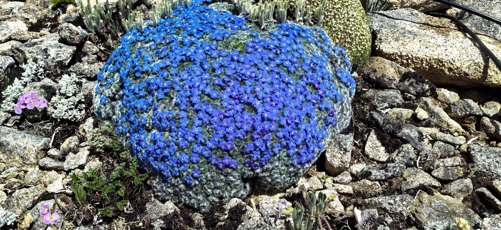

# 科学网—垫紫草的诱惑 - 周浙昆的博文
[科学网—垫紫草的诱惑 - 周浙昆的博文](https://blog.sciencenet.cn/home.php?mod=space&uid=52727&do=blog&id=1444437) 

 

图1 垫紫草

20世纪90年代，我的主要研究方向是在现代植物。在云南丰富多彩植物中，高山流石滩的植物最让我痴迷。高山流石滩是上苍的花园，各种奇花异卉在这里轮番展示自己的风姿。为了不错过它们，我每年都会去高山流石滩进行植物学考察。

上一篇博文说过香格里拉的大雪山是考察流石滩植物最理想的地方，德钦的白马雪山也是这样的地方。因海拔5640米的主峰扎拉雀尼峰，形似骏马且常年积雪，这座山被称为白马雪山（图2）。白马雪山横亘在金沙江和澜沧江之间，是这两条大江的分水岭。承担着滇藏线任务的214国道，从白马雪山穿行而过，将白马雪山分成了南北两个部分。北边是阳面，高山流石滩从公路边一直绵延到山顶，下车就能走进流石滩，看到高山植物。南边是阴面，有一大片草甸，草甸上的物种多样性不如流石滩丰富，来到白马雪山考察植物，北边自然成了大多数人的首选。1997年的一个夏天，我对自己说为什么不去南部看看呢？思行合一，我独自一人踏进了那一大片草甸，穿过草甸，向高处的山峰走去。

图2 白马雪山的主峰扎拉雀尼峰

南边植物的多样性确不如北边，但确也生长着一些在北边看不到的植物，我边走边拍照，采集样品，不经意间便来到了海拔4800米的高程。突然间一种奇特的植物映入了我的眼帘：一朵朵湛蓝色的小花，挤挤挨挨形成了一个蓝色圆形的花球，五瓣蓝色花冠近圆形，每瓣花冠的基部有一抹白色，在花心处汇集成一个白色的圆环，看上去像一只只一眨一眨的小眼睛，蓝色的花球匍匐裸露的岩石上，在这荒芜的山岗上格外显眼。这是一种，我从未见过的植物，从花的特征看，我能判断这是紫草科的植物，但是具体的属、种就不知道了。我拍了几张照片，在不破坏这个蓝色花球的前提下，小心翼翼地从花球的边缘处采了一个小标本，返回了驻地。

回到驻地，我迫不及待地翻起书来，结果很快就出来了。这个蓝色花球是紫草科的垫紫草（_Chionocharis hookeri_）。垫紫草是一个单种属，它分布于西藏南部、云南西北部和四川西南部和锡金，生在海拔3500—5000米石质山坡或陡峻的石崖上。显然，这是青藏高原高寒地区的特有种，分布区域比较狭窄，加之分布海拔较高，可谓藏在深闺人未识，不入深山不得见。

图3 抱团取暖应对严寒的高山植物，从左到右分别是葶苈、垫紫草、点地梅、福禄草、岩梅

由于生活在高寒环境，它们抱团取暖形成了一个个的球形。有研究表明球形的内部的温度，显著高于球形的表面。除了垫紫草，许多高山流石滩的植物如雪灵芝（_Arenaria_）、葶苈（_Draba_）和点地梅(_Androsace_)等都采用这种方式抵御高寒恶劣的生存环境。

那个时候，还没有数码相机，我拍了几张反转片，就匆匆下了山。当照片冲洗出来后，我便得意洋洋地拿到同事中间去显摆。还别说在同事中，真没有几个见到过垫紫草的，更别说有照片了。那张垫紫草的照片，成为我探索高山花卉较为深入的一个标志，让我出尽了风头。

在此之后工作越来越忙，大量的时间花在了写SCI的论文上，加之我的研究方向逐步转向了古植物和古生态，考察高山植物的机会大大地减少了。从那以后，我再也没有亲眼见到过垫紫草。

2024年的6月为了执行第二次青藏高原科学考察研究的任务，我们与中国科学院古脊椎和古人类研究所的团队共同开展横断山地区的野外调查，寻找新生代的动植物化石，并与现代青藏高原东部的动植物进行生态环境的对比研究，就这样我们来到了白马雪山，我多少怀着一点小私心，将考察队伍引到白马雪山的南边，我想要旧地重游，再去看看“深闺”中的垫紫草。

出乎意料的是在考察队伍中，还有一人也惦记着垫紫草，他是中国科学院古脊椎和古人类研究所的副研究员王维。这位和唐朝诗人同名的青年学者，是我们的昆明老乡。我和他的相识，源自2020年发生在古生物界的一次重大事件。那一年3月《Nature》发表了一篇缅甸琥珀化石的封面文章（图4）。这篇Nature文章的作者声称，他们在缅甸琥珀中发现了恐龙，而这个恐龙是世界上最小的恐龙。这个发现瞬间就点燃了古生物圈，世界上真有只有几厘米大小的恐龙吗？有人欢呼，有人质疑。Nature文章的热乎气还未消散，一篇题为《最小的恐龙恐怕是最大的乌龙》的文章，又一次点燃了古生物圈。这篇文章指出：琥珀中的化石，是“虫”（蜥蜴）不是“龙”，最小的恐龙，是一个最大的乌龙。我被的文章严谨的科学态度，非常专业的解剖知识，严密的逻辑所打动，即便我不是研究恐龙的专家，我也相信作者的判断。因为这文章极为专业的解剖学知识，摆事实讲道理，反驳有理有据，令人信服，这篇文章的第一作者正是王维。果不其然， 缅甸琥珀恐龙的Nature文章被撤稿了，最小恐龙真成了最大的乌龙。通过这篇文章让我对这位青年才俊十分欣赏，特别欣赏他求真求实的科学精神。2020年云南植物学会的古植物学分会成立，我专门邀请他来讲一讲古生物学界的这次乌龙事件。

图4 Nature缅甸琥珀中“恐龙”的封面文章

图5 中国电信发行的印有垫紫草的IC卡

王维是从一张IC卡上认识垫紫草的，而这张IC卡上垫紫草的照片就是我提供的(图5)。说到IC卡，现在的年轻网友可能不知道为何物。在20世纪90年代，移动通讯刚刚出现，手机是稀罕之物，动辄几万元，只有大老板们才会拥有，因而被称为“大哥大”。普通人打电话是用街边的公用电话。IC卡就是预存了花费的电话卡，把IC卡插入公用电话，才能打电话。1999年世界园艺博览会（世博会）在昆明举行，中国电信局为了配合世博会，选了一些云南的奇花异卉来装饰IC卡。当中国电信局的工作人员来昆明所选照片的时候，就选到了垫紫草。大概是从小就喜欢大自然的缘故，王维买下了这张印有垫紫草的IC卡，并在话费用完之后，还一直保存着这张IC卡。当王维得知这次考察可能会看到垫紫草时，请家人从他儿时的“百宝箱”中，找出了这张电话卡，并专程送到了昆明机场。

当来车在白马雪山停下的时候，我却有几分的忐忑。27年前，我还正当年，独自一人，一边爬山，一边看植物，不知不觉中就到达4800米的高程。如今我已经68了，是否还能再次爬到4800米垫紫草生长的地方，心里实在没有底。

图6 流石滩上的花园

图7 流石滩上的“新老朋友”， 左上：岩须、马先蒿、怒江杜鹃、左下：矮生野决明、紫花糖荠、疏叶雀儿豆

我鼓足勇气朝往上走，看似荒芜的山岗，其实是一个神奇的花园（图6），不经意间，就会看到各种奇花异卉就会冒出来。我边走边看植物边拍照，这些“老朋友”和“新朋友”让我忘记了疲劳（图7），引导着我一步步地往前走。

仰头看去，远处有一道山梁，山梁仿佛已经是最高处，给人一个错觉，似乎那个山梁就是山顶了，多年的爬山的经验告诉我，那个山梁后还有山梁，所谓山外有山，天外有天。我喘着粗气在想，这人生之路也充满了一个个的坎，过了一个还有一个在等着，只有不断地爬坡上坎，才能够领略高处的景色。

图8 王维看到垫紫草后发来的第一张照片

几位同学们一会儿就从身边消失不见，他们急不可耐地向山顶走去，想尽早一睹垫紫草的芳颜。不会儿，王维就在群里发了一张照片，他已经看到了垫紫草（图8）。这不啻是一针强心针，让我鼓起余勇奋力向前。又爬一道又一道的山梁，海拔已经到了4800米，山体在此处开阔了起来，我终于又看到那个让我魂牵梦萦的蓝色花球，它们星星点点散落在裸露的岩石间，让荒芜的山岗显出几分的生机（图9）。

图9 散落在高山上的垫紫草

王维早就在山顶等候着，说好的我们要和垫紫草还有那张IC卡合一个影（图10）。也许正是这张IC卡，让王维的心里更增添了热爱大自然的情愫，并把他引到了古生物的领域。

我在68岁的年龄，爬上了海拔4800米的山岗，又看到了垫紫草，实现了另一个小目标（图11）。在上山的路上疲惫不堪，我也曾想过要放弃，由于坚持，我看到垫紫草。人生的目标，哪一个不是坚持才能实现的。

图10 两位昆明老乡与垫紫草的相遇

图11 实现小目标，又见垫紫草

转载本文请联系原作者获取授权，同时请注明本文来自周浙昆科学网博客。  
链接地址：[https://blog.sciencenet.cn/blog-52727-1444437.html](https://blog.sciencenet.cn/blog-52727-1444437.html)

上一篇：[杜鹃花名考证——滇西北考察纪行之三](https://blog.sciencenet.cn/blog-52727-1442399.html)  
下一篇：[一个吃瓜群众的杂感——写在基金放榜之时](https://blog.sciencenet.cn/blog-52727-1449079.html)