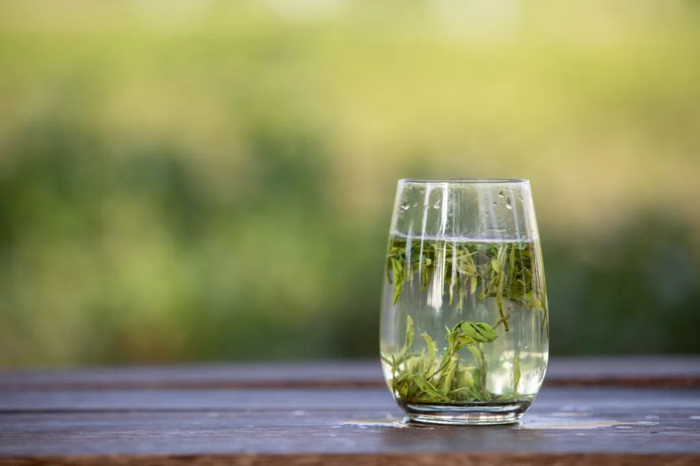
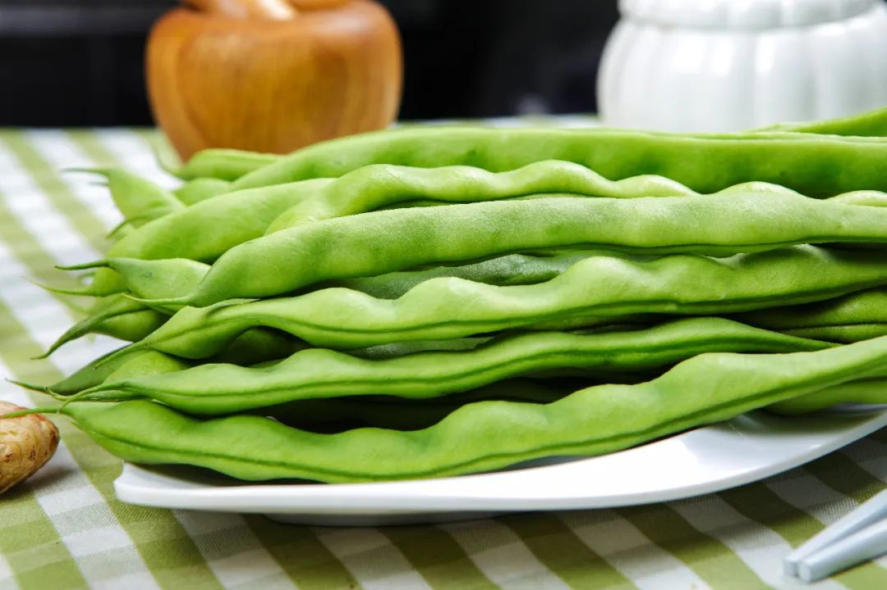
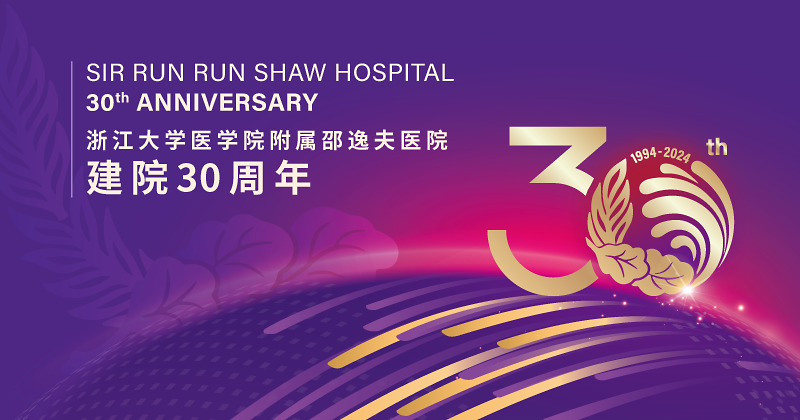

Title: 经常吃这些食物，得脂肪肝的概率会低很多！爱吃的人赚到了……

URL Source: https://mp.weixin.qq.com/s/_plrCtyM-RojBQVxcUf-gQ

Markdown Content:

脂肪肝  

光是听名字就令人害怕

那些在“门外”徘徊的人  

更是心惊胆颤

有没有什么“无痛”的方法

可以逆转或者降低

脂肪肝的发生概率？

图源：图虫创意

**经常吃这几类食物**

**得脂肪肝的概率会低很多！**

2024年9月，《美国临床营养学》期刊上发表的一项研究发现：摄入更多**富含类黄酮的食物**，有助于降低非酒精性脂肪肝风险、肝脏脂肪、肝脏炎症性病变风险。与类黄酮的食物摄入量最少的人相比，类黄酮的食物摄入量最高的人，非酒精性脂肪肝的风险降低19%。

**这项研究涉及的类黄酮食物包括**

茶（红茶和绿茶）、苹果、浆果

葡萄、甜椒、洋葱

黑巧克力、橙子、葡萄柚

类黄酮食物有一系列健康益处，如**抗氧化、抗炎和抗癌特性**，还与更好的心脏代谢健康、有助于改善认知功能等相关。

这项研究纳入了超过12万名参与者，他们年龄在40~69岁之间。在平均10年的随访期间，共发现了1081人患上非酒精性脂肪肝。

通过对他们饮食中不同食物分析发现，与摄入量最少的人相比，摄入大量苹果和茶的人，患非酒精性脂肪肝风险较低，分别降低22%、14%；摄入大量苹果、茶和黑巧克力的人肝脏脂肪含量较低；摄入大量茶和甜椒的人肝脏炎症性病变风险较低。

最后，研究人员还发现：较高的茶和咖啡摄入量，均与较低的脂肪肝风险、肝脏脂肪相关，但只有茶摄入量与较低的肝脏炎症性病变相关，表明饮茶中的黄酮类化合物对肝脏炎症有额外的影响。

图源：图虫创意

**逆转脂肪肝**

**还可以试试这3个办法**

除了饮食上可以多摄入一些“类黄酮食物”，近年来越来越多的研究也发现了很多逆转脂肪肝的方法，可以试一试！

**晚饭早点吃**

**脂肪肝好转了**

2024年7月，《细胞代谢》期刊的一项研究发现，**每天17点后到第二天上午7点不再吃任何食物**，可改善脂肪肝。

研究招募了19名脂肪肝患者，进行了为期4周的饮食方案：参与者每天早上7点到17点之间，只有这10个小时内可以吃东西；从17点到第二天早上7点不再吃任何东西。同时收集了实验前后的粪便和血浆样本，还检测了肝功能及血脂异常的指标。

研究发现，4周后这样的饮食调整改善了参与者的肝损指标，更改善了脂肪肝。比如，血清丙氨酸氨基转移酶、天冬氨酸氨基转移酶水平降低了，肝脏脂肪变性指数、甘油三酯水平、体重指数也降低了。

**吃点抗性淀粉**

**脂肪肝减轻了**

2023年9月，《细胞代谢》期刊上发表的一篇研究发现：多吃一些富含“抗性淀粉”的食物，可以减轻脂肪肝，并降低与肝损伤、炎症相关的甘油三酯以及肝酶水平。

抗性淀粉，是一种难消化淀粉，存在于：**青香蕉、全谷物、土豆、红薯、豆类和全麦等**天然食物中。虽然它不能被直接消化，但却可以被结肠中的微生物菌群发酵，对代谢有积极的影响。研究共招募了200名脂肪肝患者，分成2组：

**第一组**

100名患者吃来自玉米的抗性淀粉

**第二组**

100名患者吃相等能量的对照淀粉

两组脂肪肝患者每次饭前用20克淀粉与300毫升水混合食用，每天两次。4个月后发现：

**脂肪肝和体重减轻**

与对照组相比，抗性淀粉显著降低了参与者肝内甘油三酯含量，绝对降幅为9.08%，相对降低39.42%。此外，还显著降低了参与者的体重、BMI等。

**肝损伤得到了改善**

抗性淀粉组参与者的丙氨酸转氨酶、天冬氨酸转氨酶和γ-谷氨酰转肽酶也显著降低，这表明，肝损伤得到了改善。

**血脂异常有所缓解**

抗性淀粉组参与者的总胆固醇、甘油三酯、低密度脂蛋白和高密度脂蛋白均有所改善，缓解了血脂异常。

**吃点四季豆**

**有助减轻脂肪肝**

四季豆是常见的蔬菜。因其营养价值高，口感脆嫩，味道鲜美，深受大家喜爱。

2023年7月，《营养素》杂志刊发的一篇研究显示：日常食用四季豆，可以有效减轻小鼠的肥胖、血脂和血糖，并改善胰岛素抵抗和肝功能标志物，从而减轻脂肪肝。

不过，这里要提醒大家，生的或未煮熟的四季豆含有“皂甙”和“红细胞凝集素”等物质，容易引起中毒，一定要焯水熟透再吃。

图源：图虫创意

**参考文献：**

1．William Bell, A flavonoid-rich diet is associated with lower risk and improved imaging biomarkers of nonalcoholic fatty liver disease: a prospective cohort study,

The American Journal of Clinical Nutrition,2024,https://doi.org/10.1016/j.ajcnut.2024.09.022.

2．A microbial metabolite inhibits the HIF-2α-ceramide pathway to mediate the beneficial effects of time-restricted feeding on MASH.Cell Metabolism.

https://doi.org/10.1016/j.cmet.2024.07.004.

3．Resistant starch decreases intrahepatic triglycerides in patients with NAFLD via gut microbiome.Cell Metabolismalterations. https://cell.com/cell-metabolism/fulltext/S1550-4131(23)00297-8.

4．Pyrotective Effects of White Kidney Bean (Phaseolus vulgaris L.) against Diet-Induced Hepatic Steatosis in Mice Are Linked to Modification of Gut Microbiota and Its Metabolites.Nutrients 2023, 15(13), 3033; https://doi.org/10.3390/nu15133033.

**来源：健康时报**

**审核：邵逸夫医院 临床营养科**

**此内容已获授权**

**经邵逸夫医院综合编辑整理**

微信改版了

现在刷到我们的科普全凭缘分

大家记得关注**邵逸夫医院**

星标3连不迷路哦!

▽

