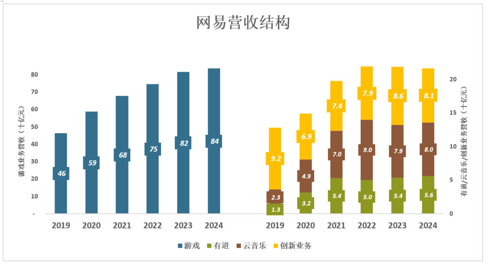
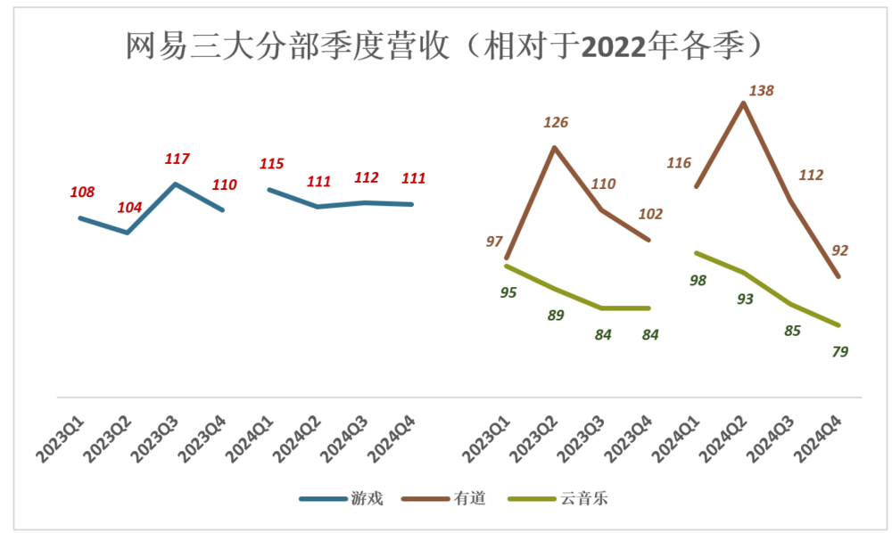
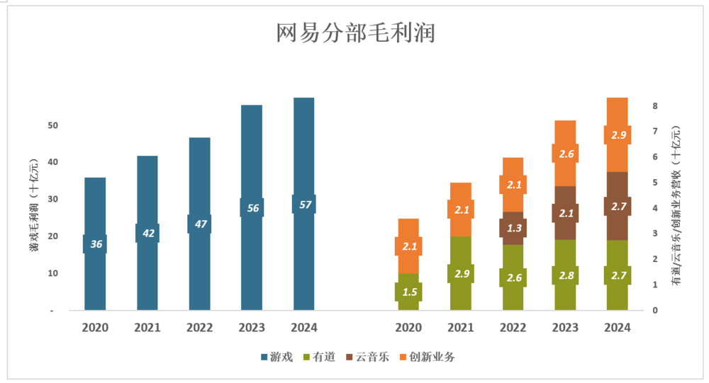
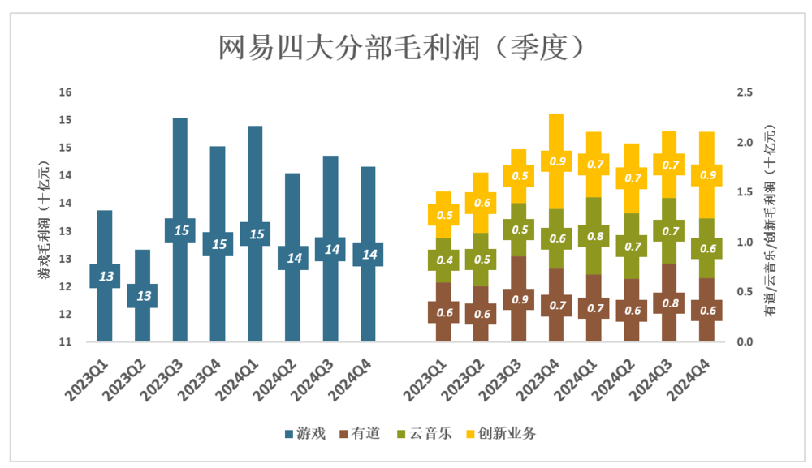
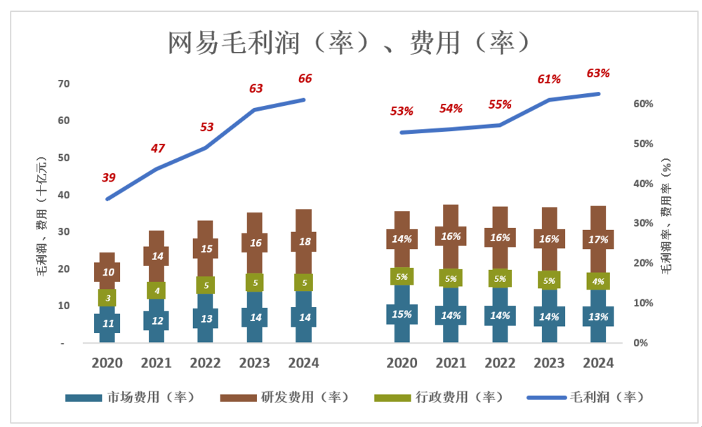
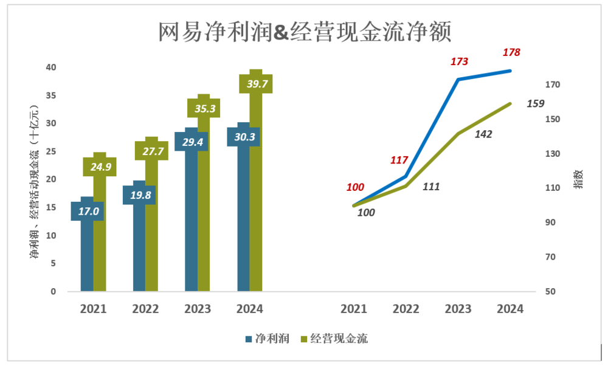

网易有资格“躺平”
===============
                                                                          

             

  

网易有资格“躺平”
=========

[虎嗅APP](javascript:void(0);)

虎嗅APP

北京虎嗅信息科技股份有限公司

从思考，到创造

8077篇原创内容

_2025年03月18日 00:11_

The following article is from 妙投APP Author Eastland

[

作者｜Eastland  
头图｜视觉中国

2025年2月20日，网易（NASDAQ：NETS；HK：09999）发布《2024年四季度及全年业绩公告》。公告显示：

> 2024年Q4营收267亿、同比减少1.45%；净利润89.2亿、同比增长33.6%。剔除汇兑损益，2024年Q4净利润同比下降1.38%。
> 
> 2024年营收1053亿、同比增长1.77%；净利润302.6亿、同比增长3.06%。剔除汇兑损益，2024年净利润同比增长1.73%。

网易赚钱能力堪比茅台，但净利润增速不到2个百分点，近乎“躺平”。

“三驾马车”

自2021年Q1，网易云音乐分部业绩开始单独披露；2022年Q2，“在线游戏服务”分部更名为“游戏及增值服务”（以下简称“游戏”），同时将“创新业务”分部与旅游相关的业务并入其中。

游戏始终是网易的支柱业务，占营收的比例保持在80%一线：

> 2019年，游戏收入464亿，占营收的78.4%；有道、云音乐收入分别为13亿、23.2亿，分别占营收的2.2%、3.9%；创新业务收入92亿，占营收的15.5%；
> 
> 2020年，游戏收入增至587亿，占营收的79.7%；有道、云音乐收入分别增至31.7亿、49亿，分别占营收的4.3%、6.6%；创新业务收入68.8亿，占营收的9.3%；
> 
> 2021年，游戏收入增至678.2亿，占营收的77.4%；有道、云音乐收入分别增至53.5亿、70亿，分别占营收的6.1%、8%；创新业务收入74.3亿，占营收的8.5%；
> 
> 2022年，游戏收入增至745.7亿，占营收的77.3%；有道收入降至50亿、云音乐收入增至90亿，分别占营收的5.2%、7.6%；创新业务收入79亿，占营收的8.2%；
> 
> 2023年，游戏收入816亿、占营收的78.8%；有道、云音乐收入分别为53.9亿、78.7亿，合计占营收的12.8%；创新业务收入86.5亿，占营收的8.4%；
> 
> 2024年，游戏收入836.2亿、占营收的79.4%；有道、云音乐收入分别为56.3亿、79.5亿，合计占营收的12.9%；创新业务收入81亿，占营收的7.7%。

有道、云音乐取得长足进步，但网易远未摆脱对游戏的高度依赖。如果拿“三驾马车”打比方，游戏始终是“辕马”，有道、云音乐只能间或“出点力”：

> 2020年、2021年，网易营收分别增长144亿、139亿；其中有道、云音乐合计贡献30%以上；
> 
> 2022年，游戏收入增长9.9%，有道收入减少6.4%，云音乐收入增长28.5%。最终，网易总营收增长89亿，其中75.9%来自游戏；
> 
> 2023年，云音乐营收滑落12%，有道增速度5.4%；网易营收增长70亿，全部来自游戏。

**  
2024年，网易营收同比增长18亿，游戏业务对营收增长的贡献率超过100%。**

以下是过往八个季度游戏、有道、云音乐营收指数（以2022年对应季度为基准）：

> 2023年Q1，游戏收入201亿，营收指数为108（相当于2022年Q1的108%）；有道、云音乐收入指数分别为97、95；
> 
> 2024年Q1，游戏收入215亿，营收指数115；有道、云音乐营收入指数分别为116、98；
> 
> 2024年H2，游戏收入增长乏力、有道、云音乐收入同时滑落——Q4游戏营收指数111，有道营收指数92，云音乐营收指数79。

**2024年Q4，网易总营收267亿，同比减少1.4%，三驾马车跑不动了！**

都能挣钱养家

网易难能可贵之处在于，游戏以外的业务，包括其他大厂赔钱的“创新业务”都有较高的毛利润率。

1）游戏盈利能力超强

> 2020年，游戏毛利润360亿、毛利润率61.3%；有道毛利润14.5亿、毛利润率45.9%；创新业务毛利润21.4亿、毛利润率31%；
> 
> 2021年，游戏毛利润增至418亿、毛利润率61.7%；有道毛利润29.1亿、毛利润率54.3%；云音乐首次获得毛利，利润率2%创新业务毛利润21.1亿、毛利润率28.4%；
> 
> 2022年，游戏毛利润增至468亿、毛利润率62.7%；有道毛利润25.8亿、毛利润率51.5%；云音乐毛利润12.9亿、毛利润率14.4%；创新业务毛利润21.1亿、毛利润率26.6%；
> 
> 2023年，游戏毛利润增至556亿、毛利润率68.2%；有道毛利润27.7亿、毛利润率51.4%；云音乐毛利润21亿、毛利润率26.7%；创新业务毛利润25.7亿、毛利润率29.7%；
> 
> 2024年，游戏毛利润增至575亿、毛利润率68.8%；有道毛利润27.5亿、毛利润率48.9%；云音乐毛利润26.8亿、毛利润率33.7%；创新业务毛利润29亿、毛利润率25.8%；

由于在全球市场推出重磅游戏，2023年Q3到2024年Q1，网易游戏在三个季度内赚到445亿毛利润；2024年Q2开始回落，三个季度赚426亿。

2025年网易游戏盈利有可能创新高，迹象如下：

> 2024年12月6日，《漫威争锋》上线，72小时吸引超过1000万注册用户；
> 
> 《燕云十六声》上线，双端玩家（PC+手机）在两周内突破1500万；
> 
> 2025年2月，《守望先锋》回归。

2）没有“掉队业务”

网易的过人之处在于，有道、云音乐、创新业务都能“挣钱养家”：

*   有道
    

> 2023年Q1毛利润6亿、毛利润率51.7%；2024年Q4毛利润6.4亿、毛利润率47.8%；
> 
> 2023年毛利润27.7亿、毛利润率51.4%；2024年毛利润27.5亿、毛利润率48.9%。

*   云音乐
    

> 2023年Q1，毛利润4.4亿、毛利润率22.4%；2024年Q4、毛利润6亿、毛利润率31.9%；
> 
> 2023年毛利润21亿、毛利润率26.7%；2024年毛利润26.8亿、毛利润率33.7%。

*   创新业务
    

> 2023年Q1毛利润4.7亿、毛利润率25.4%；2024年Q4毛利润8.6亿、毛利润率37.8%；
> 
> 2023年毛利润25.7亿、毛利润率29.7%；2024年毛利润29亿、毛利润率35.8%；

从阿里、美团到京东，创新业务都以“砸钱探路”为宗旨。别说不追求利润，“锐意亏损”方显进取精神。

网易创新业务包括“网易严选”、“网易传媒（电商）”、“网易数智（企业服务）”、“网易灵动（机器人）”。2024年营收81亿、同比下降6.4%；毛利润29亿、同比提高12.9%。

总体盈利能力

1）毛利润及费用

蓝色折线代表毛利润（率）、彩色堆叠柱代表费用（率），蓝色淹没彩色方能获得经营利润：

> 2020年，网易毛利润390亿、毛利润52.9%；市场/研发/行政费用合计244亿、总费用率33.2%；
> 
> 2022年，网易毛利润达528亿、毛利润54.7%；市场/研发/行政费用合计331亿、总费用率34.3%；
> 
> 2023年，网易毛利润达631亿、毛利润60.9%；市场/研发/行政费用合计354亿、总费用率34.2%；
> 
> 2024年，网易毛利润达658亿、毛利润62.5%；市场/研发/行政费用合计362亿、总费用率34.4%；

**2024年，网易毛利润率较2020年提高10个百分点，而总费用率稳稳地控制在34%一线，对成熟“大厂”而言非常难得。**

2）净利润&经营活动现金流净额

> 2021年，网易净利润170亿，经营活动现金流净额达249亿；
> 
> 2022年，净利润198亿、指数为117（相对于2021年，下同）；经营活动现金流净额277亿，指数为111；
> 
> 2023年，净利润294亿、指数达173；经营活动现金流净额353亿，指数142；
> 
> 2024年，净利润303亿、指数为178；经营活动现金流净额397亿，指数159；

净利润稳步提高，经营活动现金流净额远高于净利润，网易盈利能力、盈利质量都非常高。

截至2024年末，网易现金、短投、定期存款合计超过1400亿，足以“做激进的事”。

烧钱很容易，砸算力、送外卖、国际化……网易选择躺平、静观其变。

首先，网易有躺平的资格。其次，会有投资人喜欢这种风格。

\*以上分析仅供参考，不构成任何投资建议

你对当前的投资市场有哪些疑惑？

目前作者Eastland的粉丝群正在招募中，他可谓是财报解读方面的专家，本篇是他第1049篇上市公司的分析文章，扫描下方二维码，即可加入彤师粉丝群，与他直接沟通～

如对本稿件有异议或投诉，请联系tougao@huxiu.com

End

预览时标签不可点

Close

更多

Name cleared

**微信扫一扫赞赏作者**

Like the Author[Other Amount](javascript:;)

Articles

No articles

Like the Author

Other Amount

¥

最低赞赏 ¥0

OK

Back

**Other Amount**

更多

赞赏金额

¥

最低赞赏 ¥0

1

2

3

4

5

6

7

8

9

0

.

Close

更多

搜索「」网络结果

​

暂无留言

已无更多数据

[Send Message](javascript:;)

  写留言:

Close

**Comment**

Submit更多

[表情](javascript:;)

Scan to Follow

继续滑动看下一个

轻触阅读原文

虎嗅APP

向上滑动看下一个

当前内容可能存在未经审核的第三方商业营销信息，请确认是否继续访问。

[继续访问](javascript:)[Cancel](javascript:)

[微信公众平台广告规范指引](javacript:;)

[Got It](javascript:;)

 

 Scan with Weixin to  
use this Mini Program

[Cancel](javascript:void(0);) [Allow](javascript:void(0);)

[Cancel](javascript:void(0);) [Allow](javascript:void(0);)

× 分析

 : ， ， ， ， ， ， ， ， ， ， ， ， .   Video Mini Program Like ，轻点两下取消赞 Wow ，轻点两下取消在看 Share Comment Favorite 听过            

**虎嗅APP**

网易有资格“躺平”

,

,

选择留言身份
