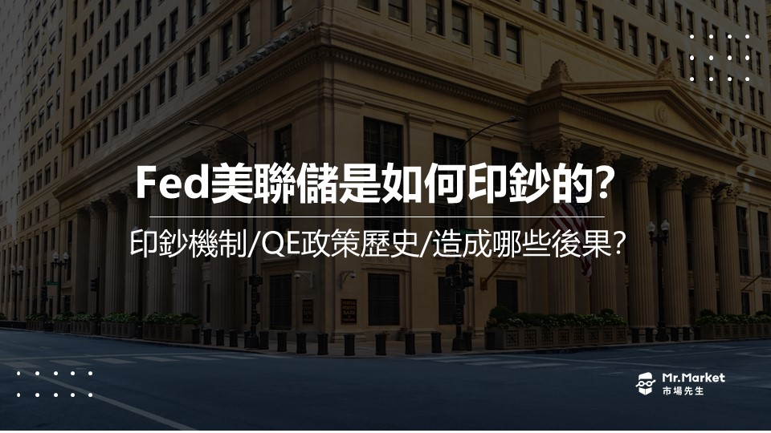
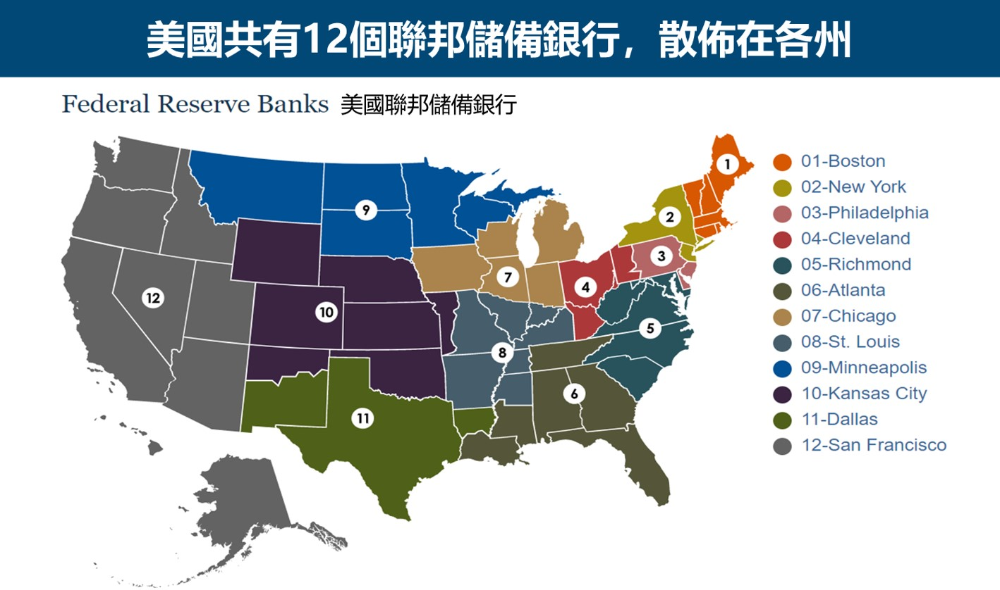

# 美聯儲是如何印鈔的？大量印鈔帶來的後果是什麼？ - Mr.Market市場先生
[美聯儲是如何印鈔的？大量印鈔帶來的後果是什麼？ - Mr.Market市場先生](https://rich01.com/how-the-federal-reserve-prints-money/) 

 

2020年新冠肺炎發生後，金融市場最關注的事情之一莫過於[美聯儲](https://rich01.com/waht-is-fed-libor-and-sibor/)瘋狂印鈔，短短2年內印了超過4兆美元，然而這次的印鈔也讓全世界在2021至2022年承受了高通膨的後果。

很多人以為美聯儲印鈔是大量印製實體的美元鈔票，實際上並非如此，在這過程中並沒有實體鈔票的產生。

這篇文章市場先生帶你了解美聯儲的「印鈔」機制，並探討大量印鈔會帶來的後果及影響有哪些。

美聯儲如何印鈔?
--------

要了解美聯儲如何印鈔之前，**要先認識兩件事：美聯儲 及 存款準備金**。

**美聯儲**（簡稱Fed）是美國的中央銀行，主要負責執行國家的[貨幣政策](https://rich01.com/what-is-monetary-policy-0/)，為國家提供安全、靈活及穩定的貨幣與金融體系。

> 如果對美聯儲不清楚，可閱讀：[最完整的FED懶人包](https://rich01.com/waht-is-fed-libor-and-sibor/)

美聯儲並不像台灣的中央銀行是屬於官方的機構，而是屬於一個半官方、半民營的機構。

Fed美聯儲主要由兩部分組成：

**1.聯邦儲備局：** 可以將它理解為美國政府對美聯儲的管理機構。

**2.聯邦儲備銀行：** 目前全美共有12個聯邦儲備銀行，散佈在各州，算是央行在地方的分部，每個銀行分管自己的轄區，讓地方的商業銀行存放存款準備金。

這些銀行股份是由三千多家私人銀行組成，包含大家熟知的洛克斐勒家族、羅斯柴爾德家族、花旗銀行、摩根銀行都是股東，所以會有些言論說美國央行實際上是被私人大家族所控制了。

**存款準備金**一般是法定要求將商業銀行將一定比率的資金存於央行，剩下的才能對外貸款釋出。

例如商業銀行接受了民眾100元的存款，需要把20元放在央行當準備金，剩下的80元才可以貸款釋出。

存款準備金在[美聯儲資產負債表](https://rich01.com/fed-balance-sheet-0/)上為負債，相當於是美聯儲欠商業銀行的錢。

銀行也可以將多餘的資金存入央行的準備金帳戶，  
根據法規規定比率存入的稱為 **法定準備金**，存入超出規定的準備金稱為 **超額準備金**，  
超額準備金可以自由的借給任一家需要調度資金的銀行收取利息，這利息的利率稱為商業銀行隔夜拆款利率，也是影響市場最重要的基準利率之一，  
2008年以後美國央行也有提供這些準備金利息（在那之前利息是0%，所以銀行不會主動存入太多超額準備金)。

想更完整認識存款準備金，可閱讀：[存款準備金比率是什麼？](https://rich01.com/required-reserve-ratio/)

### 美國為什麼需要大量印鈔？

從2008年金融海嘯後，美聯儲要求存款機構提撥的準備金大增，用來應對突發性的[流動性風險](https://rich01.com/liquidity-risk/)，存款準備金總額因而大幅攀升，佔總負債比重也大舉攀升到50%以上，而美國在過去20年共有四次大量印鈔，印鈔規模相當之大。

此外在當時，利率也已經降到接近0%，因此調整利率工具已經不足以增加市場的信心與流動性，因此需要其他方式來刺激市場經濟與增加貨幣供給。

> **市場先生提醒：** 
> 
> 美國在2020年已經取消存款準備金規定，目前存款準備金率要求是0%，換句話說，銀行收到100元的存款，目前無需存任何錢到央行作為準備金。
> 
> 理由是經過過去幾年QE量化寬鬆，各銀行的準備金已經過剩，存款準備金率在美國已經失去意義。未來仍有可能會變動，但不會是近年的事。

美聯儲印鈔機制怎麼做？
-----------

而我們常說的美聯儲印鈔，實際上是透過電腦修改數字就可以完成的，

整個流程參與者包括美聯儲、美國財政部、商業銀行，流程如下。

**1\. 財政部發行國債，交給商業銀行販售**

商業銀行會去競標買入美國政府的公債。

美國財政部並不能直接把國債賣給美聯儲，主要是為了維持政府與央行兩個機構彼此的獨立性，所以中間要透過商業銀行販售。

**2.美聯儲印鈔的實際做法是調整資產負債表，而不是發行實際鈔票**

美聯儲向商業銀行買入[美國公債](https://rich01.com/t-bill-vs-t-note-vs-t-bond/)或[不動產抵押債券（MBS）](https://rich01.com/what-is-mbs-security/)等證券，會被紀錄在美聯儲的資產負債表中，讓美聯儲資產價值增加。

而這項購買交易，實際上美聯儲並不會付錢給銀行，而是直接在資產負債表上，將銀行在美聯儲的存款準備金提高，也就表示美聯儲欠這些商業銀行的錢增加了，同時也提升了美聯儲的負債。

舉例來說，商業銀行本來存1,000元的準備金在美聯儲，等於美聯儲欠商業銀行1,000元，美聯儲在資產負債表上把這負債從1,000元改為1,200元，意思是多欠銀行200元，於是等於「印了200元的鈔票」。

*   [美聯儲資產負債表](https://rich01.com/fed-balance-sheet-0/)：資產增加公債或其他債券，負債增加準備金
*   商業銀行資產負債表：資產減少公債或其他債券，資產增加準備金

可以看到，

其實對商業銀行來說，只是持有資產的類型改變，總資產並沒有增加，  
但整體來說，商業銀行的資產負債表變得更健康了，原因是在當時許多債券存在流動性風險與違約風險，會增加銀行在資產安全性上的疑慮，  
但透過量化寬鬆，這些債券被美聯儲買走，變成美聯儲的準備金，是人們認為更安全且更有流動性的資產，銀行的資產負債表因此變得健康，銀行也更願意去借貸(至少理論上更有意願)，增加市場的流動性。

而對美聯儲來說，則是資產負債表的擴張，資產與負債都增加。

而美聯儲所持有的負債，本身就是一種最基礎的貨幣，這些貨幣最終可以兌換到美聯儲帳上的債券資產，所謂美聯儲的印鈔也就在這一階段完成。

美聯儲的資產上多了許多從商業銀行買了的公債和其他債券(如MBS)，負債部分則是多了準備金。  
這些準備金名義上是銀行的資產，但並沒有實際把任何的錢匯給銀行，而只是記在聯準會負債的帳上，  
換句話說，聯準會買進債券，無需付出任何錢，只是把帳上欠銀行的(準備金)數字改動一下，就創造了流動性，因此這行為也被人戲稱為印鈔。

> 市場先生提示：要記得，錢就是一種債務、借據
> 
> 聯準會印鈔，印鈔這個詞聽起來像是錢錢憑空出現，但並非如此。  
> 因為新增加的錢，背後其實都有對應到各種資產，只是說對應的資產是否真的有價值，並不一定。
> 
> 在金融海嘯時期，銀行的資產變現能力變差、流動性變差、資產價值受到質疑。利率也已經降到低點，聯準會無法單純透過降息來刺激經濟和增加流動性，因此改用量化寬鬆這種方式直接為市場創造流動性。
> 
> 因此對印鈔的正確理解，應該是市場的流動性增加。

**3.商業銀行因存款準備金增加，更願意借錢給消費者，進而提升消費及投資，促進經濟發展。** 

美聯儲的印鈔並不會直接影響市場，而是透過商業銀行的貸款，間接影響市場經濟。

在商業銀行帳上，存款準備金與各種債券的意義不同，存款準備金是更有流動性的資產，因此銀行的資產負債表更加健全，更有意願提供更多借貸（但並非絕對）。

聯準會所創造出的貨幣是存款準備金，

而商業銀行增加貸款，並不僅有增加準備金的額度，而是可以透過**貨幣乘數**效應，提供市場上更多的信用，創造出更多信用貨幣，  
這些貨幣與美聯儲的貨幣不同，

美聯儲創造的貨幣，背後是以公債、各類債券資產做為保證，這些貨幣最終可以兌換回這些資產。

商業銀行創造的貨幣，背後是貸款人的借貸、以未來償還貸款與利息作為保證。

**4.消費者投資或勞動產生的收入，要上繳稅收到財政部。** 

**5.美聯儲每年的盈餘也要上繳財政部**

財政部拿到這些錢後，就可以償還國債或是執行它的[財政政策](https://rich01.com/what-is-fiscal-policy-0/)，例如拜登在2021年的美國救助計劃，發放給每人1,400美元的紓困金。

所以，這個印鈔的過程實際上只需要美聯儲用電腦改一改資產負債表上的數字，並不需要實際印出鈔票。

如果美聯儲購買的資產(債券)愈多，負債也會同時增加，造成資產負債表擴張，簡稱「[擴表](https://rich01.com/fed-balance-sheet-0/)」。我們常聽到的[量化寬鬆(QE)](https://rich01.com/what-is-quantitative-easing/)就是一種大量擴張資產負債表的貨幣政策。

反之，如果美聯儲賣出資產(債券)，負債同時減少，造成資產負債表緊縮，市場可流動資金變少，指的就是我們常聽到的「[縮表](https://rich01.com/fed-balance-sheet-0/)」。

> **市場先生提示：到這裡看得懂嗎？會不會有點複雜呢？**
> 
> 要有個觀念：所謂的貨幣就是一種欠條、一種負債，例如一張欠條上面說某人欠你1000元，這張欠條即使轉手給別人，他也能要到1000元的話，這張欠條就有價值，也就形成流通的貨幣。
> 
> 而所謂印鈔，就是一種擴大負債的過程，增加市場上欠條的數量，就是在增加貨幣供應量。
> 
> 美聯儲印鈔、增加市場流動性，要保證這些創造出來的貨幣有價值，背後是以銀行的各種債券做為擔保。
> 
> 而因為美聯儲提供的準備金擔保比這些債券更有流動性、更有價值，因為背後有美國政府背書，發行的債券以美國未來的稅收償還（但其實也可以發行新債還舊債），所以貨幣能被創造出來。
> 
> 當然，如果美國政府未來的償債能力受到質疑，那麼美元的價值也同樣會受到挑戰。

美聯儲的印鈔歷史
--------

要查看美聯儲過去是怎麼印鈔的，首先可以從[Economic Research網站](https://fred.stlouisfed.org/series/WALCL)上查看其資產的變化。

從下圖可以看出，在2002年至2022年的20年間，美聯儲的總資產從約9千億美元增加至9兆美元，上漲了約10倍之多，印鈔規模非常驚人。

在這20年當中，美聯儲總共推行過四次[量化寬鬆(QE)](https://rich01.com/what-is-quantitative-easing/)政策，  
分別是在2008、2010、2012及2020年，其中又以2020年的無限QE規模最大。

**美聯儲的「印鈔」性質在2008年金融海嘯那次產生了非常大的變化。** 

在2008年以前，美聯儲印鈔的錢都是拿去買美國國債，因此它的資產上100%是持有國債。

然而，**2008年金融海嘯發生時，美聯儲的資產中出現了大量的[不動產抵押貸款證券(Mortgage Backed Security，簡稱MBS)。](https://rich01.com/what-is-mbs-security/)**

MBS是引發2008年次貸危機的主因，當時金融機構Fannie Mae(房利美)與Freddie Mac(房地美)、雷曼兄弟都持有並銷售大量的MBS，且對MBS提供擔保以及承銷。

MBS裡面有分成不同等級，有非常安全的等級，但也有高風險的，次貸危機出問題的是其中高風險的部分。

房市泡沫後，MBS變成沒有人要碰的垃圾，當時許多銀行都出現了流動性的問題，於是美聯儲為了救市，向銀行買入這些MBS做為資產，另一方面增加了銀行在美聯儲的準備金，使得銀行資產的體質變好，有能力也更有意願向民眾放貸，促進了市場貨幣的流動性。

**一直到現在為止，美聯儲的資產中，都持續有高達30%~40%的MBS。** 

更多關於次貸危機的細節可以看：[2008年金融危機發生始末](https://rich01.com/2008-financial-crisis/)

> 市場先生提示：為什麼美聯儲跟銀行買MBS會增加流動性呢？
> 
> MBS等債券跟放在美聯儲的準備金都屬於銀行的資產，然而在金融海嘯發生時，MBS被視為是不良資產，此時如果銀行擁有大量的MBS，資產品質較差，自然不願意借出太多錢，怕借款人覺得銀行資產不良，大量提走現金，造成擠兌危機。
> 
> 而美聯儲跟銀行買入MBS同時增加其準備金時，會使得銀行的資產品質變好了，因為準備金是美聯儲欠銀行的錢，對銀行而言是相當好的資產。在銀行資產品質變好後，自然更願意放貸給民眾，促進市場流動性。

大量印鈔會帶來哪些後果？
------------

大量印鈔最可能帶來的後果就是**資產泡沫化**、**通貨膨脹**及**承擔美聯儲縮表**帶來的後果。

### 1\. 資產泡沫化：推升資產價格

中央銀行雖然為市場注入了大量的資金，但無法真正控制這些錢的用途，

理想上當然是希望資金投入實體經濟，增加生產、創造就業，

但投資人有可能把這些資金拿去炒股、炒房，這樣可能就會讓資產泡沫化。

用更多的貨幣，追逐有限的金融資產，這些資產價格會上漲，這不代表任何的生產力提升，只是價格上漲而以，如同吹大的泡泡，  
直到有一天這些資金需要退場時，吹大的泡泡終將破裂，被炒高的資產價格將在經歷劇烈波動後重新回到常軌。

### 2\. 通貨膨脹：貨幣的購買力降低

為什麼會造成通膨呢？舉個例子。

假設一個經濟體生產價值1,000萬美元的商品，例如1,000輛車子，每台1萬美元，此時貨幣的供應量是1,000萬美元。

如果央行印鈔，將貨幣供應量增加一倍，提高到2,000萬美元，人們有更多的錢，對車子的需求也增加了，但是車子仍然只有1,000台，此時賣車的人因應需求的增加，會提高車子的價格，可能變成每台2萬美元，這就是通貨膨脹。

如果狀況太極端，甚至會演變成[惡性通膨](https://rich01.com/what-is-hyperinflation-20/)，例如辛巴威曾經發生過100兆辛巴威幣只能買半條吐司的狀況。

通貨膨脹影響最大的就是持有大量現金的人，因為貨幣的購買力下降了，因此高通膨會降低儲蓄的動機，此外，高通膨因為帶來不確定性，也會阻礙企業投資及人民的消費的意願，對經濟來說是不穩定的，並可能會導致經濟衰退。

美聯儲在2020年新冠肺炎後，推出無限QE，資產負債表直接擴張超過4兆美元，造成通膨亦不斷攀升，到2022年7月達到9.1%，為近40年以來新高。

> 市場先生小提示：美聯儲在過去20年來共推行過4次QE，但為什麼2020年這一次會造成這麼高的通膨呢？
> 
> 主要原因是，美聯儲的印鈔絕大部分是屬於在銀行帳戶上的數字，「實體貨幣」增加很少。換句話說，美聯儲主要是透過提高銀行流動性，增強銀行對外放款的能力來增加貨幣供應。
> 
> 在流通的現金增加很少的情況下，物價一般不會有太大的反應，而且在2008年金融海嘯發生後那幾年，原物料跟石油的價格都不如金融海嘯前那麼高，因此沒有造成明顯通膨。
> 
> 但在2020年這次，除了印鈔外還加上疫情跟烏俄戰爭的影響，不但原物料及油價屢創新高，疫情也使得全球海空運費飆漲至疫情前的數倍，因此造成各項原料價格上漲，民生物資的價格自然也上漲，推高通貨膨脹率。
> 
> 我們其實很難歸納說中間有多少是印鈔的影響，但勢必也是影響的一環。
> 
> 美國在2008年後實施量化寬鬆與低利率多年，其實通貨膨脹沒有上升很多。那麼，印鈔後產生的通膨效應跑到哪裡去呢？
> 
> 排除掉經濟成長消化掉這些寬鬆貨幣的情況以外，包括房地產、股票、債券的價格都上漲了。
> 
> 美國現行的通膨與物價指標[CPI](https://rich01.com/what-is-cpi-index/)是用房租計算，而非房價，因此房價上漲造成的通膨被忽略了。此外，美國在2008年股市走了10幾年的[大牛市](https://rich01.com/what-is-bull-bear-market/)，也跟美聯儲大量印鈔脫不了關係，這也是我們在CPI通膨數字上看不見的隱形通膨。

### 3.美聯儲縮表

「[縮表](https://rich01.com/fed-shrink-balance-sheet-mean/)」是美聯儲停止繼續購買債券或是向銀行及社會大眾賣出美國國債等資產，以向社會回收資金流動性，

執行的過程會減少[美聯儲的資產負債表](https://rich01.com/fed-balance-sheet-0/)，資產部分債券會隨著賣出和到期減少，負債部分則是商業銀行的準備金會減少，

上述有提到美聯儲印鈔是屬於「擴表」的行為，然而一旦擴表過度產生高通膨或是經濟過熱的狀況，美聯儲就會進行「縮表」以抑制通膨及過熱的經濟。

縮表可能造成的後果包含公司減少投資、股市熱錢減少，股價面臨下修風險。

詳細可閱讀：[縮表是什麼意思？](https://rich01.com/fed-shrink-balance-sheet-mean/)

快速總結：美聯儲如何印鈔？
-------------

1\. 美聯儲是美國的中央銀行，負責執行國家的貨幣政策，政策目標是促進金融穩定，包括避免通膨過高、減少失業等等目標。

2\. 美聯儲要「印鈔」時，實際的做法是增加它的資產負債表。它跟商業銀行買入國債或房貸抵押債券等證券，增加了資產，但實際上並不是付錢給銀行，而是直接在表上提高銀行在美聯儲的存款準備金，相當於是同時提升了美聯儲的負債。

3\. 美聯儲在過去的20年間，總資產從約9千億美元增加至9兆美元，上漲了約10倍之多，印鈔規模非常驚人，其中在2020年新冠肺炎後啟動無限QE，印鈔超過4兆美元，目的是幫市場注入流動性，避免陷入各種可能的經濟危機。

4\. 大量印鈔最可能帶來的影響就是資產泡沫化、通貨膨脹及在未來某一時刻美聯儲將進行縮表，任何的政策都是有利有弊，必須要承受這些後果。

如果想了解關於美聯儲印鈔更詳細的機制，也可以閱讀以下幾篇市場先生的文章，會對整體運作更清楚：

1\. [Fed如何影響利率的高低變化？是怎麼運作的？](https://rich01.com/fed-interest-rate-work/)

2\. [看懂美聯儲資產負債表](https://rich01.com/fed-balance-sheet-0/)

更多相關文章：

1. [什麼是負利率？對經濟、股市債市、金融體系有什麼影響？負利率時該如何投資？](https://rich01.com/what-fed-negative-interest/)

2. [通膨是什麼？有哪些通膨類型？完整的通貨膨脹投資懶人包](https://rich01.com/blog-post_17-8/)

3. [FED是什麼？FED升降息的影響？最完整的FED懶人包](https://rich01.com/waht-is-fed-libor-and-sibor/)

4\. [量化寬鬆是什麼？(QE)](https://rich01.com/what-is-quantitative-easing/)

5\. [FedWatch是什麼？預測聯準會升息的機率準嗎？要怎麼看升息降息機率與次數？](https://rich01.com/what-is-fedwatch/)

> 本文僅作教學使用，不代表任何投資建議，投資人需了解任何投資皆有其風險。

專欄作者：牟均俞　主編：市場先生

**加入市場先生FB社團，充實更多理財好知識**

50歲之前想退休一定要懂理財，解決投資的煩惱！

市場先生開了一堂的「**用美股ETF創造穩定現金流**」教學課程，  
這堂課程會從基礎入門、資料查詢到實際操作，  
教你學會建立一個穩定的全球ETF投資組合，目前累積已經有將近2000位同學上課。

線上課程》[美股ETF創造穩定現金流線上課程連結](http://bit.ly/2FV3hPc)

  
**如果覺得這篇文章有幫助，**  
**幫我按個讚，分享給更多人看到，謝謝！**