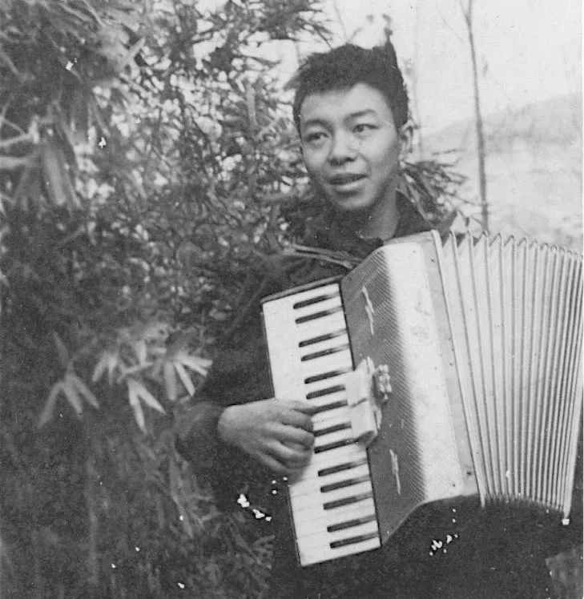
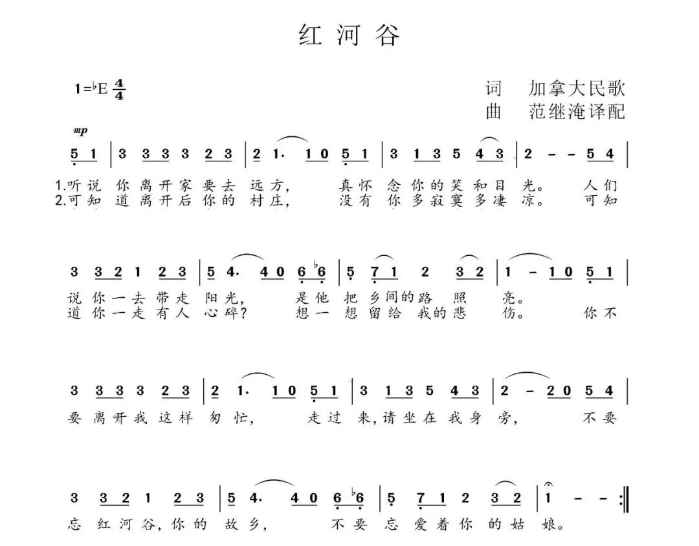
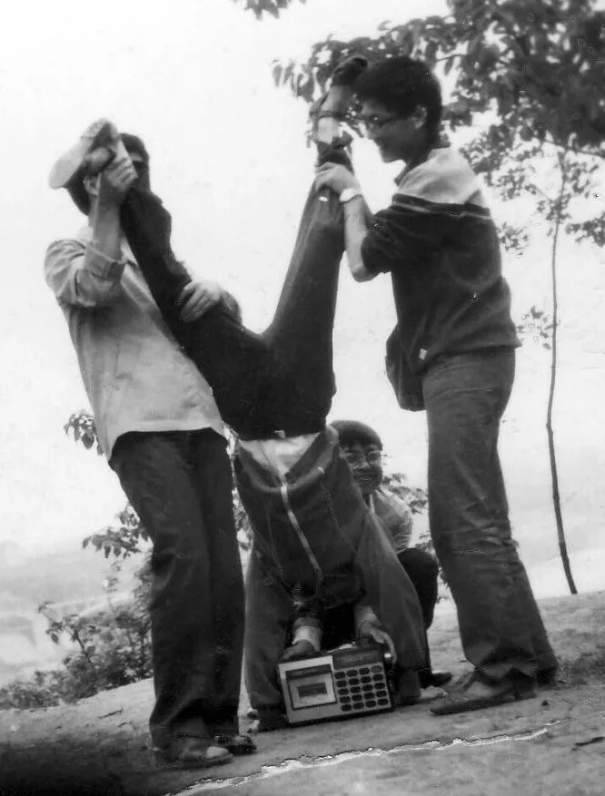
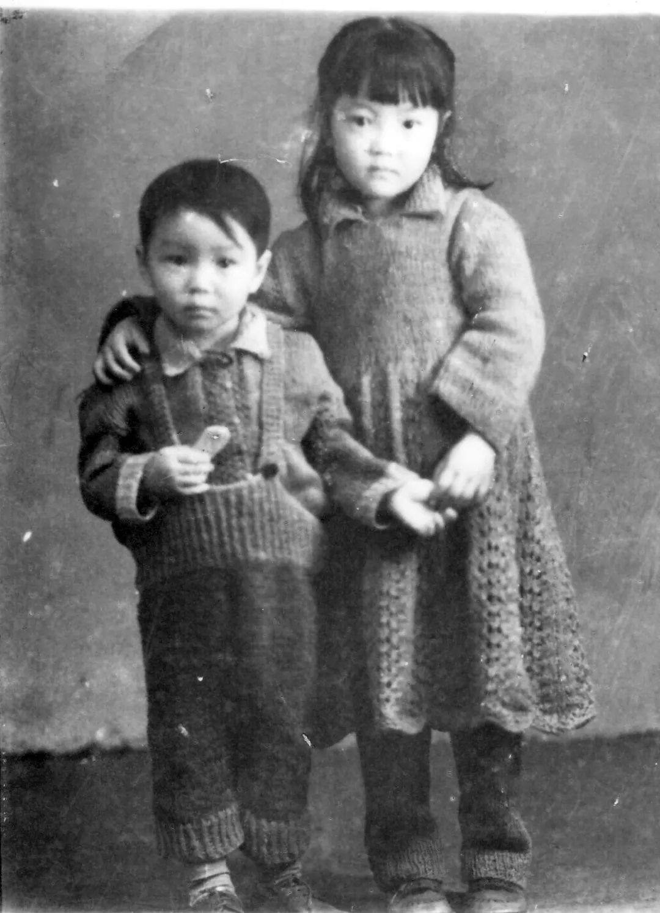

Title: 老万> 你有DeepSeek，我有我舅舅

URL Source: https://mp.weixin.qq.com/s/_W_revSpcB80JVhiIeab9g

Markdown Content:
题记：在我年幼的岁月，没有谷歌，没有 OpenAI，舅舅就是我的超级人工智能。

每个人的人生都会被周遭的人和事推动。在某个地方、某个时间和某某人因缘际会，往往会决定一个人的人生抉择。在轨迹的初期稍有偏离，二十年后这个人就可能会出现在一个截然不同的地方，过着天差地别的生活。

比如，我今天是一个老程序员，住在离开家乡几万公里的美国大西北，写了三十多年软件，每天跟代码库中的各种臭虫奋战，业余写点公众号。这样的人生，自然是在小学三年级放学路上踯躅在国营食品店里装满橘饼和天冬蜜饯的玻璃罐前的我无法想象的。

去年底，意外地在公司拿了个 craftsmanship 奖。查了字典，原来这词就是大家常说的“工匠精神”，历史上得过这个奖项的还有卖油的老翁和解牛的庖丁。公司是夸我牛马当得好啊，不用扬鞭自奋蹄的意思。

在太平洋的另一端拿到这个小奖，我要归因于我的舅舅。从小到大，我的理想就是长成舅舅那样的人。他是我的初代偶像，除父母外对我影响我最大的人。他在我听说“炫酷”这个词之前就向我生动展示了它的真实含义。

用今天的话说，我舅舅是个六边形达人，特立独行的摇滚青年。

你可能会觉得我是在吹牛逼----谁不愿意给自己家门楣上贴金呢？没关系，我会用事实证明我所言非虚。

～～～～

舅舅准确地说是我的七舅。我外公在成都育有七子七女。虽然有的子女夭折了，还有的像我母亲一样在成年后把家安在了外地，但我们大家庭的根基还在成都。每次家族聚会，出行都浩浩荡荡如旅游团，合影必须站三排，摄影师后退二十米才可能拍下所有人。

外公的子女们相处融洽，所有的舅舅和姨妈都对我关爱有加，但只有七舅跟我母亲才是一母所生，尤其亲近。于是"七舅"就简略成了"舅舅"。

舅舅读完中专后分配到简阳县四川拖拉机厂工作。简阳离成都只有几十公里，中间隔一座龙泉山，山上的水蜜桃远近闻名。他在厂里结识了舅妈。舅妈是内江人，而我母亲在内江工作，我们两家都在小东门附近，步行五分钟就可以串门。每年春节舅舅都会从两百公里外的简阳来到内江，一来回舅妈的娘家，二来跟我母亲姐弟团聚。所以，相比于其他舅舅姨妈，我跟舅舅见面次数多了许多。

舅妈家也是一大帮兄弟姊妹。她排行老四，我便叫她四孃。她家的“刘抄手”是内江名小吃，邓小平经过内江时曾专门品尝（见拙文[《四孃家的抄手》](https://mp.weixin.qq.com/s?__biz=MzI1MDQ3NTAxOQ==&mid=2247483855&idx=1&sn=65d8a11f78bbeb847bab5de97f2fee44&scene=21#wechat_redirect)）。我小时候没少吃过小平同款的红油抄手跟清汤抄手。刘抄手现在店名叫“老刘抄手面”，除了抄手，他家的牛肉面跟炝锅面也是有口皆碑，常出现在我梦里。

舅舅和舅妈是在拖拉机厂的毛泽东思想宣传队认识的。舅妈歌唱得好，模样更是标致，《红灯记》里的李铁梅非她莫属。舅舅不唱歌，但是会拉手风琴。那个年代几乎见不到吉他钢琴小提琴这些现在的主流乐器，手风琴既可独奏，又可伴奏，表现力丰富，是当仁不让的乐器之王。舅舅因为要给舅妈伴奏革命歌曲，一来二去两人便好上了。两人都是知识青年，舅妈长得百里挑一，舅舅也是浓眉大眼，走到哪里都是拉风的一对。

外公外婆解放后生活拮据，吃饱饭都是大问题，不可能花钱让舅舅去学乐器，所以手风琴是他自学的。我舅做事的套路就是无师自通，这一点在很多毫不相关的领域被一再验证。

舅舅的音乐天赋跟我外公家的音乐传承有一定关系。我很小的时候便知道我家有好几个舅舅和姨妈都在解放前参加了海星合唱团，经常表演抗日救国歌曲。后来三孃成了音乐老师，四舅会拉小提琴。我母亲出生晚，没赶上参加合唱团，但也一直喜欢唱歌。

我喜欢翻看母亲的手抄歌本。母亲的字写得很好看，歌本抄了二百多页，上面有当时流行的革命歌曲，有民间小调和苏联歌，还有母亲精心手绘的插图。童年时，我家虽然没有乐器或音响设备，但音乐没有断过，我在母亲的歌声中周游世界：“冰雪覆盖着伏尔加河，冰河上跑着三套车（俄国）。”“把我引到了井底下，割断了绳索就走开了，你呀，你呀，你呀（叙利亚）。”“人们说你就要离开故乡，要离开热爱你的姑娘（加拿大）。”“亚克西亚克西，我们的生活亚克西（新疆）。”“小乖乖来小乖乖，我们说给你们猜。什么长，长上天？哪样长，海中间（云南）？”“一送哩个红军，盖子个下了山（四川）。”这最后一首歌被熊孩子改成“掰掰（四川话‘瘸子’）去找红军，红军不要他。说他是个掰掰，走起来一拐一拐。”红歌歪唱，是那时小孩子们不多的娱乐活动之一。

八十年代中期，流行音乐开始进入大家的生活，我也有了一个自己的手抄歌本。但我蚯蚓爬的字完全不能和母亲娟秀的笔迹相比拟，实在是羞于见人。

舅舅舅妈作为老一辈文艺青年，在变革之际紧随潮流，与时俱进。我上大学时，他俩听的是童安格和王杰，跟我完全可以聊到一块儿。当然，他们是有自己的标准的。舅妈问起我在学校听哪些歌星，我齐秦罗大佑崔健张洪量说了一圈后，意犹未尽，画蛇添足说偶尔还听听小虎队。舅妈一听就笑了：这跟音乐也扯不上关系啊。

我听过舅舅在电子琴上弹奏《红河谷》，结尾是 6 ♭6 5，7 1 2 2 3 2 1。我印象里那个 ♭6 应该是 6。到底哪个是对的？舅舅说他一直弹的都是♭6。那时候没有谷歌，红河谷的歌就成了悬案。写这篇文章的时候查了一下：舅舅是对的。

除了音乐，舅舅还玩摄影。我小时候没有数码相机，拍照要用胶卷，拍完了还要冲洗。真正的摄影爱好者都不把胶卷送到照相馆去，而是用自己的暗房和药水 DIY。舅舅就是这样的。那个年代照相机也极其罕见。所幸我有个玩摄影的舅舅，童年才留下了为数不多的几张珍贵照片。

～～～～

我上初中后，以学英语为名求爸妈买一台录音机。爸妈犹豫再三，还是觉得以家里的经济条件有点负担不起。舅舅那时靠手艺挣了些外快，按今天的标准算不上多惊人，但在那个大家都在国家单位领死工资的时代绝对是一马当先。是不是简阳县首富我不知道，但肯定属于小平允许先富起来的那一批。因他手头更宽裕，便资助了我这外甥一台单声道收录机和几盘空白录音带，让我喜不自胜。

这台录音机对我学英语的帮助程度值得怀疑----反正我上大学英语课还是开不了口。但是，它极大地丰富了我的文娱生活。有了它，我做作业的时候要听歌，睡觉的时候要听歌，早上起不了床也要听歌----音量开到头就是我的起床铃。多少个夜晚，我都把它放在床头，听着成方圆、张行入睡。但是有一回失策了：那天我选的睡前音乐是《新长征路上的摇滚》，听得我浑身燥热，越听越睡不着。我算是知道崔大爷的厉害了。想到第二天还要上课，只好换成齐秦，才慢慢把自己哄睡。

初中时，有部风行全国的香港电影《霹雳情》导致了无数青少年沉迷霹雳舞。这部片子的情节很商业，但是音乐制作却非常精良，作曲人都是大师（黄霑、顾嘉辉、谭健常），歌手则是梅艳芳和香港小虎队（跟后来的台湾小虎队是两回事）。我一刷之后就迷上了里面的插曲，果断二刷。二刷时我长了个心眼儿，穿了一件大衣，把录音机藏在大衣里面夹带进了内江人民电影院，非法盗录了全部歌曲。出院后，这盘磁带被我听得快卷边了。

那几年我也在学吉他，跟同班其他三位男生经常在周末一起合奏，其乐融融。这部录音机也留下了我们稚嫩的演奏。可惜的是，当年的录音带已经消失无踪了。

和初中好友携录音机出游内江西林寺。

倒立者为老万。

因为这部录音机是单声道的，我对传说中的的立体声心驰神往。有一天，我在《电子报》上读到一篇把录音机从单声道改装成立体声的攻略，大喜，便按文章所说买来了立体声磁头。但我很快发现换磁头只是一百八十步的第一步，整个工程太过复杂，远超我的能力，最终只能作罢。

不过，立体声磁头花了我好几块钱，不能浪费。我退而求其次，给录音机换了新磁头，又加了一组开关：开关拨到左边可以单听左声道，拨到右边听右声道，拨到中间就是听两个声道的混合。

这听起来相当无聊：一首曲子只听一半声道有啥意思呢？其实这跟太阳能手电筒还是不一样的。关键是这个开关在录音时也可以用来选择声道。于是，我在录制长篇节目时可以先用左声道录一遍，再用右声道录一遍，实现了磁带长度翻倍。虽然不是立体声，但结果相当令我满足。

我用这个方法录了 86 年全本央视春晚（内含陈佩斯《羊肉串》），并携机在中学课堂上播放，收到大家点赞。不过，有人向我借这磁带回家听时，我只能说抱歉：这种特殊磁带天下只有我这部录音机才能放，换一部放出来就会听见侯耀文跟苏小明打擂台，成方圆跟唐杰忠干嘴仗，都串台啦！

快进到大学二年级，我放寒假回家，又被舅舅的新玩具震撼到了：他居然买了一台顶配日本原装爱华随身听：杜比降噪、铬带支持、数字调谐、自动翻面，而且，整个机身几乎只有一盘磁带大小，电池就像一条口香糖。日本人真是把电器卷到了极致----后来我才听说这叫“工匠精神”。

～～～～

要是你以为我舅舅就是个一抓一大把的文艺青年而已，那就错了。我说舅舅摇滚，不是指他会上舞台飙高音，而是说他不甘平庸，做事的风格很摇滚。

除了音乐，舅舅还精通无线电技术，这也是他无师自通学会的。在那个年代，那可是一件了不得的本事。那时候大部分家庭每天还在为吃饱饭发愁，有钱人家里能买得起一台收音机，没钱的人唯一的电器就是电灯和手电筒。在六十年代的中国玩无线电，相当于今天玩超跑。

舅舅不但学会了组装收音机，还给自己造出了一台磁带录音机。这会保存声音的机器太过神奇，超出了普通人的想象力。我上幼儿园的时候，有一年冬天，舅舅和四孃带着他的录音机来到我在朝阳巷大院的家里，开起了家庭演唱会。我家没有不透风的墙，消息传开后，邻居们接踵而至纷至沓来来了就不想走，不大的房间里很快挤满了好奇的观众。那天晚上，大家听得如痴如醉欲罢不能，算得上我院历史上的一件文化盛事。

再后来舅舅折腾出了装电视机的本事，在家里攒出了一台九寸的黑白电视。不知道别的地方有没有这种神器，反正据我所知是没有的。我还记得去舅舅家眼巴巴地等着电视台开播的情景。那天放的是电影《我们村里的年轻人》，巴掌大的屏幕上，几个大人晃来晃去说着我听不懂的话，从头至尾没有我爱看的打仗场面，但我还是坚持坐到“剧终”两个字亮起。

后来舅舅做出了更多的电视机，便送了一台给舅妈的娘家。我终于不用去简阳就能看电视了。那几年，我放了学不回家，先跑到舅妈家去看电视，周末有好节目也赖在电视机前不走。在舅舅的电视机上，我看了《加里森敢死队》、《敌营十八年》、《铁臂阿童木》还有春晚。先做功课？不存在的。

因为稀罕，电视机成了公器。整个院子的邻居都上门来看，好客的四孃家人也是来者不拒，所以他们家二楼放电视的小屋总是挤满了人，让我一度担心会不会压塌。

再后来，大家兜里有了几个钱，可以自己买这些家电了。舅舅抓住这个机会，业余搞起了家电维修。那时候国内没几个人有这种技术储备，他的服务供不应求，家里堆满了等着他修理的电器。机会只偏爱有准备的头脑，舅舅就是有准备的头脑。这就是舅舅先富起来的途径。

八十年代，海外传来了录像机，价格高昂。舅舅又自己琢磨，在没有资料的情况下搞清楚了录像机的工作原理，在把自己的技能从电子管升级到晶体管之后，再次升级到集成电路，成功把业务拓展到了录像机维修。

舅舅甚至自己做出了一台电子琴，有各种音色和自动伴奏功能。不过，舅舅还是偏好手风琴。他说：原声乐器才能表现感情。

该怎样描述舅舅这种不断开拓新领域的精神呢？我觉得可以叫做 DeepSeek（深究）。

～～～～

因有了这样一个牛人舅舅做榜样，我对无线电技术也跃跃欲试。小学五年级，我让爸爸买了一套《少年科技》杂志组织的晶体管收音机套件。这个套件很有意思，它从一个二极管和高阻耳机并联的最原始的收音机开始，逐步加上调谐器、放大功能等，从单个晶体管扩充成七个晶体管，做大做强。一切顺利的话，照着做下来可以打下一个坚实的无线电技术基础。

然而我的钻研精神和动手能力都略显不足。跟调试电路相比，我更喜欢的是把零件焊在电路板上的快感。所以学了几年无线电，除了欧姆定律只学会了烙铁的使用。要是零件拼装在一起不工作了，我完全不知道怎样去排查问题，用今天的话说就是不会 debug。所以我装的收音机不会响，最后还是得靠舅舅春节回来帮我完成。

～～～～

我上中学的时候，舅舅彰显了他劳动致富的实力，玩上了摩托车。这又是一个超前于时代的爱好。本田摩托不是在市面上想买就能买的。舅舅到广州提货，把摩托运到简阳。

有了摩托，舅舅回内江更方便了。有天下午，我还在学校上自习。舅舅把我叫出去，带着我骑摩托在内江的街头兜了一大圈。我坐在后面，两手紧搂着舅舅的腰，相当拉风。唯一美中不足的是在交通路口掉头的时候我摔了下来，虽然人没事，但影响了我拉风。

舅舅骑摩托自然也是自己学会的，所以他一度对我学不会骑自行车难以理解。内江地势起伏，而且市区狭小，基本上没有人骑自行车，所以我考上大学后才开始学车。有一次，有女同学要搭我的车从科大西区到东区。我从没带过人，女同学一坐到我的车后座上，自行车就开始疯狂蛇形走位。可怜的女同学吓得马上跳车。试了两三次，没有任何进展，最后放弃了。总之舅舅小脑很发达，我小脑很不发达。

退休后，舅舅又玩出了新花样。他和四孃组织了一个四川拖拉机厂自行车队，和朋友们去全国各地骑行。他们以“住遍天下鸡毛店，吃遍天下苍蝇馆”为口号，足迹远至西藏、海南岛。每次活动之后，舅舅还会在电脑上把出行的照片和录像整理成视频节目和大家分享。而抖音的出现则是多年以后了。

～～～～

小学毕业时，我突发奇想要去简阳找舅舅过暑假。我妈也是心大，给舅舅写了封信说我某月某日到简阳，买了张火车票送我上车就不管了。绿皮车晃到简阳车站，我下车之后却没见到舅舅和舅妈。

还好我妈是亲妈，给我做了第二手准备：她凭记忆画了从简阳火车站到川拖的简易地图。我按图索骥，边走边问，还真让我找到了。进了厂就好办了，舅舅舅妈是名人，我三两下就打听到了他家的住处。

敲开门，比我小五岁的表弟强强比我还懵逼。原来舅舅和舅妈两个人潇洒地外出旅游去了，让儿子一个人在家每天吃食堂。我们俩每天吃完了饭没事就去公园磨皮擦痒。过了几天，他们老两口旅游回来了，才发现我已经不请自来自助消费好长时间了。原来，我妈发信的时候他们已经出门了，根本没得到消息。

虽然开局出了点状况，余下的那部分暑假我过得很愉快。舅舅有高倍军用望远镜，可以让我看对门邻居家。舅舅还带我去厂里的计算机房，那里有 IBM 计算机，可以打电子游戏，还可以用中文写信。能在电脑上写出一段中文，让我颇感幸福。1983 年的夏天，是我中文码字生涯的开始。

到了初中三年级，我的课外兴趣从无线电转向了微型计算机。我请教舅舅：我该学硬件还是软件？舅舅说：“当然是硬件。软件这东西太简单了，随便一个人一两年就能操会。不像硬件，需要实打实的多年经验。”

这话在我耳里起了反作用。我还没有从装收音机不响的阴影里走出来，自认不是啃硬骨头的料，于是默默选择了软件。至少，软件出了问题，我还知道从哪里入手调试。

后来，我发现软件虽然入门更容易，但是学到后面难度也是蹭蹭蹭地涨。世上无捷径。捷径走的人多了，也就卷起来了。

～～～～

我们那时候，小孩子十有八九都盼着家里来客人，有好吃好喝不说，更重要的是自己的表演终于有了观众。我说的可不是啥正儿八经的才艺表演，纯粹就是平时在家里无人关注的小孩故意搞些小动作吸引客人注意，今天的说法是寻找存在感，四川人有个形象的说法叫“人来疯”。

我小时候也闹过人来疯，在客人面前把自己的发条玩具弄得毕毕剥剥不停歇地响，遭人厌烦。大一点后，发觉大人们在一起总是自顾自讲他们那些婆婆妈妈的事，无聊之至，我也就没了掺合的欲望。

但是舅舅舅妈不一样，他们的话题更有趣，更离经叛道特立独行，也不把我当小孩，我很乐意跟他们聊天（舅舅话不多，主要是和舅妈聊）。我喜欢动手做各种模型，但平时难得见到同好。等舅舅舅妈上门，我才找到了有共同语言的交流对象，喜不自胜。所以，每年寒暑假我最盼望的事就是他们带着表弟一起来访。

我盼星星月亮一样盼舅舅来我家，重要原因还包括他每次都带来我在其它地方接触不到的好玩的物件，让我大开眼界。有一年，这个物件是他自己做的十通道遥控汽车（所谓十通道就是有十个参数可以独立控制，除了前进后退转弯这些常规操作，还可以鸣喇叭，打大灯和转向灯等等）。我迫不及待地在楼下坝子玩开了，周围很快就围满了邻居，大家哪见过这种洋盘啊！美中不足是续航时间不够理想，才玩了二十分钟就不得已收工了，意犹未尽，百爪挠心。

还有一年，他带来的是一台中华学习机，也就是苹果2电脑的仿制药版本，做工自然要糙一些，但是软件都兼容。那年夏天我过足了编程游戏瘾，警察抓小偷、吃豆人、小蜜蜂、武士、交叉火力，玩得我不亦乐乎。我每天早上起床就开始鏖战，直到月上三竿才跟电脑依依惜别，把学习的事完全忘到了九霄云外。

不过，我学到了最最重要的知识点：只要我也像舅舅一样学好技术，有独门绝技徬身，啥别人没见过的好玩意儿都是我的。

因为这样的惊喜每年固定来两次，我们可以推导出一个公式：

我舅舅 ≈ 2\*圣诞老人

科学地说，舅舅比圣诞老人还要高出两篾片儿，因为：第一，圣诞老人只会给你你想像得出的礼物，而舅舅带来的好玩意儿经常是我想不出来在这个世界上可以存在的。因为这一点，我对我的强强表弟各种羡慕嫉妒。第二，圣诞老人放下礼物就不见了，舅舅还会经常参与玩耍的过程，让乐趣加倍。

现举一例说明：在全国禁放烟花爆竹（四川叫火炮儿）之前，我们这些儿童每年春节的娱乐重头戏就是把压岁钱换成一支一支烟花和一饼一饼火炮儿，再一个一个点燃化成灰，也就是烧钱。过年那几天出门有特别的风险，因为随时会有熊孩子从楼上点燃了火炮儿扔下来。这些炸弹投放时并无一定目标，爆炸时机也缺乏精确控制，炸到哪个行人的哪个器官完全看缘分，据说市医院每年这时候都是急诊的高峰。

作为小孩儿的一员，我对放炮一事非常上心，毕竟可以正大光明使用攻击型武器的机会难得。不过我晓得哈数，不扔杀伤力强的电光炮儿，只（舍得）把一毛钱一饼的小火炮儿拆散了一个一个扔。只有一回大手大脚了：我觉得老是单发不过瘾，便把两枚甚至多达三枚火炮儿的引线强扭在一起，做成集束炸弹，达到一次点火多次听响的至高享受。但我很快发现这样粗鄙的工艺良品率是个问题，集束炸弹经常空中解体，三枚火炮儿只有一枚能响，其它两枚在被引燃之前就脱离了母弹，落到地面时还是完好如初，白白便宜了候蹲在楼下捡耙货的唐二娃。

舅舅会带着我们小孩儿们一起放火炮儿。他一手拿炮，一手拿烟，先吸一口烟，待烟头红亮之时将引线点燃，再随手抛出，动作优雅，姿态潇洒。又或将火炮预先埋设在目标（比如花盆里用做养料的蛋壳）下方再行点燃，是为定向爆破。舅舅还敢放一种特大号的电光炮儿，叫“雷鸣”。雷鸣炮名符其实，威力相当于毛时代的石油工人，平地一声吼，地球抖三抖。我从来不敢亲自放雷鸣炮，只会支使舅舅去，我则远远地捂着耳朵等着看热闹。

炮放多了，哑火的情况总是少不了的。通常这是因为引线质量不过硬，还没燃到火炮儿内部就熄了。这时我们便会废物利用，把火炮儿的外壳拆开，露出火药，再直接点燃火药。这种玩法叫做“嘘”。因为不在一个密闭的环境里，这时火药的燃烧不会引起空气剧烈振动，只有噗的一声。

有次我们遇到了雷鸣炮哑火。舅舅拆开外壳，问：哪个来嘘？

我跟强强面面相觑，都不敢上前。舅舅对我们这种懦夫行为大摇其头：这有啥子好怕的，出息点！然后，他左手持雷鸣，右手烟头直接就杵了上去。

声震寰宇！

它它它，咋不讲武德？开了包的火炮儿咋也会响？

舅舅一边吹着手指，一边自言自语：它咋个炸了喃？

我又学到了两个知识点：

1.  舅舅也有知识盲区。
    
2.  雷鸣炮里面填充的是炸药，不是火药。
    

～～～～

出于对舅舅的无比信赖，我在参加《我们爱科学》杂志知识竞赛时，拿出自己的答卷去和舅舅对答案。其中有一道题问“轮船浮在水面上是因为浮力等于还是大于轮船的重量”。我记得在以前在书上看过是“等于”，虽然我也不太明白原理。但是舅舅说是“大于”，我将信将疑，还是改成了舅舅说的“大于”，后来发现这是错的。

经过这一件事，我意识到舅舅也不是完人，任何专家都可能犯错误，尤其是出了自己的领域。于是，每次见到有人牛皮哄哄地摆资格，我就会提醒自己：我舅舅都会犯错，你以为你是老几？

舅舅才艺出众，但并非完美到不真实的地步。他也有缺点。在我看来，他的主要缺点是一心扑在爱好上，把家务事都推给舅妈了。这么多年来，舅妈把他的生活照顾得妥妥帖帖，也是辛苦极了。

～～～～

母亲小时候的照片中，有一张跟舅舅的合影。那时候舅舅大约五岁，跟强强小时候长得一模一样，脸圆乎乎的，拿着一块饼干，眼睛里满是好奇。我特别喜欢这张照片。

母亲曾指着这张照片说舅舅小时候胖乎乎的，所以小名叫皮球。相对于外型，我倒是觉得这名字更契合舅舅的精神气质：四川人把个性张扬不晓得天高地厚叫“跳站”，皮球在地上反弹起来也叫“跳站”。这个词在传统观念里略带贬义，言下之意你这么牛你咋不上天呢。但我愿意把它当成一个褒义词。舅舅不按别人划的规矩来，把自己的爱好做到极致，活得潇潇洒洒，这种精神确实很“跳站”。

舅舅这个星期去世了。曾经我心中的盖世英雄，终究化成了一抔黄土。我很怀念跟他一起的时光，希望他在天堂继续跳站。

～～～～～～～～～～

**猜你会喜欢：**

*   [二〇八四](https://mp.weixin.qq.com/s?__biz=MzI1MDQ3NTAxOQ==&mid=2247486260&idx=1&sn=1564573bada3313cbe92d139dae59d76&scene=21#wechat_redirect) \- 原创科幻小说
    
*   [钢铁理呆是怎样练成小说闯作者的](http://mp.weixin.qq.com/s?__biz=MzI1MDQ3NTAxOQ==&mid=2247485232&idx=1&sn=799ac3931348a8ad5bf831d2dc086be3&chksm=e980e054def76942534fd73ffe744cad81c646d9220d121f1aba3759afbacd7745d3960e44b0&scene=21#wechat_redirect) \- 我编小说的法子
    
*   [阳光灿烂的日子](http://mp.weixin.qq.com/s?__biz=MzI1MDQ3NTAxOQ==&mid=2247485359&idx=1&sn=33c609effb5f9d89390c2ee8c9e1ae79&chksm=e980e0cbdef769ddeb305cd30042a3fd20e33a8b06440e98ce2db7a76b015cdf8e22eff669fa&scene=21#wechat_redirect) \- 我的美国兄弟大强
    
*   [小说：美乐火锅店](http://mp.weixin.qq.com/s?__biz=MzI1MDQ3NTAxOQ==&mid=2247485369&idx=1&sn=3f1db163ca3ead8680d7f0aa0bfa752b&chksm=e980e0dddef769cbdba8819cf29f14712cca22b788cbae42496628d3c309797cc01eb9954b1f&scene=21#wechat_redirect) \- 西雅图不眠夜
    
*   [从莫斯科郊外开始的回忆](http://mp.weixin.qq.com/s?__biz=MzI1MDQ3NTAxOQ==&mid=2247484653&idx=1&sn=55dc2ef3419c40eeee9560ef0d220e7d&chksm=e980e389def76a9f68ccb5136598432f777aee208874ff57924a29727fc1e1be61beb513fd8e&scene=21#wechat_redirect) \- 纪念我的同学 L
    
*   [睡在我上铺的郭教授](http://mp.weixin.qq.com/s?__biz=MzI1MDQ3NTAxOQ==&mid=2247484963&idx=1&sn=168bad97a1341ee285ddeb6242728ec6&chksm=e980e147def76851058e297b5db89ec5007edbc183c2a907ccc2374651c8fb6d3af88c528323&scene=21#wechat_redirect) \- 我是如何同室操戈的
    
*   [睡在我对角的老廖](http://mp.weixin.qq.com/s?__biz=MzI1MDQ3NTAxOQ==&mid=2247485003&idx=1&sn=ab9ae95fa47a3e9c6baecbc3bc003014&chksm=e980e12fdef76839924262b9abb8a27123f8b4d5a1edca633e58e3dc92bdc5cc648619db7906&scene=21#wechat_redirect) \- 大学生活，无非就是睡来睡去
    
*   [白水绕东城](http://mp.weixin.qq.com/s?__biz=MzI1MDQ3NTAxOQ==&mid=2247484486&idx=1&sn=7ec16ef6b34ab2cdc49da0c38811b06f&chksm=e980e322def76a34d6b5e5bc09c1f539d24bb34353e04f77ec324dc6a5e663ae803f284462b9&scene=21#wechat_redirect) \- 关于老内江的回忆
    

～～～～～～～～～～

**关注老万故事会公众号：**

码字不易，呕心沥血只是希望更多人看到。如果喜欢这篇文章，请不吝订阅、转发、评论。谢谢！🙏
