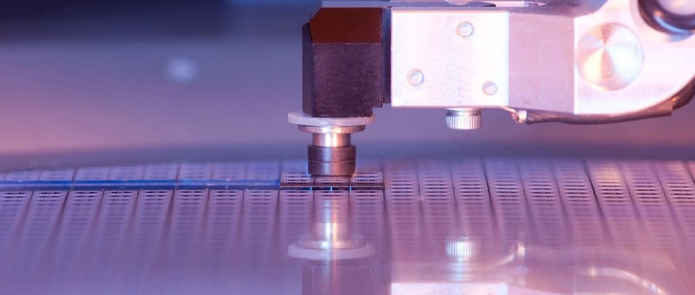
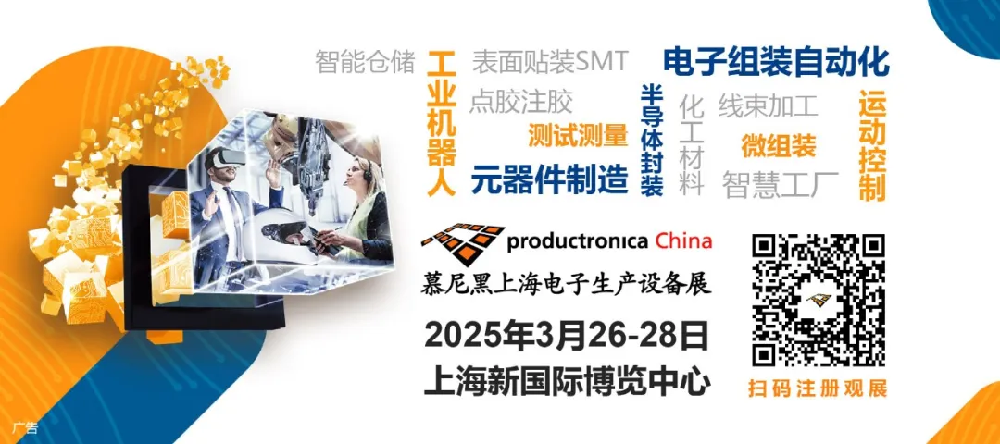
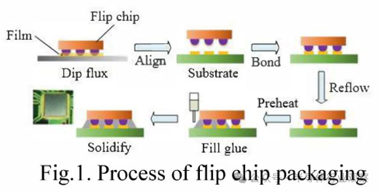
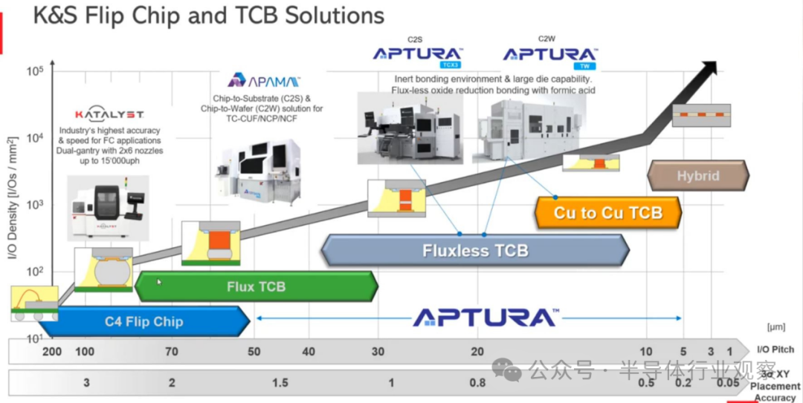
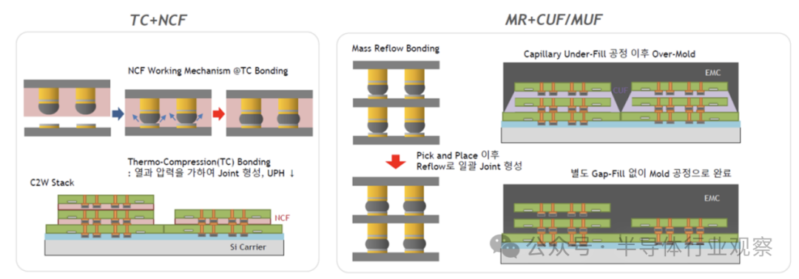
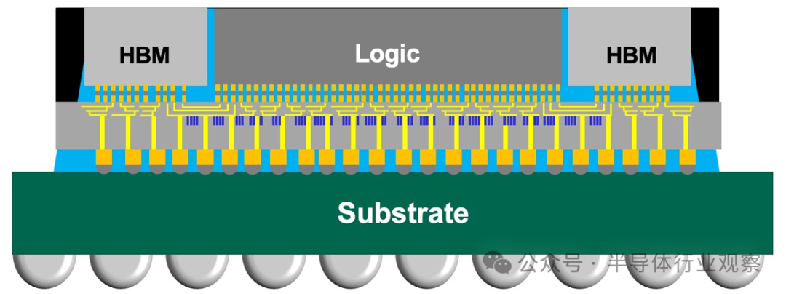
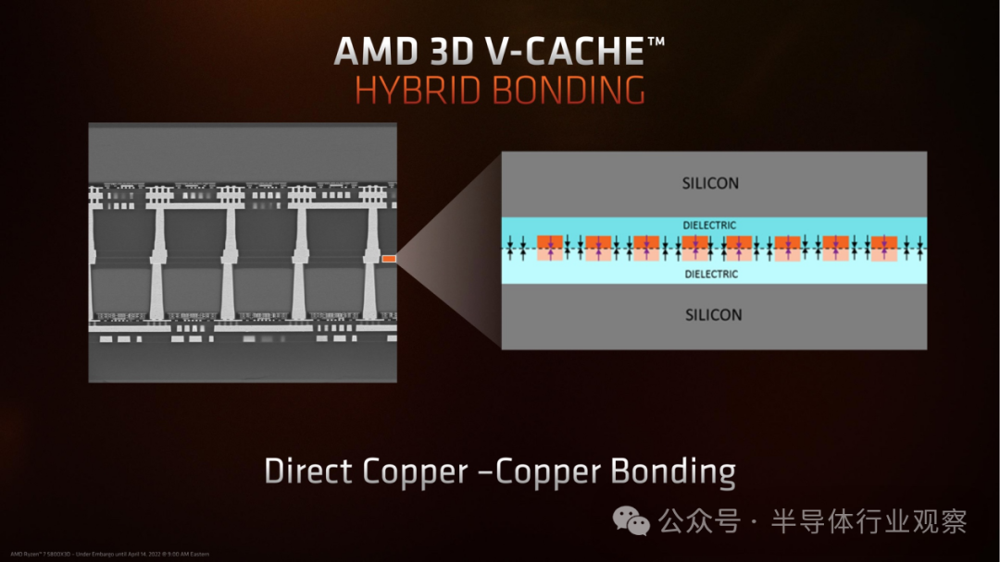

芯片巨头，看上“新”技术
===============
                                                                          

             

  

芯片巨头，看上“新”技术
============

Original 邵逸琦 [半导体行业观察](javascript:void(0);)

半导体行业观察

上海爱思尔教育科技有限公司

半导体深度原创媒体，百万读者共同关注。搜索公众号：半导体芯闻、半导体产业洞察，阅读更多原创内容

3759篇原创内容

_2025年03月11日 00:56_

👆如果您希望可以时常见面，欢迎标星🌟收藏哦~

**近两年时间里，三大内存厂都把HBM视为市场增长的关键。**

尤其是在内存标准的竞争上，目前 HBM3E 使用的是基于 DRAM 的 2.5D/3D 堆叠芯片，而下一代 HBM4 采用 3D 堆叠逻辑芯片架构，允许客户集成专有 IP 以增强性能和定制，行业人士指出，3D 芯片堆叠和定制是 HBM4 时代成功的关键。

根据JEDEC固态技术协会发布的HBM4初步规范，HBM4将支持每个堆栈2048位接口，数据传输速率高达6.4GT/s，提供4高、8高、12高和16高TSV堆栈配置。这意味着HBM4的带宽将从HBM3E的1.2TB/s提升至1.5-2TB/s，同时存储容量也从36GB增至48GB，增幅达到33%。

但难点也随之而来，随着堆叠层数的不断增加，传统焊接技术面临显著的挑战。目前所使用的助焊剂（Flux）虽能去除金属表面氧化物并促进焊料流动，但其残留物会引发堆叠间隙增大、热应力集中等问题，尤其在高带宽内存（HBM）等精密封装领域，这一矛盾更为突出。

**“新”技术的诞生**

先来了解一下目前HBM芯片的键合技术。在传统的倒装芯片键合中，芯片被“翻转”，以便其焊料凸块（也称为 C4 凸块）与半导体基板上的接合焊盘对齐。整个组件被放置在回流炉中，并根据焊料材料均匀加热至 200ºC-250ºC 左右。焊料凸块熔化，在接合和基板之间形成电气互连。

随着互连密度的增加和间距缩小到 50µm 以下，倒装芯片工艺面临一些挑战。由于整个芯片封装都放入烤箱中，芯片和基板会因热量而以不同的速率膨胀（即不同的热膨胀系数，CTE），从而产生变形，导致互连出现故障。然后，熔融焊料会扩散到其指定区域之外。

这种现象称为焊料桥接，会导致相邻焊盘之间出现不必要的电连接，并可能造成短路，从而导致芯片出现缺陷。这就是TCB（Thermal Compression Bonding 热压键合）工艺发挥作用的地方，因为它可以解决间距缩小到某个点以下时倒装芯片工艺出现的问题。

TCB的优势在于，热量是通过加热工具头局部施加到互连点上，而不是在回流焊炉（倒装芯片）中均匀施加。这样可以减少向基板的热量传递，从而降低热应力和 CTE 挑战，实现更强大的互连。对芯片施加压力以提高粘合质量并实现更好的互连。典型的工艺温度范围在 150ºC-300ºC 之间，压力水平在 10-200MPa 之间。

TCB 允许的接触密度比倒装芯片更高，在某些情况下每平方毫米可达到 10,000 个接触点，但更高精度的主要缺点是吞吐量较低。虽然倒装芯片机每小时可以达到超过 10,000 个芯片的吞吐量，但 TCB 的吞吐量则在 1,000-3,000 个芯片的范围内。

标准的 TCB 工艺还需要使用助焊剂。在加热过程中，铜可能会氧化并导致互连故障，助焊剂是一种用于去除铜氧化物的涂层。但当互连间距缩小到 10µm 以上时，助焊剂会变得更难清除，并会留下粘性残留物，这会导致互连发生微小变形，从而造成腐蚀和短路。

无助焊剂键合技术（Fluxless Bonding）由此应运而生。

为了消除与助焊剂相关的挑战，无助焊剂TCB在真空或惰性气体环境（如氮气或氩气）中运行，以防止键合过程中发生氧化。没有助焊剂可提高互连的长期可靠性，因为它消除了可能导致芯片性能故障的任何污染风险。但坏消息是，它需要更严格的工艺控制，并且由于涉及额外步骤，吞吐量较低。

据了解，无助焊剂键合技术技术最早应用于其他半导体封装场景，但近年来随着HBM需求激增，逐渐成为内存制造领域的关键创新方向，目前不少巨头在这一方面均有所布局。

**跃跃欲试的巨头**

最早对无助焊剂键合技术表示出采用意向的是美光。据TrendForce去年12月的报道，美光正在与合作伙伴测试 HBM4 的无助焊剂键合，以解决 DRAM 间距挑战并增加堆栈层数，目标到 2026 年实现营收贡献。

三星也表现出了采用意向，据韩国业内在今年3月的消息，三星正在评估包括无助焊剂在内的多种下一代HBM键合技术。自今年年初起，该公司已与海外主要合作伙伴展开无助焊剂键合的初步评估工作，目标是在今年年底前完成评估，应用对象为HBM4（第六代HBM）。

与此同时，SK海力士也在评估在HBM4工艺中应用无助焊剂键合技术，可以确定的是，目前主流HBM厂商均已开始考虑转向无助焊剂键合技术。

为什么HBM厂商如此热衷于无助焊剂键合技术，这个问题还要从HBM采用的两种键合技术说起。

HBM是通过垂直堆叠多个DRAM，从而提升数据处理性能的。其结构利用硅通孔（TSV）在每层DRAM上钻出微小孔洞，并进行电连接，为连接每层DRAM，通常采用微凸点（Micro Bump）结构。

目前，三星和美光在HBM制造的后端工艺环节均采用了“TC-NCF（非导电胶膜）”技术。这一工艺是在各层DRAM之间嵌入NCF，并通过热压工艺（TC Bonding）从上至下施加热压，NCF在高温下融化，起到连接凸点并固定芯片的作用。

而SK海力士在前两代HBM上也使用过TC-NCF技术，最终在HBM2E上切换到了MR-MUF技术，这一技术在每次堆叠DRAM时，会先通过加热进行临时连接，最终在堆叠完成后进行回流焊以完成键合，随后填充环氧模塑料（EMC），使其均匀渗透到芯片间隙，起到支撑和防污染的作用。

就目前而言，MR-MUF相较于TC-NCF具备更多优点，据 SK 海力士称，与 NCF 相比，MR-MUF 的热导率大约是 NCF 的两倍，对工艺速度和产量有显著影响。

但这一技术也并非完美，在传统MR-MUF工艺中，通常使用助焊剂（Flux）去除微凸点上的氧化膜，随后进行清洗。然而，随着HBM4的I/O端口数量比前代翻倍至2024个，同时DRAM的堆叠层数增加，微凸点之间的间距缩小，导致助焊剂清洗不彻底，可能影响芯片的可靠性。

这也是无助焊剂键合技术兴起的主要原因，它主要适用于MR-MUF，因而SK海力士在导入技术方面有着明显的先发优势。

有意思的是，不只是HBM厂商，封装厂商同样表现出了很高的采用意愿，其中就有目前在先进封装领域叱咤风云的台积电。

据报道，自去年起，台积电就已引进无助焊剂键合的相关设备，并开展评估。

一直以来，台积电在2.5D封装领域采用其自主开发的“CoWoS（Chip-on-Wafer-on-Substrate）”技术。2.5D封装是在芯片与基板之间增加硅中介层（Silicon Interposer），并将多个半导体芯片（Die）水平排列，相较于传统的2D封装，它可以实现更高密度的电路互连。特别是在数据中心AI加速器市场，CoWoS因其能够连接HBM（高带宽存储器）与高性能GPU，而备受青睐。

台积电目前在CoWoS封装中使用助焊剂。然而，随着封装技术的演进，CoWoS对助焊剂的使用面临越来越大的挑战。助焊剂在芯片接合后需要进行清洗，但随着中介层尺寸的增大，中心区域的助焊剂残留物难以彻底去除，进而影响芯片的可靠性。

由于AI加速器对计算性能的需求持续增长，封装中需集成更多芯片，因此中介层尺寸也随之增大。2023年，台积电的CoWoS封装中介层尺寸约为80×80mm，相当于光掩膜（Reticle）的3.3倍大小，其计划到2026年将其扩展至100×100mm（光掩膜的5.5倍），并在2027年进一步扩大至120×120mm（光掩膜的8倍）。

随着中介层尺寸不断膨胀，台积电已经在提升CoWoS良率方面遇到了一些挑战，因此不得不关注无助焊剂等替代技术，其无需使用助焊剂即可去除微凸点上的氧化层的特性，让台积电颇为心动。

据了解，台积电去年已从两家以上的海外主要半导体设备厂商引进了无助焊剂键合设备，并对其在CoWoS量产中的应用进行评估。此外，该公司计划在今年上半年与另一家合作伙伴展开进一步评估。

巨头们的入场，让无助焊剂键合登上舞台，受到了更多业内的关注。

**写在最后**

值得关注的是，在无助焊剂键合这场比赛中赛跑不止是内存和封装厂商，设备厂商之间也开启了一场争斗。

据我们了解，目前可以提供无助焊剂键合设备的厂商主要有两家，分别是ASMPT和K&S（Kulicke & Soffa），这两家设备厂在无助焊剂键合上也采用了不同的方案，K&S采用化学方法（甲酸）去除晶圆表面的氧化层，而ASMPT（以及其他键合设备厂商）则采用物理方法（等离子清洗）。

截至目前，主要厂商仍然在评估这两种方案的优劣势，尚未正式决定无助焊剂键合的主要设备厂商。更有意思的是，尽管业内对无助焊剂键合寄予了厚望，但这项技术本身就面临其他技术的竞争。

据报道，三星作为涉足先进封装技术最久最深的芯片厂商之一，它是否会采用无助焊剂键合仍然是一个未知数，目前三星不仅在持续优化现有的NCF键合，还在并行研发下一代“混合键合（Hybrid Bonding）”技术。混合键合不使用凸点，而是直接连接铜互连（Cu-to-Cu），有助于减少HBM的整体厚度。

这里要说一下，不同的键合技术，本质上瞄准的是不同封装应用，从倒装键合到助焊剂TCB，封装I/O间距从200μm缩小到30μm，而无助焊剂TCB将进一步缩小间距尺寸至20μm，最大可达10μm，当I/O间距小于10μm时，就轮到混合键合出场了。

但在目前HBM的封装需求中，主要还是 10-30μm 之间的 I/O 间距，此时无助焊剂 TCB 与混合键合相比具有显著的性价比优势，因为混合键合需要额外的昂贵工艺，如 CMP（HB 对表面平整度的要求非常高，通常 <0.5nm Ra）和等离子切割（为防止键合过程中的颗粒污染，传统的刀片切割容易产生颗粒，因此无法使用），这些因素使得混合键合的单位封装成本比无助焊剂键合贵 2.8 倍以上。

这也是三星以及其他厂商犹豫不绝的原因之一，无助焊剂键合只能作为一种妥协的过渡方案，并非未来键合的终极解决方案。

韩国业内人士指出：“随着HBM的微凸点数量和堆叠层数的增加，NCF在可靠性和散热特性上的表现可能会受到限制，而混合键合技术尚未成熟。因此，三星电子将无助焊剂作为潜在替代方案之一，但由于需要更换整套设备基础设施，这一决策需要慎重考虑。”

因HBM的火热，无助焊剂键合被捧成了香饽饽，但这项新技术的未来，似乎仍然不甚明朗。

_**END**_

**👇半导体精品公众号推荐👇**

▲点击上方名片即可关注

专注半导体领域更多原创内容

▲点击上方名片即可关注

关注全球半导体产业动向与趋势

\*免责声明：本文由作者原创。文章内容系作者个人观点，半导体行业观察转载仅为了传达一种不同的观点，不代表半导体行业观察对该观点赞同或支持，如果有任何异议，欢迎联系半导体行业观察。

**今天是《半导体行业观察》为您分享的第4060期内容，欢迎关注。**

**推荐阅读**

★[一颗改变了世界的芯片](https://mp.weixin.qq.com/s?__biz=Mzg2NDgzNTQ4MA==&mid=2247732748&idx=1&sn=2ba19055f90ac8ab5512098d039ef391&chksm=ce6e4cfbf919c5eddc8b3af5a147990afc3c7227f59c332d15ed5f8b8a100a4dcb97f59d05d1&scene=21#wechat_redirect)

★[美国商务部长：华为的芯片没那么先进](https://mp.weixin.qq.com/s?__biz=Mzg2NDgzNTQ4MA==&mid=2247735441&idx=6&sn=786b62b5f4edbac37b66f91ff36d0f49&chksm=ce6e5a66f919d37052778a97f49442c77529699f08f3dcf599c99347dcf35da064528aab5222&scene=21#wechat_redirect)

★[“ASML新光刻机，太贵了！”](https://mp.weixin.qq.com/s?__biz=Mzg2NDgzNTQ4MA==&mid=2247738477&idx=1&sn=636a6387c4e83b7e47e6377aba07f8d4&chksm=ce6e269af919af8cc2bfddf1dff60566bfd0169eb1c31d97413c6f97abe8d307cda0b58cc795&scene=21#wechat_redirect)

★[悄然崛起的英伟达新对手](https://mp.weixin.qq.com/s?__biz=Mzg2NDgzNTQ4MA==&mid=2247741738&idx=1&sn=860c31832b6c6e03b152300b991be5f9&scene=21#wechat_redirect)

★[芯片暴跌，全怪特朗普](https://mp.weixin.qq.com/s?__biz=Mzg2NDgzNTQ4MA==&mid=2247746259&idx=1&sn=f9a5a82f84e598d0f2d8b8d2cb1d371e&chksm=ce6e0024f919893285b3069f01821e6bd47cb772c890cacf88874707e1576ecc3d7673290afb&scene=21#wechat_redirect)

[★](https://mp.weixin.qq.com/s?__biz=Mzg2NDgzNTQ4MA==&mid=2247709689&idx=2&sn=d77e02ac93f0b0e490744945d550f269&chksm=ce6eb10ef919381813abb86c6dee73b999b8c8ccbdeb9af8b47b7dde46b05e15e13be81cb704&token=1171908126&lang=zh_CN&scene=21#wechat_redirect)[替代EUV光刻，新方案公布！](https://mp.weixin.qq.com/s?__biz=Mzg2NDgzNTQ4MA==&mid=2247741646&idx=1&sn=aa71a43b134a613453f29ddc8cfdb32c&chksm=ce6e3239f919bb2f75efc5a7b90c48944655808f6fc901dd146eec31f73340cf1f663b31cced&scene=21#wechat_redirect)

★[半导体设备巨头，工资暴涨40%](https://mp.weixin.qq.com/s?__biz=Mzg2NDgzNTQ4MA==&mid=2247723271&idx=7&sn=1e4f5124fa7d3f029e4c212823633e1e&scene=21#wechat_redirect)

★[外媒：美国将提议禁止中国制造的汽车软件和硬件](https://mp.weixin.qq.com/s?__biz=Mzg2NDgzNTQ4MA==&mid=2247756729&idx=8&sn=7763455e2146a96c6c5945c7092c9c90&scene=21#wechat_redirect)

『半导体第一垂直媒体』

**实时 专业 原创 深度**

公众号ID：icbank

喜欢我们的内容就点**“在看”**分享给小伙伴哦

预览时标签不可点

Close

更多

Name cleared

**微信扫一扫赞赏作者**

Like the Author[Other Amount](javascript:;)

Articles

No articles

Like the Author

Other Amount

¥

最低赞赏 ¥0

OK

Back

**Other Amount**

更多

赞赏金额

¥

最低赞赏 ¥0

1

2

3

4

5

6

7

8

9

0

.

邵逸琦94

邵逸琦 · 目录

上一篇芯片法案，穷途末路

Close

更多

搜索「」网络结果

​

暂无留言

已无更多数据

[Send Message](javascript:;)

  写留言:

Close

**Comment**

Submit更多

[表情](javascript:;)

Scan to Follow

继续滑动看下一个

轻触阅读原文

半导体行业观察

向上滑动看下一个

当前内容可能存在未经审核的第三方商业营销信息，请确认是否继续访问。

[继续访问](javascript:)[Cancel](javascript:)

[微信公众平台广告规范指引](javacript:;)

[Got It](javascript:;)

 

 Scan with Weixin to  
use this Mini Program

[Cancel](javascript:void(0);) [Allow](javascript:void(0);)

[Cancel](javascript:void(0);) [Allow](javascript:void(0);)

× 分析

 : ， ， ， ， ， ， ， ， ， ， ， ， .   Video Mini Program Like ，轻点两下取消赞 Wow ，轻点两下取消在看 Share Comment Favorite 听过            

**半导体行业观察**

芯片巨头，看上“新”技术

,

,

选择留言身份

该账号因违规无法跳转
