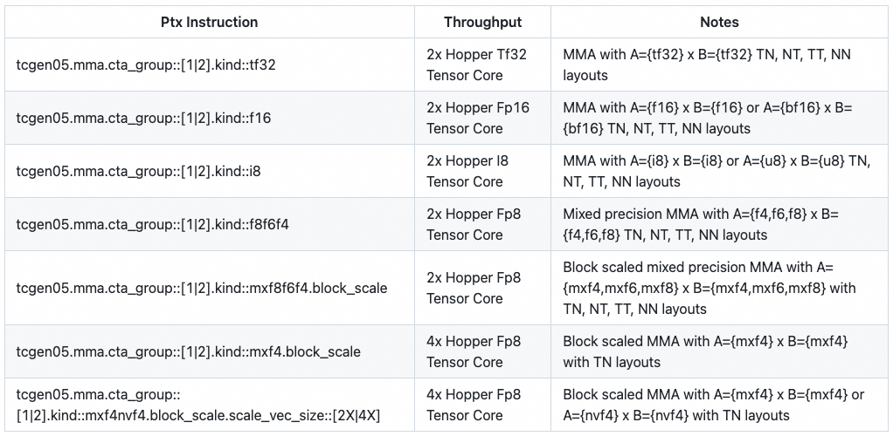
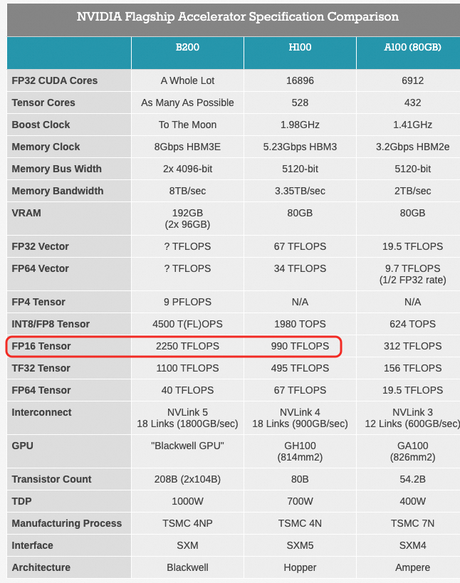
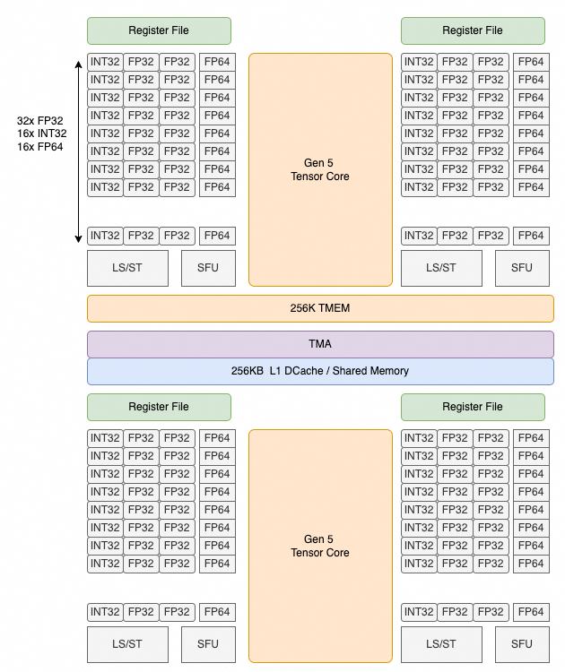
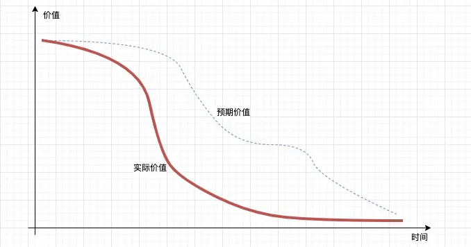
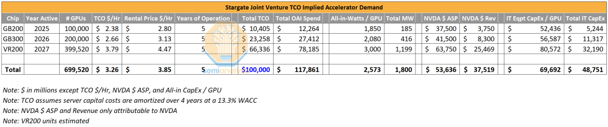
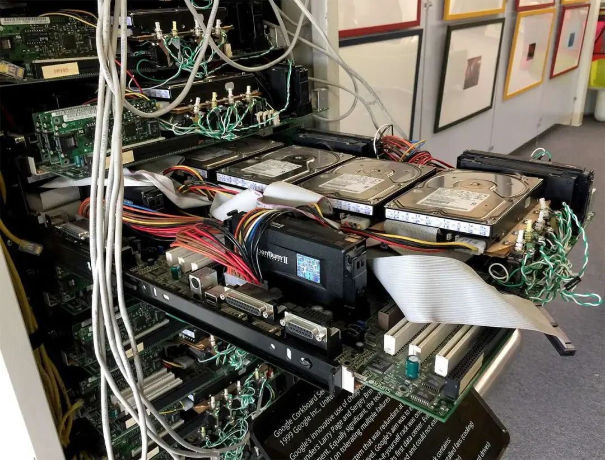
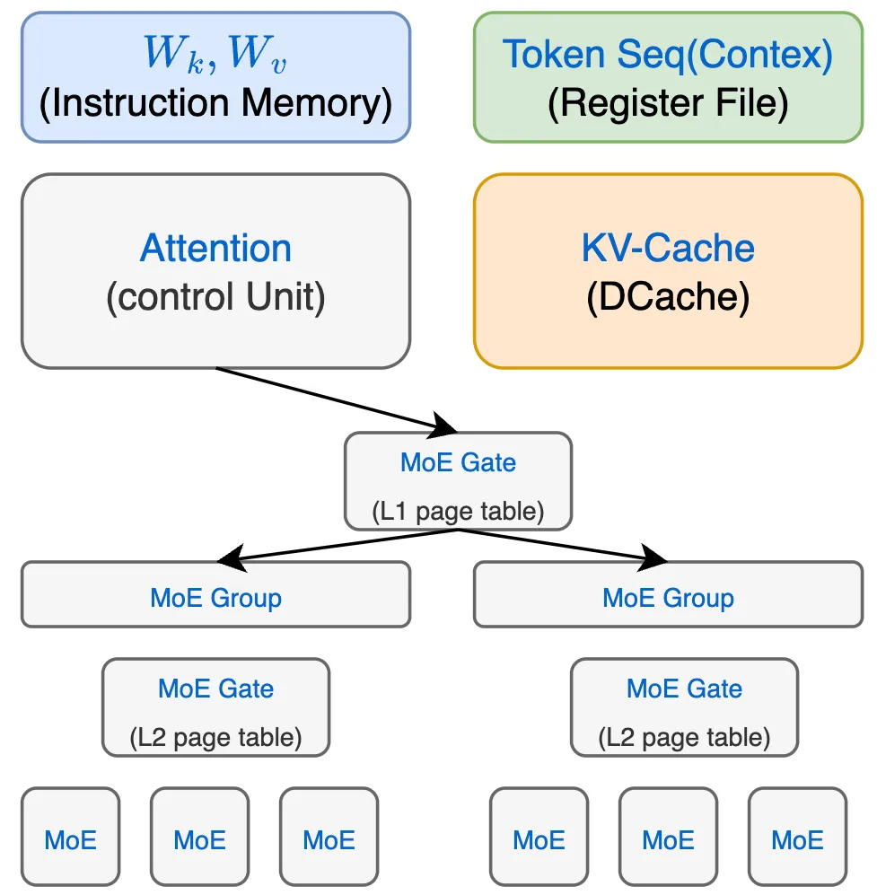

# 谈谈三万亿的破绽(4)
[谈谈三万亿的破绽(4)](https://mp.weixin.qq.com/s?__biz=MzUxNzQ5MTExNw==&mid=2247493067&idx=1&sn=0bb34a4205abc327527484b21b2896e7&chksm=f995f509cee27c1f2634be1ed00396f0c11d88a9540df954b7605cd57f2af8af04c1e711c172&scene=178&cur_album_id=3682079454764843014#rd) 

 年前最后一天上班, 就用来摸鱼吧.

先谈谈Blackwell架构
--------------

看完Blackwell的一些文档后, 越发的觉得Nvidia在GPU架构上黔驴技穷了. 在第五代TensorCore上增加了一堆Scratchpad, 看上去好像不错, 但是对memory consistency完全是一个灾难, 你会发现LD/ST指令都是异步的了, 编程的困难度继续增加, 越来越像ASIC了, 或许从TensorCore引入的那天(V100), SIMT的架构就走到了尽头...

当然TensorCore编程困难的问题在Cutlass这些软件生态上有兜底, 例如最近的cutlass文档已经添加了blackwell相关的内容\[1\], 而Fused Multihead Attention也有了一些example code\[2\]

其实一直有一个疑问就是虽然NV宣传的Blackwell TensorCore 2x faster than Hopper

但是实际的性能并没有对齐, 至少B200按照2个Die来算, TensorCore的数量应该是320.

如果单个TensorCore快了2倍,那么总体的FP16性能也就会快4倍. 从这个结论推测出一个很简单的事实, 再加上BlackwellCTA Group和CTA Peer的抽象, `很有可能blackwell这一代变成了两个SM share同一个TensorCore`, 因为额外的Tensor Memory对diesize的占用还是非常大的. 所以在第五代TensorCore的指令中, 才会指定CTA\_Group::\[1|2\]. 因此推测Blackwell的实际SM架构如下图所示:

有些感慨的是, TensorCore per SM的变化, 从V100 8个, 到A100/H100变成 4个, 再到Blackwell推测变成2个..当退化到一个TensorCore配一堆CUDA Core的时候, 或许我们该叫它ASIC了...

另一方面, 维持一个Giant GPU的抽象这事真的正确么? 或许NVL72的系统复杂度和可靠性导致其交付一直拖了半年多了, 封装散热供电等一系列问题就不过多阐述了...

来谈一个更吓人的事情, 正如我一直以来的观点ScalingLaw是[《算力通缩下的“老黄经济学”》](https://mp.weixin.qq.com/s?__biz=MzUxNzQ5MTExNw==&mid=2247492569&idx=1&sn=ddc22878068710162a556d911303e524&scene=21#wechat_redirect), 它是算力通缩下的需求创设并导致的供应端的流动性紧缩, 但这些算力价值的Time Decay远超过以往的预期

SemiAnalysis的一个分析来看, GPU的毛利率估值下降很多, 例如GB200, TCO 2.38USD/H而租金才2.8USD/H, 基本上都按照17%在算...

其实任何一个做算法的人都知道的道理O(N^2)的算法你跟我谈Scaling? 这不扯淡么... 当然早期尝试的时候是没啥问题的, 渣B在十多年前搞量化的时候, 也干过最早的算法验证一天的数据要在服务器上算30天, 直到后来有一个机会想到一个近似计算的算法把复杂度压下来,普通的PC几个core就能3分钟算完.

AI的Sputnik时刻
------------

那么接下来说一个更吓人的事情, DeepSeek这事似乎又扩大了三万亿的破绽. 某个群里看到一个图, 笑翻了

> 妈的, 一想到大A小散的对手盘是随便弄个大模型就能坐到全球第二把交椅的大佬,这是什么地狱级难度?

其实渣B这件事上更有感触, 诚然A股的量化是非常难的, 2014年, 好友创立第四范式的时候也找我聊过, 但是还是毅然选择了一个更难的题目那就是A股的量化交易, 当然作为一个参与了国内几乎所有交易所网络建设的人又有一些合规问题选择去做了一些中低频策略, 另一方面很多高频交易商也是当时任职公司的客户, 但高频的策略容量其实是非常有限的, 本身又有大量合规的问题.

为什么谈量化这个事情, 其实对于幻方/DeepSeek 梁总他们这一群人, 必定对CUDA非常熟悉的. 因为基本上量化这个圈子的人都会用CUDA去做大量的资产相关的并行计算. 而且最早没有CUDA的Cg的年代就有人做一些期权仿真了... 大家也可以看看Dissecting the NVIDIA Volta GPU Architecture via Microbenchmarking\[3\] 作者是另一个著名的量化基金Citadel. 在量化交易这个圈子里,大家对Nvidia微架构的理解远超其它人, 所以你才会看到渣B这题也会做...

[《GPU架构演化史:从80年代图形渲染到Blackwell》](https://mp.weixin.qq.com/mp/appmsgalbum?__biz=MzUxNzQ5MTExNw==&action=getalbum&album_id=2538479717163761664&scene=173&from_msgid=2247487954&from_itemidx=3&count=3&nolastread=1#wechat_redirect)

但是很遗憾的是, 现在很多做神经网络/大模型的算法工程师, 在这一块的知识是非常缺的, 正是因为无知才只能去follow, 对于模型架构Attention有啥就用啥, MoE搞不定就Dense, 就这样从Llama1卷到了Llama3. 渣B对于传统Dense ScalingLaw这件事情一直是质疑的, 所以才会2023年底开始准备一个专题, 需要从代数结构上分析哪些稀疏的工作可行:

[《大模型时代的数学基础》](https://mp.weixin.qq.com/mp/appmsgalbum?__biz=MzUxNzQ5MTExNw==&action=getalbum&album_id=3210156532718403586#wechat_redirect)

甚至是在ChatGPT出来之前就在以范畴论的视角去看待Transformer和Attention, 其实量化这个圈子的人对于Transformer在时间序列任务上替代LSTM/RNN的优势应该很早就关注到了, 至少我在2018年的时候就在开始研究并搭建AI Infra了.

我想说的就是`量化交易的这些十多年的积累, 是DeepSeek这次如此成功的基础`.

而最关键的一点还是梁总讲的`“中国的AI不可能永远跟随,需要有人站到技术的前沿”`.

然而过去的两年里, 我经常听到的从业者讲述的是另一句话:`“不跟上怎么能超越呢?”` 好像NV/Meta/微软/OAI永远的是对的, 跟紧了就行了, 跟不紧只是钱不够?

> 其实最根本的原因是国内很多组织阵型中缺少像梁总这样的人, 从上到下完全能够清楚哪一层该做什么的能力. 算法团队和基础设施团队的知识脱节是这些团队的通病.

去年4月就写了一篇很长的文章在分析

[《算力受限下的大模型发展和AI基础设施建设》](https://mp.weixin.qq.com/s?__biz=MzUxNzQ5MTExNw==&mid=2247489813&idx=1&sn=d39b0334306d3b220eca935e9b694e84&scene=21#wechat_redirect)

我记得DS的MLA刚出来的时候, 很多人还不认同, 甚至是DeepSeek-V3出来的时候, 美国的同行们还一脸懵逼状. R1的出现或许把这个遮羞布完全撕下来了. 如果想用几句话讲清楚DS干了什么.

> DS-V3非常细致的Infra的工作把FP8训练用起来了, 然后又在通信Overlap上做了很多很好的工作. 其实最关键的还是在MoE上, 大量的Expert负载均衡同时兼顾推理的设计, 同时克服跨机MoE的瓶颈使得Experts才能256选8, 极大的扩大了模型规模, 又节省了算力, 再加上最后一锤定音的R1, 一个非常简单又非常有效的RL, 没有啥MCTS和PRM, 就是一个rulebased的bandit.

这就是算力受限下, 算法发挥的巨大价值. 狠狠的撕下了算力党的遮羞布.

当然DeepSeek在国外被人赞也被人酸, 谈谈个人的感受吧, 在一些实际的偏文科类的任务中, 我还是喜欢4o或者qwen-max, 例如文章摘要啥的, 但是我会在自己的MACbook上用LM Studio跑一个DeekSeek-R1蒸馏的qwen-14B, 主要是针对一些数学相关的任务, 每秒20多个tokens也够用了.当然还有一些国外冒酸的说DS不支持多模态. 我倒是觉得反而是这种专注于math/code更好.

来说一个暴击三万亿的事情
------------

前几周看到一张GB200 NVL72机柜拆箱的图, 恍若隔世的以为那是IBM的mainframe. 其实我一直在探索如何通过大量的4090来替代这样的“大型机系统”, 或许这才是更关键的AI Infra的Sputnik时刻. 正如同当年Google的大数据三驾马车那样, 一些家用级的服务器就够了.

渣B过去很多年的工作重心其实一直都在这一块上, GPU互联这个领域基本上看到点光了. 例如RDMA ScaleOut的拥塞控制,特别是针对MoE的AlltoAll incast的处理上, 正是因为很早就看好MoE,在2023年设计算法的时候就完全考虑过.而在ScaleUP领域里, 基本上几年前构想的雏形也快出现了.

从算法层面, Attention block可能还是需要一些很高密度的算力的, 对于Attention的稀疏化从范畴论的视角来看, 弊大于利, 特别是一些Linear Attention相关的东西, 或许这一块通过降低精度到FP4能够有一些改善. 而且另一方面还需要引入一些旁路的控制结构, 例如MAC/MAG等.

但是MoE应该能够被大量的家用卡替代, 因此我也在考虑一些MoE结构的改进, 例如做两级页表以后, 分散到最终计算的Experts数据量就不是很大了, 但是对于整个集群来看, 这种收益是非常值得的. 这就是前几天所说的[《谈谈大模型架构的演进之路, The Art of memory.》](https://mp.weixin.qq.com/s?__biz=MzUxNzQ5MTExNw==&mid=2247493032&idx=1&sn=206eed2e4127b9971a1e0c380f70b082&scene=21#wechat_redirect)

或许AI Infra的Sputnik时刻不会太远了, 大家一起加油.

参考资料

\[1\]

blackwell functionality: https://github.com/NVIDIA/cutlass/blob/main/media/docs/blackwell\_functionality.md

\[2\]

FMHA: https://github.com/NVIDIA/cutlass/blob/main/examples/77\_blackwell\_fmha/77\_blackwell\_fmha.cu

\[3\]

Volta GPU Architecture: https://arxiv.org/pdf/1804.06826