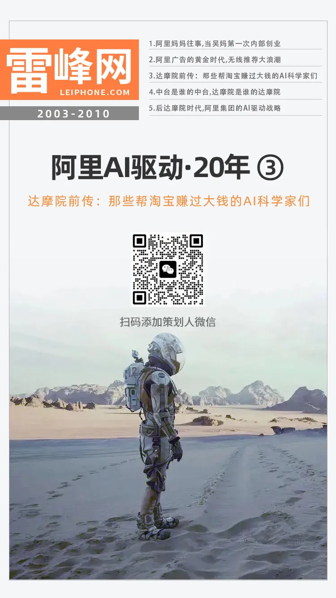
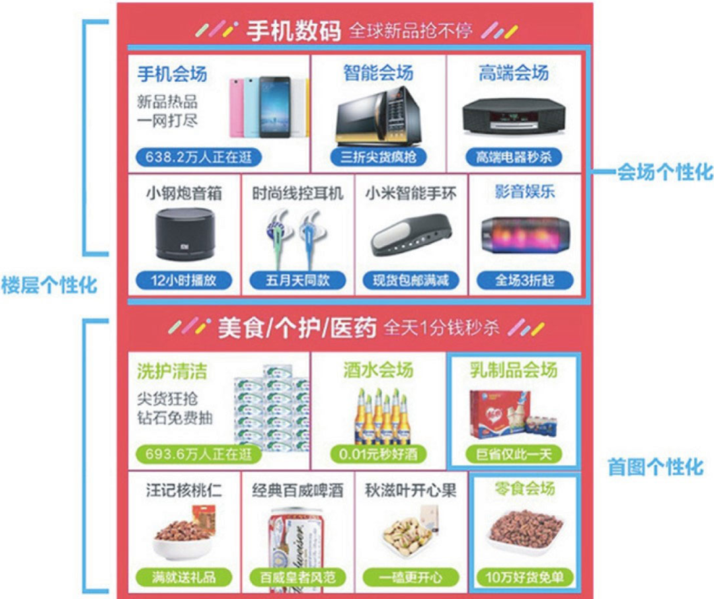
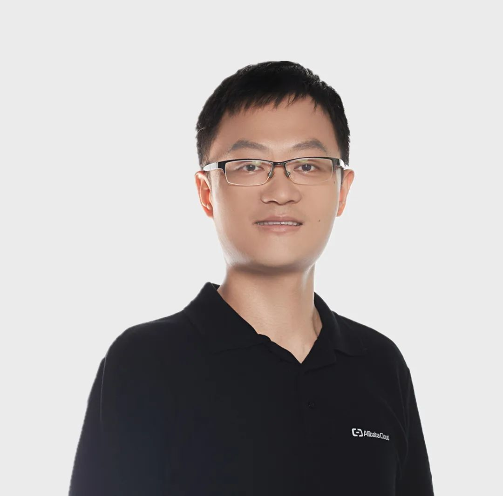
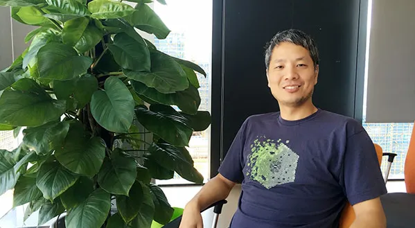

Title: 达摩院前传：那些帮淘宝赚过大钱的AI科学家们

URL Source: https://mp.weixin.qq.com/s/qwNaQJKXCPuyh3fuZPceJw

Markdown Content:

**沈加翔、周靖人、徐盈辉、金榕、华先胜、司罗等淘宝搜索体系的顶级技术大牛，在将淘宝推向顶峰后，又汇聚在达摩院，筑就了阿里AI技术的最高峰。**

”

作者 | 刘   伟

编辑 | 林觉民

在阿里的历史中，阿里妈妈和淘宝搜索事业部一直是极为独特的存在。他们同根同源，都流淌着雅虎血脉，继承了来自硅谷的先进理念和工作模式，和以本土派为主的交易线，形成了风格迥异的两个流派。前者轻灵飘逸、天马行空，后者沉稳厚重、一步一个脚印，二者交织碰撞，共同造就了阿里兼具精英气质和江湖气息的独特魅力。

同时，阿里妈妈和淘宝搜索事业部也和而不同，屡次“交锋”、几经分合，通过良性竞争攻克了无数技术高地，碰撞出了属于阿里技术的黄金时代。在阿里后续的几次技术大改造中，将淘宝先进的广告和搜索技术复制到其他业务线，一直是最重要的核心命题。

沈加翔、周靖人、徐盈辉、金榕、华先胜、司罗等淘宝搜索体系的顶级技术大牛，在将淘宝推向顶峰后，又汇聚在达摩院，筑就了阿里AI技术的最高峰；王志荣、李天民等另一些灵魂人物则在淘宝搜广推技术的“复制”过程中，去到其他业务线扮演起了AI领军人的角色，共同造就了阿里AI群峰耸峙的盛景。可以说，淘宝的搜广推体系就是阿里AI技术人才的摇篮和黄埔军校，成就了一代宗师。

在[《阿里广告的黄金时代：无线推荐大浪潮》](http://mp.weixin.qq.com/s?__biz=MTM2ODM0ODYyMQ==&mid=2651681813&idx=1&sn=b1b829604b2bde31df31101637ce15ea&chksm=624974b7553efda11d24f228c7a60c7445b3d7e78099a90d304b5e9e90516329cd2435ae5fd5&scene=21#wechat_redirect)一文中，我们回顾了阿里妈妈辉煌历程中那些震撼人心的时刻，本文则试图理清淘宝搜索事业部的发展脉络，并记录下那些群星闪耀的瞬间。欢迎添加作者微信**LW\_PLUS**交流讨论。

**01**

### **对抗百度失败，阿里搜索由外向内**

2005年8月，一场足以载入中国互联网史册的商业并购案终于尘埃落定，阿里巴巴宣布收购雅虎中国的全部资产。

两个月后，马云在一次公开宣讲中对这次并购做了解释：在新阿里巴巴帝国中，旗下四家公司各自扮演不同的角色。老大是阿里巴巴；当初为了防止eBay进入老大的B2B领域抢地盘，于是搞了老二淘宝；为了解决支付手段和市场诚信问题，又做了老三支付宝；后来发现老大还需要一个得力帮手，就找了雅虎中国做搜索。

当时，阿里巴巴——尤其是阿里巴巴的B2B业务，是谷歌在中国的第一大客户。谷歌上市前甚至专门派出高管前往杭州，以调查遥远的东方为什么有一个客户对它需求如此之大。

阿里对搜索的需求如此庞大，马云自然希望将相关技术牢牢掌握在自己手中，于是便有了对雅虎中国的收购。

**完成并购后，阿里巴巴的战略是联合雅虎建立全网搜索引擎与百度竞争。**

在马云的主导下，雅虎中国一度摒弃了门户概念，把首页变成了和谷歌很像的搜索栏。不过短短五个月后，又在雅虎总部的指示下改了回来。

这种来回摇摆源自马云和雅虎总部在理念上的分歧：**按照马云的如意算盘，他希望雅虎中国能成为一个纯搜索引擎公司，这样将能提升阿里系在产业链条上的整体布局。但事实上，雅虎虽然一直在搜索引擎上有投入和积累，但其商业模式一直是媒体定位，并不愿意成为一个纯搜索引擎公司。**

折腾往复之下，到2008年，阿里巴巴联合雅虎对抗百度的计划终于宣告失败。

**内部讨论之后，决定聚焦到电商搜索。**于是雅虎中国原本的搜索团队被拆分出来，成立了阿里巴巴搜索中心（ASC），由原雅虎中国搜索业务负责人张勤（花名：杨过）负责。

阿里巴巴搜索中心支持的第一个业务是B2B。当时B2B的搜索用的是一套基于Lucence架构、用C++重写的叫做isearch的系统。阿里巴巴搜索中心在对比isearch和雅虎搜索的代码后，结合阿里的业务需求，推出了一套叫做isearch2.0的系统。这套系统把雅虎搜索的先进理论和功能带进了阿里，帮助B2B的搜索取得了显著的性能提升。

2008年9月，王坚博士加入阿里后成立了集团研发院。**阿里巴巴搜索中心的一部分人流向集团研发院，后来慢慢融入阿里云，衍生出了夸克搜索等产品，另一部分人则流向了各个业务BU：**张勤留在了B2B，文德（花名：鬼脚七）等人则去了淘宝。

当时淘宝的业务增长非常快，机器扩容经常出故障，业务上压力很大。为了支持好淘宝的搜索，阿里派出了当时被称作国内“搜索一姐”的原雅虎搜索总经理张忆芬（花名：蓉儿）牵头成立淘宝搜索中心。张忆芬从阿里妈妈请来了王志荣（花名：青峰）负责算法，后来沈加翔（花名：五福）和王明强（花名：思函）相继加入，分别负责工程和产品，组成了淘宝搜索中心的三架马车。

后来的淘宝搜索事业部就此初具雏形。

这一时期，独立发展不顺的阿里妈妈并入淘宝，并获得了新的番号——淘宝广告事业部。合并后，陆兆禧仍担任淘宝网总裁，吴妈出任副总裁，分管淘宝广告事业部。不久后，张忆芬离职去了Yahoo Asia，淘宝搜索事业部转由吴妈负责。

在吴妈的带领下，搜索事业部和广告事业部就此开始了双星闪耀的时代。

**02**

### **搜索奠定地位，和广告分庭抗礼**

淘宝广告事业部和淘宝搜索事业部成立的头几年都一穷二白，条件非常艰苦。

但到2010年，淘宝广告的三架马车——钻石展位（CPM）、淘宝客（CPS）、直通车（CPC）基本成型，营收开始高速增长。到这年年底，淘宝的广告营收已经突破了每天100万元的大关。

开始赚钱后，淘宝广告事业部的地位水涨船高，基建也鸟枪换炮。他们找集团申请预算采购高档服务器，搭建了一个MPI集群。

搜索事业部就没有这么幸运了。徐盈辉（花名：仁基）记得，自己2012年加入淘宝搜索事业部时，团队还在用单机版的GBDT算法跑模型，一天的日志就要跑三天。

搜索不像广告，可以直接带来收入。**由于说不清买服务器后能够给创收带来什么帮助，当时搜索事业部很难申请到预算。**于是内部商量，能不能找广告事业部商量一下，借他们的服务器来跑模型。

商量的结果是：搜索事业部先把日志整理成可训练的数据，给到广告事业部，广告事业部跑完后，再把模型返给搜索事业部。

在搜索事业部看来，这是非常屈辱的不平等条约。“相当于我们只是做了个数据，他们跑完只给我们模型，中间是如何训练的，出了什么问题，我们都不知道。”

无奈之下，他们只好弄来几十台广告事业部淘汰的旧机器，自己搭了一个MPI集群，凑合着用。

在徐盈辉等人的努力下，淘宝搜索事业部很快做出了自己的第一版算法。后来，徐盈辉又带着团队把GPDT、SVD等算法全部做了并行化，并开放给了包括阿里云早期团队在内的其他部门。

这些工作下来，搜索事业部逐渐树立了自己的地位，不再像之前，人员晋升还要看广告事业部的脸色。

**完成算法的并行化后，2013年，搜索事业部开始推动个性化搜索。**个性化搜索本质上和推荐是类似的逻辑，都是根据user profile来影响搜索排序结果。

如此一来，搜索事业部和广告事业部做的事情，交叉的部分就越来越多了，内部自然就想到了合兵一处。

吴雪军（花名：铁相）代表广告事业部和搜索事业部谈判过一次，提出要领导搜索团队。但此时的搜索事业部已经今非昔比，他们据理力争，“这没得谈，大家一起做，谁也不要觉得高谁一头。要论算法，所有部门用的MPILR算法都是搜索事业部开放的，论贡献我们不输谁。”

此话的确不假，**当时广告事业部太过强势，其他部门跟它合作，最后都成了帮他们管机器，连代码都见不着。而搜索事业部是主动把自己的算法开放给兄弟部门使用。因此搜索事业部虽然不如广告事业部赚钱，但是内部威望很高，集团里很多部门都站他们这边。**

于是，不出意外，这次谈判最后无功而返。

**03**

### **搜推融合，淘宝开启个性化时代**

2013年，阿里轰轰烈烈的“all in 无线”战役拉开序幕，集团开始从各个部门抽调人力大力发展手淘。

当时，淘宝广告技术部已经重新升级为阿里妈妈事业部。淘宝搜索事业部则和负责交易等基础功能的手淘技术部结合得更加紧密，由从B2B过来的张勤负责，向集团副CTO姜鹏（花名：三丰）汇报。

在“all in 无线”战略的号召下，阿里妈妈的吴雪军带着袁泉（花名：袁全）、严强（花名：绍成）、赵斌强（花名：乐田）、周梁、王喆、江鹏（花名：荐轩）六人，从北京奔赴杭州，驰援手淘建设。

吴雪军团队加入手淘技术部后，主要负责基于自然流量的个性化推荐，陆续做了“有好货”和“猜你喜欢”，后者至今依旧是淘宝内一个十分重要的产品。关于有好货和猜你喜欢的故事，雷峰网在[《阿里广告的黄金时代：无线推荐大浪潮》](https://mp.weixin.qq.com/s?__biz=MTM2ODM0ODYyMQ==&mid=2651681813&idx=1&sn=b1b829604b2bde31df31101637ce15ea&scene=21#wechat_redirect)一文中有详细记述。

其实早在有好货和猜你喜欢之前，淘宝在个性化方面就有已经有所尝试，但主要集中在PC端，比如商详页的“迎客松”，而且流量不算大，所以并没有产生非常大的影响力。

**有好货和猜你喜欢将个性化从****PC****端延伸到了无线端，尤其是猜你喜欢上线后，迅速成为了拥有亿级流量的杀手级产品，直接推动了手淘个性化的全面铺开。**

2015年9月中旬，袁泉等人正在维也纳参加推荐系统最大的会议RecSys。逍遥子突然来电，告知在2015年双11上要全面开启个性化推荐。

这年双十一，个性化推荐算法开始大放光芒，催生了一个又一个令人瞠目的数字。个性化推荐的第一战场“双11主会场”更是自双11开展多年以来首次达到了个位数的跳失率，其引导人数和人均引导页面数都是前一年的2～3倍。

“天坑一号”个性化主会场示意图

因为在双11的出色表现，个性化推荐算法团队荣获了2015年的CEO特别贡献奖。逍遥子在当时的嘉奖信里写道：“这次双11的一大亮点是，我们基于大数据的无线产品和技术的创新，使得整个运营效率有了大幅度提升。淘系的活跃用户得到了充分的引导和互动，得到了大量个性化的展示和推荐，事实证明了大数据的巨大威力。我们用大数据赋能了双11，赋能了我们自己的运营能力。”

2015年之前，淘宝PC端依旧是双十一非常重要的流量来源。上面大大小小的广告位，是非常重要的运营阵地。而这些广告位的分配权都掌握在小二手里，要么是价高者得，要么是销量或转化率高者得。总而言之，运营十分强势。

**2015年双十一，淘宝已经有75%的成交来自于APP，资源位的分配权也逐渐从运营小二手中转移到了算法。这一年，也因此被称作淘宝的个性化元年。**

前面提到，2014年前后，淘宝内部有很多个团队在做个性化，除了吴雪军团队，淘宝搜索事业部也在做。初期，这种赛马机制带来了很多技术创新。但随着技术逐渐走向成熟，团队之间的相互PK非但没能带来正向价值，反而变成了一种内耗。

大家开始思考，如何形成更好的合力。

当时，沈加翔同时管着淘宝搜索事业部的工程和算法，随着团队发展壮大，沈加翔觉得自己应该更聚焦在工程领域。正好吴雪军有算法背景，请他来负责淘宝搜索事业部的算法团队，不仅可以解放自己，也解决了大家在个性化算法上互相PK、无法形成合力的问题。

说来有趣，原来代表淘宝广告事业部要将搜索事业部收入麾下的吴雪军，在兜兜转转之后，反而带着团队成为了搜索事业部的一部分。

淘宝的搜索和推荐团队也就此第一次走向了融合。

**04**

### **一段小插曲：一淘网的前世今生**

淘宝搜索事业部在和吴雪军带领的推荐团队走向融合的过程，其自身也经历了一段分合。这源于淘宝发展历史上的一段小插曲——一淘网。

2010年，淘宝孵化了一淘网。一淘网最早是淘宝搜索事业部的一个孵化型项目，叫做open search（开放搜索）。所谓开放搜索，就是会纳入外部数据，和阿里的数据一起做并行搜索。

当时，阿里内部对电商的终局判断存在分歧和争论。大家不确定，国内B2C电商最终会是像国外一样百花齐放，诞生大量垂直电商网站，还是会几家独大、赢者通吃。所以淘宝在原本C2C模式的基础上，又做了淘宝商城（天猫商城的前身）和一淘网多头押注。如果将来B2C电商是几家独大，淘宝商城可以争取成为其中之一；如果是百花齐放，一淘网则可以在上游筑起一道大坝，掌握流量分发。

于是，2011年淘宝直接一拆为三，分成了淘宝网、淘宝商城和一淘网，让三种模式自由竞争。分别由姜鹏、张勇和吴泳铭担任三家公司的CEO。

一淘网的底层是一个商品搜索引擎。为了做好一淘网的搜索，淘宝搜索事业部专门分出了一批人提供技术支持：由文德负责搜索技术，沈加翔负责具体开发，同时还从阿里云挖来了有搜索经验的孙牧（花名：一泉）和欧文武（花名：三桐）。

前文提到，雅虎中国的搜索团队衍生出了阿里巴巴搜索中心，后来其中一部分人流向了集团研发院，并最终融入了阿里云。孙牧就是其中的一员，他最早在雅虎中国负责音乐、图片、新闻等垂直搜索，加入阿里巴巴搜索中心后，参与过支持B2B业务的isearch2.0项目，后来又在阿里云担任过阿里云云梯1的项目经理。

一淘网立项后，淘宝搜索事业部人手不足，沈加翔看中了孙牧的垂直搜索经验，于是通过吴泳铭从王坚手里把他要了过来。

欧文武则是博士毕业，在一家日资企业做过一段时间算法。2008年加入阿里后，他最早在薛贵荣和陈华的团队做网页搜索。后来阿里云发展困难，有一部分人从阿里云转岗去了淘宝等其他业务，欧文武也在其列。

一淘搜索团队最大的时候，光是在北京就有100多人，其中大部分都是技术，可谓群星璀璨、高手云集。这些人里后来成就比较高的还有王峰（花名：莫问）、罗李（花名：鬼厉）和戴宗宏等人。其中，王峰是雅虎中国垂直搜索团队成立时，从北航招的应届研究生，他后来成为了阿里巴巴内部实时计算项目Flink的推动者。罗李现在是Shopee大数据团队的负责人，戴宗宏则是大模型独角兽零一万物的技术副总裁和AI Infra负责人。

从比价引擎到淘客返利，再到优惠推荐，一淘网的业务形态几经迭代，最终在2014年宣告失败。

**一淘网的失败，一方面是因为国内B2C电商最终没能百花齐放，一淘网从一开始押注的路线就是错的。另一方面则是因为，一淘网始终没能解决流量从哪里来的问题。**

一淘网自身的流量并不大，而是依赖于从淘宝主搜获取流量。这就带来了一个问题，用户在一淘网比价后，如果发现京东的价格比淘宝便宜，就会跳转到京东。这相当于把淘宝的流量引流到外面去了，用户没法在这个生态中留存。

一淘网失败后，搜索技术团队重新回到淘宝，如何安置这些人就成了问题。比如欧文武到淘宝后负责主搜，但当时徐盈辉也在负责淘宝的主搜，为了避免内斗，双方达成“君子协定”：搜索结果页前四的黄金地段由欧文武团队负责做强个性化，前四之后的位置则由徐盈辉团队做弱个性化。

这保证了两支团队的关系一直十分融洽。大家经常聚在一起交流讨论，往往一方提出一个想法，很快另一方就已经开始着手做了。

这种局面一直持续到2015年初，欧文武主动提出将个性化搜索全部并给徐盈辉。当时，搜索个性化已经趋于成熟，内部赛马带来的效率提升已经比不上内部协同，合兵一处更利于淘宝的整体增长。

这件事情虽然不大，但淘宝搜索事业部当时的团队氛围由此可见一斑。

**05**

### **图搜时代开启：拍立淘横空出世**

2015年前后，淘宝搜索事业部的明星产品，除了猜你喜欢，还有拍立淘。

拍立淘的历史最早可以追溯到祝铭明掌舵的阿里M工作室。2013年，M工作室开始用深度学习做抠图，祝铭明拿着团队的抠图成果去跟徐盈辉交流，兴奋地说，自己很快就能做以图搜图了。

徐盈辉是当时阿里内部为数不多懂图像搜索技术的人。他早年曾在日本理光工作，做过5000万图像的以图搜图。徐盈辉加入阿里后，也想过做以图搜图，他曾经和身边一个做图像技术的同事聊起过这个想法，但直接被对方“劝退”了。同事认为“这个东西没啥用”，而且当时徐盈辉在负责淘宝主搜，工作任务很重，无暇顾及图搜，只能无奈放弃。

徐盈辉听说祝铭明要做以图搜图，很是兴奋。他先给祝铭明泼了一盆冷水，“这图抠的确实漂亮，但是离能做以图搜图还差得很远”。而后给出了自己的建议，“你去找搜索事业部工程团队的沈加翔，请他帮忙抽调人力解决高维向量的空间索引问题，只有解决了这个问题，才有可能实现以图搜图”。

**祝铭明要做以图搜图，得到了淘宝搜索事业部工程负责人沈加翔和算法负责人吴雪军的共同支持，三方各抽调一名技术骨干，组成了拍立淘的初始团队。**后来团队又招来了潘攀（花名：启磐）担任项目负责人，兼顾算法、工程、产品的统筹。潘攀毕业于美国伊利诺伊大学芝加哥分校博士，此前在美国三菱波士顿研究院、北京富士通研发中心从事视觉领域的研发工作。

潘攀

此外，吴雪军还给专项组请来了在淘宝搜索事业部做顾问的AI技术大牛颜水成做指导。当时，淘宝在深度学习方面尚缺少积累，颜水成的指导对拍立淘项目的发展起到了关键作用。

2014年，拍立淘首次上线。同年，祝铭明从阿里离职创办了Rokid，M工作室并入淘宝搜索事业部。

一年后，颜水成辞去阿里顾问的身份，加入360集团，担任集团副总裁、首席科学家、人工智能研究院院长。

阿里曾经试图挽留过颜水成，但双方在P级上未能达成一致。颜水成希望阿里能给自己P11的职级，因为当时阿里的另外两位AI技术大牛——漆远和金榕都是P11。颜水成认为自己在学术圈的地位和这两位大牛相当，加入阿里后的职级自然也该一样。可惜当时阿里的招人政策正在收紧，只愿意给出P10的待遇，双方只能遗憾分手。

同年，吴雪军也从阿里离职，创办了鼎复数据。

随着几位早期推动者相继离职，拍立淘项目便由刚加入阿里不久的淘宝搜索事业部资深总监华先胜接手。

华先胜和阿里也算颇有渊源。早在2009年的时候，阿里就以P10的待遇招揽过华先胜，但当时华先胜想着先去美国历练历练，便谢绝阿里的好意，加入微软美国总部的必应产品组做了两年图像搜索引擎，后来又转入微软美国研究院做大规模图像识别。

2015年，阿里需要一个技术大牛来领衔拍立淘，于是又找到了华先胜。华先胜觉得，做图像搜索，电商是最好的场景，拍立淘是个非常好的机会。于是双方一拍即合。

华先胜接手拍立淘后，惊喜地发现，拍立淘的大框架基本上是合理的，和自己设想的架构也是基本一致的，在这个基础上对各个模块，例如分类、抠图、特征学习、索引、排序等技术点继续优化，并整体上提升效率就可以了。

**在前人的积累和华先胜的加持下，拍立淘仅用一年时间就做到了世界顶级水平，并一直保持至今。**拍立淘的日活也迅速从最初的每天几百UV增长到了2017年的每天超过千万UV。华先胜曾在一些国际会议上介绍过拍立淘的大致情况，引起不少图像相关公司研发者的关注，大家都想一探拍立淘的技术秘密，但至今仍然相差甚远。

后来，华先胜从淘宝搜索事业部转到阿里云，拍立淘又先后由金榕、徐盈辉等人负责过算法优化。

尽管团队几经更迭，但拍立淘在国内电商平台的图像搜索产品中始终处于一骑绝尘的领先地位。

**06**

### **团队换血，有人加入也有人离开**

2015年，谷雪梅从谷歌中国研究院空降阿里，接管了淘宝搜索事业部。这段时间前后，淘宝搜索事业部经历了一波不小的人员调整。

这年夏天，iDST（数据科学与技术研究院）的科学家们邮箱里收到了一封关于团队拆分的邮件，原有的团队成员被分拆到各个业务线，内部称之为“上山下乡”。其中就有不少人流向了淘宝搜索事业部。

iDST是阿里巴巴于2014年7月在硅谷成立的一个研究型部门，由金榕总负责，聚拢了一批顶级技术大牛。

金榕曾是美国密歇根州立大学终身教授，发表过 200 多篇重要论文，在随机优化、在线学习、半监督学习等领域都提出过原创算法和理论。加入阿里前，金榕受邀为阿里妈妈做过一年技术顾问，帮助解决了一个大规模算法优化问题，使得广告展示的收入提高了15-20%。

iDST的其他成员们也都是个顶个的业界大牛。

但在iDST的一年时间里，金榕和他的部下们却频繁遭到“只做基础研究，不懂具体业务”的指责。

金榕来到 iDST 的第一项任务是用算法帮助聚划算提升 GMV。为了做好这项工作，金榕经常向小二虚心地请教业务问题，甚至从西雅图搬回杭州常驻。

但忙碌一年的结果却令人啼笑皆非：算法默认给便宜的商品增加展示权重，吸引了大批三四线城市用户，GMV 上来了，却无意间模糊了当时聚划算的产品定位。

iDST的其他技术大牛们也分别遇到了这样或那样的问题，于是便有了前面提到的拆分iDST。**在这次调整中，金榕带着华先胜、司罗等人去了淘宝搜索事业部，漆远则去了蚂蚁金服。**

金榕等人的加入，为淘宝搜索事业部带来了新的活力。

金榕来到搜索事业部后，负责过一个颇有分量的项目。当时，因为淘宝的流量是个性化的，销量不容易预估，品牌做大促时面临着备货的难题，备少了不够卖，备多了又会导致大量库存。于是，逍遥子提出，希望有一个系统，能确保品牌跟天猫合作后，能够拿到确定性的流量。这个系统后来便是由金榕主导的。

企业就像一个人来人往的江湖，有人加入就有人离开。金榕等新鲜血液注入的同时，也有一些中坚力量流向了其他业务。

2016年中旬，袁泉到纽约参加SML会议。当时，Alphago刚刚打败韩国传奇棋手李世石。袁泉在会上听完“AlphaGo 之父” David Silver 分享AlphaGo背后的技术，大受触动。

他不禁想起了2006年自己刚接触推荐算法的时候，觉得推荐算法是一件可以做10年的事业，而如今的AGI让他更受震动。“这事儿至少可以做20年。”

回去后，袁泉马不停蹄地找到了时任集团CTO张建锋，提出了自己想做AGI的想法。于是**这年年底，在张建锋的牵头下，阿里成立了认知计算实验室，由袁泉担任资深总监。**

和袁泉一起去认知计算实验室的，还有同样对新AI技术充满浓厚兴趣的徐盈辉。就这样，淘宝搜索事业部的推荐和搜索团队都失去了一个领头人物。背后的更多故事，欢迎添加作者微信**LW\_PLUS**交流讨论。

当时，袁泉想基于《星际争霸》这款游戏来研究下一代AGI，但这件事和阿里的业务缺少耦合，难免会受到很多质疑。因此袁泉很快便从认知计算实验室离职创业，创办了启元世界。

不久后，徐盈辉也从认知计算实验室离开，去了菜鸟人工智能部，负责整合菜鸟内部的算法。

**07**

### **工程团队立功，推动实时个性化**

**在AI技术领域，算法和工程团队是不可分割的，二者如同一枚硬币的两面。只是因为算法离应用更近，算法负责人往往更容易被外界所熟知，而工程团队则更多扮演了幕后英雄的角色。**

前文提到，淘宝搜索事业部涌现了大量独当一面的顶尖算法人才，每个人都有自己的代表作品。

但其实，沈加翔带领的工程团队同样是群星璀璨，聚集了张理、曲琳（花名：喜德）、蒋晓伟（花名：量仔）、李天民（花名：天民）、郑南（花名：桂南）等技术骨干。

其中，张理（已经离职去加拿大定居）、喜德是淘天AIOS引擎和中台数据负责人，蒋晓伟推动了阿里开源实时计算引擎Blink，现已离职创业，李天民曾任阿里本地生活的技术负责人，郑南是拼多多的整体基础设施负责人。

淘宝搜索事业部的众多里程碑式的产品背后，离不开这些工程技术人员的努力。

从最初张理的问天引擎开始，逐步一代一代引擎工程技术同学不断迭代，从iSearch到iSearch5，再到问天3（内部叫HA3），目前已经在github上开源，它是目前整个阿里巴巴集团搜索引擎的基石。

郑南团队的iGraph引擎和李天民团队的TPP算法个性化平台奠定了袁泉、赵斌强、王晓博（花名：永叔）、魏虎（花名：空望）等人开启的个性化元年。后来王晓博推动的offline2online的推荐召回，逐步由离线非实时升级为在线实时化匹配过程，诞生了BE的推荐召回深度粗排引擎。曲琳团队建设了底层Hippo的弹性调度、RTP在线深度预测引擎、AOP离线训练等。

这些都逐步成为了阿里巴巴整个搜索、推荐、以及更广泛意义上算法同学的AI基础设施。**淘宝搜索事业部工程团队负责人沈加翔把这套体系命名为AIOS系统，它后来发展成了目前爱橙科技的核心AI中台技术设施，支持整个阿里巴巴所有子公司的AI算法迭代工作，居功至伟。**

淘宝实时个性化的另一个重要推动者是蒋晓伟。蒋晓伟毕业于中科大少年班，本科学的物理，是潘建伟院士的师弟。蒋晓伟曾经在内部略带调侃地说过这样一句话，“计算机是怎么run的对我来说太简单了，我想知道这个世界是怎么run的”。其少年天才的实力和性格由此可见一斑。

蒋晓伟

蒋晓伟在阿里内部做过一些技术分享，听过他分享的人都觉得，他能将很深奥的技术讲得深入浅出，很有张朝阳物理课的那种感觉。

蒋晓伟加入阿里时，摆在他面前的有两个offer，一个是阿里云的，一个是沈加翔下面的DUMP团队负责人的岗位。蒋晓伟几经权衡后选择了去沈加翔团队，他说，阿里云那边听起来高大上，但是并不清楚对方需要自己做些什么，而沈加翔这边是非常明确的。

2015年，蒋晓伟以P8的身份加入淘宝搜索事业部，随后便开始了火箭般的晋升：第二年升P9，第三年升P10……

**有一次沈加翔带着蒋晓伟去跟张建锋汇报工作，蒋晓伟非常笃定提出要做流批一体和亚秒级实时计算。正是这次汇报促使了张建锋推动集团收购德国Flink团队。**后来集团把阿里云的jstorm和Galaxy流计算整合进Flink，促成了计算平台事业部的诞生。

**除了Flink，蒋晓伟还有另一项重要贡献——做了一套OLAP（Holo）的实时数据分析系统，是阿里云和整个阿里巴巴非常重要的大数据基础设施，阿里几乎所有的实时分析都是通过这套系统跑出来的。**蒋晓伟现在创业做的事情也与此有关。

端智能技术的发展，也和这支对自己不设局限的工程技术团队有很大关系。端智能刚提出来的时候缺少场景，正好当时拍立淘要工程化，交到了整搜索工程技术团队手中。在拍立淘这个场景中，工程团队和当时图像算法团队同学培育了第一代端上智能技术，包含两项核心能力：一是拍照后照片的主体识别要在端侧实现；二是如果照片中有多个主体，多主体的识别和类目预测也需要在端侧完成。

后来，随着推荐在淘宝中扮演越来越重要的角色，端智能和推荐开始有了协同。其中一个很典型的应用场景就是推荐结果的实时优化，当时推荐算法欧文武团队和李天民团队合作，逐步在淘宝首页猜你喜欢完成了对推荐信息流的端智能化改造，在端上根据用户实时行为完成端上重新刷新、重新排序、以及跳失判断等很有增量的个性化场景，之后拉开了阿里巴巴集团各大APP业务纷纷升级端智能来提升算法效果的帷幕。

随着搜索事业部业务不断扩展，升级成为搜索推荐事业部，以及集团国际化业务的不断开拓，集团内几乎所有子公司的搜索推荐业务都被这支产品、算法、工程团队给直接“把持住”了，也成就了后来周靖人的智能引擎事业群的“短暂盛世”，同样埋下了和各个阿里巴巴子公司CEO业务矛盾的种子，到底是算法AI为主驱动业务还是业务运营驱动业务的问题。

今天这些人中，除了曲琳仍在带领AIOS的AI中台技术外，其他算法和产品技术已经分散到各个子公司中，也有些已经离开了阿里巴巴。

**08**

### **周靖人接棒，搜广推实现大一统**

2017年，淘宝搜索事业部在和阿里妈妈的一次PK中被发现数据造假，团队负责人谷雪梅随后带着70人的团队被调往阿里妈妈。（更多故事细节详见雷峰网旧文[《阿里广告的黄金时代：无线推荐大浪潮》](https://mp.weixin.qq.com/s?__biz=MTM2ODM0ODYyMQ==&mid=2651681813&idx=1&sn=b1b829604b2bde31df31101637ce15ea&scene=21#wechat_redirect)）淘宝搜索事业部由周靖人接手。

周靖人加入阿里的第一站是阿里云，后来又参与组建了达摩院。

接手淘宝搜索事业部后，2019年他又接管了阿里妈妈，并主导了搜索和广告的融合。前文提到，吴雪军入淘后，淘宝的搜索和推荐开始走向融合。**周靖人接管阿里妈妈，则标志着淘宝的搜广推第一次实现了大一统。**

如果说搜索和推荐的整合还算容易，那么搜推和广告的合并则要复杂得多。**搜推优先考虑的都是用户体验，目标一致，而广告优先考虑的则是商业变现，和搜推的目标天然冲突，要将二者融合到一起，中间需要做大量的平衡工作。**

其实从业务的角度来说，搜推和广告并不是非融合不可。首先，就像前面说的，二者的目标天然冲突；其次，从管理的角度来说，由两个独立的团队相互竞争、彼此制衡也不是件坏事。但当时电商的竞争已经进入到了白热化阶段：淘宝自身的业务增长遇到了瓶颈，拼多多这样的挑战者也开始崛起，阿里亟需力出一孔来寻求突破和抵御外敌。关于阿里搜广推融合的更多故事，欢迎添加作者微信**LW\_PLUS**交流讨论。

这时候，将搜广推进行融合，减少重复工作和内耗就成了一件必须要做的事情。而周靖人堪称最适合的操盘手之一。

一方面，他在阿里轮岗很多，几乎所有核心部门都待过，对不同业务和技术部门的诉求都深有体感，能够综合各方角度看问题。

另一方面，他负责过达摩院智能计算实验室，也带过业务团队，相当于研究、工程两条腿走路。这种技术+业务的复合型经验在融合搜广推时也是一个优势。

对搜索、推荐和广告来说，大家只是优化的目标不同，但都需要对商品和人的认知，并且这种认知是多维的，需要通过文字、图片、视频等全模态数据来理解，这点是共通的。这是搜广推融合的基础。

在此基础之上，他非常注重用户体验和商业化两大目标的平衡，会根据不同时间点组合出不同的优化方向。这些共同确保了搜广推的顺利融合。

淘宝搜广推大一统的局面只维持了不长一段时间，便又重新走向了独立。但正如前面所说，大一统只是特定时期的选择，并非万能的最优解。其分分合合自然也就因时而动、因势而变，但这并不影响它们各自对于淘宝发展的贡献。

之后，阿里陆续将淘宝搜广推的技术和经验复制到速卖通、支付宝和饿了么等业务，也侧面证明了搜广推对于淘宝发展的重要性。

不过随着这套体系臻于成熟，和新一波技术浪潮的到来，其技术红利也在逐渐消退。去年，阿里提出“用户为先、AI驱动”两大战略，开始将AI作为下一座技术金矿。在这波技术浪潮中，阿里能否再次创造当年搜广推般的辉煌，这或许将是阿里下一个十年中最大的看点。

关于阿里AI发展的故事，雷峰网将继续推出阿里AI驱动·20年系列文章，《中台是谁的中台，达摩院是谁的达摩院》《后达摩院时代，阿里集团的AI驱动战略》，感兴趣的读者请联系作者沟通交流（微信 **LW\_PLUS**）。**__**

//

**近期热门文章**

[

  

[

  

[

