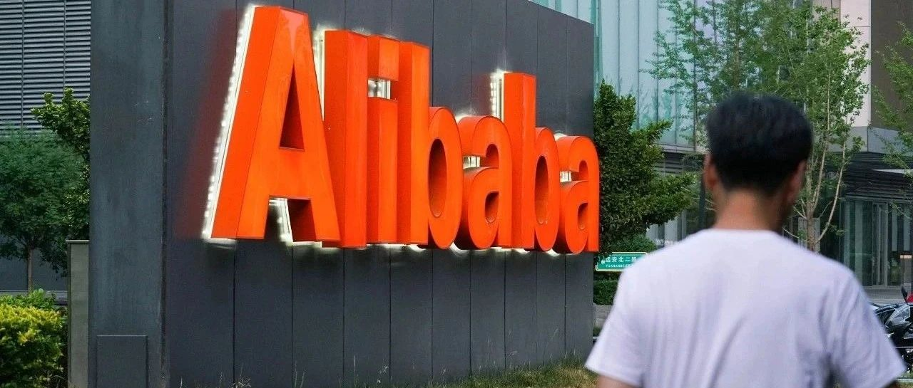

Title: 阿里合伙人樊路远内网道歉

URL Source: https://mp.weixin.qq.com/s/g5QKcQ0mtOFbrQE5csmkqg

Markdown Content:
阿里合伙人樊路远内网道歉
===============
                                                                     

             

  

阿里合伙人樊路远内网道歉
============

[市象](javascript:void(0);)

市象

研究真问题，书写真洞察。

348篇原创内容

_2024年12月07日 12:22_

老樊给大家道歉

对不起，大周末给大家添堵了。昨天灵犀互娱五年的讲话，因为是内部交流，就想着跟大家随意点儿，活跃下气氛。结果说着说着我自己说开了，尺度没收住。很多用词比喻确实讲得不合适。我给灵犀互娱的同学们道歉，对不起。

我性格比较直接，大大咧咧，也爱开玩笑，尺度有时还把握不好，这么多年因此没少挨批评。以前有人给我起了一个外号叫“大炮”，我还理解成敢说敢做透明直接，但我今天才意识到这个绰号的真实含义，观点鲜明，不绕圈子固然值得鼓励，但不顾及别人感受，缺少共情心，口不择言，则会炸了膛，炸了锅。

现在回过头看，大家骂得都对。我只顾逞口头快，没有顾及到大家的感受，不小心就会伤害了大家的感情。再次向大家道歉！我会自罚三月工资，专项加入到灵犀互娱同学的团建基金中。未来，也请大家监督我，帮助我，老樊必须改变。

其实在昨天我真正想分享的是阿里的精神，拼搏，创新，坚持，感恩！现在看来可能还起了反效果。但我依然坚定地坚持这种精神不能丢。我也真心相信，灵犀互娱一定可以成为行业领先公司。我希望与大家一起不断创变、破旧立新，不破楼兰终不还！

预览时标签不可点

阿里4

阿里 · 目录

#阿里

上一篇​独家｜阿里云人力资源部副总裁孙中元离职

Close

更多

Mini Program

Ad

Search「undefined」网络结果

​

暂无留言

已无更多数据

[Send Message](javascript:;)

Comment

Close

**Comment**

更多

[表情](javascript:;)

Scan to Follow

继续滑动看下一个

轻触阅读原文

市象

向上滑动看下一个

当前内容可能存在未经审核的第三方商业营销信息，请确认是否继续访问。

[继续访问](javascript:)[Cancel](javascript:)

[微信公众平台广告规范指引](javacript:;)

[Got It](javascript:;)

 

 Scan with Weixin to  
use this Mini Program

[Cancel](javascript:void(0);) [Allow](javascript:void(0);)

[Cancel](javascript:void(0);) [Allow](javascript:void(0);)

× 分析

 : ， .   Video Mini Program Like ，轻点两下取消赞 Wow ，轻点两下取消在看 Share Comment Favorite            

**市象**

阿里合伙人樊路远内网道歉

,

选择留言身份
