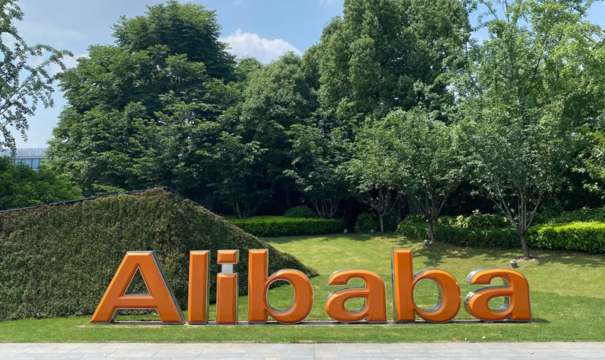
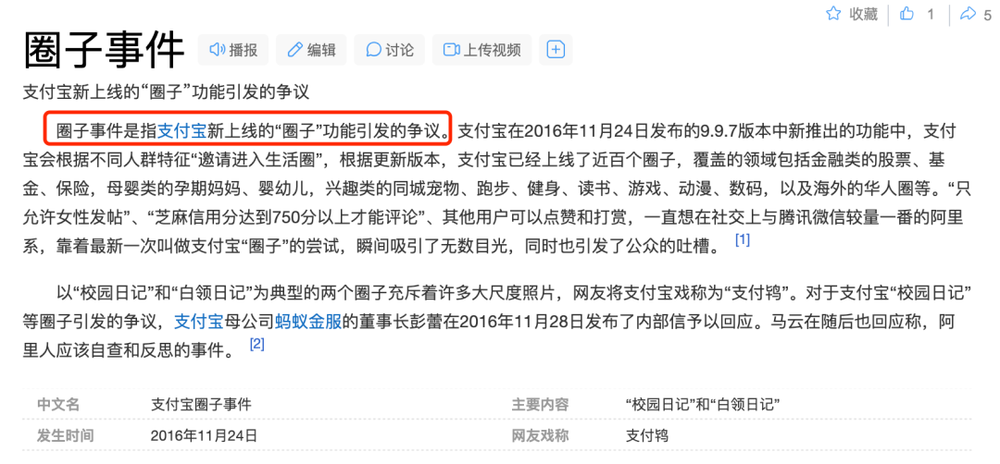

Title: 阿里合伙人：腾讯网易5年内优势不再，灵犀互娱8年内做到第二

URL Source: https://mp.weixin.qq.com/s/-ZVotrwHdKwTJlpLiAbXMw

Markdown Content:

阿里合伙人樊路远的内部演讲引起轩然大波。

12月6日早上，阿里旗下游戏业务品牌灵犀互娱为入职五年的员工举行授戒仪式。授戒仪式是阿里的公司文化，为工龄满五年的员工定制一枚专属戒指并在仪式上授予，此次仪式只有工龄五年以上的员工可以参与。

目前灵犀互娱是属于阿里大文娱分管的企业，阿里合伙人兼阿里大文娱总裁樊路远到场发表了演讲，表达了诸多对灵犀互娱管理层的不满，认为现在开始的灵犀互娱才有了阿里的样子。在演讲中他还对灵犀作出期许，希望可以在8年内全国第三，12年内做到全国第二，18年内做到全球第三。

此外樊路远还回复了员工关心的上市问题。他认为按照现在的估值体系灵犀不值钱，未来阿里文娱盈利了、态势好了，可能会考虑把灵犀加进来，整体打包上市。

以下是樊路远的讲话实录（游戏新知添加了标题方便大家阅读）：

****1、「当时灵犀管理层是不认可阿里文化的」****

灵犀互娱这个公司的发展很有意思。灵犀是在我们以前收购的一家公司（2017年阿里巴巴全资收购原网易COO詹钟晖创立的广州简悦）的基础上面，慢慢演变而来的。正因为如此它没有我们想象的那么阿里。它带了一些独有的自己的公司文化。

我认为从现在开始的灵犀、今天开始的灵犀，才是真正阿里的灵犀。这个灵犀是阿里的一家子公司，不是外面所谓的那种灵犀公司。可能有的人能听得明白我说的话，有的人听不明白。

一个企业的发展一定要有它的历史。支付宝当年是阿里淘宝的一个财务部衍生出来的部门，现在和阿里已经是完全独立的两家公司。我当年加入支付宝的时候，阿里是支付宝最大的股东，我们有花名的文化，就是每个人进来（取一个花名），我们叫店小二文化。其实店小二是淘宝的文化，但它延续到了当年的支付宝，所以支付宝是流淌着阿里的血脉。

但是灵犀，我认为从一开始就没有流淌着阿里的血脉。当时的灵犀管理层是不认可阿里文化的，至少在很多企业价值观、理想使命上，没有跟阿里的使命愿景相匹配。灵犀的文化和价值观取向跟阿里整体的目标是没有达成共识的。

但是今天最少经过这七八个月（自2024年3月詹钟晖卸任、周炳枢接班开始算），在以炳枢为首的管理层的带领下，我大概能从你们的眼神里面感受到一点点阿里的味道。因为人的转变是需要时间的，经过几年的迷茫，我觉得灵犀终于回家了。这个很重要。

**2、「灵犀的收入逐年下降」**

我为什么要讲前世今生？有的同事经历过大文娱时代的灵犀、独立中的灵犀，以及回归到大文娱的灵犀。我认为你们工作中的这种心态，包括所感受的一些企业的变化，应该是有这个感触的。因为我们对于这个灵犀是有非常大的期待的。

以前的管理层不认可阿里的文化，把灵犀当成自己的小王国，**这个也导致了灵犀的收入逐年下降，我们是有很多的数字可以证明的。**

我认为离开文娱的灵犀是没有激情的，保守、顽固自闭，总用之前的经验来看未来。我觉得这个时代其实早已经变了。而且没有视野，没有国际视野，小富即安。完全没有人才梯队的培养，团队成员拉帮结派，还在用老一套的游戏的思维在做游戏。

这个是我对灵犀之前的一些印象，包括我这个分管以后，我认为灵犀的问题，可能你们每个人在座的也能感受得到，对吧。

灵犀是一家游戏公司，灵犀的使命愿景是什么？说我们有（使命愿景），但你们有没有真正的落地和执行？我觉得灵犀的管理层都要学习和反思。

**3、樊路远讲述自己在阿里的17年**

我先拿自己的个人的经历跟大家分享。

其实为什么说阿里是一家我认为伟大的公司？今天你说老樊你是合伙人了，你现在就是阿里文娱的董事长CEO，你现在站着说话不腰疼。

我跟大家讲，如果没有阿里，肯定没有我今天，这是第一。第二个，我在阿里受到了委屈，受到的我个人认为公司对我的不理解，当时觉得我最起码是三上三下。

你们俩别看手机了，好好听讲，这就是你们这些所谓对于阿里文化不尊重的臭毛病。我开会的时候谁看手机，组长团队领导每人罚500块钱，知道吗？今天我们几百人坐在这儿，这个上午啥也不干，就听我在这儿给大家忽悠，你总得记住点什么。是不是最重要的人都在这儿，决定你们命运的人都在这儿，看什么手机，有什么用。

解决问题是要靠思路，我跟你们讲，尤其像周炳枢，这样一直在这个花骨朵的里面成长起来，尤其在你们这行业里面的游戏人、制作人。制作人自己想怎样就怎样，那是不可能的，对不对？我当年在支付宝，我觉得我移动支付我发明的，余额宝我发明的，我觉得我就应该怎么样，不是这样的，对不对？这个世界上离开我，支付宝人家不是活的也挺好，对不对？

我觉得企业的管理、企业的文化，跟管理层有非常大的关系。今天的灵犀我认为还是有一些自己独特的风格，我也认同。因为游戏公司有游戏公司的一些独特的价值，我们认同。

但是我认为绝大多数的价值观体系愿景一定要跟阿里融合，只有这样我们才能走得远，对吧？

刚才我没讲完，我在阿里不敢说是三上三下，但也差不多。

我来阿里的时候，我是支付宝的总裁，那个时候觉得好像一人之下、万人之上，刚来的时候好像觉得自己很牛，完了没干两个月就调去管销售部。

那个时候销售部还没有什么人，我把深圳、北京、上海三个分公司建立起来，没干半年就又给我调职了，管政府事务。我原来管销售部的时候可能管个100人，管政府事务的时候管三个人，你说是我能力不够吗？不是？是组织需要。

干了三年管三个人的这个工作。我跟大家讲，就是在这个过程当中，我无数次想辞职不干了。我觉得阿里是一个看不到别人优点的公司。当时我认为我是个金子，你们怎么就看不到我呢？我是个千里马，你们怎么就看不到我呢？

你们要想想今天你们都在广州还好，我当年我的家是在北京，我到杭州去，那个时候还没钱，租了一个三居室，还是跟同事一起合租。每天管三个人，天天跑事务，我认为这不是我想要的。

但是我觉得你一定要记住了，只要你努力去做，一定会有结果。那2010年我又回归到业务，开始了在支付宝最前途无量的六七年。

从那个时候我带着团队做快捷支付。快捷支付就是今天的移动支付，就是绑手机卡号验证，整个银行卡的这套体系，这个好难的。我讲个题外话，只有中国，我认为只有中国能做得出来移动支付，全球任何一个国家都做不出来移动支付。

那为什么我等下一个五年的时候再讲，为什么卖这个关子？因为我讲这东西你们也不爱听，对吧？还说老樊你做支付宝跟我有什么关系？我只想讲我的经历，在阿里的经历17年。

我经历了无数次的就是想放弃。最简单的就是2016年，你们可能年轻的人，不是老一代的互联网人不知道有个「圈子事件」。那时候我是支付宝总裁，这个「圈子事件」今天看来这东西啥也不是，今天支付宝还做短视频。要按我当年2016年开始做圈子到现在，那支付宝说不好是什么，对吧？那时候我们用算法推送的，这个可惜。

截取自百度百科

那你得负责任，支付宝是个严肃的支付工具。那六七年确实风光，快捷支付、余额宝，支付宝的APP改过多少次版本都是我改。这个很多人不接受，这里面的这种尖酸苦辣太多了。

你们现在觉得快捷支付、移动支付很好用。当时都用U顿查网银的时候，觉得多安全。担心被骗，很多人是绑完了快捷支付，支付完了又解绑，50%的人是这么干的。那个时候我强制绑定，不绑定就不让购物，好在当年还没有拼多多和京东这样的这么强的对手。我们靠这个把用户的心智改变了，今天大家都觉得很方便。那个时候银行不认同、消费者觉得不安全，公司的很多同事都反对，你们知道那个时候的经历有多难。

好了，虽然做了很大的贡献，但是没办法，这个社会舆论还是很...这个是把杀猪刀。当然这个其实是公司为我好，我在杭州待了十年，公司说，这样，你背井离乡十年了，你就回北京，所以我才接的阿里影业。反正就是各种又经历过一年多的变动，负责了整个大文娱。所以我想讲的是，其实在每一个过程当中，去阿里影业的时候我也不想干了。因为当年做支付宝总裁那多牛。那我简直太牛了。

但是虽然那个时候觉得自己好像很厉害，前思后想还是觉得四十多岁的男人正是这个事业上的一个持续的高峰期。虽然在事业的持续发展当中有起有落，但是还是坚持下来了，才有了今天这个阿里影业。

那我做阿里影业的时候一年亏20亿，一个电影公司一年亏20亿，**到今天，我们去年一年赚八个亿，今年我们还是持续盈利的。**

那我接了优酷以后，我接手的第一年，因为我接手的正好财年结束，那一年亏了143个亿，你们可能这个闻所未闻。那就是这么亏了，就是这样的一个商业模式。**到今天可能这个大文娱整个的亏损，可能也就是五六个亿，那明年我们就整体全面的盈利。**我和我的团队付出了非常多的脑力劳动和体力劳动，才有了今天。

别看我站在这儿，跟你们侃侃而谈，对我的艰辛苦辣，其实你们每个人可能我认为都没有经历过。像周炳枢这样的，他经历过啥。就是网易待了，得干点活，完了出来创业，没成功，最后投奔了，就跟三国里面投奔了袁绍这样的。最后就是（简悦）整个被接管了，就这么一回事儿。

但是你们要知道袁绍财大气粗，四世三公被曹操最后以少胜多打成那个样子（指官渡之战）。我觉得我们大多数同事没有经历过苦难。

没有经历过工作生涯的这些委屈，我认为你们都不能大成功，包括我们的马老师。马老师在创业初期，所有人没见过他的商业模式，都觉得他是个骗子，全都觉得他是个忽悠。还有马斯克，特斯拉当年被多少人做空，到今天这样的一个公司创新。

所以我想跟大家讲，在座的所有人包括灵犀的管理层，你们没有经历过磨难，你们是在一个很小的团体里面，所谓的这种成长，我认为是不够成熟的。**我们期待的灵犀是要面向整个的市场，未来要面向全球竞争的这样一家企业。**你们必须有足够强大的心智，足够强大的格局、足够强大的眼光，还有抗击打的能力。

**4、《三国志·战略版》成功归因，「要学会感恩」**

这些年其实大文娱经历了非常多的坎坷，集团对我们的不信任。你们这好的很，自己在一个小圈子里面，觉得自己反正又赚钱了，没有经受过外面的风吹雨打，好像保护的很好。但是一打开里面，我跟你讲这个团队，说实话，我说的可能比较尖锐一点。

今天给灵犀带来最大现金流的这个游戏（指《三国志·战略版》），是在阿里大文娱的支持下才有今天的。这一点当年很多人是不承认的，但是他不承认也得承认，因为事实是无法被磨灭。

而且我跟周炳枢深刻的聊过一次，我说真正的三国志的成功具备三个要素：

第一个要素，我觉得是周炳枢占三分之一。他带领陈挚（灵犀互娱自研线核心管理人）这个团队，把这个SLG策略游戏，在原的基础上面做了一些创新，这是他团队的力量。

第二个我认为是阿里文娱。当年我决定让史仓健（2017年上任阿里游戏总裁）去日本买了「三国志」（光荣的一款三国题材SLG游戏）这个IP的授权。也就是说我们这个时代80后70后的一个团队，我们小时候是玩《三国志》长大的。我们把它的形象，包括它的内容内核买过来。我觉得授权这是第二个成功要素。

第三个成功就是，当年郭德纲跟我是好朋友啊，还有高晓松还没被封杀，（这两个代言人）对男性用户有很大的影响力的。我们投了很多的宣发的费用。

我认为这三点缺一不可，才有今天《三国志·战略版》的成功。

我就想问问了，离开了大文娱之后，你们哪一个游戏年收入超过10亿15亿的，有没有？炳枢有吗，有没有？有就有，没有就没有，当年又不是你做的，你有什么不好意思说？

我觉得是这样，就是说我们要尊重历史，不能像他们某些人一样，觉得好像都是自己做的。

我跟大家讲我的成功，尤其我在支付宝的成功，我在阿里的成功。今天如果没有阿里这个平台，没有淘宝，就不会有今天的支付宝。当年的淘宝是多么的支持支付宝，才有了支付宝后来在整个行业里面的领先地位。所以我觉得吃水不能忘挖井人。

我们每一个人，不管你是从灵犀来的，还是从简悦来的，还是网易腾讯来的，每个人都要学会感恩。一个没有感恩的公司，一个没有感恩的团队，是做不久做不长的。

**5、「弯道超车肯定不行，要换道超车」**

我觉得做企业，做人也很重要。所以我想跟大家讲，就是说灵犀遇到的风浪太少了，所以你们每个人都是花骨朵。从今天开始我要让你们面对市场的全面的竞争，也只有这样我们才能成功。

没有激烈的竞争，哪里来你们这个奋勇杀敌的勇气和激情，每个人都要在这种环境当中，我觉得才兴奋。

游戏我不懂，但是我觉得它总有一个规律，我不知道我说的对不对。比如《王者荣耀》的成功，我认为是借鉴了是PC时代（的游戏），当年的《英雄联盟》的手游版；吃鸡的这个游戏（指腾讯旗下的《和平精英》）的成功，我认为是当年我们最早小时候玩的PC版的CS的借鉴（游戏新知认为他说的不对）。所以我觉得就是说游戏，我现在跟你们讲我的看法啊，不要从头到尾的创新，千万不要，一定在一个大家喜闻乐见的游戏上面做一些微创新，你就成功了。

你们以为《原神》（指米哈游旗下开放世界游戏）是叫自己原创的吗？不是，是因为它的创始人去日本调研游戏市场，发现日本的二次元的文化非常盛行。但是因为日本的对于二次元投入的游戏公司非常的少，或者就是说也投入但是没有那么大的资源去做。所以他才回国回来，对吧？（游戏新知认为也不对。）就是重金投入了二次元的这个世界游戏，才有今天的成功。

所以我觉得罗马不是一天建成的，我们一定要在我们的基础上面去微创新，去形成我们的优势。不要觉得别人《王者荣耀》做的好，我们就去做一个《王者荣耀》，你做不过人家。做任何游戏，我觉得弯道超车肯定不行，要换道超车。

怎么换道超车？我待会儿跟大家讲中国的娱乐，我觉得娱乐行业其实从长期看一定会走向全球，今天我跟大家讲我们的很多的中国制造走向全球。你们知道我们的新能源汽车，包括我们的电商、光伏产业、消费品产业，全部走向全球。

中国的娱乐产业在未来的5-10年，一定会全面的走向产全球。

为什么像《原神》这样的公司，它的海外收入占了非常大的市场。三年前我一直要求就没有离开阿里文娱时的灵犀。我就一直要求要做海外市场，但是之前的管理层，我认为格局太小，没有国际视野，不知道怎么做。我每天都逼他，最后逼得他想了个辙，就当逃兵了。所以就是说我们必须是国际的业务，全球也必须是我们的未来的重点。

游戏产业，我的判断5年-10年全球游戏的收入有70%可能会来自于中国公司，或者是与属于中国公司合作的伙伴的产品，这个是一定会实现的。基于这样的一个未来战略目标，回往一个回溯，灵犀必须要具备国际产品化的能力。这个是我对你们非常重要的要求，也对现在管理层重要要求。

**6、「中国第二，我认为是对灵犀的最符合实际的要求」**

**①五年之内，用AI工业化与腾讯网易抗衡**

而且我们必须结合AI。因为游戏的影视化、影视的游戏化一定是未来的终局。

其实在我看来，我觉得一个电影的导演和一个游戏的制作人，他们可能有80%的思考工作的方法是一样的。因为他们都是一个项目或者一个产品的负责人，有些东西是异曲同工的。所以我们整个大文娱，我们会建立一套基于AI底层的数字化的工业管线流程。

这里面会包括动画、动漫、游戏全部要纳入进去。今天的灵犀我觉得包括你们的技术团队可能有考虑这个，但是还没有坚决的考虑。我跟大家讲，这个大文娱对于AI的投入，我们是其他那些视频网站的投入的之和。因为我坚定地认为游戏的影视化，影视的游戏化就是未来，所以这一块儿我们双方以后在技术上面要全面地打通。我举个最简单的例子，这个打通是基于比如美术和策划。

其实今天你们不要担心AI取代了你们。我认为AI是个工具，AI这个工具可以帮助你们更快地提高效率，做出质量更高的游戏的界面。这一点我相信不仅我们在用，腾讯和网易都在用，对吧？但是谁用得好，怎么打通这一点？在慢慢的工作过程当中，我会让团队和大家一起来沟通。而且我个人认为，新一代的游戏制作很快会到来。

**我的判断是五年之内腾讯和网易的优势将不再。**他们之前拥有大量的优秀人才，比如美术、策划团队，都是非常优秀的。因为人都往高处走，我觉得由于我们对AI数字管线的投入，我们会缩短和网易腾讯在这方面的差距。也就是说，我们用少量的美术和策划团队，同时用我们AI工业化的数字制作流程就能和他们抗衡。我们必须是一家全球性的娱乐公司。

**②8年内做到全国第三游戏公司**

我跟大家讲，你们说我们对我对灵犀的期待是什么？我对灵犀的期待非常大。我们现在能排到中国游戏公司的前十名。因为游戏有制作周期的，从现在开始我们（开始思考）怎么来做新一代的游戏的创新。**我觉得八年之内，我们应该做到全国第三，**就是说排在腾讯和网易之后。第二个我认为是直到12年之内，我们游戏灵犀游戏必须做到中国第二。这是我对灵犀的期待。

**③15至18年全球娱乐行业第三**

以炳枢为首的这个管理层，我认为必须要肩负起这个公司对于灵犀互娱的期待。既然你们已经是大文娱分管的企业，那我就要对你们提出大文娱整个未来的一个规划前景。所以我对灵犀的管理层的这个要求，我是觉得10年到12年你必须做到全国第二，你其实做到全国第二，在全球也会有排名了。

我跟大家讲那时候的感觉是什么，**那阿里大文娱集团一定要在15年到18年之内做到全球娱乐行业的第三。**

为什么第三呢？我也想了好久，第一是奈飞（Netflix），人家现在4000亿美金，咱也算了吧。第二是迪士尼，100年历史了，咱们也算了吧，有点自知之明。

但是第三，为什么我觉得有机会呢？全球来看，真正在影视娱乐行业能有工业化基础，能有工业化的这种体系投入，包括资金、人才资源的话，其实只有美国和中国。

欧洲已经没有影视行业了，只有影视工业了。只有一些你们看过西班牙的一些小众的电影。《看不见的客人》《纸钞屋》这些，他没大规模的这种了。非洲不用说，根本就没有。这个南美人口多，没有用。

剩下的东南亚只有印度，印度只有唱歌跳舞。当然一年能拍出来一个像《因果报应》（印度悬疑片）这样的。我觉得大家可以去看一下，这是阿里影业引进和发行的印度悬疑神反转的一个电影。印度虽然人口多，但是人群的综合素质加上他们有各种阶层，我认为也没有了。

那剩下的就是东亚的日本和韩国。日本，除了动漫电影以外，真正的真人电影，节奏已经慢了。唯一的就是韩国，现在大家主要看韩剧和美剧。

韩剧确实厉害，但是我觉得是这样，韩国首先它的市场小，它只能受制于奈飞。因为现在奈飞如果不买的话，那些制作没有网络播出平台，它只有电视台，电视台谁看呢？只有年纪大的看，年轻人都不看。所以就是说它没办法成建制的去做一套影视工业化的基础。所以只有中国，中国我认为只有阿里大文娱在全面的投入。

具体你们说老樊你这说了半天，我们也没有概念。光是想我觉得是这样，两年之后你们这里优秀的员工管理者，我们可以给你二三十个名额去看一下什么叫真正的影视工业化，让你们看一看什么是基于AI建立的工业化数字娱乐基础设施。

我觉得这个底层的基础设施建好以后，我认为我们对很多公司是降维打击。为什么我说拍电影和做制作游戏差不多？一个电影，从策划到真正拍出来三年，懂我说的意思了吧？三年，你的游戏从策划到研发到上线差不多也三年，制作周期都是一样的。

但是我跟大家讲，**我们会把电影制作的周期从三年或者两年多缩短到一年，**这就是我们的效率和我们对于未来影视行业的判断。包括我们自己的能力，原来我也不懂，我说这一部电影、一部动漫怎么要两年才出来，它确实有一个硬性的制作周期。

但是我跟大家讲，我今天作为大文娱的负责人，我必须要推动创新的效率。这一点到时候发给你们管理层。

马斯克讲过，就有人提问说，马斯克你在不在特斯拉，特斯拉可能都是这个估值。他说确实是，但是他认为就是创新其实大家都想得到，比如就跟做短视频一样，对吧？快手也想到了，抖音也想到了。但是马斯克的存在是他极大推动了创新的效率。

这是为什么有时候我跟周炳枢沟通的时候，我老着急的原因。**周炳枢永远都要用他原来制作游戏的那套体系来去讲，说他是有周期的，它需要时间的，他需要人才的。**

我再说一遍，灵犀的前世今生，他所未来的发展其实跟影视行业，我认为相同之处85%有以上。虽然我不懂游戏，但是我认为效率、质量一定是电影和游戏共同关注的，包括内容的策划。

也就是说电影你为什么喜欢看，是因为它的内容真的是好、没见过、好奇。游戏也一样，一定是内容决定。光画面好没有用，电影画面好的多了没有用。

所以我想未来尤其以周炳枢为首的灵犀的管理层，必须提升自己的国际视野格局、海外布局的执行力，培养年轻优秀的制作人。**我对炳枢的要求就是，必须给我再招十个像小萌（《如鸢》制作人）、科西（颜科西，《风之大陆》制作人）、陈挚这样的制作人成立工作室。**我们不要老天天守着三战的那点利润，去说每年我还有这些利润，这些利润没有用。

我们如果不布局未来、不布局全球化，我们没有任何机会。跟大家讲，我不希望看到一个墨守成规，每年做出两三个游戏，就小富即安的游戏，这不是我们想要的。

**中国第二，我认为是对灵犀的最符合实际的要求，**我们对腾讯还是稍微尊重一点。但是我觉得，周炳枢你是从网易出来的，如果有一天你做的公司，收入超过了网易，你觉得你内心会有怎样的波澜壮阔。

**7、「出去创业就能成功吗？不可能」**

就跟刚才我看前面有人说，一个人如果有两套房以后我就退休了。我觉得是这样，当你没有两套房的时候，你肯定会想说我有两套房就退休了，当你拥有了两套房子的时候，其实你真退休，你去想一想你身边的人。你想打个掼蛋，想打个球，人家都在忙碌工作，你跟谁交流呢？跟AI机器人？

所以我觉得人生啊，我觉得退休不是我们这些创业人所能想到的，除非公司不要你。我觉得是这样，除非阿里这个集团觉得说老樊你在这儿碍事儿，你也不行，不让我干，（除此）以外，我觉得我个人我能干多久干多久。

对人生，我的这个看法不代表所有人的，我只是说我的看法，我觉得人生活着是没有任何意义的，没有任何意义。那你的意义来自于哪里？就是你要创造，为家庭为社会带来的价值，等到你八九十岁在回忆的时候，那时候才有意义。我可能说的不对，但是我觉得我就是这样认为的，所以每个人都一样。

而且我跟大家讲，就是说我们都想创业，很多人年轻人说我不干了，我要去创业可以。你们好好想一想，有多少人创业能成功，你以为你就是那个天之骄子吗？我们这里面创业没成功的有好几个坐在这儿。

你十年前没创业成功，现在你觉得好像有了点名气，出去创业就能成功吗？我告诉你，不可能，知道了吗？你十年前成功，你机会会更大一点。因为那个时候资金多，市场无比的活跃，你还有机会。

说句难听一点的，我跟大家讲简悦。**如果阿里不收购这家创立六年的公司，最后就是倒闭关门，哪有后来今天的所谓在这个基础上面有灵犀，啥也不是。**所以为什么我说人要有感恩之心？不要你们以为说我多牛，腾讯、网易的制作人出来创业的，你们跟我讲哪个成功了，我还没听说过哪个人出来什么。

当然你说《黑悟空》那个是吧，但那个人是这么讲，你们有是吧，我觉得你们不行。对，不是忽悠你们。不要拿自己的青春去赌博。我跟大家讲，今天你们在灵犀这个游戏平台上面，其实就是创业。

有的人说创业，我就想没人管我，我想怎样就怎样。最后就是创业是创了，到处借钱，到处融资，那还得管理团队。完了人你以为每个人在创业之前，大家说好的都就是同甘苦共患难。我跟你讲创业一段时间会发生巨大的分歧。

为什么？我家里有老婆孩子，我得还房贷养孩子，你是不用了。每个人的环境不一样。所以我觉得你们，不要都以为自己说我做了一个产品成功了，我到外面去做下一个产品一定会成功。我告诉你，错！路径依赖经验在这个行业里面分分钟被年轻人打败。

你们基于灵犀这个平台，基于阿里大文娱的这样的一个资源支持下，给你机会你都创业不了。你难道你自己去融资去就就能成就能创业的了，我也不明白了。

**8、「公司说你不行，你就是不行。」**

今年你们（工龄）五年了吧。我希望你再干五年。其实阿里是很希望这些，跟阿里一起走过来的，我是觉得是这样。前面的五年、十年，我认为你们也就可能稍微那么一点点理解阿里。因为这家公司在以前的管理层带领下走火入魔过，我不认为你们具备阿里的这种价值观体系，使命愿景这套体系。所以就是说你们要重新学习，重新认识阿里。

从今天开始，什么是真正的阿里？我们的HR团队一样也不专业。因为广州，咱们这么讲，一般过去古代说流放，怎么一流放就南方之地。

那么为什么叫鸟语，你们也很清楚。听不懂，是不是？所以就是说你们离着总部那么远，就是我认为千万不要叫天高皇帝远。我们的HR的这个组织体系，我们的OD的这个体系，全部都要全面的要到总部去培训去。**什么叫阿里的文化，阿里的精神？就是说公司说你不行，你就是不行。**

我当年犯过很多错误，总觉得你们不理解我、不懂我。就是我现在难道我会讲说，如果2016年听我，我们何苦今现在支付宝还做短视频和直播。那个时候现在多少年了？八年过去了，我们早成为一个基于算法推荐的支付宝了。我去跟集团讲，你们当初不听我的有用吗？

每个公司在成长的过程当中，不是永远是对的，永远都会有起伏。人也一样，永远有起伏。你们不要老都觉得任何东西都要如你所愿才行。我跟大家讲，没有那么多如你所愿，人生只有经历过坎坷。

灵犀，我认为前几年除了在大文娱，刚刚开始三年这个游戏我认为还是正常一点以外，后面这些发展我认为全都是走火入魔。你想到今天为止，虽然我们有了一些所谓的创新游戏，但是对于灵犀的影响有多大？不大！我们还是主要靠三战。

三战几年了？三战五年了，一个游戏五年没有创新，啥也不是。不要吃老本儿了，你们很危险。一个游戏，也就是说三年离开文娱，这三年灵犀真的是我认为丧失了市场竞争力。自己搞一个独立王国，小富即安？搞小团体霸凌就为了自己的利益牺牲了。我觉得你们未来发展3-5年的空间，我觉得这是对灵犀最大的损失。

所以今天开始我们大家一定要有未来，你们一定要相信灵犀是一家有未来的游戏公司。而且基于在大文娱后台的支持之下，资源的匹配上，我认为灵犀一定会成为中国，刚才说那几年反正这第三、第五，反正一定。以后没有第五了，我们就是前三前二，不是个冠亚军季军都没人理你。

今天你像莉莉丝也好什么，那些公司你说我们比人家都有差距，其实我们的资源太好了，没有用好，好吧。所以就是希望灵犀真的能有未来，而且必须有未来，没有未来都不行。

我们每年都会拿小鞭子来抽这个以周炳枢为首的管理层，他不往前走，我们就是拿小鞭子抽。如果他实在走不动了，那我们就再找十个周炳枢出来，我也要把这个灵犀游戏做成，让国内的用户、全球的用户都认同的一家企业，我们要让快乐带给每一个人，这也是大文娱的使命和愿景。

谢谢大家好。

**/**/**/**/********

**9、「按照现在的估值，灵犀不值钱」**

**在演讲之后，樊远路还回答了灵犀互娱员工关心的上市话题。**

樊路远：我务实的讲，如果你们觉得灵犀游戏单独上市有估值，那我们就上。但是我认为以现在灵犀的收入和它的增长，因为上市公司不是看你现在的利润，要看你的未来。如果按照现在的这套估值体系上去，我认为灵犀不值钱。

你们可以去看看香港的这个市场，对吧？我们在国内上肯定上不了,这个企业类型的问题，如果上香港上美国，我觉得就别去了，对不对？哪天把你封了，你去香港上你有多少估值？

这个事情我跟周炳枢沟通过，当然有一天大文娱做好了吧。要不然周炳枢老觉得好像说大文娱占灵犀便宜，说你们还亏损，完了跟我们一合并一下。对，他人自私很正常，因为他毕竟一个制作人，他有什么格局呢？他做三战的制作人，他肯定没格局。但是他当了灵犀的总裁CEO，他就必须要有格局。因为他不是只自己挣这一份钱，拿这个提成，他只关心自己分多少钱。他是个公司的负责人，那他必须要关注我灵犀这几千人未来能带来什么收益和利益，对不对？

我务实地讲，**如果有一天文娱盈利了，而且我们的态势越来越好，我们可能考虑把灵犀加进来，我们整体打包上市。**但那个时候如果灵犀的产品和收入还是这个样子的话，我们不见得带你玩儿，懂了吗？这个嫌弃是相互的，那我好的时候，你也得好，我好大家好，咱得双赢，咱得双向奔赴，是不是？你不能现在好像说我们贴上你，我们不干的事儿，必须大文娱整体盈利，而且业务还有发展，在持续的好的时候，我们一起考虑。

**/** **END** **/**

