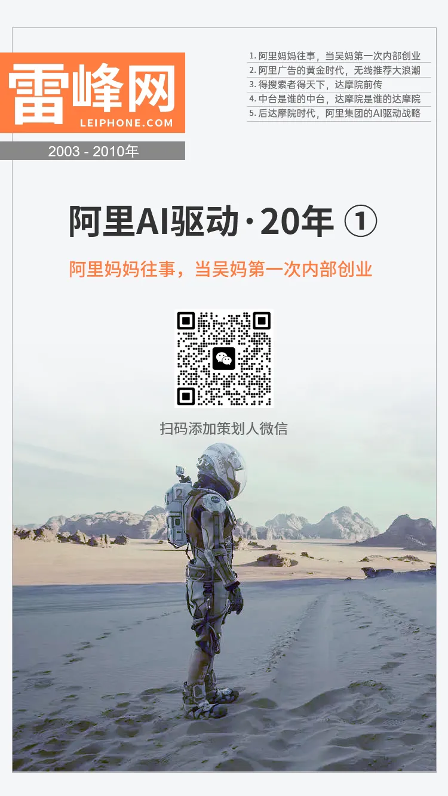
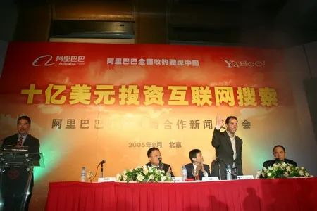
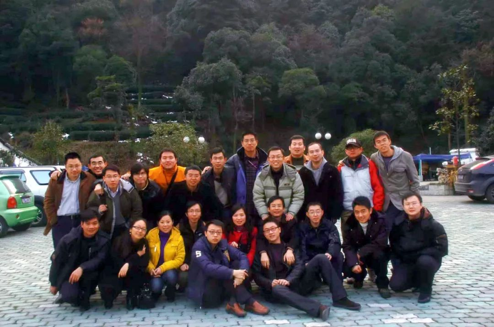
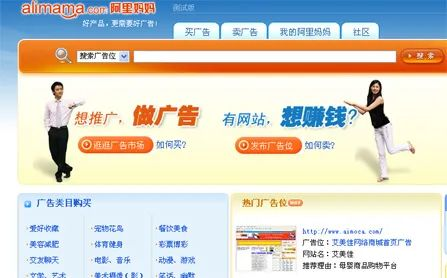
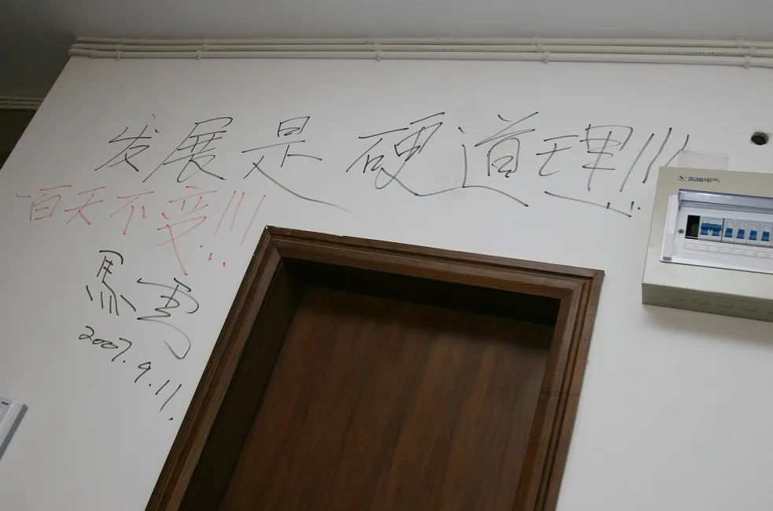

Title: 阿里妈妈往事，当吴妈第一次内部创业

URL Source: https://mp.weixin.qq.com/s?__biz=MTM2ODM0ODYyMQ==&mid=2651651753&idx=1&sn=b25d9151cf80c0655dd264628f9cd266&chksm=6248fe0b553f771d2adac6d927261a243bc163a7921cfb5cf681d585c4f05472c65a62e276be&scene=21

Markdown Content:

**吴妈成为阿里内部创业公司负责人，初次独当一面。**

”

作者 | 房晓楠 陈嘉欣

编辑 | 林觉民

今年9月上旬，吴泳铭上任，成为阿里巴巴集团新一任CEO。

众所周知，吴妈淡出一线业务多年，在经营元璟资本的日子里，他主导投资了涂鸦智能、理想汽车、ofo共享单车等多个明星项目。

当前正值阿里求变之际，他再次走向中心，执掌整个集团。在上任后，吴妈发布了首封全员信，集中传递自己任职的两个战略重心——“用户为先、AI驱动”。

为什么是这两点？又为何现在提出？

离开一线多年的他，为什么提这两点？其实凑近细看便会发现，两个战略重心的内核，早已在十几年就开始显现。

那时候，各种机缘下，吴妈作为阿里内部创业公司的独立负责人，第一次真正独挡大梁。

**01**

### **收编雅虎，团队初创**

2005年8月的北京，秋高气爽，一场总额10亿美元的收购案正在举行发布会。

现场，阿里创始人马老师与雅虎首席运营官罗森格签署了合作协议。发布会背景板上写着“阿里巴巴全面收购雅虎中国”，媒体的闪光灯不停地闪烁，两人的脸被照得通红……

阿里巴巴收购雅虎中国发布会现场

阿里收购雅虎中国有着多重意义，其中之一是收获雅虎中国的核心搜索技术人才，为阿里的技术大发展埋下了伏笔。

事实上，在收购完成后，留在阿里的雅虎员工主要是新人。

有一种说法，当时雅虎中国员工分为“老雅虎”和“新雅虎”。“老雅虎”是指较早前围绕周鸿祎加入雅虎中国的员工，而“新雅虎”是指加入两年内的员工。

随着阿里和雅虎中国并购的进行，那些“老雅虎”跟随周鸿祎去了360，留下的“新雅虎”则被纳入阿里。

甚至有些新人，“新”到雅虎中国的工牌还没有捂热，就紧跟着成为阿里的一员。典型的如乐田（真名：赵斌强），他面试的是雅虎中国的职位，入职时公司已经变更为阿里。后来，乐田成为阿里搜索推荐技术团队的中坚力量。故事详情将在雷峰网后续发布的《阿里广告的黄金时代，无线推荐大浪潮》一文呈现，感兴趣的读者可联系作者沟通交流（微信 **youlinancy**）。

熟悉阿里历史的都知道，阿里并非依靠技术发家。为此，如何妥善融合这些雅虎技术精英，对阿里来说是一项有难度的任务。阿里高层也付出了不少努力。

坊间传闻，为了取悦这些员工，马老师策划了一次雅虎中国员工“走访”杭州的活动，并制定了一项规定：不谈业务，只谈感情。

整个活动策划的非常细致，为更好地接待他们，阿里甚至成立了专门小组，不断召开会议调整安排，甚至会讨论早餐是吃包子还是吃面包等细节。

另一个细节是，尽管杭州的阿里总部急需技术人才，但为了不给员工造成太大影响，雅虎中国的技术团队仍然留在北京，需要时部分人员会以出差形式往返两地。

阿里高层对来自雅虎技术人才的重视力度，可见一斑。

最初，吴炯是负责吸纳雅虎中国技术人才的总负责人，也是阿里的第一任CTO。

吴炯在1996年1月加入美国雅虎，负责搜索引擎和电子商务技术开发。到了2000年，他加入阿里，成为集团首席技术官。

于是，在合并后，有些雅虎工作经验的他被委派负责吸纳雅虎中国技术人才的重任。

一开始，马老师只将广告系统这项任务交给了吴妈。吴妈是阿里第一代程序员之一，被称为“十八罗汉”。他与阿里的故事起始非常普通。

1996年，吴妈从浙江工业大学计算机系毕业后，偶然在《钱江晚报》上看到了一则招聘启事，中国黄页公司（由马老师在创建阿里巴巴之前创办）正在招聘程序员。他投了自己的简历，没想到被录取。从那时起，吴妈一直跟随马老师，从中国黄页到阿里巴巴，一路创办了一个商业帝国。

因此，吴妈负责雅虎中国广告系统技术团队非常合适。

当雅虎中国员工被并入阿里时，他们分为两部分。原本负责搜索的人继续在B2B业务中从事搜索工作，例如张勤（花名：杨过）。张勤曾是雅虎中国搜索业务的负责人，合并后成为B2B业务的副总裁，后来转向了阿里搜索事业部。关于这部分的故事，详情将在雷峰网后续发布的《得搜索者得天下，达摩院前传》一文呈现，感兴趣的读者可联系作者沟通交流（微信 **youlinancy**）。

另一部分从事雅虎广告的员工则由吴妈领导，负责阿里的广告引擎，其中包括张雅洁、苏宁、孟琛等人。

这些广告团队中的一部分人继续从事雅虎中国直通车业务，后来改成淘宝直通车，然后并入阿里妈妈，其负责人是张忆芬。张忆芬曾是雅虎中国搜索总经理，在2008年创建淘宝搜索中心，当时向陆兆禧汇报，但没多久就去了美国雅虎。

据当时的参与者对雷峰网回忆，并购后的一段时间里，雅虎国际化团队的中国业务由阿里巴巴和雅虎总部共同领导。他们的主要任务是建立全网搜索引擎与百度竞争。CTO吴炯每隔半年主持一次大型会议，处理各种事务。

然而众所周知，在这场持续两年多的“搜索战”中，百度以技术优势获胜。这并不是阿里等公司没有尽力，而是百度在搜索领域采取了更明智的策略。此外，搜索对于百度来说是核心业务，绝不容忍失败。

在搜索战场“折戟”后，吴炯走了，阿里也开始忙着进行战略调整，寻找新的战场。

尽管在搜索战中失败，但这段经历让阿里意识到合作模式，特别是与雅虎总部的技术合作，可以吸引人才。

因此，随着阿里搜索业务战略的调整，雅虎国际化团队分为两部分。一部分员工选择留在美国雅虎，而另一部分认为加入阿里是更广阔的机遇，因此选择回国加入阿里。

总之，在那个时期，阿里成功吸引了许多人才，例如青峰（真名：王志荣）、五福（真名：沈加翔）、超凡（真名：王华）等。青峰和五福后来成为阿里搜索体系的重要人物。超凡进入阿里后，一开始负责淘宝直通车产品，在2010年后负责整个钻石展位和淘宝直通车。

同时，吴妈开始招揽人才，寻找技术专家。例如，刘振飞曾在美国雅虎工作，智商和情商俱佳，后来成为吴妈的得力助手；还有从海外引进的三多（真名：梅坚），他是阿里早期的算法工程师之一，创建了算法团队的早期雏形。

那时，阿里正努力构建淘宝联盟以获取更多流量。在推广淘宝时，他们原本计划与新浪等大型门户网站合作，但发现这些网站几乎都被eBay收购，不允许淘宝广告出现在其首页上。

因此，淘宝只能通过中小型网站进行推广，这就是由王庆伟负责的阿里联盟的任务，他们专门与这些中小型网站合作。李红星是阿里联盟的技术负责人，使阿里联盟成为仅次于百度联盟的第二大联盟，为淘宝在中小型网站上的推广作出了巨大贡献。

在推广淘宝的过程中，马老师意识到中小网站潜力巨大。因此，他在2007年5月开始构思创建一个真正开放的业务，一个广告主和流量方都开放的广告平台。这一想法最终演化为阿里妈妈——一个中小企业广告交易平台。

马老师亲自任命吴妈为阿里妈妈的总经理，全权负责该业务。

吴妈接手这项任务后，首要任务是挑选技术团队。他的团队大多来自雅虎，因为他之前负责阿里广告引擎。一些团队成员包括李红星、梅坚、龚笔宏、陈宫平、刘振飞、林伟等。

虽然吴妈之前担任过阿里的技术总监和支付宝首席技术官，但这次是他首次从零开始负责一个业务。这也是他的第二次“潜心创业”经历，因此这次的阿里妈妈创业在他的履历中占有重要地位。

2007年6月，人才集结完毕，阿里妈妈的创业序幕正式拉开。

2008年年初，吴妈组织阿里妈妈创始成员在杭州梅家坞附近的饭店聚餐

**02**

### **湖畔花园，百日创业**

当日，杭州湖畔花园的一间房聚集了十多人。

一些是杭州当地的，比如前不久刚从厦门调配到杭州集团市场部工作的林振宇，以及两位负责架构的工程师余斯恒和张立中。

一些是刚从北京飞过来的，他们身上还残留着旅途的疲倦，比如李红星，他作为北京技术团队的先遣队员奔赴杭州。

阿里妈妈的发源地：杭州湖畔花园

虽然这些人都是同事，但以前并没有太多交集。他们的共同目标是响应阿里妈妈的大计划。

简单寒暄之后，大家陷入了沉默，等待着马老师关于阿里妈妈构想的介绍。

那天，马老师讲了很多，但最令人印象深刻的是，阿里妈妈的使命是让每个小型广告主获得他们需要的流量，同时也让每一份流量变得像商品一样可买卖。

阿里妈妈的商业模式不是采购广告，而是撮合，主要业务是广告分发。

简而言之，阿里妈妈的广告策略是整合众多低流量的中小网站，广告主可以通过阿里妈妈平台购买这些广告资源。

这种模式在某种程度上类似于Google的AdSense，一些流量较低的中小网站也会显示他们的广告。但不同之处在于，Google的AdSense是通过Google搜索技术，在相关网站上放置匹配的广告。由于广告是随机显示的，广告主通常不清楚他们的广告会显示在哪个网站上，只能通过点击效果来付费。

然而，阿里妈妈的广告主可以看到他们的广告确切地显示在哪些页面上，也可以自行控制广告费用。

某创始成员告诉雷峰网，阿里妈妈孵化时期，马老师就定下了一个目标——“10天拿下1万个网站，100天拿下10万个网站”。

商业模式清晰，目标明确，阿里妈妈开始了百日创业之旅。

虽然背靠阿里这座大山，可创始团队该吃苦一点也没有少吃。

当时，项目团队的总预算仅为100万元。扣除服务器和设备运营等费用后，用于食宿的费用有限，分摊下来，团队成员每周的伙食费仅约10元。

白天，他们在湖畔花园的办公室工作，但晚上，为了节省开支，不得不寻找其他住处，只能租最便宜的三人间。

然而，团队成员并不抱怨。他们的努力和决心使他们在困难中也充满了干劲。周围居民经常能听到一首歌曲《年轻的战场》的旋律，而在深夜，当湖畔花园陷入黑暗和寂静时，仍然能看到办公室里的灯光。

况且，有吴妈这颗“定心丸”在，大家也觉得安心。

更重要的是，大家还得到了一个承诺——他日阿里妈妈必然要独立上市，今日的创始成员都将获得阿里妈妈的股份。

虽然我们都知道，阿里妈妈最后没有独立上市，不过当时公司许诺大家的股份并没有泡汤，而是换成了集团的其他股票。这个关于未来财富的承诺激发了团队的斗志。

从6月开始，这些人在湖畔花园的小房子里努力工作。产品经理黄航飞、王磊等人不断提出需求，而技术工程师李红星等人不停地编写和修改代码。

两个多月后，他们终于将马老师的愿景变为现实——8月10日，阿里妈妈发布了外部测试版。

阿里妈妈公测版的网页

仅一个月后，即9月10日，阿里妈妈正式上线。销售团队，以林振宇为代表，将重点放在积累外部中小网站上。

上线不到百天，阿里妈妈汇聚了超过14.9万家中小网站和超过13.5万个个人博客站点，提供超过38万个广告位置，注册会员超过100万，每天覆盖中小网站总流量超过10亿次浏览。

阿里妈妈的第一阶段目标得以实现。

庆功宴上，除了吴妈，马老师还拉来陆兆禧、彭蕾等几个高管一起祝贺。高管们在台上充满激情地演讲，而底下的人则热烈地互相祝酒。

为了犒赏众人，马老师在欢呼声中切开一整头烤乳猪，欢乐的气氛达到顶点。

麻面脆皮，刀刀入肉，滋滋冒出的油气、炭火烤就的焦肉香，混合着空气，一同钻进在场人的鼻腔……

时至今日，参与者在向雷峰网回忆当时的场景时，就像回忆昨天，依然印象深刻。

酒过三巡，马老师站上高凳，情绪高亢地讲述阿里的目标和梦想，那里包含着过去、现在，还有更重要的未来。而身后的背景，是马老师不久前写在墙上的一行字——发展是硬道理，一百天不变。

2007年9月11日，马老师在湖畔花园房间墙上写下“发展是硬道理，一百天不变”

此刻，台下站着的都是相信他的人。

庆功宴之后，阿里妈妈的创业过程迈入了新的阶段，结束了那种无规范、无流程、通宵达旦的冲锋日子。

随后，团队规模不断扩张，从原先的十多人增加到二十余人，甚至七八十人。湖畔花园的小房间作为阿里妈妈的起点，由于空间有限，无法容纳如此众多的成员进行日常工作，但无限的梦想仍然坚定存在。无论吴妈领着这支团队前进到哪里，他们都会珍惜那段百日创业的时光。

因此，到了2007年11月，阿里妈妈不得不从民房搬迁到写字楼，即华新时代，这个新地点毗邻西湖，是当时杭州新开发的标志性建筑之一，也是阿里规模扩大后新增的若干办公点之一。当时的阿里已经凭借淘宝取得了一定的成绩。

从小别墅搬到写字楼，这个过渡符合阿里妈妈团队从野蛮生长阶段向正规化阶段的过渡。

然而，挑战并没有终止，吴妈领导的阿里妈妈即将面临第二个艰巨阶段。

**03**

### **独立发展，困于流量**

### 阿里妈妈长大以后，吴妈不再直接涉足具体事务。

但在吴妈的领导时期，阿里妈妈的产品形态已经确立，主要有三种产品形态：CPM（钻石展位，按展现付费）、CPC（淘宝直通车，按点击付费）、CPS（淘宝客）。

尽管它们曾多次改名和增加功能，但本质一直保持不变。

例如，阿里妈妈最著名的产品淘宝直通车实际上是继承自雅虎中国的直通车业务。在阿里与雅虎中国合并后，淘宝继承了雅虎中国的P4P广告竞价体系，并逐渐演变成了淘宝直通车。

淘宝直通车的核心是点击广告，其产品创始人是孟琛和韩迪，其中韩迪是阿里历史上首位P9级产品经理。当时，韩迪负责前端展示，孟琛负责后端，而技术方面的核心团队则由紫郢和朱伟波领导。

淘宝客是淘宝网在2008年左右升级推出的产品，以应对快速增长的淘宝商家数量。他们希望在淘宝之外的网站上做广告以增加销售，但外部流量有限。

因此，淘宝网推出了淘客，将有这一需求的淘宝卖家聚集在一起，生成商品代码，然后中小网站的站长可以在其网站上放置这些代码。如果有人通过这些网站购买了卖家的商品，卖家会支付站长一定的佣金。

淘客的产品负责人是张雅洁，商家市场负责人是曲洋（真名：王伟仪）。其中曲洋曾从淘宝客服岗位起步，并在不同类别上积累了丰富经验。因此，他获得了团队的信任和尊重，后来转向担任阿里人事相关职务。

这些产品形态是阿里妈妈经历了一系列合并和整合后形成的，然而在早期，淘宝直通车、淘客是与阿里妈妈并行的业务，彼此之间的交集并不密切。

当阿里妈妈刚刚成立时，推出的第一个产品也是唯一的产品是“全国联播”，即钻石展位的前身。

“全国联播”采用CPM模式，按展现付费。据说这个名称的由来是因为马老师对阿里妈妈的业务充满了期望，他希望未来的广告主在阿里妈妈投放广告后，即使不在中央电视台上播放，也能让全国范围内的人看到。

例如，他们提到一个情景，2007年9月后，如果一个男孩想以浪漫的方式向女孩表白，希望让全世界都知道他的爱意，他可以在阿里妈妈购买广告。第二天，全国所有中小网站都会显示这个男孩向女孩表白的广告词。

对广告主来说，以前只能通过昂贵的方式在中央电视台、新浪等大型平台上播放广告，才能实现全国性传播效果。但现在，只需在阿里妈妈上投放广告，就能轻松实现，而且价格更实惠。

对中小网站来说，他们不再需要担心未充分利用广告资源，只需简单地与阿里妈妈对接，就能获得收入。

这是一种多方共赢的模式。

而此处，结合吴妈最近提出的两大战略重心，这不就是“用户为先”的有力证明。

因此，全国联播刚刚做成时呈现的效果令创始团队非常兴奋，他们觉得这是一种“颠覆”过去的模式，未来拥有无限可能。

但，没多久，局限性开始浮现。

一方面，自从成立以来，阿里妈妈就是处于游离于淘宝之外的独立运营状态，即便背后有阿里这座大靠山，但独立创业的苦，该碰的壁是一点也没少。

另一方面，对于当时自身仍需要打广告、博名声的阿里妈妈来说，要在不依附淘宝充沛的流量和广告主的情况下，自己重新去寻找广告主和流量，又谈何容易。

一位创始团队成员告诉雷峰网，流量与广告主的关系，类似于鸡和鸡蛋的关系——有鸡才有鸡蛋，有鸡蛋才有鸡，而彼时的阿里妈妈，两者都没有。

“淘宝本身蕴含着大把的流量，大量的广告主，这个资源没有用起来，反而自己重新努力往前跑，其实并不划算。”

据创始团队成员对雷峰网回忆，当时阿里妈妈最大的广告主是杭州的一家专注于男性健康的医院——阿波罗医院，他几乎天天投广告。

这似乎不是原来畅想中的样子。

尴尬、无奈，但即便不想要也要想办法将其留住。因为在那段艰难的时期，这已经是最大的“金主”。

此时，创始团队成员全然没有了刚开始的兴奋。

这个时候，吴妈才发现，独立路线虽然好，但似乎并不实用，甚至多走了很多弯路。

事情总是变化无常，合并和分离不过是情势使然。

于是，内部经过一番战略思考，阿里妈妈合并进淘宝的事宜被提上日程。吴妈也即将从一个独立创业的公司负责人，再次走进集团，成为淘宝体系的部分负责人。

**04**

### **并入淘宝，吴妈离开**

在2008年，经历了5年的快速增长，淘宝网以每年170%的速度迅猛发展，吸引了数百万商家加入其销售平台，这些商家急需推广资源。

与此同时，阿里妈妈也积累了数百万个人站长，他们为了每个网站20元的推广费大量嵌入广告。这帮助阿里妈妈获得了每日30亿流量，分布在40万个网站上，但仍然缺乏足够的广告主。

前面提到，淘宝网与阿里妈妈虽然同属整个阿里集团旗下，却是完全独立的两个个体，业务方面的交集并不紧密。而在这种时候，对方的需求正是自己的拥有，任谁看都觉得，分则两害，合则两利，阿里妈妈合并入淘宝网是大势所趋。

于是，2008年9月，阿里妈妈正式合并入淘宝，并获得了新的番号——淘宝广告事业部。合并后，陆兆禧仍旧担任淘宝网总裁，吴妈则出任淘宝网副总裁，分管阿里妈妈业务。

这一合并仿佛两个契合的拼图，解决了之前的问题。淘宝网上的众多商家自然成为广告主，而原本有限的直通车等广告工具现在可以充分运用。

吴妈所说的“用户为先”理念，再一次得以体现。

随着合并，阿里妈妈加速发展。

从2010年开始，阿里妈妈推出广告交易平台——淘宝ADExchange，广告平台迅速发展，不久后超越百度，成为最大的广告平台，成为阿里巨大的资金来源。

阿里加强广告业务的一大原因是，经历了与百度的搜索引擎竞争后，急需拓展新的领域，广告成为新的增长点。

值得一提的是，百度和阿里在广告领域的涉足时间相近，但百度在搜索算法方面更早、更深入，因此效果更显著。阿里妈妈的出现让百度退出电商领域，同时帮助淘宝实现自家商品广告在全国范围内的普及。

更为重要的是，阿里妈妈是第一个把算法引入电商的公司。刚成立的时候，阿里妈妈内部已经形成以梅坚、龚笔宏为代表的算法团队，虽然等到阿里妈妈合并进淘宝后，才开始大规模做起来，但当时已然具备雏形。

大家都知道，阿里并非技术发家，最初创业的18罗汉中顶尖技术人才可谓是寥寥无几，而阿里妈妈不仅仅是阿里的“钱袋子”，更是阿里技术的发源地，为日后阿里，乃至整个互联网输送了大量的AI算法技术人才。

所以可以看出，并非AI出身的吴妈如今重视AI，并非没有理由，“AI驱动”是他坚持了十几年的信念，是他真正带兵实战得出的经验之谈。

比如，日后在整个互联网发展史上都具有浓墨重彩一笔的“搜广推”体系，源头也与阿里妈妈有着千丝万缕的关系。

而对于吴妈来说，在阿里妈妈上的实战操作，成功证明了自己从0到1做业务的能力。

2010年之后，随着阿里妈妈更为成熟，吴妈也逐渐将大小事务交给超凡负责，自己转身去为集团开拓更大的业务版图，先后做一淘、手淘等。

虽然吴妈并不直接管阿里妈妈的事情，但是对整个阿里技术体系的影响力仍在。他仍然始终是马老师最信任的人之一，并在后期，逐渐显现自己在业务收购上的本领，比如曾参与高德地图、 UC 浏览器、陌陌、友盟等业务。

而对于那些跟随吴妈，从湖畔花园开始创业的人来说，随着合并进淘宝，阿里妈妈的发展逐渐步入正轨后，他们也陆续迈进新的阶段。

李红星返回阿里在北京的技术团队，所设计的用户追踪淘宝客交易的多段式pid方案，至今仍在系统上运行。

陈宫平继续留在杭州团队，先是转去做无线流量联盟，后又转回和李红星、蒋凡一同开创了阿里无线广告团队。

黄航飞留在阿里妈妈，后来开始负责“钻石展位”产品线。

刘振飞负责过一阵子阿里妈妈技术，后来在淘宝“双十一”期间，由于成功保证了淘宝运维，直接跨两级，从总监M4升至副总裁M6。此后，他便开始负责整个淘宝的技术保障部，以及整个运维团队。

龚笔宏继续留在阿里妈妈做算法，后期成长为算法体系的砥柱力量。

梅坚可以说是阿里做算法梯队的开创者，搭建了阿里妈妈早期的算法团队，后来成为阿里搜广推体系的重要人物。阿里妈妈早期，算法团队并没有成体系，等到合并进淘宝后，算法的重要性才开始凸显。

尤其是，2010年，随着吴雪军（铁相）的加入，阿里妈妈的算法体系正式开始一个新的阶段，不过，这又是一个新的故事了。故事详情将在雷峰网后续发布的《阿里广告的黄金时代，无线推荐大浪潮》一文呈现，感兴趣的读者可联系作者沟通交流（微信 **youlinancy**）。

“吴妈是马老师最信任的几个人之一。”

“吴妈本人是谦谦君子性格。”

“吴妈最让人信服的不仅是他的技术，重要的是他能够听进别人的意见，这对于底下做事的人非常关键。”

在雷峰网的访谈中，聊到吴妈，很多阿里内部人士都表达了对于他的佩服和敬重。

甚至是那些曾经在阿里待过，后来自己去创业的人，谈及吴妈，也多是赞扬与感谢。

关于这一点，吴妈所创办的元璟资本，确实多次投资了那些曾跟随过自己的部下。

而在投资者的选择上，据说吴妈有自己的“独门秘籍”。

有接近吴妈的人士告诉雷峰网，对于那些从大公司出去创业的创业者，吴妈决定是否投资时主要考虑两点，一是这个人在大公司时一定要有一条独立的业务线，最好是参与整个从0到1的过程，而不是中途介入。

另一点是，这个人从大公司离职出来创业时，如果有重要部下追随，那么这将是一个很大的加分点。这意味着此人很有团队凝聚力，而且做事的能力被下属信服。

由此可见，他对于独立做事和团队精神都是非常在意的。

其实，不管在阿里内部还是外部，或者整个互联网江湖上，吴妈都口碑甚佳。

而如今，年轻、有威望、口碑好、善于协调各方关系的吴妈，成为了阿里新一任的掌舵人，他将把不断求变的阿里带向一个怎样的未来。我们拭目以待。

关于阿里AI发展的故事，雷峰网将持续关注。为此雷峰网将推出阿里AI驱动·20年系列文章，《阿里妈妈往事，当吴妈第一次内部创业》《阿里广告的黄金时代，无线推荐大浪潮？》《得搜索者得天下，达摩院前传》《中台是谁的中台，达摩院是谁的达摩院》《后达摩院时代，阿里集团的AI驱动战略》，感兴趣的读者请联系作者沟通交流（微信 **youlinancy**）。****

//

**近期热门文章**

[

  

[

  

[

