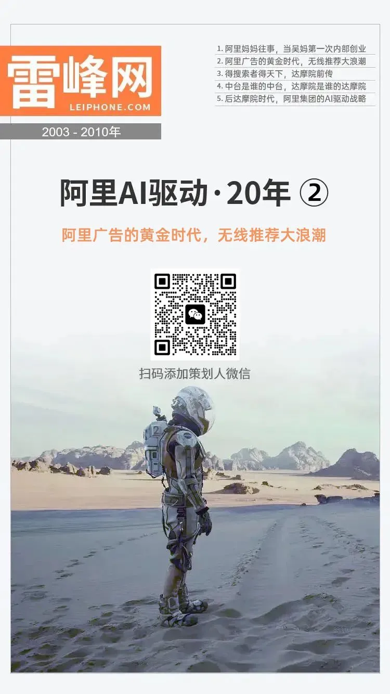
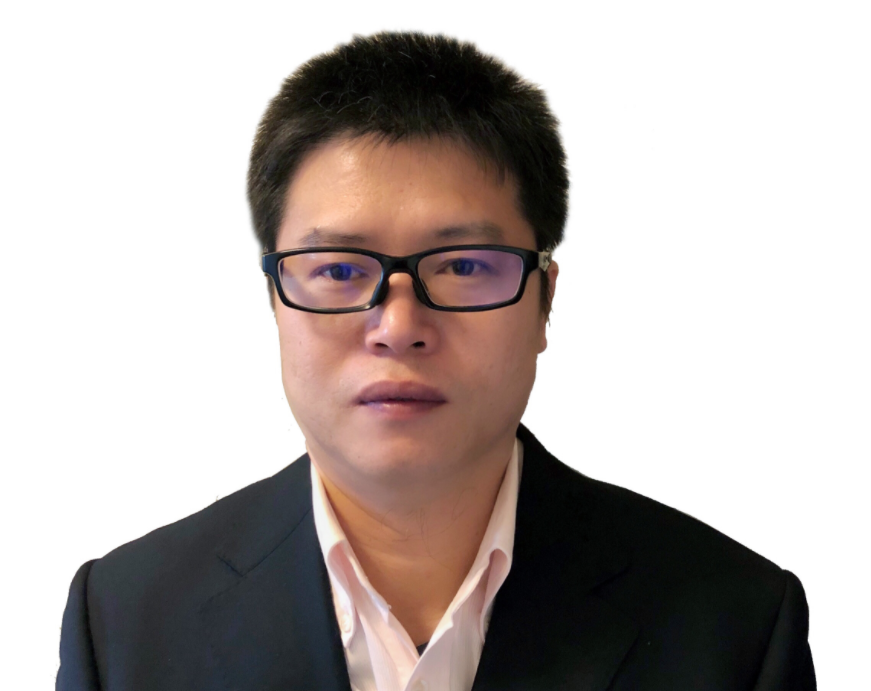
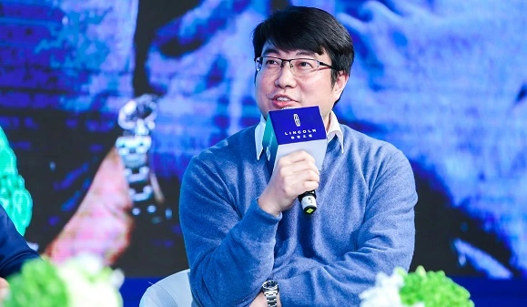
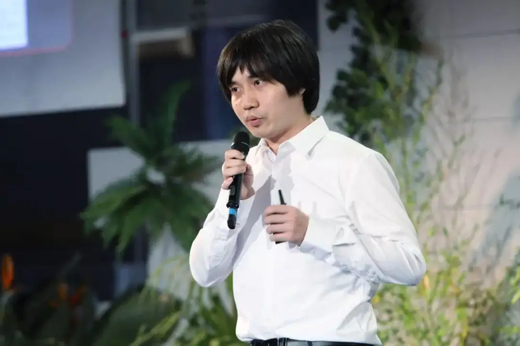
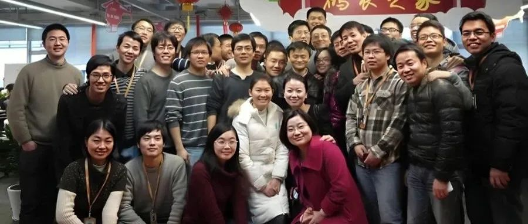

Title: 阿里广告的黄金时代：无线推荐大浪潮

URL Source: https://mp.weixin.qq.com/s/npBEqDN1lga-9e8QjgDb7A

Markdown Content:

**推荐算法造就了阿里妈妈过去的荣光，也是阿里在AI电商时代重现辉煌的关键。**

”

作者 | 刘   伟

编辑 | 林觉民

去年9月，吴泳铭出任阿里巴巴集团新一任CEO后，提出“用户为先、AI驱动”两大战略重心。

作为阿里最早将AI应用落地的业务单元，以及吴泳铭在阿里第一次内部创业的项目，阿里妈妈格外受到关注。

在[《阿里妈妈往事，当吴妈第一次内部创业》](https://mp.weixin.qq.com/s?__biz=MTM2ODM0ODYyMQ==&mid=2651651753&idx=1&sn=b25d9151cf80c0655dd264628f9cd266&scene=21#wechat_redirect)一文中，我们回顾了阿里妈妈初创时期的跌宕起伏。本文将在此基础上继续讲述，阿里妈妈是如何将AI技术创新应用在广告推荐算法中，并迎来属于自己的全盛时代的。

了解了阿里妈妈的这些辉煌历程，我们才能够更好地畅想和展望，马云和吴妈所期待下的“AI电商时代的阿里”。

（左林右狸社群招募中，链接一线业者和投资人，欢迎能为我们提供新观点新角度新信息的群友，可以加群主微信（****aqingcjx****）申请加入）

**01**

### **吴雪军曲折“入淘”，招来青年才俊**

2010年5月，吴雪军（铁相）从百度离职。

彼时，受Facebook影响，国内正掀起一波社交网络浪潮，人人网和开心网都是当时冉冉升起的未来之星。烈火烹油的态势下，吴雪军也不禁想投身到社交网络的浪潮中去看一看、闯一闯。几番搜寻后，他把目光锁定在了天涯社区。

2010年的天涯社区正处在高光时刻，大量的“天涯神帖”都出自这一时期，不过这已经是落日余晖。随着移动互联网的风暴席卷而来，微博、微信等移动社交媒体平台相继诞生。

移动互联网走的是深度垂直创新，而天涯当时还在走大而全的综合社区模式，加上内部无为而治，仅靠着几个没有工资的版主，根本打不过别人的公司化运作。它开始慢慢掉队。

加入天涯仅仅两个月，吴雪军就发现了问题所在。**在深入了解这家公司后，他认为，以天涯的团队和企业文化，在这里肯定实现不了自己的抱负。**

不愿在天涯蹉跎岁月的吴雪军，立即开始了规划自己人生的下一站。

其实加入天涯前，吴雪军还有另一个选择——淘宝的刘振飞（振飞）和梅坚（三多）曾向他抛出橄榄枝。吴雪军心动过，奈何当时已经接下了天涯的offer，他不愿失信于人，只能感叹一声“相见恨晚”，然后婉拒。

意识到天涯并非良主后，吴雪军又想起了刘振飞。也许是命中注定的缘分，尽管已经过去了两个月，淘宝的岗位依旧空悬。于是，吴雪军很顺利地就加入了淘宝广告技术部，担任算法团队负责人，向广告技术部的技术总负责人梅坚汇报。

吴雪军

事后来看，吴雪军加入淘宝可以说是赶上了好时候。**尽管当时广告技术部营收还很少，一天只有几十万，但已经开始进入到增长的快车道。**

2009年底，此前发展一直不温不火的钻石展位迎来了一次改版，在原来销售的资源外，额外开设了一个资源位——首页第三屏300\*250的一个位置。这对钻石展位来说，是一次里程碑式的改版。进入首页后，它拥有了足够大的流动性，整个模式开始有了运转的基础。

这一时期，淘宝广告技术部还推出了另外一条重要产品线——主打CPS模式的淘宝客。当时，媒体和流量端都热衷于做CPC营销，对淘宝客这样的CPS模式普遍持观望态度。因此，淘宝客诞生初期几乎没有遇到任何强大的直接对手。

同时，对于电商卖家而言，CPS天然就是一种低成本的营销模式——谁能帮我找到消费者并把东西卖出去，我就把提成给谁。

流量端找到了新的变现渠道，淘内商家也找到了合适的推广者，淘宝客想要连接的两端马上都有了大量的资源涌入。

**钻石展位（CPM）、淘宝客（CPS），再加上最早的直通车（CPC）业务，淘宝广告产品的三架马车就此成型，开始拉动营收高速增长。**

吴雪军加入后没多久，淘宝的广告营收就突破了每天100万元的大关。为此，团队还举行了一次十分隆重的庆功宴。

在吴雪军之前，阿里几乎没有有经验和有影响力的算法人才，因此他的加入就像一面大旗，树立起了阿里对算法人才的号召力。

加上阿里妈妈本身有着丰富的数据，且营收处于快速增长，其人才吸引力不断增加。于是团队那一时期陆续招揽了盖坤（靖世）、蒋龙（昙宗）、袁泉（袁全）、胡云华（吴钩）和严强（绍成）等一批青年才俊。其中，盖坤后来成为了阿里妈妈的门面人物，广为外界所熟知。

**02**

### **驰援手淘建设，推荐团队一分为二**

2012年，梅坚被调去负责其他业务，吴雪军从他手中接过了淘宝广告技术部。同年年底，淘宝广告技术部重新升级为阿里妈妈事业部。

当时，淘宝的营销业务中，有三项业务发展尤为显眼：一是淘宝客，二是Tanx，三是无线端的发展。三项业务之间的关系十分垂直，用户群和产品形式都差异巨大，很难用一个现有的名字去统一。内部讨论来讨论去，最后想到了阿里妈妈，这个品牌就此重启。

吴雪军统领阿里妈妈技术团队的时间很短。**2013年，阿里提出“all in无线”战略，开始从集团各个部门抽调人力发展手淘，吴雪军也在其列。**欢迎添加作者微信LW\_PLUS，了解阿里“all in 无线”背后的更多故事。

按照上级指示，吴雪军可以从手下筛选5-6名精兵强将追随自己一同前往手淘。于是他第一时间找到了负责推荐广告算法的袁泉，后者不仅欣然答应，还叫上了自己手下的得力干将严强。随后，吴雪军又陆续说服赵斌强（乐田）、周梁、王喆、江鹏（荐轩），组成了一支六人小分队，从北京奔赴杭州，驰援手淘建设。

**在团队的人员筛选上，吴雪军有两个标准：一是经验丰富，二是有能力、有潜力。**六人小分队中，袁泉和周梁都是经验丰富的老兵。其中，袁泉曾任职于IBM研究院，是国内最早一批做推荐算法的人。在IBM期间，他和当时在IBM实习、后来成为字节推荐系统负责人的项亮，一起发过KDD论文。

赵斌强也很资深，2008年就加入了阿里，先后在B2B和阿里云等业务待过，后来到阿里妈妈，在工程和算法方面都比较均衡。

严强虽然年轻，但也非常老道。2008年，推荐领域的技术大牛谷文栋和还在读博的项亮一起成立了面向推荐领域的专业社区ResysChina，经常举办一些小型聚会。当时还在中科院读研一的严强是社区聚会的常客。

王喆则属于动手能力很强的那一类，刚好可以和其他人互补。

至于被称作阿里算法天才的盖坤，虽然也是不可多得的青年才俊，但当时他的研究方向更侧重理论，和推荐算法离得稍微有些远，吴雪军只能忍痛放弃。

2013年11月，吴雪军带着6人小分队，从北京奔赴杭州，开始了一段艰苦的技术攻坚战。阿里的推荐团队也由此一分为二，一部分继续在阿里妈妈负责广告推荐，另一部分则在手淘做基于自然流量的推荐。

**那段时间，团队每周要工作六天，从早上9点一直忙到晚上9点，除了吃饭、睡觉，其他时间基本都在工作。剩下一天休息时间，大家就一起窝在宿舍里打DOTA，释放压力。**如今互联网行业的流行词996便是从那时候开始的。

吴雪军团队来到手淘后，做的第一个个性化产品是“有好货”。

2014年初，张勇从吴泳铭手中接过了手淘的大旗。这份沉重的担子，迫使他每天都在思考无线化应该怎么做。他甚至痴迷到，把手淘前三屏的页面打印出来，放在案头，每天琢磨哪个模块应该放在那个位置。后来是蒋凡给他出了个主意，说**既然不知道什么样的页面能被最多用户喜爱，就干脆做个性化好了，让每个用户都能看到不一样的页面。**

手淘个性化的第一个改造项目是“有好货”。

这个产品起初并不被高层所重视，在手淘页面中处于很边缘的位置，后来上了个性化推荐算法后，各项指标都非常不错，才被挪到了手淘第一屏的中间位置。

“有好货”的成功，坚定了张勇和蒋凡做个性化推荐的决心和信心，他们决定把推荐算法延伸到第二屏和第三屏。

当时，Facebook的feeds流已经崭露头角，于是“如何做电商的feeds流”开始提上手淘的日程。内部多次商讨后决定，做两列商品feeds流——也就是后来的“猜你喜欢”。蒋凡负责从产品和业务层面推进，后台算法则由袁泉负责。

“猜你喜欢”一开始只是简单复用了“有好货”的算法，仅展示10个商品。但后来团队发现，用户在公交、地铁上无聊的时候喜欢刷“猜你喜欢”，10个商品很快就刷完了，于是决定增加到20个、50个，结果发现还是不够刷，于是干脆设置成了“无限展示”。

**2014年年初，“猜你喜欢”刚上线的时候只有一二百万用户，到2017年已经日活过亿，成为了所有电商中最大的推荐产品。**

“猜你喜欢”所积累下来的技术和经验，后来也随着团队的人员流动，被带到各个电商平台开枝散叶。

“all in 无线”这场大仗，为阿里博得了一张通往移动互联网的船票。大战结束后，吴雪军带领的推荐算法团队，被合并到与阿里妈妈平级的搜索事业部，向部门一把手张勤（杨过）汇报。推荐算法和搜索团队逐渐走向融合。

不久，谷雪梅从谷歌中国研究院空降阿里，接管了搜索事业部。差不多时间，吴雪军从阿里离职。阿里的搜推团队从此进入了新的时代。

**03**

### **蒋龙筑牢地基，推荐算法开始崛起**

将时间的指针拨回到2013年底，吴雪军带领袁泉等人奔赴杭州后，阿里妈妈的技术团队便由薛贵荣(大数)和唐勇（十七）分而治之，唐勇负责搜索，其余归薛贵荣负责。

唐勇是一名老阿里，做系统架构出身，负责搭建了阿里的第一代广告系统架构，与吴泳铭、刘振飞等高管都十分相熟。薛贵荣则是唯一一个拿过两次微软学者奖学金的技术大牛，2009年加入阿里，在阿里云做过搜索，后被调到阿里妈妈，带领团队做出了阿里妈妈最重要的营销工具之一——达摩盘（DMP）。

当时，阿里妈妈的算法团队分成四条线——搜索、推荐、定向和Tanx。其中，袁泉负责推荐，龚笔宏（云雀）负责搜索，蒋龙负责定向。Tanx团队主要负责品牌广告，团队在杭州，用到的先进技术不多。

袁泉追随吴雪军去支援无线后，原本由他负责的推荐广告算法便移交给了蒋龙。**这样一来，手握推荐和定向广告两条线的蒋龙，便成为了阿里妈妈算法团队实质上的核心。**

蒋龙

蒋龙和吴雪军算是旧相识。早在2009年，吴雪军还在百度时，就曾通过猎头找到在微软亚洲研究院任职的蒋龙，向他抛出了橄榄枝。但蒋龙觉得百度并不适合自己，便婉言谢绝了。

两年后，已经加入阿里的吴雪军再次向蒋龙发出加盟邀请。两人在北京东三环泰康大厦的淘宝办公室里见了一面。

当时，身在微软亚洲研究院的蒋龙已经认识到了研究院模式的弊病——离产业化太远。传统软件时代，软件是刻在光盘里卖给用户的，如果软件出现了bug，用户不可能把光盘再退回去。因此，以微软为代表的传统软件厂商都有一套非常严格的产品开发流程——至少规划一年，开发两年，测试两年。一个技术从成熟，到真正到达用户手中，至少需要五年时间。

因此，**尽管当时微软的很多技术都非常领先，但等到产品化之后，往往已经落后于时代了。**

与之相对的是谷歌“小步快跑，快速迭代”的互联网模式。这种高效的产业化方式，对蒋龙造成了深深的震撼与冲击，并让他萌生了到互联网公司去看看的想法。

其实在此之前，微软亚洲研究院就已经有不少人才流失到互联网大厂，并取得了巨大成功，比如阿里云的王坚。这进一步坚定了蒋龙离开的想法。

不过，蒋龙并没有追随王坚的脚步加入阿里云，而是另有打算。

蒋龙想做人工智能，而做人工智能首要的是数据。搜索和广告都是数据十分丰富的场景，但二者又有很大的区别：当时搜索并不挣钱，只是一个改善用户体验的产品，而广告优化则能直接带来收入提升。

蒋龙认为，**只有一个业务能够给公司挣钱，公司才会在这上面持续投入。**因此，吴雪军邀请他加入阿里妈妈时，他几乎没怎么犹豫就选择了加入。他知道，这一定是个阿里会持续投入的业务。

不得不说，蒋龙的眼光确实毒辣。**在算法的加持下，阿里妈妈的营收很快迎来了爆发式增长，一度占到了阿里整体营收的八成以上。**

阿里妈妈赚钱夸张到了什么程度呢？**据说2013年之后，因为收入增长超预算过多，每到年底，阿里妈妈都要通过减少广告位、缩小广告图等方式来控制广告收入增长。**

有了源源不断的现金流入，阿里妈妈在技术上自然不吝投入。

早期，阿里妈妈的广告模型都是基于既定规则的，产品经理需要提前规划好排序等各项规则，然后通过算法来实现。这样做不仅效率低下，而且在规则设计上顾此失彼。为了解决这个问题，蒋龙加入后，带领团队搭建了一个真正由数据驱动的大规模机器学习系统。

为了搭建这套系统，蒋龙找集团申请了几个亿的预算，要建一个阿里最先进的算力集群。当时一台服务器售价几十万，集团大手一挥就直接采购了500台。

阿里的高管们其实并不懂算法细节，但蒋龙告诉他们，“你投入的这几亿，一年可以带来几十亿的营收增长”。高管们立马就知道该怎么做了。

反观袁泉们去的搜索团队就没这么幸运了。因为搜索的变现路径比较长，他们没法说清技术投入具体能带来怎样的收益，就很难获批更多的算力。有一段时间，只能找阿里妈妈借算力。欢迎添加作者微信LW\_PLUS，了解更多背后的有趣故事。

蒋龙搭建的大规模机器学习系统对阿里妈妈助益良多，**不过他最大的贡献还是在于，和算法委员会一起完成了阿里的算法人才标准制定和培训。**

阿里早期懂算法的人不多，吴雪军和蒋龙算是最早的一批算法人才。两人和徐盈辉（仁基）等人一起成立了阿里集团的第一届算法委员会。

算法委员会主要做了几件事：一是制定了阿里的算法人才标准，比如人才引进后怎么定级，P7/P8/P9的晋升标准分别是什么。二是搭建了阿里的算法体系，梳理了内部业务涉及的算法技术方向，以及在各个方向上分别涉及哪些问题，相当于在内部搭建了一个知识分享体系。三是为阿里培养了一批优秀的算法人才，委员会成员们亲自编写教材、上课，如今阿里的很多算法中坚力量都从中受益过。

这些为阿里妈妈后来攀向更高峰打下了扎实的基础。

2014年，阿里妈妈已经驶入了发展的快车道，但蒋龙却在晋升的前夕决定离开。

在他看来，尽管当时的阿里妈妈正如日中天，而且营收起码还能保持五年高速增长，但广告系统技术本身的迭代已经十分缓慢了，自己应该寻找一片更加广阔的天地来施展才华。

蒋龙离开后，将推荐算法团队的权杖交到了盖坤手中。

蒋龙觉得，盖坤跟自己很像，骨子里是同一类人。两人都有很超前的技术眼光，能够先别人一步看到技术的发展趋势。而且，**盖坤个性也比较温和，掌控欲不强，能够给下属很高的自由度，同时能提供足够多的支持。**

同事评价盖坤，虽然不是那种热情洋溢，特别会来事儿的性格，但情商绝对不低，可以非常敏锐地捕捉到对方的情绪并做出反应。

这些个性和特质，让他有机会成为一个出色的团队leader。

当然，更重要的是，**盖坤在阿里妈妈做出的成绩足以服众。**

**04**

### **盖坤接过权杖，阿里妈妈步入巅峰**

盖坤加入阿里的过程，颇具戏剧性。

盖坤是甘肃省高考状元。加入阿里前，他在清华大学读博，主攻机器学习和计算机视觉方向。还在学校时，盖坤就已经在学术界小有成就了，在国际顶尖期刊和会议上发表过多篇学术论文，还获得过中国人工智能协会优秀博士论文奖。

2011年，阿里在清华大学办了一场招聘宣讲会。当时，盖坤心心念念的是MSRA和IBM CRL这样的研究院，对加入企业兴趣不大，所以没去参加。

后来，盖坤很偶然看到了吴雪军发在水木清华论坛上的一个招聘帖子，帖子说阿里正在做一个大规模机器学习的东西。这勾起了他的兴趣，于是便回了一封私信。回完私信后，盖坤照常玩起了游戏，一直玩到凌晨两三点才睡。结果第二天一早八九点就被阿里巴巴的HR叫醒去面试。

几轮面试下来，盖坤发现，阿里在机器学习上有很强的决心，业务对相关技术的需求特别强烈，是个能够施展自己才华的舞台，便欣然选择了加入。

当然，阿里给出的条件也很诱人，直接给了他P7，而一般应届生都是P6。**这一方面是因为阿里看重盖坤的潜力，另一方面也是因为他的博士课题跟阿里的广告算法很像，成果可以直接迁移应用。**而盖坤也不负所望，一年后升P8，又过两年升P9，再过三年到P10，是阿里升P10最快的人之一。

盖坤

2011年，盖坤刚进阿里不久，就突破主流大规模线性模型的思路，创造性地提出了MLR（mixed logistic regression）算法，一举打响了自己“算法天才”的名号。

MLR算法创新地提出并实现了直接在原始空间学习特征之间的非线性关系，基于数据自动发掘可推广的模式，相比于人工，效率和精度均有了大幅提升。

从2013年起，MLR算法在阿里妈妈及阿里集团多个BU的主要场景(包括阿里妈妈精准定向广告、淘宝客、神马商业广告、淘宝主搜等等）被大规模地应用和尝试，尤其是在阿里妈妈的精准定向广告场景，**算法模型创新带来了业务上的重大突破，主要场景下的CTR和RPM均获得了20%以上的提升。**

稍显遗憾的是，MLR算法在业界并没有被大规模采纳。这一方面是因为，阿里直到2017年才以论文的形式开源MLR算法，因此很长一段时间里外界并不清楚MLR模型的实现细节。另一方面则是因为，传统LR+特征工程的解法深深影响了很多技术团队的思考方式和组织结构。

2017年，盖坤领导的阿里妈妈精准定向检索及基础算法团队又提出了另一个重要的推荐系统模型——深度兴趣网络(DIN,Deep Interest Network)，首次将深度学习应用在阿里妈妈。该模型提出用户的兴趣是多样的，并利用深度学习充分利用/挖掘用户历史行为数据中的信息来提高CTR预估的性能。

随着MLR和DIN等算法模型陆续提出，那几年，阿里妈妈无论是在营收规模还是技术影响力上，都走在了行业前列。

一个侧面的例证是，2015年前后字节曾大面积挖角阿里的算法团队，但成功率不高。原因在于，当时阿里无论在团队氛围、论文产出速度、工作成就感还是薪酬待遇方面都十分有竞争力。据阿里妈妈当时的成员回忆，“哪怕是一个P5的实习生，加入不久都能发论文”。

不过对于盖坤来说，尽管凭借几项关键技术突破成为了名噪一时的技术天才，但他也有自己的烦恼——缺少对业务的掌控权。

任何技术突破都需要落到具体的业务场景中才能发挥价值，否则就只是一堆0和1组成的代码而已。

阿里妈妈最赚钱的业务一直是直通车，但直通车并不在盖坤手中，他只负责精准展示广告。而且精准展示广告所依赖的生态——猜你喜欢等推荐板块，也掌握在搜索事业部的推荐团队手中，盖坤并没有绝对话语权。甚至搜索事业部还反过来对盖坤手中的业务虎视眈眈。

2017年初，阿里搜索事业部的王晓博（永叔）开始带队做信息流（王晓博如今在小红书担任技术副总裁）。有了信息流，时任搜索事业部负责人谷雪梅很自然地就想到了开广告位做商业闭环。尽管这部分工作一直是阿里妈妈在负责，但谷雪梅认为，搜索事业部一样也能做，甚至还能做得更好。

因为这事，搜索事业部和阿里妈妈的矛盾不断激化。矛盾上升到高层后，内部决定让两支团队来一次正面PK，让双方同时做一部分信息流和广告推荐，通过分桶测试看谁效果更好。谁赢了业务就归谁。

阿里妈妈这边派出了盖坤，搜索事业部则由王晓博带队，一场针尖对麦芒的PK就此开始。

戏剧的是，搜索事业部有个员工，为了增加己方的胜算，在产品设计上动了点小心思。她在信息流页面的右下角设计了一个小助手的按钮，用户如果不喜欢前面的内容，一点这个按钮就可以跳到自己喜欢的位置。这个按钮可以通过算法来控制出现的频率，这位员工便在这个环节动起了手脚，使得盖坤所在的测试桶出现小助手按钮的频率要更低一些。

没想到，这个作弊行为被阿里妈妈抓住了把柄，还直接捅到了廉政部。廉政部调查过程中，作为搜索事业部负责人的谷雪梅据理力争，认为这次作弊行为对结果的实际影响非常小（实测结果只有3‰），不值得大动干戈。但不管怎么说，在PK中作弊，搜索事业部总是理亏在先。

最后高层一讨论，觉得既然谷雪梅这么喜欢做广告，甚至为此跟阿里妈妈吵得不可开交，就干脆让她去阿里妈妈好了。就这样，谷雪梅带着搜索事业部中的推荐算法团队加入阿里妈妈，成为了技术总负责人。代价是，失去了对搜索团队的掌控。

随着谷雪梅来到阿里妈妈，“all in 无线”时一拆为二的推荐算法团队，又重新走向了融合。

遗憾的是，谷雪梅在阿里妈妈只待了很短一段时间便离开。

她和当时的阿里妈妈总裁朱顺炎在用人思路上分歧很大，关系一直不算融洽。谷雪梅是技术出身，喜欢系统化、理论化和富有条理的人，盖坤因此深得她器重。而朱顺炎是市场营销出身，曾负责UC浏览器的市场推广及商业化体系搭建，他提倡客户至上，更器重淘宝直播车的胡云华（吴钩）。

理念上的差异，使得两人开会时经常带有对立情绪。谷雪梅因此在阿里妈妈待得非常不开心，恰好当时菜鸟CTO王文彬（菲青_）_退休，菜鸟需要一名新的技术带头人，谷雪梅便转头去了菜鸟担任CTO。欢迎添加作者微信LW\_PLUS，了解更多背后的故事细节。

后来有一次在菜鸟大会上，有人问谷雪梅为什么从阿里妈妈离开，她直言不讳地说道，“我搞不定搜索广告负责人”。

而朱顺炎也在不久后卸任阿里妈妈总裁，出任阿里大UC事业群总裁。阿里妈妈开始频繁换帅，先后经历了董本洪（张无忌）、张忆芬（赵敏）和蒋凡管理的时代。

**05**

### **后记**

2010-2017，是阿里发展最快的几年，而阿里妈妈正是提供澎湃动力的重要引擎。

这段时间的阿里，业绩蒸蒸日上，眼望星辰大海，为一大批像吴雪军、蒋龙和盖坤这样兼具才华与抱负的技术人才，提供了尽情挥洒才华的舞台。

群星交相辉映，造就了阿里妈妈的黄金时代，而阿里妈妈这个广阔的舞台，也使得他们的光芒被更多人所看到。

如今，当年这群筚路蓝缕的人，很多已经离开了阿里，把在这里积累的眼界与经验带到了更多公司和领域，散作漫天繁星。这是阿里人精神的传承与延续。

而阿里妈妈依旧是阿里集团最重要的钱袋子和掌管流量分配的业务核心。

当下的阿里正处于剧烈的变革当中，如何更好地分配流量以实现效率和用户体验最优，是这场变革中最核心和关键的命题。

去年，阿里提出“用户为先、AI驱动”两大战略。阿里妈妈作为阿里AI文化的源头以及当下变革的暴风眼，承载着无数人的期待。

大家盼望着，这个曾带给阿里无数荣光的业务，能够帮助阿里实现王者归来，在AI电商时代书写新的辉煌。

关于阿里AI发展的故事，雷峰网将继续推出阿里AI驱动·20年系列文章，《得搜索者得天下，达摩院前传》《中台是谁的中台，达摩院是谁的达摩院》《后达摩院时代，阿里集团的AI驱动战略》，感兴趣的读者请联系作者沟通交流（微信 **LW\_PLUS**）。

//

**近期热门文章**

[ 阿里妈妈往事，当吴妈第一次内部创业](https://mp.weixin.qq.com/s?__biz=MTM2ODM0ODYyMQ==&mid=2651651753&idx=1&sn=b25d9151cf80c0655dd264628f9cd266&chksm=6248fe0b553f771d2adac6d927261a243bc163a7921cfb5cf681d585c4f05472c65a62e276be&scene=21#wechat_redirect)

  

[ 阿里云「敢死队」](https://mp.weixin.qq.com/s?__biz=MTM2ODM0ODYyMQ==&mid=2651680656&idx=1&sn=ab6ce1741fdf692b551e2c933ce1cb17&chksm=62496f32553ee62419b9c16a06b7bb0d07539d60e2de190d942a1b13cc4d4a41a068dc78201b&scene=21#wechat_redirect)

  

[ 张勇 All in 阿里云](https://mp.weixin.qq.com/s?__biz=MTM2ODM0ODYyMQ==&mid=2651629173&idx=1&sn=2f80bc4dc555dd5b3f322faa0f3c0f21&chksm=6248a6d7553f2fc1de378759966d8ea91fc98e7ee787865e86853585e7bea6dcfdfc2de68d1a&scene=21#wechat_redirect)

